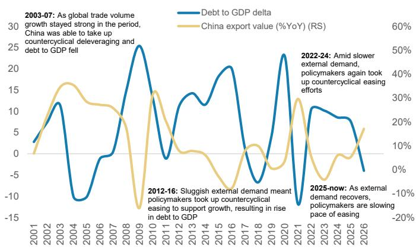
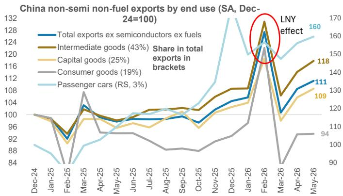
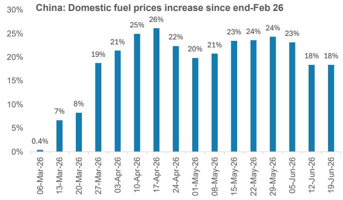

# China's Reflation Is Real but Incomplete: The Export-Driven Cycle Cannot Solve Structural Weakness Alone

The recent positive turn in China's producer price index after three and a half years of deflation has generated premature optimism that the economy has finally turned the corner on its reflation journey. This interpretation is misleading. The PPI uptick has been driven overwhelmingly by higher oil prices and commodity costs, not by a genuine recovery in domestic pricing power across the broader economy. The non-commodity sector, which represents the vast majority of industrial activity, has seen its profit margins remain flat, and retail sales have actually contracted in May. These are not the signals of a sustainable reflationary transition.

The real story is more nuanced and strategically important. China is entering a phase where cyclical forces—driven primarily by a sustained export boom linked to Asia's industrial and capital expenditure supercycle—will provide a modest lift to inflation, wage growth, and consumption. But this cyclical improvement will operate within powerful structural constraints that policymakers have shown limited appetite to address. The result is an economy that will experience a partial, uneven reflation, but one that falls well short of the normalized 2-3% GDP deflator that would signal a fully healthy macroeconomic environment.

Understanding this dynamic is essential for investors, corporate strategists, and policymakers alike. The distinction between a cyclical uptick and a structural normalization determines everything from asset allocation decisions to corporate pricing strategies to policy expectations. The evidence suggests that while the export channel will create real but contained improvements in corporate margins and household incomes, the deeper issues of demographic decline, property sector adjustment, and inadequate social security will continue to suppress domestic demand and keep inflation structurally below target.

Three interrelated questions frame the analysis that follows. First, what exactly is driving the current improvement in inflation metrics, and how much of it is sustainable? Second, why have the structural headwinds proven so resistant to policy intervention? Third, what specific indicators should investors track to distinguish between genuine reflation and a temporary cyclical bounce? The answers reveal an economy making progress but still navigating a transition that will take years, not quarters, to complete.

## The Recent PPI Improvement Is a Commodity Story, Not a Reflation Story

The headline numbers look encouraging at first glance. China's PPI has turned positive year-on-year after an extended period in deflationary territory. But this improvement is almost entirely attributable to higher global oil prices and commodity costs, not to a broad-based recovery in domestic industrial pricing power. When oil prices reverse their earlier gains—as they have begun to do—the headline PPI will follow suit, revealing the underlying weakness that remains in the non-commodity sector.

The critical distinction here is between commodity and non-commodity PPI. Commodity PPI has been elevated due to the energy shock, and this has mechanically lifted the headline index. But non-commodity sector profit margins have not improved. In fact, they have remained essentially flat, which tells us that companies outside the commodity space have not regained the ability to pass through costs or raise prices. This is the hallmark of an economy still operating with significant excess capacity and weak demand.

Why does this matter? Because pricing power in the non-commodity sector is the true test of reflation. It reflects the underlying balance between supply and demand in the broad economy. When non-commodity margins are compressed and flat, it indicates that companies are absorbing cost increases rather than passing them through, which in turn constrains their ability to raise wages. And without wage growth, the consumption-led reflation that policymakers ultimately need remains out of reach.

The implication is clear: the recent PPI improvement has been a statistical artifact of commodity price movements, not a signal that China's deflationary pressures are genuinely abating. Investors who interpret the headline data as evidence of a sustainable reflation are likely to be disappointed when oil prices stabilize or decline, revealing the underlying weakness that remains.

## Three Cyclical Forces Have Suppressed Domestic Demand, but the Export Channel Is Now Shifting the Balance

Understanding why reflation has been held back requires examining three cyclical factors that have operated simultaneously to suppress domestic demand. The first is the withdrawal of policy stimulus. Chinese policymakers have historically followed a countercyclical playbook: when external demand is strong, they pull back on domestic stimulus. This pattern has repeated in the current cycle. After a strong first quarter for GDP growth and robust export momentum, the augmented fiscal deficit narrowed from 11.9% of GDP in January to 10.9% by May. Infrastructure fixed asset investment slowed dramatically, from 9.2% year-on-year in the first quarter to -10.8% in May. This fiscal withdrawal directly weakened domestic demand at exactly the moment when household consumption was already under pressure.

The second factor is the lingering impact of weak wage growth. Industrial profit growth has picked up year-to-date, but this has been concentrated in commodity sectors. Non-commodity profit margins have stabilized at relatively weak levels, and consensus earnings growth for the CSI300 in the first quarter was only 6%. Reflecting this, wage growth remains subdued at 4.9% year-on-year. When wages are growing slowly, consumption cannot accelerate meaningfully, and the effects of earlier consumption stimulus programs—such as the trade-in program for consumer durables—fade quickly once the policy support is removed.

The third factor is the impact of higher oil prices on consumer purchasing power. Domestic gasoline prices rose by as much as 26% from their recent trough, and fuel CPI accelerated to 21% year-on-year in May. Given that fuel and electricity together account for approximately 11% of the CPI basket, this energy price shock directly reduced households' real disposable income and weighed on consumption of other goods and services. The good news is that international oil prices have recently moved lower, which will reduce this drag going forward.

Taken together, these three factors explain why domestic demand has remained soft despite the headline improvement in exports and industrial production. But the balance is now shifting. The export channel is strengthening, and this will gradually feed through to corporate margins and wages. The key question is how much of an impact this can have given the structural constraints that remain in place.

## Structural Headwinds from Demographics, Property, and Social Security Will Prevent a Full Normalization

The cyclical improvement from exports is real and should not be dismissed. But it will operate within a structural environment that fundamentally limits the economy's ability to generate sustained 2-3% inflation. Three structural factors are particularly important, and they are deeply intertwined.

The first is demographics. China's working-age population aged 15-64 has declined from a peak of one billion in 2015 to approximately 990 million currently, and the total population has been contracting since 2022. This demographic drag reduces potential growth and aggregate demand in a structural, not cyclical, manner. It is not something that policy stimulus can easily offset, because it reflects a permanent shift in the economy's underlying demand structure.

The second factor is the property sector adjustment. The demographic decline has structurally reduced housing demand, and property prices have remained weak as a result. The sector has already undergone an extensive correction: real estate fixed asset investment, excluding land costs, has fallen from 16% of GDP at its peak in 2014 to just 6% in 2025, below even 2004 levels. This means the property sector will exert less of a drag on the broader economy going forward, but it also means it will not be a significant growth driver. The sector has shrunk to a point where it can no longer be a source of positive momentum, only a reduced source of negative drag.

The third and perhaps most important structural factor is the lack of an adequate social security safety net. China's household savings rate remains elevated at 32%, compared to 23% in India, 4.6% in the United States, and 4.1% in Japan. This reflects large precautionary savings, particularly among the 300 million migrant workers who lack access to social services in the cities where they work. Until households feel secure enough to reduce their savings and increase consumption, domestic demand will remain structurally constrained.

The critical insight is that these three factors are mutually reinforcing. Weak demographics reduce property demand, which depresses household wealth and confidence, which increases precautionary savings, which weakens consumption, which reduces corporate pricing power and wage growth, which further depresses confidence. Breaking this cycle requires policy intervention on the social security front, but policymakers have shown limited appetite for the large-scale, permanent increases in social welfare spending that would be required.

## What the Report Does Not Fully Answer: The Threshold Question for Policy Action

The analysis raises a question that the report does not fully resolve: at what point do the structural headwinds become severe enough to force a change in policy approach? The current policy framework remains focused on a tech-led, supply-centric growth model, with social welfare reforms proceeding only gradually. The 15th Five-Year Plan has affirmed this direction. But the persistence of below-target inflation and weak domestic demand creates a tension that will eventually need to be addressed.

The report implicitly suggests that policymakers are willing to tolerate a prolonged period of below-normal inflation as long as exports remain strong and the labor market does not deteriorate sharply. But this raises a second-order question: what happens if the export cycle weakens? The Asia capex supercycle is driven by multiple medium-term factors including energy transition, defense spending, AI infrastructure, and industrial supply chain diversification. These are not short-lived trends, but they are not immune to global economic cycles either. A slowdown in global demand would simultaneously weaken China's export engine and expose the underlying domestic demand weakness, potentially forcing policymakers to reconsider their gradualist approach.

There is also an open question about the threshold for labor market stress. The report notes that policymakers have slowed new manufacturing investment growth but are not aggressively cutting existing excess capacity due to concerns about labor market implications. This suggests that employment considerations are a binding constraint on supply-side reform. But as the export recovery broadens and capacity utilization improves, the political calculus may shift. A stronger external sector could actually provide the cover needed to accelerate structural reforms, or it could reduce the urgency to act. The direction of causation is not yet clear.

## A Decision Framework for Tracking China's Reflation Progress

For investors and corporate strategists, the key challenge is distinguishing between genuine reflation and a temporary cyclical bounce. The report provides a clear framework based on three leading indicators that should be tracked sequentially.

The first indicator is non-commodity sector profit margins. This is the most direct measure of whether companies outside the commodity space are regaining pricing power. The mechanism works as follows: sustained export growth will gradually lift capacity utilization, which will improve pricing power, which will expand margins. But the report cautions that this will happen with a lag, because capacity utilization has only just begun to improve from low levels and progress on addressing excess capacity remains gradual. Investors should watch for a sustained expansion in non-commodity margins as the first signal that the export recovery is translating into genuine corporate pricing power.

The second indicator is wage growth. Higher profit margins in the non-commodity sector will eventually give companies the confidence and financial room to increase wages. This is the transmission mechanism from corporate profitability to household income to consumption. The report notes that wage growth has been weak at 4.9% year-on-year, and it will take several quarters of sustained margin improvement before this begins to accelerate meaningfully. Tracking wage data across different sectors and regions will provide an early read on whether the export recovery is reaching households.

The third indicator is retail sales. This is the most comprehensive high-frequency measure of consumption growth. The recent contraction in retail sales reflects the fading of earlier stimulus programs and the drag from higher oil prices. As wage growth improves and the oil price drag recedes, retail sales should recover. But the pace of recovery will reveal whether the consumption uplift is merely a cyclical bounce from a low base or the beginning of a more sustained improvement in household demand.

The decision framework is therefore sequential: first watch non-commodity margins, then wage growth, then retail sales. If all three show sustained improvement, it would suggest that the export channel is successfully transmitting through to domestic demand. If margins improve but wages and consumption do not follow, it would suggest that structural headwinds are still dominating the transmission mechanism.

## The Community Question: What Comes Next After the Cyclical Uplift Fades

The most important unresolved question is what happens after the current cyclical uplift runs its course. The export-driven improvement will provide a meaningful but contained boost to inflation, corporate margins, and wages over the next several quarters. But unless structural reforms address the underlying weaknesses in property demand and social security, this improvement will eventually plateau at a level well below the 2-3% GDP deflator that would indicate a fully normalized economy.

This creates a strategic challenge for investors. The cyclical uplift creates opportunities in sectors that are leveraged to the export recovery and the associated improvement in industrial margins. But the structural constraints suggest that domestic consumption plays, particularly those dependent on a sustained improvement in household spending, may face headwinds that persist beyond the current cycle. Distinguishing between these two categories of exposure will be critical for portfolio construction over the next twelve to eighteen months.

The report's analysis also raises a deeper question about the nature of China's growth model. The tech-led, supply-centric approach has delivered impressive results in manufacturing and exports, but it has not yet solved the consumption puzzle. The current cycle represents a test of whether export-led growth can gradually pull the domestic economy along with it, or whether the structural constraints are too powerful to be overcome by external demand alone.

Join the community to read the full report and review the original charts.

*This article is for learning and discussion only and does not constitute investment advice.*

Personal reading notes and learning share only. Not investment advice.

