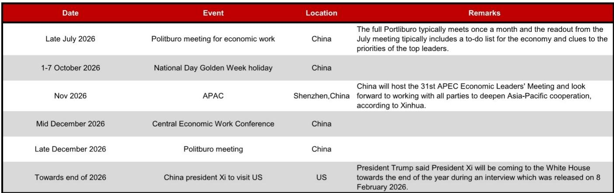
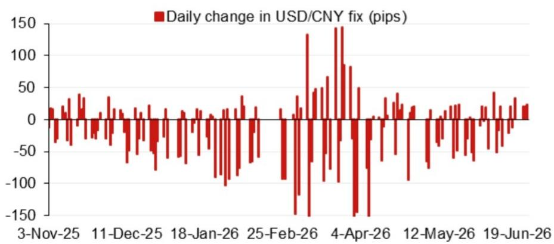
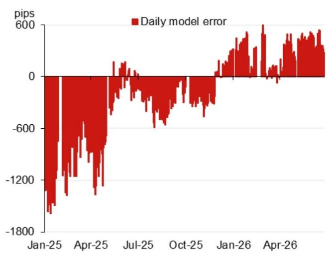

# NOM：人民币中间价模型已释放一个明确信号

人民币兑美元中间价的定价模型，正在发生值得关注的偏移。NOM亚洲外汇策略团队最新发布的模型测算显示，其核心预测值较前次下调了152个基点，计入逆周期因子后的预测值也较前次下调了124个基点。这不是一次简单的技术调整，而是模型层面透露出一个信号：在外部压力与内部目标之间，政策天平正在微妙移动。

这份报告的价值不在于给出一个具体的汇率预测数字，而在于它拆解了影响中间价的两个关键变量——模型本身如何定价，以及逆周期因子如何介入。对于关注人民币资产定价、跨境资本流动和出口企业汇兑风险的读者而言，理解这两个变量的变化方向，比知道6.80还是6.81更重要。

## 1. 模型预测的下调并非孤立事件，而是连续误差修正的延续

NOM模型的最新预测值为6.8043，较前次官方预测值6.8195低了152个基点。更值得注意的是，这并非一次性的技术修正。报告附带的模型误差图显示，近期模型预测值与实际中间价之间的偏差已经持续了一段时间。误差不是随机波动，而是呈现出方向性。

这意味着什么？模型是根据一系列可量化的输入变量——包括隔夜美元指数变动、主要货币对走势、市场情绪指标等——来生成预测的。当模型持续高估或低估实际中间价时，通常有两种解释：一是模型遗漏了某些关键变量，二是政策当局在模型之外施加了额外的影响。NOM的这份报告通过同时呈现“不含逆周期因子的模型预测”和“含逆周期因子的模型预测”，实际上为读者提供了一个观察窗口：哪些变化来自市场，哪些变化来自政策。

> **KC评论：** 理解这份报告的关键不在于记住6.8043这个数字，而在于看懂它比前次预测低了152个基点。这意味着模型认为人民币应该比此前预期的更强。如果读者只看最终中间价数字，会错过模型层面方向性变化的信号。完整报告中的误差图可以直观展示这种趋势是否在加速。

## 2. 逆周期因子的介入力度正在减弱，政策干预的边界在收窄

NOM报告提供了两组预测值：不含逆周期因子的模型预测为6.8043，含逆周期因子的预测为6.8071。两者之间的差值仅为28个基点。这个差值就是当前逆周期因子对中间价的“加码”幅度。

对比历史数据，逆周期因子在人民币贬值压力较大时期，其调节幅度可以高达数百个基点。当前28个基点的差值，说明政策当局对中间价的主动干预已经降到极低水平。这不是因为外部压力消失，而是因为政策逻辑发生了变化——在当前的汇率形成机制下，模型本身已经在朝着政策合意的方向运行，逆周期因子不再需要大幅介入。

这种变化对市场参与者有直接含义：中间价的波动将更多地反映模型输入变量的变化，而非政策的临时调整。这意味着隔夜美元走势、一篮子货币变动等外部因素对次日中间价的影响权重在上升。对于做市商和外汇交易员而言，模型预测的参考价值在提升，政策不确定性的溢价在下降。

## 3. 2026年下半年的事件日历构成了人民币汇率的关键压力测试

NOM报告附带的未来事件日历，表面上只是一份时间表，实际上是一份“压力测试清单”。7月政治局会议、10月国庆黄金周、11月深圳APEC会议、12月中央经济工作会议和政治局会议，以及年底前中国国家主席习近平对美国的访问——这些事件密集排列在下半年，每一件都可能成为影响汇率预期的催化剂。

尤其值得关注的是年底前的中美元首会晤。报告引用特朗普在2月8日采访中的表态，称习近平主席将在年底前访问白宫。这一事件的特殊性在于，它既可能成为缓解贸易紧张关系的契机，也可能因为双方预期落差而加剧市场波动。在APEC深圳会议之后紧接着安排元首访问，时间窗口非常紧凑。

对于企业财务管理者而言，这意味着下半年的汇率风险管理窗口正在收窄。如果等到事件结果明朗再调整对冲头寸，可能已经错过了最佳时机。报告没有直接给出交易建议，但事件日历本身已经暗示了波动率的潜在上升路径。

> **KC评论：** NOM这份报告最被低估的价值在于它提供了事件的时间轴。很多市场参与者只关注模型数字，忽视了这些事件对汇率预期的重塑作用。完整报告中还包含更详细的模型输入变量拆解，可以帮助读者判断每个事件对中间价的可能影响方向。

## 4. 模型尚未完全回答的关键问题：当外部冲击与内部目标冲突时，政策将如何排序？

这份报告给出了清晰的模型预测和逆周期因子估算，但它也留下了一个未完全回答的问题：当模型指向的方向与政策目标出现系统性偏离时，决策者会如何取舍？

例如，如果下半年美元因美国经济韧性或地缘政治风险而大幅走强，模型预测值可能指向人民币贬值方向。但与此同时，国内经济复苏需要稳定的汇率预期来吸引外资流入，APEC会议和元首访问也需要营造积极的合作氛围。在这种情况下，是让模型继续主导定价，还是重新加大逆周期因子的介入力度？

NOM报告提供了观察框架，但没有给出答案。这恰恰是读者需要自己判断的部分。模型的预测能力在正常市场环境下是可靠的，但在政策目标与市场信号出现冲突时，模型的边界就会显现。理解这个边界在哪里，比理解模型本身更重要。

## 5. 对读者的观察框架：关注三个信号，而不是一个数字

基于NOM这份报告的分析逻辑，读者在跟踪人民币汇率走势时，应该建立以下三个观察维度，而不是仅仅关注每日中间价的绝对水平。

第一，模型误差的方向和幅度。如果模型持续高估或低估实际中间价，且误差在扩大，说明有模型之外的力量在起作用。这时需要判断是逆周期因子的介入，还是模型本身需要调整。

第二，逆周期因子的变化趋势。当前28个基点的差值处于历史低位，但如果这个差值开始扩大，意味着政策当局在重新校准干预力度。扩大的方向（是抑制贬值还是抑制升值）同样重要。

第三，事件驱动的预期变化。7月政治局会议对经济工作的定调、APEC会议期间的双边互动、以及元首访问前的舆论铺垫，这些都会通过影响市场预期来间接影响模型输入变量。预期变化往往领先于实际政策调整。

> **KC评论：** 这三个信号中，最容易被忽视的是模型误差的持续性。一份报告中的单次误差可能是随机波动，但连续多日的方向性误差就是信号。NOM的每日模型更新恰好提供了这种连续性观察的基础，这是周度或月度报告无法替代的。

人民币汇率的定价机制正在变得更加透明和市场化，但这并不意味着政策退出了游戏。NOM这份报告的核心贡献在于，它把政策干预从“黑箱”变成了“可观测的变量”。对于需要管理汇率风险的读者而言，理解这个变量何时会重新介入，比追逐每日中间价的波动更有价值。

---

以上讨论只是基于NOM这份报告的初步解读。完整报告中还包含了更多关于模型输入变量的权重分析、历史误差的统计特征、以及不同情景下的压力测试。每天，我们的AI agent与人工团队会从国际投行报告中筛选出最有价值的中文摘要与KC评论，整理成约10-40页的daily更新，包含当天最新数据图表合集。这些内容既方便直接喂给AI进行二次分析，也方便人工快速把握全球市场动态。如果你对人民币汇率定价机制的更深入拆解感兴趣，欢迎加入我们的星球微信群继续讨论。

Personal reading notes and learning share only. Not investment advice.

