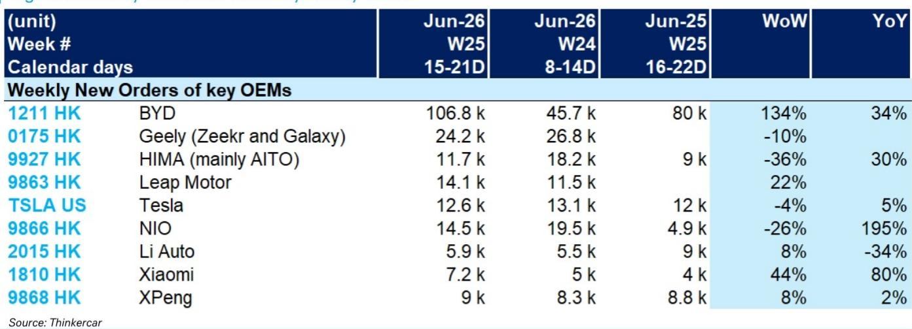
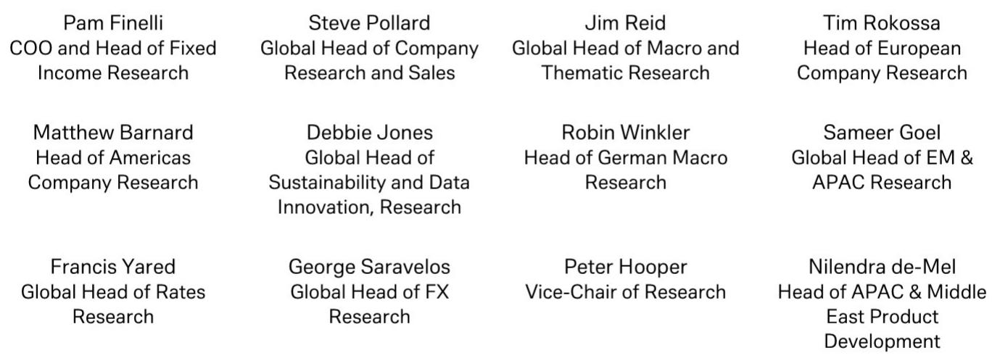

# DB：中国新能源车订单的“冰火两重天”已到关键分水岭

中国新能源汽车市场正在经历一个罕见的“订单分裂”时刻。DB最新发布的周度订单追踪数据显示，2026年6月第三周，头部车企的周订单量呈现出截然不同的方向：比亚迪单周订单突破10万辆，环比暴增134%，而蔚来、华为鸿蒙智行（AITO）等品牌却出现两位数下滑。这不是简单的月度波动，而是竞争格局加速分化的信号。

这份报告的核心判断是：在价格战常态化、消费者预期趋于理性的背景下，订单数据的“冰火两重天”正在揭示一个更深层的结构性变化——规模效应和品牌心智的差距，正从利润表传导至订单簿。那些能持续将流量转化为订单、将订单转化为交付、将交付转化为口碑的车企，正在获得指数级的优势。而这一趋势，可能在未来2-3个季度内决定中国新能源车行业的最终座次。

为什么现在关注这个信号？因为6月第三周的数据恰好处于年中冲刺的关键节点。车企的促销政策、新车型上市节奏、以及消费者对补贴退坡的预期，都在这个时间窗口集中释放。DB的周度订单追踪，是市场上少数能实时捕捉这些动态的高频指标。它比月度销量数据更早揭示趋势，比市场情绪更接近真相。

## 1. 比亚迪单周破10万不是意外，而是规模效应的“临界点”爆发

6月第三周，比亚迪新订单达到10.68万辆，环比增长134%，同比增长34%。这是一个令人瞩目的数字。但更值得关注的是环比增速：前一周（6月第二周）订单仅为4.57万辆，而去年同期为8万辆。这种“前低后高”的节奏，反映出比亚迪在年中促销节点上的精准发力。

从结构上看，比亚迪的订单暴增并非来自单一车型的爆款效应，而是其“王朝+海洋”双网体系的全面开花。这种规模效应一旦形成，就会产生正向循环：更多的订单意味着更强的供应链议价权，更强的议价权意味着更低的成本，更低的成本又支撑更激进的价格策略。DB的数据显示，比亚迪的订单波动性正在降低，这意味着其客户基础已经从“价格敏感型”转向“品牌忠诚型”。

> **KC评论：** 比亚迪的订单数据说明，在新能源车行业，规模已经不是护城河，而是“入场券”。真正的护城河在于，当规模达到某个临界点后，能否将规模转化为对上游供应商的议价权和对下游消费者的定价权。比亚迪正在证明它可以。但其他车企能否复制？答案藏在它们各自的订单结构里。

## 2. 蔚来订单同比暴增195%，但环比骤降26%——“以价换量”的可持续性存疑

蔚来6月第三周订单为1.45万辆，同比暴增195%，但环比下降26%。这个反差值得深究。195%的同比增速确实亮眼，但需要注意到去年同期基数极低（仅0.49万辆）。环比26%的下滑，则暗示促销活动的边际效应正在递减。

蔚来的问题在于，它的订单增长高度依赖新车型和促销政策的短期刺激。一旦促销力度减弱或竞品推出更有吸引力的方案，订单就会迅速回落。这种“脉冲式”增长模式，在行业整体增速放缓的背景下，很难转化为可持续的竞争优势。

更关键的是，蔚来的订单波动率在所有追踪车企中是最高的之一。这意味着其客户群对价格和促销的敏感度极高，品牌溢价尚未真正建立。DB的图表显示，蔚来的周订单曲线在5月下旬至6月初经历了一轮快速拉升，但随后迅速回落，呈现出典型的“脉冲”特征。

## 3. 理想汽车订单同比降34%，环比仅微增8%——中高端市场的“天花板”正在显现

理想汽车6月第三周订单为0.59万辆，同比下降34%，环比仅增长8%。这是所有追踪车企中同比降幅最大的。理想的问题不在于产品力，而在于其目标市场——30万元以上中大型SUV——正在遭遇需求瓶颈。

在价格战向中高端市场蔓延的背景下，理想的增程式技术路线虽然解决了里程焦虑，但未能有效抵御来自纯电车型和混动竞品的挤压。华为问界（AITO）的崛起，直接分流了理想的核心客户群。数据显示，问界6月第三周订单为1.17万辆，虽然环比下降36%，但同比仍增长30%，远优于理想。

> **KC评论：** 理想的困境说明，在中高端市场，“定位”比“技术”更重要。当市场出现多个定位相似的竞品时，最先被分流的一定是品牌心智最弱的那个。理想的订单数据，本质上是在回答一个问题：当消费者面临多个“家庭SUV”选项时，他们到底为什么选择你？

## 4. 小米汽车订单环比增44%，同比增80%——但“后发优势”能否持续仍需验证

小米汽车6月第三周订单为0.72万辆，环比增长44%，同比增长80%。这个增速在所有车企中仅次于比亚迪。小米的优势在于其强大的品牌号召力和线上线下融合的销售网络。但需要警惕的是，小米的订单基数仍然较低，且其增长主要来自SU7一款车型。

小米的“后发优势”体现在：它不需要像蔚来、小鹏那样从零开始建立品牌认知，小米的粉丝群体可以直接转化为潜在购车用户。但“后发劣势”同样明显：它进入市场时，消费者已经对新能源车有了更成熟的认知和更高的期望值。小米能否持续推出有竞争力的新车型，将是决定其订单增长可持续性的关键。

DB的报告没有直接给出结论，但图表显示，小米的订单曲线在5月中旬经历了一轮调整后，6月第三周再次回升。这种“W型”走势，暗示其订单增长可能受到产能和交付节奏的制约。

## 5. 特斯拉订单同比仅增5%，环比降4%——全球霸主在中国市场的“舒适区”正在缩小

特斯拉6月第三周订单为1.26万辆，同比增长5%，环比下降4%。这个增速在所有追踪车企中是最低的之一。特斯拉在中国市场的增长放缓，并非产品力下降，而是因为其“降价-订单-再降价”的策略循环正在失效。

当中国本土车企在15-25万元价格带展开激烈竞争时，特斯拉的Model 3和Model Y正面临前所未有的挤压。比亚迪、小鹏、甚至小米都在这个价格带推出了有竞争力的产品。特斯拉的品牌溢价虽然仍然存在，但正在被快速稀释。

> **KC评论：** 特斯拉的订单数据告诉我们一个残酷的事实：在新能源车市场，没有“不可替代”的品牌。当竞争对手的产品力接近、价格更低时，消费者的“信仰”会迅速让位于“性价比”。特斯拉需要回答的问题是：除了FSD（完全自动驾驶），它还有什么能让中国消费者愿意支付溢价？

## 6. 报告尚未完全回答的关键问题：订单数据能否预测利润？

DB的周度订单追踪是一个优秀的高频需求指标，但它无法直接回答一个更深层的问题：这些订单最终能转化为多少利润？订单量的增长，可能是以牺牲毛利率为代价的。比亚迪的订单暴增背后，是其在价格战中的激进策略；蔚来的同比暴增，同样伴随着大幅度的促销。

订单数据本身是“中性”的。它告诉你需求在向谁集中，但无法告诉你这些需求的质量。要回答“谁在赚钱”的问题，需要结合车企的季度财报、单车平均售价（ASP）和毛利率数据。DB的报告提供了一部分拼图，但完整的画面还需要更多信息。

这正是高频数据与深度分析之间的鸿沟。订单追踪告诉你“发生了什么”，但无法告诉你“为什么”和“然后呢”。要理解订单数据背后的竞争逻辑、定价策略和盈利前景，需要更系统的框架和更长时间的观察。

## 7. 一个实用的观察框架：用“订单波动率”和“订单集中度”判断车企的竞争韧性

基于DB的报告，我们可以构建一个简单的观察框架：关注两个指标——订单波动率和订单集中度。

订单波动率衡量的是车企周订单的稳定性。波动率越低，说明该车企的客户基础越稳固，对促销活动的依赖越小。比亚迪的订单波动率在所有车企中是最低的之一，而蔚来、理想的波动率则明显更高。

订单集中度衡量的是车企订单对单一车型或单一促销活动的依赖程度。小米的订单几乎全部来自SU7，这意味着一旦该车型出现任何问题（如质量投诉、竞品对标），订单可能迅速崩塌。而比亚迪的订单分散在多个车型和多个价格带，抗风险能力更强。

将这两个指标结合起来，可以快速判断一个车企的竞争韧性：低波动率+低集中度 = 强韧性；高波动率+高集中度 = 弱韧性。按照这个框架，比亚迪属于前者，而蔚来、小米属于后者。

这些洞察只是DB报告的一部分。完整的周度订单追踪数据，还包括每个车企的订单趋势图、历史对比、以及分析师对关键变量的解读。这些图表和数据，能帮助投资者在季度财报发布之前，提前感知市场风向的变化。

每天，我们的AI agent会结合人工review，生成国际投行中文摘要与KC评论，daily更新约10-40页，并整理当天最新数据图表合集。这既方便喂给AI进行更深度的分析，也方便人工快速把握market dynamics。欢迎来星球的微信群里继续讨论，一起从高频数据中寻找结构性机会。

Personal reading notes and learning share only. Not investment advice.

