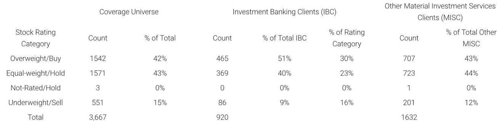
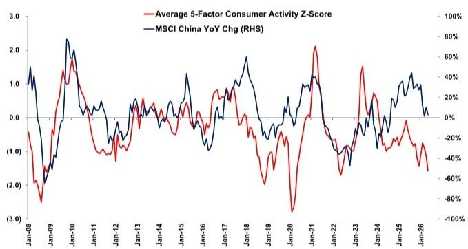

# 摩根斯坦利：中国消费的“5月裂口”比表面数据更值得警惕

**一份来自摩根斯坦利的五月消费追踪报告，揭示了两个趋势：消费活动指数进一步下滑，而零售总额同比增速自2022年以来首次转负。但真正值得关注的，不是这些数字本身，而是它们共同指向的一个判断——支撑消费的短期政策效果正在衰减，而结构性压力尚未见底。**

对于关注中国资产配置的投资者来说，这意味着什么？如果你仍在期待一场“消费复苏”来支撑企业盈利的V型反弹，这份报告提供了足够多的理由需要重新审视这个假设。

摩根斯坦利的中国消费活动Z-Score，是一个基于五个高频指标的复合指数，覆盖了居民贷款、餐饮零售、商品零售（不含汽车）、乘用车销售和航空客运量。这个指数在五月继续走低，而MSCI中国指数的同比变化也同步下行。这不是一个孤立的月度波动——它是连续趋势的延续。

> **KC评论：** 摩根斯坦利的Z-Score并非简单的零售数据加总，它的价值在于捕捉了“消费意愿”和“消费能力”的同步变化。当航空客运、餐饮和商品零售同时走软时，这说明消费者不仅在减少大额支出，连日常可选消费也在收缩。这才是真正值得警惕的信号。

**零售总额同比增速在五月转为-0.6%，这是自2022年以来的首次负增长。** 报告指出，造成这一变化的核心原因有两个：以旧换新政策的刺激效果正在消退，以及就业市场的持续疲软。换句话说，政策驱动的消费脉冲已经释放完毕，而内生增长动力尚未接棒。

对于企业决策者而言，这意味着一个更严峻的竞争环境正在形成。当整体蛋糕不再增长甚至缩小时，市场份额的争夺将变得更加残酷。那些依赖消费升级逻辑的商业模式，可能需要重新审视自己的定价权和增长路径。

**报告对未来给出了明确的判断：消费可能进一步放缓。** 支撑这一判断的三个理由是：政策支持力度减弱、劳动力市场条件疲软、以及出口繁荣对消费的溢出效应有限。

这里有一个容易被忽视的细节。市场上有一种观点认为，出口的强劲表现会通过企业利润和就业传导至消费端。但摩根斯坦利的报告暗示，这种溢出效应可能被高估了。出口部门的复苏主要集中在特定行业和头部企业，并未广泛惠及整体就业市场。这意味着，消费的修复不能依赖出口的“间接拉动”，而需要更直接的内生动力。

> **KC评论：** 这份报告最有价值的地方不在于它说了什么，而在于它没有说什么。它没有给出“触底”的时间表，没有提出“政策必须出手”的建议，也没有预测“下半年会好转”。它只是冷静地展示了数据，并给出了一个基于逻辑的判断。这种克制本身就是一种态度——在不确定性面前，承认不确定性比强行给出结论更有价值。

**那么，报告没有完全回答的关键问题是什么？** 至少有两个。

第一，政策工具箱中还有哪些选项可以扭转消费颓势？报告提到了“政策支持减弱”，但没有深入分析如果消费进一步恶化，决策层是否会推出新的刺激措施，以及这些措施可能的形式和效果。对于投资者来说，这恰恰是最需要跟踪的变量。

第二，消费结构内部是否存在分化？报告使用的是总量指标，但不同收入阶层、不同城市层级、不同品类的消费表现可能存在显著差异。如果高端消费和大众消费出现分化，那么对资产配置的含义是完全不同的。高端消费品的投资逻辑和大众消费品的投资逻辑，在当前的宏观环境下需要分开评估。

**对于读者来说，这份报告提供了一个观察框架：** 与其关注月度数据的波动，不如关注三个核心指标——就业市场的边际变化、政策刺激的力度和节奏、以及出口繁荣是否能够真正传导至消费端。当这三个信号同时出现改善时，才是真正可以重新评估消费板块的时机。

报告的完整版本包含了更多细分数据，包括每个因子的具体走势、历史对比、以及摩根斯坦利对中国消费板块的具体配置建议。这些细节对于构建投资假设至关重要。例如，Z-Score的每个构成因子都在报告中有独立的图表和解读，可以帮助读者判断哪些领域是真正拖累消费的“短板”，哪些领域出现了边际改善的迹象。

我们每天会由AI agent加上人工review，生成国际投行的中文摘要与KC评论，daily更新，大约10到40页，同时整理当天最新的数据图表合集。这份材料既方便你喂给AI做进一步分析，也方便你快速把握全球市场的动态。如果你对摩根斯坦利这份报告的完整内容感兴趣，欢迎来我们的知识星球和微信群继续讨论，我们会分享报告的原版图表和更详细的解读。

Personal reading notes and learning share only. Not investment advice.

