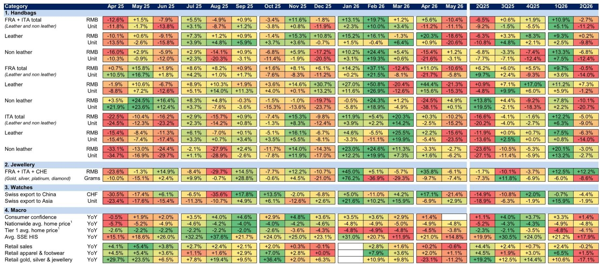
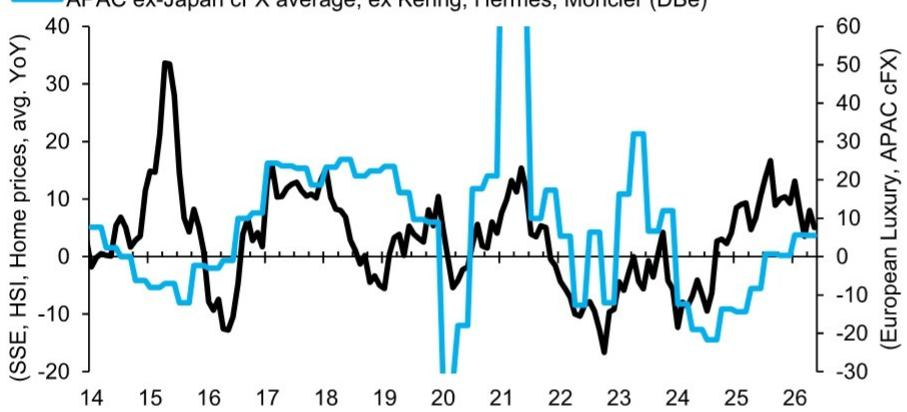

# The China Luxury Recovery Is Not a V-Shape — It Is a False Start Masked by Base Effects

The narrative that China’s luxury market has turned the corner, widely adopted after the first quarter of 2026, is now facing a stern reality check. Luxury imports into China declined by 7.2 percent year-on-year in April and May combined, a sharp reversal from the 5.0 percent growth recorded in the first quarter. This is not a temporary pullback or a seasonal blip. It is a structural signal that the recovery many investors priced into luxury equity valuations during early 2026 was built on fragile foundations. The improvement seen in the first quarter was largely a function of easy year-ago comparisons and a short-lived wealth effect from a buoyant stock market. Both of those supports are now fading, and the underlying demand picture is deteriorating once again.

The data from the April-May period tells a clear story of broad-based weakness. Handbag imports, the most visible proxy for aspirational luxury demand, fell 11.2 percent in unit terms, swinging sharply from the 5.1 percent growth of the first quarter. Jewellery imports declined 8.6 percent, and even watches, which had held up relatively well, slipped into negative territory. The sequential deterioration is the key concern here. It is not that the market is merely stagnating at a low level; it is that the momentum that seemed to be building in the first quarter has reversed. For anyone tracking the luxury sector, this is a decisive moment. The question is no longer whether the recovery will be gradual or rapid. The question is whether there is any genuine recovery at all, or whether the market is simply oscillating around a lower equilibrium.

The macroeconomic context reinforces this caution. Chinese retail sales growth slowed to negative 0.6 percent year-on-year in May, down from a positive 0.2 percent in April and well below the first-quarter average of 3.3 percent. Consumer confidence, while still positive year-on-year at 1.4 percent in April, has decelerated from 3.3 percent during the first quarter. The wealth effects that supported discretionary spending are also weakening. Nationwide home prices remained deeply negative at minus 4.8 percent year-on-year, and stock market returns slowed to 14.8 percent from 21.0 percent in April. These are not marginal shifts. They represent a meaningful erosion of the financial conditions that underpin luxury consumption. The implication is clear: the luxury sector in China is not in a recovery phase; it is in a period of renewed demand fragility that will require either a catalyst from policy or a much longer wait for organic improvement.

## The Reversal in Handbag Imports Reveals a Demand Structure That Is More Fragile Than the First Quarter Suggested

The handbag category is the most telling indicator of the luxury market's true state. In the first quarter of 2026, total handbag imports from France and Italy grew 5.1 percent in unit terms. That figure was widely cited as evidence that the Chinese consumer was returning to luxury spending. But the April-May data reveals that this growth was a mirage. Unit imports of handbags fell 11.2 percent year-on-year in the two-month period, with leather handbags declining 9.8 percent and non-leather handbags dropping 12.4 percent. The breakdown by country is equally revealing. Italian handbag imports, which are heavily correlated with demand for brands such as Gucci, fell 9.0 percent in unit terms in the second quarter so far, compared with growth of 6.3 percent in the first quarter. French leather handbag imports, a proxy for brands such as Hermès, declined 1.2 percent in the second quarter versus 5.9 percent growth in the first.

The pattern is consistent across subcategories and source countries. Demand has not simply plateaued; it has actively weakened. The first-quarter strength was likely amplified by inventory restocking and a temporary boost from Chinese New Year spending, neither of which has persisted. What the data shows now is the underlying run-rate of consumer demand, and it is significantly lower than what the first-quarter headline numbers suggested. For investors, the implication is that any valuation premium assigned to luxury stocks based on a China recovery thesis needs to be reassessed. The handbag data is the canary in the coal mine, and it is signaling distress.

## Jewellery and Watches Show Divergent Trends but Both Face Headwinds from Slowing Wealth Creation

Jewellery imports, measured in grams from France, Italy, and Switzerland, declined 8.6 percent year-on-year in the April-May period. This is a modest sequential improvement from the 6.0 percent decline in the first quarter, but it remains firmly negative. The retail data for gold, silver, and jewellery in China tells a more alarming story: retail sales in this category plunged 17.1 percent year-on-year in the second quarter so far, swinging from 10.6 percent growth in the first quarter. The divergence between import and retail data suggests that destocking is occurring at the retail level, which will eventually feed back into lower import orders. Jewellery demand is particularly sensitive to wealth effects, and the combination of falling home prices and slowing equity returns is a direct headwind.

Watches present a slightly different picture. Swiss watch exports to China in Swiss franc terms declined 4.4 percent year-on-year in the second quarter so far, an improvement from the 14.9 percent decline in the second quarter of 2025. In unit terms, Swiss watch exports to Asia fell only 1.9 percent, compared with 15.9 percent growth in the first quarter. The watch category appears to be more resilient than handbags or jewellery, but the trend is still negative. The sequential deceleration from the first quarter is notable, and it suggests that even the most affluent consumers, who drive watch purchases, are becoming more cautious. The wealth effect from equity markets, which had been a strong support for high-end watch demand, is fading. If stock market returns continue to slow, watch imports are likely to follow handbags and jewellery into deeper negative territory.

## The Macro Environment Is Not Supportive of a Luxury Recovery, and the Data Shows Limited Policy Transmission So Far

The macroeconomic data from China provides the structural context for the luxury import weakness. Retail sales growth has decelerated sharply, from an average of 3.3 percent in the first quarter to negative 0.2 percent in the second quarter so far. Apparel and footwear retail sales, a broader measure of discretionary spending, fell to 1.5 percent year-on-year from 6.5 percent in the first quarter. Consumer confidence, while still positive, is losing momentum. The index stood at 1.4 percent year-on-year in April, down from 2.9 percent in March and 3.6 percent in February. The trajectory is clearly downward.

Household wealth is under pressure from two directions. Home prices nationwide declined 4.8 percent year-on-year in May, a marginal improvement from minus 4.9 percent in April but still deeply negative. The Tier 1 city average home price decline narrowed to 3.8 percent from 4.5 percent in April, which is a modest positive signal. However, the stock market, which had been a source of wealth creation in the first quarter, is now providing less support. The average return of the Shanghai Stock Exchange and Hang Seng Index slowed to 14.8 percent year-on-year in May from 21.0 percent in April. On a month-on-month basis, the index was down approximately 2 percent in May.

The combination of falling home prices and slowing equity returns creates a negative wealth effect that directly impacts luxury spending. The report data shows that the correlation between wealth growth and luxury sector constant-currency sales growth in Asia-Pacific ex-Japan is high. When wealth creation slows, luxury demand follows with a lag of one to two quarters. The current macro data suggests that the headwinds for luxury demand are likely to persist through at least the third quarter of 2026. Policy support, including fiscal stimulus and monetary easing, has been announced but has not yet translated into improved consumer confidence or spending. The transmission mechanism from policy to household balance sheets remains weak.

## What the Report Does Not Fully Answer: The Role of Travel Retail, Channel Inventory, and Brand-Level Divergence

While the import data provides a valuable high-frequency read on luxury demand, it leaves several critical questions unanswered. The first is the role of travel retail and overseas spending. Chinese consumers are increasingly purchasing luxury goods outside of mainland China, particularly in Japan, Southeast Asia, and Europe. The import data captures goods shipped directly into China, but it does not capture goods purchased by Chinese tourists abroad and brought back into the country. If overseas spending is recovering faster than domestic spending, the import data may understate total Chinese luxury consumption. Conversely, if the renminbi weakens or travel costs rise, overseas spending could decline, which would shift demand back to domestic channels and boost import figures. The net effect is unclear.

The second open question is channel inventory. The import data reflects shipments from manufacturers to distributors and retailers, not sell-through to end consumers. If retailers are holding excess inventory from the first quarter, they may reduce import orders even if consumer demand is stable. The sharp swing in handbag imports from growth to decline could partly reflect inventory normalization rather than a collapse in demand. Without sell-through data, it is impossible to distinguish between these two scenarios. The divergence between import and retail data in jewellery, where imports declined moderately but retail sales plunged 17 percent, suggests that destocking is occurring. But the magnitude of the inventory adjustment across all luxury categories remains unknown.

The third unanswered question is brand-level divergence. The aggregate data hides significant variation across price points and brand tiers. Hermès and other ultra-luxury brands may be outperforming, while accessible luxury brands such as Coach and Michael Kors may be underperforming. The report data shows that French handbag imports, which are more correlated with Hermès, declined only 1.2 percent in unit terms in the second quarter, while Italian imports, correlated with Gucci and other brands, fell 9.0 percent. This suggests a bifurcation in demand, with the highest-end consumers remaining relatively resilient while aspirational consumers pull back. However, the data is not granular enough to confirm this hypothesis or to quantify the magnitude of the divergence.

## A Decision Framework for Investors: How to Interpret the Next Two Quarters of Luxury Data

Given the complexity of the signals, investors need a structured framework for interpreting incoming data and adjusting their positions. The following decision framework is based on the patterns observed in the report data and the macroeconomic context.

First, monitor the monthly import data for handbags as the primary leading indicator. Handbags are the most discretionary of the three luxury categories and the most sensitive to changes in consumer confidence. If handbag imports stabilize or improve in June and July, it would suggest that the April-May weakness was a temporary correction or inventory adjustment. If they continue to decline at a similar pace, it would confirm that the demand trend is structurally weaker. A stabilization at negative 5 to 10 percent year-on-year would be a neutral signal. A move back toward positive territory would be a bullish signal. A further acceleration of declines beyond 15 percent would be a clear bearish signal.

Second, track the wealth indicators with a two-month lag. The report data shows that stock market returns and home prices lead luxury imports by approximately one to two quarters. The current weakness in equity returns and home prices suggests that luxury demand will remain under pressure through the third quarter. If stock market returns recover to above 20 percent year-on-year and home prices stabilize above minus 3 percent, the outlook for the fourth quarter would improve. If wealth indicators continue to deteriorate, the luxury recovery should be pushed out to 2027.

Third, differentiate between import data and retail sales data. When import data is weaker than retail data, it suggests that retailers are destocking and that future import orders may rebound once inventories normalize. When import data is stronger than retail data, as was the case in jewellery in the second quarter, it suggests that retailers are building inventory and that future import orders may decline. The current divergence in jewellery, where imports are down 8.6 percent but retail sales are down 17.1 percent, suggests that destocking is occurring and that import orders may need to fall further to align with retail demand.

Fourth, use the brand-level divergence as a signal for stock selection. If French handbag imports continue to outperform Italian imports, it would support the thesis that ultra-luxury brands are more resilient than accessible luxury brands. Investors should overweight companies with high exposure to the top end of the market and underweight those with exposure to aspirational consumers. The report data provides a framework for this analysis, but it requires additional company-level data to execute.

## The Analytical Questions That Remain Open Are the Most Valuable Part of This Report

The report data provides a clear and timely read on luxury import trends, but it also raises questions that cannot be answered with import data alone. The most pressing question is whether the April-May weakness is a correction or a new trend. The answer depends on factors that are outside the scope of this data set, including the trajectory of Chinese consumer confidence, the effectiveness of fiscal stimulus, and the evolution of the property market. A second open question is the extent to which the luxury market is experiencing a structural shift rather than a cyclical downturn. If Chinese consumers are permanently trading down to lower price points or shifting spending to experiences rather than goods, the recovery in luxury imports may never return to pre-2024 levels. The data cannot distinguish between these scenarios.

A third question is the role of the grey market and parallel imports. The official import data may be capturing demand that is being met through unofficial channels, particularly if price differentials between China and other markets are large. A weakening renminbi or changes in tariff policy could shift demand between official and unofficial channels, distorting the import data. The report does not address this issue, but it is a meaningful source of noise.

These open questions are not weaknesses of the analysis. They are the natural boundaries of any data set. The value of the report is that it provides a high-frequency, granular read on luxury demand that allows investors to ask better questions. The answers to those questions will come from company-level reporting, channel checks, and macro data releases. For now, the import data is telling a clear story of a false start. The luxury recovery in China has stalled, and the second quarter is proving to be a reality check for anyone who believed the first quarter was the beginning of a sustained upturn.

Join the community to read the full report and review the original charts.

*This article is for learning and discussion only and does not constitute investment advice.*

Personal reading notes and learning share only. Not investment advice.

