CHINA CONSUMER STAPLES

# Nielsen China infant formula (Mar-Apr '26): Offline contracted by 8% yoy; Online sales down 19% yoy in May dragged by JD

## CONNECTIONS

In this report we highlight the key findings for China's infant milk formula (IMF) market from online channels (Tmall/Taobao/JD) as of May and the latest Nielsen data through Mar-Apr 2026. We also present updates on Feihe, Yili, Mengniu, Danone and A2.

## Key findings:

1. Offline infant formula market declined by $-8.2\%$ yoy in Mar-Apr (a greater decline vs $-7.7\%$ yoy in Jan-Feb). Breaking it down for Mar-Apr, volume was down by $9\%$ while ASP grew by $0.9\%$ yoy vs. $-8.7\% / +1.1\%$ yoy in Jan-Feb. By channel, we saw $7.3\%$ decline in M&B (mom & baby stores) and $-20\%$ decline from MT (modern trade) in Mar-Apr.

2. In Mar-Apr, Feihe's sales decline in the offline channel was $-12\%$ yoy (vs. $-15\%$ decline yoy in Jan-Feb), lagging the market run-rate of $-8.2\%$ yoy. Tracked omni-channel sales including online sales combined with Nielsen offline sales point to $-24\%$ yoy decline in Mar-Apr, vs. $-19\%$ yoy in Jan-Feb.

3. In Mar-Apr, Yili's sales decline in the offline channel was $1.9\%$ yoy (vs. $-0.9\%$ yoy in Jan-Feb), driven by sales growth in the M&B channel by $2.8\%$ yoy in Mar-Apr. Tracked omni-channel sales including online sales combined with Nielsen offline sales point to $-2\%$ yoy in Mar-Apr vs. $-1\%$ yoy in Jan-Feb.

4. A2: In the M&B channel, A2 recorded +2.9% sales growth in Mar-Apr, vs 2.9% in Jan-Feb. Share by value increased 0.2ppt to 4.3% in Mar-Apr vs 4.1% in Jan-Feb, +0.4ppt yoy.

5. In offline markets, large domestic companies' collective market share was largely flattish in Mar-Apr vs. Jan-Feb, and leading MNC brands' value share increased by 0.3pp to $23.8\%$ in Mar-Apr vs. $23.5\%$ in Jan-Feb.

6. Other brands in offline channels: Mengniu's sales (excl. Yashili) grew at 10% yoy in Mar-Apr vs. +36% yoy in Jan-Feb for offline markets. Junlebao's sales declined by -22.3% (vs. -25.8% in Jan-Feb). Biostime sales grew by 22.4% yoy vs.

Leaf Liu
+852-3966-4169 | leaf.liu@gs.com
GS (Asia) L.L.C.

## Peter Marks

+61(02)9321-8846 |
peter.marks@gs.com
GS Australia Pty Ltd

Christina Liu  
+852-2978-6983 | christina.liu@gs.com  
GS (Asia) L.L.C.

## Rayanne Haidar

+61(2)9321-8739 | rayanne.haidar@gs.com GS Australia Pty Ltd

Valerie Zhou  
+852-2978-0820 | valerie.zhou@gs.com  
GS (Asia) L.L.C.

## Table of Contents

<table><tr><td>Monthly summary tables by channel</td><td>4</td></tr><tr><td>Offline Market: Overall decline sequentially narrowed down; Yili gained share</td><td>4</td></tr><tr><td>Online Market: Domestic brands sequentially weakened; Top MNC brands growth moderated potentially due to high comp last year on 618</td><td>7</td></tr><tr><td>Feihe (Neutral): offline market share slightly recovered despite weak run-rate; Taobao/Tmall/JD decline narrowed</td><td>8</td></tr><tr><td>Yili (Buy): Online sequentially weakened; offline resumed to positive growth</td><td>10</td></tr><tr><td>Other player updates: Bellamy/Biostime/A2 outperformed the online market</td><td>11</td></tr><tr><td>Disclosure Appendix</td><td>13</td></tr></table>

+25.8% in Jan-Feb, with market share trending down by 0.3pp to 7.5% in Mar-Apr vs. 7.8% at Jan-Feb.

7. Online industry: On Tmall/Taobao/JD combined, infant milk formula sales declined by 19% yoy in May (vs. -14% yoy in Apr), with -2% yoy growth on Tmall/Taobao and -26% on JD on a tough base.

8. Feihe online sales (Taobao/Tmall/JD combined) declined by $-31\%$ yoy in May, vs. $-47\%$ in Apr.

9. Yili online sales (Taobao/Tmall/JD combined, incl. Pro-Kido on Taobao/Tmall) decreased by -17% in May vs -10% in Apr.

10. A2 Milk recorded -25% yoy online sales decline in May potentially due to the supply cut since Apr (Taobao/Tmall/JD combined) vs. 27% yoy in Apr.

11. Outperforming brands in May 26 (Online): Aptamil, Bellamy's; Underperformers: Firmus, A2, Nutrilon, Wyeth.

The authors would like to thank Lily Qi for her contribution to this report.

## Monthly summary tables by channel

Exhibit 1: Offline: Feihe/Yili/Dannone/A2 gained share sequentially in MA26 while Nestle lost share

<table><tr><td>Brands - offline</td><td>Company</td><td>IMF recall date</td><td colspan="4">Market share</td><td colspan="5">Sales yoy</td></tr><tr><td rowspan="2"></td><td rowspan="2"></td><td rowspan="2"></td><td colspan="9">Modern Trade + M&amp;B</td></tr><tr><td>Trend</td><td>MA26</td><td>JF26</td><td>ND25</td><td>SO25</td><td>JA25</td><td>MJ25</td><td>MA25</td><td>JF25</td></tr><tr><td>Baby products</td><td></td><td></td><td></td><td></td><td></td><td></td><td></td><td></td><td></td><td></td><td></td></tr><tr><td colspan="12">Infant Formula</td></tr><tr><td>Feihe</td><td>Feihe</td><td>n.a.</td><td>↑</td><td>-12%</td><td>-15%</td><td>-19%</td><td>-23%</td><td>-14%</td><td>-7%</td><td>-1%</td><td>-6%</td></tr><tr><td>Yili</td><td>Yili</td><td>Jan-26</td><td>↑</td><td>2%</td><td>-1%</td><td>-1%</td><td>0%</td><td>-1%</td><td>1%</td><td>5%</td><td>5%</td></tr><tr><td>Danone (Dumex + Nutrica)</td><td>Danone</td><td>Jan-26</td><td>↑</td><td>1%</td><td>6%</td><td>5%</td><td>10%</td><td>6%</td><td>5%</td><td>-2%</td><td>-8%</td></tr><tr><td>A2</td><td>A2 Milk</td><td>May-26</td><td>↑</td><td>3%</td><td>3%</td><td>5%</td><td>4%</td><td>12%</td><td>18%</td><td>7%</td><td>10%</td></tr><tr><td>Wyeth</td><td>Nestle</td><td>Jan-26</td><td>↓</td><td>-60%</td><td>-51%</td><td>-40%</td><td>-40%</td><td>-39%</td><td>-41%</td><td>-31%</td><td>-35%</td></tr></table>

Source: Nielsen

Exhibit 2: Online: Aptamil/Wyeth gained share sequentially while Feihe/A2/Bellamy's/Nutrilon lost share on Tmall/Taobao/JD combined in May

<table><tr><td rowspan="2">Brands - online</td><td rowspan="2">Company</td><td rowspan="2">IMF recall date</td><td colspan="8">Market share</td><td colspan="10">Sales yoy</td></tr><tr><td>Tmall/Taobao/JDTrend</td><td>May-26</td><td>Apr-26</td><td>Mar-26</td><td>Feb-26</td><td>Jan-26</td><td>Dec-25</td><td>Nov-25</td><td>Oct-25</td><td>Sep-25</td><td>Aug-25</td><td>Jul-25</td><td>Jun-25</td><td>May-25</td><td>Apr-25</td><td>Mar-25</td><td>Feb-25</td><td>Jan-25</td></tr><tr><td colspan="21">Baby products</td></tr><tr><td colspan="21">Infant Formula</td></tr><tr><td>Aptamil</td><td>Danone</td><td>Jan-26</td><td>↑</td><td>6%</td><td>2%</td><td>-9%</td><td>15%</td><td>24%</td><td>56%</td><td>34%</td><td>19%</td><td>30%</td><td>5%</td><td>20%</td><td>27%</td><td>26%</td><td>12%</td><td>9%</td><td>34%</td><td>5%</td></tr><tr><td>Feihe</td><td>Feihe</td><td>n.a.</td><td>↓</td><td>-31%</td><td>-47%</td><td>-47%</td><td>-40%</td><td>-22%</td><td>-25%</td><td>-9%</td><td>-17%</td><td>-13%</td><td>-22%</td><td>-12%</td><td>-20%</td><td>35%</td><td>73%</td><td>42%</td><td>39%</td><td>7%</td></tr><tr><td>A2</td><td>A2 Milk</td><td>May-26</td><td>↓</td><td>-25%</td><td>27%</td><td>17%</td><td>14%</td><td>28%</td><td>31%</td><td>20%</td><td>28%</td><td>10%</td><td>20%</td><td>24%</td><td>36%</td><td>21%</td><td>-18%</td><td>5%</td><td>35%</td><td>-11%</td></tr><tr><td>Yii</td><td>Yii</td><td>May-26</td><td>→</td><td>-5%</td><td>20%</td><td>-43%</td><td>-48%</td><td>-48%</td><td>-14%</td><td>-33%</td><td>30%</td><td>15%</td><td>-9%</td><td>27%</td><td>-5%</td><td>71%</td><td>-10%</td><td>60%</td><td>34%</td><td>51%</td></tr><tr><td>Wyeth</td><td>Nestle</td><td>Jan-26</td><td>↑</td><td>-45%</td><td>-32%</td><td>-27%</td><td>-33%</td><td>-41%</td><td>-38%</td><td>-23%</td><td>-22%</td><td>-18%</td><td>-14%</td><td>4%</td><td>-12%</td><td>47%</td><td>6%</td><td>-14%</td><td>25%</td><td>5%</td></tr><tr><td>Bellamy&#x27;s</td><td>Mengniu</td><td>n.a.</td><td>↓</td><td>19%</td><td>80%</td><td>68%</td><td>60%</td><td>73%</td><td>-19%</td><td>38%</td><td>26%</td><td>49%</td><td>28%</td><td>48%</td><td>34%</td><td>119%</td><td>38%</td><td>30%</td><td>173%</td><td>30%</td></tr><tr><td>Nutrition</td><td>Danone</td><td>Jan-26</td><td>↓</td><td>-71%</td><td>-45%</td><td>-44%</td><td>-50%</td><td>-42%</td><td>-74%</td><td>-47%</td><td>-48%</td><td>-26%</td><td>-37%</td><td>9%</td><td>-27%</td><td>46%</td><td>-22%</td><td>-46%</td><td>6%</td><td>-34%</td></tr></table>

Moojing

## Offline Market: Overall decline sequentially narrowed down; Yili gained share

## Offline market Mar-Apr 2026 updates

The Nielsen IMF sales data (surveying both modern trade (MT) and mom & baby (M&B) stores) declined by -8.2% yoy in Mar-Apr (vs -7.7% yoy decline for Jan-Feb), with 7% decline in M&B and -20% decline from MT (vs -6.7%/-21% yoy in Jan-Feb).

Volume remained the main drag in the IMF sales decline, down by 9% yoy in Mar-Apr, down 0.3ppt sequentially. Volume for M&B channel decreased by 7.9% yoy in Mar-Apr vs -7.4% yoy decline in Jan-Feb. ASP growth increased slightly at +0.9% yoy in Mar-Apr with 0.6% yoy growth in the M&B channel in Mar-Apr and 2.8% yoy growth in the MT channel.

For the M&B channel, Feihe saw its ASP increase by 0.7% yoy (vs. -0.2% yoy in Jan-Feb) and Yili recorded 1.1% yoy decrease in Mar-Apr vs. 1.2% yoy decrease in Jan-Feb. Among foreign players, Danone/Nestle/Friesland showed ASP growth of 2.5%/1.8%/-0.2% yoy (vs. 0.7%/4.0%/-0.4% in Jan-Feb), and A2 Milk ASP continued declining, by -1.3% yoy vs. -2.6% yoy in Jan-Feb.

Note: Nielsen data has rebased since May-Jun 24.

Exhibit 3: The mom & baby channel declined by 7% yoy and modern trade declined by 20% yoy  
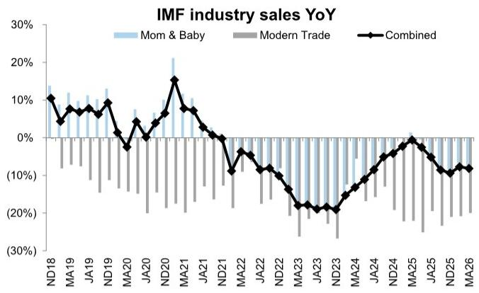  
Source: Nielsen

Exhibit 4: For modern trade and mom & baby stores, infant formula sales recorded a 9% volume decline with 0.9% ASP growth yoy

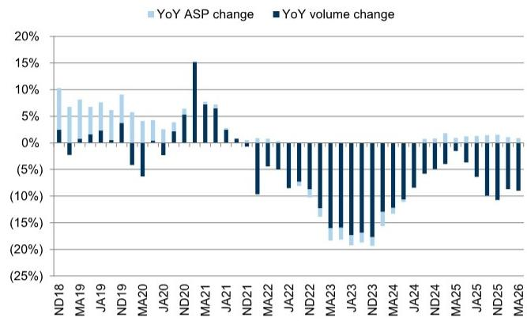  
Source: Nielsen

## Offline Mar-Apr brand performance

Compared with Jan-Feb, some domestic players saw slight sequential improvement. Yili sales resumed positive growth at 1.9% yoy vs -0.9% in Jan-Feb. Feihe saw a narrowed 12% decline yoy vs 15% in Jan-Feb, still lagging the market run-rate. Biostime sales continued growth to 22.4% yoy vs. 25.8% in Jan-Feb. Among the MNC brands, Nestle declined at -36% yoy vs. -22% yoy in Jan-Feb and Friesland also declined at -4% yoy (vs. -8% in Jan-Feb). Wyeth and Abbott continued underperforming the market, seeing -60%/-43% yoy sales decline, while Mead Johnson continued positive growth at 4% in Mar-Apr vs. 7% in Jan-Feb.

1. Large domestic companies' collective market share was largely flattish in Mar-Apr vs. Jan-Feb, with Yili/Feihe gaining shares while Mengniu/Biostime losing shares sequentially, together accounting for $62\%$ of market share. Leading MNC brands' value share increased by 0.3pp to $23.8\%$ in Mar-Apr vs. $23.5\%$ in Jan-Feb.

2. Yili delivered positive sales growth in Mar-Apr at $1.9\%$ yoy vs $-0.9\%$ in Jan-Feb. Ausnutria (acquired by Yili) recorded a $28\%$ decline yoy in sales in Mar-Apr, vs. $-20\%$ in Jan-Feb.

3. Feihe's market share recorded $21\%$ in Mar-Apr, up by 0.4pp vs. Jan-Feb at $20.6\%$ , down 0.9pp yoy.

4. A2 Milk China Label sales in Mar-Apr grew by 2.9% YoY in M&B channels with market share increasing by 0.2pp to 4.3% vs. Jan-Feb, +0.4pp yoy, mainly driven by volume growth by 4% yoy.

5. Biostime saw market share trending down from 7.8% in Jan-Feb to 7.5% in Mar-Apr, and Beingmate's market share decreased slightly to 4.7% in Mar-Apr. The majority of MNC players saw divergent market share movement, with Danone at 5.8% (+0.2ppt vs Jan-Feb, +0.6pp yoy), Wyeth at 1.1% (-0.2ppt vs. Jan-Feb, -1.5pp yoy), Nestle at 2.3% (-0.3ppt vs. Jan-Feb, -1ppt yoy), and MJN at 2.7% (-0.2ppt vs. Jan-Feb, +0.3pp yoy).

Exhibit 5: Feihe maintained its leading market share in IMF and value share increased slightly in Mar-Apr, and Yili/Mengniu's (excl. Yashili) offline market share was at $17.9\% / 1.2\%$

Offline domestic IMF brands' market share by value  
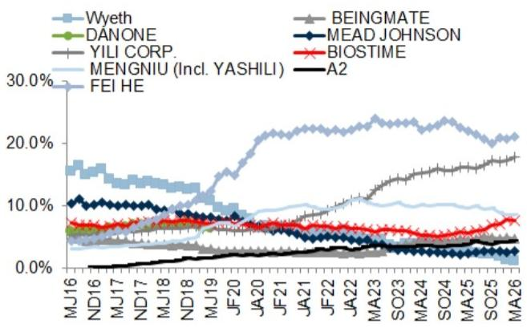  
Source: Nielsen  
Exhibit 7: Feihe's/Yili's market share increased in Mar-Apr in the offline market, while Mengniu's market share decreased  
Nielsen market share for leading brands

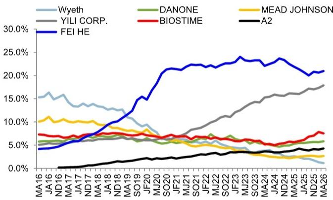  
Source: Nielsen  
Source: Nielsen

Exhibit 6: MNC players saw sequential market share trend mixed in Mar-Apr, Friesland/Danone/A2 value share increased while Wyeth decreased vs. Jan-Feb Offline international IMF brands market share by value

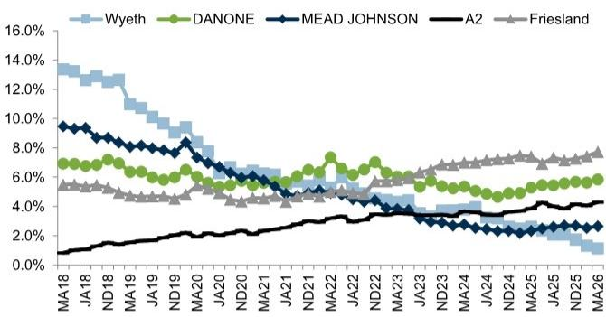  
Exhibit 8: Big local brands collectively took 62% market share, flattish vs. Jan-Feb, while MNCs saw market share gain of 0.3pp vs Jan-Feb Market share, % of total infant formula offline channel  
Market share, % of total infant formula offline channel  
Offline sales market share breakdown

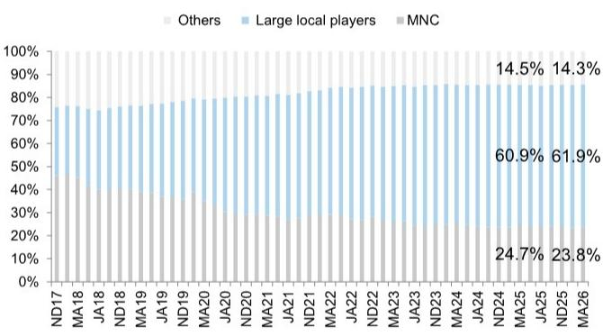  
Source: Nielsen

## Online Market: Domestic brands sequentially weakened; Top MNC brands growth moderated potentially due to high comp last year on 618

On Tmall/Taobao/JD combined, infant milk formula sales declined by 19% yoy in May (vs. -14% yoy in Apr), with -2% yoy growth on Tmall/Taobao and -26% on JD on a tough base. Feihe declined by -30% yoy in May, vs. -47% yoy in Apr. Yili declined at -23% yoy in May vs. -21% yoy in Apr, and Yili + Pro-kido combined declined -17% in May vs. -10% in Apr. Among MNCs, Aptamil/A2/Biostime grew +6%/-25%/25% yoy in May, vs. +2%/+27%/+68% yoy in Apr, and Mead Johnson/Wyeth/Nutrilon declined significantly at -45%/-45%/-71% vs. -31%/-32%/-45% in Apr. Bellamy's growth momentum moderated at 19% in May vs. +80% in Apr.

On Tmall/Taobao, infant milk formula sales decreased by -2% in May vs 14% yoy in Apr. Top domestic brands gained market share sequentially in May, mainly Junlebao/Yili/Firmus/Biostime. Among local brands, Feihe's sales momentum sequentially moderated with 1% in May vs. 26% yoy in Apr potentially due to a tough comp in May 25. Yili (including Pro-Kido) increased by 3% in May vs 33% in Apr. Yili alone recorded +3% in May vs. +31% in Apr. Among MNC brands, Biostime/Mead Johnson (MJN)/Wyeth growth was mixed in May to +15%/+34%/+7% yoy vs. +56%/+70%/+19% in Apr.

Exhibit 9: Online IMF sales declined by -11% yoy in 1Q26 vs 4% growth in 4Q25
Tmall/Taobao/JD combined IMF quarterly growth

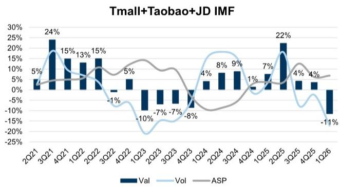  
Source: Moojing  
Exhibit 10: Online IMF sales declined by $19\%$ yoy in May vs. $-14\%$ yoy in Apr Tmall/Taobao/JD combined IMF monthly growth

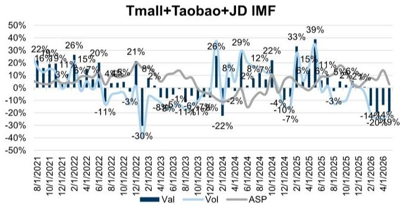

Exhibit 11: Tmall/Taobao IMF sales decreased by -2% in May vs 14% yoy in Apr mainly on volume growth
Tmall/Taobao IMF monthly growth

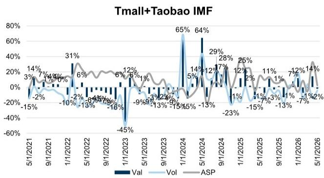  
Exhibit 12: JD IMF sales declined at $-19\% / -14\%$ yoy in May/Apr  
JD IMF monthly growth

JD IMF  
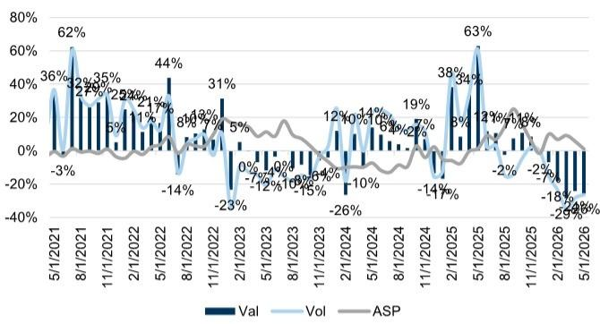  
Source: Moojing

Exhibit 13: Aptamil maintained its No.1 position with market share loss 0.9ppt mom to $20\%$ ; A2 lost 2.7ppt market share in May International IMF value Market share (Tmall+Taobao)  
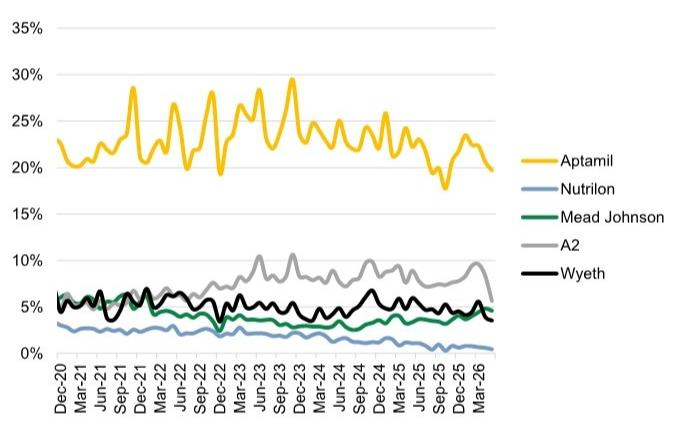  
Source: Moojing  
Source: Moojing  
Exhibit 14: Feihe/Yili's Market share on Tmall/Taobao was $14\% /9\%$ in May  
Domestic IMF value Market share (Tmall+Taobao)

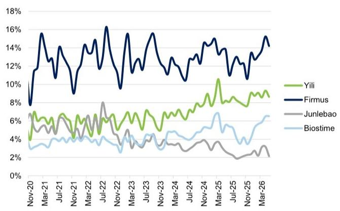  
Source: Moojing

Feihe (Neutral): offline market share slightly recovered despite weak run-rate; Taobao/Tmall/JD decline narrowed

Tracked omni-channel sales including online sales combined with Nielsen offline sales point to -24% yoy decline in Mar-Apr, vs. -19% yoy in Jan-Feb.

In Mar-Apr 2026, Feihe's sales decline in the offline channel was $-12\%$ yoy (vs. $-15\%$ decline yoy in Jan-Feb), lagging the market run-rate of $-8.2\%$ yoy. Feihe's market share recorded $21\%$ in Mar-Apr, up by 0.4pp vs. Jan-Feb at $20.6\%$ , down 0.9pp yoy. The ASP in offline markets was $+0.9\%$ yoy in Mar-Apr, vs. $0.3\%$ in Jan-Feb. M&B saw ASP increased by $0.7\%$ yoy and MT channel saw ASP recovery at $3.2\%$ yoy, respectively.

On Tmall/Taobao/JD combined: Feihe declined by $-31\%$ yoy in May, vs. $-47\%$ in Apr. On Tmall/Taobao: Feihe's sales grew at $1\%$ in May vs. $+26\%$ yoy in Apr.

Exhibit 16: Feihe tracked Omnichannel sales down -18% yoy in 2H25 vs -16% sales decline reported

Exhibit 15: Feihe's sales decline narrowed to $-12\%$ yoy vs. $-15\%$ decline yoy in Jan-Feb, vs. industry's $-8.2\%$ yoy run-rate

Sales growth yoy (MT & MB channel combined)  
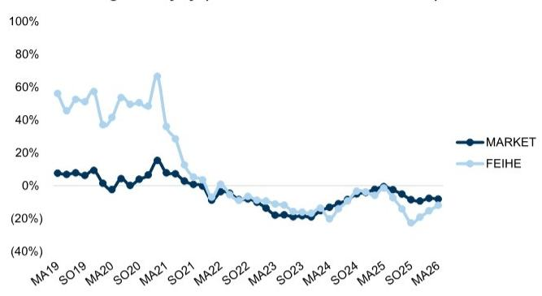  
Source: Nielsen

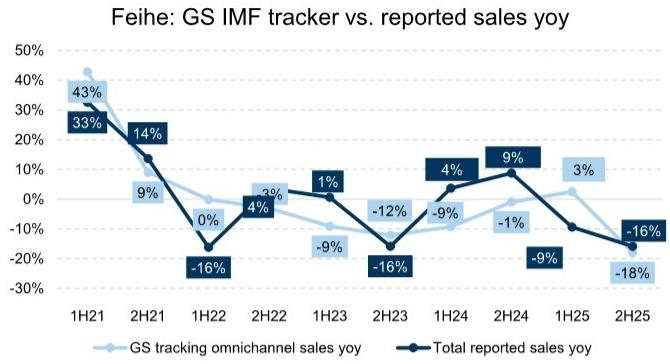  
Source: Company data, GS Global Investment Research, Nielsen, Moojing  
Exhibit 17: GS tracking online channel sales decline at -31% yoy in May, vs. -47% in Apr

Feihe: GS IMF tracker online sales yoy (Tmall/Taobao/JD)  
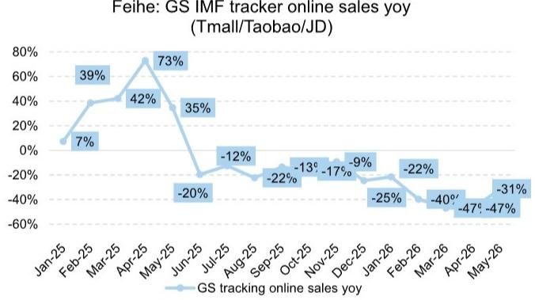  
Exhibit 18: Feihe Tmall/Taobao IMF sales increased by grew at $1\%$ in May vs. $+26\%$ yoy in Apr. Tmall/Taobao IMF monthly growth

Firmus (Tmall/Taobao)  
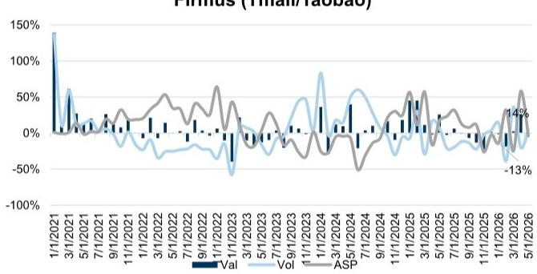  
Source: Moojing, GS Global Investment Research  
Source: Moojing  
Exhibit 19: Feihe JD IMF sales decreased by $40\%$ yoy in May following the $-60\%$ yoy decline in Apr, mainly on weak volume since Jun 25  
JD IMF monthly growth

Firmus (JD)  
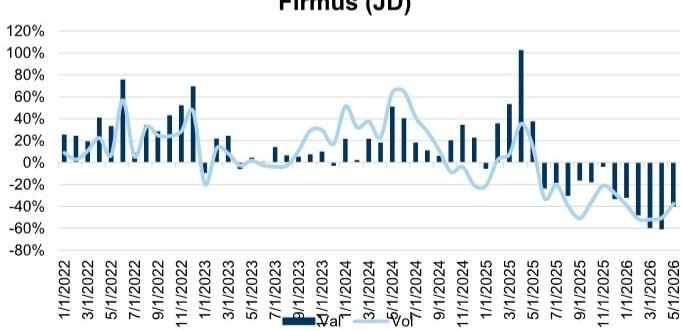  
Source: Nielsen

## Valuation and key risks

## Feihe (Neutral):

Valuation methodology: We are Neutral-rated on Feihe. Our 12-m TP of HK\$3.43 is based on 11.0x 2027E P/E discounted back to mid-2027 using a 10.3% COE.

Key risks: 1) Higher/Lower-than-expected new birth rates; 2) More/Less intense competition; 3) Quicker/Slower premium segment growth; 4) Industry-wide food safety issues; 5) Higher/Lower-than-expected incremental policy support.

## Yili (Buy): Online sequentially weakened; offline resumed to positive growth

Tracked omni-channel sales including online sales combined with Nielsen offline sales point to -2% yoy in Mar-Apr vs. -1% yoy in Jan-Feb.

In Mar-Apr, Yili's sales growth in the offline channel was $1.9\%$ yoy (vs. $-0.9\%$ yoy in Jan-Feb), above the market run-rate of $-8.2\%$ yoy. The growth was mainly driven by sales growth in the M&B channel by $2.8\%$ yoy in Mar-Apr. The ASP in offline markets decreased by $0.8\%$ yoy in Mar-Apr, vs. $-0.9\%$ in Jan-Feb. M&B saw ASP down $1.1\%$ yoy and MT channel saw ASP down by $0.5\%$ yoy, respectively.

On Tmall/Taobao/JD combined: Yili (including Pro-Kido) decreased by -17% in May vs -10% in Apr. Yili alone recorded -23% decline in May vs. -21% in Apr. On Tmall/Taobao: Yili grew at +3% yoy in May vs. +31% in Apr, and Yili + Pro-kido combined grew +3% in Mar. vs. +33% in Apr.

Exhibit 20: GS tracking online channel sales point up to -17% in May vs -10% in Apr

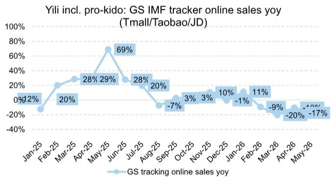  
Source: Moojing, GS Global Investment Research  
Exhibit 21: Yili omnichannel had flattish yoy trend for 2H25 vs 9% yoy sales growth by GSe

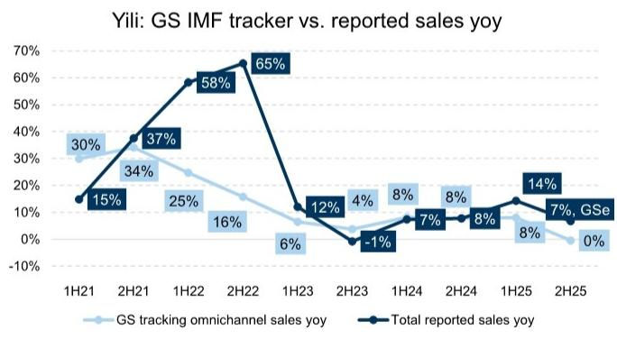  
Source: Company data, GS Global Investment Research, Nielsen, Moojing

Exhibit 23: Yili JD IMF sales declined by $-25\%$ in May vs $-25\%$ yoy in Apr, mainly on volume weakness  
JD IMF monthly growth

Exhibit 22: Yili (including Pro-Kido) grew at +3% yoy in May vs. +33% in Apr
Tmall/Taobao IMF monthly growth

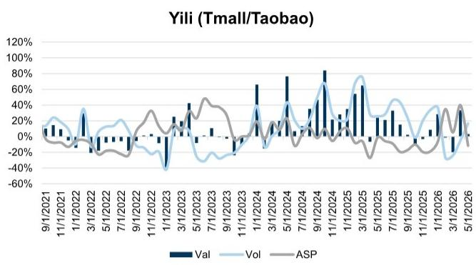  
Source: Moojing  
Valuation and key risks

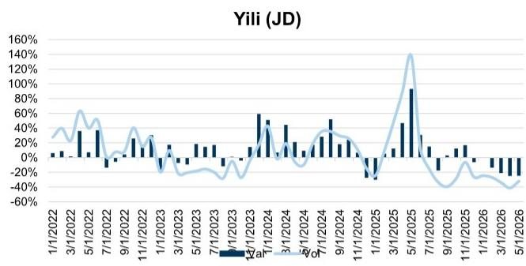  
Source: Nielsen

Yili (Buy): Our 12-month Rmb35 TP is based on 2026E P/E of 18.9x (20% A/H premium to the target level of 1STD below prior downcycle P/E in 2015-16).

Key risks 1) Slower-than-expected liquid milk premium demand; 2) A slower dairy demand recovery; 3) More intense competition.

## Other player updates: Bellamy/Biostime/A2 outperformed the online market

In offline markets, Ausnutria's sales decline increased to $-28\%$ yoy in Mar-Apr (vs. $-20\%$ in Jan-Feb) and continued underperforming the market. Junlebao's sales declined by $-22.3\%$ (vs. $-25.1\%$ in Jan-Feb), significantly lagging behind the market.

In the online market, for Tmall/Taobao/JD combined, among MNCs, Aptamil/A2/Biostime grew +6%/-25%/25% yoy in May, vs. +2%/+27%/+68% yoy in Apr, and Mead Johnson/Wyeth/Nutrilon declined significantly at -45%/-45%/-71% vs. -31%/-32%/-45% in Apr. Bellamy's growth momentum moderated at 19% in May vs. +80% in Apr.

A2: In the M&B channel, A2 recorded +2.9% sales growth in Mar-Apr, vs 2.9% Jan-Feb. Share by value increased 0.2ppt to 4.3% in Mar-Apr vs 4.1% in Jan-Feb, +0.4ppt yoy.

Mengniu (Buy): Mengniu's sales (excl. Yashili) grew at $10\%$ yoy in Mar-Apr vs. $+36\%$ yoy in Jan-Feb for offline markets.

H&H (Not Covered): For the MT and M&B stores, Biostime sales grew by 22.4% yoy vs. +25.8% in Jan-Feb, with market share trending down by 0.3pp to 7.5% in Mar-Apr vs. 7.8% at Jan-Feb.

Exhibit 24: Junlebao's sales declined by $22.3\%$ yoy, and Ausnutria sales declined by $28\%$ yoy, both underperforming the market Offline sales growth

Sales growth yoy (MT & MB channel combined)  
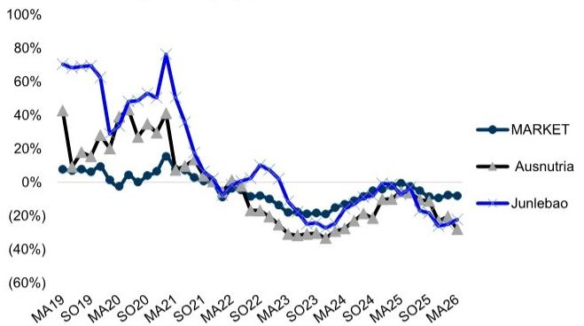  
Source: Nielsen

Exhibit 25: Yili sales grew by $1.9\%$ yoy; Mengniu's sales (excl. Yashili) grew at $+10\%$ yoy Offline sales growth

Sales growth yoy (MT & MB channel combined)  
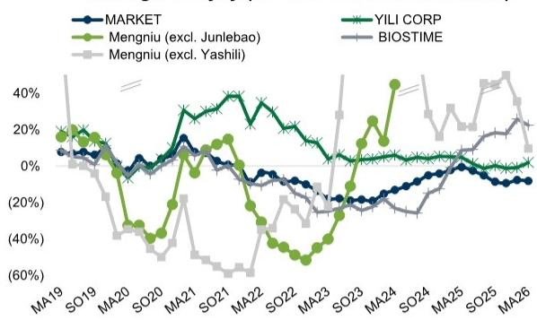  
Mengniu (excl. Junlebao) includes Yashili; data of Yashili sales in M&B channels not available since May-June 2024

Source: Nielsen

Exhibit 26: A2's sales declined by $25\%$ yoy in May, vs $+27\%$ yoy in Apr potentially due to supply cut Online sales growth

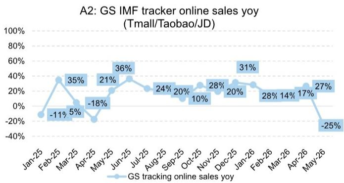  
Source: Nielsen

## Disclosure Appendix

## Reg AC

We, Leaf Liu, Peter Marks, Christina Liu, Rayanne Haidar and Valerie Zhou, hereby certify that all of the views expressed in this report accurately reflect our personal views about the subject company or companies and its or their securities. We also certify that no part of our compensation was, is or will be, directly or indirectly, related to the specific recommendations or views expressed in this report.

Unless otherwise stated, the individuals listed on the cover page of this report are analysts in GS' Global Investment Research division.

Contributing Authors: Leaf Liu GS (Asia) L.L.C., Peter Marks GS Australia Pty Ltd, Christina Liu GS (Asia) L.L.C., Rayanne Haidar GS Australia Pty Ltd, Valerie Zhou GS (Asia) L.L.C..

Unless otherwise stated, the individuals listed in the Contributing Authors disclosure of this report are analysts in GS' Global Investment Research division.

## GS Factor Profile

The GS Factor Profile provides investment context for a stock by comparing key attributes to the market (i.e. our universe of rated stocks) and its sector peers. The four key attributes depicted are: Growth, Financial Returns, Multiple (e.g. valuation) and Integrated (a composite of Growth, Financial Returns and Multiple). Growth, Financial Returns and Multiple are calculated by using normalized ranks for specific metrics for each stock. The normalized ranks for the metrics are then averaged and converted into percentiles for the relevant attribute. The precise calculation of each metric may vary depending on the fiscal year, industry and region, but the standard approach is as follows:

Growth is based on a stock's forward-looking sales growth, EBITDA growth and EPS growth (for financial stocks, only EPS and sales growth), with a higher percentile indicating a higher growth company. Financial Returns is based on a stock's forward-looking ROE, ROCE and CROCI (for financial stocks, only ROE), with a higher percentile indicating a company with higher financial returns. Multiple is based on a stock's forward-looking P/E, P/B, price/dividend (P/D), EV/EBITDA, EV/FCF and EV/Debt Adjusted Cash Flow (DACF) (for financial stocks, only P/E, P/B and P/D), with a higher percentile indicating a stock trading at a higher multiple. The Integrated percentile is calculated as the average of the Growth percentile, Financial Returns percentile and (100% - Multiple percentile).

Financial Returns and Multiple use the GS analyst forecasts at the fiscal year-end at least three quarters in the future. Growth uses inputs for the fiscal year at least seven quarters in the future compared with the year at least three quarters in the future (on a per-share basis for all metrics).

For a more detailed description of how we calculate the GS Factor Profile, please contact your GS representative.

## M&A Rank

Across our global coverage, we examine stocks using an M&A framework, considering both qualitative factors and quantitative factors (which may vary across sectors and regions) to incorporate the potential that certain companies could be acquired. We then assign a M&A rank as a means of scoring companies under our rated coverage from 1 to 3, with 1 representing high (30%-50%) probability of the company becoming an acquisition target, 2 representing medium (15%-30%) probability and 3 representing low (0%-15%) probability. For companies ranked 1 or 2, in line with our standard departmental guidelines we incorporate an M&A component into our target price. M&A rank of 3 is considered immaterial and therefore does not factor into our price target, and may or may not be discussed in research.

## Quantum

Quantum is GS' proprietary database providing access to detailed financial statement histories, forecasts and ratios. It can be used for in-depth analysis of a single company, or to make comparisons between companies in different sectors and markets.

## Disclosures

## Rating and pricing information

China Feihe Ltd. (Neutral, HK\$2.90), Mengniu Dairy (Buy, HK\$16.06), The a2 Milk Co. (Buy, A\$6.78), The a2 Milk Co. (Buy, NZ\$8.41) and Yili Industrial (Buy, Rmb24.46)

The rating(s) for China Feihe Ltd. and Yili Industrial is/are relative to the other companies in its/their coverage universe: Anhui Gujing Distillery Co., Budweiser APAC, Busy Ming Group, China Feihe Ltd., China Resources Beer, China Resources Beverage, Chongqing Brewery, Eastroc Beverage (A), Foshan Haitian Flavouring & Food (A), Foshan Haitian Flavouring & Food (H), Fujian Wanchen Food, Jiangsu King's Luck Brewery, Jiangsu Yanghe, Jiugui Liquor, Jonjee Hi-Tech, Kweichow Moutai, Luzhou Laojiao, Mengniu Dairy, Nongfu Spring, Qianhe Condiment and Food, Shanghai Bairun, Shanxi Xinghuacun Fen Wine, Sichuan Swellfun Co., Sichuan Teway Food Group, Tingyi, Tsingtao Brewery (A), Tsingtao Brewery (H), Uni-President China, Wuliangye Yibin, Yihai International Holding, Yili Industrial, ZJLD

The rating(s) for The a2 Milk Co. is/are relative to the other companies in its/their coverage universe: Accent Group, Breville Group, Coles Group, Endeavour Group, Flight Centre Travel Group, Harvey Norman Holdings, JB Hi Fi Ltd., Lovisa Holdings, Metcash Ltd., Nick Scali Ltd., Premier Investments Ltd., Sigma Healthcare Ltd., Super Retail Group, Temple & Webster Group, The a2 Milk Co., Treasury Wine Estates, WEB Travel Group, Webjet Group, Wesfarmers Ltd., Woolworths Group

## Company-specific regulatory disclosures

The following disclosures relate to relationships between The GS Group, Inc. (with its affiliates, “GS”) and companies covered by GS Global Investment Research and referred to in this research.

GS has received compensation for investment banking services in the past 12 months: The a2 Milk Co. (NZ\$8.41) and The a2 Milk Co. (A\$6.78)

GS expects to receive or intends to seek compensation for investment banking services in the next 3 months: The a2 Milk Co. (NZ\$8.41), The a2 Milk Co. (A\$6.78) and Yili Industrial (Rmb24.46)

GS had an investment banking services client relationship during the past 12 months with: The a2 Milk Co. (NZ\$8.41), The a2 Milk Co. (A\$6.78) and Yili Industrial (Rmb24.46)

GS had a non-investment banking securities-related services client relationship during the past 12 months with: The a2 Milk Co. (NZ\$8.41) and The a2 Milk Co. (A\$6.78)

GS makes a market in the securities or derivatives thereof: China Feihe Ltd. (HK\$2.90)

Distribution of ratings/investment banking relationships GS Investment Research global Equity coverage universe

<table><tr><td colspan="3">Rating Distribution</td></tr><tr><td>Buy</td><td>Hold</td><td>Sell</td></tr><tr><td>50%</td><td>34%</td><td>16%</td></tr></table>

<table><tr><td colspan="3">Investment Banking Relationships</td></tr><tr><td>Buy</td><td>Hold</td><td>Sell</td></tr><tr><td>65%</td><td>60%</td><td>45%</td></tr></table>

As of April 1, 2026, GS Global Investment Research had investment ratings on 3,074 equity securities. GS assigns stocks as Buys and Sells on various regional Investment Lists; stocks not so assigned are deemed Neutral. Such assignments equate to Buy, Hold and Sell for the purposes of the above disclosure required by the FINRA Rules. See ‘Ratings, Coverage universe and related definitions’ below. The Investment Banking Relationships chart reflects the percentage of subject companies within each rating category for whom GS has provided investment banking services within the previous twelve months.

## Price target and rating history chart(s)

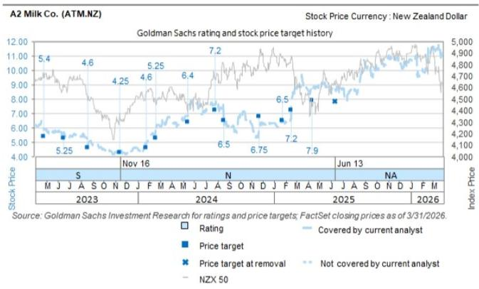  
The price targets shown should be considered in the context of all prior published GS, which may or may not have included price targets, as well as developments relating to the company, its industry and financial markets.

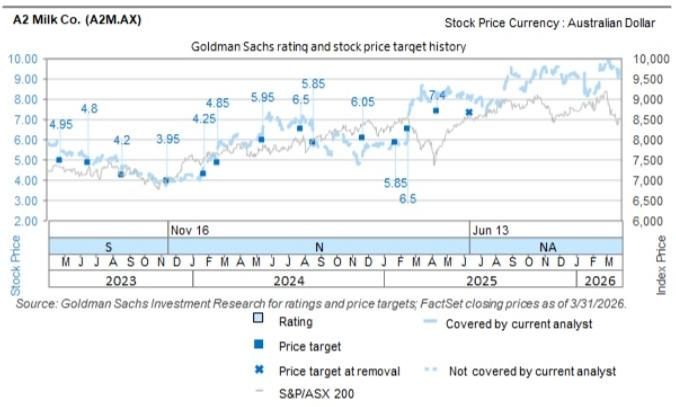  
The price targets shown should be considered in the context of all prior published GS, which may or may not have included price targets, as well as developments relating to the company, its industry and financial markets.

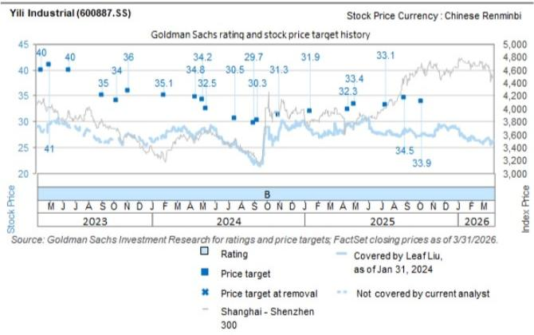  
The price targets shown should be considered in the context of all prior published GS, which may or may not have included price targets, as well as developments relating to the company, its industry and financial markets.

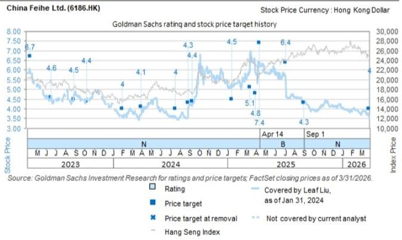  
The price targets shown should be considered in the context of all prior published GS, which may or may not have included price targets, as well as developments relating to the company, its industry and financial markets.

## Target price history table(s)

## China Feihe Ltd. (6186.HK)

## The a2 Milk Co. (A2M.AX)

<table><tr><td>Date of report</td><td>Target price (HK$)</td><td>Closing price (HK$)</td><td>Date of report</td><td>Target price (A$)</td><td>Closing price (A$)</td></tr><tr><td>27-May-26</td><td>3.43</td><td>3.10</td><td>23-Jun-26</td><td>7.90</td><td>6.78</td></tr><tr><td>29-Mar-26</td><td>4.00</td><td>3.68</td><td>14-Apr-25</td><td>7.40</td><td>8.06</td></tr><tr><td>01-Sep-25</td><td>4.30</td><td>4.29</td><td>17-Feb-25</td><td>6.50</td><td>7.12</td></tr><tr><td>06-Jul-25</td><td>6.40</td><td>5.70</td><td>23-Jan-25</td><td>5.85</td><td>5.89</td></tr><tr><td>14-Apr-25</td><td>7.40</td><td>6.29</td><td>22-Nov-24</td><td>6.05</td><td>5.45</td></tr><tr><td>31-Mar-25</td><td>4.80</td><td>5.87</td><td>19-Aug-24</td><td>5.85</td><td>5.70</td></tr><tr><td>15-Mar-25</td><td>5.10</td><td>6.86</td><td>28-Jul-24</td><td>6.50</td><td>6.85</td></tr><tr><td>16-Jan-25</td><td>4.50</td><td>5.11</td><td>15-May-24</td><td>5.95</td><td>6.24</td></tr><tr><td>10-Sep-24</td><td>4.40</td><td>4.14</td><td>19-Feb-24</td><td>4.85</td><td>5.68</td></tr><tr><td>29-Aug-24</td><td>4.30</td><td>4.04</td><td>24-Jan-24</td><td>4.25</td><td>4.66</td></tr><tr><td colspan="3">China Feihe Ltd. (6186.HK)</td><td colspan="3">The a2 Milk Co. (A2M.AX)</td></tr><tr><td>Date of report</td><td>Target price (HK$)</td><td>Closing price (HK$)</td><td>Date of report</td><td>Target price (A$)</td><td>Closing price (A$)</td></tr><tr><td>19-Jul-24</td><td>4.00</td><td>3.60</td><td>16-Nov-23</td><td>3.95</td><td>3.82</td></tr><tr><td>31-Mar-24</td><td>4.10</td><td>3.68</td><td>21-Aug-23</td><td>4.20</td><td>4.27</td></tr><tr><td>31-Jan-24</td><td>4.00</td><td>3.58</td><td></td><td></td><td></td></tr><tr><td>10-Oct-23</td><td>4.40</td><td>4.49</td><td></td><td></td><td></td></tr><tr><td>30-Aug-23</td><td>4.50</td><td>4.67</td><td></td><td></td><td></td></tr></table>

<table><tr><td>Date of report</td><td>Target price (NZ$)</td><td>Closing price (NZ$)</td><td>Date of report</td><td>Target price (Rmb)</td><td>Closing price (Rmb)</td></tr><tr><td>23-Jun-26</td><td>9.60</td><td>8.41</td><td>30-Apr-26</td><td>35.00</td><td>27.46</td></tr><tr><td>14-Apr-25</td><td>7.90</td><td>8.77</td><td>08-Oct-25</td><td>33.90</td><td>-</td></tr><tr><td>17-Feb-25</td><td>7.20</td><td>7.86</td><td>29-Aug-25</td><td>34.50</td><td>28.57</td></tr><tr><td>23-Jan-25</td><td>6.50</td><td>6.53</td><td>14-Jul-25</td><td>33.10</td><td>27.49</td></tr><tr><td>22-Nov-24</td><td>6.75</td><td>6.29</td><td>01-May-25</td><td>33.40</td><td>29.76</td></tr><tr><td>19-Aug-24</td><td>6.50</td><td>6.27</td><td>16-Apr-25</td><td>32.30</td><td>29.70</td></tr><tr><td>28-Jul-24</td><td>7.20</td><td>7.60</td><td>16-Jan-25</td><td>31.90</td><td>28.33</td></tr><tr><td>15-May-24</td><td>6.40</td><td>6.82</td><td>31-Oct-24</td><td>31.30</td><td>27.91</td></tr><tr><td>19-Feb-24</td><td>5.25</td><td>6.14</td><td>10-Sep-24</td><td>30.30</td><td>21.95</td></tr><tr><td>24-Jan-24</td><td>4.60</td><td>4.97</td><td>01-Sep-24</td><td>29.70</td><td>22.63</td></tr><tr><td>16-Nov-23</td><td>4.25</td><td>4.15</td><td>19-Jul-24</td><td>30.50</td><td>26.40</td></tr><tr><td>21-Aug-23</td><td>4.60</td><td>4.68</td><td>12-May-24</td><td>32.50</td><td>27.95</td></tr><tr><td></td><td></td><td></td><td>02-May-24</td><td>34.20</td><td>28.61</td></tr><tr><td></td><td></td><td></td><td>15-Apr-24</td><td>34.80</td><td>27.04</td></tr><tr><td></td><td></td><td></td><td>31-Jan-24</td><td>35.10</td><td>27.09</td></tr><tr><td></td><td></td><td></td><td>06-Nov-23</td><td>36.00</td><td>27.55</td></tr><tr><td></td><td></td><td></td><td>10-Oct-23</td><td>34.00</td><td>26.79</td></tr><tr><td></td><td></td><td></td><td>06-Sep-23</td><td>35.00</td><td>26.19</td></tr></table>

Price targets shown in table(s) are unadjusted for corporate actions.

## Regulatory disclosures

## Disclosures required by United States laws and regulations

See company-specific regulatory disclosures above for any of the following disclosures required as to companies referred to in this report: manager or co-manager in a pending transaction; 1% or other ownership; compensation for certain services; types of client relationships; managed/co-managed public offerings in prior periods; directorships; for equity securities, market making and/or specialist role. GS trades or may trade as a principal in debt securities (or in related derivatives) of issuers discussed in this report.

The following are additional required disclosures: Ownership and material conflicts of interest: GS policy prohibits its analysts, professionals reporting to analysts and members of their households from owning securities of any company in the analyst's area of coverage. Analyst compensation: Analysts are paid in part based on the profitability of GS, which includes investment banking revenues. Analyst as officer or director: GS policy generally prohibits its analysts, persons reporting to analysts or members of their households from serving as an officer, director or advisor of any company in the analyst's area of coverage. Non-U.S. Analysts: Non-U.S. analysts may not be associated persons of GS & Co. LLC and therefore may not be subject to FINRA Rule 2241 or FINRA Rule 2242 restrictions on communications with a subject company, public appearances and trading in securities covered by the analysts.

Distribution of ratings: See the distribution of ratings disclosure above. Price chart: See the price chart, with changes of ratings and price targets in prior periods, above, or, if electronic format or if with respect to multiple companies which are the subject of this report, on the GS website at https://www.gs.com/research/hedge.html.

Additional disclosures required under the laws and regulations of jurisdictions other than the United States
The following disclosures are those required by the jurisdiction indicated, except to the extent already made above pursuant to United States laws and regulations. Australia: GS Australia Pty Ltd and its affiliates are not authorised deposit-taking institutions (as that term is defined in the Banking Act 1959 (Cth)) in Australia and do not provide banking services, nor carry on a banking business, in Australia. This research, and any access to it, is intended only for “wholesale clients” within the meaning of the Australian Corporations Act, unless otherwise agreed by GS. In producing research reports, members of Global Investment Research of GS Australia may attend site visits and other meetings hosted by the companies and other entities which are the subject of its research reports. In some instances the costs of such site visits or meetings may be met in part or in whole by the issuers concerned if GS Australia considers it is appropriate and reasonable in the specific circumstances relating to the site visit or meeting. To the extent that the contents of this document contains any financial product advice, it is general advice only and has been prepared by GS without taking into account a client’s objectives, financial situation or needs. A client should, before acting on any such advice, consider the appropriateness of the advice having regard to the client’s own objectives, financial situation and needs. A copy of certain GS Australia and New Zealand disclosure of interests and a copy of GS’ Australian Sell-Side Research Independence Policy Statement are available at: https://www.goldmansachs.com/disclosures/australia-new-zealand/index.html. Brazil: Disclosure information in relation to CVM Resolution n. 20 is available at https://www.gs.com/worldwide/brazil/area/gir/index.html. Where applicable, the Brazil-registered analyst primarily responsible for the content of this research report, as defined in Article 20 of CVM Resolution n. 20, is the first author named at the beginning of this report, unless indicated otherwise at the end of the text. Canada: This information is being provided to you for information purposes only and is not, and under no circumstances should be construed as, an advertisement, offering or solicitation by GS & Co. LLC for purchasers of securities in Canada to trade in any Canadian security. GS & Co. LLC is not registered as a dealer in any jurisdiction in Canada under applicable Canadian securities laws and generally is not permitted to trade in Canadian securities and may be prohibited from selling certain securities and products in certain jurisdictions in Canada. If you wish to trade in any Canadian securities or other products in Canada please contact GS Canada Inc., an affiliate of The GS Group Inc., or another registered Canadian dealer. Hong Kong: Further information on the securities of covered companies referred to in this research may be obtained on request from GS (Asia) L.L.C. India: Further information on the subject company or companies referred to in this research may be obtained from GS (India) Securities Private Limited, Research Analyst - SEBI Registration Number INH000001493, 10th Floor, Ascent-Worli, Sudam Kalu Ahire Marg, Worli, Mumbai-400 025, India, Corporate Identity Number U74140MH2006FTC160634, Phone +91 22 6616 9000, Fax +91 22 6616 9001. GS may beneficially own 1% or more of the securities (as such term is defined in clause 2 (h) the Indian Securities Contracts (Regulation) Act, 1956) of the subject company or companies referred to in this research report. Investment in securities market are subject to market risks. Read all the related documents carefully before investing. Registration granted by SEBI and certification from NISM in no way guarantee performance of the intermediary or provide any assurance of returns to investors. GS (India) Securities Private Limited compliance officer and investor grievance contact details can be found at:

https://www.goldmansachs.com/worldwide/india/documents/Grievance-Redressal-and-Escalation-Matrix.pdf, and a copy of the annual audit compliance report can be found at this link: https://publishing.gs.com/content/site/india-annual-compliance-report.html. Japan: See below. Korea: This research, and any access to it, is intended only for “professional investors” within the meaning of the Financial Services and Capital Markets Act, unless otherwise agreed by GS. Further information on the subject company or companies referred to in this research may be obtained from GS (Asia) L.L.C., Seoul Branch. New Zealand: GS New Zealand Limited and its affiliates are neither “registered banks” nor “deposit takers” (as defined in the Reserve Bank of New Zealand Act 1989) in New Zealand. This research, and any access to it, is intended for “wholesale clients” (as defined in the Financial Advisers Act 2008) unless otherwise agreed by GS. A copy of certain GS Australia and New Zealand disclosure of interests is available at: https://www.goldmansachs.com/disclosures/australia-new-zealand/index.html. Russia: Research reports distributed in the Russian Federation are not advertising as defined in the Russian legislation, but are information and analysis not having product promotion as their main purpose and do not provide appraisal within the meaning of the Russian legislation on appraisal activity. Research reports do not constitute a personalized investment recommendation as defined in Russian laws and regulations, are not addressed to a specific client, and are prepared without analyzing the financial circumstances, investment profiles or risk profiles of clients. GS assumes no responsibility for any investment decisions that may be taken by a client or any other person based on this research report. Singapore: GS (Singapore) Pte. (Company Number: 198602165W), which is regulated by the Monetary Authority of Singapore, accepts legal responsibility for this research, and should be contacted with respect to any matters arising from, or in connection with, this research. Taiwan: This material is for reference only and must not be reprinted without permission. Investors should carefully consider their own investment risk. Investment results are the responsibility of the individual investor. United Kingdom: Persons who would be categorized as retail clients in the United Kingdom, as such term is defined in the rules of the Financial Conduct Authority, should read this research in conjunction with prior GS on the covered companies referred to herein and should refer to the risk warnings that have been sent to them by GS International. A copy of these risks warnings, and a glossary of certain financial terms used in this report, are available from GS International on request.

European Union and United Kingdom: Disclosure information in relation to Article 6 (2) of the European Commission Delegated Regulation (EU) (2016/958) supplementing Regulation (EU) No 596/2014 of the European Parliament and of the Council (including as that Delegated Regulation is implemented into United Kingdom domestic law and regulation following the United Kingdom's departure from the European Union and the European Economic Area) with regard to regulatory technical standards for the technical arrangements for objective presentation of investment recommendations or other information recommending or suggesting an investment strategy and for disclosure of particular interests or indications of conflicts of interest is available at https://www.gs.com/disclosures/europeanpolicy.html which states the European Policy for Managing Conflicts of Interest in Connection with Investment Research.

Japan: GS Japan Co., Ltd. is a Financial Instrument Dealer registered with the Kanto Financial Bureau under registration number Kinsho 69, and a member of Japan Securities Dealers Association, Financial Futures Association of Japan Type II Financial Instruments Firms Association, and Investment Management Association of Japan. Sales and purchase of equities are subject to commission pre-determined with clients plus consumption tax. See company-specific disclosures as to any applicable disclosures required by Japanese stock exchanges, the Japanese Securities Dealers Association or the Japanese Securities Finance Company.

## Ratings, coverage universe and related definitions

Buy (B), Neutral (N), Sell (S) Analysts recommend stocks as Buys or Sells for inclusion on various regional Investment Lists. Being assigned a Buy or Sell on an Investment List is determined by a stock's total return potential relative to its coverage universe. Any stock not assigned as a Buy or a Sell on an Investment List with an active rating (i.e., a stock that is not Rating Suspended, Not Rated, Early-Stage Biotech, Coverage Suspended or Not Covered), is deemed Neutral. Each region manages Regional Conviction Lists, which are selected from Buy rated stocks on the respective region's Investment Lists and represent investment recommendations focused on the size of the total return potential and/or the likelihood of the realization of the return across their respective areas of coverage. The addition or removal of stocks from such Conviction Lists are managed by the Investment Review Committee or other designated committee in each respective region and do not represent a change in the analysts' investment rating for such stocks.

Total return potential represents the upside or downside differential between the current share price and the price target, including all paid or anticipated dividends, expected during the time horizon associated with the price target. Price targets are required for all covered stocks. The total return potential, price target and associated time horizon are stated in each report adding or reiterating an Investment List membership.

Coverage Universe: A list of all stocks in each coverage universe is available by primary analyst, stock and coverage universe at https://www.gs.com/research/hedge.html.

Not Rated (NR). The investment rating, target price and earnings estimates (where relevant) are removed pursuant to GS policy when GS is acting in an advisory capacity in a merger or in a strategic transaction involving this company, when there are legal, regulatory or policy constraints due to GS' involvement in a transaction, and in certain other circumstances. Early-Stage Biotech (ES). An investment rating and a target price are not assigned pursuant to GS policy when this company has neither a drug, treatment or medical device that has passed a Phase II clinical trial nor a license to distribute a post-Phase II drug, treatment or medical device. Rating Suspended (RS). GS has suspended the investment rating and price target for this stock, because there is not a sufficient fundamental basis for determining an investment rating or target price. The previous investment rating and target price, if any, are no longer in effect for this stock and should not be relied upon. Coverage Suspended (CS). GS has suspended coverage of this company. Not Covered (NC). GS does not cover this company.

## Global product; distributing entities

GS Global Investment Research produces and distributes research products for clients of GS on a global basis. Analysts based in GS offices around the world produce research on industries and companies, and research on macroeconomics, currencies, commodities and portfolio strategy. This research is disseminated in Australia by GS Australia Pty Ltd (ABN 21 006 797 897); in Brazil by GS do Brasil Corretora de Títulos e Valores Mobiliários S.A.; Public Communication Channel GS Brazil: 0800 727 5764 and / or contatogoldmanbrasil@gs.com. Available Weekdays (except holidays), from 9am to 6pm. Canal de Comunicação com o Público GS Brasil: 0800 727 5764 e/ou contatogoldmanbrasil@gs.com. Horário de funcionamento: segunda-feira à sexta-feira (exceto feriados), das 9h às 18h; in Canada by GS & Co. LLC; in Hong Kong by GS (Asia) L.L.C.; in India by GS (India) Securities Private Ltd.; in Japan by GS Japan Co., Ltd.; in the Republic of Korea by GS (Asia) L.L.C., Seoul Branch; in New Zealand by GS New Zealand Limited; in Russia by OOO GS; in Singapore by GS (Singapore) Pte. (Company Number: 198602165W); and in the United States of America by GS & Co. LLC. GS International has approved this research in connection with its distribution in the United Kingdom.

GS International (“GSI”), authorised by the Prudential Regulation Authority (“PRA”) and regulated by the Financial Conduct Authority (“FCA”) and the PRA, has approved this research in connection with its distribution in the United Kingdom.

European Economic Area: GS Bank Europe SE (“GSBE”) is a credit institution incorporated in Germany and, within the Single Supervisory Mechanism, subject to direct prudential supervision by the European Central Bank and in other respects supervised by German Federal Financial Supervisory Authority (Bundesanstalt für Finanzdienstleistungsaufsicht, BaFin) and Deutsche Bundesbank and disseminates research within the European Economic Area.

## General disclosures

This research is for our clients only. Other than disclosures relating to GS, this research is based on current public information that we consider reliable, but we do not represent it is accurate or complete, and it should not be relied on as such. The information, opinions, estimates and forecasts contained herein are as of the date hereof and are subject to change without prior notification. We seek to update our research as appropriate, but various regulations may prevent us from doing so. Other than certain industry reports published on a periodic basis, the large majority of reports are published at irregular intervals as appropriate in the analyst's judgment.

GS conducts a global full-service, integrated investment banking, investment management, and brokerage business. We have investment banking and other business relationships with a substantial percentage of the companies covered by Global Investment Research. GS & Co. LLC, the United States broker dealer, is a member of SIPC (https://www.sipc.org).

Our salespeople, traders, and other professionals may provide oral or written market commentary or trading strategies to our clients and principal trading desks that reflect opinions that are contrary to the opinions expressed in this research. Our asset management area, principal trading desks and investing businesses may make investment decisions that are inconsistent with the recommendations or views expressed in this research.

The analysts named in this report may have from time to time discussed with our clients, including GS salespersons and traders, or may discuss in this report, trading strategies that reference catalysts or events that may have a near-term impact on the market price of the equity securities discussed in this report, which impact may be directionally counter to the analyst's published price target expectations for such stocks. Any such trading strategies are distinct from and do not affect the analyst's fundamental equity rating for such stocks, which rating reflects a stock's return potential relative to its coverage universe as described herein.

We and our affiliates, officers, directors, and employees will from time to time have long or short positions in, act as principal in, and buy or sell, the securities or derivatives, if any, referred to in this research, unless otherwise prohibited by regulation or GS policy.

The views attributed to third party presenters at GS arranged conferences, including individuals from other parts of GS, do not necessarily reflect those of Global Investment Research and are not an official view of GS.

Any third party referenced herein, including any salespeople, traders and other professionals or members of their household, may have positions in the products mentioned that are inconsistent with the views expressed by analysts named in this report.

This research is not an offer to sell or the solicitation of an offer to buy any security in any jurisdiction where such an offer or solicitation would be illegal. It does not constitute a personal recommendation or take into account the particular investment objectives, financial situations, or needs of individual clients. Clients should consider whether any advice or recommendation in this research is suitable for their particular circumstances and, if appropriate, seek professional advice, including tax advice. The price and value of investments referred to in this research and the income from them may fluctuate. Past performance is not a guide to future performance, future returns are not guaranteed, and a loss of original capital may occur. Fluctuations in exchange rates could have adverse effects on the value or price of, or income derived from, certain investments.

Certain transactions, including those involving futures, options, and other derivatives, give rise to substantial risk and are not suitable for all investors. Investors should review current options and futures disclosure documents which are available from GS sales representatives or at https://www.theocc.com/about/publications/character-risks.jsp and https://www.goldmansachs.com/disclosures/cftc\_fcm\_disclosures. Transaction costs may be significant in option strategies calling for multiple purchase and sales of options such as spreads. Supporting documentation will be supplied upon request.

Differing Levels of Service provided by Global Investment Research: The level and types of services provided to you by GS Global Investment Research may vary as compared to that provided to internal and other external clients of GS, depending on various factors including your individual preferences as to the frequency and manner of receiving communication, your risk profile and investment focus and perspective (e.g., marketwide, sector specific, long term, short term), the size and scope of your overall client relationship with GS, and legal and regulatory constraints. As an example, certain clients may request to receive notifications when research on specific securities is published, and certain clients may request that specific data underlying analysts' fundamental analysis available on our internal client websites be delivered to them electronically through data feeds or otherwise. No change to an analyst's fundamental research views (e.g., ratings, price targets, or material changes to earnings estimates for equity securities), will be communicated to any client prior to inclusion of such information in a research report broadly disseminated through electronic publication to our internal client websites or through other means, as necessary, to all clients who are entitled to receive such reports.

All research reports are disseminated and available to all clients simultaneously through electronic publication to our internal client websites. Not all research content is redistributed to our clients or available to third-party aggregators, nor is GS responsible for the redistribution of our research by third party aggregators. For research, models or other data related to one or more securities, markets or asset classes (including related services) that may be available to you, please contact your GS representative or go to https://research.gs.com.

Disclosure information is also available at https://www.gs.com/research/hedge.html or from Research Compliance, 200 West Street, New York, NY 10282.

## © 2026 GS.

You are permitted to store, display, analyze, modify, reformat, and print the information made available to you via this service only for your own use. You may not resell or reverse engineer this information to calculate or develop any index for disclosure and/or marketing or create any other derivative works or commercial product(s), data or offering(s) without the express written consent of GS. You are not permitted to publish, transmit, or otherwise reproduce this information, in whole or in part, in any format to any third party without the express written consent of GS. This foregoing restriction includes, without limitation, using, extracting, downloading or retrieving this information, in whole or in part, to train or finetune a machine learning or artificial intelligence system, or to provide or reproduce this information, in whole or in part, as a prompt or input to any such system.