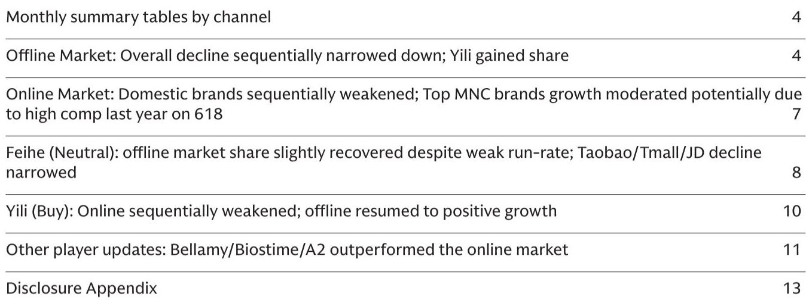
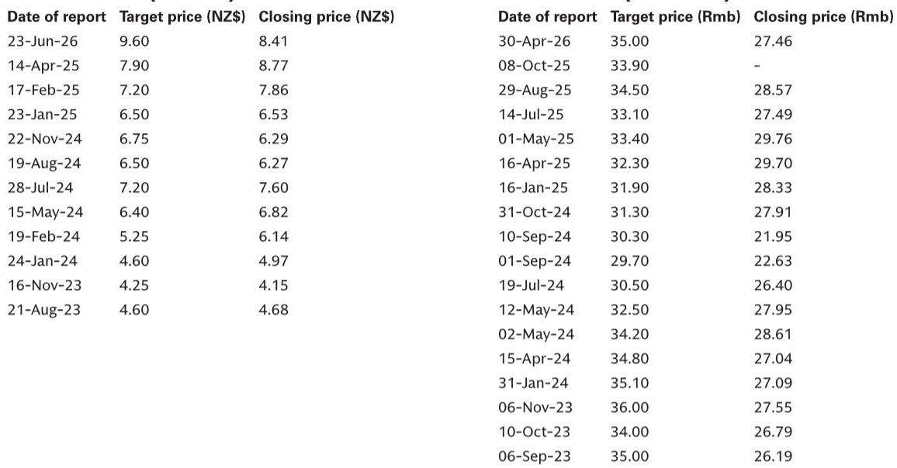

# GS：奶粉行业最坏的时候正在过去，但赢家已非旧面孔

中国奶粉行业正在经历一场“量价双杀”的尾部出清，但GS最新追踪的尼尔森与线上数据揭示了一个更微妙的信号：行业总量的收缩幅度在边际上趋于稳定，而真正的分化发生在品牌之间——不是国产与进口的简单二分，而是渠道能力、库存周期与品牌信任度的重新排序。

这份发布于2026年5-6月的研报，覆盖了截至2026年4月的线下数据与5月的线上数据。对于关注中国消费品的投资者而言，核心判断只有一个：行业底部可能正在形成，但下一轮增长的受益者，不会是上一轮周期的全部赢家。

## 1. 线下降幅边际收窄，但量价结构尚未触底

GS引用的尼尔森数据显示，2026年3-4月，中国婴幼儿配方奶粉线下市场同比下降8.2%，较1-2月的7.7%降幅有所扩大。但深入拆解后，信号并不完全悲观。

关键在于结构：3-4月线下销量同比下降9%，较1-2月的8.7%降幅仅扩大0.3个百分点；而平均售价同比微增0.9%，较1-2月的1.1%增幅略有收窄。这意味着，行业的下行主要仍由销量驱动，而非价格战加剧。母婴店渠道下降7.3%，现代商超渠道下降20%，渠道分化持续。

> **KC评论：** 量跌价稳的组合，说明行业正在经历“被动缩量”而非“主动降价”。这比量价齐跌更接近底部信号。但完整报告中的图表显示，线上渠道5月降幅扩大至19%，京东渠道更是同比下滑26%，这提示线上库存压力可能仍在释放中。想判断线上是否先于线下触底，需要看完整报告中的季度增长趋势图。

## 2. 伊利逆势转正，飞鹤仍在追赶市场

品牌层面的分化是这份报告最值得细读的部分。

伊利线下渠道在3-4月实现1.9%的同比增长，较1-2月的-0.9%显著改善，且跑赢行业-8.2%的降幅。驱动因素来自母婴店渠道2.8%的增长。伊利在母婴渠道的份额持续提升，说明其渠道下沉与品牌信任度正在转化为实际销售。

飞鹤的情况则更为复杂。线下渠道3-4月同比下降12%，虽然较1-2月的-15%有所收窄，但仍显著跑输行业。飞鹤的线下市场份额从1-2月的20.6%微升至3-4月的21%，同比仍下降0.9个百分点。线上渠道更为严峻，5月天猫/淘宝/京东合计同比下降31%，尽管较4月的-47%有所改善，但基数效应不可忽视。

> **KC评论：** 伊利转正与飞鹤仍负增长的对比，是这份报告最值得追问的地方。伊利做对了什么？是产品结构升级，还是渠道管理更精细？飞鹤的份额回升是否可持续？完整报告中对两家公司的估值与风险部分有更详细的拆解，包括对出生率、竞争格局、政策支持等关键变量的敏感性分析。

## 3. 外资品牌份额回升，但赢家高度集中

GS的数据显示，3-4月线下市场外资品牌整体价值份额从1-2月的23.5%回升至23.8%，增加0.3个百分点。但外资内部的分化同样剧烈。

A2 Milk在母婴店渠道实现2.9%的同比增长，市场份额从4.1%升至4.3%，同比增加0.4个百分点，主要靠销量增长4%驱动。达能（包括多美滋与纽迪希亚）线下份额小幅提升。但惠氏（雀巢）线下同比下降60%，份额从1-2月的1.3%降至1.1%，同比降幅达1.5个百分点。

线上渠道同样呈现“强者恒强”的格局。5月天猫/淘宝/京东合计，爱他美（达能）同比增长6%，市场份额维持在20%左右；贝拉米（蒙牛）同比增长19%，尽管增速从4月的80%回落；而A2线上同比下降25%，可能与其4月起主动控制供应有关。

> **KC评论：** 外资品牌整体份额回升，但惠氏和纽迪希亚的大幅下滑说明，消费者对外资品牌的“信任溢价”正在收窄，只有真正具备产品差异化或渠道优势的品牌才能守住阵地。完整报告中的线上市场份额变化图表，可以帮助判断哪些品牌正在“吃”掉竞争对手的份额。

## 4. 报告尚未完全回答的关键问题：线上库存周期的二阶影响

GS的线上数据揭示了一个值得警惕的现象：5月行业线上销售额同比下降19%，但京东渠道同比降幅高达26%。考虑到京东是奶粉线上销售的重要渠道，这一降幅可能不仅仅是需求疲软，更可能反映了渠道库存的去化加速。

研报提到，5月线上降幅扩大部分源于去年同期的高基数（618大促）。但更深层的问题是：如果线上库存去化持续，是否会传导至线下价格体系？目前线下ASP仍维持正增长，但线上折扣力度加大是否会迫使线下跟进？

这份报告对线上渠道的“库存周期”着墨不多，而这恰恰是判断行业何时真正触底的关键变量。

## 5. 给读者的观察框架：从“总量思维”转向“份额思维”

基于GS这份研报，我们建议读者调整对中国奶粉行业的观察框架：

第一，总量指标（行业增速、出生率）的重要性正在下降。行业已进入存量博弈阶段，出生率下行是共识，市场对此的定价已相对充分。真正的超额收益来自份额变化。

第二，渠道结构是分化的第一层过滤器。伊利在母婴渠道的持续增长，飞鹤在线上渠道的剧烈波动，都说明不同品牌在不同渠道的竞争壁垒差异巨大。单纯看“全渠道”数据可能会掩盖关键信号。

第三，ASP趋势是判断竞争烈度的核心指标。如果ASP开始普遍下滑，意味着行业进入价格战阶段，这将压缩所有玩家的利润空间。目前ASP仍为正增长，但线上折扣力度需要持续跟踪。

第四，库存周期是短期波动的放大器。无论是线上还是线下，渠道库存的去化速度都会影响短期销售数据。GS的数据显示，部分品牌的线上波动可能与主动控制供应有关（如A2），而非需求崩溃。

> **KC评论：** 这些观察框架在完整报告中都有对应的图表和数据支撑，包括按渠道、按品牌、按月度的详细追踪。对于希望建立自己判断框架的读者，完整报告中的图表比文字更有价值。

## 6. 未解之问与后续方向

GS这份报告留下了几个值得持续追问的问题：

飞鹤的线上降幅收窄是趋势反转还是基数效应？伊利能否维持母婴渠道的增长势头？外资品牌中，谁最有可能复制A2的份额提升路径？线上库存去化何时完成，以及它对线下ASP的传导效应有多大？

这些问题的答案，可能需要等到7-8月的数据出炉才能初步判断。但一个更根本的命题是：在出生率长期下行的大背景下，中国奶粉行业是否还能回到“量价齐升”的黄金时代？还是说，未来的增长只能来自集中度提升和产品结构升级？

这份GS研报没有给出绝对答案，但它提供了一个足够细致的分析框架——这正是专业研报的价值所在：不是替你做决策，而是给你做决策所需要的工具。

---

每天，我们的AI agent会与人工团队一起，从GS、MS、JPM、UBS、Citi等国际投行的最新研报中，筛选出对中国市场最具洞察力的报告，制作成中文摘要与KC评论，并整理当天最新数据图表合集。这些内容既方便你喂给AI做进一步分析，也方便人工快速把握全球市场动态。

如果你对这份报告的完整内容、原始图表，或者对奶粉行业以外的消费、科技、宏观等领域的GS研报感兴趣，欢迎加入我们的知识星球微信群继续讨论。那里每天更新约10-40页的投行研报摘要与数据合集，帮助你持续跟踪全球顶级机构的最新判断。

Personal reading notes and learning share only. Not investment advice.

