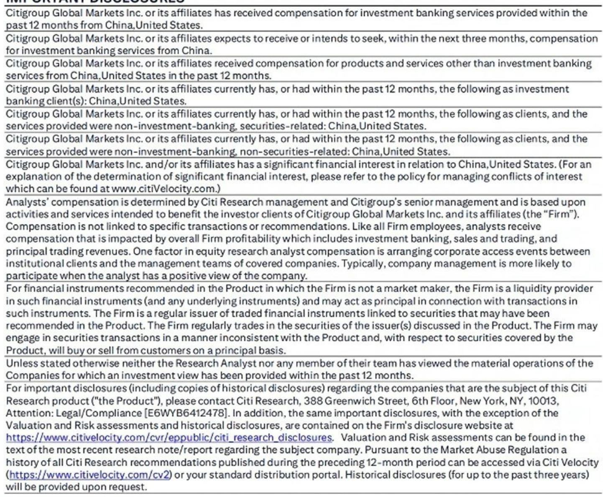
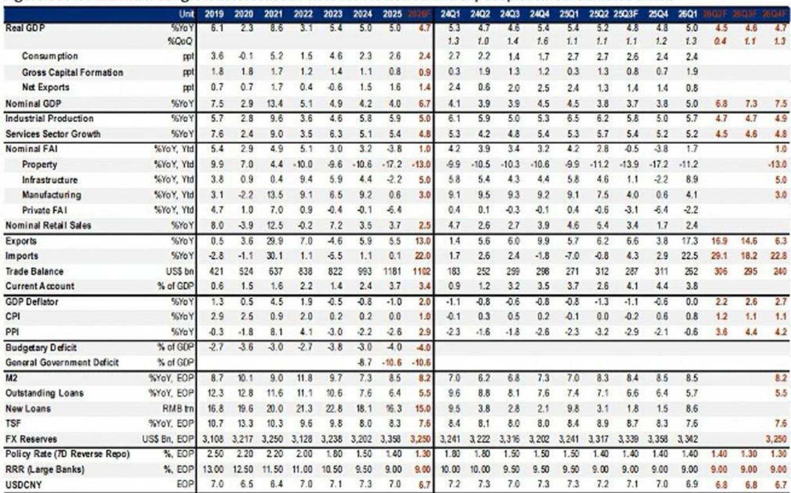
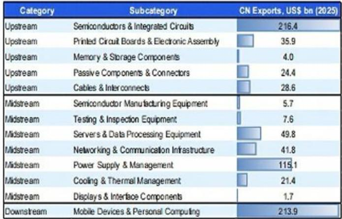

# The AI Supercycle Is Reshaping China's K-Shaped Economy, Not Healing It

China's economic recovery is not a single story. It is a bifurcated narrative where the strong leg grows stronger and the weak leg fragments further, with artificial intelligence now acting as the primary driver of this divergence. The AI supercycle, accelerated by the DeepSeek moment in early 2025, has moved beyond algorithm development into tangible infrastructure buildout, powering exports, production, and high-tech investment while simultaneously weighing on consumer confidence through displacement fears and crowding out traditional economy investment. This is not a temporary cyclical shift. It represents a structural reordering of China's economic landscape, one where policy prioritizes technological transition over broad-based stimulus, and where investors must abandon the assumption that aggregate growth figures tell a unified story about opportunity.

The implications are profound for anyone allocating capital in or to China. The headline growth forecast of 4.7 percent for 2026 masks a world of difference between AI-adjacent sectors and the rest of the economy. The strong leg of the K — exports, high-tech production, and AI-related investment — is accelerating, while the weak leg fragments into distinct winners and losers across sectors, cities, and even individual companies. The question is no longer whether China can grow, but whether the growth that occurs will reach the parts of the economy that need it most. The evidence so far suggests the answer is no, and the policy framework reinforces this selectivity.

## The AI Supercycle Powers the Strong Leg Through Exports and Production, Creating a Structural Tailwind That Outlasts Cyclical Booms

The most significant transformation visible in the data is the shift from cyclical export strength to structural export tailwind. AI-related exports — spanning upstream semiconductors, midstream power equipment and servers, and downstream personal electronics — accounted for over 20 percent of China's total exports in 2025, and their growth accelerated to nearly 35 percent year-on year in the first five months of 2026. This contributed nearly 7 percentage points to headline export growth during that period. The composition matters as much as the magnitude. These are not commodity exports vulnerable to price swings or tariff cycles. They are components and equipment tied to a global technological transition that remains in its early stages.

The structural nature of this export strength is reinforced by pricing dynamics. PPI reflation, which began in March 2026, has been driven significantly by AI-related items across the supply chain, with price surges translating into meaningful revenue and profit growth. Telecom equipment manufacturing profits jumped over 100 percent year-on-year in the first four months of 2026. This is not the kind of export boom that reverses when a trade dispute settles or a competitor emerges. It is anchored in a global buildout of computing infrastructure that will continue for years.

Production dynamics tell a similar story. High-tech industrial production rose over 13 percent year-on-year in the year to date, with the monthly rate accelerating to a five-year high in May. Despite carrying a weight of only about 17 percent of total industrial production, high-tech now contributes over half of headline growth. Integrated circuit output expanded over 25 percent year-on-year in the first five months of 2026, with a meaningful portion directed toward domestic use. Industrial robot output grew over 28 percent year-on-year. These are not marginal trends. They represent a reorientation of China's industrial base toward AI-driven manufacturing that will persist regardless of what happens to the broader consumption cycle.

## The Weak Leg Is Not Simply Weak — It Is Fragmenting Into Distinct Winners and Losers, Driven by AI Adjacency and Geographic Concentration

The conventional narrative of a K-shaped economy implies a simple bifurcation: the strong leg grows, the weak leg stagnates. The current data suggests something more complex and, for investors, more consequential. The weak leg is fragmenting into distinct segments where AI-adjacent sectors and cities are pulling ahead against an otherwise sluggish backdrop, while the rest continues to deteriorate.

Consumer confidence dipped further in April 2026 from an already subdued level, remaining below the neutral benchmark of 100 for 50 consecutive months. Household risk appetite stays low, with net loan repayments reaching over 600 billion renminbi in the first five months of 2026. Households still hold over 28 trillion renminbi in excess deposits relative to the linear trend, and the saving rate remains elevated. Consumption policies that drove gains in 2025 are fading, with retail sales posting their first contraction since the pandemic in May 2026. This is not a consumer base poised for a recovery.

Yet within this weak leg, pockets of strength exist. Tier-1 city property prices have stabilized, while the national index continues to search for a bottom. Luxury sales have held up despite external headwinds. The common thread is AI adjacency. AI startups and hardware suppliers are concentrated in major city clusters, and the wealth generated in these sectors spills over into local real estate and high-end consumption. The weak leg is no longer monolithic. It is a collection of micro-economies where proximity to the AI ecosystem determines outcomes.

Investment dynamics reinforce this fragmentation. IT-related fixed asset investment remains buoyant even as headline investment retreats. Citi's tech team estimates over 600 billion renminbi in domestic capital expenditure across hyperscalers and third-party data centers. IT services fixed asset investment surged nearly 14 percent year-on-year in the first five months of 2026. Meanwhile, infrastructure investment posted a double-digit decline in May, despite the buoyant new-infrastructure buildout. The AI buildout is not just leading the investment cycle. It is actively crowding out traditional economy investment as fiscal resources remain constrained.

## Policy Prioritizes AI Transition Over Broad-Based Stimulus, Reinforcing Selectivity and Limiting Trickle-Down

The policy framework reinforces rather than mitigates the K-shaped divergence. Despite rhetorical commitments to employment-first and investing in people, the strategic focus is clearly on facilitating the AI transition. The AI+ initiative sits at the top of the policy hierarchy, and as long as social stability holds, there is little urgency for broad-based cyclical stimulus.

The July Politburo meeting may signal incremental measures to support consumption and household income, but the expectation is for piecemeal support rather than broad-based stimulus. An outright increase in the budget deficit or special government bond quota is not the base case. Monetary policy is not in the driver's seat, with expectations limited to a symbolic 10 basis point rate cut in the second half of 2026. The policy posture is one of managed transition, not demand management.

This selectivity has second-order implications that extend beyond the immediate growth trajectory. The crowding out of old economy investment is not accidental. It is a consequence of resource allocation that prioritizes technological infrastructure over traditional infrastructure. The anti-involution pressures that are squeezing margins in downstream sectors are tolerated because they accelerate the consolidation and efficiency gains that AI deployment enables. The policy framework is designed to facilitate the AI transition, and the costs of that transition — including job displacement risks and consumption weakness — are accepted as necessary trade-offs.

The question that remains unanswered, and that the report does not fully resolve, is how the social stability constraint interacts with the accelerating pace of AI-driven displacement. The estimate of approximately 70 million jobs facing displacement risk from AI deployment is a starting point, but the actual impact will depend on the pace of adoption and the capacity for reallocation. The policy framework assumes social stability holds, but the data on consumer confidence and household risk appetite suggests that the buffer is thinning. The open question is whether the AI supercycle generates enough wealth creation in the strong leg to offset the dislocations in the weak leg, or whether the fragmentation deepens to the point where it becomes a political constraint on the transition itself.

## A Decision Framework for Investors: Map Exposure Along Three Dimensions — AI Adjacency, Geographic Concentration, and Policy Sensitivity

For investors navigating this environment, the key is to abandon aggregate thinking and adopt a framework that maps exposure along three dimensions. The first dimension is AI adjacency. Companies and sectors that are directly involved in the AI supply chain — from upstream semiconductors to midstream power equipment to downstream AI-enabled services — are likely to benefit from structural tailwinds that persist regardless of the broader economic cycle. The rotation in equity market outperformance from internet giants to semiconductor manufacturers and materials providers is a signal that the opportunity is shifting from intangible algorithm development to tangible infrastructure buildout.

The second dimension is geographic concentration. The AI supercycle is not geographically neutral. It is concentrated in major city clusters where AI startups, hardware suppliers, and data center infrastructure are located. Real estate, consumption, and employment in these clusters will behave differently from the national average. Tier-1 city property prices that have stabilized while the national index searches for a bottom is not a coincidence. It is a reflection of the geographic concentration of AI-driven wealth creation.

The third dimension is policy sensitivity. The policy framework is selective, and the selectivity creates winners and losers that are not always obvious. The Six Networks initiative that enables AI adoption and stabilizes investment is a policy tailwind for AI-adjacent infrastructure. The anti-involution pressures that squeeze margins in downstream sectors are a policy headwind for traditional manufacturing. The managed appreciation bias on the exchange rate that facilitates renminbi internationalization is a tailwind for importers and a headwind for exporters outside the AI supply chain.

The framework is not static. The AI supercycle is still in its early stages, and the second-order effects — including the impact on labor markets, the crowding out of traditional investment, and the fragmentation of consumer demand — will evolve as adoption accelerates. The investors who succeed will be those who treat the K-shaped economy not as a description of the present but as a framework for anticipating the future.

The full report contains detailed charts on token usage growth, computing power expansion, export composition, and sectoral performance that provide the empirical foundation for these arguments. It also includes the specific data points on job displacement estimates, household balance sheets, and policy scenarios that inform the decision framework. The analysis here has focused on the structural logic and strategic implications, but the granular data is essential for making specific investment decisions.

Join the community to read the full report and review the original charts.

*This article is for learning and discussion only and does not constitute investment advice.*

Personal reading notes and learning share only. Not investment advice.

