Rates Strategy

# A global bond glut

A shift from a global savings glut to a bond glut points to structurally higher long-term yields, reflecting persistent fiscal deficits alongside a price-sensitive buyer base. Incremental measures such as shortening issuance may slow the adjustment, but are unlikely to prove sustainably effective.

\- Long-end yields across developed markets have repriced to multi-decade highs, but the driver is not a return to past rate expectations: despite similar outright levels, current yields reflect a much larger role for term premia, rather than the expected path of short rates, pointing to a structural shift in how duration risk is priced (Figure 1).

\- Budget deficits remain elevated across major economies, but the causes differ across regions: in the US through an erosion of convenience yield, in Europe due to vulnerability to fiscal stress re-emerging under weaker macro conditions, in the UK because of heightened sensitivity to fiscal narratives, and in Japan via fiscal expansion feeding into inflation risk premia.

\- A common thread across markets is that the buyer base has become more price sensitive: Reduced central bank and official sector support have weakened inelastic demand for duration, while a growing reliance on private investors and a diminished perception of bonds as reliable diversifiers mean that sovereign curves now need to clear at higher term premia.

\- Supply-side adjustments are helping at the margin, but not changing the direction of travel: Whether through the Treasury's bill skew, lower WAM issuance in Europe, active remit adjustments in the UK, or super-long issuance cuts in Japan, issuance management can slow the pace of cheapening, but has not been enough to generate a durable rally at the long end (Figure 2).

\- Absent a true macro regime shift, long-end rallies are likely to be temporary: A sustained rally would likely require a material growth shock, a decisive return to policy easing or balance-sheet support, or a meaningful restoration of fiscal credibility; otherwise, the bias remains toward structurally higher long-end yields.

SIGNATURE

## Anshul Pradhan

+1 212 412 3681
anshul.pradhan@BARC.com
BCI, US

## Rohan Khanna

+44 (0) 20 7773 0533
rohan.khanna1@BARC.com
BARC, UK

Moyeen Islam
+44 (0) 20 7773 4675
moyeen.islam@BARC.com
BARC, UK

Shinichiro Kadota
+81 3 4530 1374
shinichiro.kadota2@BARC.com
BSJL, Japan

Demi Hu, CFA
+1 212 526 7398
demi.hu@BARC.com
BCI, US

Andres Mok, CFA
+1 212 526 8690
andres.mok@BARC.com
BCI, US

Max Kitson
+44 (0) 20 3134 1456
max.kitson@BARC.com
BARC, UK

Ayao Ehara
+ 81 3 4530 1379
ayao.ehara@BARC.com
BSJL, Japan

FIGURE 1. The weighted average G7 30y yield is approaching 5%, well above the pre-GFC average of about 4%  
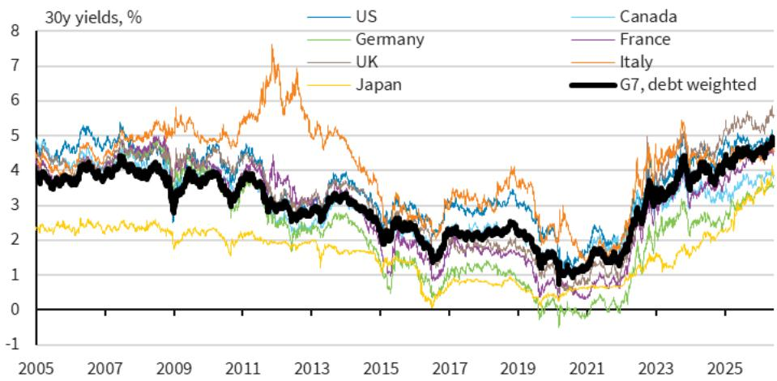  
Source: Bloomberg, BARC

FIGURE 2. Despite attempts to shorten issuance WAM by DMOs, markets would still have to absorb meaningful duration supply next year

<table><tr><td colspan="5">Gross issuance</td></tr><tr><td>USD bn</td><td>2024</td><td>2025</td><td>2026E</td><td>2027E</td></tr><tr><td>USTs</td><td>4,311</td><td>4,390</td><td>4,395</td><td>4,564</td></tr><tr><td>EGBs</td><td>1,466</td><td>1,591</td><td>1,754</td><td>1,741</td></tr><tr><td>JGBs</td><td>1,145</td><td>1,151</td><td>1,067</td><td>1,091</td></tr><tr><td>Gilts</td><td>358</td><td>435</td><td>310</td><td>335</td></tr><tr><td>Total</td><td>7,280</td><td>7,567</td><td>7,526</td><td>7,731</td></tr></table>

Source: BARC

<table><tr><td></td><td colspan="4">Gross issuance, 10y WAM equivalent basis</td></tr><tr><td>USD bn</td><td>2024</td><td>2025</td><td>2026E</td><td>2027E</td></tr><tr><td>USTs</td><td>3,048</td><td>3,091</td><td>3,094</td><td>3,172</td></tr><tr><td>EGBs</td><td>1,525</td><td>1,591</td><td>1,666</td><td>1,654</td></tr><tr><td>JGBs</td><td>973</td><td>932</td><td>747</td><td>763</td></tr><tr><td>Gilts</td><td>437</td><td>422</td><td>263</td><td>275</td></tr><tr><td>Total</td><td>5,982</td><td>6,036</td><td>5,770</td><td>5,865</td></tr></table>

## US: Returning to the old normal

\- Long-end yields have reverted to pre-GFC levels, but their composition has fundamentally shifted: Expected real returns on cash are significantly lower, with term premia – both rate and fiscal – playing a larger role, particularly the latter. The inflation risk premium is very well contained for now, but eroding insurance value is increasing the compensation private investors are demanding to absorb duration.

\- Scope remains for further repricing through neutral rates and fiscal premia: Investment-driven demand is likely to push estimates of r\* higher versus the consensus, which remains too anchored to the post GFC–pre COVID era. There is room for the deficit outlook to worsen, rate volatility to rise and a shortening of the Fed's balance sheet to add to the term premium.

## 30y yields back near 5%: Same level, different story

30y yields have moved back near 5%, briefly revisiting levels last reached in 2007 and drawing renewed market attention. The 5% threshold remains much watched, with evidence of demand from investors seeking to lock in long-duration yields at attractive levels. Here, we place current levels in a historical context and decompose 30y yields into their key drivers to assess the path.

Long-end yields can be decomposed into the expected path of short rates (ie, the expected return from holding T-bills) and the term premium required to bear duration risk. Both components can further be split into real and inflation elements. An alternative lens is to decompose term premia into rate-driven factors, capturing compensation embedded in swap rates relative to expected short rates, and fiscal-specific factors, reflected in the asset swap spread between Treasury yields and swap rates.

Figures 3 to 5 present this decomposition over time and across key snapshots. Several points stand out:

A significantly lower expectations component: While 30y yields are back near 2007 levels, the expectations component (based on surveys) is materially lower. Current estimates point to \~3.1% nominal, versus \~4.4% in 2007, 130-140bp lower. While surveys may be lagging and understating true market expectations, the magnitude of the gap suggests this is not purely a measurement issue.

The rate term premium has normalized higher: The rate-driven term premium (30y swap rate minus the above expected rate) is now well above pre-COVID levels and also somewhat above pre-GFC norms, indicating investors are being compensated for taking duration risk. 30y swap rates currently trade at \~110bp over the survey based expectations component, in between the \~90bp average in the 2000s and the mid-1990s levels of 120bp.

Inflation compensation is well anchored: Long-term inflation expectations and risk premium have been well anchored and are not the reason 30y yields have risen from the lows. Most forecasters continue to have faith in the Fed's inflation-fighting credibility and expect core PCE inflation to be near 2%. In addition, 5y5y CPI swaps have been trading in a tight range near 2.4%, also pointing to very little inflation risk premium, recently reflecting the Fed's singular focus on price stability.

Fiscal premium is clearly visible in asset swap spreads: Perhaps the most striking shift is in asset swap spreads. 30y Treasuries trade at +70bp to swaps, markedly cheaper than the -70bp in 2000 and -20bp in the mid 1990s (both converted into SOFR equivalents). This suggests that investors are already demanding meaningful compensation for the deteriorating fiscal profile.

Bottom line: 30y yields of about 4.9% embed an expected short rate of 3.1%, a rate term premium of 1.1% and a fiscal risk premium of 0.7%. Although 30y yields are back near 2007 levels, the underlying composition is fundamentally different. Expected real returns on cash are significantly lower and term premia are playing a larger role.

FIGURE 3. Although 30y yields are back near 2007 levels, the underlying composition is fundamentally different; expected real returns on cash are significantly lower and term premia are playing a larger role

<table><tr><td></td><td colspan="4">30y Expectations component</td><td colspan="2">Rate Term premium</td><td>Fiscal Risk Premium</td></tr><tr><td>%</td><td>30y UST</td><td>Real Short Rate</td><td>Expected Inflation</td><td>Nominal Short Rate</td><td>30y swap rate</td><td>30y Swap Rate minus Expected Rate</td><td>30y USTs minus Swap Rate</td></tr><tr><td>Dec-95</td><td>5.95</td><td>2.30</td><td>2.70</td><td>5.00</td><td>6.16</td><td>1.16</td><td>-0.21</td></tr><tr><td>Dec-00</td><td>5.46</td><td>3.00</td><td>2.20</td><td>5.20</td><td>6.17</td><td>0.96</td><td>-0.71</td></tr><tr><td>Jun-07</td><td>5.02</td><td>2.52</td><td>2.03</td><td>4.55</td><td>5.49</td><td>0.93</td><td>-0.46</td></tr><tr><td>Dec-19</td><td>2.39</td><td>0.46</td><td>1.79</td><td>2.25</td><td>1.79</td><td>-0.46</td><td>0.60</td></tr><tr><td>Jun-26</td><td>4.93</td><td>1.10</td><td>2.03</td><td>3.13</td><td>4.21</td><td>1.08</td><td>0.71</td></tr></table>

Using surveys to estimate the expected path of nominal and real short rates and inflation. Libor-based swap rates have been adjusted lower in the historical data. Source: Federal Reserve, Haver Analytics, BARC

FIGURE 4. The expectations components in 30y yields  
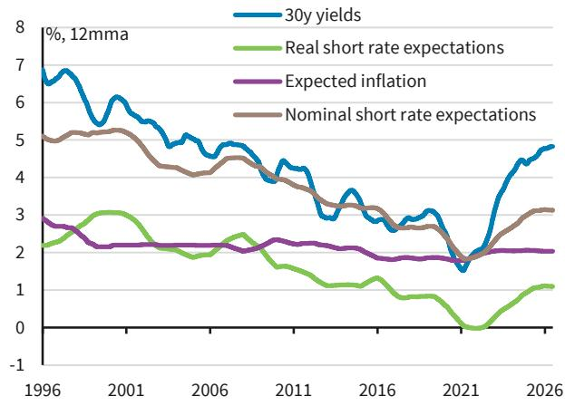  
Source: Federal Reserve, Haver Analytics, BARC

FIGURE 5. 30y term premium, broken into rates and fiscal  
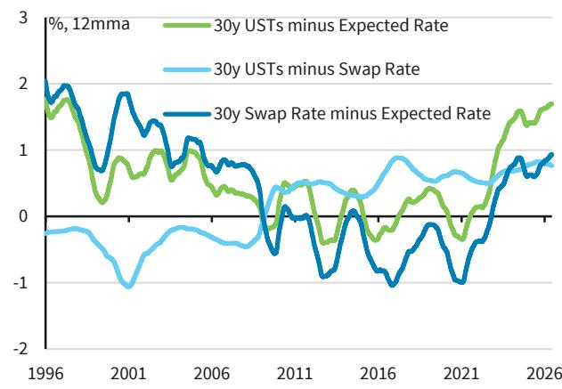  
Source: Federal Reserve, Haver Analytics, BARC

## Where to from here?

We see two potential drivers of higher 30y yields: a reassessment of the nominal neutral rate and somewhat greater fiscal risk premium. Whether the rate term premium moves higher depends on the Fed's communication and its balance sheet policy.

## Room for neutral rate estimates to move higher

Recent economic data point to a robust growth backdrop, resilience in the labor market and a further pickup in core inflation. US economy has likely grown about 2.5% in the first half of the year. Job gains have picked up, averaging 114k/month YTD, versus 30k during the same time last year, and the unemployment rate has moved lower. Core PCE inflation has risen to 3.4% y/y in May from 3% at the beginning of the year (Figure 6). All of this calls into question whether the nominal neutral rate is below the overnight rate, let alone around the consensus forecast of 3.1%.

From a first principal perspective, the saving-investment imbalance is shifting to excess investment, which points to a higher neutral rate for a given estimate of trend growth. Figure 7 shows that hyperscaler investments have risen to about 2.2% of GDP in 2026, with an expectation of \$1trn, or 3% of GDP, by 2028. Meanwhile, the personal savings rate has fallen dramatically, to about 2.5%, due to growing household net worth (Figure 8). These trends also point to a rising neutral rate.

In Figure 9, we tabulate estimates of the nominal neutral rate across major models. The average is about 3.5%, with the higher end nearing 4%. The lower end, which includes the Fed's long-run dot, is likely lagging the economic performance, and we expect model estimates to drift higher.

All of the above suggests that the market should be discounting a nominal neutral rate near 3.5%, with the risk of skewing towards 4%, rather than 3%. All else equal, this should push long-term yields even higher.

FIGURE 6. The unemployment rate has fallen and core inflation has risen in recent months  
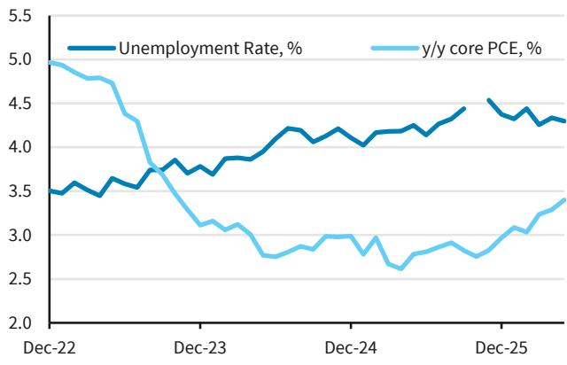  
Source: Haver Analytics, BARC

FIGURE 7. Hyperscaler investments are expected to rise to about 3% GDP  
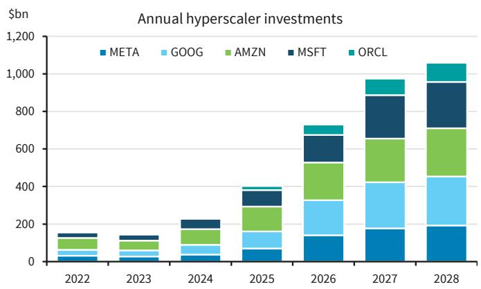  
Source: BARC

FIGURE 8. The household saving rate has moved sharply lower  
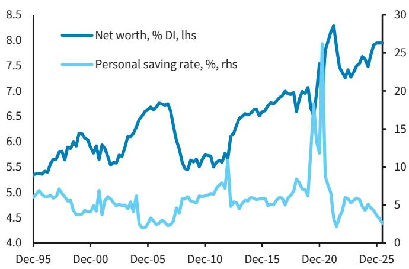  
Source: Haver Analytics, BARC

FIGURE 9. Model-based estimates of the nominal neutral rate are above the consensus  
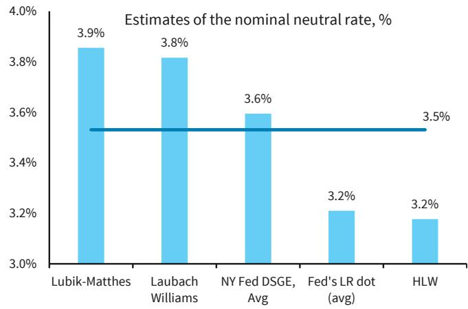  
Source: Haver Analytics, BARC

## Room for fiscal risk premium to move somewhat higher

Figure 10 shows that 30y swap spreads are quite sensitive to the budget deficit outlook. In the mid-1990s, the government was expected to run a large budget surplus; as a result, swap spreads were quite wide. However, as the outlook moved towards persistent deficit, they have turned negative. A 1pp increase in average deficit pushes up 30y Treasury yields relative to swap rates about 15bp, in our view (Figure 11).

We estimate that the markets are discounting an average 10y budget deficit of 6-6.5% GDP. This looks broadly in line with the CBO's latest forecast of 6.1% GDP and a debt/GDP ratio of 120% by 2036. However, the CBO's assumptions now seem somewhat benign, given the slippage in tariff revenues and higher interest costs.

Figure 12 shows that the effective tariff rate has fallen to 7-8%, from a peak of 12% and the CBO's assumptions of 15%. The CBO assumed that the custom duties would total about \$4trn in revenues in 2027-36. At a 10% effective rate, they would be about \$2.7trn, or \$1.3trn lower. Higher interest rates also add to budget deficits. Figure 13 shows that every 10bp adds about \$380bn to 10-year cumulative deficits. For instance, 5-year yields have risen about 50bp year-to-date, which, if sustained, implies about another 1.9trn in 10-year deficits. One potential offset is strong productivity gains. The CBO estimates that a 0.5pp improvement in annual productivity growth would reduce 10y average deficits by 1.6trn. $^{1}$

Overall, it appears that the fiscal outlook is likely worse than what the CBO assumed earlier in the year. Were the budget deficit to average 7% GDP instead, 30y swap spreads would be about -85bp.

We believe the Treasury's issuance strategy is likely helping keep the fiscal risk premium in check for now. It has been skewing issuance to the front end. For instance, of the \$2.1trn in net borrowing needs it faces in 2026, we expect only \$1.2trn in notes/bonds and the rest (about \$900bn, or 43%) in T-bills. This is well above the share of T-bills in outstanding debt of about 22%. We believe that the Treasury is likely later this year to signal that it is looking to increase auction sizes sometime in 2027. As that comes closer, swap spreads should tighten towards fair levels and long-term yields should rise somewhat.

FIGURE 10. As the fiscal outlook has worsened, Treasuries have cheapened versus swaps  
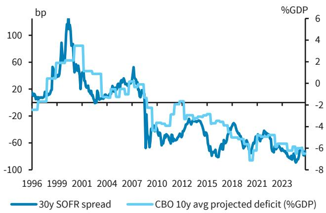  
Source: CBO, BARC

FIGURE 11. A 1pp increase in deficit/GDP ratio tightens 30y swap spreads about 15bp  
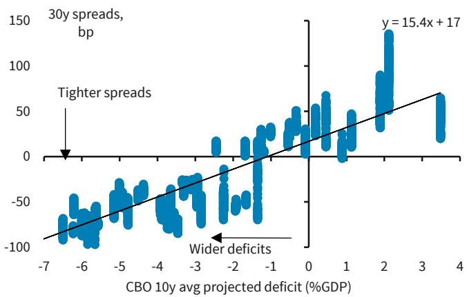  
Source: CBO, BARC

FIGURE 12. The effective tariff rate has slipped well below the CBO's assumption of 15%  
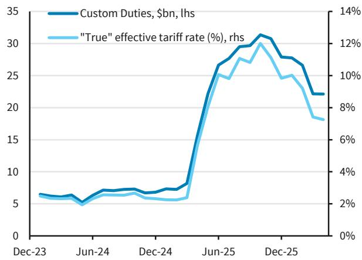  
Source: Bloomberg, BARC

FIGURE 13. Higher interest rates would also add to budget deficits  
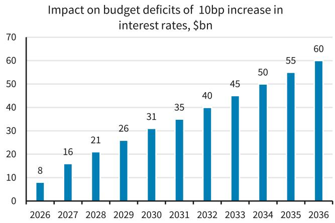  
Source: CBO, BARC

## The rate term premium is well priced, but risks remain

The rate term premium (the swap rate minus the expected rate) has already risen well above pre-COVID levels and likely beyond those pre-GFC as well; the latter conclusion is sensitive to whether survey-based estimates of expected rate are lagging and biased lower. We think a return to pre-GFC norms is largely justified by a few factors:

The buyer base has become more price sensitive, needing a higher term premium. Figure 14 shows the ownership of US Treasuries broken down into foreign official, foreign private, Fed and domestic private. Foreign official holdings have steadily fallen over the past decade, and Fed holdings have also unwound the increase during COVID. As a result, foreign and domestic private investors own a larger share of the universe.

The diversification benefits of USTs have come into question with elevated inflation: Figure 15 shows the return correlation between stocks and the long end. The negative values over post-GFC to the pre-COVID era suggest that bonds were diversifying risk-off scenarios, and this insurance value manifested itself as depressed term premia. The correlation has now reverted to positive territory as inflation has become the primary concern. Were growth to dominate again, the term premium might fall.

Rate volatility is below pre-GFC levels and has room to rise: Warsh's June FOMC press conference signals a shift away from forward guidance toward a more data-reactive policy framework, with markets encouraged to respond directly to incoming data, rather than attempting to infer the Fed's reaction function. Figure 16 shows that implied rate vol on 2y and 10y tails on average traded higher pre-GFC, when the Fed was communicating less. 1y2y rate vol averaged 116bp/y from 1995 to 2005, versus the current 95bp/y. 1y10y rate vol averaged 109bp/y, vs. 78bp/y currently.

## Warsh's disdain for a bloated Fed balance sheet poses upside risk to the term

premium: While the Fed's Treasury holdings as a share of outstanding debt are below pre-GFC levels, the portfolio is much longer. About 40% of Fed's holdings are greater than 10y, versus 10% in 2006; that in T-bills is 10%, vs. 35% in 2006. As a result, the portfolio WAM is about 8.5 years, versus 3 years pre-GFC (Figure 17). We estimate that under passive shortening (via reinvestments but no sales), the Fed's portfolio in 10y equivalents would fall 1pp GDP every year, which could push up the term premium 10bp/yr.

Bottom line: 30y yields around 4.9% do not look particularly high in a historical context, and scope remains for further repricing through neutral rates and fiscal premia: R\* estimates are too anchored to the post GFC–pre COVID era and have room to rise. The deficit outlook is likely worse than is discounted. Rate volatility has room to rise and a shortening of the Fed's balance sheet would further add pressure to the term premium.

FIGURE 14. The buyer base has become more price sensitive needing a higher term premium  
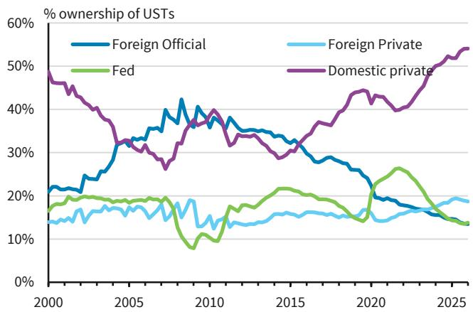  
Source: Federal Reserve, BARC

FIGURE 15. Diversification benefits of USTs in a portfolio have come into question with elevated inflation  
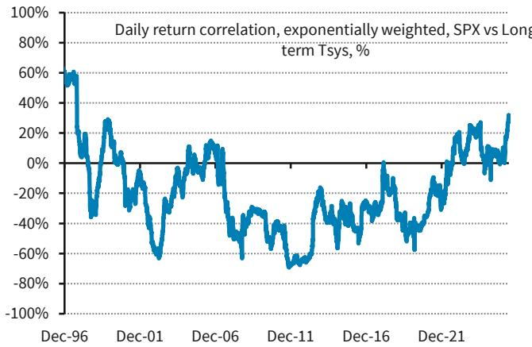  
Source: BARC

FIGURE 16. Rate vol was higher on average pre-GFC, when the Fed was communicating less  
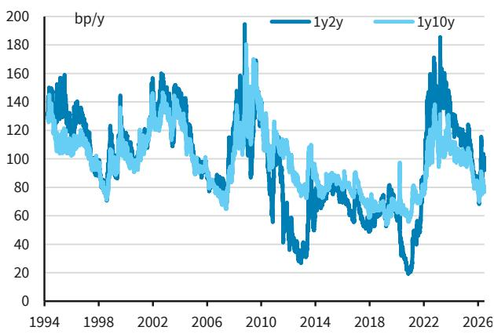  
Source: BARC

FIGURE 17. Warsh's disdain for a bloated Fed balance sheet poses upside risk to the term premium  
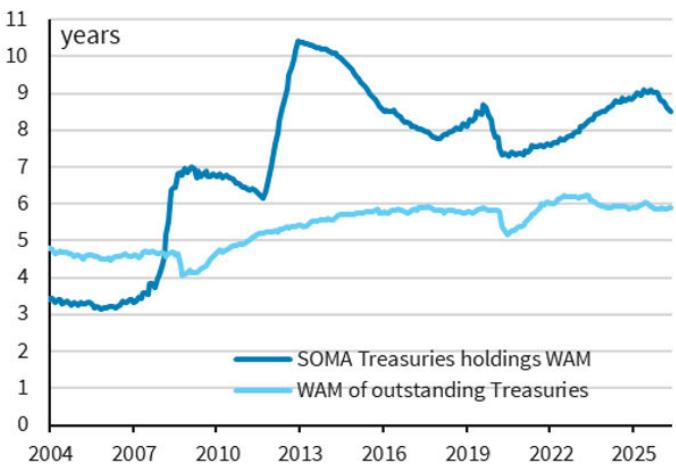  
Source: Federal Reserve, US Treasury, BARC

## UK: Cassandra Complex

## UK long yields: Telling tales versus tittle tattle

Long-dated gilt yields have resumed the role that they have taken on episodically since 2022: that of the fixed income universe's lightning conductor for wider fiscal discontent. Recency bias leaves market participants sensitive to the risk that a disorderly rise in yields may result in a 2022-style outcome and gives further credence to the view that the gilt market remains uniquely vulnerable to adverse fiscal outcomes. We have previously highlighted that the UK's fiscal challenges, while formidable, are hardly unique. From an issuance perspective, the DMO has been ahead of other sovereign issuers in terms of re-orientating supply and recognising both the localised waning of demand and the secular move higher in the term premium that has been prevalent in global fixed income.

FIGURE 18. Evolution of 30y yields since October 2024  
  
Source: Bloomberg, BARC

Figure 18 shows the daily evolution of 30y gilt yields since Q324 and it is notable that many of the more sizeable moves have come about due to wider international developments. If we take changes in 10y UST rates as a benchmark for moves in global fixed income, Gilt 30y rates have been weakly positively associated with daily moves in UST10y rates over a long regression period (Figure 19). But a more revealing measure is the rolling 3m regression beta for UST 10y vs. global 30y rates (Figure 20). Since mid-2023, Gilt 30y rates have traded with a higher positive beta than other comparable markets (ie, they will tend to move more sharply than other markets in sell-offs) and since the onset of the Middle East conflict, there has been a jump in the beta, showing that long end has again been under pressure.

FIGURE 19. Gilt 30y vs. UST 10y  
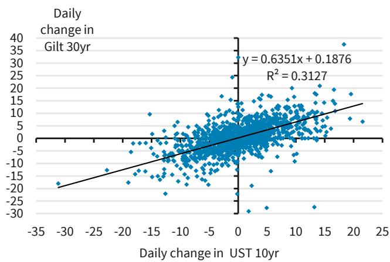  
2021-2026 daily data.
Source: BARC

FIGURE 20. Rolling 3m regression beta UST 10y vs 30y  
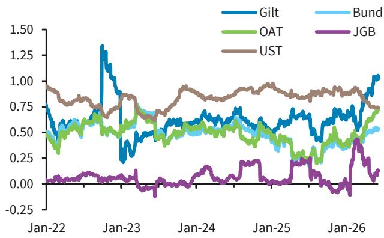  
Source: BARC

The IMF'S latest Fiscal Monitor notes that "changing intermediation, diminished convenience yield, and increased rollover exposure amplify the global spillover of US Treasury stress. IMF staff analysis shows that a 1 basis point increase in US yields after an expansionary Treasury debt supply shock – that is, when new issuance of Treasuries exceeds what investors anticipated – raises foreign 10-year yields by 0.8–0.9 basis point." But the IMF also notes that this effect differs across countries, depending on the degree of non-resident ownership (where the UK is at the lower end of the spectrum). So if anything, this supports the point that the long end has overreacted, based on this relationship, given that its rolling 3m beta lies above 1.

What should investors make of this? Can (or should) the most recent moves be dismissed as just another bout of turbulence and the long end of then gilt curve is playing its usual role as the most visible pain point of global fixed income? It is easy to dismiss the weakness in UK yields as idiosyncratic to a market that has been perceived as vulnerable in bearish fixed income environments. But if we consider the evolution of term rates in the UK since 2022 and the underlying drivers, a number of factors that might suggest that there is a greater degree of commonality with other markets than might be initially supposed. Consequently, the path that gilts have faced does not look dissimilar to what other markets might face in the near future, given the confluence of events, in particular, the bond market trilemma of negative supply-side economic shocks, higher inflation and changing patterns of underlying demand.

## Significant fiscal tightening remains in place

From a macro fiscal perspective, it is important to reiterate how much consolidation is the pipeline in the UK compared with other markets. The most easily comparable data show that the UK is entering a prolonged period of fiscal consolidation over 2026-31 (Figure 21). This is significantly front loaded (1.5pp in 2026 and a further 0.8pp in 2027) but overall averages 0.6pp per year in 2026-31, compared with a flat average for all advanced economies. The cumulative reduction is 3.8pp of GDP, with only France coming close to matching the UK with a 2.2pp consolidation over the same period. It is not coincidental that these are the two bond markets that often come under most scrutiny and the fiscal authorities are taking corrective action. As a result, the UK's general government debt as a percentage of GDP is relatively stable, compared with increases in most other countries, and declining from 2027 onwards (Figure 22). As with all such fiscal measures, the starting point matters but it is illustrative of the broader point that the fiscal outlook across markets looks very different, with significant variation in consolidation plans.

FIGURE 21. Cumulative change in the general government fiscal balance, 2026-31 (2025 =0, pp GDP)  
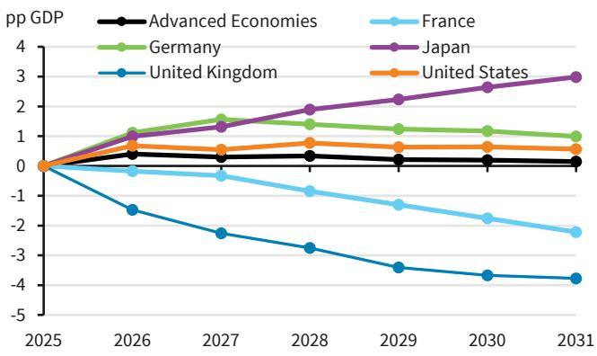  
Positive (negative) number = deficit increasing (decreasing)  
Source: IMF Fiscal Monitor

FIGURE 22. Cumulative change in general government gross debt, 2026-31 (2025= 0, pp GDP)  
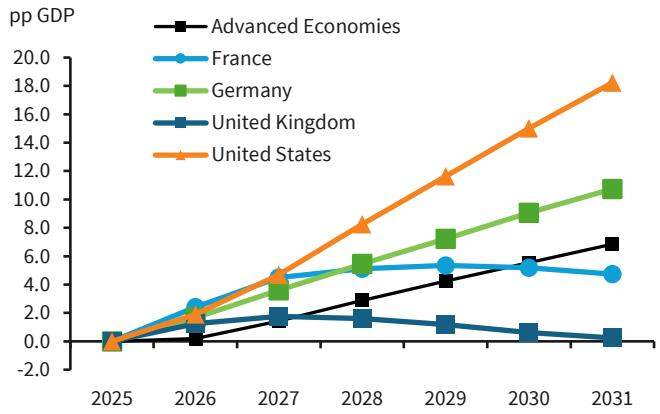  
Positive (negative) number = debt as % GDP increase (reduction) vs previous year. Japan excluded for comparability reasons.
Source: IMF Fiscal Monitor

In March 2026 EFO, the OBR reported that the Chancellor had met her own fiscal rules with a headroom measure of about £27bn against PSNFL and a £23.6bn margin vs. the current budget rule. We estimate that the combination of increased debt costs due to higher yields and inflation and a lower growth profile has reduced the current budget headroom by £10bn, to

about £16bn. This is something of a moving target, given the rally in yields and an easing of the inflation outlook after the announcement of a ceasefire.

The current budget measure is salient now, since it will include the debt interest bill, which, after welfare, is the second-largest individual AME spending item; at about £100bn, this is approximately 9% of total public spending, or in layman's terms, £1 of every £10 raised in tax goes toward servicing debt. While this may seem high, the equivalent number for the US is about 18%. It is the proximity to the buffers set up under the fiscal framework that make the question of issuance not only one of supply but also one of cost. Figure 23 breaks the debt interest bill into its constituent parts:

\- Coupons on gilts: existing stock and projected new issuance;

• Payments to holders of NS&I products; and

\- Interest paid on reserves held by banks at the BOE.

We net out interest paid to gilts in the APF, as this is a intra-public sector payment, since the APF receives coupons on the gilts it holds, while the Bank pays Bank Rate on the reserves it created to finance the asset purchases made by the APF. The coupon payments cancel out within the public sector flows, so the net effect on debt interest becomes the coupon income paid to the APF less the cost of interest on the reserves created to buy them ("carry").

The bulk of the increase in the overall debt interest bill comes from interest on new conventional supply, reflecting the DMO's sizable medium-term gross financing requirements. By the end of the forecast period, this makes up about £60bn of the overall £137bn bill. The overall bill is very sensitive to changes in inflation and rates (Figure 24), where a 100bp rise in gilt yields would increase the debt interest bill c.£10bn by the end of the forecast; a similar effect is seen for a 100bp rise in inflation. So from a fiscal perspective, it makes sense for the DMO to minimise its exposure to high long-dated yields and accept that what it is giving up in debt interest certainty, it is adding to its refinancing risk. The starting point is clearly advantageous for the DMO, given the historic issuance patterns have left the UK with a long-maturity market, so it has the space to pursue a long-term strategy of debt maturity shortening before it becomes overly concerned with refinancing risk.

FIGURE 23. Debt interest bill (ex-BOE APF)  
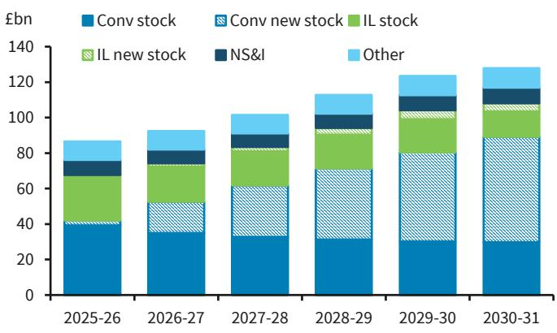  
Source: Office for Budget Responsibility

FIGURE 24. Debt interest bill sensitivity  
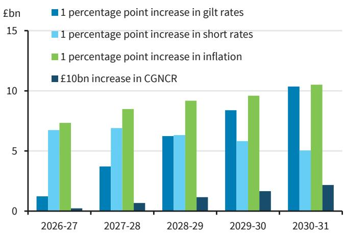  
Source: Office for Budget Responsibility

## Declining demand but a reasonable curve

In its reorientation of supply away from the long end, the DMO acted ahead other sovereign issuers, as it acknowledged and adapted to the waning of long-end demand and the rise in policy rates that underpinned rising rates. Figure 25 shows that at the end of 2025, traditional long-end domestic owners' holdings had dropped to 20% of the overall market, its lowest level on record. However, the reduction in structural demand by natural buyers of long duration leaves the DMO issuing for a different investor base. It also coincided with rising rates and a diversification of the overall investor base as banks and discretionary macro investors (domestic and international) increased their presence in the market. When considering his transformation, a recent BIS paper on pension asset allocation concludes that:

"As pension funds step back, other non-bank financial institutions, which have been rapidly expanding in size, step in as investors. Take government debt as an example, this trend moves the composition of investors away from more stable buy and hold investors.....non-bank investors have the highest price elasticities for sovereign debt, a result primarily driven by investment funds rather than insurance companies and pensions. Having an investor base with high price elasticities benefits the sovereign in terms of their borrowing costs, as it requires a smaller increase in yield to recruit these investors to purchase more debt. However, if these investors are also more flighty in the face of local or global risk, then their presence creates financial stability concerns for the sovereign. In effect, these funding sources could dry up when they need them the most."

The flip side is that diversification of the issuer base enforces a degree of market discipline on the fiscal authorities. In gilt space, the continued volatility due to political uncertainty should be expected to steepen the curve. But the curve shape looks broadly in line with short rates, which suggests that the curve move has not been disorderly and there has yet to be a significant move higher in term premium (Figure 26).

FIGURE 25. Traditional long end ownership has dropped  
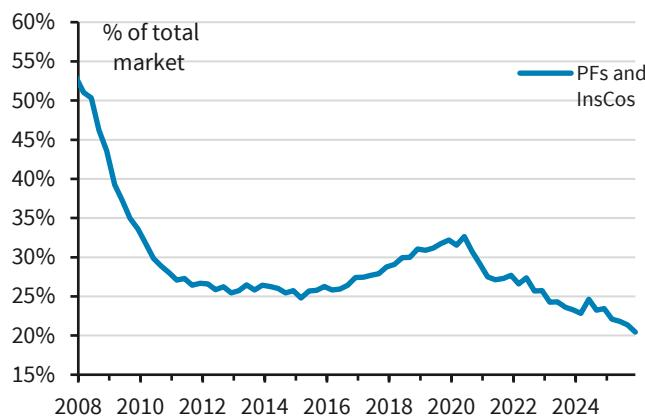  
Source: National Statistics

FIGURE 26. Gilt 10/30s vs. Gilt 2y  
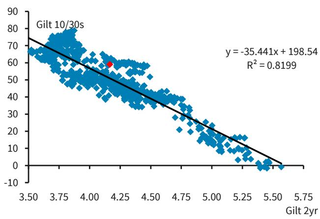

## Source: BARC

There are two clear paths via which long yields can rise: a rise in term premium, which is the most common driver for long-dated rates, or a rise is neutral rate expectations, which would lift the expectations component of yields. The latter would likely be a curve-flattener, whereas a term premium rise is traditionally a steepener. This is because any increase in the term premium, be it domestically driven or from a global move, would have a bigger effect on longer-dated yields than shorter-dated ones. The BOE's latest MaPS survey shows neutral rate expectations consolidating at 3.00-3.25%, so slightly lower than the current policy rate of 3.75% (Figure 27). This means that if there is an increase in neutral rate expectations, it will further

compress the spread between the policy rates and intermediate/long forward rates (Figure 28). The curve has been steeper in the past, but from a valuation perspective, it implies that gilt yields should find better support at current levels. The transition to a Burnham premiership and potential change of leadership at the Treasury introduce more medium-term uncertainty to the gilt market in terms of the likely landing zone for fiscal policy and the overall fiscal architecture. The market will remain under scrutiny, as fiscal risk due to political factors might well increase in the run-up to the next Budget in Q4 26.

FIGURE 27. BOE MaPS estimate of neutral rate  
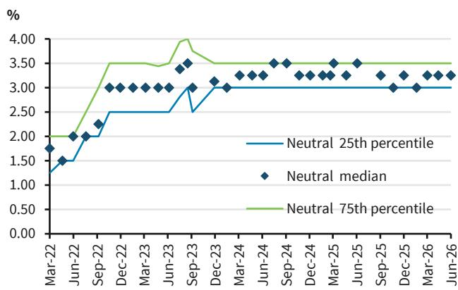  
Source: Bank of England

FIGURE 28. Selected gilt forwards  
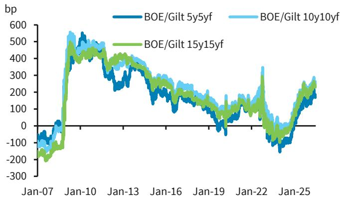  
Source: Bank of England

## Europe: Cheap levels meet lower WAMs

\- Long-end EGB cheapening is taking a breather after an annus horribilis. 2025 had sharp underperformance of long-end EGBs, on Germany's fiscal pivot, fears about the Dutch pension fund transition and continued heavy supply. With DMOs responding to the steepness of cash curves by reducing the WAM of issuance, alongside demand holding up better than expected as growth concerns grow, long-end EGBs have had a more balanced year so far.

\- We see the potential for long-end EGB yields to keep drifting higher, but driven largely by global factors. The overall EGB supply burden and fiscal sustainability worries amid flare-up of political uncertainty are key domestic factors, alongside potential bearish shocks from global yields that could push long-end EGB yields cheaper. A revival in growth expectations would also weigh on the sector. In this setting, a reduction in supply WAM would not prove to be an effective counter-balancing factor. A material slowdown in growth or financial stability concerns that increase the likelihood of a restart of asset purchases are necessary conditions for an outright rally in long-end EGBs.

## A perfect storm in 2025

When we analysed the outlook for long-end EGBs in June 2025, they had endured a bruising first half of the year, against a backdrop of heavy issuance, a dramatic German fiscal pivot, and overall euro area growth resilience. These factors continued to weigh on long-end EGBs for the remainder of the year. However, in H1 26, the pressure has subsided somewhat. The new energy shock – and consequent pricing of ECB hikes – moved the cheapening pressure to the front end and drove a violent bear-flattening of long-end curves in Europe in March, which has only partially been reversed more recently. In effect, curve-steepeners have undergone an abrupt regime shift, whereby front-end pricing and rate volatility have once again become key drivers, with structural themes taking a back seat.

FIGURE 29. In outright terms, long-end EGB yields have been roughly stable year-to-date  
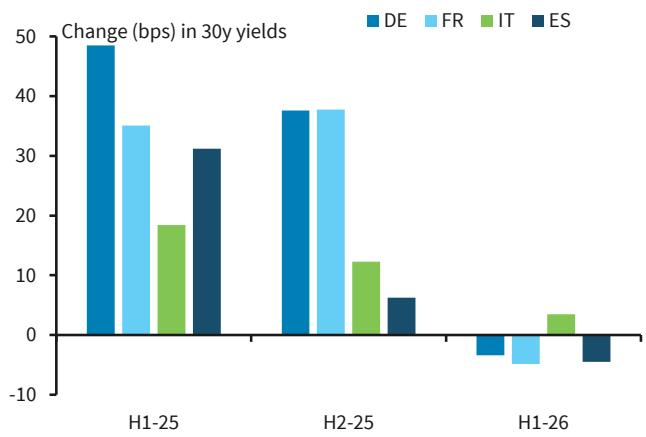  
Source: Bloomberg, BARC

FIGURE 30. EUR term premia pushed higher on Germany's fiscal revolution in March 2025, but has been stable more recently  
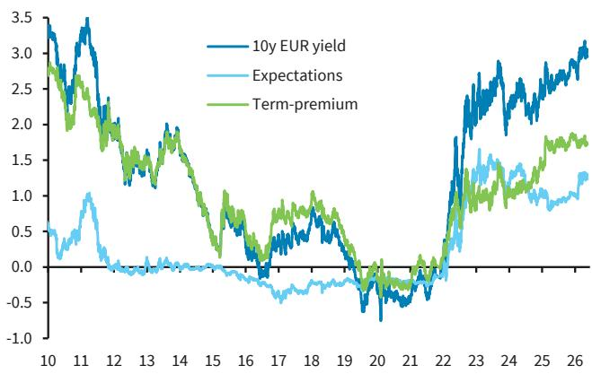  
Source: Bloomberg, BARC

Perhaps more surprisingly, in outright terms, long-end EGB yields have been roughly stable year-to-date, across core and periphery countries (Figure 29). The energy shock has pushed the rate expectations component of yields sharply higher: the residual term premium component, on the other hand, is little changed (as shown in Figure 30, which shows our model decomposition of 10y yields into the two components). In essence, this year's macro developments have led markets to believe that Europe faces a near-term inflation challenge necessitating higher rates, but there has not been a notable increase in risk premium for fiscal challenges and heavy issuance. In our view, several factors have eased the intensity of long-end cheapening pressures relative to last year, including reductions to the average maturity of issuance by euro area DMOs and long-end demand conditions proving less challenging than anticipated.

## Supply: Relentless deluge meets WAM reductions

2026 has had a record deluge of EGB issuance: total supply should reach c.€1.5trn, up c.€100bn y/y. At the issuer level, heavier gross supply is underpinned by Germany, in the context of the aforementioned fiscal pivot: gross Bund supply should total c.€350bn in 2026, up €60bn y/y. In addition, full-pace ECB QT continues to add to the net supply burden: private investors will need to absorb almost €900bn of overall net supply this year, close to last year's unprecedented volume.

While total issuance volumes are sharply higher y/y, DMOs have also responded to last year's curve steepening by trimming the weighted average maturity (WAM) of issuance. For H1, we estimate the WAM of EGB supply at c.10y, down c.0.3y on the same period last year. This represents the lowest YTD WAM of any year since 2015, when the ECB began its QE purchases and thereby spurred a dramatic lengthening of average maturities by euro area DMOs. WAM reductions have been underpinned in part by reductions to the share of issuance at the 30y point, which is at its lowest level since 2014 for the EGB market as a whole (Figure 31).

FIGURE 31. Issuers have been scaling back the weighted average maturity of issuance, with the share of issuance in the 30y bucket declining  
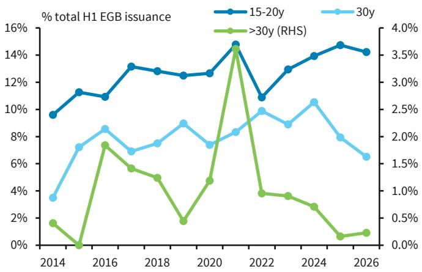  
Source: National Treasuries, BARC

FIGURE 32. Reductions to the WAM of issuance have lessened the DV01 burden of long-end supply  
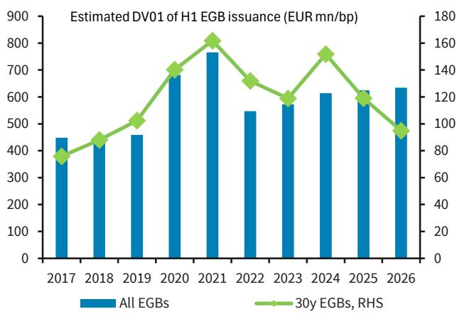  
Source: National Treasuries, BARC

Ultimately, DMOs have seen less value in issuing at the long end of the curve, following the notable push higher in long-end yields in 2025. The trimming of WAMs has lessened the total DV01 burden of issuance on the market, even as notional gross supply volumes have pushed sharply higher (Figure 32). However, the pivot away from the long end by euro area DMOs has not been sufficient to spur an outright rally in long-end yields so far this year.

## Demand: Some bright spots

On the demand side, investors have become increasingly nervous about the effect of the Dutch pension fund transition on the long end of core EGB curves. Under the old defined benefit system, Dutch pension funds were key receivers of long-end swaps and buyers of long-end EGBs, to hedge their liabilities. Under the new collective defined contribution system, firms have less need to hedge at the long end of the curve, with more freedom to invest in higher-risk, higher-return assets for the youngest cohorts. As such, the fear has been that Dutch pension funds would sell down their long-end bond holdings and reinvest the proceeds in risky assets. These concerns were a key factor underpinning the underperformance at the long end of the Dutch curve in late 2025.

Thus far, however, concerns about such sales appear overblown. Data from the Dutch central bank shows that domestic pension and investment funds actually increased their holdings of long-end Dutch bonds in Q1 by c.€8bn.

Besides pension funds, euro area insurers have also traditionally been key investors at the long end of EGB curves, in OATs especially. Nonetheless, insurers had been net sellers at the long end for an extended period. In part, this reflected an extended period of outflows from traditional French life insurance products (given higher returns being offered by alternative savings products).

FIGURE 33. Dutch pension and investment funds increased their holdings of long-end DSLs in Q1  
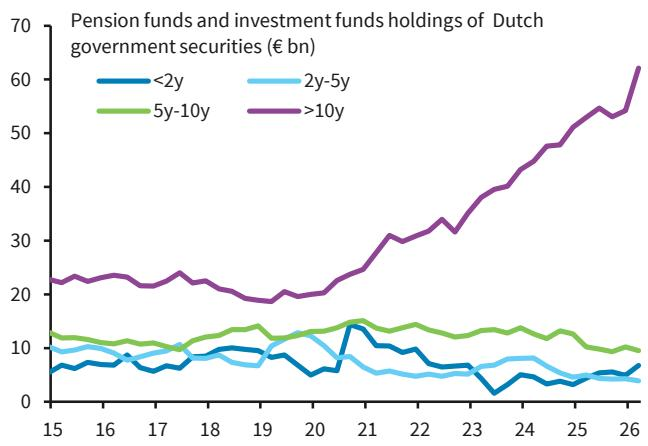  
Source: DNB, BARC

FIGURE 34. French insurers have been increasing their domestic bondholdings since mid-2024, following an extended era of net sales  
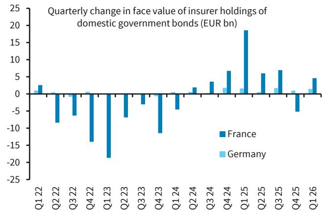  
Source: ECB, Haver Analytics, BARC

More recently, however, insurer appetite has strengthened, in OATs specifically. Indeed, as Figure 34 shows, net purchases of OATs by French insurers have been positive since mid-2024, contrasting with the preceding era of net sales. This in part reflects renewed inflows to traditional French life insurance products, with relative returns becoming more attractive as a result of elevated OAT yields (which feed through to returns) and inflation falling significantly from 2022's peaks (lessening the relative attractiveness of the livret A product). Elevated long-end yield levels and significant declines in volatility from 2022's peaks have also helped to make long-end OATs a more enticing prospect for insurers. Healthy insurer demand has provided support for the long end of the OAT curve in recent quarters, as reflected by relative flatness of the 10s30s France-Germany box versus previous years.

## Fiscal risks: OATs, BTPs could face scrutiny into 2027 elections

Fiscal sustainability worries have faded into the background in the euro area in recent quarters, in a context of limited domestic political noise and tight sovereign spread levels. An ECB rate hiking cycle would imply upwards pressure on interest expenditures for euro area governments, creating fresh fiscal headaches. For the time being, however, EGB spreads have remained sanguine about this prospect: BTP-Bund is only marginally wider YTD, and OAT-Bund is roughly unchanged, despite the sharp repricing higher of the ECB's policy rate path.

The natural question for investors is: what could make OATs or BTPs feel more sizable bearish impulses because of fiscal sustainability worries? From a macro standpoint, a relatively challenging scenario would likely entail the ECB's delivering a more aggressive rate hiking cycle than currently expected, reflecting a fresh worsening of the energy market backdrop and/or notable stickiness of inflationary pressures. This could deliver a double whammy to fiscal sustainability for the likes of France and Italy, if yields push sharply higher (increasing debt servicing costs) and growth slows more than currently expected (putting additional upward pressure on debt/GDP ratios). With both countries going to elections next year, a flare-up in political uncertainty could create a very challenging mix for these markets, but this is a risk that would come to the fore only in late 2026/early 2027. For now, while the fiscal math remains challenging, a clear catalyst to generate a market event is missing.

## Bottom line: Long-end EGBs not out of the woods yet

The overall supply burden remains heavy (especially with QT taken into account), demand remains in a state of flux given ongoing Dutch transitions, and fiscal sustainability worries could re-emerge as next year's French and Italian elections draw closer. Collectively, we think these

factors could still leave room for some further drift higher in long-end yields, provided political catalysts realise. At the same time, we think the pace of cheapening will remain far slower than in 2025, with WAM reductions easing the burden of long-end issuance to some extent and demand holding up better year-to-date than feared. Sharper legs of cheapening could become more likely if long-end UST yields were to push significantly higher on a reassessment of the neutral rate, thereby spilling over to long-end EGBs.

At the individual country level, OATs and to some extent BTPs could also be vulnerable to underperformance as next year's elections draw closer. For the bearish structural trend in long-end EGB yields to be decisively broken, we think a macro regime shift would likely be required. This could, for instance, involve the ECB's focus pivoting towards growth risks at some point down the line (eg, as a result of a fresh negative demand shock). In that scenario, sizable rate cuts and contemplation of asset purchases could provide fresh bullish impulses for long-end EGB yields (as previously seen in 2014, in anticipation of the start of ECB QE the following year, and in 2019, in anticipation of QE restarting). In the absence of such a regime shift, large outright rallies in long-end EGBs remain a challenging prospect.

## Japan: Higher by term premium

\- Rising yen rates reflect greater fiscal risk premia and behind-the-curve concerns. We expect continued upward pressure on JGB yields, with supply-demand conditions suggesting that this is likely to be more pronounced in the 10y sector than in the super-long sector, with further upside risks from the Takaichi administration's "high-pressure economy" policy.

\- While government bond yields are expected to remain higher in terms of absolute levels and in FX-hedged terms, we see limited room for Japanese investors to shed their foreign bond holdings significantly.

## Rising fiscal and behind-the-curve concerns, exacerbated by supply-demand

Inflation risk premia have been the primary driver of the rise (and at times overshoots) in JGB term premia since last autumn. Indeed, the main drivers of rising JGB yields have shifted from risk-neutral yields (BoJ rate hike expectations) in 2024 to JGB term premia in 2025, and that trend became even more prevalent in 2026 (Figure 35). Two factors that have contributed to this dynamic are fiscal concerns due to expansionary fiscal policy under Takaichi administration and heightened concerns that the BoJ may be falling behind the curve, exacerbated by the inflationary impulse from yen depreciation and elevated oil and import prices.

First, persistent fiscal concerns drove a wider inflation risk premium. The rise in JGB yields earlier this year, led by term premia due to calls for consumption tax cut during the lower-house election, has taken a breather following the US authorities' USDJPY rate check, remarks by Treasury Secretary Bessent expressing concern about JGB spillover into USTs and the ruling LDP's landslide victory, reducing the perceived need for fiscal concessions. However, upward pressure resumed soon thereafter with the appointment of two reflationist BoJ board members and reports about funding for the supplementary budget in late May, eroding the markets' sense of reassurance.

Second, geopolitical tensions in the Middle East have intensified concerns that the BoJ is falling behind the curve, thereby pushing inflation risk premia higher. Behind-the-curve concerns due to higher import prices and greater inflation pass-through have also fueled a rise in JGB yields. These pressures were exacerbated by the Middle East geopolitical tensions, which led to a rise in energy prices and the closure of the Strait of Hormuz. The sharp acceleration in

April PPI can be interpreted as an early manifestation of these concerns, on which the BoJ expressed greater concern about inflation risk than growth to deliver a 25bp hike in its June meeting.

JGB supply-demand conditions have likely aggravated the upward pressure on yields. According to our analysis, when JGB yields break above their recent range, volatility-averse domestic investors tend to be net sellers (Figure 36). That is, as with pension LDI during the 2022 UK gilt crisis, the negative gamma-like investment behavior of domestic investors appears to be amplifying the rise in yen rates (see 2022 gilt-style crisis for Japan? 7 August 2025).

FIGURE 35. Driver of JGB markets shifting from risk-neutral yields to term premia  
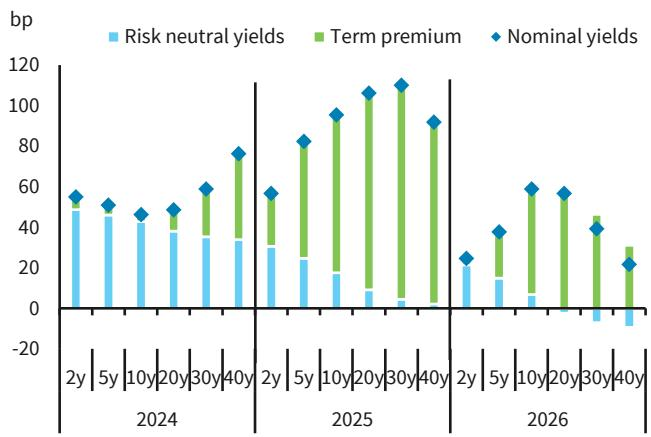  
Source: BARC

FIGURE 36. Beta of net purchases to range overshoot in super-long JGB yields  
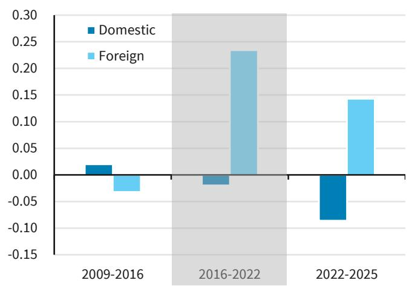  
Note: Beta of domestic and foreign investors' net purchases of super-long bonds with respect to the amount by which the 30y JGB yield exceeds its highest level over the past three months.
Source: JSDA, Bloomberg, BARC  
Source: JSDA, Bloomberg, BARC

## Outlook and risk for the long end

We expect continued upward pressures on JGB yields. While the rise in term premia has recently stabilized somewhat, the upcoming budget documents, such as PM Takaichi's Basic Policies on Economic and Fiscal Management (a blueprint for the budget to be released in July) and initial budget requests in August, as well as persistent behind-the-curve concerns, should continue to exert upward pressures on the term premium. The LDP lawmakers' group advocating "responsible proactive fiscal policy" on June 8 proposed a shift to multi-year PB targets, explicitly called for a zero food consumption tax and positions crisis management and growth investment as central pillars of the FY27 budget. Additionally, for budget formulation from FY27 onward, the Takaichi administration has set out a policy of moving away from reliance on supplementary budgets and "including necessary spending as much as possible in the initial budget," indicating that the latter, which has been in JPY110-120trn in recent years, would expand to scale including supplementary budgets, which has been JPY120-130trn (see Fiscal risk back in focus). These developments could reignite longer-term fiscal concerns.

Evolving supply-demand conditions suggest that upward pressure is likely to be more pronounced in the 10y sector than the super-long. The 10y sector is not only the most vulnerable part of the curve to the inflation risk premium, but is also exposed to the deterioration in supply-demand conditions, with a large increase in DV01 net supply, including JGB issuance and BoJ's QT (Figure 37).

On the other hand, due to the MoF's recent issuance cuts in super-long bonds in exchange for increased issuance in bills and the short end, supply-demand conditions have improved

significantly, especially for the 30y and 40y sectors, with 30s40s even inverting. The 10y sector appears to be the most vulnerable from a supply-demand standpoint. Meanwhile, fair value in the super-long sector, based on supply-demand conditions implied by the BoJ's purchase plans and the current issuance plan, remains broadly unchanged, suggesting that yields in the super-long sector are relatively stable from a structural perspective (Figure 38).

FIGURE 37. JGB supply-demand in FY26

<table><tr><td colspan="9">Supply-demand in FY26 (JPY trn)</td></tr><tr><td></td><td>JGBs in mkt Mar 26</td><td>JGB issuance in FY26</td><td>BoJ buying annual</td><td>Shift to shorter tenor</td><td>Shift from longer tenor</td><td>JGBs in mkt Mar 27</td><td>Chg in JGBs</td><td>DV01 (JPYbn )</td></tr><tr><td>1-3y</td><td>79</td><td>35</td><td>8</td><td>-49</td><td>29</td><td>86</td><td>7</td><td>1</td></tr><tr><td>3-5y</td><td>68</td><td>32</td><td>7</td><td>-29</td><td>17</td><td>81</td><td>12</td><td>5</td></tr><tr><td>5-10y</td><td>128</td><td>35</td><td>8</td><td>-17</td><td>11</td><td>149</td><td>21</td><td>13</td></tr><tr><td>10-25y</td><td>204</td><td>13</td><td>3</td><td>-11</td><td>12</td><td>215</td><td>12</td><td>13</td></tr><tr><td>25-40y</td><td>90</td><td>10</td><td>2</td><td>-12</td><td>0</td><td>86</td><td>-4</td><td>-6</td></tr><tr><td>Total</td><td>570</td><td>126</td><td>28</td><td>-119</td><td>69</td><td>617</td><td>48</td><td>26</td></tr></table>

Source: MoF, BoJ, BARC

FIGURE 38. Relationship between the 10y/30y JGB term premium curve and the super-long JGB interest rate risk position  
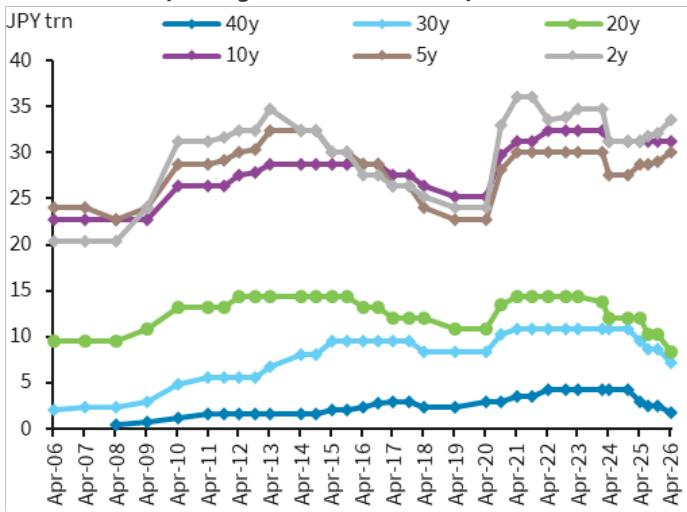  
Note: A cointegrating vector is estimated to avoid spurious regression. Source: MoF, BoJ, JSDA, BARC

The risk is for greater upside in JGB yields from fiscal policy. Takaichi's "responsible proactive fiscal policy" continues to pose upside risks to JGB yields, due to its framework, in our view. Specifically, she is seeking to lower the government debt/GDP ratio sustainably to ensure fiscal prudence. However, this is expected to decline over the coming decade purely due to inflation (see the high-2% nominal growth scenario in Figure 39), which raises tax revenue immediately, while an increase in interest rate expense will only materialize sequentially with refinancing over the next nine years (ie, the average duration of outstanding JGB). Hence, this optically convenient target suggests a risk of loosening fiscal prudence.

In this light, fiscal deterioration, even if the debt/GDP ratio remains on a downward path, could still invite fiscal concerns, hence a rise in the term premium, in our view. Figure 40 shows the estimated increase in the term premia across maturities under various scenarios of a permanent PB deterioration over the next decade. For example, if the PB deteriorates permanently by JPY5trn, JGB term premium could rise 6bp for 10y and 13bp for 30y. While the results show a larger increase in the super-long term premium than for the 10y sector, which is intuitive, we believe that the pressure could be more concentrated on the belly, as any increase in JGB issuance is likely to focus on maturities of 10y and shorter, rather than the super-long sector, in line with its recent strategy.

FIGURE 39. Japan's debt/GDP ratio outlook  
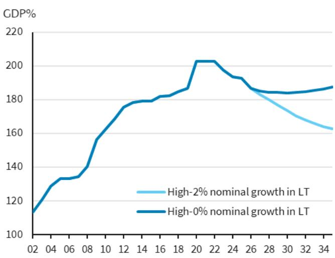  
Source: Cabinet Office, BARC

FIGURE 40. Estimated increase in the term premia based on PB deterioration scenarios

<table><tr><td>PB deterioration scenario (JPY trn)</td><td>TP 10y</td><td>TP 20y</td><td>TP 30y</td></tr><tr><td>5</td><td>6</td><td>12</td><td>13</td></tr><tr><td>10</td><td>12</td><td>24</td><td>25</td></tr><tr><td>15</td><td>19</td><td>36</td><td>38</td></tr><tr><td>20</td><td>25</td><td>48</td><td>51</td></tr></table>

Note: The unit for the increase in the term premium is bp. See Yen rates shaken by fiscal concerns (22 January) for the detailed estimation procedure.
Source: BARC

In the case of a re-accelerated rates selloff, a recovery of market confidence is needed as a fundamental solution, but supply-demand measures are the near-term focus. Gaining market confidence in fiscal discipline would be the fundamental solution to stabilize risk premia across JGB, breakeven inflation and the currency, as in January-February this year, only to be toppled by a reflationist BoJ board nomination and fiscal policy concerns. However, with the Takaichi administration's bias towards easier fiscal/monetary policy, external pressure from either the US or the market may be needed.

Realistically, focus would be on supply-demand measures, such as further shortening of JGB issuance maturities and increased issuance of retail JGBs, where the MoF is indeed considering offering new products such as inflation-linked bonds and super-long bonds for households (Reuters, 20 May). The BoJ could also revise its JGB purchase plan (eg, extending maturities) or conduct emergency operations in response to a sharp rise in rates, but this carries the risk of triggering rapid JPY weakness. MoF buybacks may also be difficult, given the lack of progress since last summer and concerns that buying back off-the-run bonds during a rising-rate environment would increase interest costs. These stopgap measures may be able to buy time, but this situation differs substantially from the supply/demand-driven selloff in the first half of last year, when rates rose alongside a marked cheapening in ASW. Given the latent risk of further JPY weakness from additional BoJ purchases (and the associated cost of additional FX intervention), they are unlikely to provide a fundamental solution unless the government earns fundamental market confidence, in our view.

## Japan demand for foreign bonds

Despite higher yields, we see little sign of repatriation away from foreign bonds into JGBs. While JGB yields are expected to remain higher in absolute levels and FX-hedged terms (Figure 41), we see limited room for Japanese investors to shed their foreign bond holdings significantly.

The most carry-sensitive life insurers have already sold a significant amount of foreign bonds in 2022-23, during the global duration selloff and rise in FX hedge costs, putting their holdings back to the levels prior to the BoJ's negative rates policy adoption in 2016 and leaving little room to sell further (Figure 42). Bank holdings also have been range-bound, but their foreign bond investment tends to be driven by the outlook for USTs (ie, capital-gains driven), rather than relative carry, which suggests some scope for sales due to the possibility of Fed hikes and expected higher yields. Trust accounts (ie, pension funds) have continued their rapid accumulation of foreign bond holdings to this day, but that is due to re-balancing driven by the global equity rally. While potential portfolio allocation shifts back to JGBs have been speculated, GPIF has noted that underlying higher domestic yields were already in its assumption when it kept its asset allocation unchanged in 2025.

FIGURE 41. Yield comparison of JGBs and FX-hedged foreign bonds  
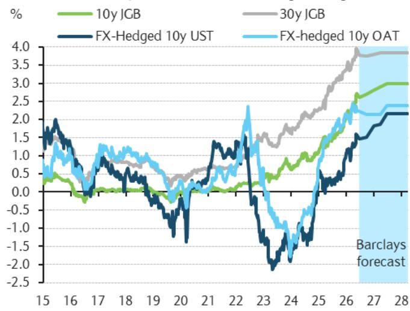  
Note: FX hedge costs based on 3m FX swap. Based on our global rates forecast. OAT forecast assumes average spread to Bunds.
Source: Bloomberg, BARC

FIGURE 42. Cumulative foreign bond investment by investor type  
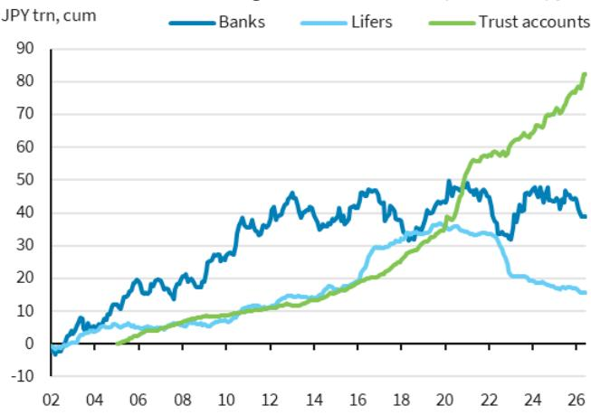  
Source: MoF, BARC

In terms of geography, Japanese investors have favored US bonds over other regions in recent years, even with less attractive FX-hedged UST yields over EGBs (Figure 43). This may partly reflect FX-unhedged investment based on higher nominal yields and a constructive outlook for the USD.

In terms of products, sovereign bond investment has led the overall increase since 2023, but non-sovereign bonds (eg, credit assets) have also had a steady increase until the recent selloff the after geopolitical flare-up in the Middle East this year (Figure 44). The latter likely reflects FX-hedged investment using matched-maturity xccy swaps, as FX-hedged government bonds are no longer attractive, as noted above.

FIGURE 43. Foreign bond investment per region by fiscal year  
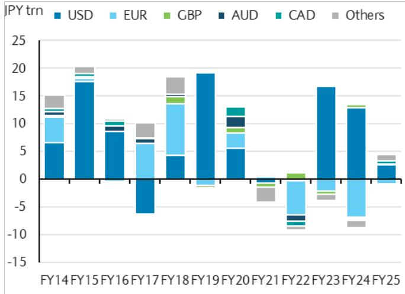  
Source: MoF, BARC

FIGURE 44. Sovereign vs. non-sovereign bond investments  
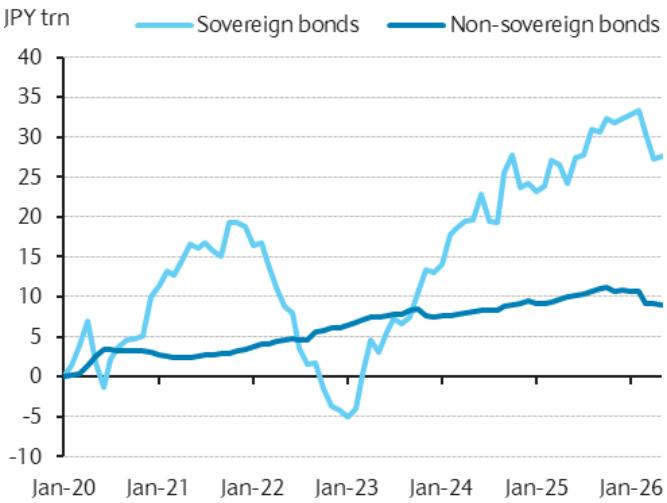  
Note: Sum of US, Germany, France, Italy and UK.
Source: MoF, BARC

## Analyst(s) Certification(s):

We, Moyeen Islam, Anshul Pradhan, Shinichiro Kadota, Andres Mok, CFA, Max Kitson, Demi Hu, CFA, Rohan Khanna and Ayao Ehara, hereby certify (1) that the views expressed in this research report accurately reflect our personal views about any or all of the subject securities or issuers referred to in this research report and (2) no part of our compensation was, is or will be directly or indirectly related to the specific recommendations or views expressed in this research report.

## Important Disclosures:

BARC is produced by the Investment Bank of BARC Bank PLC and its affiliates (collectively and each individually, "BARC").

All authors contributing to this research report are Research Analysts unless otherwise indicated. The publication date at the top of the report reflects the local time where the report was produced and may differ from the release date provided in GMT.

## Availability of Disclosures:

For current important disclosures regarding any issuers which are the subject of this research report please refer to https://

publicresearch.BARC.com or alternatively send a written request to: BARC Compliance, 745 Seventh Avenue, 13th Floor, New York, NY 10019 or call +1-212-526-1072.

BARC Capital Inc. and/or one of its affiliates does and seeks to do business with companies covered in its research reports. As a result, investors should be aware that BARC may have a conflict of interest that could affect the objectivity of this report. BARC Capital Inc. and/or one of its affiliates regularly trades, generally deals as principal and generally provides liquidity (as market maker or otherwise) in the debt securities that are the subject of this research report (and related derivatives thereof). BARC trading desks may have either a long and / or short position in such securities, other financial instruments and / or derivatives, which may pose a conflict with the interests of investing customers. Where permitted and subject to appropriate information barrier restrictions, BARC fixed income research analysts regularly interact with its trading desk personnel regarding current market conditions and prices. BARC fixed income research analysts receive compensation based on various factors including, but not limited to, the quality of their work, the overall performance of the firm (including the profitability of the Investment Banking Department), the profitability and revenues of the Markets business and the potential interest of the firm's investing clients in research with respect to the asset class covered by the analyst. To the extent that any historical pricing information was obtained from BARC trading desks, the firm makes no representation that it is accurate or complete. All levels, prices and spreads are historical and do not necessarily represent current market levels, prices or spreads, some or all of which may have changed since the publication of this document. BARC Department produces various types of research including, but not limited to, fundamental analysis, equity-linked analysis, quantitative analysis, and trade ideas. Recommendations and trade ideas contained in one type of BARC may differ from those contained in other types of BARC, whether as a result of differing time horizons, methodologies, or otherwise.

In order to access BARC Statement regarding Research Dissemination Policies and Procedures, please refer to https://

publicresearch.BARC.com/S/RD.htm. In order to access BARC Conflict Management Policy Statement, please refer to: https://publicresearch.BARC.com/S/CM.htm.

## Disclosure(s) regarding Information Sources

Bloomberg® is a trademark and service mark of Bloomberg Finance L.P. and its affiliates (collectively “Bloomberg”) and the Bloomberg Indices are trademarks of Bloomberg. Bloomberg or Bloomberg’s licensors own all proprietary rights in the Bloomberg Indices. Bloomberg does not approve or endorse this material, or guarantee the accuracy or completeness of any information herein, or make any warranty, express or implied, as to the results to be obtained therefrom and, to the maximum extent allowed by law, Bloomberg shall have no liability or responsibility for injury or damages arising in connection therewith.

All pricing information is indicative only. Unless otherwise indicated, prices are sourced from LSEG Data & Analytics and reflect the closing price in the relevant trading market, which may not be the last available price at the time of publication.

## Types of investment recommendations produced by BARC FICC Research:

In addition to any ratings assigned under BARC' formal rating systems, this publication may contain investment recommendations in the form of trade ideas, thematic screens, scorecards or portfolio recommendations that have been produced by analysts in FICC Research. Any such investment recommendations produced by non-Credit Research teams shall remain open until they are subsequently amended, rebalanced or closed in a future research report. Any such investment recommendations produced by the Credit Research teams are valid at current market conditions and may not be otherwise relied upon.

## Disclosure of other investment recommendations produced by BARC FICC Research:

BARC FICC Research may have published other investment recommendations in respect of the same securities/instruments recommended in this research report during the preceding 12 months. To view all investment recommendations published by BARC FICC Research in the preceding 12 months please refer to https://live.barcap.com/go/research/Recommendations.

BARC does not assign ratings to asset backed securities. BARC Capital Inc. and/or one of its affiliates may have acted as an underwriter for public offerings of any asset backed securities that are otherwise recommended in trade ideas contained within its securitised research reports.

## Legal entities involved in producing BARC:

BARC Bank PLC (BARC, UK)

BARC Capital Inc. (BCI, US)

BARC Bank Ireland PLC, Frankfurt Branch (BBI, Frankfurt)

BARC Bank Ireland PLC, Paris Branch (BBI, Paris)

BARC Bank Ireland PLC, Milan Branch (BBI, Milan)

BARC Securities Japan Limited (BSJL, Japan)

BARC Bank PLC, Hong Kong Branch (BARC Bank, Hong Kong)

BARC Bank Mexico, S.A. (BBMX, Mexico)

BARC Capital Casa de Bolsa, S.A. de C.V. (BCCB, Mexico)

BARC Securities (India) Private Limited (BSIPL, India)

BARC Bank PLC, Singapore Branch (BARC Bank, Singapore)

BARC Bank PLC, DIFC Branch (BARC Bank, DIFC)

## Disclaimer:

This publication has been produced by BARC Department in the Investment Bank of BARC Bank PLC and/or one or more of its affiliates (collectively and each individually, "BARC").

It has been prepared for institutional investors and not for retail investors. It has been distributed by one or more BARC affiliated legal entities listed below or by an independent and non-affiliated third-party entity (as may be communicated to you by such third-party entity in its communications with you). It is provided for information purposes only, and BARC makes no express or implied warranties, and expressly disclaims all warranties of merchantability or fitness for a particular purpose or use with respect to any data included in this publication. To the extent that this publication states on the front page that it is intended for institutional investors and is not subject to all of the independence and disclosure standards applicable to debt research reports prepared for retail investors under U.S. FINRA Rule 2242, it is an “institutional debt research report” and distribution to retail investors is strictly prohibited. BARC also distributes such institutional debt research reports to various issuers, media, regulatory and academic organisations for their own internal informational news gathering, regulatory or academic purposes and not for the purpose of making investment decisions regarding any debt securities. Media organisations are prohibited from re-publishing any opinion or recommendation concerning a debt issuer or debt security contained in any BARC institutional debt research report. Any such recipients that do not want to continue receiving BARC institutional debt research reports should contact debtresearch@BARC.com. Unless clients have agreed to receive “institutional debt research reports” as required by US FINRA Rule 2242, they will not receive any such reports that may be co-authored by non-debt research analysts. Eligible clients may get access to such cross asset reports by contacting debtresearch@BARC.com. BARC will not treat unauthorized recipients of this report as its clients and accepts no liability for use by them of the contents which may not be suitable for their personal use. Prices shown are indicative and BARC is not offering to buy or sell or soliciting offers to buy or sell any financial instrument.

Without limiting any of the foregoing and to the extent permitted by law, in no event shall BARC, nor any affiliate, nor any of their respective officers, directors, partners, or employees have any liability for (a) any special, punitive, indirect, or consequential damages; or (b) any lost profits, lost revenue, loss of anticipated savings or loss of opportunity or other financial loss, even if notified of the possibility of such damages, arising from any use of this publication or its contents.

Other than disclosures relating to BARC, the information contained in this publication (including third-party data) has been obtained from sources that BARC believes to be reliable, but BARC does not represent or warrant that it is accurate or complete. Third-party data, including third-party forecasts and predictions, is provided for information purposes only, has not been adopted or endorsed by BARC, and does not represent the views or opinions of BARC. Presentations by Third-Party Speakers: Any views or opinions expressed by third-party speakers during a BARC-hosted event are solely those of the speaker and do not represent the views or opinions of BARC. BARC is not responsible for, and makes no warranties whatsoever as to, the information or opinions contained in any written, electronic, audio or video presentations by any third-party speakers, and such presentations have not been adopted or endorsed by BARC and do not represent the views or opinions of BARC. Content from third-party presentations is provided for information purposes only and has not been independently verified by BARC for its accuracy or completeness.

The views in this publication are solely and exclusively those of the authoring analyst(s) and are subject to change, and BARC has no obligation to update its opinions or the information in this publication. Unless otherwise disclosed herein, the analysts who authored this report have not received any compensation from the subject companies in the past 12 months. If this publication contains recommendations, they are general recommendations that were prepared independently of any other interests, including those of BARC and/or its affiliates, and/or the subject companies. This publication does not contain personal investment recommendations or investment advice or take into account the individual financial circumstances or investment objectives of the clients who receive it. BARC is not a fiduciary to any recipient of this publication. The securities and other investments discussed herein may not be suitable for all investors and may not be available for purchase in all jurisdictions. The United States imposed sanctions on certain Chinese companies (https://ofac.treasury.gov/sanctions-programs-and-country-information/chinese-military-companies-sanctions), which may restrict U.S. persons from purchasing securities issued by those companies. Investors must independently evaluate the merits and risks of the investments discussed herein, including any sanctions restrictions that may apply, consult any independent advisors they believe necessary, and exercise independent judgment with regard to any investment decision. The value of and income from any investment may fluctuate from day to day as a result of changes in relevant economic markets (including changes in market liquidity). The information herein is not intended to predict actual results, which may differ substantially from those reflected. Past performance is not necessarily indicative of future results. The information provided does not constitute a financial benchmark and should not be used as a submission or contribution of input data for the purposes of determining a financial benchmark.

This publication is not investment company sales literature as defined by Section 270.24(b) of the US Investment Company Act of 1940, nor is it intended to constitute an offer, promotion or recommendation of, and should not be viewed as marketing (including, without limitation, for the purposes of the UK Alternative Investment Fund Managers Regulations 2013 (SI 2013/1773) or AIFMD (Directive 2011/61)) or pre-marketing (including, without limitation, for the purposes of Directive (EU) 2019/1160) of the securities, products or issuers that are the subject of this report.

Third Party Distribution: Any views expressed in this communication are solely those of BARC and have not been adopted or endorsed by any third party distributor.

United Kingdom: This document is being distributed (1) only by or with the approval of an authorised person (BARC Bank PLC) or (2) to, and is directed at (a) persons in the United Kingdom having professional experience in matters relating to investments and who fall within the definition of "investment professionals" in Article 19(5) of the Financial Services and Markets Act 2000 (Financial Promotion) Order 2005 (the "Order"); or (b) high net worth companies, unincorporated associations and partnerships and trustees of high value trusts as described in Article 49(2) of the Order; or (c) other persons to whom it may otherwise lawfully be communicated (all such persons being "Relevant Persons"). Any investment or investment activity to which this communication relates is only available to and will only be engaged in with Relevant Persons. Any other persons who receive this communication should not rely on or act upon it. BARC Bank PLC is authorised by the Prudential Regulation Authority and regulated by the Financial Conduct Authority and the Prudential Regulation Authority and is a member of the London Stock Exchange.

European Economic Area (“EEA”): This material is being distributed to any “Authorised User” located in a Restricted EEA Country by BARC Bank Ireland PLC. The Restricted EEA Countries are Austria, Bulgaria, Estonia, Finland, Hungary, Iceland, Liechtenstein, Lithuania, Luxembourg, Malta, Portugal, Romania, Slovakia and Slovenia. For any other “Authorised User” located in a country of the European Economic Area, this material is being distributed by BARC Bank PLC. BARC Bank Ireland PLC is a bank authorised by the Central Bank of Ireland whose registered office is at 1 Molesworth Street, Dublin 2, Ireland. BARC Bank PLC is not registered in France with the Autorité des marchés financiers or the Autorité de contrôle prudentiel. Authorised User means each individual associated with the Client who is notified by the Client to BARC and authorised to use the Research Services. The Restricted EEA Countries will be amended if required.

Finland: Notwithstanding Finland's status as a Restricted EEA Country, Research Services may also be provided by BARC Bank PLC where permitted by the terms of its cross-border license.

Americas: The Investment Bank of BARC Bank PLC undertakes U.S. securities business in the name of its wholly owned subsidiary BARC Capital Inc., a FINRA and SIPC member. BARC Capital Inc., a U.S. registered broker/dealer, is distributing this material in the United States and, in connection therewith accepts responsibility for its contents. Any U.S. person wishing to effect a transaction in any security discussed herein should do so only by contacting a representative of BARC Capital Inc. in the U.S. at 745 Seventh Avenue, New York, New York 10019.

Non-U.S. persons should contact and execute transactions through a BARC Bank PLC branch or affiliate in their home jurisdiction unless local regulations permit otherwise.

This material is distributed in Canada by BARC Capital Canada Inc., a registered investment dealer, a Dealer Member of Canadian Investment Regulatory Organization (www.ciro.ca), and a Member of the Canadian Investor Protection Fund (CIPF).

This material is distributed in Mexico by BARC Bank Mexico, S.A. and/or BARC Capital Casa de Bolsa, S.A. de C.V. This material is distributed in the Cayman Islands and in the Bahamas by BARC Capital Inc., which it is not licensed or registered to conduct and does not conduct business in, from or within those jurisdictions and has not filed this material with any regulatory body in those jurisdictions.

Japan: This material is being distributed to institutional investors in Japan by BARC Securities Japan Limited. BARC Securities Japan Limited is a joint-stock company incorporated in Japan with registered office of 6-10-1 Roppongi, Minato-ku, Tokyo 106-6131, Japan. It is a subsidiary of BARC Bank PLC and a registered financial instruments firm regulated by the Financial Services Agency of Japan. Registered Number: Kanto Zaimukyokucho (kinsho) No. 143.

Asia Pacific (excluding Japan): BARC Bank PLC, Hong Kong Branch is distributing this material in Hong Kong as an authorised institution regulated by the Hong Kong Monetary Authority. Registered Office: 41/F, Cheung Kong Center, 2 Queen's Road Central, Hong Kong.

All Indian securities-related research and other equity research produced by BARC' Investment Bank are distributed in India by BARC Securities (India) Private Limited (BSIPL). BSIPL is a company incorporated under the Companies Act, 1956 having CIN U67120MH2006PTC161063. BSIPL is registered and regulated by the Securities and Exchange Board of India (SEBI) as a Research Analyst: INH000001519; Portfolio Manager INP000002585; Stock Broker INZ000269539 (member of NSE and BSE); Depository Participant with the National Securities & Depositories Limited (NSDL): DP ID: IN-DP-NSDL-478-2020; Investment Adviser: INA000000391. BSIPL is also registered as a Mutual Fund Advisor having AMFI ARN No. 53308. The registered office of BSIPL is at Nirlon Knowledge Park, 9th floor, Block B-6, Off. Western Express Highway, Goregaon (East), Mumbai – 400063, India. Telephone No: +91 22 61754000 Fax number: +91 22 61754099. Any other reports produced by BARC' Investment Bank are distributed in India by BARC Bank PLC, India Branch, an associate of BSIPL in India that is registered with Reserve Bank of India (RBI) as a Banking Company under the provisions of The Banking Regulation Act, 1949 (Regn No BOM43) and registered with SEBI as Merchant Banker (Regn No INM000002129) and also as Banker to the Issue (Regn No INBI00000950). BARC Investments and Loans (India) Limited, registered with RBI as Non Banking Financial Company (Regn No RBI CoR-07-00258), and BARC Wealth Trustees (India) Private Limited, registered with Registrar of Companies (CIN U93000MH2008PTC188438), are associates of BSIPL in India that are not authorised to distribute any reports produced by BARC' Investment Bank.

This material is distributed in Singapore by the Singapore Branch of BARC Bank PLC, a bank licensed in Singapore by the Monetary Authority of Singapore. For matters in connection with this material, recipients in Singapore may contact the Singapore branch of BARC Bank PLC, whose registered address is 10 Marina Boulevard, #23-01 Marina Bay Financial Centre Tower 2, Singapore 018983.

This material, where distributed to persons in Australia, is produced or provided by BARC Bank PLC.

This communication is directed at persons who are a “Wholesale Client” as defined by the Australian Corporations Act 2001.

Please note that the Australian Securities and Investments Commission (ASIC) has provided certain exemptions to BARC Bank PLC (BBPLC) under paragraph 911A(2)(I) of the Corporations Act 2001 from the requirement to hold an Australian financial services licence (AFSL) in respect of financial services provided to Australian Wholesale Clients, on the basis that BBPLC is authorised by the Prudential Regulation Authority of the United Kingdom (PRA) and regulated by the Financial Conduct Authority (FCA) of the United Kingdom and the PRA under United Kingdom laws. The United Kingdom has laws which differ from Australian laws. To the extent that this communication involves the provision of financial services by BBPLC to Australian Wholesale Clients, BBPLC relies on the relevant exemption from the requirement to hold an AFSL. Accordingly, BBPLC does not hold an AFSL.

This communication may be distributed to you by either: (i) BARC Bank PLC directly, (ii) Barrenjoey Markets Pty Limited (ACN 636 976 059, "Barrenjoey"), the holder of Australian Financial Services Licence (AFSL) 521800, a non-affiliated third party distributor, where clearly identified to you by Barrenjoey. Barrenjoey is not an agent of BARC Bank PLC or (iii) such other non-affiliated third-party distributor(s) as may be clearly identified to you. Such non-affiliated third-party distributor(s) are not agents of BARC Bank PLC.

This material, where distributed in New Zealand, is produced or provided by BARC Bank PLC. BARC Bank PLC is not registered, filed with or approved by any New Zealand regulatory authority. This material is not provided under or in accordance with the Financial Markets Conduct Act of 2013 (“FMCA”), and is not a disclosure document or “financial advice” under the FMCA. This material is distributed to you by either: (i) BARC Bank PLC directly or (ii) Barrenjoey Markets Pty Limited (“Barrenjoey”), a non-affiliated third party distributor, where clearly identified to you by Barrenjoey. Barrenjoey is not an agent of BARC Bank PLC. This material may only be distributed to “wholesale investors” that meet the “investment business”, “investment activity”, “large”, or “government agency” criteria specified in Schedule 1 of the FMCA.

Middle East: Nothing herein should be considered investment advice as defined in the Israeli Regulation of Investment Advisory, Investment Marketing and Portfolio Management Law, 1995 (“Advisory Law”). This document is being made to eligible clients (as defined under the Advisory Law) only. BARC Israeli branch previously held an investment marketing license with the Israel Securities Authority but it cancelled such license on 30/11/2014 as it solely provides its services to eligible clients pursuant to available exemptions under the Advisory Law, therefore a license with the Israel Securities Authority is not required. Accordingly, BARC does not maintain an insurance coverage pursuant to the Advisory Law.

This material is distributed in the United Arab Emirates (including the Dubai International Financial Centre) and Qatar by BARC Bank PLC. BARC Bank PLC in the Dubai International Financial Centre (Registered No. 0060) is regulated by the Dubai Financial Services Authority (DFSA). Principal place of business in the Dubai International Financial Centre: The Gate Village, Building 4, Level 4, PO Box 506504, Dubai, United Arab Emirates. BARC Bank PLC-DIFC Branch, may only undertake the financial services activities that fall within the scope of its existing DFSA licence. Related financial products or services are only available to Professional Clients, as defined by the Dubai Financial Services Authority. BARC Bank PLC in the UAE is regulated by the Central Bank of the UAE and is licensed to conduct business activities as a branch of a commercial bank incorporated outside the UAE in Dubai (Licence No.: 13/1844/2008, Registered Office: Building No. 6, Burj Dubai Business Hub, Sheikh Zayed Road, Dubai City) and Abu Dhabi (Licence No.: 13/952/2008, Registered Office: Al Jazira Towers, Hamdan Street, PO Box 2734, Abu Dhabi). This material does not constitute or form part of any offer to issue or sell, or any solicitation of any offer to subscribe for or purchase, any securities or investment products in the UAE (including the Dubai International Financial Centre) and accordingly should not be construed as such. Furthermore, this information is being made available on the basis that the recipient acknowledges and understands that the entities and securities to which it may relate have not been approved, licensed by or registered with the UAE Central Bank, the Dubai Financial Services Authority or any other relevant licensing authority or governmental agency in the UAE. The content of this report has not been approved by or filed with the UAE Central Bank or Dubai Financial Services Authority. BARC Bank PLC in the Qatar Financial Centre (Registered No. 00018) is authorised by the Qatar Financial Centre Regulatory Authority (QFCRA). BARC Bank PLC-QFC Branch may only undertake the regulated activities that fall within the scope of its existing QFCRA licence. Principal place of business in Qatar: Qatar Financial Centre, Office 1002, 10th Floor, QFC Tower, Diplomatic Area, West Bay, PO Box 15891, Doha, Qatar. Related financial products or services are only available to Business Customers as defined by the Qatar Financial Centre Regulatory Authority.

Russia: This material is not intended for investors who are not Qualified Investors according to the laws of the Russian Federation as it might contain information about or description of the features of financial instruments not admitted for public offering and/or circulation in the Russian Federation and thus not eligible for non-Qualified Investors. If you are not a Qualified Investor according to the laws of the Russian Federation, please dispose of any copy of this material in your possession.

Sustainable Investing Related Research: There is currently no globally accepted framework or definition (legal, regulatory or otherwise) of, nor market consensus as to what constitutes a ‘sustainable’, ‘ESG’, ‘green’, ‘climate-friendly’ or an equivalent company, investment, strategy or consideration or what precise attributes are required to be eligible to be categorised by such terms. This means there are different ways to evaluate a company or an investment and so different values may be placed on certain sustainability credentials as well as adverse ESG-related impacts of companies and ESG controversies. The evolving nature of sustainable investing considerations, models and methodologies means it can be challenging to definitively and universally classify a company or investment under a sustainable investing label and there may be areas where such companies and investments could improve or where adverse ESG-related impacts or ESG controversies exist. The evolving nature of sustainable finance related regulations and the development of jurisdiction-specific regulatory criteria also means that there is likely to be a degree of divergence as to the interpretation of such terms in the market. We expect industry guidance, market practice, and regulations in this field to continue to evolve.

Any information, data, image, or other content including from a third party source contained, referred to herein or used for whatsoever purpose by BARC or a third party (“Information”), in relation to any actual or potential ‘ESG’, ‘sustainable’ or equivalent objective, issue, factor or consideration is not intended to be relied upon for ESG or sustainability classification, regulatory regime or industry initiative purposes (“ESG Regimes”), unless otherwise stated. Nothing in these materials, including any images included therein, is intended to convey, suggest or indicate that BARC considers or represents any product, service, person or body mentioned in these materials as meeting or qualifying for any ESG or sustainability classification, label or similar standards that may exist under ESG Regimes. BARC has not conducted any assessment of compliance with ESG Regimes. Parties are reminded to make their own assessments for these purposes.

IRS Circular 230 Prepared Materials Disclaimer: BARC does not provide tax advice and nothing contained herein should be construed to be tax advice. Please be advised that any discussion of U.S. tax matters contained herein (including any attachments) (i) is not intended or written to be used, and cannot be used, by you for the purpose of avoiding U.S. tax-related penalties; and (ii) was written to support the promotion or marketing of the transactions or other matters addressed herein. Accordingly, you should seek advice based on your particular circumstances from an independent tax advisor.

© Copyright BARC Bank PLC (2026). All rights reserved. No part of this publication may be reproduced or redistributed in any manner without the prior written permission of BARC. BARC Bank PLC is registered in England No. 1026167. Registered office 1 Churchill Place, London, E14 5HP. Additional information regarding this publication will be furnished upon request.

## BRCF2242