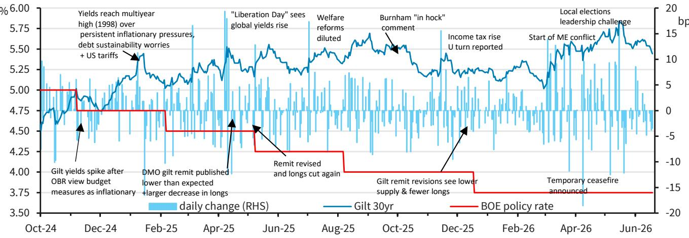
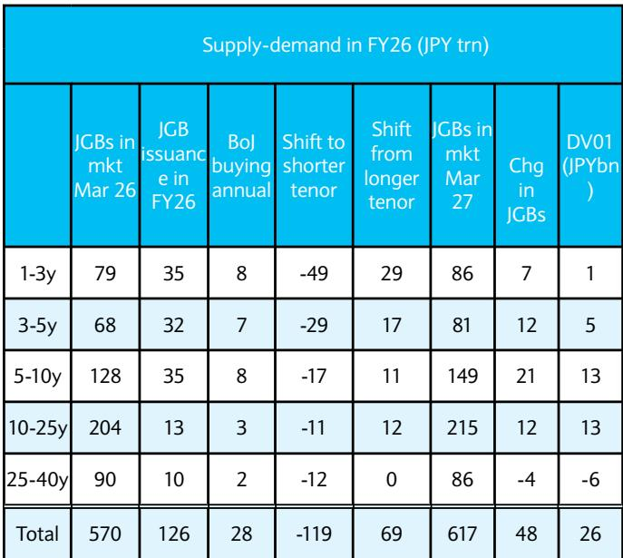

# BARC：全球正从“储蓄过剩”转向“债券过剩”，长端利率的结构性上行才刚刚开始

全球投资者正在经历一个被多数人低估的范式转换。过去二十年，市场习惯了“全球储蓄过剩”压低长期利率的故事——新兴市场央行和主权财富基金对发达市场国债的刚性需求，让长端收益率持续处于低位。但BARC利率策略团队在最新发布的深度报告中提出了一个截然相反的判断：世界正从“储蓄过剩”转向“债券过剩”，而这一转变意味着长端收益率的结构性上行远未结束。

这份报告的核心洞察并非简单的“利率会更高”，而是揭示了当前5%左右的30年期国债收益率与2007年5%的收益率在构成上存在根本性差异。今天的5%中，包含了更低的短期利率预期和更高的期限溢价与财政风险溢价。换句话说，市场正在为持有长期国债要求更多的补偿，而这一趋势背后的驱动力——持续的财政赤字与价格敏感的买家基础——短期内看不到逆转的可能。

**BARC认为，无论是美国财政部缩短发行久期、欧洲降低加权平均到期期限，还是日本削减超长端发行量，这些供给侧的调整只能在边际上减缓调整速度，无法改变方向。**

> **KC评论：** 这份报告最值得反复咀嚼的是它对30年期美债收益率的拆解框架。它把5%的收益率分成了三块：预期短期利率（3.1%）、利率期限溢价（1.1%）和财政风险溢价（0.7%）。对比2007年，当时预期短期利率高达4.4%，而期限溢价和财政溢价几乎可以忽略。这意味着，今天的市场不是在为“未来加息”定价，而是在为“长期持有国债的不确定性”定价。这种结构性变化，比简单的加息周期更值得投资者关注。

## 1. 30年期收益率重回5%，但驱动因素已截然不同

BARC通过分解30年期美债收益率的历史构成，揭示了一个关键事实：当前5%的水平与2007年5%的水平，本质上是两种不同的定价逻辑。

基于调查数据，当前30年期收益率中嵌入的预期短期名义利率约为3.1%，而2007年这一数字为4.4%，两者相差130-140个基点。这意味着，即使30年期收益率绝对水平相近，市场对未来短期利率路径的预期已经大幅下移。填补这个缺口的是两个迅速膨胀的部分：利率期限溢价和财政风险溢价。

报告测算，当前30年期互换利率相对于预期短期利率的溢价约为110个基点，高于2000年代90个基点的均值，接近1990年代中期120个基点的水平。这表明投资者对承担久期风险要求的补偿已经正常化，甚至超过了全球金融危机前的常态。

更引人注目的是财政风险溢价。当前30年期美国国债相对于互换利率的价差已经达到正70个基点——而在2000年，这一价差为负70个基点（经SOFR换算后）。这一翻转意味着，投资者正在明确要求额外的补偿，以应对美国财政状况持续恶化的风险。

**换句话说，今天的5%收益率里，有将近1.8个百分点来自投资者对“不确定性”和“财政风险”的定价，而不是来自对经济增长和通胀的乐观预期。**

> **KC评论：** 这个拆解框架对资产配置有直接含义。如果你认为5%的30年期收益率已经足够有吸引力，你需要意识到，这笔交易的回报高度依赖于期限溢价和财政溢价在未来不会进一步扩大。而BARC的观点恰恰相反——这两个溢价仍有上行空间。读完整份报告，你会看到他们如何从中性利率、财政赤字和美联储资产负债表三个角度论证这一判断。

## 2. 中性利率的共识估计可能严重滞后，真实水平可能在3.5%-4%

BARC认为，当前市场对名义中性利率的共识估计——约3.1%——可能严重偏低。这一判断基于三个相互强化的观察。

首先，美国经济基本面远比预期强劲。2026年上半年GDP增速估计在2.5%左右，就业增长从去年同期的月均3万人反弹至11.4万人，核心PCE通胀从年初的3%升至3.4%。所有这些数据都指向一个结论：中性利率不太可能低于当前的隔夜利率。

其次，储蓄-投资失衡正在向“过度投资”倾斜。超大规模云服务商的投资已升至GDP的2.2%，预计到2028年将达到1万亿美元，占GDP的3%。与此同时，家庭储蓄率已急剧下降至2.5%左右，背后是持续膨胀的净资产。这两个趋势都在推高中性利率。

BARC汇总了主要模型对名义中性利率的估计，平均值约为3.5%，上限接近4%。而美联储的长期点阵图（约3%）处于区间的低端，很可能滞后于实际经济表现。报告预期模型估计将继续向上修正。

**如果名义中性利率真的从3%升至3.5%-4%，那么在其他条件不变的情况下，长期国债收益率需要进一步上行来反映这一变化。**

## 3. 财政赤字前景可能比市场定价的更差，关税和利率构成双重压力

BARC对美国财政前景的评估比CBO的基准假设更为悲观。报告指出，市场当前定价隐含的10年平均预算赤字约为GDP的6%-6.5%，这与CBO最新预测的6.1%大致吻合。但CBO的假设现在看来可能过于乐观。

关键变量在于关税收入。有效关税率已从峰值的12%降至7%-8%，远低于CBO假设的15%。CBO原本预计2027-2036年关税总收入约为4万亿美元，但在10%的有效税率下，这一数字将降至2.7万亿美元，缺口达1.3万亿美元。

利率成本同样在施压。报告测算，每10个基点的利率上升将导致10年累计赤字增加约3800亿美元。今年以来5年期收益率已上升约50个基点，如果持续，意味着10年赤字将额外增加约1.9万亿美元。

一个潜在的抵消因素是生产率提升。CBO估计，年生产率增速提高0.5个百分点可使10年平均赤字减少1.6万亿美元。但这一假设的实现存在不确定性。

报告进一步量化：如果预算赤字平均达到GDP的7%而非6%，30年期互换利差将从当前的-70个基点进一步收窄至约-85个基点，这意味着长期国债收益率相对于互换利率需要进一步上行约15个基点。

**BARC同时指出，美国财政部当前偏向短端的发行策略——2026年约43%的净融资来自国库券——正在帮助控制财政风险溢价。但随着财政部可能在今年晚些时候释放2027年增加拍卖规模的信息，这一支撑将逐步消退。**

## 4. 买家基础的“价格敏感化”是结构性变化，期限溢价仍有上行空间

BARC认为，期限溢价已经回到并可能超过全球金融危机前的水平，而这一重新定价有坚实的结构性基础。其中最根本的变化是国债买家基础的性质正在发生不可逆的转变。

外国官方持有占比在过去十年持续下降，美联储的持仓也在逐步缩减。结果是，外国私人投资者和国内私人投资者持有的国债份额显著上升。与央行和官方机构不同，私人投资者对价格更加敏感，对期限溢价的要价更高。

与此同时，国债作为投资组合分散化工具的价值正在减弱。在全球金融危机后到疫情前的时期，股票与长期国债的回报相关性为负，这意味着国债在风险事件中提供了有效的对冲。但通胀成为主要担忧后，这一相关性已转为正值。BARC指出，只有当增长再次成为市场主导叙事时，期限溢价才可能回落。

报告还提醒关注两个被市场低估的风险因素。一是利率波动率仍有上行空间。在美联储转向数据依赖、减少前瞻指引的背景下，利率波动率可能向全球金融危机前的高位回归。二是美联储资产负债表久期的缩短。当前美联储持有国债的加权平均期限约为8.5年，远高于全球金融危机前的3年。在被动缩表路径下，美联储的10年期等价持仓每年将减少约1个百分点的GDP，这可能会每年推高期限溢价约10个基点。

**综合来看，30年期收益率在4.9%的水平在历史上并不算高，而通过中性利率和财政溢价进一步重定价的空间仍然存在。**

> **KC评论：** 报告对买家基础的分析是理解整个框架的关键。过去二十年，全球储蓄过剩之所以能压低长端利率，是因为有大量“不关注价格”的买家——央行、主权基金、养老金——在吸收期限风险。但当这些买家逐渐退场，市场需要更便宜的价格（即更高的收益率）来吸引价格敏感的私人资本接盘。这个过程是结构性的，不会因为一次FOMC会议或一次财政部的发行调整而逆转。完整报告里还有对不同地区（欧洲、英国、日本）买家基础变化的详细拆解，以及一张非常直观的国债持有结构变化图。

## 5. 报告尚未完全回答的关键问题：什么条件才能让趋势逆转？

BARC在报告结尾坦率地承认，除非出现真正的宏观体制转换，长端收益率的反弹很可能是暂时的。一个可持续的牛市需要满足以下条件之一：足够大的增长冲击、政策宽松或资产负债表支持的果断回归、或者财政可信度的实质性恢复。

但报告没有充分展开的是这些条件各自需要多大的触发力度。例如，什么样的增长冲击才算“足够大”？是GDP增速跌至1%以下，还是出现负增长？同样，财政可信度的恢复需要怎样的政策行动——是明确的减支方案，还是税收改革，还是两者兼有？

另一个未解的问题是，不同发达市场之间的分化是否会进一步加剧。报告分别讨论了美国（便利收益侵蚀）、欧洲（财政压力在弱宏观环境下的重燃）、英国（对财政叙事的敏感性上升）和日本（财政扩张传导至通胀风险溢价）的不同路径，但没有给出这些分化是否会导致相对价值交易机会的明确判断。

**这些未解问题恰恰是继续深读完整报告的价值所在。BARC团队在报告中提供了详细的量化框架和历史对比图表，可以帮助投资者建立自己的判断基准。**

---

**如果你希望更系统地理解这一范式转换对资产配置的影响，欢迎加入我们的社群。每天我们会由AI agent配合人工review，生成国际投行中文摘要与KC评论，日更约10-40页，并整理当天最新数据图表合集。这些内容既方便喂给AI进行二次分析，也方便人工快速把握全球市场的动态变化。我们会在微信群里继续讨论这些未解问题，欢迎你的加入。**

Personal reading notes and learning share only. Not investment advice.

