## A cyclical state of mind

## 2026 Mid-Year Global Economic Outlook

\- The first half of 2026 delivered a material energy price shock, but we maintain our forecast for a cyclical upturn—led by a continued tech boom, and a rebound in hiring and non-tech investment—that sustains global growth at an above-potential pace.

\- As projected in our year-ahead outlook, fading business caution following last year's trade war is the catalyst for the cyclical lift now underway.

\- The risk of a disruptive energy price shock short-circuiting this lift has been reduced by the agreement to open the Strait of Hormuz. However, global GDP growth is still expected to downshift into midyear as the recent CPI spike softens consumption gains.

\- Several factors should temper this downshift and set the stage for a 2H26 reacceleration. Industrial activity will be supported by a positive turn in the inventory cycle. Fiscal measures are cushioning the household purchasing power squeeze, while the opening of the Strait should boost sentiment.

\- Two important developments to watch for: First, we see the recent pickup in US job growth as linked to fading business caution and anticipate sustained gains of 100k per month or faster.

\- Second, we expect European sentiment readings to rebound smartly, placing Euro area growth on track to accelerate to an above-trend pace later this year.

\- While likely to boost productivity growth, AI is also an important contributor to global demand this year. Spending on new technologies is broadening beyond hyperscalers.

\- The energy sector looks set to return to balance earlier than expected and we now project Brent crude oil prices to average \$80/bbl in 2H26.

\- Our constructive growth outlook comes at the cost of price stability and should produce labor supply constraints. Despite an expected drop in energy prices, 2026 global headline and core CPI should rise by more than 3%.

\- Core inflation surprises are sufficient to deliver hikes by many central banks, even as falling oil prices reduce the near-term pressures reflected in current market pricing. In the US, the interaction of elevated core inflation with a fall in the unemployment rate will bring the Fed to hike.

\- Supportive financial conditions linked to central banks' tolerance of persistently elevated inflation underpin our baseline forecast, which anticipates global policy rates will rise less than 30bp over the coming year.

\- More aggressive action by central banks is a material outlook risk. Past experience suggests that an unexpected reset of monetary policy expectations tends to generate financial stress, even with an otherwise healthy economic backdrop.

## Economic and Policy Research

Bruce Kasman
(1-212) 834-5515
bruce.c.kasman@JPM.com
JPM Chase Bank NA

Joseph Lupton
(1-212) 834-5735
joseph.p.lupton@JPM.com
JPM Chase Bank NA

Nora Szentivanyi
(44-20) 7134-7544
nora.szentivanyi@JPM.com
JPM Securities plc

(1-212) 622-8435
maia.crook@JPM.com
JPM Chase Bank NA

## Alex Gallin

(1-212) 270-5492
alex.gallin@JPM.com
JPM Chase Bank NA

Maia Crook (1-212) 622-8435
maia.crook@JPM.com

Bruce Kasman (1-212) 834-5515
bruce.c.kasman@JPM.com
JPM Chase Bank NA
Joseph Lupton (1-212) 834-5735
joseph.p.lupton@JPM.com

## A cyclical state of mind

Our 2026 year-ahead outlook had anticipated a conscious recoupling in which non-tech business spending and hiring would rebound from depressed levels. This focus on a cyclical lift amidst sticky core inflation contrasts with a widely held macroeconomic narrative that last year's job stall represents a structural shift—related to weak labor supply and the diffusion of new technologies—that promotes productivity-led growth and a normalization in central bank policy stances. This start-of-year debate was interrupted by an escalation of the conflict in the Middle East which closed the Strait of Hormuz. Energy price increases have raised consumer price inflation sharply and pushed central bankers into a more hawkish stance than expected. A dark cloud has also hovered over the outlook as fears of an extended Strait closure elevated the risk of a disruptive energy price shock threatening the life of the expansion.

The clouds appear to be clearing with the recent agreement to open the Strait, but the consequences of the year's energy price shock are still being felt. Global GDP growth looks set to downshift into midyear as consumer purchasing power is squeezed by the recent sharp CPI spike. While headline inflation should moderate next quarter, the pass-through of this shock to higher core inflation will persist. The energy price shock has thus raised our 2026 projections for headline (1%pt) and core inflation (0.2%pt) and lowered our global GDP growth projections by 0.2%pt (Figure 1).

Figure 1: Global forecast evolution, 2026  
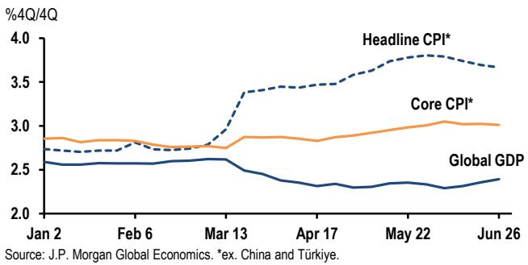  
Source: JPM Global Economics. \*ex. China and Türkiye.

The Middle East conflict has not, however, dampened our conviction that a cyclical upturn is taking hold (Table 1). Incoming economic reports point to a broadening base of tech spending during 1H26. While the application of new technologies should boost productivity growth, it is also boosting demand and contributing to goods price pressures. Evidence suggests that this lift is being complemented by a pickup in non-tech activity as business sentiment rebounds from last year's depressed levels. There are also signs that labor demand is starting to firm.

Table 1: Global GDP growth  
% chg saar, annual figures are %4Q/4Q; potential growth estimates in parentheses

<table><tr><td></td><td>2024</td><td>2025</td><td>1H 2026</td><td>2H 2026</td><td>2027</td></tr><tr><td>Global (2.3)</td><td>2.9</td><td>2.6</td><td>2.7</td><td>2.2</td><td>2.5</td></tr><tr><td>Global ex China (1.9)</td><td>2.4</td><td>2.2</td><td>2.2</td><td>1.9</td><td>2.2</td></tr><tr><td>DM (1.4)</td><td>1.8</td><td>1.5</td><td>1.7</td><td>1.4</td><td>1.7</td></tr><tr><td>United States (1.8)</td><td>2.4</td><td>2.0</td><td>2.5</td><td>1.6</td><td>2.0</td></tr><tr><td>Euro area ex. Irl (1)</td><td>1.0</td><td>1.1</td><td>0.6</td><td>1.1</td><td>1.4</td></tr><tr><td>Japan (0.6)</td><td>0.7</td><td>0.4</td><td>1.0</td><td>0.9</td><td>0.7</td></tr><tr><td>United Kingdom (1)</td><td>2.0</td><td>1.0</td><td>1.8</td><td>0.7</td><td>1.1</td></tr><tr><td>China (3.8)</td><td>5.4</td><td>4.5</td><td>5.0</td><td>3.6</td><td>4.1</td></tr><tr><td>EM ex China (3.3)</td><td>3.7</td><td>3.8</td><td>3.5</td><td>3.2</td><td>3.5</td></tr><tr><td>EMAX (3.4)</td><td>3.4</td><td>4.8</td><td>4.5</td><td>3.3</td><td>3.8</td></tr><tr><td>EMEA EM (2.7)</td><td>3.6</td><td>2.1</td><td>1.8</td><td>3.0</td><td>2.8</td></tr><tr><td>Latam (2.1)</td><td>2.4</td><td>2.0</td><td>2.3</td><td>1.8</td><td>2.0</td></tr></table>

Source: JPM Global Economics

The middle months of the year will likely highlight the tension between an energy shock drag and the business sector lift. While a moderation in global growth towards a potential pace is anticipated, several factors should cushion the drag and set the stage for a growth reacceleration later this year.

\- A normalization in business sentiment... A rebound in business sentiment from its slide following last year's trade war took hold as we turned into 2026 and was the catalyst for the recovery in non-tech spending and hiring (Figure 2). The rise in our business expectations index was interrupted by the Middle East conflict, but receding tensions and falling energy prices point to a resumption in the normalization in sentiment in the coming months.

Figure 2: Global business confidence and employment  
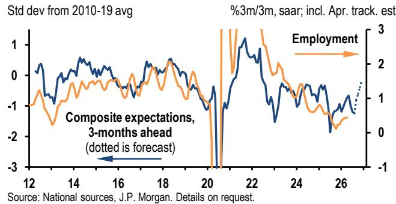  
Source: National sources, JPM. Details on request.

\- ... with a recovery in Western Europe. The rebound in business sentiment should be concentrated in Western Europe, which experienced the most significant drop when the Strait of Hormuz closed (Figure 3). Aligned with this rebound, we anticipate Euro area growth to accelerate towards an above-trend pace in the coming quarters after a soft 1H26, highlighting the regional breadth of the current phase of the global expansion.

Bruce Kasman (1-212) 834-5515
bruce.c.kasman@JPM.com
JPM Chase Bank NA
Joseph Lupton (1-212) 834-5735
joseph.p.lupton@JPM.com

Maia Crook (1-212) 622-8435
maia.crook@JPM.com

Figure 3: Business expectations index  
Std dev from 2010-19 avg; shaded region denotes forecast  
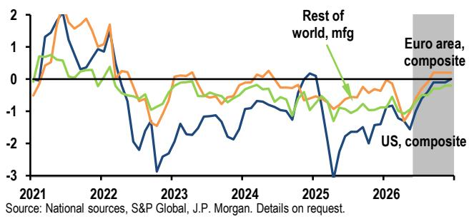  
Source: National sources, S&P Global, JPM. Details on request.

\- Industry gets inventory boost as consumers take a breather. Global retail sales volume growth is expected to stall into midyear, but industrial production gains are expected to remain at a solid pace (Figure 4). In addition to sustained support from tech spending, a turn in the stockbuilding cycle looks to be taking hold that should boost goods sector activity in the middle quarters of this year.

Figure 4: Global consumer goods spending and mfg output %3m/3m, saar  
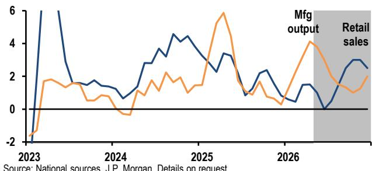  
Source: National sources, JPM. Details on request.

\- Double-barreled cushions for consumer purchasing power. The softening in consumer spending is expected to be tempered by a pickup in job growth that is already taking hold in the US and EM economies (Figure 5). If we are right, US job gains will be sustained at a 100k per month pace or stronger, while global employment gains will rebound towards 1%ar. At the same time, our commodities team has recently revised up their estimates of global energy inventories, prompting a downward revision to their 2H26 oil price forecast—to \$86/bbl in 3Q and \$80 in 4Q. Such a path would provide a meaningful boost to household purchasing power in 2H26 (Figure 6).

Figure 5: Global (ex China) employment  
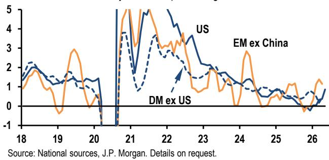  
Source: National sources, JPM. Details on request.

Figure 6: Energy contribution to global CPI  
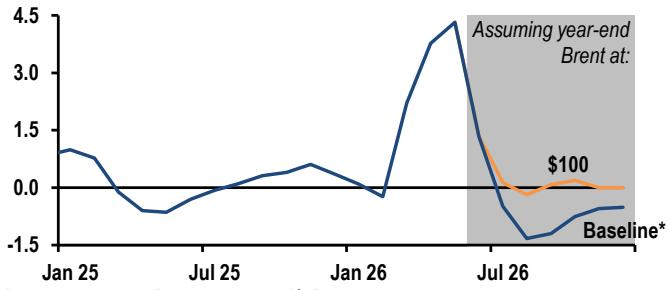  
Source: JPM Global Economics. \*\$78bbl

Underpinning this constructive outlook are accommodative financial conditions and supportive fiscal stances. The Fed's model of the financial conditions impulse for US growth is sending its strongest signal in two decades, excluding episodes of recession exit (Figure 7).

Figure 7: US Fed FCI-G and global credit stress  
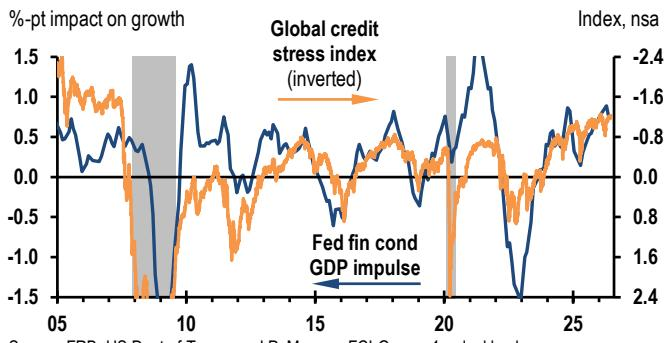  
Source: FRB, US Dept of Treasury, JPM. FCI-G uses 1-yr lookback.

A similar signal comes from measures of global credit stress. To be sure, household savings rates have moved lower in the past year, but wealth gains have been material and debt servicing costs remain low. If we are right, the recovery in job growth and decline in inflation should support an expansion that continues to generate balanced profit and labor income growth (Figure 8).

Figure 8: US corporate profits and private wages  
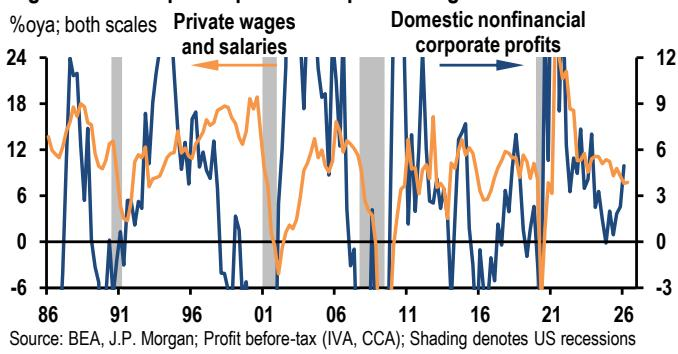  
You can't have your cake and eat it too

While the cyclical lift embedded in our 2026 year-ahead outlook has been tempered by the energy shock, the shock's impact on inflation is singularly to the upside. Strong growth combined with rising energy prices is a potent mix for the broader pricing complex, particularly when inflation has been elevated for several years. In this regard, the rub to our constructive growth outlook is the threat to price stability against a backdrop of labor supply constraints (Figure 9).

Figure 9: Global (ex China) labor markets  
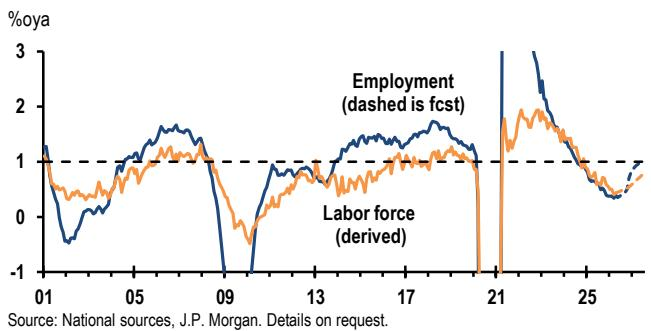

Incoming reports highlight building pressure on goods prices. While the recent spike in energy prices is expected to fade, a mix of tech sector bottlenecks, stronger non-tech demand, and rising commodity and transportation costs are now evident. Relative to average annual gains of 0.9% during 2024-25, our models point to core goods price increases of 2%ar this year (Figure 10). The associated firming in goods inflation looks to be broadly based across regions, as signaled by a pickup in import price gains across the G-4.

Our view that global core service price inflation would remain stable, posting a $3.3\%$ increase this year, was challenged by last year's sharp slide—from a $3.7\%$ ar in 1H25 to $2.9\%$ ar in 4Q25. We downplayed the importance of this decline, anticipating an unwinding of a transitory US drag related to the government shutdown and the seasonal bunching of price increases at the start of the year. In the event, services inflation has rebounded—to a $3.8\%$ ar in the first five

months of this year (Figure 11). This pickup has been broad-based across regions.

Figure 10: Global\* core goods CPI model  
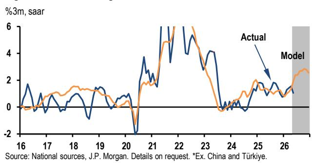

The main source of uncertainty for service price inflation stems from last year's decoupling of labor demand from GDP growth. Estimates of output gaps point to steadily reducing global slack, but the global unemployment rate rose $0.4\%$ pt last year, returning to its pre-pandemic level. We anticipated that this rise would be arrested—by a pickup in hiring amidst weak labor force gains—and the recent firming in global employment gains and decline in unemployment rates is consistent with this view.

Figure 11: Global core CPI  
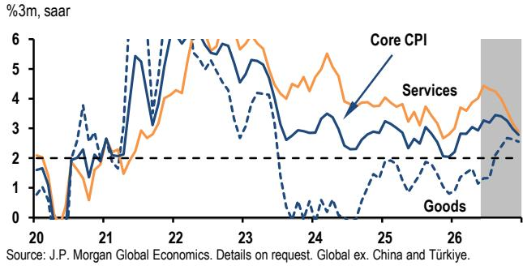

Amidst this uncertainty, we continue to take our lead on service price inflation from labor cost dynamics and signals of pricing power. Consistent with the broad easing in labor markets last year, wage inflation has moderated, but at 3.5% it still stands higher than the pace seen at the peak of the 2000s expansion. A full alignment of service-sector inflation with its pre-pandemic trend could thus remain elusive.

## Tightening pressures increase risk of financial stress

Core inflation is set to remain above central bank targets for a sixth straight year, with our forecasts anticipating US core PCE at $3.4\%$ (4Q/4Q basis), Euro area HICP at $2.5\%$ and EM ex. China and Türkiye is averaging $3.7\%$ . This year's core inflation surprises are sufficient to deliver hikes, which we

expect to continue even as falling oil prices reduce pressure outside the US relative to current market pricing. In the US, it is the interaction of elevated core inflation with a tightening labor market that will bring the Fed to hikes.

## Figure 12: Real policy rate

%; Nominal rate less 2y trailing core inflation  
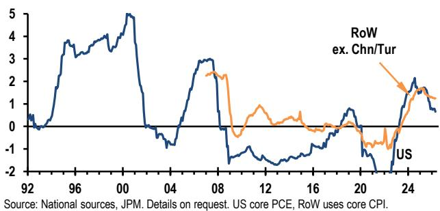

The expansion's resilience and supportive financial conditions are linked to the tolerance of central banks in the face of persistently elevated inflation. Global policy rates have fallen over the past two years with core inflation remaining close to $3\%$ . While real rates are above their post-GFC levels, they remain low relative to earlier episodes in which central banks have restrained demand to lower inflation (Figure 12). While our baseline forecast anticipates a broad tightening takes hold, the shallow adjustment anticipated by the Fed, ECB, and most other central banks will push global policy rates up by less than 30bp over the coming year. The threat that more action will be required to contain inflation in an environment of above-potential growth is material, particularly as labor markets tighten and views on $\mathbf{r}^*$ are likely to tilt higher. Past experience suggests that an unexpected reset of monetary policy expectations tends to generate financial stress in an otherwise healthy expansion.

The global economic outlook in summary

<table><tr><td rowspan="3"></td><td colspan="3">Real GDP</td><td colspan="6">Real GDP</td><td colspan="4">Consumer prices</td></tr><tr><td colspan="3">% over a year ago</td><td colspan="6">% over previous period, saar</td><td colspan="4">% over a year ago</td></tr><tr><td>2025</td><td>2026</td><td>2027</td><td>4Q25</td><td>1Q26</td><td>2Q26</td><td>3Q26</td><td>4Q26</td><td>1Q27</td><td>4Q25</td><td>2Q26</td><td>4Q26</td><td>2Q27</td></tr><tr><td>United States</td><td>2.1</td><td>2.1</td><td>2.0</td><td>0.5</td><td>2.1</td><td>3.0</td><td>1.5</td><td>1.8</td><td>2.3</td><td>2.7</td><td>3.9</td><td>3.8</td><td>2.2</td></tr><tr><td>Canada</td><td>1.9</td><td>0.4</td><td>1.5</td><td>-1.0</td><td>-0.1</td><td>1.0</td><td>1.4</td><td>1.4</td><td>1.7</td><td>2.2</td><td>2.6</td><td>1.8</td><td>1.3</td></tr><tr><td>Latin America</td><td>2.1</td><td>1.8</td><td>2.0</td><td>2.3</td><td>1.6</td><td>2.9</td><td>2.1</td><td>1.5</td><td>1.8</td><td>3.9</td><td>4.5</td><td>4.6</td><td>3.7</td></tr><tr><td>Argentina</td><td>4.4</td><td>3.2</td><td>3.2</td><td>4.7</td><td>3.0</td><td>5.5</td><td>4.0</td><td>3.0</td><td>2.8</td><td>31.8</td><td>32.8</td><td>29.4</td><td>20.5</td></tr><tr><td>Brazil</td><td>2.3</td><td>1.8</td><td>1.6</td><td>1.0</td><td>4.5</td><td>2.0</td><td>0.8</td><td>0.4</td><td>1.6</td><td>4.5</td><td>4.6</td><td>4.8</td><td>3.6</td></tr><tr><td>Chile</td><td>2.5</td><td>1.6</td><td>3.6</td><td>2.1</td><td>-1.1</td><td>4.5</td><td>4.1</td><td>3.5</td><td>1.5</td><td>3.4</td><td>4.0</td><td>3.8</td><td>3.4</td></tr><tr><td>Colombia</td><td>2.6</td><td>2.6</td><td>1.5</td><td>0.1</td><td>2.4</td><td>2.5</td><td>1.5</td><td>0.5</td><td>1.5</td><td>5.3</td><td>5.8</td><td>6.2</td><td>5.9</td></tr><tr><td>Ecuador</td><td>3.7</td><td>3.0</td><td>2.0</td><td>12.7</td><td>4.5</td><td>0.3</td><td>1.0</td><td>2.0</td><td>3.0</td><td>1.4</td><td>1.9</td><td>2.2</td><td>1.5</td></tr><tr><td>Mexico</td><td>0.5</td><td>1.0</td><td>1.7</td><td>2.9</td><td>-2.4</td><td>3.3</td><td>2.5</td><td>2.0</td><td>1.6</td><td>3.7</td><td>4.3</td><td>4.3</td><td>3.6</td></tr><tr><td>Peru</td><td>3.4</td><td>3.0</td><td>2.9</td><td>2.2</td><td>2.4</td><td>2.5</td><td>4.0</td><td>2.5</td><td>3.5</td><td>1.4</td><td>4.2</td><td>4.2</td><td>2.8</td></tr><tr><td>Uruguay</td><td>1.8</td><td>1.1</td><td>1.4</td><td>0.8</td><td>3.2</td><td>0.4</td><td>0.0</td><td>1.0</td><td>1.3</td><td>4.0</td><td>3.1</td><td>4.3</td><td>5.1</td></tr><tr><td>Asia/Pacific</td><td>4.5</td><td>4.2</td><td>3.7</td><td>5.1</td><td>5.9</td><td>3.0</td><td>3.3</td><td>3.4</td><td>4.0</td><td>1.2</td><td>2.0</td><td>2.4</td><td>2.0</td></tr><tr><td>Japan</td><td>1.1</td><td>0.6</td><td>0.7</td><td>0.7</td><td>1.8</td><td>0.2</td><td>1.0</td><td>0.8</td><td>0.8</td><td>2.7</td><td>1.5</td><td>3.1</td><td>3.7</td></tr><tr><td>Australia</td><td>2.0</td><td>2.0</td><td>1.8</td><td>3.5</td><td>1.1</td><td>1.6</td><td>1.5</td><td>1.9</td><td>1.5</td><td>3.6</td><td>4.3</td><td>4.2</td><td>3.6</td></tr><tr><td>New Zealand</td><td>0.2</td><td>2.1</td><td>2.3</td><td>1.8</td><td>3.2</td><td>1.2</td><td>3.4</td><td>1.2</td><td>4.0</td><td>3.1</td><td>3.9</td><td>3.5</td><td>2.3</td></tr><tr><td>EM Asia</td><td>5.2</td><td>4.9</td><td>4.2</td><td>5.8</td><td>6.7</td><td>3.5</td><td>3.7</td><td>3.9</td><td>4.6</td><td>0.9</td><td>2.0</td><td>2.1</td><td>1.7</td></tr><tr><td>China</td><td>5.0</td><td>4.7</td><td>4.0</td><td>5.2</td><td>6.7</td><td>3.3</td><td>3.5</td><td>3.7</td><td>4.5</td><td>0.6</td><td>1.2</td><td>1.0</td><td>0.7</td></tr><tr><td>India</td><td>7.7</td><td>6.5</td><td>6.3</td><td>7.5</td><td>8.0</td><td>5.1</td><td>5.0</td><td>6.2</td><td>6.3</td><td>0.8</td><td>4.1</td><td>5.6</td><td>5.5</td></tr><tr><td>Ex China/India</td><td>4.0</td><td>4.7</td><td>3.6</td><td>6.6</td><td>6.0</td><td>3.1</td><td>3.4</td><td>3.2</td><td>3.8</td><td>1.8</td><td>2.9</td><td>3.4</td><td>2.4</td></tr><tr><td>Hong Kong</td><td>3.6</td><td>3.4</td><td>2.9</td><td>4.3</td><td>12.2</td><td>3.0</td><td>2.8</td><td>2.8</td><td>3.0</td><td>1.3</td><td>1.6</td><td>1.7</td><td>1.6</td></tr><tr><td>Indonesia</td><td>5.1</td><td>4.7</td><td>4.9</td><td>5.7</td><td>5.7</td><td>3.6</td><td>3.0</td><td>2.6</td><td>6.2</td><td>2.8</td><td>2.9</td><td>3.6</td><td>2.7</td></tr><tr><td>Korea</td><td>1.1</td><td>3.7</td><td>2.7</td><td>-0.4</td><td>7.5</td><td>2.0</td><td>4.0</td><td>3.0</td><td>2.5</td><td>2.4</td><td>3.0</td><td>3.5</td><td>2.6</td></tr><tr><td>Malaysia</td><td>5.2</td><td>4.6</td><td>4.1</td><td>5.9</td><td>1.7</td><td>7.0</td><td>5.0</td><td>4.5</td><td>4.0</td><td>1.4</td><td>2.0</td><td>2.1</td><td>1.8</td></tr><tr><td>Philippines</td><td>4.4</td><td>4.0</td><td>5.6</td><td>2.4</td><td>3.8</td><td>4.9</td><td>5.7</td><td>8.2</td><td>4.1</td><td>1.7</td><td>6.9</td><td>8.1</td><td>4.9</td></tr><tr><td>Singapore</td><td>5.0</td><td>4.3</td><td>2.7</td><td>5.2</td><td>3.9</td><td>3.0</td><td>2.0</td><td>2.0</td><td>3.0</td><td>1.2</td><td>1.9</td><td>2.4</td><td>1.9</td></tr><tr><td>Taiwan</td><td>8.8</td><td>9.9</td><td>3.7</td><td>28.7</td><td>6.9</td><td>4.5</td><td>3.2</td><td>3.2</td><td>4.0</td><td>1.3</td><td>2.1</td><td>2.2</td><td>1.7</td></tr><tr><td>Thailand</td><td>2.4</td><td>2.1</td><td>2.5</td><td>7.6</td><td>2.7</td><td>-1.1</td><td>1.2</td><td>2.0</td><td>3.2</td><td>-0.5</td><td>2.8</td><td>3.9</td><td>1.4</td></tr><tr><td>Western Europe</td><td>1.5</td><td>0.5</td><td>1.2</td><td>0.7</td><td>-0.3</td><td>0.5</td><td>1.0</td><td>1.2</td><td>1.3</td><td>2.3</td><td>3.0</td><td>3.1</td><td>2.2</td></tr><tr><td>Euro area</td><td>1.5</td><td>0.3</td><td>1.2</td><td>0.7</td><td>-0.9</td><td>0.3</td><td>1.0</td><td>1.3</td><td>1.3</td><td>2.1</td><td>3.1</td><td>3.1</td><td>2.0</td></tr><tr><td>Germany</td><td>0.3</td><td>0.8</td><td>1.4</td><td>1.0</td><td>1.4</td><td>0.3</td><td>1.3</td><td>1.5</td><td>1.5</td><td>2.3</td><td>2.7</td><td>2.5</td><td>2.0</td></tr><tr><td>France</td><td>0.9</td><td>0.5</td><td>1.0</td><td>0.8</td><td>-0.4</td><td>0.0</td><td>0.5</td><td>1.0</td><td>1.0</td><td>0.8</td><td>2.6</td><td>2.8</td><td>1.6</td></tr><tr><td>Italy</td><td>0.7</td><td>0.6</td><td>0.5</td><td>1.2</td><td>1.1</td><td>-0.3</td><td>0.3</td><td>0.5</td><td>0.5</td><td>1.2</td><td>3.1</td><td>3.9</td><td>1.7</td></tr><tr><td>Spain</td><td>2.8</td><td>2.2</td><td>1.6</td><td>3.1</td><td>2.5</td><td>1.5</td><td>1.5</td><td>1.5</td><td>1.5</td><td>3.1</td><td>3.6</td><td>3.4</td><td>2.7</td></tr><tr><td>Norway</td><td>1.7</td><td>1.0</td><td>1.6</td><td>0.6</td><td>0.6</td><td>1.4</td><td>1.8</td><td>1.8</td><td>1.8</td><td>3.1</td><td>3.3</td><td>3.7</td><td>2.6</td></tr><tr><td>Sweden</td><td>1.7</td><td>2.1</td><td>2.0</td><td>3.4</td><td>-0.6</td><td>4.0</td><td>2.0</td><td>2.3</td><td>2.0</td><td>0.5</td><td>0.3</td><td>0.9</td><td>2.0</td></tr><tr><td>United Kingdom</td><td>1.4</td><td>1.2</td><td>1.0</td><td>0.6</td><td>2.5</td><td>1.0</td><td>0.5</td><td>1.0</td><td>1.2</td><td>3.4</td><td>2.8</td><td>3.3</td><td>3.0</td></tr><tr><td>EMEA EM</td><td>2.1</td><td>2.0</td><td>2.9</td><td>2.0</td><td>-0.6</td><td>4.2</td><td>3.2</td><td>2.8</td><td>2.7</td><td>10.6</td><td>10.5</td><td>9.6</td><td>8.0</td></tr><tr><td>Czech Republic</td><td>2.5</td><td>2.1</td><td>2.2</td><td>2.9</td><td>0.6</td><td>2.5</td><td>2.0</td><td>2.5</td><td>2.1</td><td>2.2</td><td>2.2</td><td>2.2</td><td>2.0</td></tr><tr><td>Hungary</td><td>0.4</td><td>1.9</td><td>2.7</td><td>0.7</td><td>3.2</td><td>1.8</td><td>1.9</td><td>2.5</td><td>3.0</td><td>3.8</td><td>1.9</td><td>2.4</td><td>3.2</td></tr><tr><td>Israel</td><td>2.9</td><td>3.7</td><td>4.1</td><td>2.9</td><td>-3.3</td><td>10.0</td><td>5.0</td><td>3.8</td><td>3.5</td><td>2.5</td><td>1.8</td><td>1.7</td><td>1.6</td></tr><tr><td>Poland</td><td>3.6</td><td>3.4</td><td>2.9</td><td>4.1</td><td>2.4</td><td>4.3</td><td>3.3</td><td>3.0</td><td>2.8</td><td>2.6</td><td>3.1</td><td>3.7</td><td>3.6</td></tr><tr><td>Romania</td><td>0.7</td><td>0.0</td><td>3.0</td><td>-7.4</td><td>0.0</td><td>3.4</td><td>3.6</td><td>3.2</td><td>2.8</td><td>9.7</td><td>10.6</td><td>5.4</td><td>4.4</td></tr><tr><td>Russia</td><td>1.0</td><td>1.0</td><td>1.9</td><td>3.1</td><td>-3.1</td><td>4.3</td><td>2.0</td><td>1.8</td><td>1.5</td><td>6.6</td><td>5.5</td><td>5.3</td><td>4.4</td></tr><tr><td>South Africa</td><td>1.1</td><td>1.1</td><td>1.4</td><td>1.5</td><td>2.2</td><td>0.0</td><td>1.5</td><td>1.2</td><td>1.6</td><td>3.6</td><td>4.5</td><td>4.1</td><td>2.9</td></tr><tr><td>Türkiye</td><td>3.6</td><td>3.0</td><td>4.6</td><td>1.5</td><td>0.5</td><td>4.0</td><td>5.5</td><td>4.6</td><td>4.5</td><td>31.6</td><td>32.5</td><td>29.8</td><td>24.3</td></tr><tr><td>Global</td><td>2.8</td><td>2.5</td><td>2.5</td><td>2.3</td><td>2.7</td><td>2.5</td><td>2.1</td><td>2.3</td><td>2.6</td><td>2.7</td><td>3.5</td><td>3.5</td><td>2.5</td></tr><tr><td>Developed markets</td><td>1.8</td><td>1.4</td><td>1.6</td><td>0.6</td><td>1.1</td><td>1.8</td><td>1.3</td><td>1.5</td><td>1.8</td><td>2.6</td><td>3.4</td><td>3.4</td><td>2.3</td></tr><tr><td>Emerging markets</td><td>4.2</td><td>4.0</td><td>3.7</td><td>4.7</td><td>4.9</td><td>3.5</td><td>3.4</td><td>3.4</td><td>3.9</td><td>2.8</td><td>3.6</td><td>3.6</td><td>2.9</td></tr><tr><td>Emerging ex China</td><td>3.6</td><td>3.5</td><td>3.4</td><td>4.3</td><td>3.3</td><td>3.7</td><td>3.3</td><td>3.2</td><td>3.4</td><td>4.7</td><td>5.7</td><td>5.9</td><td>4.9</td></tr><tr><td>Global — PPP weighted</td><td>3.3</td><td>2.9</td><td>2.9</td><td>3.1</td><td>3.2</td><td>2.8</td><td>2.5</td><td>2.6</td><td>3.0</td><td>2.9</td><td>3.8</td><td>3.9</td><td>3.0</td></tr></table>

Source: Government agencies and JPM Global Economics. Details on request. Note: For some emerging economies seasonally adjusted GDP data are estimated by JPM. Underline indicates beginning of JPM forecasts. Unless noted, concurrent nominal GDP weights calculated with current FX rates are used in computing our global and regional aggregates. Regional CPI aggregates exclude Argentina and Ecuador. Any long-form nomenclature for references to China; Hong Kong; and Taiwan within this research material is Mainland China; Hong Kong SAR (China) and Taiwan (China).

G-3 economic outlook detail

<table><tr><td rowspan="2"></td><td rowspan="2">2025</td><td rowspan="2">2026</td><td rowspan="2">2027</td><td colspan="4">2026</td><td colspan="2">2027</td></tr><tr><td>1Q</td><td>2Q</td><td>3Q</td><td>4Q</td><td>1Q</td><td>2Q</td></tr><tr><td colspan="10">United States</td></tr><tr><td>Real GDP</td><td>2.1</td><td>2.2</td><td>2.0</td><td>2.1</td><td>3.0</td><td>1.5</td><td>1.8</td><td>2.3</td><td>2.3</td></tr><tr><td>Private consumption</td><td>2.6</td><td>1.7</td><td>1.7</td><td>0.5</td><td>2.0</td><td>1.4</td><td>1.5</td><td>2.0</td><td>2.0</td></tr><tr><td>Equipment investment</td><td>8.3</td><td>10.0</td><td>6.7</td><td>15.8</td><td>12.0</td><td>10.0</td><td>10.0</td><td>5.0</td><td>5.0</td></tr><tr><td>Non-residential construction</td><td>-5.3</td><td>-4.2</td><td>0.5</td><td>-4.7</td><td>-1.5</td><td>-2.0</td><td>-2.0</td><td>2.0</td><td>2.0</td></tr><tr><td>Intellectual property products</td><td>5.6</td><td>8.6</td><td>5.5</td><td>13.8</td><td>7.0</td><td>7.0</td><td>7.0</td><td>5.0</td><td>5.0</td></tr><tr><td>Residential construction</td><td>-2.2</td><td>-3.5</td><td>3.0</td><td>-7.8</td><td>-0.5</td><td>1.0</td><td>1.0</td><td>4.0</td><td>6.0</td></tr><tr><td>Inventory change ($ bn saar)</td><td>28.5</td><td>21.4</td><td>37.7</td><td>-16.7</td><td>38.5</td><td>30.6</td><td>33.1</td><td>37.8</td><td>38.8</td></tr><tr><td>Government spending</td><td>1.1</td><td>0.8</td><td>1.5</td><td>4.4</td><td>1.4</td><td>1.4</td><td>1.4</td><td>1.5</td><td>1.5</td></tr><tr><td>Exports of goods and services</td><td>1.6</td><td>5.4</td><td>2.2</td><td>10.9</td><td>10.0</td><td>2.5</td><td>2.5</td><td>1.5</td><td>1.5</td></tr><tr><td>Imports of goods and services</td><td>2.7</td><td>3.1</td><td>4.3</td><td>11.8</td><td>12.0</td><td>6.0</td><td>6.0</td><td>3.0</td><td>3.0</td></tr><tr><td>Domestic final sales contribution</td><td>2.4</td><td>2.1</td><td>2.3</td><td>2.2</td><td>2.8</td><td>2.3</td><td>2.4</td><td>2.5</td><td>2.5</td></tr><tr><td>Inventories contribution</td><td>-0.1</td><td>0.0</td><td>0.1</td><td>0.2</td><td>0.9</td><td>-0.1</td><td>0.0</td><td>0.1</td><td>0.0</td></tr><tr><td>Net trade contribution</td><td>-0.1</td><td>0.2</td><td>-0.3</td><td>-0.4</td><td>-0.7</td><td>-0.6</td><td>-0.7</td><td>-0.3</td><td>-0.3</td></tr><tr><td>Consumer prices (%oya)</td><td>2.7</td><td>3.6</td><td>2.5</td><td>2.7</td><td>3.9</td><td>3.8</td><td>3.8</td><td>3.3</td><td>2.2</td></tr><tr><td>Excluding food and energy (%oya)</td><td>2.9</td><td>2.8</td><td>2.7</td><td>2.5</td><td>2.8</td><td>2.7</td><td>3.0</td><td>2.9</td><td>2.7</td></tr><tr><td>Core PCE deflator (%oya)</td><td>2.8</td><td>3.3</td><td>2.6</td><td>3.1</td><td>3.4</td><td>3.4</td><td>3.4</td><td>2.9</td><td>2.6</td></tr><tr><td>Federal budget balance (% of GDP, FY)</td><td>-5.8</td><td>-6.3</td><td>-5.8</td><td></td><td></td><td></td><td></td><td></td><td></td></tr><tr><td>Personal saving rate (%)</td><td>4.6</td><td>2.9</td><td>2.5</td><td>3.9</td><td>2.9</td><td>2.5</td><td>2.4</td><td>2.6</td><td>2.5</td></tr><tr><td>Unemployment rate (%)</td><td>4.3</td><td>4.2</td><td>4.0</td><td>4.3</td><td>4.3</td><td>4.2</td><td>4.1</td><td>4.0</td><td>4.0</td></tr><tr><td>Industrial production, manufacturing</td><td>0.8</td><td>0.9</td><td>1.1</td><td>1.4</td><td>3.2</td><td>1.0</td><td>1.0</td><td>1.0</td><td>1.0</td></tr><tr><td colspan="10">Euro area</td></tr><tr><td>Real GDP</td><td>1.5</td><td>0.3</td><td>1.2</td><td>-0.9</td><td>0.3</td><td>1.0</td><td>1.3</td><td>1.3</td><td>1.5</td></tr><tr><td>Private consumption</td><td>1.5</td><td>0.7</td><td>1.2</td><td>0.8</td><td>-0.5</td><td>0.5</td><td>1.3</td><td>1.5</td><td>1.5</td></tr><tr><td>Capital investment</td><td>3.1</td><td>1.5</td><td>2.6</td><td>-1.3</td><td>2.0</td><td>3.5</td><td>3.5</td><td>2.5</td><td>2.0</td></tr><tr><td>Government consumption</td><td>1.4</td><td>1.9</td><td>0.9</td><td>2.2</td><td>1.3</td><td>1.0</td><td>1.0</td><td>0.8</td><td>0.8</td></tr><tr><td>Exports of goods and services</td><td>2.3</td><td>0.3</td><td>2.6</td><td>-0.6</td><td>1.5</td><td>2.5</td><td>2.8</td><td>2.8</td><td>2.8</td></tr><tr><td>Imports of goods and services</td><td>3.6</td><td>2.2</td><td>2.7</td><td>1.9</td><td>2.0</td><td>2.8</td><td>2.8</td><td>2.8</td><td>2.8</td></tr><tr><td>Domestic final sales contribution</td><td>1.7</td><td>1.1</td><td>1.4</td><td>0.6</td><td>0.4</td><td>1.2</td><td>1.6</td><td>1.5</td><td>1.4</td></tr><tr><td>Inventories contribution</td><td>0.3</td><td>0.1</td><td>-0.2</td><td>-0.4</td><td>0.0</td><td>-0.2</td><td>-0.5</td><td>-0.3</td><td>0.0</td></tr><tr><td>Net trade contribution</td><td>-0.5</td><td>-0.9</td><td>0.1</td><td>-1.2</td><td>-0.2</td><td>0.0</td><td>0.1</td><td>0.1</td><td>0.1</td></tr><tr><td>Consumer prices (HICP, %oya)</td><td>2.1</td><td>2.8</td><td>2.1</td><td>2.0</td><td>3.1</td><td>3.0</td><td>3.1</td><td>2.8</td><td>2.0</td></tr><tr><td>ex food, alcohol and energy</td><td>2.4</td><td>2.4</td><td>2.3</td><td>2.3</td><td>2.4</td><td>2.4</td><td>2.5</td><td>2.5</td><td>2.2</td></tr><tr><td>General govt. budget balance (% of GDP, FY)</td><td>-2.7</td><td>-3.1</td><td>-2.8</td><td></td><td></td><td></td><td></td><td></td><td></td></tr><tr><td>Unemployment rate (%)</td><td>6.4</td><td>6.3</td><td>6.1</td><td>6.2</td><td>6.4</td><td>6.4</td><td>6.4</td><td>6.3</td><td>6.2</td></tr><tr><td>Industrial production</td><td>1.7</td><td>-0.1</td><td>2.6</td><td>-3.2</td><td>2.0</td><td>2.5</td><td>3.0</td><td>3.0</td><td>2.5</td></tr><tr><td colspan="10">Japan</td></tr><tr><td>Real GDP</td><td>1.1</td><td>0.6</td><td>0.7</td><td>1.8</td><td>0.2</td><td>1.0</td><td>0.8</td><td>0.8</td><td>0.7</td></tr><tr><td>Private consumption</td><td>1.3</td><td>1.1</td><td>0.6</td><td>1.4</td><td>1.2</td><td>0.6</td><td>0.6</td><td>0.6</td><td>0.6</td></tr><tr><td>Business investment</td><td>2.1</td><td>0.7</td><td>1.0</td><td>-2.8</td><td>1.0</td><td>1.0</td><td>1.0</td><td>1.0</td><td>1.0</td></tr><tr><td>Residential construction</td><td>-2.4</td><td>0.5</td><td>0.5</td><td>3.7</td><td>0.5</td><td>0.5</td><td>0.5</td><td>0.5</td><td>0.5</td></tr><tr><td>Public investment</td><td>-0.4</td><td>1.4</td><td>1.0</td><td>6.1</td><td>1.0</td><td>1.0</td><td>1.0</td><td>1.0</td><td>1.0</td></tr><tr><td>Government consumption</td><td>0.9</td><td>1.9</td><td>1.5</td><td>1.3</td><td>4.0</td><td>2.0</td><td>2.0</td><td>1.0</td><td>1.0</td></tr><tr><td>Exports of goods and services</td><td>2.5</td><td>0.9</td><td>0.6</td><td>7.4</td><td>-4.0</td><td>0.0</td><td>1.0</td><td>1.0</td><td>1.0</td></tr><tr><td>Imports of goods and services</td><td>3.8</td><td>0.8</td><td>0.9</td><td>1.7</td><td>0.0</td><td>1.0</td><td>1.0</td><td>1.0</td><td>1.0</td></tr><tr><td>Domestic final sales contribution</td><td>1.1</td><td>1.2</td><td>0.9</td><td>0.9</td><td>1.7</td><td>1.0</td><td>1.0</td><td>0.8</td><td>0.8</td></tr><tr><td>Inventories contribution</td><td>0.1</td><td>-0.6</td><td>-0.1</td><td>-0.1</td><td>-0.7</td><td>0.2</td><td>-0.2</td><td>0.0</td><td>-0.1</td></tr><tr><td>Net trade contribution</td><td>-0.2</td><td>0.0</td><td>-0.1</td><td>1.0</td><td>-0.7</td><td>-0.2</td><td>0.0</td><td>0.0</td><td>0.0</td></tr><tr><td>Consumer prices (%oya)</td><td>3.2</td><td>2.1</td><td>3.6</td><td>1.4</td><td>1.5</td><td>2.2</td><td>3.1</td><td>4.2</td><td>3.7</td></tr><tr><td>ex food and energy</td><td>1.5</td><td>1.9</td><td>3.0</td><td>1.4</td><td>1.2</td><td>2.1</td><td>2.8</td><td>3.1</td><td>3.1</td></tr><tr><td>General govt. net lending (% of GDP, CY)</td><td>-6.7</td><td>-6.9</td><td>-6.6</td><td></td><td></td><td></td><td></td><td></td><td></td></tr><tr><td>Unemployment rate (%)</td><td>2.5</td><td>2.5</td><td>2.5</td><td>2.7</td><td>2.5</td><td>2.5</td><td>2.5</td><td>2.5</td><td>2.5</td></tr><tr><td>Industrial production</td><td>0.1</td><td>2.3</td><td>1.2</td><td>10.3</td><td>0.5</td><td>1.2</td><td>1.2</td><td>1.2</td><td>1.2</td></tr><tr><td>Memo: Global industrial production</td><td>..</td><td>..</td><td>..</td><td>4.0</td><td>1.7</td><td>2.7</td><td>2.1</td><td>2.6</td><td>1.9</td></tr><tr><td>%oya</td><td>2.3</td><td>2.1</td><td>2.2</td><td>1.9</td><td>1.9</td><td>2.2</td><td>2.6</td><td>2.3</td><td>2.3</td></tr></table>

Source: Government agencies and JPM Global Economics. Details on request.

Global Central Bank Watch

<table><tr><td rowspan="2"></td><td rowspan="2">Official rate</td><td rowspan="2">Current rate (%pa)</td><td colspan="2">4-qtr change (bp)</td><td rowspan="2">Last change</td><td rowspan="2">Next mtg</td><td rowspan="2">Forecast next change</td><td colspan="5">Forecast (%pa)</td></tr><tr><td>Last</td><td>Next</td><td>Jun 26</td><td>Sep 26</td><td>Dec 26</td><td>Mar 27</td><td>Jun 27</td></tr><tr><td>Global</td><td></td><td>3.97</td><td>-53</td><td>-10</td><td></td><td></td><td></td><td>3.97</td><td>3.98</td><td>3.98</td><td>3.93</td><td>3.86</td></tr><tr><td>excluding US</td><td></td><td>4.06</td><td>-40</td><td>-14</td><td></td><td></td><td></td><td>4.06</td><td>4.08</td><td>4.08</td><td>4.01</td><td>3.91</td></tr><tr><td>Developed</td><td></td><td>3.08</td><td>-36</td><td>11</td><td></td><td></td><td></td><td>3.08</td><td>3.16</td><td>3.19</td><td>3.19</td><td>3.19</td></tr><tr><td>Emerging</td><td></td><td>5.27</td><td>-79</td><td>-42</td><td></td><td></td><td></td><td>5.28</td><td>5.19</td><td>5.14</td><td>5.02</td><td>4.85</td></tr><tr><td>Latin America</td><td></td><td>9.96</td><td>-74</td><td>-74</td><td></td><td></td><td></td><td>10.02</td><td>9.81</td><td>9.61</td><td>9.42</td><td>9.22</td></tr><tr><td>EMEA EM</td><td></td><td>14.80</td><td>-413</td><td>-190</td><td></td><td></td><td></td><td>14.80</td><td>14.59</td><td>14.30</td><td>13.61</td><td>12.90</td></tr><tr><td>EM Asia</td><td></td><td>2.33</td><td>-6</td><td>-3</td><td></td><td></td><td></td><td>2.33</td><td>2.29</td><td>2.32</td><td>2.34</td><td>2.30</td></tr><tr><td>The Americas</td><td></td><td>4.52</td><td>-73</td><td>-10</td><td></td><td></td><td></td><td>4.53</td><td>4.50</td><td>4.47</td><td>4.44</td><td>4.42</td></tr><tr><td>United States</td><td>Fed funds</td><td>3.75</td><td>-75</td><td>0</td><td>10 Dec 25 (-25bp)</td><td>29 Jul 26</td><td>Sep 27 (+25bp)</td><td>3.75</td><td>3.75</td><td>3.75</td><td>3.75</td><td>3.75</td></tr><tr><td>Canada</td><td>O/N rate</td><td>2.25</td><td>-50</td><td>0</td><td>29 Oct 25 (-25bp)</td><td>15 Jul 26</td><td>On hold</td><td>2.25</td><td>2.25</td><td>2.25</td><td>2.25</td><td>2.25</td></tr><tr><td>Brazil</td><td>SELIC O/N</td><td>14.25</td><td>-75</td><td>-200</td><td>17 Jun 26 (-25bp)</td><td>5 Aug 26</td><td>Aug 26 (-25bp)</td><td>14.25</td><td>13.75</td><td>13.25</td><td>12.75</td><td>12.25</td></tr><tr><td>Mexico</td><td>Repo rate</td><td>6.50</td><td>-147</td><td>0</td><td>7 May 26 (-25bp)</td><td>25 Jun 26</td><td>On hold</td><td>6.50</td><td>6.50</td><td>6.50</td><td>6.50</td><td>6.50</td></tr><tr><td>Chile</td><td>Disc rate</td><td>4.50</td><td>-50</td><td>50</td><td>16 Dec 25 (-25bp)</td><td>28 Jul 26</td><td>1Q27 (+25bp)</td><td>4.50</td><td>4.50</td><td>4.50</td><td>4.75</td><td>5.00</td></tr><tr><td>Colombia</td><td>Repo rate</td><td>11.25</td><td>200</td><td>50</td><td>31 Mar 26 (+100bp)</td><td>30 Jun 26</td><td>Jun 26 (+50bp)</td><td>12.00</td><td>12.00</td><td>12.00</td><td>12.00</td><td>11.75</td></tr><tr><td>Peru</td><td>Reference</td><td>4.25</td><td>-25</td><td>75</td><td>11 Sep 25 (-25bp)</td><td>9 Jul 26</td><td>7 Oct 26 (+25bp)</td><td>4.25</td><td>4.25</td><td>4.50</td><td>4.75</td><td>5.00</td></tr><tr><td>Europe/Africa</td><td></td><td>5.36</td><td>-87</td><td>-28</td><td></td><td></td><td></td><td>5.36</td><td>5.46</td><td>5.43</td><td>5.28</td><td>5.08</td></tr><tr><td>Euro area</td><td>Depo rate</td><td>2.25</td><td>25</td><td>25</td><td>11 Jun 26 (+25bp)</td><td>23 Jul 26</td><td>Sep 26 (+25bp)</td><td>2.25</td><td>2.50</td><td>2.50</td><td>2.50</td><td>2.50</td></tr><tr><td>United Kingdom</td><td>Bank rate</td><td>3.75</td><td>-50</td><td>0</td><td>18 Dec 25 (-25bp)</td><td>30 Jul 26</td><td>Nov 26 (+25bp)</td><td>3.75</td><td>3.75</td><td>4.00</td><td>4.00</td><td>3.75</td></tr><tr><td>Norway</td><td>Dep rate</td><td>4.25</td><td>0</td><td>0</td><td>7 May 26 (+25bp)</td><td>13 Aug 26</td><td>Sep 26 (+25bp)</td><td>4.25</td><td>4.50</td><td>4.50</td><td>4.50</td><td>4.25</td></tr><tr><td>Sweden</td><td>Repo rate</td><td>1.75</td><td>-25</td><td>25</td><td>23 Sep 25 (-25bp)</td><td>20 Aug 26</td><td>Dec 26 (+25bp)</td><td>1.75</td><td>1.75</td><td>2.00</td><td>2.00</td><td>2.00</td></tr><tr><td>Czech Republic</td><td>2-wk repo</td><td>3.75</td><td>25</td><td>25</td><td>18 Jun 26 (+25bp)</td><td>6 Aug 26</td><td>Aug 26 (+25bp)</td><td>3.75</td><td>4.00</td><td>4.00</td><td>4.00</td><td>4.00</td></tr><tr><td>Hungary</td><td>Base rate</td><td>6.00</td><td>-50</td><td>-125</td><td>23 Jun 26 (-25bp)</td><td>21 Jul 26</td><td>Jul 26 (-25bp)</td><td>6.00</td><td>5.25</td><td>5.00</td><td>4.75</td><td>4.75</td></tr><tr><td>Israel</td><td>Base rate</td><td>3.75</td><td>-75</td><td>-75</td><td>25 May 26 (-25bp)</td><td>6 Jul 26</td><td>Jul 26 (-25bp)</td><td>3.75</td><td>3.25</td><td>3.00</td><td>3.00</td><td>3.00</td></tr><tr><td>Poland</td><td>7-day interv</td><td>3.75</td><td>-125</td><td>0</td><td>4 Mar 26 (-25bp)</td><td>8 Jul 26</td><td>On hold</td><td>3.75</td><td>3.75</td><td>3.75</td><td>3.75</td><td>3.75</td></tr><tr><td>Romania</td><td>Base rate</td><td>6.50</td><td>0</td><td>-25</td><td>7 Aug 24 (-25bp)</td><td>8 Jul 26</td><td>May 27 (-25bp)</td><td>6.50</td><td>6.50</td><td>6.50</td><td>6.50</td><td>6.25</td></tr><tr><td>Russia</td><td>Key pol rate</td><td>14.25</td><td>-575</td><td>-275</td><td>19 Jun 26 (-25bp)</td><td>24 Jul 26</td><td>Jul 26 (-25bp)</td><td>14.25</td><td>13.75</td><td>13.00</td><td>12.25</td><td>11.50</td></tr><tr><td>South Africa</td><td>Repo rate</td><td>7.00</td><td>-25</td><td>0</td><td>28 May 26 (+25bp)</td><td>23 Jul 26</td><td>Jul 26 (+25bp)</td><td>7.00</td><td>7.25</td><td>7.25</td><td>7.25</td><td>7.00</td></tr><tr><td>Türkiye</td><td>1-wk repo</td><td>37.00</td><td>-900</td><td>-400</td><td>22 Jan 26 (-100bp)</td><td>23 Jul 26</td><td>21 Jan 27 (-100bp)</td><td>37.00</td><td>37.00</td><td>37.00</td><td>35.00</td><td>33.00</td></tr><tr><td>Asia/Pacific</td><td></td><td>2.28</td><td>3</td><td>4</td><td></td><td></td><td></td><td>2.28</td><td>2.25</td><td>2.31</td><td>2.33</td><td>2.32</td></tr><tr><td>Australia</td><td>Cash rate</td><td>4.35</td><td>50</td><td>0</td><td>5 May 26 (+25bp)</td><td>11 Aug 26</td><td>Aug &#x27;27 (-25bp)</td><td>4.35</td><td>4.35</td><td>4.35</td><td>4.35</td><td>4.35</td></tr><tr><td>New Zealand</td><td>Cash rate</td><td>2.25</td><td>-100</td><td>100</td><td>26 Nov 25 (-25bp)</td><td>8 Jul 26</td><td>Jul 26 (+25bp)</td><td>2.25</td><td>2.75</td><td>3.00</td><td>3.25</td><td>3.25</td></tr><tr><td>Japan</td><td>O/N call rate</td><td>1.00</td><td>52</td><td>50</td><td>16 Jun 26 (+25bp)</td><td>31 Jul 26</td><td>Oct 26 (+25bp)</td><td>1.00</td><td>1.00</td><td>1.25</td><td>1.25</td><td>1.50</td></tr><tr><td>Hong Kong</td><td>Disc. wndw</td><td>4.00</td><td>-75</td><td>0</td><td>10 Dec 25 (-25bp)</td><td>-</td><td>Sep 27 (+25bp)</td><td>4.00</td><td>4.00</td><td>4.00</td><td>4.00</td><td>4.00</td></tr><tr><td>China</td><td>7-day rev repo</td><td>1.40</td><td>0</td><td>-20</td><td>7 May 25 (-10bp)</td><td>-</td><td>3Q 26 (-10bp)</td><td>1.40</td><td>1.30</td><td>1.30</td><td>1.30</td><td>1.20</td></tr><tr><td>Korea</td><td>Base rate</td><td>2.50</td><td>0</td><td>100</td><td>29 May 25 (-25bp)</td><td>16 Jul 26</td><td>Jul 26 (+25bp)</td><td>2.50</td><td>2.75</td><td>3.00</td><td>3.25</td><td>3.50</td></tr><tr><td>Indonesia</td><td>BI RRR</td><td>5.75</td><td>25</td><td>25</td><td>18 Jun 26 (+25bp)</td><td>22 Jul 26</td><td>Jul-26 (+25bp)</td><td>5.75</td><td>6.00</td><td>6.00</td><td>6.00</td><td>6.00</td></tr><tr><td>India</td><td>Repo rate $^{2}$ </td><td>5.25</td><td>-25</td><td>0</td><td>5 Dec 25 (-25bp)</td><td>5 Aug 26</td><td>On hold</td><td>5.25</td><td>5.25</td><td>5.25</td><td>5.25</td><td>5.25</td></tr><tr><td>Malaysia</td><td>O/N rate</td><td>2.75</td><td>-25</td><td>25</td><td>9 Jul 25 (-25bp)</td><td>9 Jul 26</td><td>On hold</td><td>2.75</td><td>2.75</td><td>3.00</td><td>3.00</td><td>3.00</td></tr><tr><td>Philippines</td><td>Rev repo</td><td>4.75</td><td>-50</td><td>125</td><td>18 Jun 26 (+25bp)</td><td>27 Aug 26</td><td>Aug 26 (+25bp)</td><td>4.75</td><td>5.00</td><td>5.50</td><td>5.75</td><td>6.00</td></tr><tr><td>Thailand</td><td>1-day repo</td><td>1.00</td><td>-75</td><td>0</td><td>25 Feb 26 (-25bp)</td><td>26 Aug 26</td><td>On hold</td><td>1.00</td><td>1.00</td><td>1.00</td><td>1.00</td><td>1.00</td></tr><tr><td>Taiwan</td><td>Official disc.</td><td>2.00</td><td>0</td><td>0</td><td>21 Mar 24 (+12.5bp)</td><td>17 Sep 26</td><td>On hold</td><td>2.00</td><td>2.00</td><td>2.00</td><td>2.00</td><td>2.00</td></tr></table>

Source: JPM.  
Aggregates are GDP-weighted averages.  
Any long-form nomenclature for references to China; Hong Kong; and Taiwan within this research material is Mainland China;  
Hong Kong SAR (China) and Taiwan (China).

Analysts' Compensation: The research analysts responsible for the preparation of this report receive compensation based upon various factors, including the quality and accuracy of research, client feedback, competitive factors, and overall firm revenues.

Other Disclosure: A contributor to this report has a family member who is a senior member of the Federal Reserve Board.

## Other Disclosures

JPM is a marketing name for investment banking businesses of JPM Chase & Co. and its subsidiaries and affiliates worldwide.

UK MIFID FICC research unbundling exemption: UK clients should refer to UK MIFID Research Unbundling exemption for details of JPM's implementation of the FICC research exemption and guidance on relevant FICC research categorisation.

Any long form nomenclature for references to China; Hong Kong; Taiwan; and Macau within this research material are Mainland China; Hong Kong SAR (China); Taiwan (China); and Macau SAR (China).

JPM may, from time to time, write on issuers or securities targeted by economic or financial sanctions imposed or administered by the governmental authorities of the U.S., EU, UK or other relevant jurisdictions (Sanctioned Securities). Nothing in this report is intended to be read or construed as encouraging, facilitating, promoting or otherwise approving investment or dealing in such Sanctioned Securities. Clients should be aware of their own legal and compliance obligations when making investment decisions.

Any digital or crypto assets discussed in this research report are subject to a rapidly changing regulatory landscape. For relevant regulatory advisories on crypto assets, including bitcoin and ether, please see https://www.JPM.com/disclosures/cryptoasset-disclosure.

The author(s) of this research report may not be licensed to carry on regulated activities in your jurisdiction and, if not licensed, do not hold themselves out as being able to do so.

Exchange-Traded Funds (ETFs): JPM Securities LLC (“JPMS”) acts as authorized participant for substantially all U.S.-listed ETFs. To the extent that any ETFs are mentioned in this report, JPMS may earn commissions and transaction-based compensation in connection with the distribution of those ETF shares and may earn fees for performing other trade-related services, such as securities lending to short sellers of the ETF shares. JPMS may also perform services for the ETFs themselves, including acting as a broker or dealer to the ETFs. In addition, affiliates of JPMS may perform services for the ETFs, including trust, custodial, administration, lending, index calculation and/or maintenance and other services.

Changes to Interbank Offered Rates (IBORs) and other benchmark rates: Certain interest rate benchmarks are, or may in the future become, subject to ongoing international, national and other regulatory guidance, reform and proposals for reform. For more information, please consult: https://www.JPM.com/global/disclosures/interbank\_offered\_rates

Private Bank Clients: Where you are receiving research as a client of the private banking businesses offered by JPM Chase & Co. and its subsidiaries (“JPM Private Bank”), research is provided to you by JPM Private Bank and not by any other division of JPM, including, but not limited to, the JPM Corporate and Investment Bank and its Global Research division.

Legal entity responsible for the production and distribution of research: The legal entity identified below the name of the Reg AC Research Analyst who authored this material is the legal entity responsible for the production of this research. Where multiple Reg AC Research Analysts authored this material with different legal entities identified below their names, these legal entities are jointly responsible for the production of this research. Where more than one legal entity is listed under an analyst's name, the first legal entity is responsible for the production unless stated otherwise. Research Analysts from various JPM affiliates may have contributed to the production of this material but may not be licensed to carry out regulated activities in your jurisdiction (and do not hold themselves out as being able to do so). Unless otherwise stated below in the legal entity disclosures, this material has been distributed by the legal entity responsible for production, or where more than one legal entity is listed under the analyst's name, the first legal entity will be responsible for distribution. If you have any queries, please contact the relevant Research Analyst in your jurisdiction or the entity in your jurisdiction that has distributed this research material.

## Legal Entities Disclosures and Country-/Region-Specific Disclosures:

Argentina: JPM Chase Bank N.A Sucursal Buenos Aires is regulated by Banco Central de la República Argentina (“BCRA”- Central Bank of Argentina) and Comisión Nacional de Valores (“CNV”- Argentinian Securities Commission - ALYC y AN Integral N°51).

Australia: JPM Securities Australia Limited (“JPMSAL”) (ABN 61 003 245 234/AFS Licence No: 238066) is regulated by the Australian Securities and Investments Commission and is a Market Participant of ASX Limited, a Clearing and Settlement Participant of ASX Clear Pty Limited and a Clearing Participant of ASX Clear (Futures) Pty Limited. This material is issued and distributed in Australia by or on behalf of JPMSAL only to "wholesale clients" (as defined in section 761G of the Corporations Act 2001). A list of all financial products covered can be found by visiting https://www.jpmm.com/research/disclosures. JPM seeks to cover companies of relevance to the domestic and international investor base across all Global Industry Classification Standard (GICS) sectors, as well as across a range of market capitalisation sizes. If applicable, in the course of conducting public side due diligence on the subject company(ies), the Research Analyst team may at times perform such diligence through corporate engagements such as site visits, discussions with company representatives, management presentations, etc. Research issued by JPMSAL has been prepared in accordance with JPM Australia’s Research Independence Policy which can be found at the following link: JPM Australia - Research Independence Policy.

Brazil: Banco JPM S.A. is regulated by the Comissao de Valores Mobiliarios (CVM) and by the Central Bank of Brazil. Ombudsman JPM: 0800-7700847 / 0800-7700810 (For Hearing Impaired) / ouvidoria.jp.morgan@jpmchase.com.

Canada: JPM Securities Canada Inc. is a registered investment dealer, regulated by the Canadian Investment Regulatory Organization and the Ontario Securities Commission and is the participating member on Canadian exchanges. This material is distributed in Canada by or on behalf of JPM Securities Canada Inc.

Chile: Inversiones JPM Limitada is an unregulated entity incorporated in Chile.

China: JPM Securities (China) Company Limited has been approved by CSRC to conduct the securities investment consultancy business.

Colombia: Banco JPM Colombia S.A. is supervised by the Superintendencia Financiera de Colombia (SFC). Any reference in this material to products or services offered abroad by entities other than the Bank in Colombia is included exclusively for descriptive purposes. Such references do not constitute, and should not be construed as, promotional activity or the provision of financial products or services within Colombian territory, as defined under applicable Colombian regulation.

Dubai International Financial Centre (DIFC): JPM Chase Bank, N.A., Dubai Branch is regulated by the Dubai Financial Services Authority (DFSA) and its registered address is Dubai International Financial Centre - The Gate, West Wing, Level 3 and 9 PO Box 506551, Dubai, UAE. This material has been distributed by JPM Chase Bank, N.A., Dubai Branch to persons regarded as professional clients or market counterparties as defined under the DFSA rules.

European Economic Area (EEA): Unless specified to the contrary, research is distributed in the EEA by JPM SE (“JPM SE”), which is authorised as a credit institution by the Federal Financial Supervisory Authority (Bundesanstalt für Finanzdienstleistungsaufsicht, BaFin) and jointly supervised by the BaFin, the German Central Bank (Deutsche Bundesbank) and the European Central Bank (ECB). JPM SE is a company headquartered in Frankfurt with registered address at TaunusTurm, Taunustor 1, Frankfurt am Main, 60310, Germany. The material has been distributed in the EEA to persons regarded as professional investors (or equivalent) pursuant to Art. 4 para. 1 no. 10 and Annex II of MiFID II and its respective implementation in their home jurisdictions (“EEA professional investors”). This material must not be acted on or relied on by persons who are not EEA professional investors. Any investment or investment activity to which this material relates is only available to EEA relevant persons and will be engaged in only with EEA relevant persons.

Hong Kong: JPM Securities (Asia Pacific) Limited (CE number AAJ321) is regulated by the Hong Kong Monetary Authority and the Securities and Futures Commission in Hong Kong, and JPM Broking (Hong Kong) Limited (CE number AAB027) is regulated by the Securities and Futures Commission in Hong Kong. JPM Chase Bank, N.A., Hong Kong Branch (CE Number AAL996) is regulated by the Hong Kong Monetary Authority and the Securities and Futures Commission, is organized under the laws of the United States with limited liability. Where the distribution of this material is a regulated activity in Hong Kong, the material is distributed in Hong Kong by or through JPM Securities (Asia Pacific) Limited and/or JPM Broking (Hong Kong) Limited.

India: JPM India Private Limited (Corporate Identity Number - U67120MH1992FTC068724), having its registered office at JPM Tower, Off. C.S.T. Road, Kalina, Santacruz - East, Mumbai – 400098, is registered with the Securities and Exchange Board of India (SEBI) as a 'Research Analyst' having registration number INH000001873. JPM India Private Limited is also registered with SEBI as a member of the National Stock Exchange of India Limited and the Bombay Stock Exchange Limited (SEBI Registration Number – INZ000239730) and as a Merchant Banker (SEBI Registration Number - MB/INM000002970). Telephone: 91-22-6157 3000, Facsimile: 91-22-6157 3990 and Website: http://www.jpmipl.com. JPM Chase Bank, N.A. - Mumbai Branch is licensed by the Reserve Bank of India (RBI) (Licence No. 53/Licence No. BY.4/94; SEBI - IN/CUS/014/ CDSL : IN-DP-CDSL-444-2008/ IN-DP-NSDL-285-2008/ INBI00000984/ INE231311239) as a Scheduled Commercial Bank in India, which is its primary license allowing it to carry on Banking business in India and other activities, which a Bank branch in India are permitted to undertake. For non-local research material, this material is not distributed in India by JPM India Private Limited. Compliance Officer: Ashutosh Sharma; ashutosh.j.sharma@jpmchase.com; +912261575002. Grievance Officer: Ramprasadh K, jpmipl.research.feedback@JPM.com; +912261573000. Registration granted by SEBI and certification from NISM in no way guarantee performance of the intermediary or provide any assurance of returns to investors. Please visit Terms and Conditions and Most Important Terms and Conditions (MITC). The annual Compliance audit report is available at http://www.jpmipl.com/#research.

Indonesia: PT JPM Sekuritas Indonesia is a member of the Indonesia Stock Exchange and is registered and supervised by the Otoritas Jasa Keuangan (OJK).

Korea: JPM Securities (Far East) Limited, Seoul Branch, is a member of the Korea Exchange (KRX). JPM Chase Bank, N.A., Seoul Branch, is licensed as a branch office of foreign bank (JPM Chase Bank, N.A.) in Korea. Both entities are regulated by the Financial Services Commission (FSC) and the Financial Supervisory Service (FSS). For non-macro research material, the material is distributed in Korea by or through JPM Securities (Far East) Limited, Seoul Branch.

Japan: JPM Securities Japan Co., Ltd. and JPM Chase Bank, N.A., Tokyo Branch are regulated by the Financial Services Agency in Japan.

Malaysia: This material is issued and distributed in Malaysia by JPM Securities (Malaysia) Sdn Bhd (18146-X), which is a Participating Organization of Bursa Malaysia Berhad and holds a Capital Markets Services License issued by the Securities Commission in Malaysia.

Mexico: JPM Casa de Bolsa, S.A. de C.V., JPM Grupo Financiero is member of the Mexican Stock Exchange (“Bolsa Mexicana

de Valores") and the Institutional Stock Exchange ("Bolsa Institucional de Valores"), and it is authorized to act as a broker dealer by the National Banking and Securities Exchange Commission ("Comisión Nacional Bancaria y de Valores").

New Zealand: This material is issued and distributed by JPMSAL in New Zealand only to "wholesale clients" (as defined in the Financial Markets Conduct Act 2013). JPMSAL is registered as a Financial Service Provider under the Financial Service providers (Registration and Dispute Resolution) Act of 2008.

Philippines: JPM Securities Philippines Inc. is a Trading Participant of the Philippine Stock Exchange and a member of the Securities Clearing Corporation of the Philippines and the Securities Investor Protection Fund. It is regulated by the Securities and Exchange Commission.

Singapore: This material is issued and distributed in Singapore by or through JPM Securities Singapore Private Limited (JPMSS) [MDDI (P) 057/08/2025 and Co. Reg. No.: 199405335R], which is a member of the Singapore Exchange Securities Trading Limited, and/or JPM Chase Bank, N.A., Singapore branch (JPMCB Singapore), both of which are regulated by the Monetary Authority of Singapore. This material is issued and distributed in Singapore only to accredited investors, expert investors and institutional investors, as defined in Section 4A of the Securities and Futures Act, Cap. 289 (SFA). This material is not intended to be issued or distributed to any retail investors or any other investors that do not fall into the classes of “accredited investors,” “expert investors” or “institutional investors,” as defined under Section 4A of the SFA. Recipients of this material in Singapore are to contact JPMSS or JPMCB Singapore in respect of any matters arising from, or in connection with, the material.

South Africa: JPM Equities South Africa Proprietary Limited and JPM Chase Bank, N.A., Johannesburg Branch are members of the Johannesburg Securities Exchange and are regulated by the Financial Services Conduct Authority (FSCA).

Taiwan: JPM Securities (Taiwan) Limited is a participant of the Taiwan Stock Exchange (company-type) and regulated by the Taiwan Securities and Futures Bureau. Material relating to equity securities is issued and distributed in Taiwan by JPM Securities (Taiwan) Limited, subject to the license scope and the applicable laws and the regulations in Taiwan. To the extent that JPM Securities (Taiwan) Limited produces research materials on securities not listed on the Taiwan Stock Exchange or Taipei Exchange (“Non-Taiwan Listed Securities”), these materials shall not constitute securities recommendations for the purpose of applicable Taiwan regulations, and, for the avoidance of doubt, JPM Securities (Taiwan) Limited does not act as broker for Non-Taiwan Listed Securities. According to Paragraph 2, Article 7-1 of Operational Regulations Governing Securities Firms Recommending Trades in Securities to Customers (as amended or supplemented) and/or other applicable laws or regulations, please note that the recipient of this material is not permitted to engage in any activities in connection with the material that may give rise to conflicts of interests, unless otherwise disclosed in the “Important Disclosures” in this material.

Thailand: This material is issued and distributed in Thailand by JPM Securities (Thailand) Ltd., which is a member of the Stock Exchange of Thailand and is regulated by the Ministry of Finance and the Securities and Exchange Commission. The registered address is 548 One City Center Building, 50th Floor, Ploenchit Road, Lymphini, Pathum Wan, Bangkok 10330.

UK: Research is produced in the UK by JPM Securities plc (“JPMS plc”) which is a member of the London Stock Exchange and is authorised by the Prudential Regulation Authority and regulated by the Financial Conduct Authority and the Prudential Regulation Authority or JPM Markets Limited (“JPMML Ltd”) which is authorised and regulated by the Financial Conduct Authority. Unless specified to the contrary, this material is distributed in the UK by JPMS plc and is directed in the UK only to: (a) persons having professional experience in matters relating to investments falling within article 19(5) of the Financial Services and Markets Act 2000 (Financial Promotion) (Order) 2005 (“the FPO”); (b) persons outlined in article 49 of the FPO (high net worth companies, unincorporated associations or partnerships, the trustees of high value trusts, etc.); or (c) any persons to whom this communication may otherwise lawfully be made; all such persons being referred to as "UK relevant persons". This material must not be acted on or relied on by persons who are not UK relevant persons. Any investment or investment activity to which this material relates is only available to UK relevant persons and will be engaged in only with UK relevant persons. A description of JPM EMEA’s policy for prevention and avoidance of conflicts of interest related to the production of Research can be found at the following link: JPM EMEA - Research Independence Policy.

U.S.: JPM Securities LLC (“JPMS”) is a member of the NYSE, FINRA, SIPC, and the NFA. JPM Chase Bank, N.A. is a member of the FDIC. Material published by non-U.S. affiliates is distributed in the U.S. by JPMS who accepts responsibility for its content.

General: Additional information is available upon request. The information in this material has been obtained from sources believed to be reliable. While all reasonable care has been taken to ensure that the facts stated in this material are accurate and that the forecasts, opinions and expectations contained herein are fair and reasonable, JPM Chase & Co. or its affiliates and/or subsidiaries (collectively JPM) make no representations or warranties whatsoever to the completeness or accuracy of the material provided, except with respect to any disclosures relative to JPM and the Research Analyst's involvement with the issuer that is the subject of the material. Accordingly, no reliance should be placed on the accuracy, fairness or completeness of the information contained in this material. There may be certain discrepancies with data and/or limited content in this material as a result of calculations, adjustments, translations to different languages, and/or local regulatory restrictions, as applicable. These discrepancies should not impact the overall investment analysis, views and/or recommendations of the subject company(ies) that may be discussed in the material. Artificial intelligence tools may have been used in the preparation of this material, including assisting in data analysis, pattern recognition, and content drafting for research material. JPM accepts no liability whatsoever for any loss arising from any use of this material or its contents, and neither JPM nor any of its respective directors, officers or employees, shall be in any way responsible for the contents hereof, apart from the liabilities and responsibilities that may be imposed on them by the relevant regulatory authority in the jurisdiction in question, or the regulatory regime thereunder. Opinions, forecasts or projections contained in this material represent JPM's current opinions or judgment as of the date of the material only and are therefore subject to change without

notice. Periodic updates may be provided on companies/industries based on company-specific developments or announcements, market conditions or any other publicly available information. There can be no assurance that future results or events will be consistent with any such opinions, forecasts or projections, which represent only one possible outcome. Furthermore, such opinions, forecasts or projections are subject to certain risks, uncertainties and assumptions that have not been verified, and future actual results or events could differ materially. The value of, or income from, any investments referred to in this material may fluctuate and/or be affected by changes in exchange rates. All pricing is indicative as of the close of market for the securities discussed, unless otherwise stated. Past performance is not indicative of future results. Accordingly, investors may receive back less than originally invested. This material is not intended as an offer or solicitation for the purchase or sale of any financial instrument. The opinions and recommendations herein do not take into account individual client circumstances, objectives, or needs and are not intended as recommendations of particular securities, financial instruments or strategies to particular clients. This material may include views on structured securities, options, futures and other derivatives. These are complex instruments, may involve a high degree of risk and may be appropriate investments only for sophisticated investors who are capable of understanding and assuming the risks involved. The recipients of this material must make their own independent decisions regarding any securities or financial instruments mentioned herein and should seek advice from such independent financial, legal, tax or other adviser as they deem necessary. JPM may trade as a principal on the basis of the Research Analysts' views and research, and it may also engage in transactions for its own account or for its clients' accounts in a manner inconsistent with the views taken in this material, and JPM is under no obligation to ensure that such other communication is brought to the attention of any recipient of this material. Others within JPM, including Strategists, Sales staff and other Research Analysts, may take views that are inconsistent with those taken in this material. Employees of JPM not involved in the preparation of this material may have investments in the securities (or derivatives of such securities) mentioned in this material and may trade them in ways different from those discussed in this material. This material is not an advertisement for or marketing of any issuer, its products or services, or its securities in any jurisdiction.

Confidentiality and Security Notice: This transmission may contain information that is privileged, confidential, legally privileged, and/or exempt from disclosure under applicable law. If you are not the intended recipient, you are hereby notified that any disclosure, copying, distribution, or use of the information contained herein (including any reliance thereon) is STRICTLY PROHIBITED. Although this transmission and any attachments are believed to be free of any virus or other defect that might affect any computer system into which it is received and opened, it is the responsibility of the recipient to ensure that it is virus free and no responsibility is accepted by JPM Chase & Co., its subsidiaries and affiliates, as applicable, for any loss or damage arising in any way from its use. If you received this transmission in error, please immediately contact the sender and destroy the material in its entirety, whether in electronic or hard copy format. This message is subject to electronic monitoring: https://www.JPM.com/disclosures/email

MSCI: Certain information herein (“Information”) is reproduced by permission of MSCI Inc., its affiliates and information providers (“MSCI”) ©2026. No reproduction or dissemination of the Information is permitted without an appropriate license. MSCI MAKES NO EXPRESS OR IMPLIED WARRANTIES (INCLUDING MERCHANTABILITY OR FITNESS) AS TO THE INFORMATION AND DISCLAIMS ALL LIABILITY TO THE EXTENT PERMITTED BY LAW. No Information constitutes investment advice, except for any applicable Information from MSCI ESG Research. Subject also to msci.com/disclaimer

Sustainalytics: Certain information, data, analyses and opinions contained herein are reproduced by permission of Sustainalytics and: (1) includes the proprietary information of Sustainalytics; (2) may not be copied or redistributed except as specifically authorized; (3) do not constitute investment advice nor an endorsement of any product or project; (4) are provided solely for informational purposes; and (5) are not warranted to be complete, accurate or timely. Sustainalytics is not responsible for any trading decisions, damages or other losses related to it or its use. The use of the data is subject to conditions available at https://www.sustainalytics.com/legal-disclaimers. ©2026 Sustainalytics. All Rights Reserved.

"Other Disclosures" last revised May 16, 2026.

Copyright 2026 JPM Chase & Co. All rights reserved. This material or any portion hereof may not be reprinted, sold or redistributed without the written consent of JPM. It is strictly prohibited to use or share without prior written consent from JPM any research material received from JPM or an authorized third-party (“JPM Data”) in any third-party artificial intelligence (“AI”) systems or models when such JPM Data is accessible by a third-party.