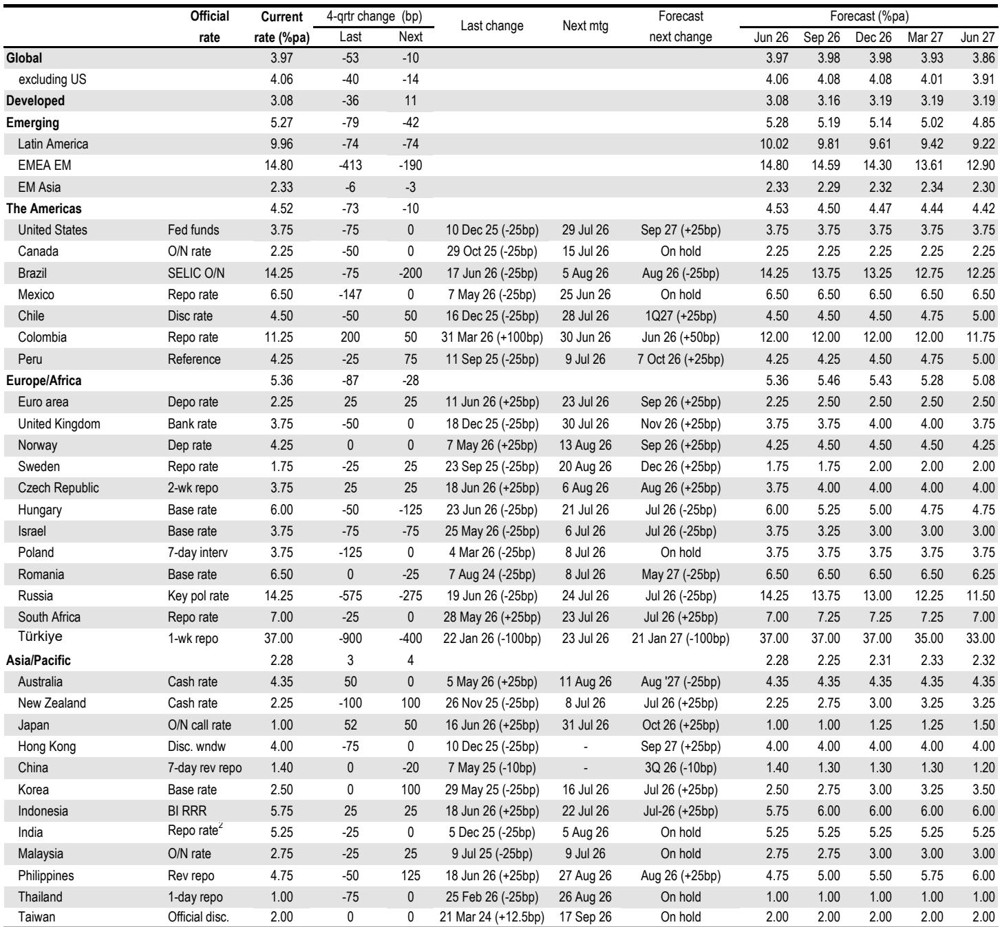
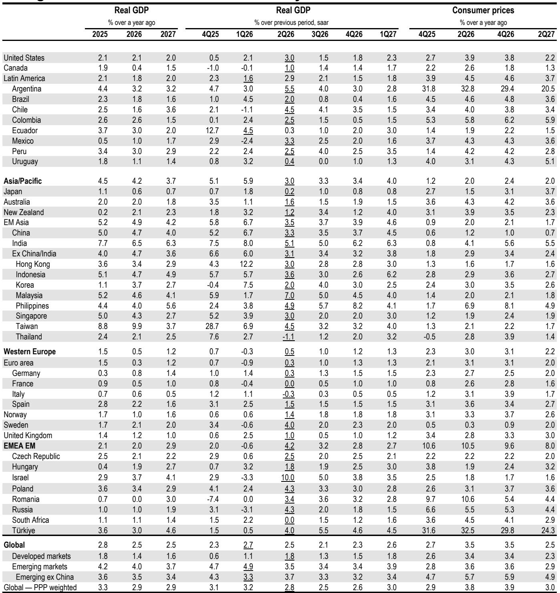
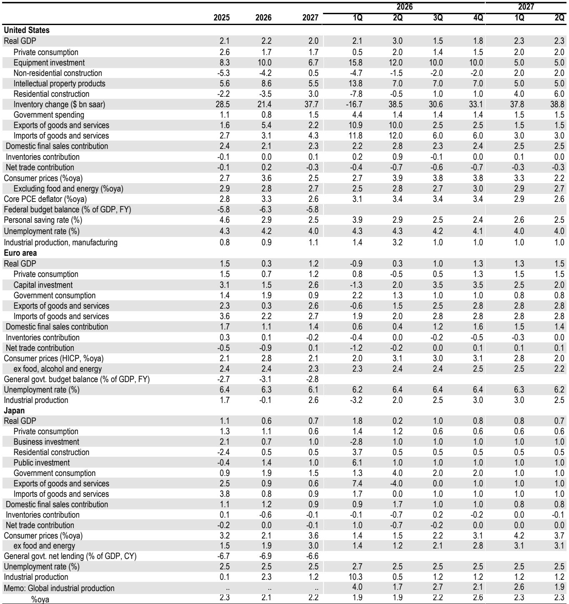

# The Mid-Year Pivot Is Real: Why the Global Economy Is Reaccelerating Despite a Sticky Inflation Shock

The global economy entered 2026 with a clear debate: was last year's hiring stall a structural shift toward productivity-led growth, or a cyclical pause ready to reverse? The first half of the year delivered an unambiguous answer—and it came with an energy price shock that tested the thesis. A global investment bank's mid-year outlook now argues that a cyclical upturn is taking hold, led by a broadening tech boom and a rebound in non-tech investment and hiring. This is not a forecast of smooth sailing. It is an argument that the business cycle is reasserting itself, and that the real risk lies not in recession but in the tension between above-potential growth and persistently elevated core inflation.

The energy shock from the Strait of Hormuz closure has left a mark. Global GDP growth is set to downshift into midyear as the recent CPI spike squeezes consumer purchasing power. But the agreement to reopen the Strait has reduced the risk of a disruptive energy price shock that could have short-circuited the expansion entirely. The headline inflation spike will fade next quarter. The pass-through to core inflation, however, will persist. This is the central tension of the outlook: growth is reaccelerating, but at the cost of price stability.

The argument rests on a specific mechanism. Last year's trade war depressed business sentiment and held back non-tech spending and hiring. That drag is now fading. The rebound in business confidence, interrupted by the Middle East conflict, is resuming. The recovery is concentrated in Western Europe, which experienced the sharpest sentiment decline. The Euro area, after a soft first half, is on track to accelerate toward an above-trend pace. This is not a US-only story. It is a global cyclical lift, supported by tech spending that is broadening beyond hyperscalers, a positive turn in the inventory cycle, and fiscal measures cushioning the household squeeze.

The middle months of 2026 will highlight the tension between the energy shock drag and the business sector lift. The key question is whether the latter can overcome the former. The outlook suggests it can—but only if the assumptions hold.

## The Cyclical Lift Is Real, and It Is Broader Than the Tech Sector

The most important claim in this outlook is that the recovery in non-tech business activity is not a hope but a pattern visible in incoming data. The global business expectations index, which had fallen after the trade war, rebounded into 2026. The Middle East conflict interrupted that recovery, but receding tensions and falling energy prices point to a resumption. This matters because the year-ahead forecast had anticipated a "conscious recoupling"—a deliberate return to hiring and capital spending by firms that had been paralyzed by policy uncertainty.

The evidence is emerging. US job growth has picked up, and the report anticipates sustained gains of 100,000 per month or faster. Global employment gains are expected to rebound toward 1% annualized. This is not a marginal improvement. It represents a structural shift in business behavior, from caution to action. The catalyst is the removal of uncertainty, not a sudden burst of animal spirits.

The broadening of tech spending is equally significant. AI is often discussed as a productivity story—a future benefit that will eventually lift output per worker. But the report makes a different point: AI is an important contributor to global demand *this year*. Spending on new technologies is broadening beyond the hyperscalers. This means the tech boom is not a narrow phenomenon confined to a handful of giant firms. It is diffusing through the economy, supporting industrial production and goods sector activity even as consumer spending softens.

The inventory cycle adds another layer. Global retail sales volume growth is expected to stall into midyear as consumers take a breather from the energy price shock. But industrial production gains are expected to remain solid, supported by a turn in the stockbuilding cycle. Firms are rebuilding inventories after a period of destocking, and this provides a natural buffer against the consumer slowdown. The implication is clear: the midyear soft patch is a pause, not a reversal.

## Europe Is the Surprise Engine of the Second-Half Reacceleration

The recovery in business sentiment is not evenly distributed. It is concentrated in Western Europe, which experienced the most significant drop in confidence when the Strait of Hormuz closed. This is a critical insight for investors who have largely written off the Euro area as a structural laggard.

The report projects that Euro area growth will accelerate toward an above-trend pace in the coming quarters after a soft first half of 2026. This is not a forecast of rapid expansion. It is a forecast of mean reversion—a recovery from depressed levels. But that is precisely what makes it powerful. The Euro area has been a source of downside risk for years. If it becomes a source of upside surprise, the global growth picture changes materially.

The mechanism is straightforward. European firms were hit hard by the energy shock because of their dependence on imported energy and the direct impact on consumer confidence. The reopening of the Strait removes that shock. Sentiment rebounds. Hiring resumes. The inventory cycle turns. The result is a region that transitions from drag to contributor.

The regional breadth of the expansion is one of the most underappreciated features of the current cycle. The US has been the primary driver of global growth since the pandemic. If Europe joins the recovery, the expansion becomes more durable and less dependent on a single engine.

## The Inflation Trade-Off Is Real, and Central Banks Are Running Out of Patience

The constructive growth outlook comes at a cost. Core inflation is set to remain above central bank targets for a sixth straight year. The report projects US core PCE at 3.4% (4Q/4Q basis), Euro area HICP at 2.5%, and emerging markets excluding China and Turkey averaging 3.7%. These are not transitory readings. They are persistent.

The source of the pressure is clear. Goods price inflation is reaccelerating, driven by tech sector bottlenecks, stronger non-tech demand, and rising commodity and transportation costs. The report's models point to core goods price increases of 2% annualized this year, compared to average annual gains of 0.9% during 2024-2025. Services inflation has also rebounded, to a 3.8% annualized rate in the first five months of the year, after a sharp slide in late 2025.

The labor market adds a further dimension. Wage inflation has moderated from its peak, but at 3.5% it remains higher than the pace seen at the peak of the 2000s expansion. The global unemployment rate rose 0.4 percentage points last year, returning to its pre-pandemic level. But the recent firming in employment gains and decline in unemployment rates suggest that slack is being absorbed. If growth continues at an above-potential pace, labor markets will tighten further, putting upward pressure on wages and services inflation.

The policy implication is uncomfortable. Core inflation surprises are sufficient to deliver rate hikes from many central banks, even as falling oil prices reduce the near-term pressures reflected in current market pricing. In the US, it is the interaction of elevated core inflation with a tightening labor market that will bring the Federal Reserve to hike. The report anticipates that global policy rates will rise by less than 30 basis points over the coming year—a shallow adjustment. But the threat that more action will be required is material.

## The Unanswered Question: How Much of a Tightening Shock Can the Expansion Absorb?

This is the section where the report's logic extends into territory it does not fully resolve. The baseline forecast assumes that central banks will tolerate persistently elevated inflation and deliver only shallow rate increases. But the report itself identifies the risk: more aggressive action by central banks is a material threat to the outlook. Past experience suggests that an unexpected reset of monetary policy expectations tends to generate financial stress, even with an otherwise healthy economic backdrop.

The question that remains unanswered is whether the current expansion is resilient enough to absorb a meaningful tightening shock. The report points to supportive financial conditions—the Fed's financial conditions impulse is sending its strongest signal in two decades, excluding episodes of recession exit. Household savings rates have moved lower, but wealth gains have been material and debt servicing costs remain low. The expansion is generating balanced profit and labor income growth.

But the report also notes that real policy rates remain low relative to earlier episodes in which central banks have restrained demand to lower inflation. If the Fed and other central banks decide that inflation is too persistent to tolerate, the shallow adjustment in the baseline could become a deeper one. The financial stress that follows could derail the cyclical lift.

The report does not resolve this tension. It identifies the risk but does not model its full consequences. This is the open analytical question for readers: what happens if central banks decide that 3% core inflation is unacceptable? The answer depends on whether the expansion's resilience is structural or cyclical.

## A Decision Framework for the Second Half of 2026

For readers who need to translate this outlook into actionable thinking, three questions define the path ahead.

First, does the inventory cycle turn as expected? The report argues that a positive turn in the stockbuilding cycle will boost industrial activity in the middle quarters of the year. This is a testable proposition. If industrial production data confirm the turn, the midyear soft patch will be short-lived. If inventory rebuilding does not materialize, the consumer slowdown could become more pronounced.

Second, does European sentiment rebound smartly? The report's forecast for Euro area acceleration depends on a recovery in business confidence. This is the most region-specific bet in the outlook. If European PMIs and sentiment indicators rise in the coming months, the regional breadth of the expansion will be confirmed. If they stagnate, the recovery will remain US-centric and more fragile.

Third, do central banks deliver the shallow tightening the baseline assumes, or do they surprise to the hawkish side? The report anticipates less than 30 basis points of global rate increases over the coming year. This is the most consequential assumption in the forecast. If inflation data force a more aggressive response, financial conditions will tighten, and the expansion will be tested. The risk is asymmetric: a shallow tightening is priced in, but a deeper one is not.

These three questions form a simple framework for monitoring the outlook. If the answers are yes, yes, and shallow, the reacceleration story holds. If any of them break, the narrative shifts.

## The Full Report Reveals the Charts That Make the Case

The argument presented here is based on a reading of a global investment bank's mid-year outlook. But the full report contains the charts and data that underpin the analysis—the business expectations index, the inventory cycle dynamics, the labor market trends, and the inflation models. These are not abstract concepts. They are measurable, trackable, and essential for any serious investor trying to navigate the second half of 2026.

The report also contains the detailed regional forecasts, the commodity price assumptions, and the policy rate projections that form the basis of the outlook. The summary here has focused on the argument and the implications. The full document provides the evidence.

Join the community to read the full report and review the original charts.

*This article is for learning and discussion only and does not constitute investment advice.*

Personal reading notes and learning share only. Not investment advice.

