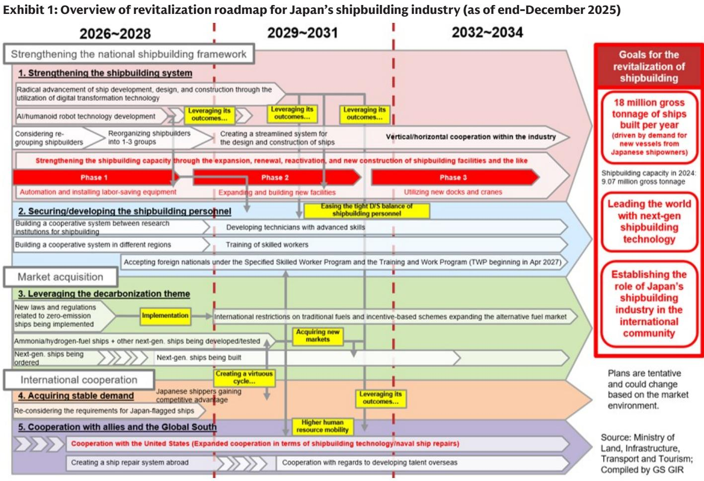
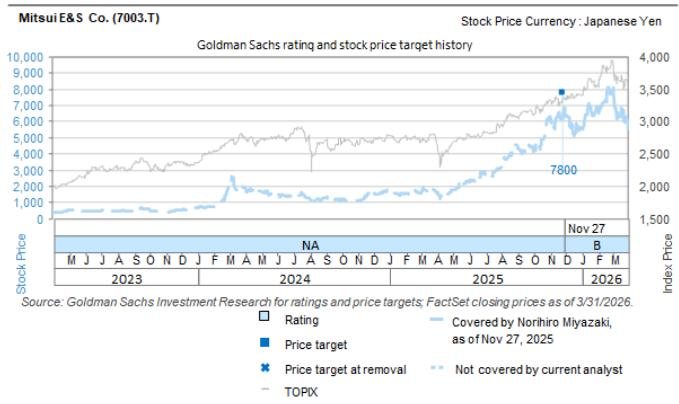
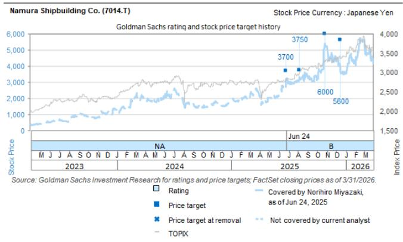

# Japan’s Shipbuilding Revival Is Not About Ships — It Is About Economic Sovereignty

The Japanese government has just drawn a line in the water. At the fifth meeting of the Japan Growth Strategy Council on June 24, officials released a draft Public-Private Investment Roadmap that repositions shipbuilding not as a legacy industry in managed decline, but as a pillar of national economic security. This is not a routine policy update. It is a strategic pivot with direct implications for three publicly traded companies — Namura Shipbuilding, Mitsui E&S, and Tokyo Keiki — all of which the market may still be valuing as cyclical industrials rather than as beneficiaries of a structural, state-backed reindustrialization program.

The core argument of this analysis is straightforward: the Council’s roadmap signals that Japan is willing to use public capital, regulatory leverage, and geopolitical alignment to rebuild domestic capacity in commercial shipbuilding, LNG carrier construction, repair and maintenance, defense vessel production, and port cargo handling machinery. For investors, the question is not whether these policies will be implemented — the direction is clear — but which companies have the operational footprint and strategic positioning to convert policy intent into earnings growth. The roadmap provides enough specificity to make that assessment, but it also leaves open critical questions about execution, cost, and competitive response.

The timing matters. Global supply chains are being reorganized around security rather than efficiency. Maritime transport remains the backbone of trade, and Japan’s current domestic shipbuilding volume falls short of demand from its own shipowners and operators. That gap is a vulnerability, and the government has now explicitly recognized it as one. The roadmap targets a doubling of shipbuilding volume by 2035 relative to 2024 levels. That is not a gentle nudge. It is a production target that will require coordinated action across private yards, equipment suppliers, and policy institutions.

This article translates the Council’s materials into a strategic framework for investors, identifies the companies most likely to benefit, and highlights the analytical gaps that the roadmap does not yet resolve.

## The Roadmap’s Central Thesis Is That Domestic Capacity Has Become a Security Asset, Not Just a Commercial One

The most important shift in the Council’s materials is the framing. Shipbuilding is no longer discussed primarily in terms of export competitiveness or industrial policy. It is discussed in terms of economic security. The language matters. When a government describes an industry as vital for ensuring a stable supply of commercial vessels for food transport and defense, it is signaling that market outcomes alone will not determine the industry’s fate. Public intervention is justified on national security grounds, and that justification opens the door for subsidies, procurement guarantees, and regulatory changes that would be politically difficult under a purely commercial rationale.

The roadmap covers five distinct areas: next-generation vessels, ship repairs and maintenance, LNG carriers, defense industry production, and port cargo handling machinery. Each area has its own targets, policy tools, and investment assumptions. But the unifying logic is the same: Japan cannot afford to be dependent on a small number of foreign suppliers for the vessels and equipment that underpin its trade and security.

This is not a theoretical risk. The materials note that construction of LNG carriers in Japan has ceased entirely since 2019. Japanese shipping companies and utilities operate a fleet of roughly 200 LNG vessels, but none are being built domestically. The government now aims to establish systems to build three to five LNG carriers per year from 2035 onward. That target implies a multi-year effort to reconstitute design teams, supply chains, and skilled labor that have largely dissipated. The roadmap is honest about the challenge — it states that the scale of public-private investment for LNG carriers will be scrutinized in the future as discussions proceed — but the direction is unambiguous.

For investors, the implication is that the government is prepared to underwrite a capacity rebuild that private capital alone would not support. That changes the risk-reward calculus for companies in the sector. The question is which firms are positioned to capture the resulting demand.

## Namura Shipbuilding Faces the Broadest Opportunity Set, But Execution Risk Is Real

Namura Shipbuilding is the most direct beneficiary of the roadmap’s scope. The company operates in commercial shipbuilding, repair and maintenance, and has exposure to next-generation vessel technologies. The Council’s materials specifically reference the need to bolster supply systems for next-generation vessels and LNG carriers, and to strengthen repair and maintenance capacity. Namura’s existing footprint aligns with all three priorities.

The repair and maintenance segment is particularly interesting. The materials reveal that over 90% of repair and maintenance work in Japan in 2024 was for coastal vessels, including naval ships and patrol boats. For ocean-going vessels, Japan is highly dependent on specific overseas countries. The government plans to establish systems to improve repair and maintenance capacity, with an assumed ¥100 billion in public-private investment. That is a material capital injection into a segment that has been underinvested for years.

Namura’s challenge is that the roadmap’s targets are ambitious but the mechanisms are still being designed. The government’s goal of doubling shipbuilding volume by 2035 implies a compound annual growth rate that is well above what the industry has achieved in recent decades. Achieving that will require not just capital, but also labor — and Japan’s shipbuilding workforce has been shrinking. The roadmap acknowledges the need for educational and research systems for human resource development, but building those systems takes years. Namura’s management will need to demonstrate that it can scale production without sacrificing margins, and that it can attract and retain the skilled workers the expansion requires.

The market’s current valuation of Namura may not fully reflect the potential upside from policy-driven demand, but it also may not fully discount the execution risks. The stock carries a Buy rating in the underlying report, with a 12-month target price of ¥5,600 based on a target P/B of 2.6x. That valuation implies confidence in the company’s ability to deliver on the roadmap’s promise. Investors should watch for concrete signs of order book expansion and workforce investment before assuming the target is achievable.

## Mitsui E&S Stands to Gain from Marine Engines and Port Machinery, Two Distinct Growth Vectors

Mitsui E&S occupies a unique position in the roadmap because its businesses span two of the five priority areas: marine propulsion systems and port cargo handling machinery. The company is Japan’s largest marine engine manufacturer, which positions it to benefit directly from the expansion of domestic shipbuilding volume, including LNG carriers. The transition to next-generation vessels — zero-emission ships that require new propulsion technologies — should also drive demand toward higher-value-added products, which typically carry better margins.

The port cargo handling machinery segment is a more concentrated opportunity. The Council’s materials note that Japanese companies hold a global installed base share of roughly 10% for ship-to-shore cranes and slightly over 10% for yard cranes. The vast majority of the remainder is supplied by a single specific company. For Mitsui E&S, which the report assumes holds a domestic order share of 100% on a volume basis in its fiscal year ending March 2026, the roadmap’s target of expanding overseas sales to ¥20-30 billion per year with a 30% share of the US market by around 2040 represents a meaningful growth runway.

The US angle is particularly strategic. The materials explicitly mention that policies are being promoted in the US to revive the domestic manufacturing base for STS cranes. Japan’s push to bolster competitiveness in port cargo handling machinery is therefore aligned with a broader geopolitical trend toward supply chain diversification. Mitsui E&S could benefit from US demand for non-Chinese crane suppliers, especially if US port modernization programs accelerate.

The risk for Mitsui E&S is that the roadmap’s support for capital investment in port cargo handling machinery may take time to translate into orders. The company’s current valuation — a 12-month target price of ¥7,000 based on a sum-of-the-parts model with target P/E multiples ranging from 10x to 19x across segments — already embeds expectations of growth. If the policy-driven demand materializes more slowly than assumed, or if competition from the dominant supplier intensifies, the stock could underperform.

## Tokyo Keiki Offers a Dual Exposure to Marine Equipment and Defense, But Defense Budget Dynamics Are Uncertain

Tokyo Keiki is the smallest of the three companies in market capitalization but may offer the most asymmetric upside. As a supplier of marine equipment, the company benefits from growth in domestic shipbuilding volume. As a supplier of defense equipment, it could benefit from the export of frigates and the production of small unmanned aerial vehicles, both of which are explicitly mentioned in the Council’s materials.

The defense angle is worth examining closely. The roadmap recommends building a foundation for the development, manufacturing, and maintenance of small unmanned aerial vehicles, as well as transferring equipment to allied and like-minded countries. It also notes that the Mogami-class frigate has attracted interest from allied and like-minded countries. While investment in the naval vessel sector, including defense procurement, is slated at roughly ¥340 billion in the FY2026 budget, the materials indicate that additional investment is expected in line with the revision of Japan’s three strategic security documents.

For Tokyo Keiki, the question is how much of this defense spending flows to its specific product lines. The company’s marine equipment business is tied to commercial shipbuilding volumes, which are policy-supported but not guaranteed. Its defense business depends on procurement decisions that are subject to political dynamics beyond the roadmap’s scope. The underlying report assigns a 12-month target price of ¥8,800 based on a target P/E of 23x on FY3/31E EPS. That multiple is the highest among the three companies, reflecting the potential for defense-driven earnings acceleration. But it also leaves less room for disappointment.

## What the Roadmap Does Not Answer: Cost, Competition, and the Limits of State Support

The Council’s materials are impressive in their specificity on targets and policy tools, but they are notably vague on three critical dimensions: the total cost of the program, the competitive response from other shipbuilding nations, and the mechanism for ensuring that public investment translates into private profitability.

On cost, the roadmap provides only partial figures. The repair and maintenance segment assumes ¥100 billion in public-private investment. The defense sector has a ¥340 billion budget line for FY2026. For LNG carriers, the roadmap explicitly states that the scale of investment will be scrutinized in the future. The port cargo handling machinery segment mentions support for capital expenditure but does not quantify it. The next-generation vessel target of doubling shipbuilding volume by 2035 is stated without a corresponding cost estimate. Investors are left to guess at the total fiscal commitment, which makes it difficult to assess whether the program is adequately funded or whether it will require future budget revisions that could introduce political friction.

On competition, the roadmap does not address how Japan intends to compete with South Korea and China, which dominate global shipbuilding. Japan’s share of global commercial shipbuilding has declined for decades. The roadmap’s focus on next-generation vessels suggests a strategy of leapfrogging to zero-emission technologies, but that assumes that Japanese yards can achieve technological leadership in a domain where competitors are also investing heavily. The materials mention leading formulation of international rules at the IMO, which implies a regulatory strategy, but regulatory influence does not guarantee commercial success.

On profitability, the roadmap is silent. State support can boost revenues, but it does not automatically improve returns on invested capital. The underlying report notes that support for capital investment in port cargo handling machinery could lead to improvements in capital efficiency for Mitsui E&S, but that is an optimistic interpretation. The risk is that capacity expansion driven by policy incentives leads to overinvestment, margin compression, and value destruction for shareholders. Investors need to monitor not just order volumes, but unit economics.

## A Decision Framework for Investors: Three Questions to Ask Before Committing Capital

Given the roadmap’s ambition and its gaps, investors should evaluate each company against three criteria before making allocation decisions.

First, does the company have a direct, measurable link to a specific policy target in the roadmap? Namura’s link to next-generation vessels and repair and maintenance is clear. Mitsui E&S’s link to marine engines and port machinery is clear. Tokyo Keiki’s link is more diffuse, spanning commercial marine equipment and defense. The clearer the link, the more directly the company benefits from policy execution.

Second, does the company have the operational capacity to scale without destroying margins? The roadmap’s targets imply significant production increases. Companies that can expand output while maintaining or improving unit economics will compound the benefit of policy support. Companies that need to invest heavily in new capacity before seeing returns may face a drag on near-term profitability.

Third, is the company’s current valuation already pricing in policy success? The target prices in the underlying report suggest upside, but they are based on assumptions about order flow, margins, and discount rates. If the market has already priced in a high probability of policy success, the margin of safety is thin. If the market is still treating these stocks as cyclical industrials, the upside from policy-driven re-rating could be substantial.

These questions do not yield simple answers. They require ongoing analysis of order books, earnings calls, and policy implementation milestones. The roadmap provides a framework for that analysis, but it does not do the work for investors.

## The Full Report Contains the Original Charts and Granular Financial Projections That This Analysis Cannot Cover

The Council’s materials include detailed charts on shipbuilding volumes, market shares, and investment trajectories that are essential for building a quantitative model of the opportunity. The underlying report from which this analysis is drawn provides those charts alongside segment-level earnings estimates, valuation methodologies, and risk assessments for each of the three companies. The price target calculations — based on P/B, sum-of-the-parts, and P/E frameworks — are explained in detail, as are the specific risks that could cause those targets to be missed.

Investors who want to move beyond strategic framing into portfolio construction will need that level of detail. The roadmap is a directional signal. The report translates that signal into financial estimates. The charts are the bridge between policy intent and investment decision.

Join the community to read the full report and review the original charts.

*This article is for learning and discussion only and does not constitute investment advice.*

Personal reading notes and learning share only. Not investment advice.

