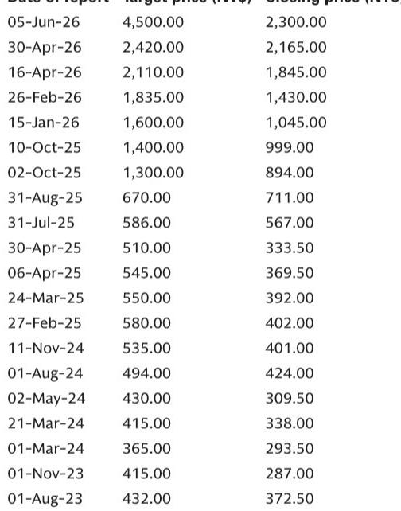
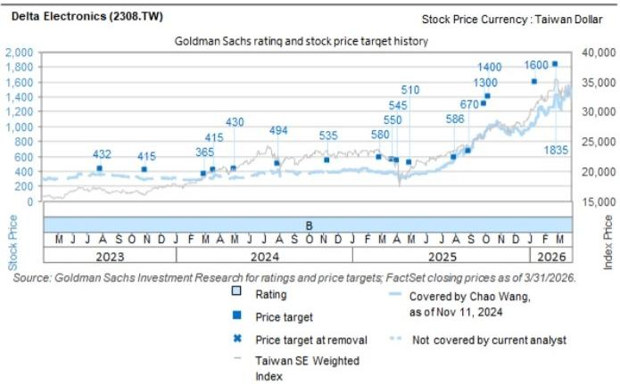
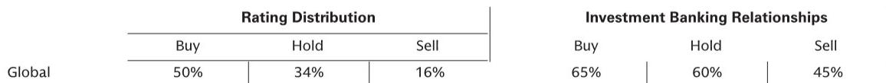

# GS：数据中心最大的瓶颈不是电力，是碳化硅

全球数据中心正在经历一场由AI驱动的需求爆发，但多数市场参与者仍然把注意力放在“电够不够”这个问题上。这份GS近期组织的专家电话会纪要，提供了一个来自产业链核心供应商的视角，其结论比表面看到的更尖锐：电力确实紧张，但真正卡住全球数据中心扩张速度的，是晶体管——更具体地说，是碳化硅（SiC）功率器件的供应。这个瓶颈的缓解时间表，将直接决定未来两年超大规模云厂商和托管服务商的交付节奏。

这份研报解析的价值，不在于复述“AI带动数据中心需求”这个已知事实，而在于揭示一个正在发生的权力转移：过去是基础设施决定部署什么设备，现在是英伟达的架构和生态在倒逼基础设施重新设计。从电源到冷却，从布线到预制模块，整个产业链的竞争逻辑正在被重写。

## 1. 供应链正在从“规模竞赛”转向“关系竞赛”，锁单能力成为新护城河

GS这份电话会纪要最直接的信号，来自Delta Electronics——全球最大的服务器和笔记本电脑电源供应商，市占率约60%-70%，同时也是全球最大的液对气冷却制造商。Delta的管道订单规模已经远超其生产能力，尤其在基础设施侧。这意味着什么？不是所有数据中心玩家都能拿到货。

Delta认为，未来最有竞争力的托管服务商，将是那些拥有最强供应链关系并已锁定远期订单的企业。这不是一个温和的警告。在全球UPS解决方案持续紧张、Delta自产电池未来18个月已全部售罄的背景下，供应链的“先到先得”逻辑正在取代“价高者得”。对于正在规划新数据中心的企业而言，现在需要评估的不是“我们能不能拿到地/电”，而是“我们能不能拿到设备”。

> **KC评论：** 很多投资者还在盯着土地审批和电网容量，但Delta的信号表明，设备交期可能成为更硬的约束。40周的碳化硅交期意味着，今天下的订单，明年才能装到机柜里。完整报告里Delta对各类设备交期的具体拆解，值得每一个做数据中心投资的人逐行阅读。

## 2. 英伟达正在从“被适配者”变成“定义者”，基础设施的决策权已经易手

研报里有一段话值得反复读：“过去，基础设施决定部署什么设备；现在，英伟达的架构/设备在驱动生态系统基础设施。”这句话的冲击力，不亚于宣称“火车头在决定铁轨的规格”。

Delta的观察是，这一转变让它们比电网侧运营商（如变压器公司）获得了更有利的战略位置。后者往往只能做白牌电子产品，而Delta能直接响应英伟达的架构变化。这意味着，在AI数据中心的价值链上，利润正在向那些能与英伟达生态深度耦合的供应商集中，而不是向传统的电力设备商。

这份研报还透露了一个关键细节：Delta正在与英伟达紧密合作开发下一代800V高压直流（HVDC）电源和冷却系统。这不是一个普通的供应链关系，这是两个行业龙头在联合定义下一代AI数据中心的电力架构。

## 3. 空气冷却正在被淘汰，液冷市场将经历一场结构性洗牌

Delta的冷却技术路线判断值得高度关注。它预计液对气冷却系统将随着运营商从改造转向新建而减少。Delta几乎已经停止了所有空气冷却部署（除了一些自建超大规模云厂商的存量项目），托管服务商几乎没有新订单。它预计到2028-2030年，这些项目将减少5%-10%。

这背后有一个气候维度的分化：空气冷却在温暖/干燥气候下更高效（蒸发冷却效率更高），而水冷更适应凉爽气候。但Delta看到了闭环冷却的优势，可以通过可再生能源来抵消额外的能源需求。对于正在选址或规划冷却方案的企业，这不再是一个“选A还是选B”的技术问题，而是一个“你的冷却方案是否还能在未来五年被供应商支持”的战略问题。

> **KC评论：** 冷却技术路线的切换，对供应链的影响远不止于设备更换。它意味着整个运维团队的能力结构需要重建，意味着数据中心选址的气候评估权重需要重新校准。完整报告里Delta对各类冷却方案的效率对比和成本拆解，是理解这一轮洗牌的基础素材。

## 4. 预制模块化数据中心正在颠覆传统建设模式，部署时间压缩50%-60%

Delta需求最强劲的产品线不是单个电源或冷却设备，而是预制模块化数据中心系统，包括纯电力系统（灰色空间/仅电力）和混合模块化数据中心（白色+灰色空间）。其新推出的AI模块化解决方案，将数据中心部署时间缩短了50%-60%，Delta预计未来6个月产能将增长4倍。

这是一个行业结构性的变化。AirTrunk已经采用模块化方法，而NXT和MAQ由于企业客户结构偏向传统，仍主要使用传统方法。有趣的是，微软和AWS偏向传统方法，因为它们有标准化的全球设计蓝图——这也是为什么超大规模云厂商在区域部署时使用托管服务，但在美国自建（约占总容量的90%）。

这意味着，模块化解决方案的渗透率提升，不会来自所有客户的一刀切切换，而是来自新进入者和区域部署的增量市场。对于托管服务商而言，能否快速拥抱模块化，将决定它们是否能从超大规模云厂商的区域扩张中分到蛋糕。

## 5. 800V高压直流将改变数据中心的电力成本结构，但澳大利亚要等到2027年

Delta与英伟达联合开发的800V高压直流系统，是这份研报里最值得深挖的技术细节。电力占数据中心总建设成本的8%-10%，而UPS和电池仅占0.5%。800VDC用更少的铜和更少的电缆（2根电缆 vs 之前的4-5根）将更多电力导入机柜。由于电压升高、电流降低，总系统成本可能下降30%-40%，但电子设备需要加强，其成本可能从0.5%上升至1.5%-2.0%。

这个技术路线一旦大规模部署，将显著降低数据中心的电力基础设施成本，同时释放更多的机柜空间用于计算设备。但Delta预计，由于最新技术通常落后澳大利亚市场12-18个月，800VDC将在2027年上半年在IEC国家（澳大利亚、欧洲、东南亚）部署。这意味着，未来两年内，这些市场的超大规模数据中心仍将使用现有电力架构，成本下降的红利要到2027年之后才能兑现。

## 6. 报告尚未完全回答的关键问题：监管正在制造一个无解的合规困境

GS在电话会中讨论了澳大利亚能源市场运营机构（AEMO）提出的拟议法规：如果获得批准，超过100MW的数据中心设施需要在前端安装电池储能系统，这将使成本增加超过2倍。Delta指出，目前全球没有任何UPS系统符合这一要求。

这是报告里最令人不安的一个观察。不是“成本增加”，而是“没有合规产品”。如果这个法规在短期内生效，它可能不是增加建设成本的问题，而是直接冻结新增建设的问题。监管机构在制定规则时，是否充分评估了产业链的实际供应能力？这是一个值得所有市场参与者追问的问题。

> **KC评论：** AEMO的法规提案，本质上是把电网稳定性的成本转嫁给数据中心运营商，但产业链还没准备好响应。这个合规缺口意味着什么？是监管会妥协，还是产业链会加速研发？完整报告里对法规细节和Delta应对方案的讨论，是理解这一风险的关键入口。

## 7. 给读者的观察框架：从三个维度重新审视数据中心的投资逻辑

基于上述分析，我们认为在评估任何数据中心相关标的时，需要建立一个新的观察框架：

第一，供应链深度。不是看供应商有多少产能，而是看它有多少远期订单、与关键组件供应商（尤其是碳化硅）的关系有多深。Delta的案例表明，自产电池和自有供应链正在成为稀缺资源。

第二，技术路线选择。冷却方案是空气还是液冷？电力架构是传统还是800VDC？建设方式是传统还是模块化？这些选择不仅影响当前成本，更决定未来三到五年的竞争位势。

第三，监管风险敞口。AEMO提案只是冰山一角。全球各国对数据中心的能源消耗、碳排放、电网接入的监管正在收紧。那些在选址和设计阶段就把合规成本纳入考量的企业，将比事后应对的企业拥有更大的战略缓冲。

这份GS研报的价值，不在于给出了确定的投资建议，而在于提供了一个来自产业链核心位置的“温度计”。Delta的订单、交期、技术路线选择，比任何宏观预测都更真实地反映了全球数据中心建设的实际节奏。对于认真看待这个赛道的读者，完整报告里关于各区域市场交期差异、客户结构分析、以及Delta对2027年前后技术切换的详细时间表，值得逐页消化。

---

**如果你也在跟踪全球数据中心产业链的变化，欢迎加入我们的社群。** 每天，我们会由AI agent和人工review结合，生成国际投行中文摘要与KC评论，daily更新约10-40页，并整理当天最新数据图表合集。这些内容既方便喂给AI做进一步分析，也方便人工快速把握全球市场的动态变化。在微信群中，我们继续讨论这个行业未解的难题——比如AEMO法规的走向、800VDC的推广节奏、以及碳化硅供应瓶颈何时缓解。

Personal reading notes and learning share only. Not investment advice.

