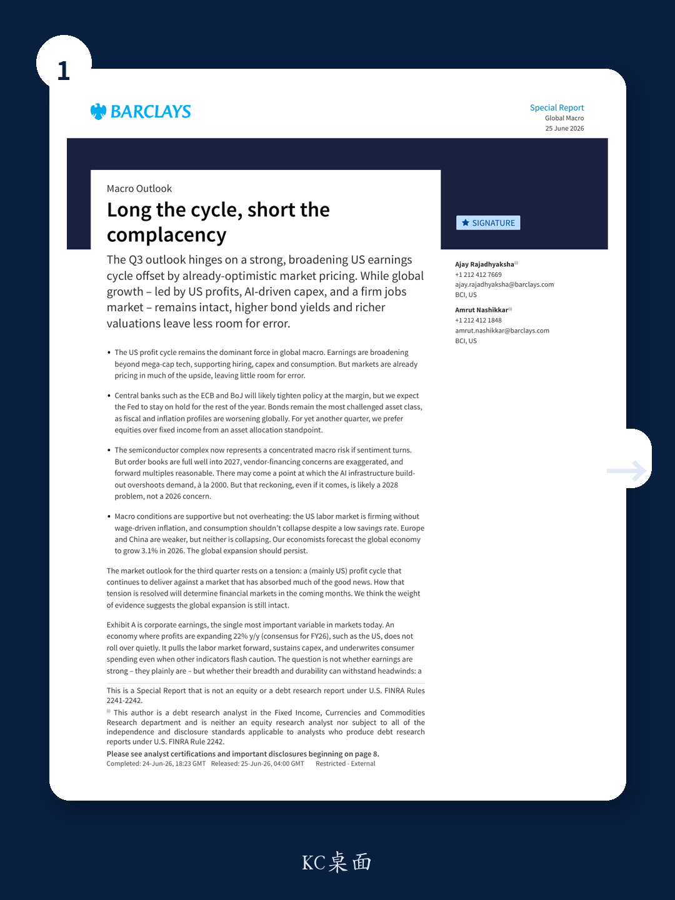
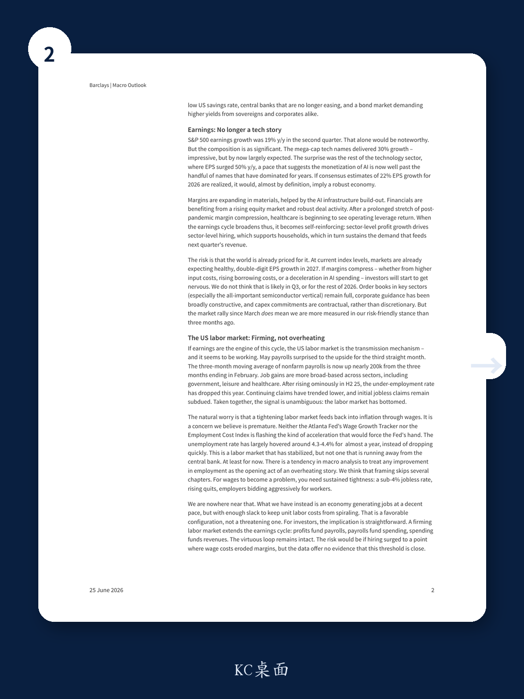

# The US Earnings Cycle Is Broadening and Sustained, But Markets Have Already Priced It In, Leaving No Room for Error

The dominant force in global macro this quarter is not a central bank decision, a geopolitical shock, or a commodity spike. It is the US corporate earnings cycle, which is now broadening beyond mega-cap technology into sectors that had been lagging for years. Profits are expanding at nearly 22% year-over-year on consensus estimates for fiscal 2026, and the composition of that growth is becoming more important than the headline number. Materials, financials, and healthcare are all contributing to a self-reinforcing loop: sector-level profit growth drives hiring, which supports household income, which sustains the demand that feeds next quarter's revenue.

Yet markets have already absorbed much of this good news. Equity valuations are elevated, bond yields are rising, and the pricing of risk across asset classes leaves little buffer for disappointment. The central tension of the third quarter is between an economy that continues to deliver and a market that has already priced in that delivery. How this tension resolves will determine whether the next leg of the cycle is a continuation or a correction.

The global expansion remains intact. The US labor market is firming without generating wage-driven inflation. The AI capital expenditure cycle is on track to reach a trillion dollars by 2027, with order books full and contractual commitments locking in demand for years. Europe and China are weaker but neither is collapsing, and our economists forecast global GDP growth of 3.1% in 2026. But the margin for error has narrowed. Investors who were comfortable being aggressively risk-on three months ago must now ask whether the market's optimism has become a liability.

## The Earnings Cycle Has Broadened Beyond Mega-Cap Tech, Making It More Durable But Also More Demanding of Sector-Level Analysis

S&P 500 earnings grew 19% year-over-year in the second quarter, a number that would have been remarkable in any context. But the composition matters more than the aggregate. Mega-cap technology names delivered 30% growth, impressive but by now largely expected. The real surprise came from the rest of the technology sector, where earnings per share surged 50% year-over-year, a pace that signals the monetization of artificial intelligence is now spreading well beyond the handful of companies that have dominated the narrative for years.

This broadening matters for two reasons. First, it reduces the concentration risk that has worried macro investors since 2023. When earnings growth depends on a narrow set of names, any sector-specific shock can derail the entire market. Second, a broad-based earnings cycle is self-reinforcing in a way that a narrow one is not. Materials companies are benefiting from the physical infrastructure required for AI build-out. Financials are gaining from rising equity markets and robust deal activity. Healthcare is beginning to see operating leverage return after a prolonged stretch of post-pandemic margin compression. Each sector's profit growth funds hiring in that sector, which supports household income, which sustains the consumption that drives the next quarter's revenue.

The risk is that this virtuous loop is already priced in. At current index levels, markets are expecting healthy double-digit earnings per share growth in 2027. If margins compress, whether from higher input costs, rising borrowing costs, or a deceleration in AI-related spending, investors will begin to question those expectations. We do not think that is likely in the third quarter or for the remainder of 2026. Order books in key sectors, especially semiconductors, remain full. Corporate guidance has been broadly constructive. Capital expenditure commitments are contractual rather than discretionary. But the rally since March means we are more measured in our risk-friendly stance than we were three months ago.

## The US Labor Market Is Firming Without Overheating, Which Extends the Earnings Cycle Without Triggering a Policy Response

If earnings are the engine of this cycle, the US labor market is the transmission mechanism, and it is functioning as intended. May payrolls surprised to the upside for the third consecutive month. The three-month moving average of nonfarm payrolls is now nearly 200,000 higher than the three months ending in February. Job gains are broad-based across government, leisure, healthcare, and other sectors. After rising ominously in the second half of 2025, the underemployment rate has dropped this year. Continuing claims have trended lower, and initial jobless claims remain subdued. The signal is unambiguous: the labor market has bottomed.

The natural concern is that a tightening labor market feeds back into inflation through wages. We believe this concern is premature. Neither the Atlanta Fed's Wage Growth Tracker nor the Employment Cost Index is flashing the kind of acceleration that would force the Federal Reserve to act. The unemployment rate has hovered around 4.3 to 4.4 percent for almost a year rather than dropping quickly. This is a labor market that has stabilized, not one that is running away from the central bank.

There is a tendency in macro analysis to treat any improvement in employment as the opening act of an overheating story. That framing skips several chapters. For wages to become a problem, you need sustained tightness: a sub-4 percent jobless rate, rising quits, and employers bidding aggressively for workers. We are nowhere near that configuration. What we have instead is an economy generating jobs at a decent pace with enough slack to keep unit labor costs from spiraling. That is a favorable configuration for investors, not a threatening one. A firming labor market extends the earnings cycle: profits fund payrolls, payrolls fund spending, and spending funds revenues. The virtuous loop remains intact. The risk would come if hiring surged to a point where wage costs eroded margins, but the data offer no evidence that this threshold is close.

## The Consumer Is Weaker Than Headline Data Suggest, But Stronger Than the Bear Case Admits, Because the Saving Rate Likely Overstates Fragility

A firming labor market ought to translate into resilient household spending. But the headline savings data in the United States tell a more cautious story. At 2.6 percent, the household saving rate leaves almost no buffer between the consumer and a pullback in spending. The logic is simple: if households are saving almost nothing, any shock, whether a job loss, an energy spike, or a wobble in confidence, forces an immediate retrenchment. Real disposable income growth reinforces the concern. On a per capita basis, it fell 0.5 percent in April alone, and on a year-over-year basis it is declining at roughly 1.5 percent, the weakest reading since 2022. On its face, this looks like a stretched consumer.

We do expect consumption to soften a little in the second half of the year, but we are skeptical of any doom-and-gloom narrative. Not because the numbers are wrong, but because we have seen this story before. Twice in recent years, the Bureau of Economic Analysis has conducted annual revisions to the national accounts that substantially raised the saving rate after the fact. The most striking instance came in September 2024, when the BEA revised the saving rate from 3.3 percent to 5.2 percent through the second quarter, an upgrade of nearly two full percentage points. The source was a sharp upward revision to gross domestic income, which had significantly understated how much Americans were actually earning. In both episodes, the prevailing narrative was that the consumer was dangerously overstretched. In both cases, the revised data told us the opposite. We would not be surprised if a similar recalibration is ahead.

The weakness in real income growth deserves acknowledgment; it is the one element of the bear case that carries genuine weight. But it needs to be weighed against the forces running in the other direction. Fiscal transfers remain substantial. The federal deficit is still running at 5.5 to 6 percent of GDP, a level of government dissaving that puts significant income into household pockets. Financial wealth effects are large and growing: the S&P 500 is near record highs, housing wealth remains elevated, and IPO activity should create a fresh cohort of liquid wealth. And the AI capital expenditure cycle, now on track to reach a trillion dollars by 2027, is generating employment, income, and demand beyond the technology sector itself.

Calling for a sharp consumer-led slowdown requires one to believe that soft real income growth will overwhelm the combination of fiscal support, buoyant asset prices, and the strongest corporate earnings cycle in years. That is a view we do not buy. The saving rate is likely overstating the fragility of household balance sheets, just as it has before. The offsetting forces are simply too large to support a conviction call for a strong pullback in consumption. The bears have a data point. They do not have a story that holds together.

## The Semiconductor Complex Is the Structural Tailwind That Drives the Entire Market, But It Also Represents the Single Largest Macro Risk If Sentiment Turns

It is tempting to treat the semiconductor cycle as a sector-level concern, something for technology analysts to parse and for macro investors to observe from a distance. That would be a mistake. Of the 15 to 16 companies globally that exceed a trillion dollars in market capitalization, barely a handful are not related to technology hardware or the infrastructure that supports it. Nvidia is the world's most valuable company at around 5 trillion dollars. TSMC, Samsung, and SK hynix between them account for trillions more. The semiconductor complex is not a subsector of the equity market; it is now its heartbeat, and its gravitational influence extends well beyond share prices into credit markets. The hyperscalers will likely issue more than 400 billion dollars in new debt this year alone, more than twice the amount they raised in 2025, making the semiconductor supply chain a first-order focus for credit investors.

The comparison with the dot-com bust is the one that surfaces most often. In 2000, the telecom equipment sector, led by Nortel and Lucent, sat at the center of the technology complex in much the same way that semiconductor companies do today. Both were critical enablers of a transformative infrastructure build-out. Both attracted enormous capital flows on the promise that demand was structural and durable. And when the cycle broke, the damage was catastrophic. The semiconductor index itself fell 82 percent from peak and took decades to recover.

But the 2000 template breaks down on closer inspection. Nortel and Lucent were not just selling equipment into a boom; they were financing the boom themselves. Nortel extended over 7 billion dollars in vendor financing to startup telecom carriers, many of which had little or no revenue and no viable path to profitability. When the startups defaulted, demand did not slow, it vanished overnight. The semiconductor cycle today is fundamentally different. Nvidia's four largest customers, Microsoft, Alphabet, Amazon, and Meta, generated several hundred billion dollars in free cash flow last year. These are not leveraged startups buying chips on credit; they are the most cash-generative enterprises in the history of capitalism, funding purchases out of earnings and issuing debt from balance sheets that any sovereign would envy.

The vendor financing issue is real at the margin and warrants monitoring. Nvidia has invested in a number of smaller AI infrastructure companies that then purchase Nvidia's own chips, creating what critics describe as a circular revenue loop. But context matters. The overwhelming majority of Nvidia's revenue comes not from leveraged startups but from the hyperscalers, whose capacity to pay is not in question. Our view is that the semiconductor cycle remains firmly intact through 2026 and into the first half of 2027. Order books are full. Capacity is being expanded on multi-year, contractual timelines. The customers writing the checks have the cash flows to honor them. There may come a point at which the AI infrastructure build-out overshoots demand, just as the fiber-optic build-out eventually did. But that reckoning, if it comes, is a 2028 problem, not a 2026 one.

## What the Report Does Not Fully Answer: When Does the Virtuous Loop Break, and What Signal Would Precede the Break?

The report makes a compelling case for the durability of the current cycle, but it leaves several meaningful questions open. The first is timing: if the AI infrastructure build-out overshoots demand in 2028, what would be the leading indicators that the inflection point is approaching? Capacity utilization rates in semiconductor fabrication, lead times for equipment orders, and the pricing of memory chips could all provide early warnings. But the report does not specify which metric would be most reliable, nor does it quantify the threshold at which oversupply becomes a systemic risk.

The second open question involves the transmission mechanism from financial markets to the real economy. The report acknowledges that markets have already priced in much of the good news, but it does not explore what happens if that pricing unwinds. A 10 to 15 percent correction in equity markets would not, by itself, derail the earnings cycle, but it would tighten financial conditions, reduce wealth effects, and potentially slow the hiring and capex decisions that the report identifies as the cycle's foundation. At what point does a market correction become a self-fulfilling prophecy that breaks the virtuous loop?

The third question concerns Europe and China. The report treats both regions as weak but not collapsing, which is a reasonable characterization for the current quarter. But the structural divergences between the US and the rest of the world are widening, not narrowing. If Europe stagnates for another year and China's consumer retrenchment deepens, the US export sector and multinational earnings could face headwinds that are not yet reflected in consensus estimates. The report does not fully explore how a two-speed global economy could eventually pull the US cycle down.

## A Decision Framework for the Third Quarter: Distinguish Between What Is Priced and What Is Probable, and Position for the Gap

For investors trying to navigate the current environment, the most useful framework is a simple one: distinguish between what markets have already priced and what is still probable but not yet discounted. The market has priced in healthy double-digit earnings growth for 2026 and 2027. It has priced in a firming labor market without wage-driven inflation. It has priced in the continuation of the AI capex cycle through 2027. What it has not priced in is the possibility that any of these assumptions prove too optimistic.

The practical implication is that the risk-reward profile has shifted. Three months ago, the gap between what was probable and what was priced was wide enough to justify an aggressive risk-on stance. Today, that gap has narrowed. The same earnings cycle that was a tailwind in the first quarter is now a support rather than a catalyst. The same AI capex cycle that was a surprise is now an expectation. The same labor market that was improving is now a baseline.

This does not mean investors should reduce equity exposure or move to cash. The weight of evidence still favors the expansion. But it does mean that the bar for positive surprises has risen. Investors should focus on sectors and companies where the gap between expectations and reality remains wide: areas where earnings growth is accelerating but valuations have not yet caught up. Materials and industrials benefiting from the AI infrastructure build-out, financials gaining from deal activity and rising markets, and healthcare seeing margin recovary all fit this description. The mega-cap technology names, by contrast, are priced for perfection and offer limited upside if the cycle continues as expected.

The second implication is that bonds remain the most challenged asset class. Fiscal and inflation profiles are worsening globally, and central banks are tightening at the margin. For yet another quarter, equities are preferable to fixed income from an asset allocation standpoint. But within equities, the emphasis should shift from beta to selectivity. The cycle is intact, but the easy money has been made.

Join the community to read the full report and review the original charts.

*This article is for learning and discussion only and does not constitute investment advice.*

Personal reading notes and learning share only. Not investment advice.

