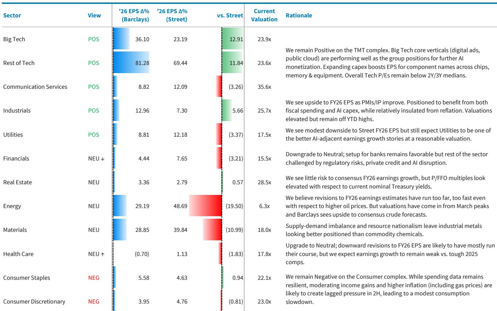
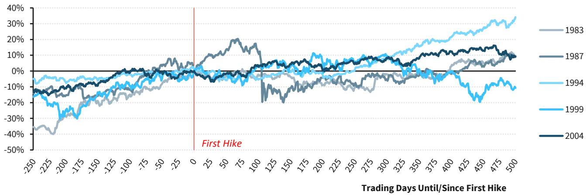
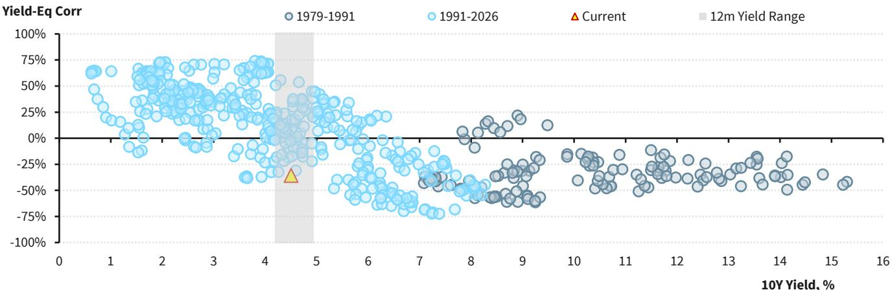

# Earnings Momentum, Not Valuation, Will Drive the Next Leg of the S&P 500 Rally

Equity markets are entering the second half of 2026 with a paradox that demands strategic clarity. The macro environment is more uncertain than it was six months ago, yet the earnings outlook has improved materially. After a volatile first half that saw geopolitical shocks, a software sector disruption, and a private credit scare, the S&P 500 has recovered to within striking distance of its all-time high. The question is not whether the bull market can continue, but what will power it.

The answer is surprisingly straightforward: earnings must do the heavy lifting. With the Federal Reserve unlikely to provide additional tailwinds, valuations already elevated, and market positioning no longer a source of easy upside, the path forward for equities depends almost entirely on whether corporate profits can deliver on their improving trajectory. This is a constructive view, but it comes with a critical caveat: the margin for error has narrowed considerably.

A global investment bank report published in late June 2026 captures this tension precisely. The report upgrades its S&P 500 price target to 7800 from 7650, and raises its FY26 earnings per share estimate to $337 from $321. The logic is clear: earnings visibility has improved enough to offset a modest reduction in valuation assumptions. Yet the report's title -- "Upgrading into Uncertainty" -- is not merely rhetorical. It reflects a deliberate strategy of leaning into the fundamental story while acknowledging that the macro and market backdrop has become more complex.

The argument that follows is not a summary of the report. It is an interpretation of what the report's key moves mean for investors, and an exploration of the strategic decisions that lie ahead. The central thesis is this: the equity market is transitioning from a valuation-driven rally to an earnings-driven one, and the winners will be those who can navigate the dispersion that this transition creates.

## The Earnings Engine Is Firing on All Cylinders, but the Fuel Mix Is Changing

The most important development in the first half of 2026 has been the dramatic improvement in the earnings outlook. The S&P 500 is on track to deliver roughly 21% year-over-year EPS growth in FY26, a pace that would be remarkable in any context, let alone one marked by geopolitical turmoil and persistent inflation concerns. This is not a story of one-off gains or financial engineering. It reflects genuine operating momentum across several key sectors.

Technology earnings have been the standout, with the first quarter of 2026 delivering the strongest EPS growth for the sector since 2010. The beat-and-raise cycle in Big Tech and semiconductors has been running well ahead of historical norms, and upward revisions to full-year consensus estimates are occurring at a record pace. This is not simply a reflection of AI enthusiasm. It is a concrete demonstration that the massive capital spending on AI infrastructure is translating into revenue and earnings growth for a growing swath of the technology ecosystem.

But the earnings story is not limited to technology. The industrial side of the economy is showing surprising resilience, with manufacturing activity expanding and capital spending on energy infrastructure, defense, and supply chain resilience beginning to accelerate. This is creating a second pillar of earnings growth that can partially offset potential weakness in consumer-facing sectors. The report notes that industrial production is on the rise, ISM manufacturing is back in expansionary territory, and the broader investment-to-GDP ratio among advanced economies could rise to levels not seen since the 1990s.

The implication is that the earnings cycle is becoming more diversified. This matters because it reduces the market's dependence on any single narrative. If technology earnings were to face headwinds from AI capex execution risks, the industrial and energy sectors could provide a buffer. Conversely, if consumer spending were to soften more than expected, technology's secular growth could offset the drag.

Yet the fuel mix for this earnings growth is changing in ways that investors need to understand. The first half of the year benefited from a combination of strong nominal revenue growth, operating leverage, and a relatively benign cost environment. Going forward, input costs are rising again, with oil prices expected to average $100 per barrel for the year. Labor markets remain tight, putting upward pressure on wages. And the dollar's trajectory, while uncertain, could become a headwind for multinational earnings.

The report's earnings estimate of $337 for FY26 is modestly below the Street's $341, suggesting that the report's authors are not simply extrapolating the first-half momentum. They are building in some caution about the second half, particularly around consumer spending and the potential for margin compression. This is a disciplined approach, and it underscores the importance of focusing on the quality and sustainability of earnings rather than the headline growth rate.

## Valuations Are Taking a Back Seat, and That Is a Healthy Development

The report's decision to raise the S&P 500 price target to 7800 while simultaneously trimming its valuation assumption from roughly 24x to 23x FY26 EPS is a revealing strategic move. It signals that the report's authors believe the next leg of the rally will be driven by earnings growth, not multiple expansion. This is a fundamentally different regime from the one that characterized much of the post-COVID recovery, when falling interest rates and improving sentiment allowed valuations to expand even as earnings were still recovering.

A 23x multiple on FY26 earnings is not cheap, but it is also not extreme by historical standards, particularly given the current level of interest rates and the composition of the index. The S&P 500 is now more heavily weighted toward high-growth, high-margin technology companies than at any point in its history. These companies command higher multiples for good reason: they generate superior returns on capital, have strong pricing power, and are benefiting from secular tailwinds that are largely independent of the economic cycle.

The more important point, however, is that the report is effectively saying that the easy money from valuation expansion has been made. From here, equity returns will be determined by whether companies can deliver on their earnings promises. This is a healthier dynamic for the market, because it shifts the focus from macroeconomic speculation to microeconomic fundamentals. It rewards stock picking and sector allocation over passive beta exposure.

This shift also has implications for risk management. In a valuation-driven market, the primary risk is a repricing of discount rates, which tends to affect all equities simultaneously. In an earnings-driven market, the risks are more idiosyncratic and sector-specific. A company that misses its earnings guidance will be punished severely, but a company that beats and raises can still generate strong returns even in a flat market.

The report's valuation framework reflects this reality. By assigning Big Tech a lower baseline multiple than in previous updates, the report is acknowledging that the sector's valuation premium is already pricing in a significant amount of good news. Further upside will require continued earnings beats, not just the passage of time. This is a subtle but important distinction, and it suggests that the report is taking a more granular, stock-specific approach to valuation than the headline multiple might suggest.

## The AI Capex Cycle Is a Source of Strength and a Source of Risk

No discussion of the current equity market can avoid the role of artificial intelligence. The report devotes significant attention to the AI investment cycle, and for good reason. The scale of capital spending by hyperscalers is now projected to exceed $1.1 trillion by 2028, according to the report's estimates, which are roughly 26% above consensus. This is not a marginal increase. It is a structural shift in the investment landscape that is reshaping entire industries.

The immediate effect of this capex surge is to provide a powerful tailwind for earnings across the technology supply chain. Semiconductor companies, hardware manufacturers, and data center operators are all benefiting from the surge in demand for AI compute capacity. The report notes that supply-demand imbalances in AI compute are likely to persist well into 2027, providing a degree of visibility to near-term earnings estimates that is unusual in the technology sector.

But the report also raises a critical question that the market has not yet fully grappled with: how will this capex be funded? As the investment cycle extends and deepens, the gap between internally generated cash flow and projected capital requirements is widening. The hyperscalers are responding by expanding their financing toolkit, but this introduces new risks around leverage, interest coverage, and the cost of capital.

The report's reference to the "what-ifs" it debated the previous September is a useful framework for thinking about these risks. The three key uncertainties are model advancement, the availability of power, and the complexity of the financing mix. If AI models fail to improve at the pace that the investment cycle assumes, or if power constraints limit the deployment of new capacity, the return on this massive capital spending could fall short of expectations. Alternatively, if the financing mix becomes too reliant on debt or equity issuance, the cost of capital could rise, compressing returns for shareholders.

These are not hypothetical risks. They are structural features of an investment cycle that is unprecedented in scale and duration. The report's constructive stance on equities implies a belief that these risks will be managed successfully, but it does not dismiss them. This is the right approach. Investors should not ignore the potential for a negative surprise in the AI investment cycle, but they should also not let that potential prevent them from participating in the earnings growth that the cycle is generating today.

## The Consumer Is the Wild Card That Could Determine the Second Half

The report's earnings framework explicitly acknowledges that consumer spending is a potential source of downside risk. Spending data have cooled, real purchasing power gains look more modest at current inflation levels, and the lagged effects of higher interest rates are still working their way through the economy. The report's base case assumes that these headwinds will be offset by strength in the industrial and technology sectors, but the margin of error is narrow.

This is the area where the report's analysis is least definitive, and where investors will need to form their own judgments. The consumer represents roughly two-thirds of U.S. economic activity, and the health of the consumer is the single most important variable for the broader earnings outlook. If the consumer were to weaken more than expected, the earnings growth that the report is projecting would be at risk.

The report's caution on consumer-facing sectors is reflected in its sector recommendations. It maintains a negative view on the consumer space, and it recently downgraded financials and healthcare to neutral. These are not dramatic moves, but they signal that the report sees better opportunities elsewhere. The positive views on TMT, industrials, and utilities suggest that the report is favoring sectors with secular growth drivers or exposure to the industrial investment cycle, rather than sectors that depend on discretionary consumer spending.

The critical question that the report leaves open is whether the consumer slowdown is a cyclical normalization or the beginning of a more structural deterioration. If it is the former, then the industrial and technology sectors can carry the earnings baton until the consumer recovers. If it is the latter, then the earnings outlook for 2027 could be significantly weaker than the report's preliminary estimate of $389, which already implies a deceleration from the 21% growth expected in 2026.

## The Report Leaves a Critical Question Unanswered: What Happens When the Fed Reverses Course?

One of the most striking features of the current macro environment is the possibility that the Federal Reserve could resume raising interest rates before the end of the year. The report notes that markets are already assigning some probability to additional tightening, and it acknowledges that the relationship between yields and equities has turned notably negative. Higher yields are now being read less as a signal of economic strength and more as a constraint on valuations and liquidity.

The report provides historical context suggesting that the prospect of rate hikes has not typically derailed equities ahead of the event. But it also notes that the period following the actual resumption of tightening could be a different story. This is an honest assessment, but it is not a fully developed framework for how investors should position for this scenario.

The report's base case assumes that the Fed will not actually need to hike, and that the current inflation pressures will prove transitory. But the report does not provide a detailed analysis of what would happen to its earnings and price targets if the Fed were to hike rates by 25 or 50 basis points. This is a meaningful gap, because a rate hike would have direct implications for valuation multiples, and it could also affect earnings growth by slowing economic activity.

For investors, this means that the report's constructive view is conditional on a relatively benign inflation and policy outlook. If inflation were to surprise to the upside, or if the new Fed chair were to take a more hawkish stance than expected, the report's price target of 7800 could prove too optimistic. The report's bull case of 8500 and bear case of 6300 provide a range of outcomes, but they do not fully explore the mechanisms through which a rate hike would affect the earnings and valuation assumptions.

## A Decision Framework for Navigating the Earnings-Driven Regime

The report's analysis suggests a clear decision framework for investors. The first step is to recognize that the market has entered an earnings-driven regime, where stock selection and sector allocation matter more than macro positioning. The second step is to focus on sectors where earnings visibility is highest and where the risk of negative surprises is lowest.

The report's sector recommendations provide a starting point. Positive views on TMT, industrials, and utilities suggest that these sectors offer the best risk-reward. The technology sector benefits from the AI capex cycle and strong secular growth. The industrial sector benefits from the broader investment cycle and the recovery in manufacturing. The utilities sector benefits from the demand for power from data centers and the broader electrification trend.

In contrast, the report's negative view on the consumer space and its neutral views on financials and healthcare suggest that these sectors face headwinds that are not fully reflected in current valuations. Consumer spending is slowing, financials are dealing with regulatory and disruption risks, and healthcare is still working through a downward revision cycle.

The third step is to be disciplined about valuation. The report's decision to trim its multiple assumptions is a reminder that even in an earnings-driven market, price matters. Investors should be willing to pay up for earnings growth, but they should also be prepared to reduce exposure if valuations become stretched relative to the underlying fundamentals.

The fourth step is to maintain a margin of safety. The report's earnings estimates are below consensus, and its valuation assumptions are conservative. This is a prudent approach that acknowledges the uncertainty in the outlook. Investors should adopt a similar mindset, building portfolios that can withstand a range of outcomes rather than relying on a single scenario.

## The Full Picture Requires Going Beyond the Headline Numbers

The report's headline conclusions -- a higher price target and a higher earnings estimate -- are important, but they are only the beginning of the story. The real value of the report lies in its detailed analysis of the forces driving earnings growth, the risks to the AI investment cycle, and the changing relationship between yields and equities.

The report leaves several important questions unanswered. What would happen to the earnings outlook if the AI capex cycle were to slow? How would the market react to a Fed rate hike? Can the industrial sector sustain its momentum if global growth weakens? These are not weaknesses of the report; they are the natural boundaries of any forward-looking analysis. The best investors can do is to form their own views on these questions and position accordingly.

For those who want to go deeper, the report offers a wealth of data and analysis that cannot be fully captured in a single article. The charts on earnings revisions, sector-level growth estimates, and the relationship between yields and equity correlations provide a rich foundation for independent analysis. The bull and bear case scenarios offer a framework for stress-testing assumptions.

Join the community to read the full report and review the original charts. The data and analysis contained in the full report will provide the context needed to make informed investment decisions in this complex and evolving environment.

*This article is for learning and discussion only and does not constitute investment advice.*

Personal reading notes and learning share only. Not investment advice.

