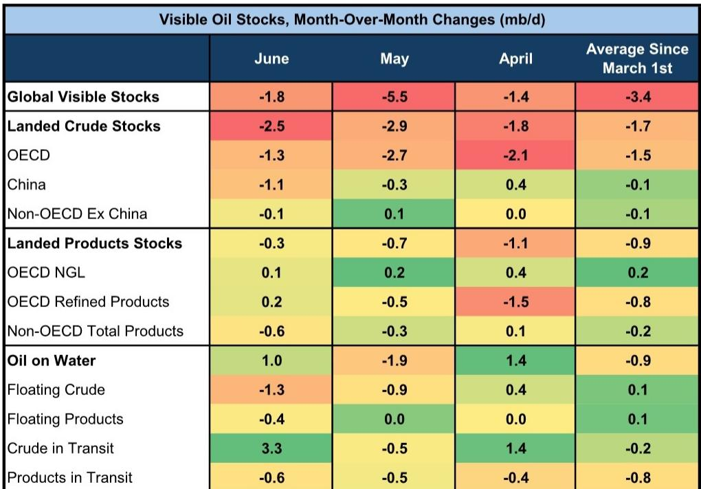
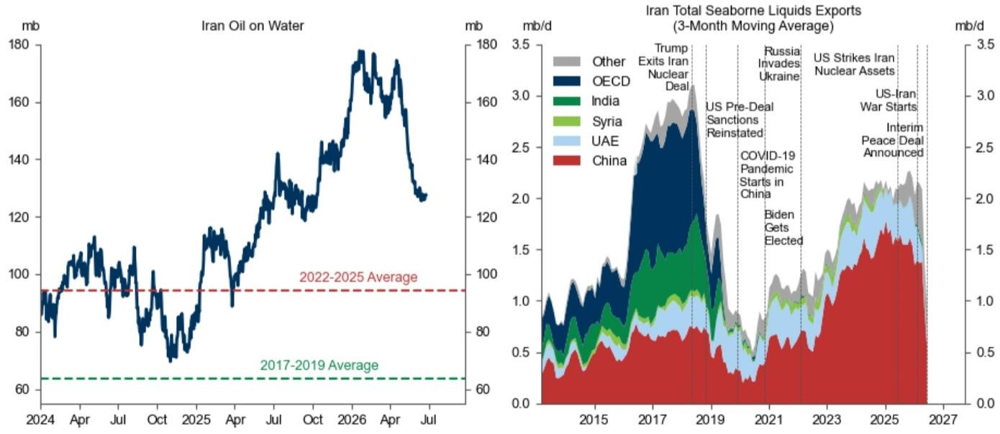
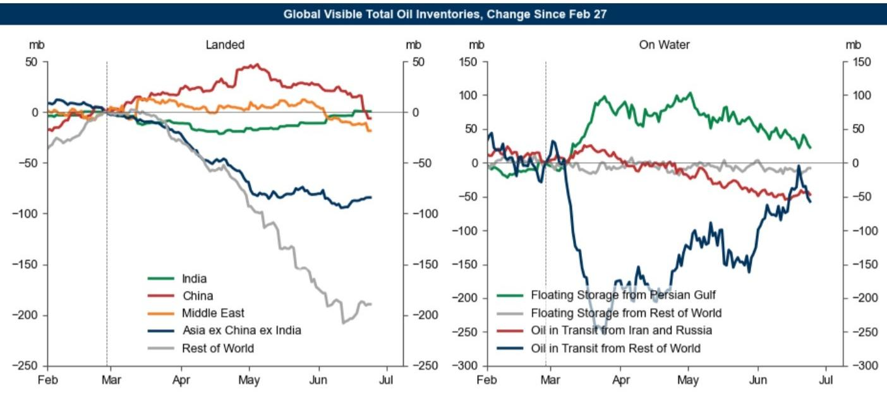

# GS：市场正在快速定价一个未来的供应过剩

这份GS最新发布的《Oil Tracker》报告，在短短一周内捕捉到了一个关键信号：市场情绪和定价逻辑正在发生一次方向性的转变。报告的核心判断并非关于油价本身，而是关于市场如何解读近期的一系列事件。

过去一周，布伦特原油现货价格下跌了8%。直接的触发因素包括美伊谈判取得“重大进展”、波斯湾石油流量显著回升、美国发布授权伊朗石油销售的60天豁免，以及原油持仓的持续下降。但GS认为，这些事件背后更重要的含义是，市场正在从对供应中断的担忧，快速转向对未来供应过剩的定价。

这意味着，油市交易的核心叙事已经切换。投资者不应再仅仅盯着地缘政治事件本身，而需要审视市场如何对这些事件进行“二阶”定价。这份报告提供了一套完整的分析框架，帮助我们理解这种叙事切换的底层逻辑、当前所处的阶段，以及哪些关键变量可能打破这一预期。

> **KC评论：** GS这份报告最有价值的地方，不在于它预测了油价会跌到多少，而在于它指出了市场正在“快进”到对未来供需平衡的定价。这提醒我们，当市场开始为尚未发生的过剩定价时，基于当前现货价格的交易策略可能需要重新审视。完整报告中关于“安全溢价”消退的详细论证，是理解当前市场心态转变的关键。

---

## 1. 波斯湾出口的恢复速度，正在重塑市场对供给弹性的认知

报告中最引人注目的数据是，波斯湾总出口量已恢复到正常水平的63%（以7天移动平均计）。霍尔木兹海峡的可见流量正在快速恢复，这既反映了更多船只的通行，也反映了更多船只重新打开了AIS信号，使得“可见”流量增加。自6月11日以来，霍尔木兹海峡周边未再报告有船只遇袭事件。

这一恢复速度本身就是一个重要信号。此前市场普遍认为，如此大规模的供应中断需要数月甚至更长时间才能恢复。但现实是，在短短几周内，流量恢复已接近三分之二。这直接挑战了市场此前的一个核心假设：即使供应中断风险很高，市场（通过需求弹性和中东供应渠道的灵活性）应对冲击的能力也远超预期。

GS特别指出，阿联酋的出口量据报告已恢复到战前水平的85%。这一数字意味着，即使伊拉克等国的恢复进度稍慢，整体中东供给的恢复速度也可能比机构普遍预期的更快。市场正在为这种“更快恢复”定价。

## 2. 60天豁免与伊朗的“石油浮仓”，是短期最大的不确定变量

美国财政部发布的60天豁免，授权销售伊朗石油，包括此前被制裁船只运输的石油。GS估算，这一豁免可能释放多达约6000万桶的伊朗“在途石油”（oil on water）。这是一个巨大的短期供应增量。

然而，报告对伊朗产量大幅增加的前景持谨慎态度。一个反直觉的论据是：即便在美国“极限施压”期间（2020-2025年），伊朗的石油产量仍增长了130万桶/天（59%）。这说明，美国制裁对伊朗产量增长的约束力可能并没有市场想象的那么强。因此，即使制裁豁免到期后不再续期，伊朗的产量弹性也可能超出预期。

在需求端，亚洲（尤其是中国）仍将是伊朗原油的主要买家，因为欧盟和英国对伊朗石油和船只的广泛制裁依然存在。这意味着，这6000万桶的浮仓，最终流向何方、以何种价格成交，将对亚洲尤其是中国的原油现货市场形成直接压力。

> **KC评论：** 这6000万桶伊朗浮仓，是当前市场一个潜在的“灰犀牛”。它不像新油田投产那样需要数年，而是已经存在于海上，随时可能被释放。报告没有详细展开的是，这些石油的释放节奏和折价幅度，将如何影响亚洲基准油价的定价体系。完整报告中的图2提供了这些浮仓的详细分布，值得仔细研究。

## 3. 全球库存消耗速度急剧放缓，供需正在重新平衡

一个关键的宏观指标是，全球可见库存的消耗速度在6月急剧放缓至-180万桶/天，而5月为-550万桶/天。库存消耗的放缓，直接原因是石油“在途”量的增加——自3月底以来，全球在途石油增加了1.37亿桶，抵消了最初供应中断造成的近60%的库存下降。

这意味着，最紧张的库存消耗阶段已经过去。供应端在恢复，而需求端也在发生变化。报告指出，部分需求损失可能具有粘性，尤其是在亚洲。中国的原油进口量仍在下降，同比减少了450万桶/天，尽管价格已经有所回落。同时，自霍尔木兹危机以来，全球电动汽车渗透率上升了3.4个百分点，中国更是上升了11.4个百分点。这些结构性因素正在削弱未来的石油需求增长预期。

供需两端的此消彼长，使得市场开始将更高的概率赋予GS此前设定的油价下行情景——即布伦特原油到2026年12月约为60美元/桶。

## 4. 美国市场与全球市场的分化，是当前最值得关注的微观结构

在整体看跌的宏观叙事下，报告揭示了一个重要的微观结构分化：美国石油市场是紧的，而全球市场是松的。

数据显示，上周美国石油总库存降至1984年以来的最低水平，而库欣原油库存跌破1900万桶。这与全球其他地区形成鲜明对比。美国市场的紧张，源于其创纪录的出口量。这与3月份美国库存正在累积的情况截然相反。

这种分化意味着，全球油价的下行压力，并非均匀分布。布伦特和迪拜基准价格可能面临更大压力，而WTI则可能因国内基本面紧俏而表现出一定的相对强势。迪拜原油的即期价差已经转为期货升水（contango），而布伦特现货合约相对于其金融合约也出现了折价，这些都是全球市场供应宽松的信号。

> **KC评论：** 美国市场与全球市场的背离，是当前交易中最容易被忽视的结构性特征。它意味着，单纯看空原油的宏观交易，可能会因为WTI的强势而遭遇意外损失。完整报告中的图17详细展示了不同基准原油的价差结构，对于理解不同市场的相对强弱至关重要。

## 5. 报告尚未完全回答的关键问题：需求“疤痕”的深度与广度

尽管GS的报告逻辑清晰，但有一个关键问题它并未完全回答：需求端的“疤痕效应”到底有多深、有多广？

报告提到了中国原油进口的持续下降和全球电动汽车渗透率的加速提升，但这些变化中，有多少是永久性的结构转变，又有多少是暂时的需求破坏？例如，中国原油进口下降，除了电动汽车替代，是否还受到国内经济放缓、炼厂利润压缩或战略储备采购节奏变化的影响？

此外，航空煤油需求在6月同比下降13万桶/天，低于趋势水平6%。这背后有多少是地缘政治紧张导致的航线调整，又有多少是效率提升或商务出行习惯的永久改变？报告没有对这些变量进行深入拆解。

这些未被充分解答的问题，恰恰是未来油价走势的关键分歧点。如果需求端的“疤痕”比预期更浅，那么即使供给恢复，市场也可能不会陷入深度过剩。反之，如果结构性需求下滑加速，那么60美元/桶的下行目标可能都显得保守。

## 6. 一个值得追踪的观察框架：从“安全溢价”到“供给弹性溢价”

GS报告中最具洞察力的部分，是指出市场正在挑战一个此前根深蒂固的假设：远期油价需要包含一个粘性的“安全溢价”（security premium）。这种溢价源于市场认为，地缘政治风险将使长期石油供应成本永久性上升。

但此次危机中，市场展现出的应对能力（需求弹性、中东供给渠道的灵活性）正在侵蚀这一溢价。市场开始意识到，即便面临史上最剧烈的石油供应冲击，系统也能较快地自我修复。如果这一逻辑成立，那么远期油价曲线将面临重估，其重心可能下移。

对于产业决策者和投资者而言，这意味着需要更新自己的观察框架。与其继续押注地缘政治风险带来的溢价，不如将更多注意力放在“供给弹性”上——即当供应中断发生时，替代产能和物流渠道能以多快的速度填补缺口。这一框架的转变，将深刻影响从长期投资决策到短期交易策略的方方面面。

---

**文末说明**

这份GS报告的核心价值，在于它敏锐地捕捉到了市场定价逻辑的切换，并提供了详实的数据来支撑这一判断。但正如我们讨论的，关于需求“疤痕”的深度、伊朗浮仓的释放节奏、以及美国市场紧张能否持续，报告留下了值得继续深挖的空间。

每天我们的AI agent会结合人工review，生成包括GS、MS、JPM等多家国际投行的中文摘要与KC评论，daily更新约10-40页，并整理当天最新的数据图表合集。这些内容既方便直接喂给AI进行二次分析，也方便人工快速把握全球市场的动态变化。如果你对今天讨论的“安全溢价消退”或“美国市场分化”等话题有更深入的兴趣，欢迎加入我们的星球微信群，继续交流讨论。

Personal reading notes and learning share only. Not investment advice.

