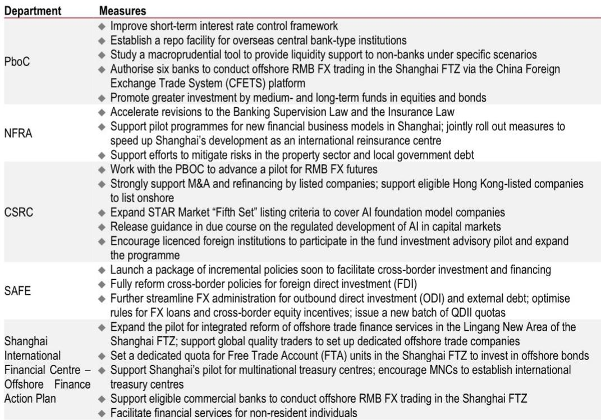
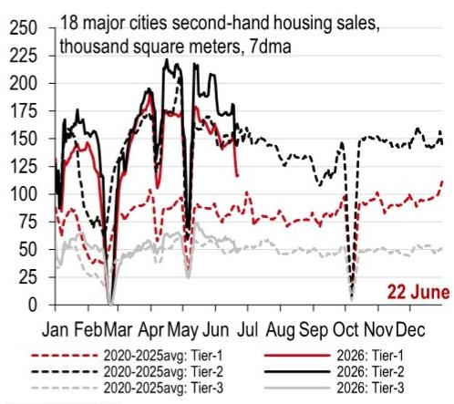
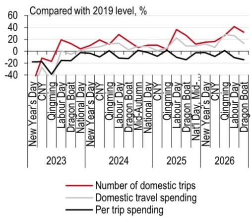

# HSBC：消费谨慎，但资本正在重新发现中国

2026年陆家嘴论坛刚落幕，一份来自HSBC的宏观周报给出了一个看似矛盾、实则逻辑清晰的判断：中国消费端仍然谨慎，但金融开放与外资流入正在形成新的正向循环。

这份报告没有用“复苏”或“放缓”这样的单一标签来概括当前经济。它呈现的是一幅更精细的图景——消费与投资的温差在扩大，政策工具箱在加速重构，而外资对中国的兴趣正在从“成本导向”转向“创新导向”。

如果你只关注端午节人均消费低于2019年14%的数据，可能会得出悲观的结论。但HSBC经济学家提醒我们，另一个信号同样重要：2025年前五个月，近4000家外国企业在华扩大投资，美国对华直接投资同比增长17.3%，沙特投资更是暴增285.5%。

这不是一个简单的“好不好”的问题。这是一个“结构正在被重新定义”的时刻。

> **KC评论：** 很多投资者习惯用消费数据来判断中国经济的温度，但HSBC报告真正想说的是——消费只是拼图的一块。金融开放、外资回流、人民币国际化，这三条线索正在形成一条新的逻辑链。完整报告里有一张“真实FDI”的图表，剔除了所谓的“幽灵投资”，值得仔细看。

---

## 1. 陆家嘴论坛发出的信号：金融开放不再是口号，而是有具体工具支撑

2026年陆家嘴论坛释放的政策信号，其密度和操作性都超出了市场预期。HSBC报告指出，央行、金融监管总局、证监会、外汇局四部门的发言，共同指向一个方向：高水平金融开放正在进入“工具落地”阶段。

最值得关注的不是某个单一政策，而是这些政策背后的逻辑链条。央行推出了面向境外央行的FIMA人民币回购工具，同时调整了临时隔夜回购和逆回购操作工具的利率区间。这意味着什么？人民币的流动性管理工具正在向国际标准靠拢——以隔夜利率作为关键政策利率，这正是美联储等主要央行的做法。

HSBC经济学家判断，今年政策利率大概率保持不变，但工具调整本身为未来提供了更多选择。这就像修路——虽然暂时没有增加车流量，但道路标准已经升级，为未来的提速做好了准备。

> **KC评论：** 很多读者可能觉得“利率走廊收窄到50个基点”是技术细节，但它的实际含义是：央行正在减少短期资金市场的季节性波动。过去每到季末，银行间利率就会“跳一跳”，现在这个波动会被有效控制。完整报告里有图31，清晰展示了这个变化对市场的影响。

---

## 2. 外资流入的逻辑变了：从“成本套利”到“创新协同”

HSBC报告最值得深入解读的部分，是它对FDI结构性变化的分析。过去十年，外资来华的核心逻辑是“低成本制造基地”。但这个逻辑正在被改写。

数据很清楚：2025年，跨国公司在中国绿色field投资的研发支出占比达到14.3%，其中制药行业占全部研发投资的70.8%。这不是来“组装”的，是来做研发的。中国在世界知识产权组织的创新排名中已进入全球前十，这一事实正在改变跨国公司的投资决策。

报告特别提到，中美同意设立投资委员会，识别并澄清非战略性领域的双边投资合作。1-5月美国对华FDI增长17.3%，这个数字在贸易摩擦背景下尤其值得玩味。

> **KC评论：** 很多人担心中美脱钩，但HSBC的数据显示，至少在直接投资层面，美国企业并没有“撤退”。相反，它们正在增加对中国的研发投入。这是一个重要的信号——跨国公司比政治家更务实。完整报告里有两张图（Chart 1和Chart 2），分别展示了中国创新能力和美国投资意愿的变化，值得对比阅读。

---

## 3. 消费的“新常态”：不是不花钱，而是花得更谨慎

端午节的消费数据是报告中最容易引起关注的部分。国内旅游人次同比增长4.4%，总消费增长4%，但人均消费仍比2019年低14%。618电商大促的GMV基本持平，仅从8560亿微增至8640亿。

这些数字说明什么？HSBC的判断是：消费者仍然谨慎。劳动力市场压力和房地产部门的持续拖累是主要原因。但报告没有止步于“消费疲软”这个结论，而是提出了一个更重要的结构性判断——服务业正在成为消费的新引擎。

国家统计局在2026年5月发布了新的商品和服务合并数据，显示服务业增长5.4%，远高于商品消费的1.4%。这意味着，用“零售数据”来判断消费全貌，已经不够了。服务消费——包括数字服务、AI服务、养老、育儿——正在成为新的增长极。

> **KC评论：** 如果你只看618的GMV，可能会觉得消费“凉了”。但HSBC报告提醒我们，消费的结构正在发生变化——人们可能少买一件衣服，但多去一次旅行，或者多花一笔在线教育费用。完整报告里的Chart 4，展示了这个结构变化的时间序列，是理解消费“新常态”的关键。

---

## 4. 财政的“两难”：民生与基建的平衡正在被重新校准

5月财政数据的信号是明确的：支出在放缓。政府性基金支出同比下降11%，主要原因是土地出让收入下滑和专项债发行减速。一般公共预算支出也下降了1.6%。

但结构上更有意思。HSBC报告指出，今年以来的财政支出更多倾斜到了民生领域——包括人力资本、医疗、教育、技能培训。基础设施相关支出（环保、社区事务、农业、交通）的占比在下降。

这符合“投资于人”的长期政策方向。但问题在于，当前固定资产投资（FAI）的疲软正在加剧。报告判断，政策天平可能会重新向投资倾斜。这意味着，下半年专项债发行将加速，资金将更快地落实到项目上。

> **KC评论：** 这是一个经典的“既要又要”困境——长期要投资于人，短期要稳住投资。HSBC的判断是，短期压力会迫使政策重新加码基建。完整报告里的Chart 5和Chart 6，分别展示了财政支出结构的变化和专项债发行的节奏，是判断下半年政策力度的关键。

---

## 5. 报告尚未完全回答的问题：消费何时能“接棒”？

HSBC报告对消费的判断是“谨慎”，但并没有给出一个明确的“何时改善”的时间表。这是报告最诚实的地方，也是最值得追问的地方。

人均消费低于2019年14%，这个缺口需要什么条件才能弥补？劳动力市场的压力何时能缓解？房地产的拖累何时能触底？HSBC报告提供了数据，但没有给出明确的预测。

另一个未完全回答的问题是：外资流入的可持续性。中美投资委员会的成立是一个积极信号，但地缘政治的不确定性仍然存在。沙特投资的暴增是否可持续？美国企业的研发投入能否转化为实际产能？

这些问题的答案，可能需要更多的数据和更长的时间来验证。

---

## 6. 给读者的观察框架：三个维度判断下一阶段

基于HSBC报告的分析，我们建议关注以下三个维度：

第一，金融开放的“工具落地”速度。陆家嘴论坛宣布的措施只是开始，关键是后续的执行。FIMA回购工具的实际使用量、跨境投资便利化的具体案例，都是可追踪的指标。

第二，外资R&D投资的趋势。制药行业已经占到研发投资的70.8%，这个比例是否会继续扩大？其他行业（如半导体、新能源）是否在跟进？这是判断中国创新吸引力的核心指标。

第三，财政政策的“再平衡”速度。下半年专项债发行是否加速？资金是否真正落实到基础设施项目？这决定了FAI能否企稳，进而影响整体经济动能。

---

这三个维度，每一个在HSBC的完整报告中都有更详尽的数据和图表支撑。但即使只看这份周报的摘要，一个清晰的判断已经浮现：中国正在经历一场“消费慢、开放快、投资变”的结构性调整。对于决策者来说，关键不是押注单一变量，而是理解这些变量之间的互动逻辑。

如果你想看到完整的图表分析、数据追踪和每周更新，欢迎加入我们的社群。每天，我们的AI agent和人工团队会从全球顶级投行（GS、MS、HSBC、JPM等）的最新报告中，提炼出最核心的判断和图表，整理成10-40页的中文摘要。既方便你喂给AI模型做深度分析，也方便人工快速把握市场的真实动态。

这里没有噪音，只有经过筛选的信息和持续的讨论。

Personal reading notes and learning share only. Not investment advice.

