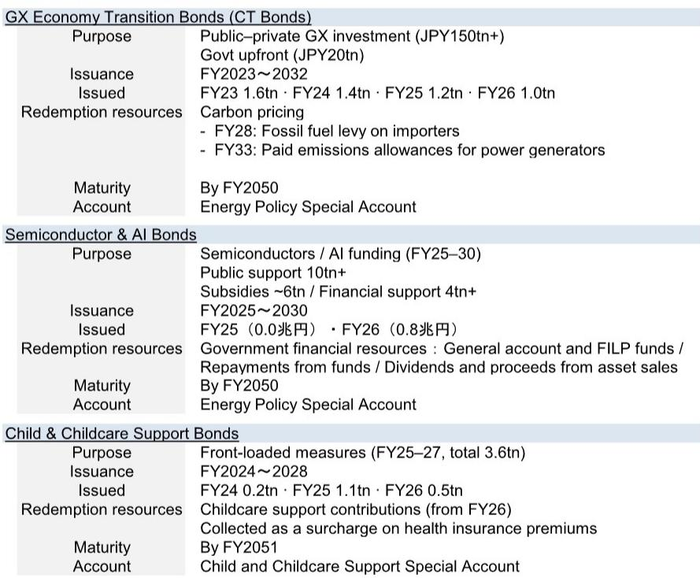
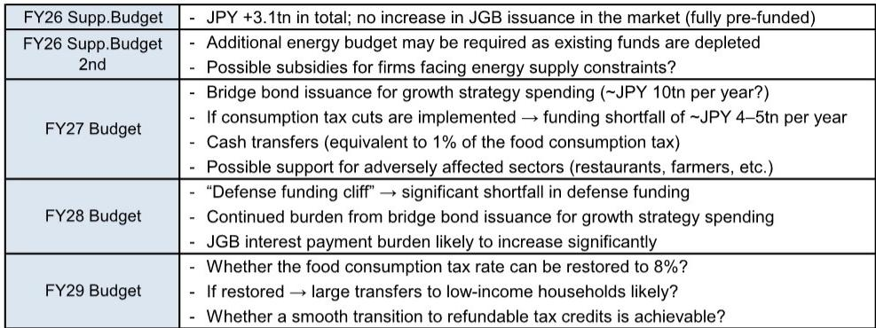
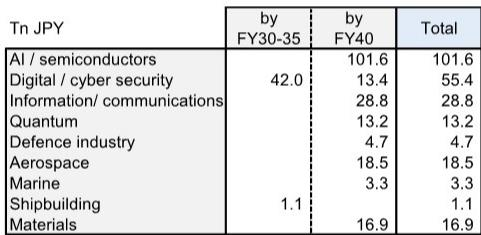

# Japan's JPY 370 Trillion Investment Plan Will Test the Bond Market's Capacity for Fiscal Ambition

Japan's new public-private investment framework, targeting over JPY 370 trillion across 17 sectors by FY2040, represents the most ambitious industrial policy signal in decades. But the real story is not the headline number—it is the unresolved tension between growth strategy and fiscal sustainability that will define Japanese government bond markets for years to come. The Takaichi administration is betting that government spending can catalyze private capital without triggering a bond market crisis, yet the mechanics of this plan reveal a structural challenge that no amount of special account accounting can fully contain.

The framework, unveiled at the joint meeting of the Council on Economic and Fiscal Policy and the Japan Growth Strategy Council, centers on AI and semiconductors at JPY 186 trillion and biotechnology at JPY 98 trillion. These are not modest targets. They represent a deliberate shift from Japan's post-bubble caution toward a state-led growth model reminiscent of earlier developmental strategies. The government's stated mechanism—using public spending as a catalyst for private investment—sounds prudent in theory. In practice, the scale implies fiscal commitments that could overwhelm the Ministry of Finance's capacity to manage JGB issuance expectations.

This matters now because the plan is not hypothetical. The "Strong and Prosperous Japan" investment framework is scheduled for introduction from FY2027, with no upper limit on ministry budget requests for growth-related spending. Simultaneously, Japan faces accumulating fiscal pressures: energy subsidy extensions, consumption tax reform proposals, and a defense spending trajectory that will reach 2% of GDP. The bond market must absorb all of this concurrently. The question is not whether Japan can afford this plan, but whether the market will continue to finance it at current yield levels.

## The Government's 15% Share Assumption Understates the Real Fiscal Risk

The report draws a useful comparison to the GX investment framework, where government upfront spending of JPY 20 trillion over 10 years was designed to induce total public-private investment exceeding JPY 150 trillion. That implies a government share of approximately 15%. Applying the same ratio to the JPY 370 trillion target yields annual government spending of roughly JPY 4 trillion over FY2027–2040.

This comparison is analytically neat but strategically misleading. The GX framework had clearly defined redemption resources through carbon pricing mechanisms—a fossil fuel levy from FY2028 and paid emissions allowances from FY2033. The new investment framework's redemption resources remain unspecified. The bridge bonds that will fund this spending are to be repaid using "future revenues," but those revenues have not been identified. This is not a minor detail. It is the difference between a self-financing investment program and an open-ended fiscal expansion.

More concerning, the government's own simulations included in the report's materials assume fiscal spending of around JPY 10 trillion per year, not JPY 4 trillion. This alternative scenario still projects a declining debt-to-GDP ratio, but only under optimistic assumptions about growth and inflation. The gap between JPY 4 trillion and JPY 10 trillion is not a forecasting error—it is a policy choice that has not yet been made. The bond market must price in the possibility that actual spending will trend toward the higher end, particularly given the political incentives for a growth-oriented administration.

## Special Accounts Preserve Fiscal Form but Not Fiscal Substance

The plan to manage the new investment framework through a special account, separate from the General Account, is a familiar Japanese fiscal technique. Special accounts have been used for GX Economic Transition Bonds, Semiconductor and AI Bonds, and Childcare Support Bonds. They allow the government to claim that the General Account primary balance remains undisturbed, which is technically true but economically irrelevant.

The bond market cares about total JGB issuance, not which account records the liability. When bridge bonds are issued through a special account, they still represent sovereign debt that must be serviced and ultimately refinanced. The Ministry of Finance may argue that special account bonds do not count toward the same fiscal discipline metrics, but investors will treat them as equivalent to General Account bonds for credit risk purposes. The distinction matters for accounting conventions, not for market pricing.

The report correctly notes that bridge bond issuance to date has been relatively limited: GX bonds totaling JPY 5.2 trillion over FY2023–2026, Semiconductor and AI bonds at JPY 0.8 trillion, and Childcare bonds at JPY 1.8 trillion. These are manageable figures in a JGB market that issues over JPY 200 trillion annually. But if the new framework requires JPY 10 trillion per year in bridge bond issuance, the cumulative supply pressure becomes qualitatively different. The bond market is not infinitely elastic, and the Bank of Japan's gradual reduction of its JGB holdings adds another dimension to the supply-demand imbalance.

## The Convergence of Multiple Fiscal Pressures Creates a Compound Problem

The report identifies four simultaneous fiscal expansion factors that will compound through FY2029. This is not a sequential set of challenges that can be addressed one at a time. They are concurrent, and their interaction creates risks that are greater than the sum of their parts.

First, the public-private investment framework itself will require bridge bond issuance beginning in FY2027. Second, energy subsidies from the first supplementary budget of JPY 3.1 trillion may require a second supplementary budget as gasoline subsidy funds are depleted. Third, the proposed consumption tax reduction on food to 7% from April 2027, combined with cash transfers to low- and middle-income households, carries an estimated fiscal cost of JPY 5 trillion annually. Fourth, defense spending, already at JPY 9.0 trillion in the FY2026 initial budget, faces a "defense funding cliff" beyond FY2028 when existing financing schemes expire.

The critical insight from the report is that these pressures converge in FY2027–2028. This is precisely when the new investment framework begins, when consumption tax cuts would take effect, and when defense funding gaps emerge. The Ministry of Finance will face a calendar of JGB issuance decisions that could overwhelm its traditional capacity to manage market expectations through auction scheduling and maturity distribution.

## What the Report Does Not Fully Answer: The Redemption Mechanism and the Exit Strategy

The report leaves two analytical gaps that readers must consider carefully. First, the redemption resources for the new bridge bonds are not specified. The GX bonds have carbon pricing. The Semiconductor and AI bonds rely on general account transfers and proceeds from asset sales. The Childcare bonds use health insurance surcharges. What will back the "Strong and Prosperous Japan" bonds? Without a credible redemption mechanism, these bonds represent pure fiscal expansion with no self-correcting feature.

Second, the exit strategy for the consumption tax reduction is unclear. The proposal envisions a two-year reduction from April 2027, but the report raises legitimate concerns about whether the rate can be restored to 8% after two years. Tax cuts have a tendency to become permanent, and the political economy of restoring a consumption tax increase is notoriously difficult. If the tax cut becomes permanent, the fiscal hole widens by JPY 5 trillion annually on an ongoing basis.

These unanswered questions are not criticisms of the report. They reflect genuine policy uncertainty that investors must incorporate into their assessment of Japanese sovereign risk. The government has presented a vision, but the implementation details—particularly the funding mechanisms and exit strategies—remain works in progress.

## A Decision Framework for Investors Evaluating Japan's Fiscal Trajectory

For readers who need to translate this analysis into actionable investment positioning, three scenarios provide a useful framework.

Scenario One: Fiscal Discipline Prevails. In this scenario, actual government spending under the new framework stays closer to the JPY 4 trillion annual estimate derived from the GX analogy. The Ministry of Finance successfully manages JGB issuance through maturity extension and auction calendar adjustments. The consumption tax reduction is temporary and reversed after two years. Defense spending growth moderates. Under this scenario, JGB yields remain range-bound, and the steepening pressure from supply concerns is contained.

Scenario Two: Gradual Fiscal Expansion. Here, government spending trends toward JPY 6–7 trillion annually, between the conservative estimate and the upper-bound simulation. The consumption tax reduction becomes difficult to reverse, adding structural fiscal pressure. Defense spending reaches 2% of GDP by FY2029 as planned. The Bank of Japan continues its gradual reduction of JGB holdings. Under this scenario, JGB yields face upward pressure, particularly at the long end, and the yield curve steepens as term premiums rise.

Scenario Three: Full Fiscal Ambition. In this scenario, government spending reaches the JPY 10 trillion annual level implied by the government's own simulations. Multiple supplementary budgets are required for energy subsidies. The consumption tax reduction becomes permanent. Defense spending exceeds 2% of GDP. The Ministry of Finance's capacity to manage market expectations is overwhelmed by the sheer volume of issuance. Under this scenario, JGB yields rise significantly, and the risk of a "taper tantrum" style selloff in Japanese government bonds becomes material.

The report provides the analytical foundation for investors to monitor which scenario is unfolding. The key indicators are the FY2027 budget proposal, the July Basic Policy announcement, and any changes to JGB issuance plans from the Ministry of Finance. These will reveal whether the gap between JPY 4 trillion and JPY 10 trillion narrows toward the higher or lower end.

## The Bond Market's Verdict Will Come Before the Policy's Results

The most important implication of this report is temporal. The investment framework's benefits—higher potential growth, industrial competitiveness, and tax revenues—will materialize over years and decades. The bond market's judgment on the fiscal costs will come immediately, as issuance plans are announced and absorbed.

This asymmetry creates a vulnerability. If the market concludes that fiscal discipline is deteriorating, yields can rise before any growth benefits are realized. Higher yields would increase the government's interest payment burden, potentially crowding out the very investment the framework is designed to encourage. The Ministry of Finance's traditional tools—maturity extension, auction calendar management, and communication strategy—may prove insufficient if issuance volumes reach the upper end of the range.

The report's conclusion that "a better balance between expansionary and more prudent fiscal policy will be required" is understated. The balance is not just about policy design. It is about market confidence. Japan has enjoyed extraordinarily low JGB yields for decades, supported by domestic institutional demand and Bank of Japan accommodation. As the Bank of Japan normalizes policy and reduces its holdings, the market's capacity to absorb additional supply without higher yields becomes the binding constraint.

The Takaichi administration's growth strategy is ambitious and potentially transformative. But its success depends not just on the quality of investment projects, but on the market's willingness to finance them at reasonable cost. That willingness cannot be assumed. It must be earned through credible fiscal frameworks, transparent funding mechanisms, and a demonstrable commitment to long-term sustainability. The report suggests that these elements remain works in progress.

Join the community to read the full report and review the original charts.

*This article is for learning and discussion only and does not constitute investment advice.*

Personal reading notes and learning share only. Not investment advice.

