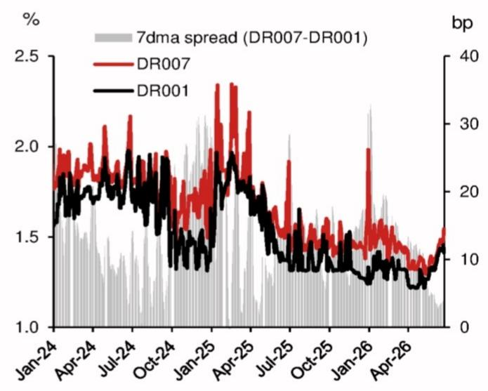
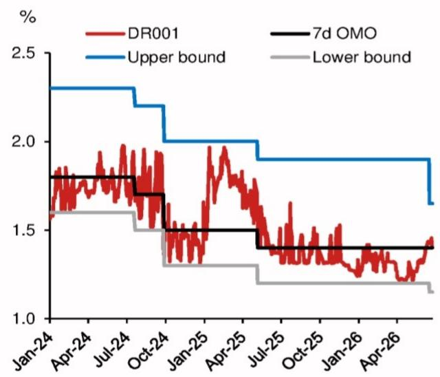

# China’s Overnight OMO Is a Quiet Revolution in Monetary Policy Transmission, Not a Signal of Easing

The People's Bank of China announced on June 29 that it will add overnight reverse repurchase agreements to its open market operations for a two-day window at the end of the second quarter. This is not a minor technical tweak. It is the most consequential operational reform to China's monetary policy toolkit in years, and it signals a deliberate convergence toward the price-based frameworks used by the Federal Reserve, the European Central Bank, and the Bank of Japan.

The timing matters. The announcement comes just twelve days after PBoC Governor Pan Gongsheng outlined a series of refinements to the interest rate corridor at the Lujiazui Forum. The speed of execution suggests this reform has been in preparation for some time, and that the central bank is eager to demonstrate its commitment to modernizing its policy framework. Yet the initial deployment is deliberately narrow: confined to two days, using a fixed-rate quantity-bid mechanism, and set at a time of known seasonal funding stress.

Why should investors care? Because the overnight rate is the de facto anchor for short-term funding costs across China's interbank market. Overnight repos consistently account for the dominant share of transaction volume. Until now, the PBoC's primary operational instrument has been the 7-day reverse repo rate, creating a structural mismatch between the policy tool and the market's actual funding tenor. This reform closes that gap. The implications extend far beyond the mechanics of liquidity management. They touch on the credibility of the PBoC's policy signals, the transmission of monetary policy to the real economy, and the trajectory of interest rate liberalization in China.

The controlling idea is this: the PBoC is not easing. It is upgrading the transmission mechanism. Investors who interpret this as a precursor to broad-based rate cuts risk misreading the central bank's intentions. The overnight OMO rate is likely to be set around 1.30-1.35%, lower than the current 7-day OMO rate of 1.40%, but that is a function of the term spread, not a policy pivot. The central bank has maintained its forecast of no reserve requirement ratio or rate cuts for this year.

## The New Corridor Is Narrower, Symmetric, and Designed for Clarity, Not Stimulus

The most visible change in Governor Pan's Lujiazui announcement was the adjustment of the interest rate corridor. The temporary overnight repo and reverse repo rates will now be set at 25 basis points above and 25 basis points below the 7-day OMO rate, respectively. Previously, the corridor was asymmetric: 50 basis points above and 20 basis points below. This shift to a narrower, symmetric corridor is not a marginal adjustment. It is a deliberate design choice that enhances the signal value of the policy rate.

A symmetric corridor means that deviations above and below the target rate carry equal weight in the central bank's reaction function. This reduces ambiguity about the PBoC's tolerance for rate volatility. Under the old asymmetric corridor, the upper bound was wider, which implicitly allowed more upward drift in rates before triggering a policy response. The new structure compresses that tolerance band. It tells the market that the PBoC expects the overnight rate to stay closer to the policy anchor.

The downward shift of the corridor is also significant. The lower bound has moved from 20 basis points below the 7-day OMO rate to 25 basis points below. This does not constitute easing, but it does indicate that the PBoC's tolerance for ample liquidity has marginally increased. The context is important. In April and May, the DR001 rate was trading very close to the previous lower bound of approximately 1.2%. That prompted the PBoC to withdraw some medium-term liquidity. The new corridor gives the overnight rate more room to fluctuate without triggering a policy response, but it does not change the central bank's stance on aggregate accommodation.

The operational time window has also been adjusted to 15:00-15:30 from the previous 16:00-16:20. This is a practical improvement. The old window was too close to the interbank market close, leaving institutions with insufficient time to match positions and adjust funding. The new window gives market participants a meaningful opportunity to respond to the central bank's operations, which should reduce sharp intraday funding fluctuations. This is a technical improvement with real market implications.

## The Overnight OMO Formalizes What the Market Already Prices, Closing a Structural Tenor Mismatch

The introduction of overnight reverse repo operations is best understood as a formalization of existing market dynamics, not a departure from them. Overnight repos, priced off the DR001 and R001 benchmarks, consistently account for the predominant share of interbank repo market transactions by volume. The overnight rate is the de facto anchor for short-term funding costs across the Chinese financial system. Yet the PBoC's primary operational instrument has been the 7-day reverse repo rate.

This created a structural tenor mismatch. The central bank was signaling its policy stance through a seven-day instrument, but the market was transacting overwhelmingly at overnight tenors. The signal was subject to interpretation. Market participants had to infer the overnight policy intention from the seven-day rate, adjusting for term premia, seasonal effects, and liquidity conditions. The introduction of overnight operations eliminates this interpretive layer. The policy rate and the market rate will now be aligned by tenor.

Governor Pan signaled this intention at the Lujiazui Forum on June 17, stating that the PBoC would enrich the open market operations toolkit and introduce overnight reverse repo instruments at an appropriate time. The announcement on June 29 delivers on that commitment with notable speed. But the initial deployment is confined to just two days at the end of the second quarter, a period typically characterized by acute interbank funding squeezes and elevated rate volatility as banks scramble to meet regulatory assessments.

This raises an important question: is this a targeted quarter-end stabilizer, or the first step toward a standing overnight facility? The answer will be a key signal for the trajectory of the PBoC's monetary policy framework reform. If the operations are extended to a regular schedule in the third quarter, it will confirm that the central bank is committed to making the overnight rate the primary operational target. If the operations remain confined to quarter-end windows, the reform will be more limited in scope.

## This Reform Brings China's Monetary Framework Closer to Global Central Bank Practice, with Important Differences

The operational shift toward an overnight anchor brings China's monetary policy architecture into closer convergence with those of the world's leading central banks. The Federal Reserve targets the overnight federal funds rate. The European Central Bank anchors policy to the overnight euro short-term rate. The Bank of Japan operates through the uncollateralized overnight call rate. In each case, the overnight rate serves as the primary transmission mechanism through which policy intentions are communicated to the broader financial system.

By establishing a 50-basis-point corridor around the overnight rate and committing to trigger operations when DR001 deviates persistently from the policy rate, the PBoC is adopting a comparable price-based framework. This is a significant departure from the quantity-based approach that characterized Chinese monetary policy for decades. It reflects a broader trend toward interest rate liberalization and market-based policy transmission.

But there are important differences. The PBoC's corridor is wider than the Federal Reserve's 25-basis-point corridor around the federal funds rate. The trigger mechanism is discretionary, not automatic. And the initial deployment is temporary, not standing. These differences reflect the PBoC's cautious approach to reform. The central bank is testing the new framework before committing to it fully.

The convergence with global practice also has implications for cross-border capital flows and renminbi internationalization. A more transparent and market-based monetary policy framework reduces uncertainty for foreign investors. It makes Chinese financial markets more predictable and easier to hedge. This is particularly relevant as China continues to open its bond and equity markets to foreign participation. A clear policy rate anchor is a prerequisite for deeper integration into the global financial system.

## The Overnight OMO Rate Is Likely to Be Set at 1.30-1.35%, but This Is Not a Rate Cut

A critical question for market participants is the level at which the overnight OMO rate will be set. Some observers expect it to match the 7-day OMO rate of 1.40%, citing the PBoC's guidance that DR001 should be anchored to the 7-day OMO rate. But this interpretation misunderstands the relationship between term spreads and policy rates.

The average spread between DR007 and DR001 has been approximately 12 basis points over the past 12 months and 8 basis points over the past three months. Applying this term spread to the current 7-day OMO rate of 1.40% yields an overnight OMO rate in the range of 1.30-1.35%. This is consistent with the observed market dynamics and with the PBoC's stated approach of setting rates based on the interbank yield curve.

It is important to understand that a lower OMO rate under a shorter maturity does not imply a policy rate cut. The overnight rate is structurally lower than the seven-day rate because of the term premium. Setting the overnight OMO rate at 1.30-1.35% simply reflects this structural relationship. It does not signal that the PBoC is reducing its policy accommodation.

The central bank has maintained its forecast of no reserve requirement ratio or rate cuts for this year. This forecast is consistent with the introduction of overnight operations. The reform is about the transmission mechanism, not the policy stance. Investors who interpret the overnight OMO rate as a signal of easing are likely to be disappointed.

That said, the report leaves an important question open: what happens if global oil prices continue to retreat and ease pressures on other major central banks to raise rates? Under those conditions, the PBoC may become more likely to deliver a moderate rate cut toward the end of the year. The overnight OMO reform does not change this calculus, but it does improve the transmission of any future rate cut. The new framework ensures that a change in the policy rate will be transmitted more efficiently to the market.

## What the Report Does Not Fully Answer: The Path from Temporary to Standing Operations

The report provides a detailed analysis of the PBoC's operational reforms, but it leaves several important questions unanswered. The most critical is the transition path from temporary to standing overnight operations. The initial deployment is confined to two days at the end of the second quarter. Will the PBoC extend these operations to a regular schedule in the third quarter? Will the operations be triggered automatically based on market conditions, or will they remain discretionary? Will the central bank eventually introduce a standing overnight repo facility, similar to the Federal Reserve's overnight reverse repo facility?

The answers to these questions will determine the significance of this reform. A standing overnight facility would represent a fundamental shift in the PBoC's operational framework. A targeted quarter-end stabilizer would be a useful but limited improvement.

The report also does not address the interaction between the overnight OMO and the medium-term lending facility. The MLF has been the primary tool for managing medium-term liquidity. If the overnight rate becomes the primary operational target, what happens to the MLF? Does it become redundant, or does it retain a separate function? The report does not provide a clear answer.

Finally, the report does not fully explore the implications for the renminbi exchange rate. A more transparent and market-based monetary policy framework should reduce uncertainty for foreign investors, but it also exposes the Chinese financial system to greater volatility from capital flows. The PBoC's ability to manage this tension will be tested.

## A Decision Framework for Investors: How to Interpret the PBoC's Next Moves

For investors trying to navigate this reform, a structured decision framework is essential. The key variables to monitor are the frequency of overnight operations, the width of the corridor, and the relationship between the overnight OMO rate and the 7-day OMO rate.

First, monitor the frequency. If the PBoC extends overnight operations to a weekly or daily schedule in the third quarter, it will confirm that the central bank is committed to making the overnight rate the primary operational target. If the operations remain confined to quarter-end windows, the reform is more limited.

Second, monitor the corridor width. The current 50-basis-point corridor is wider than the Federal Reserve's 25-basis-point corridor. If the PBoC narrows the corridor over time, it will signal increasing confidence in the new framework and a desire to enhance the signal value of the policy rate.

Third, monitor the term spread between the overnight OMO rate and the 7-day OMO rate. If the spread remains consistent with the observed market term premium, it will confirm that the reform is about transmission, not easing. If the spread narrows significantly, it would suggest that the PBoC is using the overnight rate to signal a policy shift.

The most important signal will come from the PBoC's own communication. Governor Pan's remarks at the Lujiazui Forum provided a clear roadmap. The central bank's quarterly monetary policy reports will provide further guidance. Investors should pay close attention to the language around the overnight OMO in these reports.

Join the community to read the full report and review the original charts.

*This article is for learning and discussion only and does not constitute investment advice.*

Personal reading notes and learning share only. Not investment advice.

