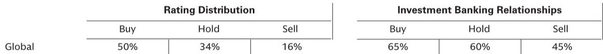

# The European Utility Sector’s Underperformance Is About to End: The Earnings Super-Cycle Has Already Begun

For investors watching European utilities, the past several months have been a study in cognitive dissonance. On one hand, the sector is undergoing what can only be described as a structural transformation—the most significant since deregulation. On the other hand, utility stocks have underperformed, punished by a market that has been fixated on rising interest rates and the macroeconomic implications of the Middle East conflict. This divergence between price action and fundamental reality cannot persist.

The conventional narrative holds that a potential peace deal in the Strait of Hormuz would prolong utility underperformance, as capital rotates into cyclically exposed sectors and commodity prices fall. That thesis is dangerously short-sighted. It mistakes a temporary headwind for a permanent condition. In fact, the very forces that have caused recent underperformance—rising cost of capital concerns and commodity price volatility—are about to recede, and when they do, the market will be forced to reckon with what has been building beneath the surface.

We are approaching a decisive turning point. The sector is on the verge of being de-risked, and the entry window for a multi-year structural story is opening. The data is clear: power demand growth has turned positive for the first time in years, data centers are flooding Europe with connection requests totaling roughly 500 gigawatts, and the electricity infrastructure deficit has reached crisis proportions. This is not a cyclical recovery. This is the beginning of an earnings super-cycle.

The question is not whether utilities will outperform. The question is whether investors will have the conviction to act before the market reprices the entire sector.

## The Market Is Confusing a Temporary Rotation with a Structural Problem

The logic behind recent utility underperformance is straightforward, but it is also incomplete. When the Middle East conflict first erupted, utilities outperformed as investors sought defensive names and bet on rising power prices and energy security. That phase was short-lived. As expectations about the duration of the conflict lengthened, the market shifted its focus to rising interest rates and the rising cost of capital. Utilities, being capital-intensive and interest-rate-sensitive, suffered.

A potential peace deal could temporarily extend this underperformance. The reasoning: capital would rotate into sectors that benefit directly from the re-opening of the Strait of Hormuz, and a sharp fall in commodity prices would pressure independent power producers and renewable developers. This logic is correct in the short term, but it misses the forest for the trees.

The mistake is treating the current rotation as a signal about the sector's long-term prospects. It is not. It is a mechanical, liquidity-driven move that will exhaust itself. The forces that will drive utility performance over the next three to five years—electrification, data center demand, infrastructure deficit, and rising returns on capital—are entirely unrelated to the path of Middle East diplomacy. Once the market digests the peace deal, attention will return to fundamentals. And those fundamentals are the strongest they have been in a generation.

The key insight is that the sector's correlation with the cost of capital and commodity prices is weakening. This is not an opinion. It is a structural shift driven by the changing composition of utility earnings. As regulated networks and contracted renewables become a larger share of the profit mix, the sensitivity to interest rates and power prices declines. The market has not yet priced this shift.

## Five Structural Drivers Are Converging to Create an Unprecedented Demand Cycle

The case for a utility earnings super-cycle rests on five mutually reinforcing drivers, each of which is accelerating independently. Collectively, they represent a demand shock that the industry has not experienced since the post-war buildout.

First, power demand growth has turned positive for the first time since 2025 and is accelerating. The driver is electrification, particularly in the retail sector, where heat pumps and electric vehicles continue to gain market share. This is not a theoretical projection. It is happening now, and it is pulling electricity consumption higher across the European Union.

Second, data centers are arriving in Europe at scale. There are currently 20 gigawatts of data center capacity under construction, already reaching final investment decisions or nearly fully authorized. The connection requests flooding the grid are staggering: our latest projection puts the total at roughly 500 gigawatts, which is equivalent to 1.5 times the European Union's current total electricity consumption. As AI agent adoption rates rise, this demand will only intensify. Our estimate is that data centers alone could drive annual power consumption growth of 1.5 to 2 percent starting in 2028-2029.

Third, the electricity infrastructure deficit is widening rapidly. Power grids in Europe are on average 40 years old, and power plant retirements are beginning to accelerate. This is not a situation that can be addressed with marginal upgrades. It requires a systematic rebuild of the transmission and distribution network, which in turn supports higher returns for both renewables and flexible generation assets.

Fourth, the investment requirements are enormous. We estimate that European electrification will require between 2.5 and 3.5 trillion euros over the coming decade, depending on the trajectory of power demand. To put that in perspective, the previous decade saw roughly 1.5 trillion euros in investment. The doubling of capital deployment will create a sustained tailwind for the entire value chain, from grid operators to renewable developers to flexible generation providers.

Fifth, returns in US renewables are currently the highest in history, with project IRRs in the range of 10 to 11 percent. Domestic renewable assets continue to trade at a major discount to replacement cost, creating a compelling entry point for European players with US exposure. This dynamic is particularly important because it provides a natural hedge against any slowdown in European regulatory support.

These five drivers are not independent. They reinforce each other. Higher demand justifies more investment. More investment improves returns. Higher returns attract more capital. The result is a virtuous cycle that will sustain earnings growth well into the 2030s.

## The Earnings Super-Cycle Will Drive Multiple Expansion, Not Just Earnings Growth

Most investors think of utility stocks as low-growth, high-yield instruments. That framework is about to become obsolete. The combination of rising power demand, infrastructure deficit, and investment needs is creating conditions for an earnings super-cycle that will fundamentally change how the sector is valued.

For the main electrification compounders, we estimate high single-digit to low double-digit average earnings growth into the 2030s. This is not a one-time boost. It is a sustained re-rating of the earnings power of the sector. When investors begin to see this reflected in actual results, the earnings revisions will be substantial.

The implications for valuation are significant. Historically, utility stocks have traded at a discount to the broader market because their growth prospects were limited. That discount is no longer justified. As the market recognizes the structural nature of the demand cycle, multiples should expand. The sector's correlation with the cost of capital will weaken further, reducing the volatility that has historically kept valuation multiples compressed.

This is not a call for a short-term bounce. It is a call for a structural re-rating that will play out over several years. The earnings super-cycle will be the mechanism that forces the market to update its assumptions.

## The Report Raises a Critical Question It Does Not Fully Answer

For all its analytical rigor, the report leaves one important question unresolved: how will the market distinguish between winners and losers as the super-cycle unfolds?

The report identifies several names that are well-positioned: Enel, with its grid-heavy earnings mix and underappreciated organic growth; RWE and EDPR, with their US renewable exposure and discount to replacement value; and Naturgy, with its re-leveraging potential and pivot toward electricity activities. But the reality is that not all utilities will benefit equally. Some will be constrained by balance sheet capacity. Others will face execution risk in their renewable pipelines. Still others will be held back by regulatory regimes that are less supportive.

The unanswered question is whether the market will reward the sector broadly or whether it will be highly discriminating. The answer has significant implications for portfolio construction. If the market treats all utilities as beneficiaries of the same tailwind, then the simplest strategy is to buy the sector. But if the market differentiates based on capital allocation skill, regulatory exposure, and growth visibility, then stock selection will be the primary driver of returns.

Our view is that the market will eventually become more discriminating, but not immediately. The initial phase of the re-rating will likely be broad-based, as investors rush to gain exposure to the theme. The second phase will be more selective, as earnings reports reveal which companies are actually delivering on the promise. This creates a potential opportunity for active investors to position ahead of the differentiation.

## A Decision Framework for Navigating the Turning Point

For investors trying to act on this thesis, the key is to distinguish between three categories of exposure: structural compounders, cyclical beneficiaries, and value traps.

Structural compounders are companies where the earnings super-cycle is already embedded in the business model. These are the grid-heavy utilities with regulated or contracted revenue streams, visible investment pipelines, and demonstrated capital allocation discipline. They should be the core of any utility allocation. The key metric to watch is the ratio of regulated to merchant earnings. The higher the regulated share, the more predictable the growth and the lower the sensitivity to interest rates and commodity prices.

Cyclical beneficiaries are companies that will benefit from the demand cycle but have more exposure to merchant power prices and commodity markets. These include independent power producers and renewable developers with significant uncontracted exposure. They offer higher upside in a rising power price environment but carry more risk if the cycle disappoints. They should be used as tactical complements to the core holding, not as substitutes.

Value traps are companies that appear cheap but lack the structural drivers to generate sustainable growth. These are typically utilities with aging asset bases, limited investment pipelines, and high exposure to declining thermal generation. The low valuation is not a signal of opportunity. It is a reflection of the market's correct assessment of their terminal value.

The decision framework is simple: overweight structural compounders, use cyclical beneficiaries for alpha, and avoid value traps. The turning point we are approaching is an opportunity to upgrade portfolio quality, not to chase the most distressed names.

## The Evidence Is Clear, But the Conviction Must Be Yours

The analytical case for a utility earnings super-cycle is compelling. The five structural drivers are real, measurable, and accelerating. The earnings trajectory supports multiple expansion. The market's current underperformance is a temporary phenomenon driven by factors that are about to recede.

But analysis alone is not enough. The hardest part of investing is acting on conviction before the market confirms your thesis. The turning point we are describing is not a forecast for next quarter. It is a structural call that will play out over years. The investors who benefit the most will be those who position before the re-rating begins.

The report provides the data. The charts provide the evidence. The decision is yours.

Join the community to read the full report and review the original charts.

*This article is for learning and discussion only and does not constitute investment advice.*

Personal reading notes and learning share only. Not investment advice.

