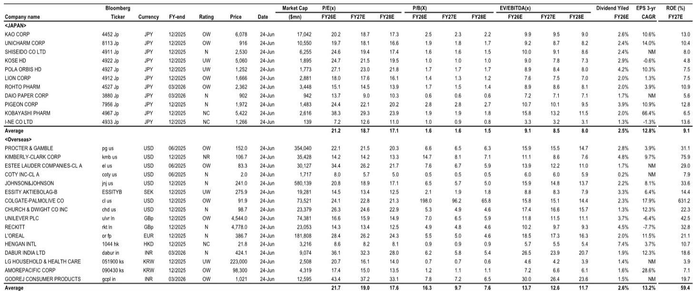
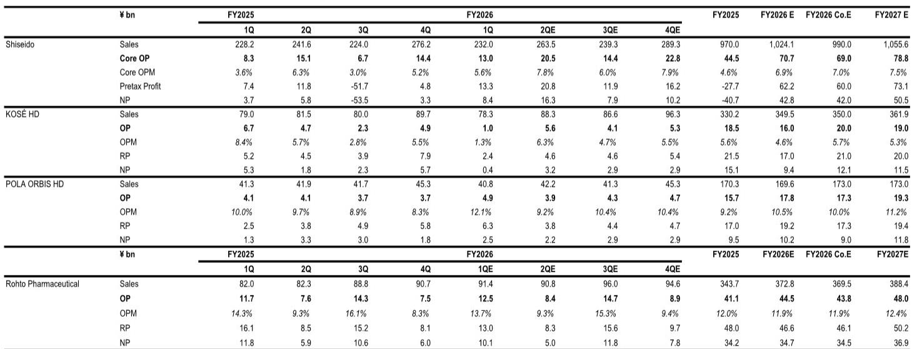
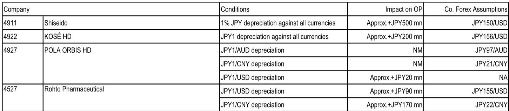

# JPM：日本化妆品巨头正集体失速于中国战场

中国市场回暖的迹象并未均匀惠及所有人。当进口数据持续攀升、本土品牌加速崛起，那些曾经依赖中国消费者实现增长的日本化妆品巨头，正在经历一场前所未有的压力测试。

JPM最新发布的日本化妆品行业季度前瞻报告，覆盖了资生堂、高丝、宝丽奥蜜思控股以及乐敦制药四家核心标的。报告的核心判断并非关于营收能否达标——分析师认为，即使这些公司即将公布的4-6月业绩符合指引，也难以提振市场对未来增长的预期。

真正的问题是：这些公司是否拥有足够清晰的核心品牌增长战略和利润率提升路径？从目前的数据来看，答案并不乐观。

> **KC评论：** 这份报告的结论对持有或关注日本消费股的投资者来说，是一个重要的警示信号。它不是在讨论短期波动，而是在质疑这些公司的中期增长引擎是否已经熄火。完整报告里包含了每家公司的详细估值表和汇率敏感性分析，这些数据将直接决定你的持仓风险。

## 1. 中国市场的“温差”正在拉大，进口激增掩盖了本土消费的疲软

报告引用的4-5月数据显示，中国化妆品零售环境复苏速度正在放缓。大型零售商店的化妆品销售额同比增速在经历了年初的短暂反弹后，再次出现波动。与此同时，化妆品及盥洗用品进口量却保持增长。

这一组数据组合揭示了一个关键矛盾：进口增长并不等于终端消费强劲。更合理的解释是，渠道商在积极备货，但消费者端的实际购买力恢复速度低于预期。对于在中国市场拥有大量业务的日本化妆品公司而言，这意味着库存压力可能在未来几个季度逐渐显现。

JPM特别指出，国内化妆品出货量在4-5月环比有所改善，但竞争格局的恶化程度远超出货量的改善幅度。进口品牌之间、进口品牌与本土品牌之间的价格和渠道争夺战，正在压缩所有人的利润空间。

## 2. 资生堂的“翻身仗”还缺一块关键拼图：创新产品能否在中国和美国同时引爆

资生堂是这份报告中最值得解剖的案例。JPM给予其中性评级，预计4-6月销售额同比基本持平，核心营业利润增长54亿日元至205亿日元。利润改善的主要驱动力来自中国和旅游零售渠道的利润回升，以及美洲业务亏损的消除。

但关键问题不在这里。报告明确指出，需要关注的是“创新产品在中国和美国的推出进展以及sell-out趋势”。换句话说，资生堂的利润修复更多来自成本削减和亏损业务止血，而非核心品牌的有机增长。

根据外部数据，资生堂在日本国内的中低价位化妆品销售中，无论是护肤品还是彩妆，4-5月的表现都略低于市场平均水平。这在日本本土市场是一个危险信号——如果连本土市场都无法守住份额，海外市场的竞争只会更加残酷。

> **KC评论：** 资生堂的案例完美展示了“利润修复”与“增长修复”之间的区别。公司正在做的事——关闭亏损门店、削减SKU、退出非核心市场——能够带来一次性利润改善，但无法解决品牌老化的问题。完整报告里有一张全球化妆品公司估值对比表，资生堂的估值倍数明显高于一些盈利更稳健的同行，这本身就包含了对未来增长的乐观预期。如果创新产品未能兑现，估值下修的风险不可忽视。

## 3. 高丝的“营销前置”策略正在被业绩数据拷问，核心品牌增长是唯一的解药

高丝是JPM覆盖标的中评级为减持的公司之一。预计4-6月销售额同比增长6%，营业利润56亿日元，同比增加9亿日元。表面上看，这是一份及格甚至偏好的成绩单。但JPM的判断是，即使如此，公司达成2026财年指引的可能性“不会上升”。

原因在于高丝在1-3月做了大量前置营销投入，这些投入的效果需要在4-6月兑现。如果销售增长无法持续超过营销投入的节奏，利润率将面临持续压力。

外部数据显示，高丝在日本国内的中低价位护肤品销售略优于市场平均水平，但彩妆表现仅与市场持平或略低。这种“偏科”式的表现，意味着公司对单一品类的依赖度较高，而彩妆市场的竞争远比护肤品更为激烈和碎片化。

JPM认为，高丝需要让投资者看到的是核心品牌的销售趋势改善和国内成本结构改革的具体进展。后者尤其关键——如果公司无法在日本本土实现运营效率的提升，任何海外市场的增长都将被高昂的固定成本所侵蚀。

## 4. 乐敦制药是唯一亮点，但并购整合的“第二曲线”尚未被市场定价

在这四家公司中，乐敦制药是JPM唯一给予增持评级的标的。预计4-6月销售额同比增长约5%（固定汇率），营业利润125亿日元，同比增加8亿日元。增长引擎明确来自亚洲市场，而非日本国内。

在日本市场，乐敦面临的是新品发布后的需求自然回落，以及消费者在价格上调前提前囤货的透支效应。但亚洲市场，尤其是中国和东南亚，正在成为其利润增长的真正支柱。

报告特别提到，需要关注收购的余仁生是否正在对销售和利润增长做出贡献。对于乐敦而言，余仁生的整合不仅是财务上的加法，更是其从药品和护肤品向更广泛的健康消费品延伸的战略支点。

> **KC评论：** 乐敦是这组公司里估值最便宜的之一，FY2026预期市盈率仅15.1倍，远低于资生堂的24.6倍和高丝的24.7倍。但低估值背后有原因：市场对它的增长持续性存疑，尤其是日本国内业务能否稳定。完整报告里有一张各公司的外汇敏感性分析表，乐敦对人民币和美元的汇率波动最为敏感，这一点在日元持续贬值的背景下既是机会也是风险。

## 5. 宝丽奥蜜思的“双品牌”策略正在分化，渠道变革才是真正的胜负手

宝丽奥蜜思控股同样被JPM给予减持评级。预计4-6月销售额同比增长1%，其中核心品牌POLA下降3%，而ORBIS增长5%。营业利润预计同比下降2亿日元至39亿日元。

这种“一降一升”的格局反映了两个品牌截然不同的市场定位和渠道结构。POLA作为高端品牌，严重依赖线下百货和沙龙渠道，而这些渠道在中国和日本都面临客流下滑的压力。ORBIS作为中端品牌，更侧重电商和直营渠道，增长相对稳健。

JPM认为，需要关注的是POLA沙龙渠道的销售趋势和ORBIS的新客获取情况。前者决定了高端线的利润底盘是否稳固，后者则决定了中端线的增长是否可持续。

对于整个日本化妆品行业而言，宝丽奥蜜思的困境具有普遍意义：高端品牌在消费降级趋势下承压，中端品牌则在激烈的价格战中寻找生存空间。两条战线同时作战，对管理层的资源和能力提出了极高要求。

## 6. 报告尚未完全回答的关键问题：中国本土品牌的崛起到底改变了什么

JPM这份报告虽然覆盖了中国市场的宏观数据，但对中国本土化妆品品牌的竞争动态着墨不多。这恰恰是当下最值得追问的问题。

从中国海关和统计局的数据来看，进口化妆品的增长与国内消费的疲软并存，这暗示着渠道库存的累积。当渠道库存达到临界点，进口订单的削减将直接冲击日本化妆品公司的营收。更深远的影响在于，中国本土品牌正在通过社交媒体、KOL营销和更快的产品迭代，逐步侵蚀日系品牌在中低价位市场的份额。

报告没有展开讨论的是：日本化妆品公司是否正在失去对中国年轻消费者的吸引力？资生堂和高丝在中国市场的品牌资产，是否足以抵御完美日记、花西子等本土品牌的冲击？这些问题可能需要等待更长时间的数据才能回答，但它们已经构成了这些公司估值修复的最大不确定性。

对于投资者而言，这份报告提供的观察框架是清晰的：核心品牌的增长战略是否清晰、利润率改善路径是否可验证、中国市场库存周期是否已见底。这三个维度将决定哪家公司能够率先走出困境，哪家公司将继续在泥潭中挣扎。

如果你希望获取完整的估值对比表、外汇敏感性分析和每家公司的详细财务预测，欢迎加入我们的社群。每天由AI agent和人工review生成国际投行中文摘要与KC评论，daily更新约10-40页，并整理当天最新数据图表合集，方便喂给AI，也方便人工快速把握market dynamics。在社群里，我们可以继续讨论这些日本化妆品巨头是否值得逆向布局，或者是否应该等待更明确的拐点信号。

Personal reading notes and learning share only. Not investment advice.

