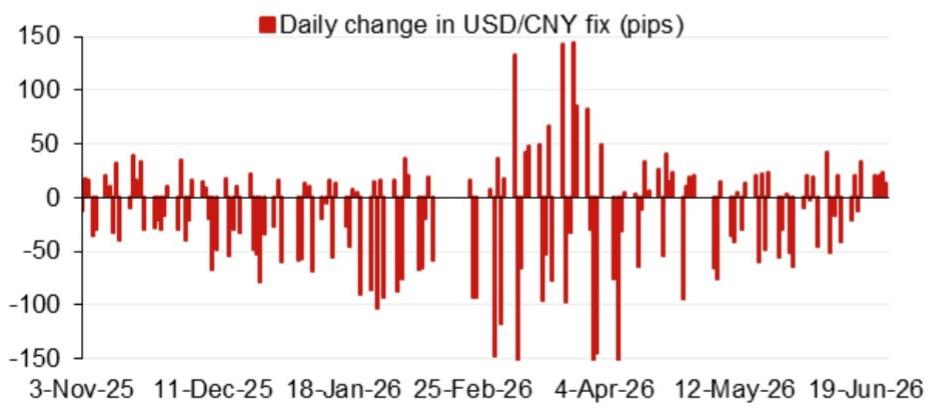
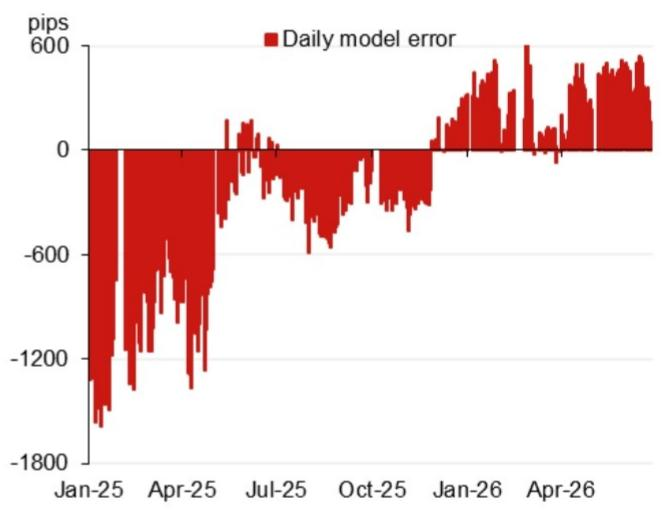

# NOM：人民币中间价模型已释放一个被低估的政策信号

人民币汇率正在经历一段看似平静、实则暗流涌动的时期。市场目光多聚焦于中美利差、出口数据与特朗普关税的博弈节奏，但真正衡量政策意图的晴雨表，往往不在即期价格本身，而在每日开盘前那个被多数交易员快速扫过的数字——中间价。

NOM亚洲外汇策略团队在最新一期日度模型中，给出了一个值得细读的信号。其模型测算的美元兑人民币中间价预测值为6.8023，较前一日模型预测值6.8209低了186个基点。即使加入逆周期因子调整后，预测值仍为6.8089，较前一日实际中间价低了120个基点。

这不是一个巨大的数字，但它的方向与幅度，在当前的宏观语境下，传递了一个清晰的判断：政策层面对人民币贬值速度的容忍度，可能正在发生微妙但重要的变化。

## 1. 模型预测的“下修”幅度，指向的是政策意图而非市场波动

NOM模型的核心价值不在于它预测的绝对点位是否准确，而在于它量化了“如果没有政策干预，中间价应该落在哪里”与“实际中间价落在哪里”之间的差值。这个差值，就是市场理解政策意图的关键窗口。

本次模型预测值较前一日下修186个基点，即便计入逆周期因子后仍下修120个基点，这意味着一件事：在NOM的框架中，隔夜市场因素对人民币的定价方向是偏强的，而非偏弱的。换句话说，模型认为人民币在基本面层面有升值压力，但实际中间价的设定并未完全反映这一压力。

这里需要区分两个概念：模型预测的“方向”与市场交易的“方向”。模型预测下修，代表的是模型认为中间价应当走低（即人民币升值），而不是市场在抛售人民币。这与许多读者直觉中“下修=贬值”的理解正好相反。

> **KC评论：** NOM的模型告诉我们，当前人民币并不缺乏基本面层面的支撑。问题在于，政策层是否愿意让中间价充分反映这种支撑。120-186个基点的“保留空间”，本身就是一种政策态度的量化表达。完整报告中还包含了每日模型误差的追踪图表，可以帮助读者判断这种预测偏差是偶然噪音还是趋势信号。

## 2. 逆周期因子的使用强度，才是真正的“政策语言”

市场习惯把逆周期因子看作一个黑箱，只知道它在“对冲”市场情绪。但NOM的模型提供了一个更精细的观察框架：它分别给出了“不含逆周期因子”和“含逆周期因子”两个预测值。

本次两个数值之间的差距仅为66个基点（6.8023 vs 6.8089），这个差距本身就是一个信号。

当逆周期因子被大幅调高时，说明政策层在主动对抗贬值预期，释放“不允许快速贬值”的信号。而当逆周期因子使用强度降低时，说明政策层认为市场情绪本身已经不需要强力对冲，或者——更关键的可能性——政策层对汇率波动的容忍区间正在扩大。

66个基点的逆周期因子调整，在NOM模型的历史序列中属于偏低水平。这暗示当前政策层并不认为市场存在需要强力纠偏的单边贬值预期。但与此同时，模型预测与实际中间价之间的偏差，又说明政策层在主动“压住”升值速度。

> **KC评论：** 这是一个有趣的组合：不担心贬值，但也不想升值太快。这种“双向容忍但双向压住”的状态，对交易策略意味着什么？报告中的逆周期因子调整序列图表，可以让读者更直观地看到当前的使用强度处于历史什么分位。

## 3. 真正考验人民币的不是今天，而是下半年的事件密集期

研报附录中的事件日历，提供了理解当前汇率政策节奏的重要时间坐标。2026年下半年，中国将迎来一系列关键政治经济议程：7月底的政治局会议、10月国庆黄金周、11月在深圳举办的APEC领导人会议、12月的中央经济工作会议，以及年底前可能发生的中国国家主席访美。

这些事件对汇率政策的意义各不相同，但共同指向一个判断：下半年将是政策层需要“稳定预期”的密集窗口期。

APEC会议在深圳举办，这是一个值得注意的地点选择。深圳是中国改革开放的前沿，也是高科技产业链的核心枢纽。在这样的主场外交场合，汇率稳定不仅是经济需要，更是形象需要。同样，年底前的领导人访美，意味着中美关系在经历了年初的关税博弈后，可能进入一个新的外交协调阶段。汇率作为中美经济对话的核心议题之一，其波动空间在访美前后大概率会受到更严格的管理。

从时间线倒推，当前的“低逆周期因子+模型预测偏差”状态，可能不是政策层对未来方向的最终表态，而只是一个过渡性安排。真正的政策意图，要等到7月政治局会议前后才会更加清晰。

## 4. 报告没有完全回答的关键问题：模型预测的“误差”是否会自我实现

NOM团队提供了模型误差的历史追踪图表（Fig. 2），这是一个非常有价值的分析工具。但报告本身并未深入讨论一个关键问题：当市场参与者普遍意识到模型预测与实际中间价之间存在系统性偏差时，这种偏差本身是否会改变市场行为？

如果交易员相信模型预测代表了“公允价值”，而实际中间价代表了“政策目标”，那么两者之间的差距就构成了一个套利空间。套利行为本身会推动即期汇率向模型预测方向收敛，从而缩小误差。但如果政策层坚持维持一个与模型预测偏离的中间价，那么套利行为就可能导致即期汇率与中间价之间的“裂口”扩大，反而增加市场的波动风险。

换句话说，NOM模型揭示的这个偏差，可能是一个自我修正的短期信号，也可能是一个积累压力的中期隐患。它到底属于哪一种，取决于政策层后续的操作节奏。

这正是完整报告中最值得深读的部分：模型误差的历史图表可以告诉我们，类似的偏差在过往周期中是如何被消化的——是通过中间价的调整，还是通过即期汇率的回归，抑或是通过逆周期因子的重新加码。

## 5. 给读者的观察框架：盯住三个变量，而非一个点位

基于NOM这份报告的分析框架，我们建议读者在接下来的几周内，重点关注以下三个变量，而不是纠结于美元兑人民币的具体点位会到6.80还是6.85。

第一，逆周期因子的日度调整幅度。如果未来出现连续多日逆周期因子调整幅度显著扩大（超过100个基点），说明政策层对贬值速度的容忍度在收窄。如果调整幅度持续收窄甚至转负，说明政策层对升值速度的容忍度在扩大。

第二，模型预测误差的累积方向。如果模型连续多日预测中间价应当低于实际中间价（即模型偏强），且误差在累积，说明政策层在主动压制升值。反之，如果模型连续多日预测中间价应当高于实际中间价（即模型偏弱），说明政策层在主动支撑汇率。

第三，即期汇率与中间价之间的“裂口”。如果即期汇率持续在中间价的强侧运行（即人民币即期强于中间价），说明市场力量在推动升值，政策层面临的是“要不要跟”的问题。如果即期汇率持续在中间价的弱侧运行，说明市场力量在推动贬值，政策层面临的是“要不要拦”的问题。

这三个变量组合起来，比任何一个单一指标都更能反映政策层的真实意图。

---

NOM这份报告的篇幅不长，但它提供了一个极其精炼的分析框架，把汇率政策从“黑箱”变成了“可观测的偏差”。真正有价值的，不是那个6.8023的预测值本身，而是它背后揭示的政策逻辑和市场博弈结构。

我们每天会由AI agent结合人工review，生成国际投行的中文摘要与KC评论，daily更新约10-40页，并整理当天最新数据图表合集，方便喂给AI，也方便人工快速把握market dynamics。如果你想继续追踪逆周期因子的变化节奏、模型误差的累积方向，以及下半年关键事件对汇率政策的影响推演，欢迎来知识星球和微信群里继续讨论。

Personal reading notes and learning share only. Not investment advice.

