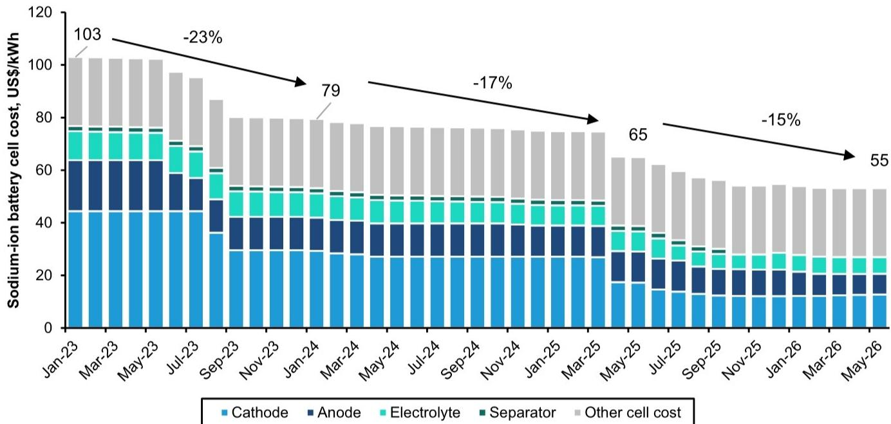
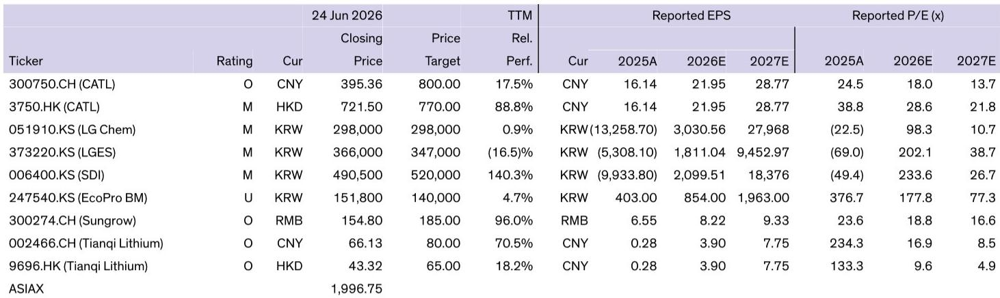
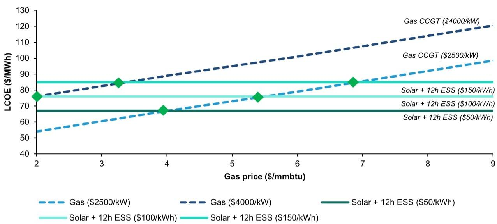

# Bernstein：钠离子电池正在改写光伏基荷电力的经济学

一份来自Bernstein的最新研报，提出了一个足以让能源行业重新思考十年规划的判断：钠离子电池的成本下降速度，可能比市场预期的更快，而它真正颠覆的，不是电动汽车的续航里程，而是太阳能发电与天然气争夺基荷电源的竞争格局。

这份报告的作者团队，包括了Bernstein亚洲能源研究主管Neil Beveridge。他们在欧洲实地调研中发现，德国6月太阳能发电占比已接近25%，西班牙在6月6日一度达到70%。但真正让分析师团队感到“大开眼界”的，是客户对储能技术，特别是钠离子电池的关注热度。

问题的核心在于：当光伏和风电的渗透率超过一定阈值，电网对储能的需求就从“调峰”转向“基荷替代”。而储能的成本，直接决定了这种替代是否具备经济性。Bernstein的报告给出了一组关键数字：如果钠离子电池成本降至每千瓦时50美元，那么光伏加48小时储能的总成本，将能够与天然气联合循环电厂正面竞争。

这不是一个遥远的预测。报告指出，钠离子电池的电芯成本已经同比下跌15%，从每千瓦时66美元降至55美元。而行业龙头宁德时代的董事长曾毓群认为，钠离子电池成本将降至每千瓦时50美元——这比当前磷酸铁锂电池80-90美元的成本低近一半，更只有三元锂电池成本的不到一半。

> **KC评论：** 这个成本差异不是简单的“更便宜”，而是从根本上改变了储能的商业模式。如果钠离子电池能做到每千瓦时50美元，那么“光伏+长时储能”的综合度电成本，就可能低于新建天然气电厂的度电成本。这意味着，能源转型的终局图景，可能不是光伏和天然气并存，而是光伏+储能直接替代天然气。报告后面给出了详细的平准化度电成本测算，值得仔细看。

## 1. 钠离子电池的“三重优势”正在从实验室走向工程化

Bernstein的报告详细拆解了钠离子电池相比磷酸铁锂的三个核心优势，这些优势不是理论上的，而是已经开始在量产数据中显现。

第一是循环寿命。钠离子电池可以实现1.5万次充放电循环，而磷酸铁锂电池的典型寿命在6000至8000次。这意味着，如果每天进行两次完整的充放电，钠离子电池可以稳定运行20年，与光伏电站的全生命周期完全匹配，不需要中间更换电池。从每千瓦时每次循环的成本来看，钠离子电池可能只有磷酸铁锂的三分之一。

第二是安全性和低温性能。钠离子电池的热失控温度限制在约200摄氏度，远低于其他锂离子电池体系。在零下20摄氏度的低温环境下，能量保持率仍超过92%。这对于高纬度地区或冬季日照不足但需要储能的应用场景，是一个重要的工程优势。

第三是能量密度的快速追赶。宁德时代发布的第二代钠离子电池“Naxtra”，在电池包级别的能量密度已达到每公斤185瓦时，已经非常接近磷酸铁锂的190至210瓦时。这意味着，钠离子电池不仅在固定式储能领域有竞争力，在价格敏感的入门级电动汽车市场，也开始具备替代能力。

> **KC评论：** 能量密度接近磷酸铁锂，但成本更低、寿命更长——这意味着钠离子电池可能不是“过渡技术”，而是真正的“替代技术”。报告里有一张图表，展示了钠离子电池与磷酸铁锂成本曲线的交叉点预计在2026年到来，这个时间节点对储能项目的投资决策至关重要。完整报告里还有分场景的敏感性分析，可以帮助判断不同假设下的盈亏平衡点。

## 2. 光伏加储能的“基荷化”正在从概念走向项目落地

Bernstein的报告用了一个非常具体的案例来说明这一趋势的进展。在阿联酋，Masdar正在开发全球首个“光伏+储能”基荷电力项目。这个项目将太阳能与19吉瓦时的电池储能系统配对，为1吉瓦的电力提供连续供应，供电可靠性达到99.7%。

这个项目的意义在于，它证明了“光伏+储能”不再只是白天的调峰电源，而是可以承担基荷电源的角色。当储能成本继续下降，更长时间尺度的光伏加储能项目，将成为天然气电厂的真正竞争对手。

报告给出了一组关键的对比数字：2020年，一个电池储能系统的成本高达每千瓦时500美元，这意味着1千瓦发电能力配4小时储能的投资成本是2000美元，与一台天然气联合循环电厂的造价（每千瓦2000美元）几乎相同。今天，随着磷酸铁锂电池成本下降，储能系统成本已降至每千瓦时150美元左右。而同期，由于天然气发电机组需求增长，燃气电厂的建造成本已升至每千瓦4000美元。

在这一背景下，假设光伏组件成本为每千瓦1000美元，那么“光伏加20小时储能”的总投资成本为每千瓦4000美元，已经与燃气电厂持平。而如果钠离子电池成本降至每千瓦时50美元，那么“光伏加48小时储能”的总成本，将低于燃气电厂。

> **KC评论：** 报告里有一张非常清晰的平准化度电成本对比图，直观展示了在不同天然气价格假设下，光伏加储能的竞争力。在天然气价格每百万英热单位5美元时，光伏加12小时储能的度电成本已经低于新建燃气电厂；如果天然气价格降至2美元，光伏加储能的度电成本仍然有竞争力。这个结论对全球天然气市场的长期需求预期，有直接的投资含义。

## 3. 储能的潜在市场需求可能比所有人想象的都大

Bernstein的报告给出了一个令人震撼的测算。截至2024年，全球光伏和风电的累计装机容量已经接近5000吉瓦。到2030年，这个数字可能接近1万吉瓦。

报告做了一个简单的假设：如果每一吉瓦的光伏或风电装机，都配套一吉瓦的储能电池，且储能时长达到10小时，那么全球累计储能需求将达到10万吉瓦时。这个数字是什么概念？目前全球累计安装的电池储能容量约为700吉瓦时。10万吉瓦时，是这个数字的两个数量级。

即使只考虑2024年全球新增的约1000吉瓦时储能产能，与上述潜在需求相比，仍然有巨大的增长空间。报告虽然没有给出明确的渗透率假设，但逻辑链条很清楚：储能成本下降，将直接推动储能装机量的指数级增长。

> **KC评论：** 这个测算的核心假设——“每吉瓦新能源配一吉瓦10小时储能”——在现实中可能不会完全实现，但它提供了一个思考框架。储能需求的弹性可能比市场预期的更大，因为成本下降会创造新的应用场景。报告里还有一个全球储能装机量的增长曲线图，展示了从2024年到2030年的潜在增长路径，以及不同技术路线的市场份额变化。

## 4. 报告尚未完全回答的关键问题：成本曲线能否如期兑现

尽管Bernstein的报告给出了令人信服的成本下降逻辑，但有几个关键问题仍然需要验证。

第一，钠离子电池的成本曲线能否如期在2026年与磷酸铁锂交汇，并在之后持续下降？报告引用的是宁德时代董事长曾毓群的判断，但行业内的其他参与者，如中科海钠、宁德时代自身的量产进度，以及全球其他钠离子电池企业的产能规划，都会影响实际成本走势。报告没有详细展开钠离子电池正极材料的供应链瓶颈问题。

第二，钠离子电池的循环寿命优势，在实际应用中能否完全兑现？1.5万次循环是实验室数据还是量产数据？不同工况下的衰减曲线如何？报告没有给出详细的测试数据或第三方验证。

第三，光伏加储能的基荷化，在不同地理区域的可复制性如何？阿联酋的项目有极好的光照条件和较低的纬度，但在北欧或中国北方地区，冬季光照不足的问题可能使“48小时储能”的设计面临挑战。

> **KC评论：** 这些未解问题，恰恰是判断投资机会的关键。如果钠离子电池的成本曲线如期兑现，宁德时代作为行业龙头，将是最直接的受益者。但如果成本下降慢于预期，或者循环寿命在工程应用中打折扣，那么市场对储能渗透率的乐观预期就需要修正。完整报告里包含了更详细的敏感性分析和竞争格局对比，可以帮助投资者建立自己的判断框架。

## 5. 对投资者的观察框架：从“技术路线”转向“成本曲线斜率”

基于Bernstein报告的分析，我们认为投资者在评估钠离子电池投资机会时，可以建立一个更简洁的观察框架。

核心变量只有一个：钠离子电池的成本曲线斜率。如果成本能在未来两年内降至每千瓦时60美元以下，那么“光伏加48小时储能”的经济性将彻底改变全球电力系统的投资逻辑。如果成本下降速度放缓，那么锂离子电池的改进版本（如磷酸锰铁锂）仍可能在中期保持竞争力。

次要变量包括：钠离子电池的能量密度能否在2027年前突破每公斤200瓦时，循环寿命在实际工况下能否超过1万次，以及全球主要钠离子电池企业的产能规划能否如期落地。

从资产定价的角度看，报告给出的宁德时代目标价是800元人民币（A股），对应2026年18倍市盈率。这个估值隐含的市场预期，是钠离子电池能够如期大规模商业化。如果投资者对成本曲线有更保守的判断，可能需要寻找更安全的投资时点。

这些问题的答案，并不在公开的研报摘要中，而需要深入到报告完整的图表、敏感性分析和竞争格局对比中去寻找。Bernstein的这份报告，真正有价值的不是结论本身，而是支撑结论的数据链和假设条件。

每天，我们会由AI agent加人工review，将国际投行的最新中文摘要与KC评论整理成约10至40页的文档，同时附上当天最新的数据图表合集。这份材料既方便喂给AI进行二次分析，也方便人工快速把握全球市场动态。如果您对钠离子电池的成本曲线、宁德时代的估值逻辑，或全球储能市场的增长路径有进一步兴趣，欢迎来我们的星球和微信群里继续讨论。

Personal reading notes and learning share only. Not investment advice.

