Japan Autos & Auto Parts

# Best of Times, Worst of Times: How K-shaped polarization is reshaping Japan's auto market

  
Masahiro Akita  
+81 3 6777 6998

masahiro.akita@bernsteinsg.com

Seunghyeok Kim

+81 3 6777 6974

seunghyeok.kim@bernsteinsg.com

Tomohiro Kashimoto

+81 3 6777 6975

tomohiro.kashimoto@bernsteinsg.com

"It was the best of times, it was the worst of times". The famous opening line of Charles Dickens' 'A Tale of Two Cities' captures a period of contradiction: the French aristocracy indulging in opulence and privilege, the peasantry experiencing poverty and oppression. While 2026 is thankfully not 18th century France, shifting class dynamics remain more topical than ever, from the US K-shaped economy to the squeezed Chinese middle class. In this note, we examine how K-shaped polarization is reshaping Japan's auto market, weakening affordability, and changing automakers' competitive positioning.

K-shaped polarization is reshaping Japan's auto market: Demand in Japan's auto market is becoming polarized between low-end and high-end vehicles. Between 2015 and 2025, monthly new car purchase spending per household declined as much as $22\%$ among lower-income households, while increasing as much as $32\%$ among higher-income households. Car ownership also became more polarized, with the ownership rate gap between lower-income and higher-income households widening from $27\%$ to $30\%$ p. Polarization is also visible in currently owned vehicle prices. The share of low-end vehicles priced below JPY 1 mn increased from $1\%$ in 2017 to $6\%$ in 2025, while the share of high-end vehicles priced above JPY 5 mn rose from $6\%$ to $15\%$ . In contrast, the share of vehicles priced at JPY 1-2 mn, the largest volume segment, declined from $46\%$ to $19\%$ .

## Affordability pressure is weakening car ownership among lower-income

households: Rising financial burdens from car ownership are affecting demand. Japan's real monthly disposable income declined 5% from its 2020 peak of JPY 499 thousand to JPY 476 thousand in 2025, reflecting inflation. The impact of weaker real purchasing power was more pronounced among lower-income households. In 2025, the proportion of households describing car ownership costs as a financial burden reached 44% among lower-income households, compared with 29% among higher-income households.

## Automakers with exposure to both low-end and high-end demand are better

positioned: K-shaped polarization in Japan's auto market could increasingly affect automakers' sales mix and profitability. In 2025, the combined domestic sales mix of the lowest-priced segment below JPY 2 mn and the highest-priced segment above JPY 5 mn was highest for Suzuki at $74\%$ and Toyota at $43\%$ , followed by Honda at $38\%$ , Mazda at $37\%$ , Nissan at $29\%$ , and Subaru at $10\%$ . Meanwhile, operating margins in Japan were also highest for Toyota at $11\%$ and Suzuki at $9\%$ , followed by Nissan at $0\%$ , Mazda at $-5\%$ , Subaru at $-11\%$ , and Honda at $-14\%$ . This suggests that automakers with exposure to both low-end and high-end segments tend to maintain higher profitability under a K-shaped demand environment, with Toyota and Suzuki appearing relatively well positioned.

Shared mobility benefits as car ownership becomes less affordable: Japan's shared mobility market, including car sharing and ride sharing, is expanding alongside K-shaped polarization. As the economic rationality of car ownership declines, some ownership demand could shift toward shared mobility. As the market expands, automakers may increasingly need to focus not only on manufacturing and sales, but also on recurring revenue generation across the vehicle lifecycle and downstream service capabilities.

## BERNSTEIN TICKER TABLE

<table><tr><td rowspan="3">Ticker</td><td rowspan="3">Rating</td><td colspan="4">24 Jun 2026</td><td rowspan="2">TTMRel.</td><td colspan="4">Reported EPS</td><td colspan="3">Reported P/E (x)</td></tr><tr><td></td><td>ClosingPrice</td><td>PriceTarget</td><td>PriceTarget</td><td></td><td></td><td></td><td></td><td></td><td></td><td></td></tr><tr><td>Cur</td><td>Price</td><td>Target</td><td>Perf.</td><td>Cur</td><td>2025A</td><td>2026E</td><td>2027E</td><td>2025A</td><td>2026E</td><td>2027E</td><td></td></tr><tr><td>7203.JP (Toyota)</td><td>O</td><td>JPY</td><td>2,686.00</td><td>4,200.00</td><td>(39.2)%</td><td>JPY</td><td>295.25</td><td>308.93</td><td>367.29</td><td>9.1</td><td>8.7</td><td>7.3</td><td></td></tr><tr><td>7269.JP (Suzuki)</td><td>O</td><td>JPY</td><td>1,883.50</td><td>2,550.00</td><td>(36.4)%</td><td>JPY</td><td>227.69</td><td>234.71</td><td>255.99</td><td>8.3</td><td>8.0</td><td>7.4</td><td></td></tr><tr><td>7267.JP (Honda)</td><td>M</td><td>JPY</td><td>1,391.50</td><td>1,300.00</td><td>(47.0)%</td><td>JPY</td><td>(106.06)</td><td>161.84</td><td>147.24</td><td>(13.1)</td><td>8.6</td><td>9.5</td><td></td></tr><tr><td>7201.JP (Nissan)</td><td>U</td><td>JPY</td><td>301.00</td><td>350.00</td><td>(57.7)%</td><td>JPY</td><td>(152.58)</td><td>4.78</td><td>53.06</td><td>(2.0)</td><td>62.9</td><td>5.7</td><td></td></tr><tr><td>7261.JP (Mazda)</td><td>U</td><td>JPY</td><td>1,072.00</td><td>1,000.00</td><td>(18.1)%</td><td>JPY</td><td>55.64</td><td>116.61</td><td>142.17</td><td>19.3</td><td>9.2</td><td>7.5</td><td></td></tr><tr><td>7270.JP (Subaru)</td><td>U</td><td>JPY</td><td>2,375.00</td><td>2,350.00</td><td>(50.4)%</td><td>JPY</td><td>125.50</td><td>222.96</td><td>249.75</td><td>18.9</td><td>10.7</td><td>9.5</td><td></td></tr><tr><td>JPL</td><td></td><td></td><td>2,627.28</td><td></td><td></td><td></td><td></td><td></td><td></td><td></td><td></td><td></td><td></td></tr></table>

O - Outperform, M - Market-Perform, U - Underperform, NR - Not Rated, CS - Coverage Suspended

Source: Bloomberg, Bernstein estimates and analysis.

## INVESTMENT IMPLICATIONS

We rate Toyota Outperform with an updated price target of JPY 4,200.00.

We rate Suzuki Outperform with a price target of JPY 2,550.00.

We rate Honda Market-Perform with a price target of JPY 1,300.00.

We rate Nissan Underperform with a price target of JPY 350.00.

We rate Subaru Underperform with an price target of JPY 2,350.00.

We rate Mazda Underperform with a price target of JPY 1,000.00.

## K-SHAPED POLARIZATION IS RESHAPING JAPAN'S AUTO MARKET

## Higher-income households are spending more while lower-income households are spending less

From 2015 to 2025, monthly new car purchase spending per household in Japan increased only marginally from JPY 10.3 thousand to JPY 10.5 thousand, up 2%, suggesting limited change at the aggregate level. However, a clear divergence emerged between lower-income and higher-income households when viewed by income bracket (Exhibit 1). In this part, households with annual income below JPY 4 mn are classified as lower-income households, while households with annual income above JPY 12.5 mn are classified as higher-income households, based on the income categories defined by Japan's Ministry of Internal Affairs and Communications.

Among lower-income households with annual income below JPY 4 mn, monthly new car purchase spending declined across all income brackets. More specifically, spending among households earning below JPY 2 mn declined 22%, from JPY 2.9 thousand to JPY 2.3 thousand. Households earning JPY 2-3 mn also declined 6%, from JPY 5.2 thousand to JPY 4.9 thousand, while households earning JPY 3-4 mn declined 16%, from JPY 7.6 thousand to JPY 6.4 thousand.

Meanwhile, among higher-income households with annual income above JPY 12.5 mn, monthly new car purchase spending increased across all income brackets. More specifically, spending among households earning JPY 12.5-15 mn increased 6%, from JPY 24.4 thousand to JPY 25.8 thousand. Households earning JPY 15-20 mn also increased 3%, from JPY 29.4 thousand to JPY 30.4 thousand, while households earning above JPY 20 mn increased 32%, from JPY 24.3 thousand to JPY 32.0 thousand.

EXHIBIT 1: Among lower-income households with annual income below JPY 4 mn, new car purchase spending declined across all income brackets, while among higher-income households with annual income above JPY 12.5 mn, new car purchase spending increased across all income brackets

Monthly Spending per Household by Income Bracket (New Car Purchase)

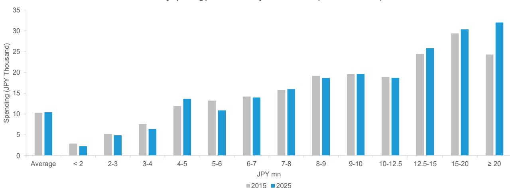  
Source: Ministry of Internal Affairs and Communications, Bernstein analysis

K-shaped polarization is likely to progress not only in current car ownership, but also in future new car demand in Japan's auto market

From here onward, households with annual income below JPY 3.6 mn are classified as lower-income households, while households with annual income above JPY 7.8 mn are classified as higher-income households, based on the income categories defined by JAMA (Japan Automobile Manufacturers Association). Against the backdrop of Japan's broader trend of declining interest in car ownership, the overall car ownership rate in Japan declined from $80\%$ in 2019 to $72\%$ in 2025, down $8\%$ p (Exhibit 2).

Meanwhile, by income bracket, lower-income households saw a larger decline in car ownership rates. Among lower-income households earning below JPY 2.2 mn, car ownership declined from 61% to 54%, down 7%p. Households earning JPY 2.2-3.6 mn also saw a 6%p decline, from 77% to 71%. In contrast, among higher-income households earning above JPY 7.8 mn, car ownership declined only 5%p, from 88% to 83%. The ownership gap between households earning below JPY 2.2 mn and those earning above JPY 7.8 mn also widened from 27%p in 2019 to 30%p in 2025, suggesting increasing polarization in car ownership (Exhibit 3).

EXHIBIT 2: Car ownership rates declined more sharply among lower-income households, with the gap between households earning below JPY 2.2 mn and above JPY 7.8 mn widening from 27%p in 2019 to 30%p in 2025  
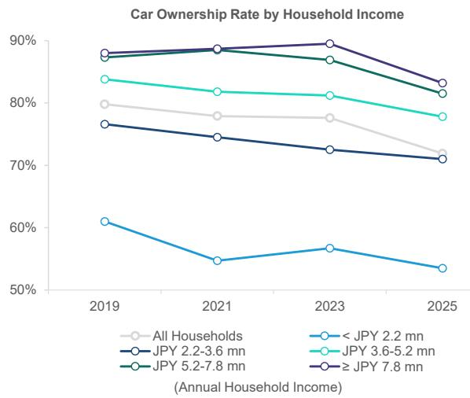  
Source: JAMA, Bernstein analysis

EXHIBIT 3: The gap in car ownership rates between households earning below JPY 2.2 mn and those earning above JPY 7.8 mn also widened from 27%p in 2019 to 30%p in 2025  
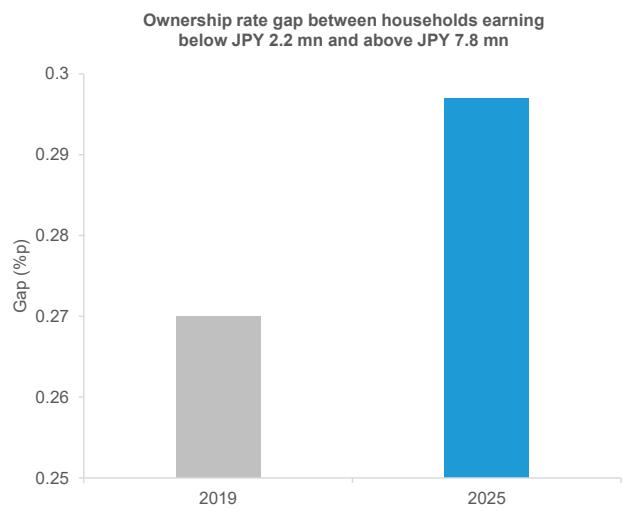  
Source: JAMA, Bernstein analysis

Car purchase intention among non-owner households also shows weaker demand among lower-income households and stronger demand among higher-income households. As of 2025, the combined purchase intention ratio for ‘planning to purchase within the next three years’, ‘planning to purchase within four to five years’, and ‘planning to purchase after five years’ was 7% across all households. Among households earning above JPY 7.8 mn, the ratio was 9%, exceeding the 7% average for all households. In contrast, the ratio remained at 6% among households earning JPY 2.2-3.6 mn and 4% among households earning below JPY 2.2 mn, both below the all-household average (Exhibit 4).

The survey on latent car ownership intention, assuming no constraints such as financial limitations or driver's license ownership, also suggests stronger ownership intention among higher-income households. As of 2025, the combined ratio of households answering ‘want to own’ and ‘somewhat want to own’ reached 23% among households earning above JPY 7.8 mn. In contrast, the ratio remained at 19% among households earning below JPY 2.2 mn and 21% among households earning JPY 2.2-3.6 mn (Exhibit 5).

Another notable point is that the trend of declining interest in car ownership itself is becoming increasingly polarized by income bracket. In the same survey, 67% of non-owner households across all households answered that they did not intend to own a car, combining responses of ‘do not want to own’ and ‘do not really want to own’. By income bracket, the ratio reached 70% among lower-income households earning below JPY 2.2 mn and 69% among households earning JPY 2.2-3.6 mn. In contrast, the ratio remained at 64% among higher-income households earning above JPY 7.8 mn.

EXHIBIT 4: Lower-income households tend to show weaker vehicle purchase demand  
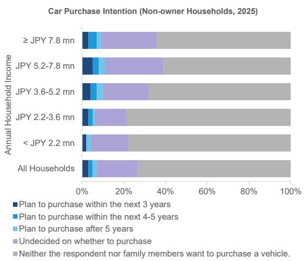  
Source: JAMA, Bernstein analysis

EXHIBIT 5: Higher-income households tend to show stronger vehicle ownership intention  
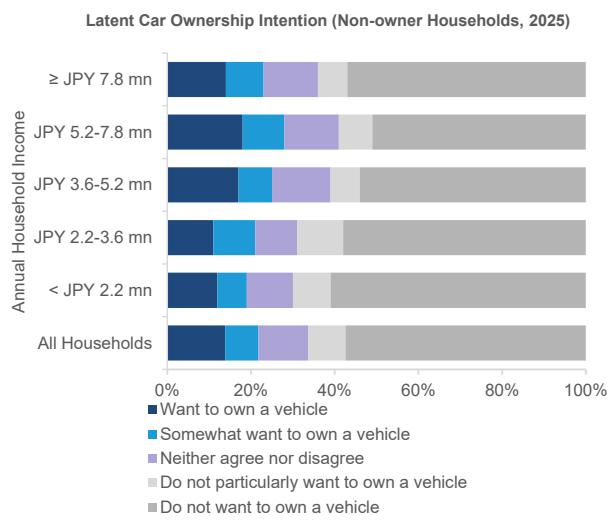  
Source: JAMA, Bernstein analysis

## Some lower-income households are showing signs not only of weaker car replacement demand, but also of stopping car ownership altogether

K-shaped polarization is also becoming increasingly visible in replacement demand among car-owning households. As of 2025, the car replacement intention ratio across all households stood at 26%. By income bracket, the ratio reached 34% among higher-income households earning above JPY 7.8 mn, exceeding the all-household average. In contrast, the ratio remained at 22% among lower-income households earning JPY 2.2-3.6 mn and 20% among households earning below JPY 2.2 mn, both below the all-household average (Exhibit 6)

Meanwhile, some lower-income households are also showing signs of suspending car ownership altogether. As of 2025, the car ownership discontinuation intention ratio across all households stood at 9%. However, the ratio reached 19% among lower-income households earning below JPY 2.2 mn and 15% among households earning JPY 2.2-3.6 mn, both materially above the all-household average. In contrast, among households earning above JPY 7.8 mn, both below the all-household average (Exhibit 7).

EXHIBIT 6: K-shaped polarization is also emerging in replacement demand among car-owning households  
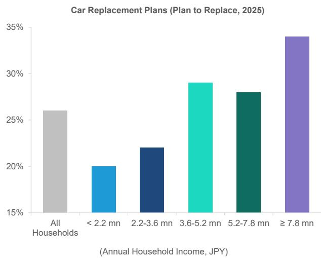  
Source: JAMA, Bernstein analysis  
EXHIBIT 7: Some lower-income households are also showing signs of suspending car ownership altogether

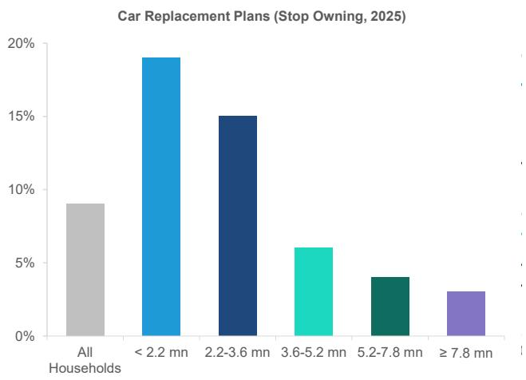  
Source: JAMA, Bernstein analysis

## K-shaped polarization is also progressing across the price ranges of currently owned cars

From 2017 to 2025, changes also emerged in the purchase price of new and used cars currently owned. While the share of low-end and high-end vehicles increased, the share of mid-priced vehicles declined. More specifically, the share of low-end vehicles priced below JPY 1 mn increased from 1% in 2017 to 6% in 2025, while the share of high-end vehicles priced above JPY 5 mn also increased from 6% to 15%. In contrast, the share of cars priced between JPY 1-2 mn, previously the largest volume segment, declined from 46% to 19%. Japan's auto market is seeing K-shaped polarization, with demand shifting away from the traditional mid-priced mass market toward both low-end and high-end vehicle segments (Exhibit 8).

EXHIBIT 8: The share of low-end vehicles priced below JPY 1 mn increased from 1% in 2017 to 6% in 2025, while the share of high-end vehicles priced above JPY 5 mn also increased from 6% to 15%

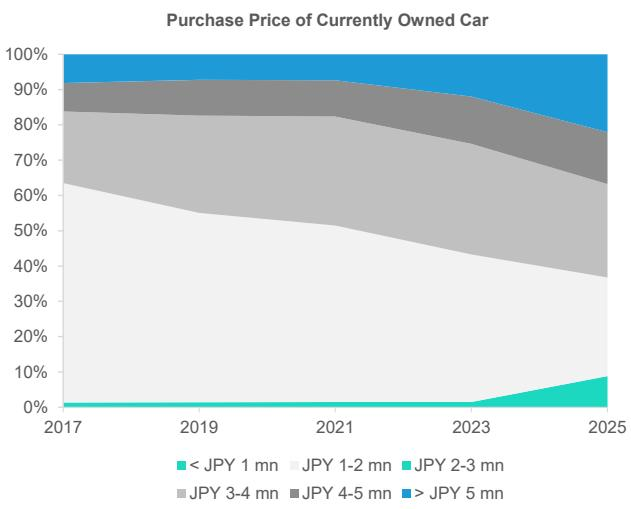  
Note: Cars counted were purchased within the past two years  
Source: JAMA, Bernstein analysis

## AFFORDABILITY PRESSURE IS WEAKENING CAR OWNERSHIP AMONG LOWER-INCOME HOUSEHOLDS

## Japan's real purchasing power and real disposable income per capita have been trending downward amid prolonged low growth and inflation

Rising financial burdens associated with car ownership are increasingly affecting individual car demand. Since the collapse of Japan's bubble economy in the 1990s, the country has experienced a prolonged period of low economic growth. Real GDP growth gradually declined from $4.8\%$ in 1990, reaching $-5.6\%$ during the global financial crisis and $-4.1\%$ in 2020 amid the COVID-19 pandemic. Growth has since remained largely in the $0 - 1\%$ range, suggesting that Japan's economy has remained in a long-term low-growth environment. Real wages, adjusted for inflation, have also remained sluggish and have been declining since 2021 (Exhibit 9).

In terms of nominal monthly disposable income over the past decade, household income appears to have improved at first glance, increasing 24% from JPY 429 thousand in 2016 to JPY 532 thousand in 2025. However, CPI has continued to rise since 2022 and reached 12p as of 2025. Reflecting the impact of inflation, real monthly disposable income declined 5% from its 2020 peak of JPY 499 thousand to JPY 476 thousand in 2025 (Exhibit 10).

EXHIBIT 9: As a result of prolonged stagnation in real GDP growth and real wages, real purchasing power per capita has been trending downward

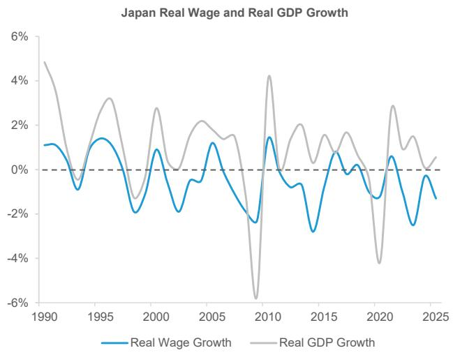  
Source: Ministry of Health, Labour and Welfare, IMF, Bernstein analysis  
EXHIBIT 10: Real monthly disposable income declined 5% from its 2020 peak of JPY 499 thousand to JPY 476 thousand in 2025

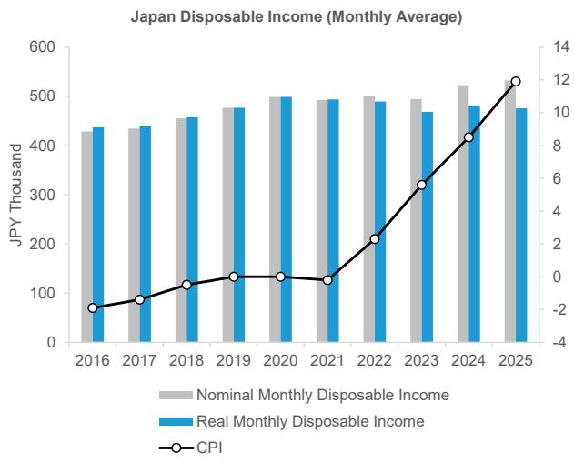  
Source: Ministry of Internal Affairs and Communications, Bernstein analysis

## Lower purchasing power is leading to diverging ownership behavior

Japanese automakers' ASPs have generally trended upward since 2015, although the degree of increase has varied by company. Average ASP increased $32\%$ , from JPY 2.9 mn in 2015 to JPY 3.8 mn in 2025. By automaker, Honda's ASP increased $50\%$ , from JPY 2.3 mn to JPY 3.5 mn, while Mazda's ASP also increased $49\%$ , from JPY 2.9 mn to JPY 4.3 mn. Suzuki, despite maintaining a sales mix centered on lower-priced cars, saw ASP increase $39\%$ , from JPY 1.4 mn to JPY 2.0 mn. Subaru's ASP increased $33\%$ , from JPY 4.2 mn to JPY 5.5 mn, while Toyota's ASP increased $13\%$ , from JPY 2.9 mn to JPY 3.3 mn (Exhibit 11).

EXHIBIT 11: Industry average ASP increased 32%, from JPY 2.9 mn in 2015 to JPY 3.8 mn in 2025  
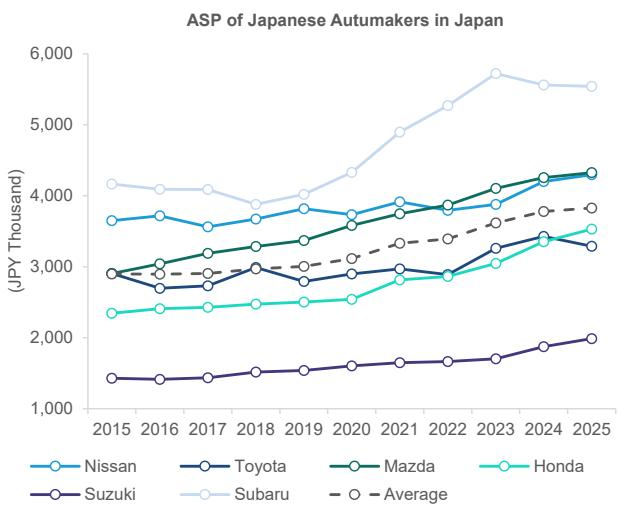  
Source: IHS, Company websites, Bernstein analysis

Inflation is having a larger impact on car usage and ownership among lower-income households. As of 2025, the ratio of households answering that inflation had an impact on car usage, including ‘reduced frequency of car use’, reached 37% among lower-income households earning below JPY 2.2 mn and 34% among households earning JPY 2.2-3.6 mn, the highest levels across all income brackets (Exhibit 12).

In contrast, the ratio declined as household income increased, falling to 25% among households earning above JPY 7.8 mn. Meanwhile, the ratio of households answering that there was ‘no impact’ stood at 50% among households earning below JPY 2.2 mn and 52% among households earning JPY 2.2-3.6 mn, while rising to 59% among households earning above JPY 7.8 mn.

The financial burden associated with car ownership is structurally heavier for lower-income households and relatively lighter for higher-income households. As of 2025, the combined ratio of households answering ‘high financial burden’ and ‘somewhat high financial burden’ reached 44% among lower-income households earning below JPY 2.2 mn and 40% among households earning JPY 2.2-3.6 mn, the highest levels across all income brackets. In contrast, the ratio remained at 29% among higher-income households earning above JPY 7.8 mn (Exhibit 13).

EXHIBIT 12: Inflation is having a larger impact on car usage and ownership among lower-income households

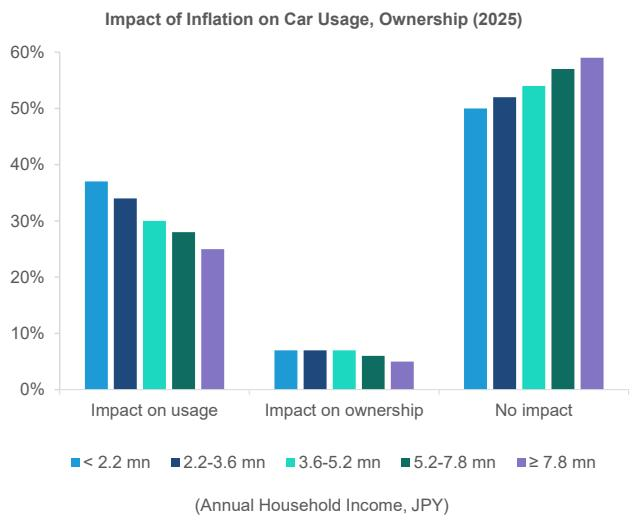  
Source: JAMA, Bernstein analysis  
EXHIBIT 13: The financial burden is heavier for lower-income households

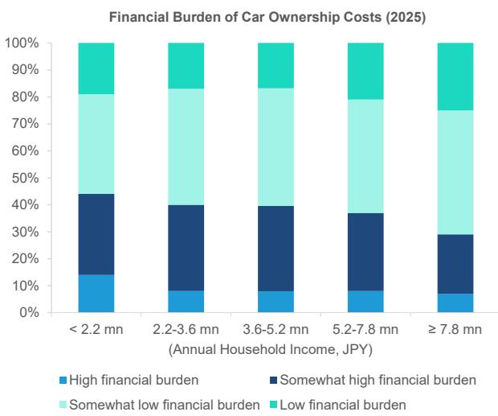  
Source: JAMA, Bernstein analysis

## Younger consumers are becoming less interested not only in car ownership itself, but also in obtaining a driver's license

In Japan, driver's license ownership itself, a prerequisite for car ownership, is declining particularly among younger generations, potentially weakening the foundation for future car ownership demand. As of 2025, a survey targeting young working adults showed that the ratio of respondents answering that they ‘hold a driver’s license’ stood at 67%, down 20%p from 87% in 2017 (Exhibit 14). Surveys targeting non-license holders also suggest that intention to obtain a driver’s license has been declining in recent years. The ratio of respondents answering that they ‘want to obtain a driver’s license’ declined 17%p, from 32% in 2017 to 15% in 2025 (Exhibit 15).

EXHIBIT 14: Driver's license ownership rates among young working adults declined from $87\%$ in 2017 to $67\%$ in 2025

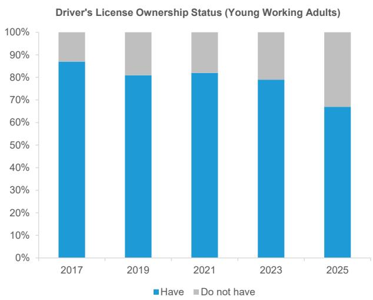  
Source: JAMA, Bernstein analysis

EXHIBIT 15: Intention to obtain a driver's license among young working adults declined from $32\%$ in 2017 to $15\%$ in 2025  
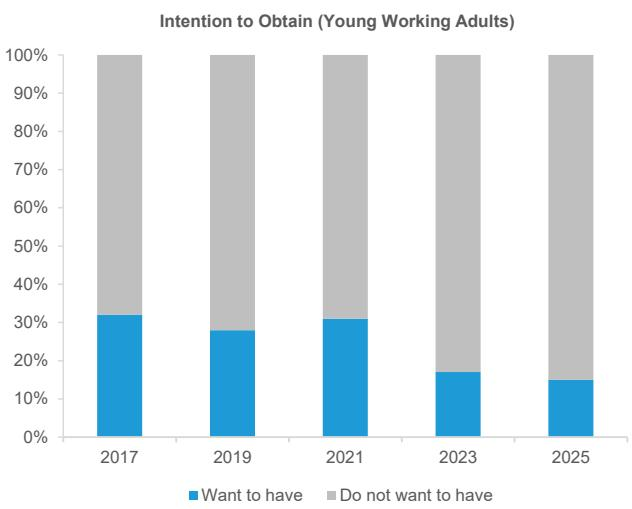  
Source: JAMA, Bernstein analysis

## The majority of new car sales in Japan have been replacement demand for existing car rather than new ownership demand

Japan's passenger car ownership has continued to trend upward since the 2000s, although the growth rate has gradually slowed. Passenger car ownership increased from 57.7 mn units in 2008 to 62.3 mn units in 2025, while CAGR during the same period remained limited at $0.44\%$ , with recent growth trending close to $0\%$ (Exhibit 16). This suggests that most new vehicle sales in Japan in recent years may have been supported by replacement demand rather than incremental new demand.

Growth in the number of driver's license holders has also slowed. The number of licensed drivers in Japan increased from 74.7 mn people in 2000 to 82.3 mn people in 2018, but growth has since stagnated, turning into a declining trend after 2019. In addition, the number of newly licensed drivers has also continued to decline, falling from 2.1 mn people in 2000 to 1.1 mn people in 2024 (Exhibit 17).

There is an extremely strong correlation between the number of driver's license holders and car ownership, with the correlation coefficient reaching $R^2 = 0.9966$ from 1970 to 2024. In addition, a strong correlation is also observed between the number of newly licensed drivers and the increase in passenger car registrations, with the correlation coefficient reaching $R^2 = 0.7446$ from 2000 to 2024 (Exhibit 18, Exhibit 19). These trends suggest that declines in the number of licensed drivers and newly licensed drivers could lead to slower growth in vehicle ownership and new vehicle demand over the medium to long term.

EXHIBIT 16: Growth in Japan's passenger car ownership has gradually slowed since the collapse of the bubble economy, with recent growth trending close to $0\%$  
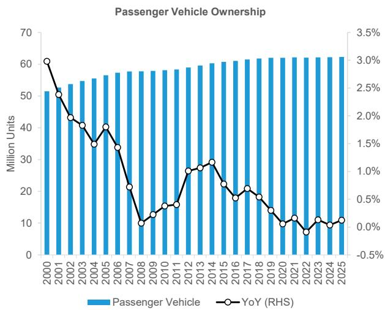  
Source: Automobile Inspection & Registration Information Association, Bernstein analysis

EXHIBIT 17: The number of licensed drivers in Japan increased from 74.7 mn people in 2000 to 82.3 mn people in 2018, but has been declining since 2019  
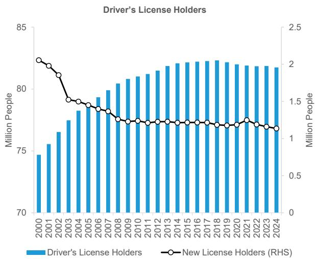  
Source: National Police Agency, Bernstein analysis

EXHIBIT 18: Historically, growth in the number of licensed drivers generally coincided with growth in passenger car ownership  
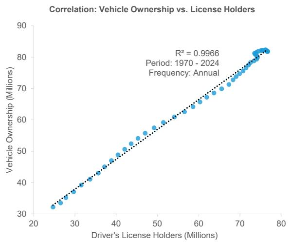  
Source: Automobile Inspection & Registration Information Association, National Police Agency, Bernstein analysis

EXHIBIT 19: If the decline in newly licensed drivers continues, growth in new vehicle demand for individual ownership could also slow  
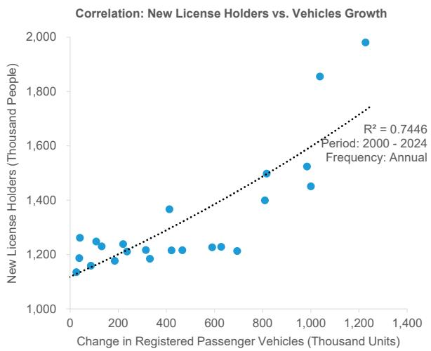  
Source: Automobile Inspection & Registration Information Association, National Police Agency, Bernstein analysis

## AUTOMAKERS WITH EXPOSURE TO BOTH LOW-END AND HIGH-END DEMAND ARE BETTER POSITIONED

## Toyota and Suzuki appear best positioned for a K-shaped market

K-shaped polarization in Japan's auto market could increasingly affect automakers' sales mix and profitability. Toyota's major sales models are distributed across a broad price range, from lower-priced to higher-priced segments. In addition to mass-market models such as Corolla and Yaris, higher-priced models above JPY 5 mn, including Alphard and Land Cruiser, also account for a certain portion of sales. Toyota is also characterized by relatively low dependence on any single model, with Yaris accounting for $9\%$ of domestic sales, Corolla $6\%$ , and Alphard $6\%$ , suggesting a well-balanced sales mix across a broad product lineup (Exhibit 20).

In contrast, some automakers show a higher concentration in specific models. At Suzuki, Spacia accounts for 23% of domestic sales, while Forester accounts for 28% at Subaru and N BOX accounts for 27% at Honda, indicating that a single model represents more than 20% of domestic sales in some cases. Suzuki maintains a sales mix centered on lower-priced vehicles, with high dependence on Kei-cars priced below JPY 2 mn, including Spacia and Hustler. Meanwhile, Mazda has relatively high exposure to mid-to-high-priced models, with CX-5 accounting for 16%, CX-60 7%, and Roadster 7% of domestic sales. Honda maintains relatively balanced exposure from lower-priced to mid-priced segments, supported by models such as N BOX, Freed at 15%, Step WGN at 9%, and ZR-V at 3%.

In terms of the combined sales mix of the low-end segment below JPY 2 mn and the high-end segment above JPY 5 mn, Suzuki ranked highest at 74%, reflecting particularly strong exposure to the low-end segment. Meanwhile, Toyota recorded the second-highest ratio at 43%, consisting of 26% exposure to the low-end segment and 17% exposure to the high-end segment. In addition to the Toyota brand, the company benefits from Daihatsu, which has strength in lower-priced vehicles, and Lexus, its luxury brand, enabling balanced exposure to both lower-priced and higher-priced segments (Exhibit 21).

Honda also recorded relatively high exposure to the low-end segment at 37%, although exposure to the high-end segment remained limited at 1%, resulting in combined low-end and high-end segment exposure of 38%. Mazda recorded relatively high exposure to the mid-priced segment between JPY 2-5 mn, which accounted for 63% of sales mix, while combined low-end and high-end segment exposure stood at 37%. Subaru's sales mix was heavily concentrated in the JPY 3-5 mn price range, accounting for approximately 90% of total sales. While Subaru maintains high exposure to upper-mid-priced vehicles, combined low-end and high-end segment exposure remained limited at 10%.

EXHIBIT 20: K-shaped polarization in Japan's auto market could increasingly affect automakers' sales mix

<table><tr><td colspan="4">Nissan</td><td colspan="3">Toyota</td><td colspan="3">Mazda</td></tr><tr><td></td><td>Car Name</td><td>Mix</td><td>MSRP</td><td>Car Name</td><td>Mix</td><td>MSRP</td><td>Car Name</td><td>Mix</td><td>MSRP</td></tr><tr><td>1</td><td>Note</td><td>19%</td><td>2,719</td><td>Voxy</td><td>8%</td><td>4,066</td><td>CX-5</td><td>16%</td><td>3,804</td></tr><tr><td>2</td><td>Roox</td><td>18%</td><td>2,068</td><td>Hijet</td><td>7%</td><td>1,392</td><td>Mazda 2</td><td>16%</td><td>2,111</td></tr><tr><td>3</td><td>Serena</td><td>18%</td><td>3,943</td><td>Tanto</td><td>6%</td><td>1,653</td><td>Flair wagon</td><td>9%</td><td>1,689</td></tr><tr><td>4</td><td>Dayz</td><td>11%</td><td>1,798</td><td>Alphard</td><td>6%</td><td>10,225</td><td>CX-30</td><td>9%</td><td>3,360</td></tr><tr><td>5</td><td>NV100</td><td>5%</td><td>1,339</td><td>Sienta</td><td>5%</td><td>2,965</td><td>Mazda 3</td><td>8%</td><td>3,131</td></tr><tr><td>6</td><td>Caravan</td><td>5%</td><td>6,632</td><td>Raize</td><td>5%</td><td>2,003</td><td>CX-60</td><td>7%</td><td>4,766</td></tr><tr><td>7</td><td>X-Trail</td><td>5%</td><td>4,903</td><td>Roomy</td><td>5%</td><td>1,739</td><td>Roadster</td><td>7%</td><td>5,256</td></tr><tr><td>8</td><td>Sakura</td><td>4%</td><td>2,724</td><td>Yaris Cross</td><td>4%</td><td>2,555</td><td>CX-80</td><td>6%</td><td>5,964</td></tr><tr><td>9</td><td>NV200</td><td>3%</td><td>2,829</td><td>Hiace</td><td>4%</td><td>3,862</td><td>CX-3</td><td>5%</td><td>3,131</td></tr><tr><td>10</td><td>Kicks</td><td>2%</td><td>3,624</td><td>Yaris</td><td>4%</td><td>2,162</td><td>Flair Crossover</td><td>4%</td><td>1,782</td></tr></table>

<table><tr><td colspan="4">Honda</td><td colspan="3">Suzuki</td><td colspan="3">Subaru</td></tr><tr><td></td><td>Car Name</td><td>Mix</td><td>MSRP</td><td>Car Name</td><td>Mix</td><td>MSRP</td><td>Car Name</td><td>Mix</td><td>MSRP</td></tr><tr><td>1</td><td>N BOX</td><td>27%</td><td>1,886</td><td>Spacia</td><td>23%</td><td>1,678</td><td>Forester</td><td>28%</td><td>4,246</td></tr><tr><td>2</td><td>Freed</td><td>15%</td><td>2,914</td><td>Hustler</td><td>12%</td><td>1,824</td><td>Crosstrek</td><td>20%</td><td>3,534</td></tr><tr><td>3</td><td>Vezel</td><td>11%</td><td>3,360</td><td>Every</td><td>11%</td><td>1,738</td><td>Levorg</td><td>14%</td><td>4,499</td></tr><tr><td>4</td><td>Step WGN</td><td>9%</td><td>3,774</td><td>Solio</td><td>7%</td><td>2,288</td><td>Impreza</td><td>10%</td><td>3,330</td></tr><tr><td>5</td><td>Fit</td><td>8%</td><td>2,178</td><td>Jimny</td><td>12%</td><td>2,039</td><td>Outback</td><td>6%</td><td>4,325</td></tr><tr><td>6</td><td>N-Joy</td><td>5%</td><td>2,112</td><td>Carry Pickup</td><td>7%</td><td>1,378</td><td>Chiffon</td><td>4%</td><td>1,623</td></tr><tr><td>7</td><td>N-VAN</td><td>5%</td><td>1,884</td><td>Wagon R</td><td>5%</td><td>1,630</td><td>Rex</td><td>3%</td><td>2,260</td></tr><tr><td>8</td><td>N-WGN</td><td>4%</td><td>1,699</td><td>Smile</td><td>5%</td><td>1,551</td><td>Stella</td><td>3%</td><td>1,708</td></tr><tr><td>9</td><td>WR-V</td><td>4%</td><td>2,490</td><td>Alto</td><td>4%</td><td>1,236</td><td>Samber Van</td><td>3%</td><td>1,535</td></tr><tr><td>10</td><td>ZR-V</td><td>3%</td><td>4,218</td><td>Swift</td><td>4%</td><td>2,030</td><td>BRZ</td><td>3%</td><td>4,400</td></tr></table>

Note: MSRP unit is JPY thousand  
Source: IHS, Company websites, Bernstein analysis

EXHIBIT 21: Combined low-end and high-end segment exposure stands at 74% for Suzuki and 43% for Toyota  
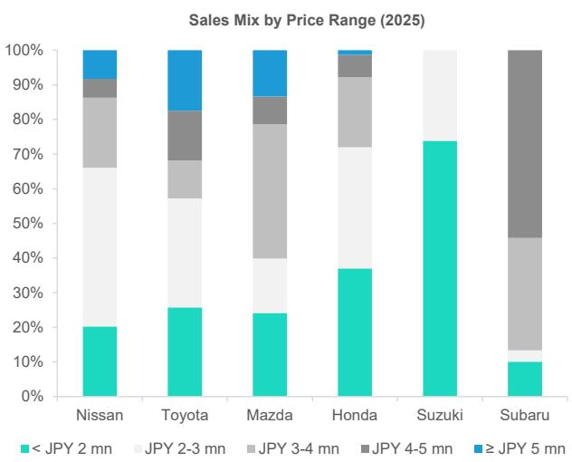  
Source: IHS, Company websites, Bernstein analysis

Automakers with higher exposure to both low-end and high-end segments tend to maintain relatively higher operating profit margins in Japan. Toyota recorded 43% low-end and high-end exposure, while operating profit margin in Japan reached 11%, the highest level among Japanese automakers. Suzuki also recorded the highest exposure at 74%, while operating profit margin reached 9%, suggesting that the company is benefiting from K-shaped polarization (Exhibit 22).

In contrast, Nissan's exposure stood at 29%, while operating profit margin remained around 0%. Mazda and Subaru recorded exposure levels of 37% and 10%, respectively, while operating profit margins stood at -5% and -11%. Honda recorded 38% exposure, although operating profit margin remained at -14%. This suggests that automakers with exposure to both low-end and high-end segments tend to maintain higher profitability under a K-shaped demand environment, with Toyota and Suzuki appearing relatively well positioned.

EXHIBIT 22: Automakers with exposure to both low-end and high-end segments tend to maintain higher profitability under a K-shaped demand environment

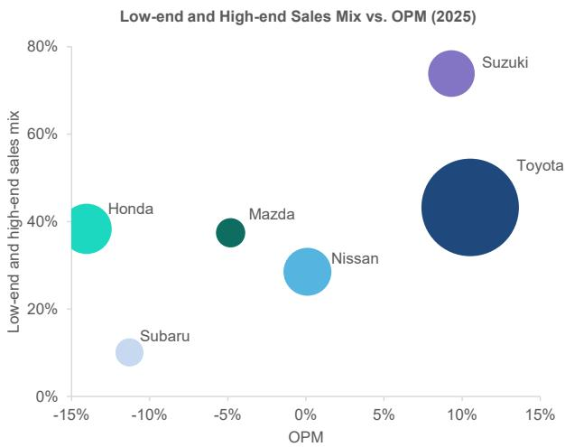  
Note: Low-end denotes <JPY 2 mn, while high-end denotes ≥JPY 5 mn; Bubble size is proportional to automotive sales in Japan  
Source: IHS, Company websites, Bernstein analysis

## SHARED MOBILITY BENEFITS AS CAR OWNERSHIP BECOMES LESS AFFORDABLE

## Shared mobility offers stronger economic rationality than car ownership

Another factor supporting the adoption of shared mobility is its superior economic efficiency compared with individual car ownership. Car ownership involves substantial fixed costs, including parking fees, insurance premiums, and maintenance expenses. For users with limited annual driving distance, using car sharing or ride sharing only when necessary can be more cost-efficient than owning a car.

The assumptions used to compare annual usage costs among car ownership, car sharing, and ride sharing are as follows (Exhibit 23). Vehicle purchase cost is based on the average MSRP of the top 10 best-selling cars in Japan, assuming depreciation over eight years. Parking fees are based on the average monthly parking cost within Tokyo's 23 wards. Auto insurance premiums are calculated by dividing total voluntary insurance spending by the number of registered cars in Japan, resulting in annual voluntary insurance cost per car. Maintenance costs include mandatory inspections, compulsory automobile liability insurance, and parts replacement expenses.

For car sharing, the pricing structure of Times Car Share, the largest operator in Japan, is used, assuming a pay-as-you-go model based on usage time and travel distance. For ride sharing, pricing equivalent to current taxi fares in Japan is applied. In addition, car sharing usage assumptions include seven minutes of usage time per 1 km traveled and four trips per week.

Based on these assumptions, ride sharing is more affordable than car ownership when annual travel distance is below 2,000 km, while car sharing becomes more economically rational when annual travel distance is below 7,000 km (Exhibit 24). This is particularly relevant in urban areas, where public transportation usage is high and privately owned car tend to be used infrequently and for shorter distances, increasing compatibility with shared mobility services.

EXHIBIT 23: To compare annual usage costs among car ownership, car sharing, and ride sharing, assumptions were primarily based on car users in Tokyo

<table><tr><td>Assumptions</td><td>Period</td><td>Car Ownership</td><td>Car Sharing</td><td>Ride Sharing</td></tr><tr><td>Vehicle purchase cost</td><td>per 8 years</td><td>JPY 3,053,200</td><td>-</td><td>-</td></tr><tr><td>Parking fee</td><td>per 1 month</td><td>JPY 27,103</td><td>-</td><td>-</td></tr><tr><td>Auto insurance premium</td><td>per 1 year</td><td>JPY 25,008</td><td>-</td><td>-</td></tr><tr><td>Maintenance cost</td><td>per 1 year</td><td>JPY 60,000</td><td>-</td><td>-</td></tr><tr><td>Fuel cost</td><td>-</td><td>JPY 165 / liter</td><td>-</td><td>-</td></tr><tr><td>Base fare</td><td>-</td><td>-</td><td>-</td><td>JPY 500 (first 1km)</td></tr><tr><td>Time-based fee</td><td>-</td><td>-</td><td>JPY 220 / 15 minutes</td><td>-</td></tr><tr><td>Distance-based fee</td><td>-</td><td>-</td><td>JPY 20 / 1 km</td><td>JPY 100 / 232 m</td></tr></table>

Note: The purchased vehicle is depreciated over 8 years; Shared mobility assumes 4 trips per week; For car sharing, usage is assumed to be 7 minutes per 1 km; Maintenance cost includes periodic vehicle inspection costs, including compulsory automobile liability insurance, and associated parts replacement; Auto insurance premium refers to voluntary insurance.

Source: Ministry of Internal Affairs and Communications, Ministry of Land, Infrastructure, Transport and Tourism, Company websites, Bernstein analysis and estimates

EXHIBIT 24: Ride sharing is more affordable below 2,000 km annually, while car sharing is more affordable below 7,000 km than car ownership  
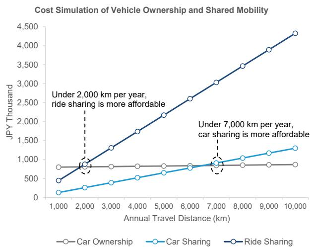  
Source: Ministry of Internal Affairs and Communications, Ministry of Land, Infrastructure, Transport and Tourism, Company websites, Bernstein analysis and estimates

## Shared mobility shifts value from car ownership to mobility ecosystems

Value creation in the automotive industry is gradually shifting from the traditional car ownership-centered model toward a mobility platform-centered model. Under the traditional automotive industry structure, automakers primarily generated one-time revenue through vehicle sales. In contrast, within the shared mobility market, continuous monetization through mobility services, software, data, and applications is becoming increasingly important relative to the vehicle itself. In particular, connected services, fleet-based mobility solutions, sales finance, and subscription services could become increasingly

important monetization models going forward.

Shared mobility vehicles generally maintain higher utilization rates compared with privately owned vehicles, creating structures that are more conducive to continuous monetization opportunities through vehicle inspections and parts replacement, software maintenance, fleet management, insurance, and sales finance. For automakers, the key factor is no longer simply vehicle sales, but rather how much recurring revenue can be generated throughout the entire lifecycle of each vehicle. As a result, value creation is gradually shifting away from traditional midstream car manufacturing toward upstream technology domains and downstream recurring-service businesses (Exhibit 25).

EXHIBIT 25: Autonomy penetration will accelerate the shift of added value downstream in the car value chain  
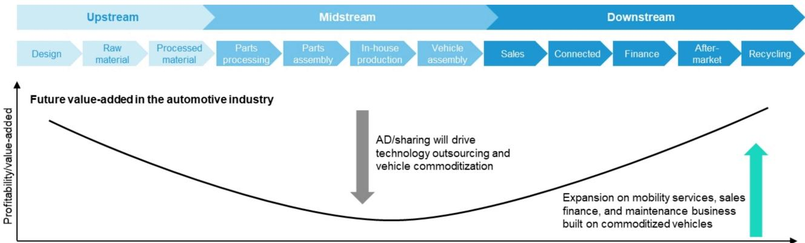

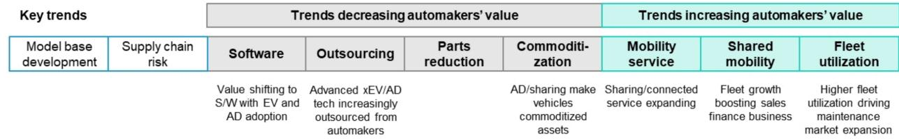  
Source: The Ministry of Economy, Trade and Industry of Japan, Bernstein analysis

## I. REQUIRED DISCLOSURES

References to "Bernstein" or the "Firm" in these disclosures relate to the following entities: Bernstein Institutional Services LLC (April 1, 2024 onwards), Bernstein & Co., LLC (pre April 1, 2024), Bernstein Autonomous LLP, BSG France S.A. (April 1, 2024 onwards), Bernstein (Hong Kong) Limited 盛博香港有限公司, Bernstein (Canada) Limited, Bernstein (India) Private Limited (SEBI registration no. INH000006378), Bernstein (Singapore) Private Limited, Bernstein Japan KK (サンフォード・C・バーンスタイン株式会社) and analysts employed by SG Africa Technologies & Services to produce Bernstein under a Global Services Agreement in place between Bernstein and SG.

Bernstein is part of a joint venture between SG (SG) and AllianceBernstein, L.P. (AB). Unless specifically noted otherwise, for purposes of these disclosures, references to Bernstein's “affiliates” relate to both SG and AB and their respective affiliates.

## VALUATION METHODOLOGY

## Toyota Motor Corporation

We set a price target of JPY 4,200 using reset PBR (P/B multiple) of 1.26x against our FY3/28 BPS estimate of JPY 3,357.

## Suzuki Motor Corporation

We set price target of JPY 2,550 using SOTP valuation. Per business segment, EV/EBITDA 13.8x applied to FY3/28 EBITDA estimates of JPY 447 bn for India business, EV/EBITDA 3.1x applied to FY3/28 EBITDA estimates of JPY 566 bn for non-India business.

## Honda Motor Co Ltd

We set price target of JPY 1,300 using PBR (P/B multiple) of 0.36x against our FY3/28 BPS estimate of JPY 3,664.

## Nissan Motor Co Ltd

We set price target of JPY 350 using PBR (P/B multiple) of 0.24x against our FY3/28 BPS estimate of JPY 1,479.

## Mazda Motor Corporation

We set price target of JPY 1,000 using PBR (P/B multiple) of 0.39x against our FY3/28 BPS estimate of JPY 2,489.

## Subaru Corporation

We set price target of JPY 2,350 using PBR (P/B multiple) of 0.56x against our FY3/28 BPS estimate of JPY 4,251.

## RISKS

## Toyota Motor Corporation

Key downside risks would be 1) increase in US import tariffs, 2) slowdown in HEV demand, 3) delay of domestic production recovery.

## Suzuki Motor Corporation

Key downside risks to our Suzuki price target would be 1) weaker-than-expected demand in India, 2) delay of new model launches in India, 3) delay in further tightening relationship with Toyota.

## Honda Motor Co Ltd

Key upside risks to our Honda price target would be 1) announcement of further collaboration/consolidation with Sony, 2) reduction of future investment plans, 3) announcement of additional share buybacks. Key downside risks would be 1) increase in

US import tariffs, 2) announcement of merger with Nissan, 3) decline in motorcycle sales and profits.

## Nissan Motor Co Ltd

Key upside risks to our Nissan price target would be 1) announcement of merger with external partners, 2) earlier-than-expected achievement of turnaround plans, 3) deeper collaboration with Honda.

## Mazda Motor Corporation

Key upside risks to our Mazda price target would be 1) cancellation of additional US import tariffs, 2) JPY depreciation, 3) decrease in US incentives, 4) announcement of further collaboration/consolidation with Toyota.

## Subaru Corporation

Key upside risks to our Subaru price target would be 1) JPY depreciation, 2) 2) an earlier-than-expected ramp up at plants that resumed production, 3) announcement of further collaboration/consolidation with Toyota.

## RATINGS DEFINITIONS, BENCHMARKS AND DISTRIBUTION

## EQUITY RATINGS DEFINITIONS

## Bernstein brand

The Bernstein brand rates stocks based on forecasts of relative performance for the next 12 months versus the S&P 500 for stocks listed on the U.S. and Canadian exchanges, versus the Bloomberg Europe Developed Markets Large and Mid Cap Price Return Index EUR (EDME) for stocks listed on the European exchanges and emerging markets exchanges outside of the Asia Pacific region, versus the Bloomberg Japan Large and Mid Cap Price Return Index USD (JPL) for stocks listed on the Japanese exchanges, and versus the Bloomberg Asia ex-Japan Large and Mid Cap Price Return Index (ASIAX) for stocks listed on the Asian (ex-Japan) exchanges -unless otherwise specified.

The Bernstein brand has three categories of ratings:

\- Outperform: Stock will outpace the market index by more than 15 pp

• Market-Perform: Stock will perform in line with the market index to within +/-15 pp

• Underperform: Stock will trail the performance of the market index by more than 15 pp

Coverage Suspended: Coverage of a company under the Bernstein brand has been suspended. Ratings and price targets are suspended temporarily, are no longer current, and should therefore not be relied upon.

Not Rated: A rating assigned when the stock cannot be accurately valued, or the performance of the company accurately predicted, at the present time. The covering analyst may continue to publish research reports on the company to update investors on events and developments.

Not Covered (NC) denotes companies that are not under coverage.

Bernstein brand stock ratings are based on a 12-month time horizon.

## Autonomous brand – common stocks

The Autonomous brand rates common stocks as indicated below. As our benchmarks we use the Bloomberg Europe 500 Banks And Financial Services Index (BEBANKS) and Bloomberg Europe Dev Mkt Financials Large and Mid Cap Price Ret Index EUR (EDMFI) index for developed European banks and Payments, the Bloomberg Europe 500 Insurance Index (BEINSUR) for European insurers, the S&P 500 and S&P Financials for US banks and Payments coverage, S5LIFE for US Insurance, the S&P Insurance Select Industry (SPSIINS) for US Non-Life Insurers coverage, and the Bloomberg Emerging Markets Financials Large, Mid and Small Cap Price Return Index (EMLSF) for emerging market banks and insurers and Payments. Ratings are stated relative to the sector (not the market).

The Autonomous brand has three categories of common stock ratings:

\- Outperform (OP): Stock will outpace the relevant index by more than 10 pp

\- Neutral (N): Stock will perform in line with the market index to within +/-10 pp

• Underperform (UP): Stock will trail the performance of the relevant index by more than 10 pp

Coverage Suspended: Coverage of a company under the Autonomous research brand has been suspended. Ratings and price targets are suspended temporarily, are no longer current, and should therefore not be relied upon.

Not Rated: A rating assigned when the stock cannot be accurately valued, or the performance of the company accurately predicted, at the present time. The covering analyst may continue to publish research reports on the company to update investors on events and developments.

Those denoted as ‘Feature’ (e.g., Feature Outperform FOP, Feature Under Outperform FUP) are our core ideas.

Not Covered (NC) denotes companies that are not under coverage.

Autonomous brand common stock ratings are based on a 12-month time horizon.

## Autonomous brand – preferred stocks

The Autonomous brand has three categories of preferred stock ratings:

\- Outperform (OP): The total return of the preferred instrument is expected to outperform preferred securities of other issuers operating in similar sectors or rating categories over the next six months.

\- Neutral (N): The total return of the preferred instrument is expected to perform in line with preferred securities of other issuers operating in similar sectors or rating categories over the next six months.

\- Underperform (UP): The total return of the preferred instrument is expected to underperform preferred securities of other issuers operating in similar sectors or rating categories over the next six months.

Autonomous preferred stock ratings are based on a 6-month time horizon.

## AUTONOMOUS CREDIT RESEARCH

Where this report contains investment recommendations for credit instruments, as defined in article 3(1)(35) of the Market Abuse Regulation, the information below is presented to comply with its disclosure requirements.

The report may also include reference(s) to published opinions by other Autonomous or Bernstein analysts covering the equity securities of the issuer(s) referenced herein. Please note an investment recommendation for credit instruments published by the author(s) of this report may differ from the published view of the analyst covering equity securities for the issuer(s) contained in this report and vice versa.

## CREDIT RATINGS DEFINITIONS

The Autonomous brand has three categories of credit ratings:

\- Credit Outperform (C-OP): The total return of the Reference Credit Instrument is expected to outperform the credit spread of bonds of other issuers operating in similar sectors or rating categories over the next six months.

\- Credit Neutral (C-N): The total return of the Reference Credit Instrument is expected to perform in line with the credit spread of bonds of other issuers operating in similar sectors or rating categories over the next six months.

\- Credit Underperform (C-UP): The total return of the Reference Credit Instrument is expected to underperform the credit spread of bonds of other issuers operating in similar sectors or rating categories over the next six months.

Autonomous credit ratings are based on a 6-month time horizon.

A list of all investment recommendations produced by the author(s) of this report alongside credit ratings history are available upon request.

It is at the sole discretion of the Firm as to when to initiate, update and cease research coverage. The Firm has established, maintains and relies on information barriers to control the flow of information contained in one or more areas (i.e. the private side) within the Firm, and into other areas, units, groups or affiliates (i.e. public side) of the Firm

## DISTRIBUTION OF EQUITY RATINGS/INVESTMENT BANKING SERVICES

<table><tr><td>Equity Rating</td><td>Market Abuse Regulation (MAR) and FINRA Rating Category</td><td>Global Rating Distribution</td><td>Investment Banking Relationships*</td></tr><tr><td>Outperform</td><td>BUY</td><td>51.1%</td><td>16.5%</td></tr><tr><td>Market-Perform (Bernstein Brand) Neutral (Autonomous Brand)</td><td>HOLD</td><td>36.3%</td><td>17.8%</td></tr><tr><td>Underperform</td><td>SELL</td><td>12.6%</td><td>14.9%</td></tr></table>

\* These figures represent the percentage of companies within each equity rating category for which affiliates of Bernstein have provided investment banking services within the previous 12 months.
As of March 31, 2026. All figures are updated quarterly.

## PRICE CHARTS / RATINGS AND PRICE TARGET HISTORY

Toyota Motor Corporation (7203.JP) Rating History for Bernstein as of 06/23/2026  

Suzuki Motor Corporation (7269.JP) Rating History for Bernstein as of 06/23/2026  

Honda Motor Co Ltd (7267.JP) Rating History for Bernstein as of 06/23/2026  
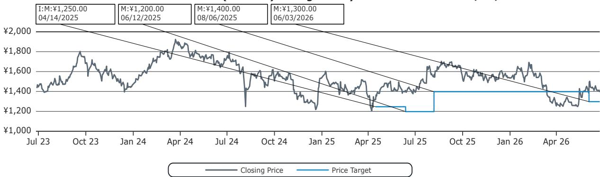  
Outperform (O); Market-Perform (M); Underperform (U); Coverage Suspended (CS); Not Covered (NC)

Nissan Motor Co Ltd (7201.JP) Rating History for Bernstein as of 06/23/2026  
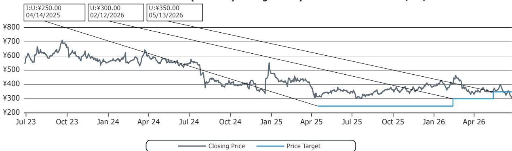  
Outperform (O); Market-Perform (M); Underperform (U); Coverage Suspended (CS); Not Covered (NC)

Mazda Motor Corporation (7261.JP) Rating History for Bernstein as of 06/23/2026  
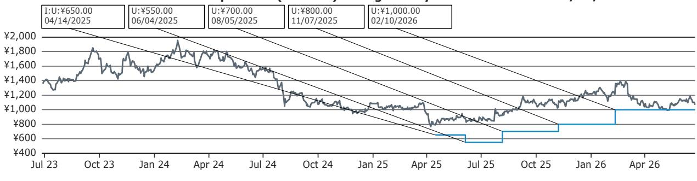  
Outperform (O); Market-Perform (M); Underperform (U); Coverage Suspended (CS); Not Covered (NC)

Subaru Corporation (7270.JP) Rating History for Bernstein as of 06/23/2026  
  
All price target and closing price data in the chart(s) above are denominated in the currency noted in the Ticker Table of this report.

## CONFLICTS OF INTEREST

Bernstein and/or affiliates have received compensation for investment banking services in the past twelve months from Toyota Motor Corporation and Nissan Motor Co Ltd.

Bernstein and/or affiliates have received compensation for non-investment banking securities-related products or services in the previous twelve months from the following clients: Toyota Motor Corporation, Suzuki Motor Corporation, Honda Motor Co Ltd and Mazda Motor Corporation.

Bernstein and/or affiliates expect to receive or intend to seek compensation for investment banking services in the next three months from Toyota Motor Corporation and Nissan Motor Co Ltd.

Bernstein and/or affiliates had an investment banking client relationship during the past twelve months with Toyota Motor Corporation and Nissan Motor Co Ltd.

Affiliates of Bernstein managed or co-managed in the past twelve months a public offering of securities of Toyota Motor Corporation and Nissan Motor Co Ltd.

Certain affiliates of Bernstein act as market maker or liquidity provider in the debt securities of: Toyota Motor Corporation and Honda Motor Co Ltd.

## OTHER MATTERS

The legal entity(ies) employing the analyst(s) listed in this report, and their location, can be determined by the country code of their phone number, as follows:

+1 Bernstein Institutional Services LLC; New York, New York, USA

+44 Bernstein Autonomous LLP; London UK

+212 SG Africa Technologies & Services; Casablanca, Morocco

+33 BSG France S.A.; Paris, France

+34 BSG France S.A.; Madrid, Spain

+41 Bernstein Autonomous LLP; Geneva, Switzerland

+49 BSG France S.A.; Frankfurt, Germany

+91 Bernstein (India) Private Limited; Mumbai, India

+852 Bernstein (Hong Kong) Limited 盛博香港有限公司; Hong Kong, China

+65 Bernstein (Singapore) Private Limited; Singapore

+81 Bernstein Japan KK; Tokyo, Japan

Where this report has been prepared by research analyst(s) employed by a non-US affiliate, such analyst(s), is/are (unless otherwise expressly noted below) not registered as associated persons of Bernstein Institutional Services LLC or any other SEC-registered broker-dealer and are not licensed or qualified as research analysts with FINRA. Accordingly, such analyst(s) may not be subject to FINRA's restrictions regarding (among other things) communications by research analysts with a subject company, interactions between research analysts and investment banking personnel, participation by research analysts in solicitation and marketing activities relating to investment banking transactions, public appearances by research analysts, and trading securities held by a research analyst account.

Where this report has been prepared by research analyst(s) employed by SG Africa Technologies & Services (part of the SG group of companies), it has been prepared on behalf of a Bernstein company under a Global Services Agreement in place between Bernstein and SG.

## CERTIFICATION

Each research analyst listed in this report, who is primarily responsible for the preparation of the content of this report, certifies that all of the views expressed in this publication accurately reflect that analyst's personal views about any and all of the subject securities or issuers and that no part of that analyst's compensation was, is, or will be, directly or indirectly, related to the specific recommendations or views in this publication.

## II. ADDITIONAL GLOBAL CONFLICT DISCLOSURES

It is at the sole discretion of the Firm as to when to initiate, update and cease research coverage. The Firm has established, maintains and relies on information barriers to control the flow of information contained in one or more areas (i.e., the private side) within the Firm, and into other areas, units, groups or affiliates (i.e., public side) of the Firm.

## III. OTHER IMPORTANT INFORMATION AND DISCLOSURES

Separate branding is maintained for “Bernstein” and “Autonomous” research products.

\- Bernstein produces a number of different types of research products including, among others, fundamental analysis and quantitative analysis under both the “Autonomous” and “Bernstein” brands. Recommendations contained within one type of research product may differ from recommendations contained within other types of research products, whether as a result of differing time horizons, methodologies or otherwise. Furthermore, views or recommendations within a research product issued under one brand may differ from views or recommendations under the same type of research product issued under the other brand. The Research Ratings System for the two brands and other information related to those Rating Systems are included in the previous section.

\- Autonomous operates as a separate business unit within the following entities: Bernstein Institutional Services LLC, Bernstein Autonomous LLP, Bernstein (Hong Kong) Limited 盛博香港有限公司 and Bernstein (India) Private Limited. For information relating to “Autonomous” branded products (including certain Sales materials) please visit: www.autonomous.com. For information relating to Bernstein branded products please visit: www.bernsteinresearch.com.

Analysts are compensated based on aggregate contributions to the research franchise as measured by account penetration, productivity and proactivity of investment ideas. No analysts are compensated based on performance in, or contributions to, generating investment banking revenues.

This report has been produced by an independent analyst as defined in Article 3 (1)(34)(i) of EU 596/2014 Market Abuse Regulation (“MAR”) and the same article of MAR as it forms part of United Kingdom domestic law by virtue of the European Union (Withdrawal) Act 2018.

To our readers in the United States: Bernstein Institutional Services LLC, a broker-dealer registered with the U.S. Securities and Exchange Commission (“SEC”) and a member of the U.S. Financial Industry Regulatory Authority, Inc. (“FINRA”) is distributing this publication in the United States and accepts responsibility for its contents. Where this material contains an analysis of debt product(s), such material is intended only for institutional investors and is not subject to the US independence and disclosure standards applicable to debt research prepared for retail investors.

Bernstein Institutional Services LLC may act as principal for its own account or as agent for another person (including an affiliate) in sales or purchases of any security which is a subject of this report. This report does not purport to meet the objectives or needs of any specific individuals, entities or accounts.

To our readers in Canada: If this publication pertains to a Canadian domiciled company, it is being distributed in Canada by Bernstein (Canada) Limited, which is licensed and regulated by the Canadian Investment Regulatory Organization. If the publication pertains to a non-Canadian domiciled company, it is being distributed by Bernstein Institutional Services LLC, which is licensed and regulated by both the SEC and FINRA, into Canada under the International Dealers Exemption.

This document may not be passed onto any person in Canada unless that person qualifies as "permitted client" as defined in Section 1.1 of NI 31-103.

To our readers in Brazil: This report has been prepared by Bernstein Institutional Services LLC, and Banco BTG Pactual S.A. ("BTG") is responsible for the distribution of this report in Brazil.

To readers in the United Kingdom: This publication has been issued or approved for issue in the United Kingdom by Bernstein Autonomous LLP, authorised and regulated by the Financial Conduct Authority and located at 60 London Wall, London EC2M 5SH, +44 (0)20-7170-5000. Registered in England & Wales No OC343985.

This document is for distribution only to persons who (i) have professional experience in matters relating to investments falling within Article 19(5) of the Financial Services and Markets Act 2000 (Financial Promotion) Order 2005 (as amended, the “Financial Promotion Order”), (ii) are persons falling within Article 49(2)(a) to (d) (“high net worth companies, unincorporated associations, etc.”) of the Financial Promotion Order, (iii) are outside the United Kingdom, or (iv) are persons to whom an invitation or inducement to engage in investment activity (within the meaning of section 21 of the FSMA) in connection with the issue or sale of any securities may otherwise lawfully be communicated or caused to be communicated (all such persons together being referred to as “relevant persons”). This document is directed only at relevant persons and must not be acted on or relied on by persons who are not relevant persons. Any investment or investment activity to which this document relates is available only to relevant persons and will be engaged in only with relevant persons.

To our readers in the member states of the EEA: This publication is being distributed by BSG France SA, which is authorised and regulated by the Autorité de Contrôle Prudentiel et de Résolution (ACPR) and Autorité des Marchés Financiers (AMF).

To our readers in Hong Kong: This publication is being distributed in Hong Kong by Bernstein (Hong Kong) Limited 盛博香港有限公司, which is licensed and regulated by the Hong Kong Securities and Futures Commission (Central Entity No. AXC846) to carry out Type 4 (Advising on Securities) regulated activities and subject to the licensing conditions mentioned in the SFC Public Register (https://www.sfc.hk/publicregWeb/corp/AXC846/details)). This publication is solely for professional investors, as defined in the Securities and Futures Ordinance (Cap. 571). The purpose of this report is solely to provide an analysis of the issuers referred to in this report and is not intended for any purpose contrary to the laws of Hong Kong.

To our readers in Singapore: This publication is being distributed in Singapore by Bernstein (Singapore) Private Limited, only to accredited investors or institutional investors, as defined in the Securities and Futures Act 2001 of Singapore ("SFA"). Recipients in Singapore should contact Bernstein (Singapore) Private Limited in respect of matters arising from, or in connection with, this publication. Bernstein (Singapore) Private Limited is regulated by the Monetary Authority of Singapore and licensed under the SFA as a capital markets services licence holder for dealing in capital markets products that are securities and collective investment schemes and an exempt financial adviser for advising on, issuing and promulgating analyses and reports on securities. Bernstein (Singapore) Private Limited is registered in Singapore with Company Registration No. 20213710W and located at 8 Marina Boulevard, #12-01, Marina Bay Financial Centre, Singapore 018981, +65-6326-7000.

To our readers in the People's Republic of China: The securities referred to in this document are not being offered or sold and may not be offered or sold, directly or indirectly, in the People's Republic of China (for such purposes, not including the Hong Kong and Macau Special Administrative Regions or Taiwan, the "PRC") in contravention of any applicable laws of the PRC.

This document does not constitute an offer to sell or the solicitation of an offer to buy any securities in the PRC to any person to whom it is unlawful to make the offer or solicitation in the PRC.

We do not represent that this document may be lawfully distributed, or that any securities may be lawfully offered, in compliance with any applicable registration or other requirements in the PRC, or pursuant to an exemption available thereunder, or assume any responsibility for facilitating any such distribution or offering. In particular, no action has been taken by us which would permit a public offering of any securities or distribution of this document in the PRC. Accordingly, the securities are not being offered or sold within the PRC by means of this document or any other document. Neither this document nor any advertisement or other offering material may be distributed or published in the PRC, except under circumstances that will result in compliance with any applicable laws and regulations.

To our readers in Japan: This publication is being distributed in Japan by Bernstein Japan KK (サンフォード・C・バーンスタイン株式会社), which is registered in Japan as a Financial Instruments Business Operator with the Kanto Local Finance Bureau (registration number: The Director-General of Kanto Local Finance Bureau (FIBO) No.3387) and regulated by the Financial Services Agency. It is also a member of Investment Management Association of Japan. This publication is solely for qualified institutional investors in Japan only, as defined in Article 2, paragraph (3), items (i) of the Financial Instruments and Exchange Act.

For the institutional client readers in Japan who have been granted access to the Bernstein website by Daiwa Group Inc. ("Daiwa"), your access to this document should not be construed as meaning that Bernstein is providing you with investment advice for any purposes. Whilst Bernstein has prepared this document, your relationship is, and will remain with, Daiwa, and Bernstein has neither any contractual relationship with you nor any obligations towards you.

To our readers in Australia: Bernstein (Hong Kong) Limited 盛博香港有限公司 is responsible for distributing research in Australia. It is regulated by the Securities and Exchange Commission under U.S. laws, by the Financial Conduct Authority under U.K. laws, which differs from Australian laws. Bernstein (Hong Kong) Limited 盛博香港有限公司 is exempt from the requirement to hold an Australian financial services license under the Corporations Act 2001 in respect of the provision of the following financial services to wholesale clients:

• providing financial product advice;

• dealing in a financial product;

\- making a market for a financial product; and

• providing a custodial or depository service.

To our readers in India: This publication is being distributed in India by Bernstein (India) Private Limited (SCB India) which is licensed and regulated by Securities and Exchange Board of India ("SEBI") as a research analyst entity under the SEBI (Research Analyst) Regulations, 2014, having registration no. INH000006378 and as a stock broker having registration no. INZ000213537. SCB India is currently engaged in the business of providing research and stock broking services. Please refer to www.bernsteinresearch.in for more information.

\- SCB India is a Private limited company incorporated under the Companies Act, 2013, on April 12, 2017 bearing corporate identification number U65999MH2017FTC293762, and registered office at Level 3A, 4th Floor, First International Financial Centre, Plot Nos C-54 and C-55, G Block, Near CBI Office, Bandra Kurla Complex, Bandra (East), Mumbai 400098, Maharashtra, India (Phone No: +91-22-68421401).

\- For details of Associates (i.e., affiliates/group companies) of SCB India, kindly email MUM-BERNSTEIN-InCompliance@bernsteinsg.com.

• SCB India does not have any disciplinary history as on the date of this report.

\- Except as noted above, SCB India and/or its Associates (i.e., affiliates/group companies), the Research Analysts authoring this report, and their relatives

• do not have any financial interest in the subject company

• do not have actual/beneficial ownership of one percent or more in securities of the subject company;

\- is not engaged in any investment banking activities for Indian companies, as such;

• have not managed or co-managed a public offering in the past twelve months for any Indian companies;

\- have not received any compensation for investment banking services or merchant banking services from the subject company in the past 12 months;

• have not received compensation for brokerage services from the subject company in the past twelve months;

\- have not received any compensation or other benefits from the subject company or third party related to the specific recommendations or views in this report; and

\- do not currently, but may in the future, act as a market maker in the financial instruments of the companies covered in the report.

\- do not have any conflict of interest in the subject company as of the date of this report.

\- Except as noted above, the subject company has not been a client of SCB India during twelve months preceding the date of distribution of this research report. Neither SCB India nor its Associates (i.e., affiliates/group companies) have received compensation for products or services other than investment banking, merchant banking or brokerage services from the subject company in the past twelve months.

\- The principal research analyst(s) who prepared this report, members of the analysts' team, and members of their households are not an officer, director, employee or advisory board member of the companies covered in the report.

\- Our Compliance officer / Grievance officer is Ms. Rupal Talati, who can be reached at +91-22-68421451, or MUM-BERNSTEIN-InCompliance@bernsteinsg.com / Scbin-investorgrievance@bernsteinsg.com

\- The Research investor charter and Terms & Conditions of SCB India are available on its website and may be accessed at Bernstein (India) Private Limited (https://bernsteinresearch.in/) for your reference.

\- Disclaimer: Registration granted by SEBI, and certification from NISM, is in no way a guarantee of performance of the intermediary or provide any assurance of returns to investors. Investments in securities market are subject to market risks. Read all the related documents carefully before investing.

To our readers in Switzerland: This document is provided in Switzerland by or through Bernstein Autonomous LLP, and is provided only to qualified investors as defined in article 10 of the Swiss Collective Investment Scheme Act (“CISA”) and related provisions of the Collective Investment Scheme Ordinance and in strict compliance with applicable Swiss law and regulations. The products mentioned in this document may not be suitable for all types of investors. This document is based on the Directives on the Independence of Financial Research issued by the Swiss Bankers Association (SBA) in January 2008.

To our readers in the Middle East: Bernstein Autonomous LLP, DIFC branch has its principal office at Gate Village 06, DIFC, Dubai, UAE. Bernstein Autonomous LLP, DIFC branch is regulated by the Dubai Financial Services Authority (DFSA) with the registration number CL10040 and is provisioned for Arranging Deals in Investments and Advising on Financial Products. All communications and services are directed at Professional Clients and Market Counterparties only (as defined in the DFSA rulebook). Persons other than Professional Clients and Market Counterparties, such as Retail Clients, are not the intended recipients of our communications or services.

## LEGAL

All research publications are disseminated to our clients through posting on the firm's password protected websites, bernsteinresearch.com and autonomous.com. Certain, but not all, research publications are also made available to clients through third-party vendors or redistributed to clients through alternate electronic means as a convenience.

This publication has been published and distributed in accordance with the Firm's policy for management of conflicts of interest in investment research, a copy of which is available from Bernstein Institutional Services LLC, Director of Compliance, 245 Park Avenue, New York, NY 10167. Additional disclosures and information regarding Bernstein's business are available on our website www.bernsteinresearch.com.

The securities described herein may not be eligible for sale in all jurisdictions or to certain categories of investors where that permission profile is not consistent with the licenses held by the entities noted herein. This document is for distribution only as may be permitted by law. This publication is not directed to, or intended for distribution to or use by, any person or entity who is a citizen or resident of, or located in any locality, state, country or other jurisdiction where such distribution, publication, availability or use would be contrary to law or regulation or which would subject any of the entities referenced herein or any of their subsidiaries or affiliates to any registration or licensing requirement within such jurisdiction. This publication is based upon public sources we believe to be reliable, but no representation is made by us that the publication is accurate or complete. We do not undertake to advise you of any change in the reported information or in the opinions herein. This publication was prepared and issued by entity referred to herein for distribution to eligible counterparties or professional clients. This publication is not an offer to buy or sell any security, and it does not constitute investment, legal or tax advice. The investments referred to herein may not be suitable for you. Investors must make their own investment decisions in consultation with their professional advisors in light of their specific circumstances. The value of investments may fluctuate, and investments that are denominated in foreign currencies may fluctuate in value as a result of exposure to exchange rate movements. Information about past performance of an investment is not necessarily a guide to, indicator of, or assurance of, future performance.

This report is directed to and intended only for our clients who are “eligible counterparties”, “professional clients”, “institutional investors” and/or “professional investors” as defined by the aforementioned regulators, and must not be redistributed to retail clients as defined by the aforementioned regulators. Retail clients who receive this report should note that the services of the entities noted herein are not available to them and should not rely on the material herein to make an investment decision. The result of such act will not hold the entities noted herein liable for any loss thus incurred as the entities noted herein are not registered/authorised/licensed to deal with retail clients and will not enter into any contractual agreement/arrangement with retail clients. This report is provided subject to the terms and conditions of any agreement that the clients may have entered into with the entities noted herein. All research reports are disseminated on a simultaneous basis to eligible clients through electronic publication to our client portal.

The information in this report was prepared by Bernstein solely for the internal business use of our clients. Clients may store, display, analyze, reformat and print the information in this report for this limited use only. Clients may not copy, alter, create derivative works, resell, reverse engineer, commercially exploit, share or distribute any part of the information contained herein for any purpose without Bernstein's express written consent. These restrictions include extracting data or using the content to develop indices or other products. Further, you may not use this report, or any portion of this report, to train or finetune any third-party machine learning or artificial intelligence system, or as a prompt or input into any such system. You also may not, without Bernstein's express written consent, do any of the foregoing in connection with your own internal machine learning or artificial intelligence system.

Bernstein may use artificial intelligence tools in the preparation of its materials. Any such materials are reviewed by Bernstein's research analysts prior to publication.

This report has been prepared for information purposes only and is based on current public information that we consider reliable, but the entities noted herein do not warrant or represent (express or implied) as to the sources of information or data contained herein are accurate, complete, not misleading or as to its fitness for the purpose intended even though the entities noted herein rely on reputable or trustworthy data providers, it should not be relied upon as such. Opinions expressed are the author(s)' current opinions as of the date appearing on the material only and we do not undertake to advise you of any change in the reported information or in the opinions herein.

Any references to SG herein are purely factual, based upon publicly available information, and included for comparative purposes only. They do not constitute an opinion or recommendation with respect to the securities of SG.

This publication was prepared and issued by the entity referred to herein for distribution to eligible counterparties or professional clients. The information in this report is intended for general circulation and does not constitute an offer to buy or sell any security, investment, legal or tax advice nor a personal recommendation, as defined by any of the aforementioned regulators. It does not take into account the particular investment objectives, financial situations, or needs of individual investors. The report has not been reviewed by any of the aforementioned regulators and does not represent any official recommendation from the aforementioned regulators. The investments referred to herein may not be suitable for you. Investors must make their own investment decisions in consultation with advice sought from a financial adviser regarding the suitability of the investment product, taking into account the specific investment objectives, financial situation or particular needs of any recipient of the recommendation, before the recipient makes a commitment to purchase the investment product.

The analysis contained herein is based on numerous assumptions. Different assumptions could result in materially different results. The information in this report does not constitute, or form part of, any offer to sell or issue, or any offer to purchase or subscribe for shares, or to induce engagement in any other investment activity. The value of any securities or financial instruments mentioned in this report may fluctuate subject to market conditions. Information about past performance of an investment is not necessarily a guide to, indicative of, or assurance of future performance. Estimates of future performance mentioned by the research analyst in this report are based on assumptions that may not be realized due to unforeseen factors like market volatility/fluctuation. In relation to securities or financial instruments denominated in a foreign currency other than the clients' home currency, movements in exchange rates will have an effect on the value, either favorable or unfavorable. Before acting on any recommendations in this report, recipients should consider the appropriateness of investing in the subject securities or financial instruments mentioned in this report and, if necessary, seek independent professional advice.

The securities described herein may not be eligible for sale in all jurisdictions or to certain categories of investors where that permission profile is not consistent with the licenses held by the entities noted herein. This document is for distribution only as may be permitted by law. It is not directed to, or intended for distribution to or use by, any person or entity who is a citizen or resident of or located in any locality, state, country or other jurisdiction where such distribution, publication, availability or use would be contrary to law or regulation or would subject the entities noted herein to any regulation or licensing requirement within such jurisdiction.

Source: Bloomberg Index Services Limited. BLOOMBERG® is a trademark and service mark of Bloomberg Finance L.P. and its affiliates (collectively “Bloomberg”). Bloomberg or Bloomberg’s licensors own all proprietary rights in the Bloomberg Indices. Neither Bloomberg nor Bloomberg’s licensors approves or endorses this material, or guarantees the accuracy or completeness of any information herein, or makes any warranty, express or implied, as to the results to be obtained therefrom and, to the maximum extent allowed by law, neither shall have any liability or responsibility for injury or damages arising in connection therewith.

No part of this material may be reproduced, distributed or transmitted or otherwise made available without prior consent of the entities noted herein. Copyright Bernstein Institutional Services LLC Bernstein Autonomous LLP, BSG France S.A., Bernstein (Hong Kong) Limited 盛博香港有限公司, Bernstein (Canada) Limited, Bernstein (India) Private Limited (SEBI registration no. INH000006378), Bernstein (Singapore) Private Limited and Bernstein Japan KK (サンフォード・C・バーンスタイン株式会社). All rights reserved. The trademarks and service marks contained herein are the property of their respective owners. Any unauthorized use or disclosure is strictly prohibited. The entities noted herein may pursue legal action if the unauthorized use results in any defamation and/or reputational risk to the entities noted herein and research published under the Bernstein and Autonomous brands.