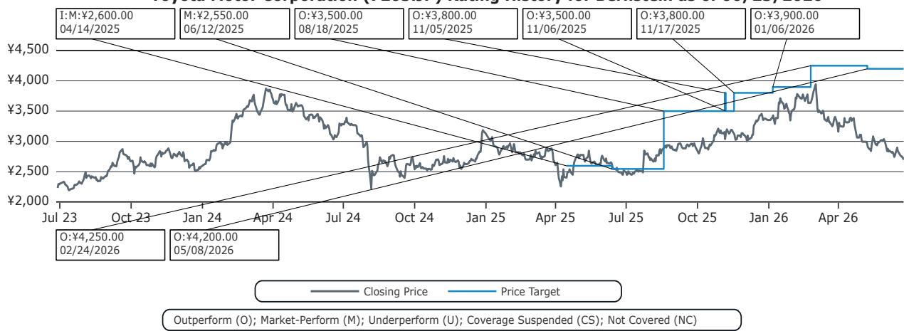
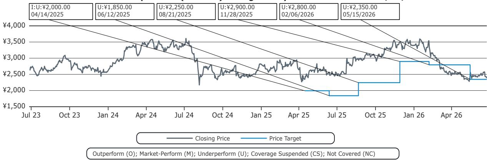
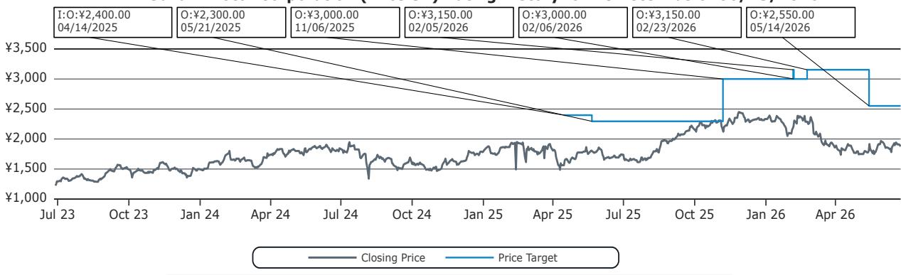

# K-Shaped Polarization Is Reshaping Japan's Auto Market, and Most Automakers Are Not Prepared for What Comes Next

Japan's auto market is no longer a single, unified demand curve. It has split into two distinct trajectories: one for households that can afford to spend more on vehicles, and another for those being priced out of ownership entirely. Between 2015 and 2025, monthly new car purchase spending among lower-income households declined by as much as 22 percent, while spending among the highest-income households rose by 32 percent. This is not a temporary cyclical shift. It is a structural realignment of demand that will determine which automakers thrive and which fall into irrelevance over the next decade.

The aggregate numbers have masked this divergence. Overall monthly new car spending per household in Japan rose only 2 percent over the same period, from JPY 10.3 thousand to JPY 10.5 thousand. That flat line has led many observers to conclude that the Japanese market is simply stagnant. But the averages are misleading. Beneath the surface, a K-shaped pattern has emerged: the top end is booming, the bottom end is shrinking, and the middle is being hollowed out. The share of vehicles priced between JPY 1-2 million, once the largest volume segment, collapsed from 46 percent in 2017 to just 19 percent in 2025. Meanwhile, the share of vehicles priced above JPY 5 million more than doubled, and the share below JPY 1 million rose sixfold.

This is not merely a matter of changing consumer preferences. It is a direct consequence of declining real purchasing power among a large portion of Japanese households. Real monthly disposable income has fallen 5 percent from its 2020 peak, and the burden of car ownership has become significantly heavier for lower-income households. In 2025, 44 percent of lower-income households described car ownership costs as a financial burden, compared with 29 percent among higher-income households. The car ownership rate gap between the lowest and highest income brackets widened from 27 percentage points in 2019 to 30 percentage points in 2025.

The strategic question for automakers is no longer about how to capture market share in a stable market. It is about how to position for a market that is structurally bifurcating. The evidence suggests that automakers with exposure to both the low-end and high-end segments are better positioned to maintain profitability. Toyota and Suzuki, which together command the highest combined share of vehicles priced below JPY 2 million and above JPY 5 million, also report the highest domestic operating margins. In contrast, automakers concentrated in the shrinking mid-market are seeing margins erode or turn negative.

This report from a global investment bank examines the data behind this K-shaped polarization, traces the affordability pressures driving it, and identifies which automakers are best and worst positioned. But it also raises questions that the data alone cannot fully answer: How far will this polarization go? Can mid-market automakers pivot fast enough? And what does the rise of shared mobility mean for the traditional ownership model?

---

## The K-Shaped Pattern Is Not Just About Spending—It Is About Who Stops Owning Cars Altogether

The most striking evidence of polarization comes not from spending data but from ownership and intention surveys. Between 2019 and 2025, overall car ownership in Japan declined from 80 percent to 72 percent. But the decline was not uniform. Among households earning below JPY 2.2 million, ownership fell from 61 percent to 54 percent, a drop of 7 percentage points. Among households earning above JPY 7.8 million, ownership fell only 5 percentage points, from 88 percent to 83 percent. The gap widened steadily each year.

This divergence is not just about who can afford a new car. It is about who can afford to keep a car at all. The survey data on car ownership discontinuation intention is revealing. Among all households, 9 percent indicated they were considering giving up car ownership. But among households earning below JPY 2.2 million, that figure jumped to 19 percent. Among those earning JPY 2.2-3.6 million, it was 15 percent. In contrast, among households earning above JPY 7.8 million, the discontinuation rate was below the average.

The implication is stark: for a growing segment of the population, car ownership is becoming economically irrational. This is not a temporary response to inflation. It reflects a structural shift in household budgets, where the rising costs of vehicle purchase, fuel, insurance, maintenance, and parking are competing with other essential expenses. The survey also shows that lower-income non-owners have weaker intentions to purchase a car in the future, even when asked to assume no financial constraints. The desire to own a car is itself becoming polarized by income.

So what does this mean for automakers? It means that the traditional strategy of targeting the mass mid-market with broadly appealing vehicles is losing its foundation. The middle is not just shrinking in relative terms; it is being pulled apart by forces that will not reverse easily. Automakers that continue to design, price, and market vehicles for a hypothetical average consumer are increasingly serving a demographic that no longer exists in sufficient numbers.

---

## Affordability Pressure Is Not a Cyclical Blip—It Is a Structural Deterioration of Household Balance Sheets

The root cause of this polarization is not a sudden change in consumer taste. It is a prolonged erosion of real purchasing power that has been building for years. Japan's real GDP growth has been in the 0-1 percent range for most of the past decade. Real wages have been declining since 2021. And while nominal disposable income rose 24 percent from 2016 to 2025, inflation has more than offset those gains. Real monthly disposable income peaked in 2020 at JPY 499 thousand and fell to JPY 476 thousand by 2025.

This decline matters because car ownership is one of the most income-sensitive household expenditures. Unlike discretionary spending on entertainment or dining, car ownership involves fixed costs that are difficult to adjust downward. Once a household commits to owning a vehicle, the costs of insurance, registration, maintenance, and depreciation are largely unavoidable. When real incomes fall, households cannot easily reduce these costs. They can only delay replacement, switch to cheaper vehicles, or exit ownership entirely.

The data confirms this behavior. Among lower-income households, car replacement intention is significantly below average. Only 20 percent of households earning below JPY 2.2 million and 22 percent of those earning JPY 2.2-3.6 million intend to replace their current vehicle, compared with 34 percent among higher-income households. Meanwhile, the share of vehicles priced below JPY 1 million has risen from 1 percent to 6 percent, suggesting that some households are trading down to cheaper cars, including used vehicles, to remain in the market.

The critical insight for investors is that this affordability pressure is unlikely to ease. Japan's demographic trends, labor market structure, and fiscal constraints all point to continued pressure on household incomes. Even if inflation moderates, the cumulative loss of real purchasing power over the past five years will take years to recover. Automakers that assume a return to normal demand patterns are likely to be disappointed.

---

## Automakers with Dual Exposure to the Low-End and High-End Segments Are Best Positioned for Profitability

The most actionable finding from this report is the correlation between segment exposure and profitability. In 2025, the combined domestic sales mix of the lowest-priced segment (below JPY 2 million) and the highest-priced segment (above JPY 5 million) was 74 percent for Suzuki and 43 percent for Toyota. Honda stood at 38 percent, Mazda at 37 percent, Nissan at 29 percent, and Subaru at just 10 percent. The correlation with domestic operating margins is striking: Toyota reported 11 percent margins, Suzuki 9 percent, while Nissan reported 0 percent, Mazda negative 5 percent, Subaru negative 11 percent, and Honda negative 14 percent.

This is not a coincidence. In a K-shaped market, the middle is where margins are squeezed most severely. Mid-priced vehicles face pressure from both directions: lower-income consumers trade down to cheaper options, while higher-income consumers trade up to premium models. Automakers stuck in the middle must compete on price without the volume to offset lower margins, or invest in features to justify higher prices without the brand strength to command a premium.

Suzuki's position is particularly instructive. The company has long been associated with kei cars and compact vehicles, which dominate the low end. But it has also successfully expanded into higher-priced models in recent years. This dual exposure allows Suzuki to capture demand from both sides of the K. Toyota benefits from a similar dynamic, with its extensive lineup spanning from the Yaris to the Lexus brand. Both companies also benefit from strong hybrid technology, which commands a price premium while offering fuel savings that appeal to cost-conscious buyers.

For automakers concentrated in the mid-market, the path forward is unclear. Attempting to move upmarket requires significant investment in brand, technology, and distribution. Attempting to compete on price risks margin compression and brand dilution. The report's data suggests that this dilemma is not theoretical. The automakers with the lowest exposure to both ends of the market are also the ones with the weakest domestic profitability.

---

## The Rise of Shared Mobility Is the Second-Order Effect That Automakers Cannot Ignore

One of the most important implications of K-shaped polarization is the acceleration of shared mobility. As car ownership becomes less affordable for a growing segment of the population, the economic calculus shifts in favor of car sharing and ride sharing. The report notes that Japan's shared mobility market is expanding alongside the polarization trend, though it does not quantify the potential displacement of ownership demand.

This is a critical strategic consideration for automakers. If a significant portion of lower-income households exit ownership entirely, and if younger higher-income households increasingly view car ownership as optional rather than necessary, the total addressable market for vehicle sales could shrink permanently. Automakers would then need to generate revenue not just from manufacturing and selling vehicles, but from recurring services across the vehicle lifecycle.

The report raises the possibility that automakers may need to focus more on downstream service capabilities, including fleet management, maintenance, and mobility platforms. But it does not answer the question of whether traditional automakers are structurally equipped to capture these revenue streams. The skills required to build a profitable shared mobility business are different from those required to design and manufacture vehicles. Automakers that attempt to pivot into mobility services without a clear strategy risk investing in businesses that generate low returns.

The open question is whether shared mobility will complement or cannibalize new car sales. In a K-shaped market, the answer may depend on the income segment. For lower-income households, shared mobility could serve as a substitute for ownership, reducing new car demand. For higher-income households, it could serve as a supplement, allowing households to own fewer cars while using shared services for specific trips. The net effect on total vehicle demand is uncertain, but the direction is clear: the traditional model of one household, one or two cars is losing relevance.

---

## What the Report Does Not Fully Answer: How Quickly Can Automakers Reshape Their Product Portfolios?

The report provides a clear diagnosis of the problem and identifies which automakers are currently well positioned. But it leaves several important strategic questions unanswered, and these are the questions that investors should be asking.

First, how quickly can automakers adjust their product portfolios to reflect the K-shaped demand structure? Toyota and Suzuki have built their current positions over decades. For an automaker like Nissan or Honda, which have significant exposure to the mid-market, shifting the product mix toward both low-end and high-end segments would require years of product development, platform investment, and brand repositioning. The report does not assess the feasibility or timeline of such a transition.

Second, can automakers maintain profitability in the low-end segment without sacrificing brand equity? Suzuki has demonstrated that it is possible, but its brand has always been associated with affordable vehicles. For Toyota, the low end is supported by its scale and hybrid technology. For other automakers, entering the low end may mean competing on price with thinner margins and limited differentiation.

Third, what is the role of used cars in this dynamic? The report notes that the share of vehicles priced below JPY 1 million has risen, but it does not distinguish between new and used vehicles in all of its analysis. If lower-income households are increasingly turning to the used car market, that has different implications for automakers than if they are buying new entry-level vehicles. Used car sales generate lower margins for automakers and do not support the same level of dealer network profitability.

These are not gaps in the report's analysis. They are natural extensions of the logic that the report establishes. Any investor using this framework should consider these questions as part of their own due diligence.

---

## A Decision Framework for Investors: How to Evaluate Automakers in a K-Shaped Market

For investors trying to apply this analysis, a structured framework is more useful than a list of ratings. Based on the report's logic, here is a three-step approach to evaluating any Japanese automaker.

First, assess the current product mix exposure. Calculate the combined share of vehicles priced below JPY 2 million and above JPY 5 million in the automaker's domestic sales. The higher this share, the better positioned the automaker is to capture demand from both ends of the K. Automakers with more than 40 percent combined exposure are likely to be more resilient. Those with less than 30 percent face structural headwinds.

Second, evaluate the ability to shift the product mix. This requires assessing the automaker's platform strategy, R&D pipeline, and brand perception. Can the automaker credibly introduce new low-end models without damaging its brand? Can it move upmarket without alienating its core customer base? Automakers with flexible platforms and strong brand equity in multiple segments have more options.

Third, consider the exposure to shared mobility and recurring revenue. Automakers that are investing in mobility platforms, fleet services, and connected vehicle technologies may be better positioned to capture value even if ownership rates decline. However, these investments should be evaluated on their own merit, not as a hedge against weak product positioning.

The report's ratings reflect this framework. Toyota and Suzuki receive outperform ratings, consistent with their product mix and profitability. Honda, Nissan, Mazda, and Subaru receive market-perform or underperform ratings, consistent with their mid-market concentration and weaker margins. Investors should use this framework to monitor changes in product mix and profitability over time, rather than treating the ratings as static.

---

## Join the Community to Read the Full Report and Review the Original Charts

The analysis summarized here draws on a detailed research report that includes 11 exhibits, survey data from JAMA, and proprietary calculations of segment exposure and profitability. The full report provides deeper breakdowns by income bracket, historical trend data, and a ticker table with price targets and valuation multiples. For investors who want to understand the nuances of this K-shaped polarization and track how it evolves, the original report is essential reading.

Join the community to read the full report and review the original charts.

*This article is for learning and discussion only and does not constitute investment advice.*

Personal reading notes and learning share only. Not investment advice.

