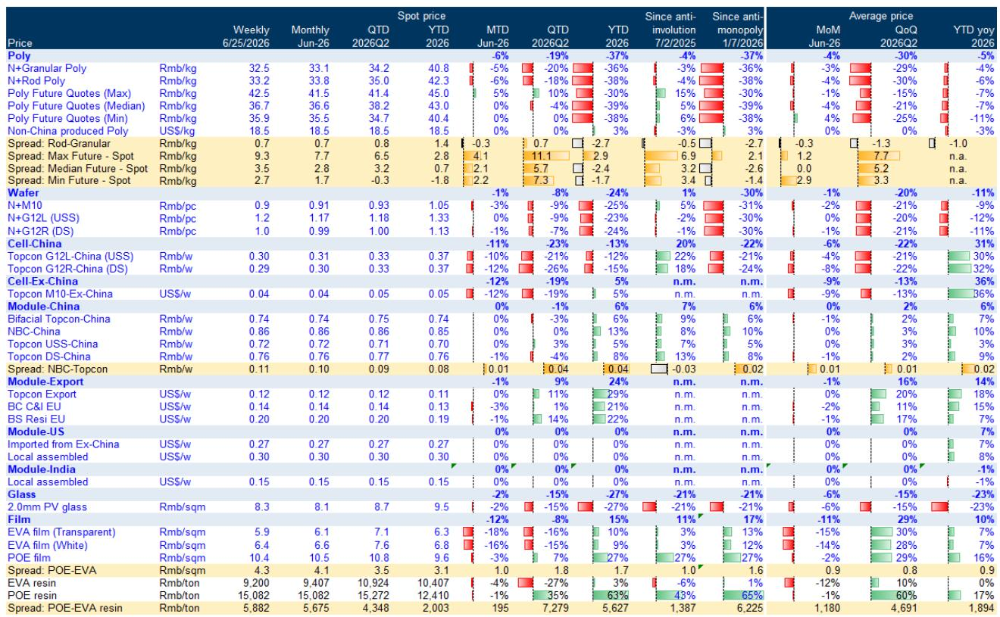
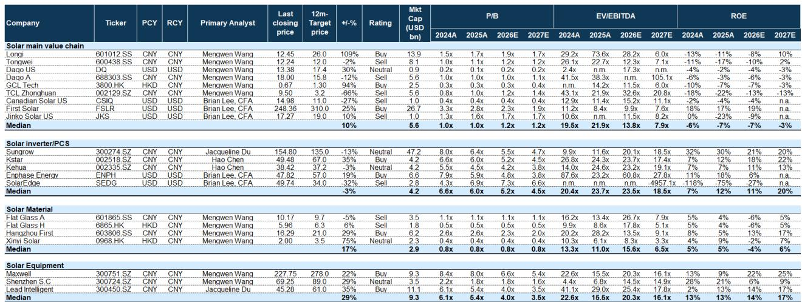
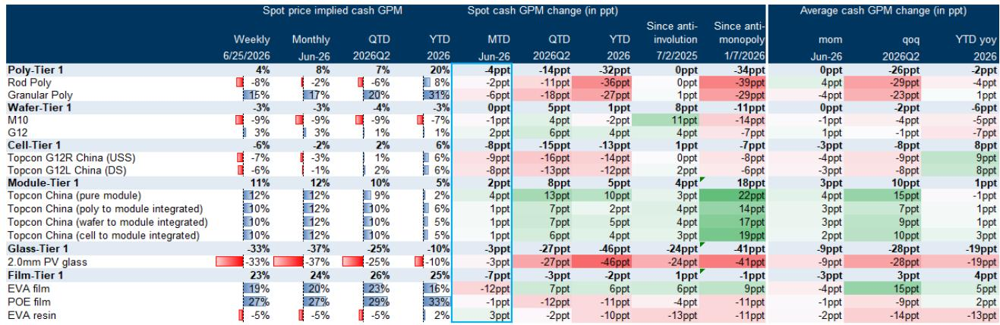

# GS：光伏盈利拐点只出现在组件，上游还在失血

这份GS6月底发布的《中国光伏：追踪盈利拐点》报告，在行业普遍关注“反内卷”政策效果和需求触底的背景下，给出了一个并不对称的判断：产业链的盈利修复远未到来，而且分化正在加剧。组件环节的毛利改善，恰恰是以上游更深的亏损为代价的。这不是一个行业整体回暖的信号，而是一个利润重新分配的起点。

报告的核心数据指向一个反直觉的结论：当市场还在争论光伏产能出清何时结束时，GS已经用6月的价格和库存数据表明，上游环节的定价权正在以加速度流失，而组件环节的“韧性”更多来自成本端的被动让利，而非需求端的主动拉动。

这份报告的价值不在于它预测了某个价格拐点，而在于它拆解了产业链内部利润再分配的路径，并指出了哪些公司可能在这一轮洗牌中穿越周期。

## 1. 6月全产业链价格继续下探，但组件是唯一毛利率改善的环节

6月光伏产业链价格延续了5月以来的疲软态势。根据GS的追踪数据，6月全价值链平均价格环比下跌约5%。其中，胶膜（-12% MTD）和电池片（-11% MTD）跌幅居前，分别受到原油价格下跌（-8% MoM）和银价回落（-13% MoM）的成本端拖累，但更关键的是，这两个环节的产成品库存分别环比激增了21%。

从盈利角度看，这种价格下跌直接反映为现金毛利率的恶化：电池片、胶膜、多晶硅、玻璃的现金毛利率分别环比下降了8、7、4、3个百分点。而组件环节却逆势改善了2个百分点。

> **KC评论：** 组件毛利率的改善，并不是因为组件价格涨了——事实上6月组件价格环比持平。改善的唯一来源是上游原材料成本下降。这本质上是一种“剪刀差”效应：上游的亏损通过价格传导，变成了下游的利润。对于组件企业来说，这是一个“被动受益”的阶段，而不是主动议价能力提升的信号。完整报告中GS对组件利润改善的可持续性有更细致的拆解，包括不同一体化模式下的利润分配差异，值得细读。

## 2. 库存激增叠加7-8月需求淡季，上游定价软化的逻辑还远未结束

GS在报告中明确指出，6月上游价格疲软的核心驱动因素正在强化。一方面，生产端库存环比增长21%，而另一方面，全球组件需求在5月环比下降了22%，同比下降了79%至29GW。5月累计需求同比下降46%，远低于GS全年-12%的预测。

更值得警惕的是，7-8月是传统需求淡季。GS认为，考虑到以下两个因素，上游价格软化的趋势将持续：第一，库存预期正在恶化，淡季需求无法消化当前积累的库存；第二，组件端由于上游价格下跌和Tier 1企业从三季度开始采用廉价金属技术，生产成本将进一步下降。这意味着组件端还会继续向下游传导价格压力，反过来压制上游的议价空间。

> **KC评论：** 这里有一个关键的时间窗口：7-8月的淡季叠加高库存，有可能成为上游企业现金流压力测试的“压力时刻”。报告中没有展开的是，如果上游企业为了回笼资金而进一步降价，可能会引发新一轮的价格螺旋。完整报告中对不同子行业的库存周转天数有细分数据，可以帮助判断哪个环节的“失血”最接近极限。

## 3. 需求端中国市场的失速是最大变量，5月同比下滑91%

GS的数据显示，5月中国组件需求同比下滑91%，1-5月累计同比下滑70%。这个数字远超市场此前的预期。报告将全球需求低于预期的原因直接指向了中国市场的疲软。

中国市场占全球光伏需求的比重在过去几年持续上升，2025年一度接近50%。当这个最大的需求引擎突然减速，整个产业链的供需平衡表都需要重新校准。GS全年对中国市场的需求预测隐含了下半年需要出现大幅环比增长才能达标的假设，但从5月的数据来看，这个假设面临挑战。

对于投资者而言，这意味着：第一，不要用2025年的需求增长线性外推2026年；第二，中国市场的政策刺激效果可能需要更长时间才能传导到实际装机；第三，出口市场虽然价格相对坚挺，但体量无法完全弥补中国市场的缺口。

## 4. GS的选择性偏好：聚焦新应用场景、涨价弹性与储能协同

在行业普遍承压的背景下，GS给出了明确的选股偏好。报告推荐的标的集中在三个方向：新应用场景（Maxwell）、涨价弹性（杭州福斯特，即胶膜环节）以及储能协同（隆基）。

Maxwell的逻辑在于，当传统光伏市场饱和时，谁能找到新的应用场景，谁就能获得估值溢价。杭州福斯特的逻辑则依赖于胶膜环节的定价权：如果上游树脂价格企稳或胶膜企业能够成功提价，其单位盈利弹性最大。隆基则受益于上游价格下跌带来的成本改善，以及储能业务的协同效应。

GS对多晶硅和玻璃环节则明确表达了谨慎态度，对大全新能源ADR/A股和通威给出中性/卖出评级，对玻璃给出卖出评级。

> **KC评论：** GS这份报告的选股逻辑实际上是在交易“利润再分配”而非“行业反转”。它押注的是：在总量不增长或微增长的环境下，利润会从上游向中下游、从同质化产品向差异化产品、从单一组件向“组件+储能”复合业务转移。完整报告中对每个推荐标的的目标价和风险因素有详细拆解，特别是对杭州福斯特的“提价弹性”假设在不同树脂价格情景下的敏感性分析，是理解这个推荐逻辑的关键。

## 5. 报告尚未完全回答的关键问题：廉价金属技术的影响有多大？

GS在报告中提到了一个值得关注的技术变量：Tier 1组件企业从三季度开始采用廉价金属技术。这可能是未来几个月影响产业链利润分配最重要的变量之一。

如果廉价金属技术能够在不显著降低组件效率的前提下大幅降低成本，那么组件端的利润改善可能会持续，甚至加速。但这也意味着，上游（特别是银浆、焊带等辅材）的需求结构将发生变化，部分材料可能面临被替代的风险。

报告对此着墨不多，但这恰恰是需要投资者深入研究的领域。廉价金属技术对哪些材料供应商构成利空？对哪些设备商构成利好？技术扩散的速度和范围如何？这些问题将直接影响产业链下一阶段的投资逻辑。

## 6. 投资者的观察框架：从“行业是否见底”转向“利润在哪一段停留”

基于GS报告的框架，投资者应该调整自己的分析重心。传统的“产能出清-价格见底-行业反转”框架在当前环境下可能过于简单。更有效的框架是回答三个问题：

第一，哪个环节的产能出清最接近完成？GS的数据显示，玻璃和多晶硅的现金毛利率已经深度为负，但产能退出速度仍然缓慢。需要跟踪的是，当现金亏损持续超过两个季度后，企业是否会加速关停产能。

第二，哪个环节的库存周期最有利于价格反弹？胶膜和电池片的库存激增是6月价格下跌的直接原因，但这也意味着，一旦需求恢复，这些环节的价格弹性可能最大。

第三，技术迭代是否在改变利润分配的基础？廉价金属技术、BC电池技术、颗粒硅对棒状硅的替代，这些结构性变化正在重新定义每个环节的“护城河”。

---

GS这份报告最值得反复咀嚼的地方，不是它的结论，而是它揭示了一个正在发生的结构性变化：光伏产业链的利润分配逻辑正在从“总量增长驱动”转向“成本结构和技术迭代驱动”。那些能够在上游价格下跌中保持议价权、在技术迭代中保持领先、在需求波动中保持现金流的企业，才是这一轮洗牌后的赢家。

但这份报告也留下了几个未解的问题：廉价金属技术对银浆、焊料等辅材的冲击具体有多大？中国市场的需求何时才能触底反弹？颗粒硅对棒状硅的成本优势是否可持续？这些问题需要更细颗粒度的数据和更深度的产业链调研才能回答。

在我们的知识星球上，每天由AI agent和人工review生成国际投行中文摘要与KC评论，daily更新约10-40页，并整理当天最新数据图表合集。这些内容既方便喂给AI，也方便人工快速把握market dynamics。如果你对GS这份报告中的库存周期数据、各环节现金成本曲线、或者廉价金属技术的详细影响感兴趣，欢迎来星球微信群里继续讨论。

Personal reading notes and learning share only. Not investment advice.

