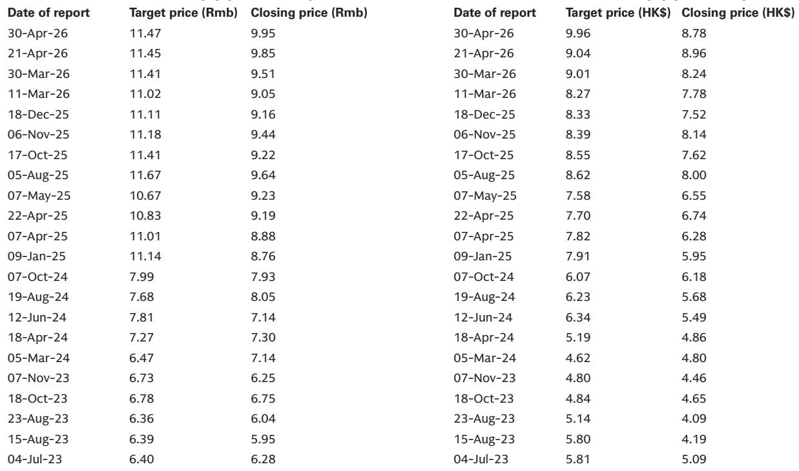
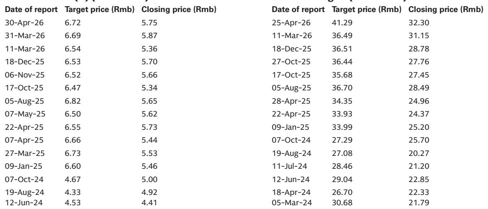
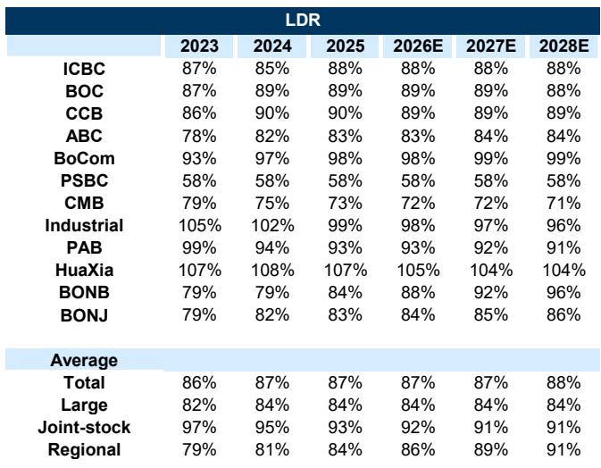

# A Tax Audit on One Chinese Bank Does Not Signal a Systemic Shift in Effective Tax Rates or Liquidity

The market's reaction to the National Audit Office's report that Bank of China evaded RMB 2.367 billion in taxes was swift and severe. BOC's H-share price dropped more than 5%, dragging the broader Chinese banking H-share index down by 3%. For investors, this incident raises two immediate and critical questions: Will the effective tax rates for Chinese banks rise materially, compressing net profits? And could tighter tax supervision on mutual fund holdings trigger a liquidity crunch in the interbank market? The answer to both questions is likely no, but understanding why requires a deeper look at the structural drivers of bank profitability and liquidity management in China today.

The market's fear is understandable. A single high-profile enforcement action can create a perception of regulatory regime change. Yet, the fundamental drivers of Chinese banks' low effective tax rates and their liquidity positions are far more resilient than a single audit finding suggests. The decline in effective tax rates over recent years has been overwhelmingly driven by the massive accumulation of government bonds, which carry tax-exempt status. Meanwhile, the role of mutual funds in bank balance sheets is primarily about liquidity provision, not tax arbitrage. The core thesis here is that the BOC incident is an isolated compliance matter, not the leading edge of a broader policy shift that would materially alter the earnings trajectory or liquidity conditions for the sector.

This analysis draws on a detailed research report from a global investment bank to dissect the incident, examine the structural factors that mitigate its impact, and outline a decision framework for investors navigating the uncertainty. The argument is not that risks are absent, but that the market may be overestimating the probability and magnitude of the adverse scenario.

## The Decline in Effective Tax Rates Is Driven by Government Bond Holdings, Not Mutual Fund Tax Arbitrage

The immediate concern following the BOC news is that tighter scrutiny of tax exemptions on mutual fund income will push effective tax rates higher across the banking sector. This logic, while intuitive, misidentifies the primary driver of the tax rate decline. The data on the four largest Chinese banks—ICBC, CCB, ABC, and BOC—is instructive. Over the past three years, the aggregate increase in their government bond holdings reached approximately RMB 16 trillion. In contrast, the total increase in their fund investments was only about RMB 0.3 trillion.

The scale difference is decisive. Government bonds are the dominant contributor to the growth of low-tax assets. The income generated from holding these bonds is tax-exempt, and this effect has been the single most important factor pulling down the effective tax rate from the statutory level. Mutual fund holdings, while also potentially tax-advantaged, are a rounding error in comparison. Even if regulatory oversight were to tighten and remove the tax incentives for mutual funds entirely, the impact on the aggregate effective tax rate would be marginal because the exposure is so small relative to the government bond portfolio.

Furthermore, the trajectory for government bond holdings is not static. Large banks have strong structural incentives to continue increasing their allocations. These incentives include the need to meet credit deployment targets and the desire to enhance comprehensive returns through the combination of tax exemptions and capital relief that government bonds provide. The capital relief is particularly important in an environment where regulatory capital requirements remain a binding constraint for many institutions. Therefore, the downward pressure on effective tax rates from the government bond channel is expected to persist and even strengthen, regardless of any changes to the tax treatment of mutual funds.

The model projections from the research report confirm this view. The average effective tax rate for the four large banks was 13% over the past three years. The projected average for the next three years is 12%, a further decline that is explicitly attributed to the continued expansion of government bond holdings. The BOC incident does not change this structural equation. It is a compliance story about a specific product structuring practice, not a fundamental challenge to the tax-advantaged status of sovereign debt.

## Mutual Fund Holdings Are a Liquidity Management Tool, and the Interbank Market Has Deeper Support

The second major fear is that stricter taxation on banks' mutual fund holdings will force banks to reduce these positions, thereby draining liquidity from the interbank market. This argument misunderstands the dual function that mutual funds, particularly money market funds, serve on bank balance sheets. Banks use these funds not only for their tax-exempt income but also as a mechanism to support their interbank deposit base. By investing in money market funds, banks effectively provide liquidity to the interbank liabilities market, creating a symbiotic relationship.

The key question is whether the tax exemption rules for these specific funds are likely to change. The research report argues that such a change is unlikely in the short term, because the tax exemption is an important policy tool to support the development of the mutual fund industry. The Chinese financial system has a strategic goal of expanding the role of capital markets and institutional investors. Removing a key tax incentive for money market funds would be counterproductive to that goal. It would be a blunt instrument that would disrupt a major funding channel for non-bank financial institutions.

More importantly, the broader liquidity environment is being shaped by forces far more powerful than the tax treatment of a single asset class. The recent Lujiazui Forum signaled a clear policy direction: a downward shift in the center of the interest rate corridor and the introduction of new liquidity support facilities for non-bank financial institutions. These measures are designed to ensure ample interbank liquidity. The central bank has demonstrated a consistent commitment to maintaining stable funding conditions, especially for non-bank institutions that are more vulnerable to liquidity shocks. A tightening of tax rules on mutual funds would be working directly against this stated policy objective.

Therefore, the scenario where a tax audit on one bank triggers a systemic liquidity crunch is low probability. The structural liquidity support from the central bank and the strategic importance of the mutual fund industry create a strong buffer. The interbank market is not going to seize up because of a compliance issue at BOC. The real liquidity risk for banks lies elsewhere, primarily in the ongoing compression of net interest margins.

## The Report's Unanswered Question: How Will the Net Interest Margin Compression Interact with the Tax Rate Story?

The research report provides a robust framework for understanding why effective tax rates and interbank liquidity are unlikely to be materially affected by the BOC incident. However, it leaves a critical question unanswered: how will the ongoing compression of net interest margins interact with the tax rate dynamics to determine overall profitability? The report acknowledges that recent discussions with banks indicate a less optimistic outlook on net interest margin guidance. The pace of deposit cost reduction is expected to narrow, progressively weakening support for NIM.

This is where the analysis becomes more complex. If NIM is under sustained pressure, the tax rate becomes a more important variable for earnings, even if the absolute change is small. A bank with a 12% effective tax rate is in a very different earnings position than one with a 15% rate, especially when NIM is declining by several basis points each year. The report's model projects a further decline in the effective tax rate for large banks, which would provide a partial offset to NIM compression. But what if the model is wrong? What if the regulatory response to the BOC incident is more aggressive than anticipated, leading to a modest but real increase in the tax burden for all banks?

The report does not adequately stress-test this scenario. It correctly identifies the structural dominance of government bonds, but it does not fully explore the second-order effects of a regulatory environment that is clearly becoming more vigilant. The National Audit Office's action is a signal. Even if the direct financial impact is small, it could lead to a change in bank behavior. Banks might become more conservative in their tax planning, potentially reducing their holdings of certain types of structured products or mutual funds that carry higher tax risk. This behavioral shift, even if small, could have a marginal impact on effective tax rates that is not captured in the current projections.

The unanswered question for investors is this: what is the probability distribution around the 12% effective tax rate forecast? The base case is that it holds. But the tail risk of a higher rate, driven by a broader regulatory crackdown, is not zero. Understanding the magnitude of that tail risk is essential for making informed investment decisions, especially for banks that are more reliant on tax-advantaged income sources.

## A Decision Framework for Investors: Distinguishing Signal from Noise in the BOC Case

For investors trying to make sense of this event, a structured decision framework is more useful than a simple narrative. The BOC incident should be treated as a data point, not a trend. The framework below is designed to help investors distinguish between the signal and the noise.

First, assess the magnitude of the direct impact. The RMB 2.367 billion tax evasion represents about 1% of BOC's net profit. For BOC itself, this is a manageable hit, though it is not trivial. For the sector, the direct exposure is even smaller. The market's 3% decline in the H-share index implies a far greater earnings impact than the actual numbers justify. This suggests that the market is pricing in a scenario of systemic change. The investor's first task is to ask whether that scenario is probable.

Second, evaluate the probability of regulatory contagion. The key variable here is the nature of the violation. BOC achieved tax reductions by packaging private fund products as public funds. This is a specific product structuring issue, not a widespread practice across the sector. The regulatory response is likely to be targeted: stricter rules on how funds are classified and marketed, rather than a broad-based removal of tax exemptions for all mutual fund holdings. The probability of contagion is low, but not zero. Investors should monitor regulatory announcements for any language that suggests a broader review of tax exemptions for financial institutions.

Third, analyze the structural offset. As argued above, the government bond channel is the dominant driver of effective tax rates. Even if the mutual fund channel is partially closed, the continued expansion of government bond holdings will provide a powerful offset. Investors should focus on the trajectory of government bond holdings for the banks they own. Banks that are aggressively increasing their sovereign debt portfolios are better positioned to absorb any negative tax shock from mutual funds.

Fourth, consider the liquidity backstop. The central bank's commitment to ample interbank liquidity is a strong policy anchor. Investors should not confuse a tax compliance issue with a liquidity event. The two are distinct. The interbank market is supported by the interest rate corridor and new lending facilities for non-bank institutions. These tools are far more powerful than any tax rule change. Unless the central bank signals a shift in its liquidity stance, the interbank market should remain stable.

Finally, focus on the real earnings driver: net interest margin. The tax rate is a secondary consideration. The primary challenge for Chinese banks in the coming years is the continued compression of NIM. The research report's stock selection framework is correct: in a slowing loan growth environment, investors should prefer banks that can maintain their NIM and asset quality, strengthen their balance sheets, and stabilize their ROE. The tax rate story is a distraction from this core earnings dynamic.

## The Unresolved Analytical Tension: When Policy Goals Conflict

The most intellectually honest conclusion from this analysis is that there is an unresolved tension between two important policy goals. On one hand, the Chinese government wants to develop its mutual fund industry and support capital market deepening. This argues for maintaining tax exemptions on mutual fund income. On the other hand, the government wants to ensure tax compliance and close loopholes that allow large state-owned enterprises to reduce their tax burden. The BOC incident highlights this tension.

The question that the research report raises but does not fully answer is how the regulatory authorities will resolve this tension. Will they take a narrow approach, punishing BOC for its specific violation but leaving the broader tax framework intact? Or will they use this incident as a catalyst for a more comprehensive review of tax exemptions in the financial sector? The answer to this question will determine whether the market's reaction is a buying opportunity or a warning sign.

Investors who want to understand the full complexity of this situation, including the detailed data on government bond holdings, mutual fund investments, and NIM projections for 12 covered banks, should go deeper into the original research. The charts in the full report provide a visual representation of the structural trends that support the base case.

Join the community to read the full report and review the original charts.

*This article is for learning and discussion only and does not constitute investment advice.*

Personal reading notes and learning share only. Not investment advice.

