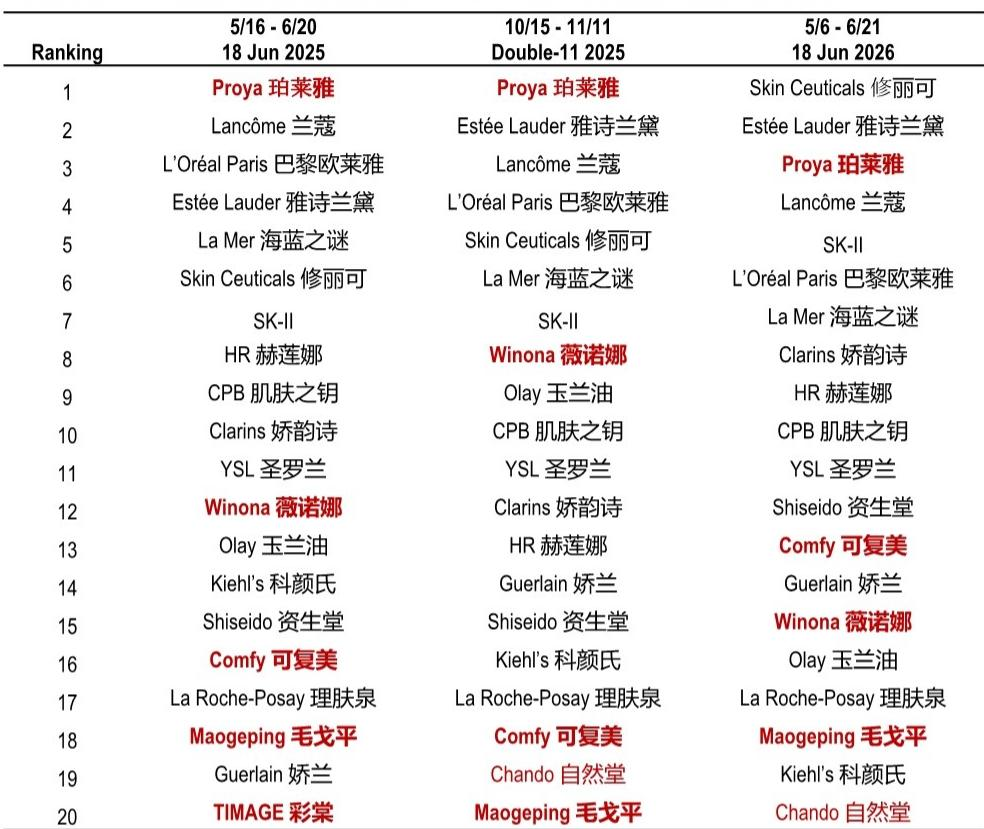
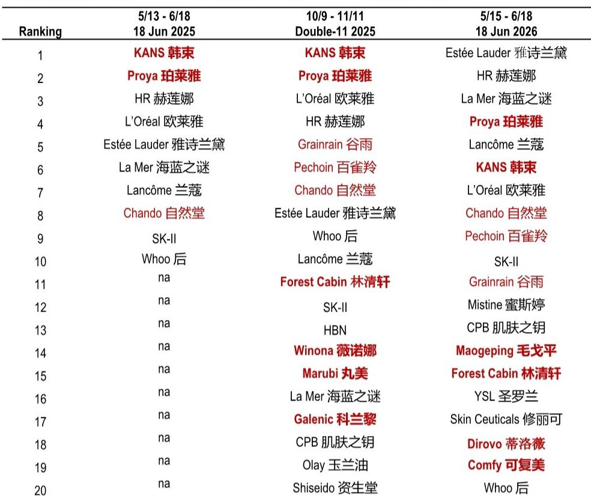
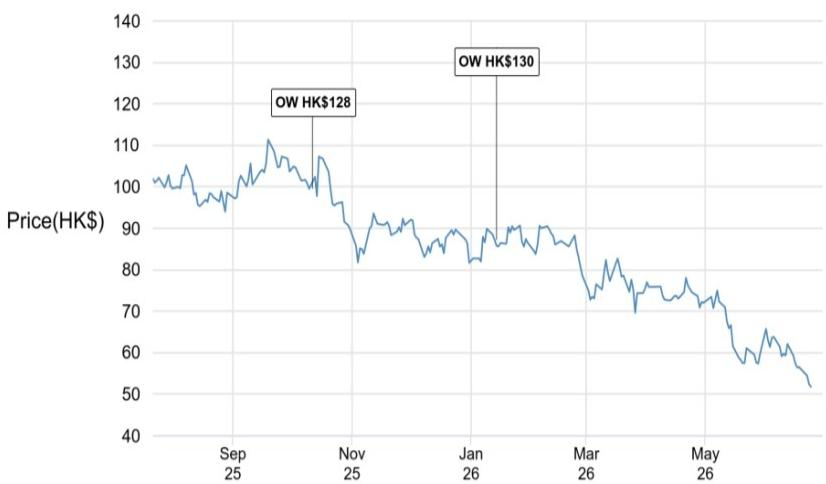

# The 6.18 Results Reveal a Structural Shift: China's Beauty Market Is No Longer a Zero-Sum Game Between Domestic and International Brands

The conventional narrative that frames China's beauty market as a battlefield between domestic champions and global incumbents is increasingly misleading. After the 6.18 shopping festival, the data tells a more nuanced story: the market is expanding, and the winners are those who have successfully segmented themselves by price tier, platform strategy, and brand equity, not by nationality. Beauty sector GMV grew 11% year-on-year during the 6.18 period, outperforming overall e-commerce GMV growth of 6%, according to industry data. This marks the continuation of a recovery trajectory where cosmetics retail sales have outpaced overall retail sales for eleven consecutive months. The headline numbers are encouraging, but the real strategic insight lies beneath them.

What makes this 6.18 different from previous years is the divergence in how growth is being captured. On Tmall, the premium segment above RMB 800 in average selling price grew more than 20%, while on Douyin, the sweet spot was the RMB 300-500 range, which expanded by approximately 25%. These two platforms are not merely different channels; they are becoming different markets with distinct consumer bases, pricing architectures, and competitive dynamics. A brand that succeeds on both must operate with dual strategies, not a single omnichannel approach. The days of a unified national beauty strategy are over.

The most significant finding from the post-6.18 expert call is that international brands have not only recovered but have reclaimed the number-one position on both Tmall and Douyin. This is not a simple rebound. It reflects a structural improvement in how global brands approach the Chinese market, particularly through expanded KOL livestreaming collaborations, more attractive bundled pricing, and gifts with purchase that carry greater emotional value. Meanwhile, leading domestic brands with solid brand equity held their ground. Proya remained in the top four on both platforms. Mao Geping and Winona each delivered GMV growth above 20%. The market is not polarizing; it is stratifying.

For investors and strategists, the critical question is no longer which nationality of brand will win. The question is which brands have built the pricing power, platform-specific capabilities, and product innovation cycles to thrive in a market that is simultaneously trading up and trading down. This report parses the 6.18 data to identify the patterns that will define the next 12 to 24 months of competition in China beauty.

## The Premiumization of Tmall and the Democratization of Douyin Are Creating Two Distinct Competitive Arenas

The divergence in pricing trends between Tmall and Douyin is not a temporary promotional artifact. It is a structural feature of how these platforms serve fundamentally different consumer missions. Tmall, with its heritage in brand flagship stores and authoritative product listings, has become the venue for deliberate, high-consideration purchases. Consumers on Tmall are more likely to be trading up, seeking efficacy, prestige, and the assurance of authenticity. This explains why the above-RMB 800 segment grew more than 20% during 6.18, and why international brands like Skin Ceuticals and Estée Lauder have reclaimed the top spots.

Douyin, by contrast, is a discovery-driven platform where purchase decisions are compressed into seconds of video content. The RMB 300-500 segment's 25% growth reflects a consumer who is willing to spend meaningfully but is driven by impulse, KOL recommendation, and perceived value rather than brand heritage alone. This is the arena where domestic brands like Proya have excelled, but where international brands are now making inroads by adapting their product sets and pricing for the platform's unique dynamics.

The strategic implication is clear: a brand cannot optimize for both platforms using the same playbook. On Tmall, the battle is for brand equity, premium positioning, and repeat purchase from loyal customers. On Douyin, the battle is for attention, virality, and conversion velocity. Companies that attempt to treat Douyin as merely another distribution channel for the same Tmall strategy will underperform. Those that design platform-specific product sets, pricing architectures, and content strategies will capture disproportionate share.

What remains unanswered is whether this bifurcation will deepen or converge over time. If Douyin continues to move upmarket, as its mall feature suggests, the RMB 300-500 segment may gradually shift higher, potentially blurring the lines between the two platforms. But for now, the data argues for dual-platform specialization rather than omnichannel uniformity.

## International Brands Have Not Just Recovered; They Have Recalibrated Their China Strategy Around Emotional Gifting and Mid-Tier KOLs

The most underappreciated development in the 6.18 results is not that international brands regained share, but how they did it. The expert call highlighted three specific tactics: expanded collaborations with mid-tier KOLs rather than only top-tier influencers, successful launches of more sets with attractive prices, and gifts with purchase that carry greater emotional value to capture gifting demand. These are not minor adjustments. They represent a fundamental recalibration of how global beauty companies approach the Chinese consumer.

Historically, international brands in China relied on brand prestige, department store counters, and top-tier celebrity endorsements. The new approach is more granular and more local. By working with mid-tier KOLs, these brands are accessing niche communities that are more trusted by their followers than mass-market influencers. By offering sets rather than single products, they are increasing perceived value while maintaining average selling prices. By emphasizing gifts with purchase that feel emotionally resonant, they are tapping into the gifting economy, which is a massive but often overlooked driver of beauty consumption in China.

The data supports this shift. On Tmall, nine of the top ten spots were held by international brands, compared to eight during Double-11 2025. On Douyin, six of the top ten were international, up from five. The improvement is broad-based, not limited to a single brand or category. Skin Ceuticals, Estée Lauder, La Mer, and SK-II all showed strong performance across platforms.

However, the expert also issued a caution: international brands targeting the mass market, such as L'Oreal and Olay, face intense competition from domestic brands. The lesson is that international recovery is concentrated in the premium and luxury segments, where brand equity remains a formidable moat. In the mass market, domestic brands have the advantages of faster product cycles, lower cost structures, and deeper cultural resonance. The international comeback is real, but it is not universal.

## Leading Domestic Brands Are Proving That Brand Equity, Not Nationality, Determines Resilience

The narrative of domestic brand weakness during 6.18 is misleading. While some domestic brands underperformed, the leaders demonstrated that strong brand equity and product offerings can deliver quality growth even in a competitive environment. Mao Geping led the domestic cohort with overall GMV growth of approximately 35%, driven in part by its new IP crossover collections with Panda Creation, which resonated strongly with consumers. Proya maintained its top-four position on both platforms and even claimed the number-one spot on Tmall during the May 21 to June 21 period, recovering from negative sales growth in 2025.

Winona, owned by Botanee, registered solid growth of more than 20% on both Tmall and Douyin. Even Comfy, owned by Giant Biogene, recovered to positive growth after facing questions about its product formula last year. These are not signs of a domestic sector in retreat. They are signs of a market where brand strength, R&D investment, and consumer trust are the differentiating factors, not origin of ownership.

The contrasting case of Chicmax's KANS brand is instructive. KANS faced pressure during the promotion events, with negative GMV growth on Douyin and a ranking drop from number one in January-March to number six during 6.18. The brand's mass-market positioning and value-for-money pricing strategy made it vulnerable when international brands intensified their promotional activity. Yet the expert remained confident in Chicmax's fundamentals, citing its comprehensive brand portfolio, including the rapidly growing Newpage brand with triple-digit GMV growth, its R&D strength, capable management, and aggressive culture.

This highlights a critical strategic lesson: single-brand domestic companies are more exposed to competitive pressure than multi-brand platforms. Chicmax's ability to offset KANS's weakness with Newpage's strength demonstrates the value of portfolio diversification. Investors should be paying attention not just to individual brand performance but to the breadth and resilience of the underlying corporate structure.

## The Report Raises a Critical Unanswered Question: How Sustainable Is the Current Discount Depth, and What Happens When It Normalizes?

One of the most striking findings from the 6.18 analysis is that the effective discount level deepened further, even though leading brands maintained largely stable nominal discounts. The additional discounting came from platform coupons, livestreaming coupons, and government subsidies. This means that the price consumers actually paid was significantly lower than the listed price, and the gap was funded by a combination of platform investment, KOL economics, and fiscal policy.

This raises a fundamental question that the report does not fully answer: what happens when these subsidies and platform incentives are withdrawn or reduced? If the effective discount depth is being sustained by external funding rather than by brand margin, then the current GMV growth may be partly artificial. Consumers are being trained to expect discounts that brands and platforms may not be able to sustain indefinitely.

The risk is that when subsidies normalize, demand could compress, and brands that have become dependent on deep discounting to drive volume will face a margin squeeze. This is particularly relevant for brands that compete primarily on price rather than on product differentiation or brand experience. The brands that are most vulnerable are those in the mass-market segment where switching costs are low and loyalty is thin.

For investors, the sustainability of discount depth should be a key due diligence question when evaluating beauty companies. Brands that can maintain volume without deep discounting, or that can shift the discount burden to platforms and KOLs rather than absorbing it themselves, are better positioned for the eventual normalization of promotional intensity.

## A Decision Framework for Beauty Investors: Three Filters to Separate Winners from Losers

Based on the patterns revealed by the 6.18 data, investors and strategists should apply a three-filter framework when evaluating beauty companies in China.

First, assess platform-specific capability. Does the brand have a differentiated strategy for Tmall versus Douyin? Brands that succeed on both platforms typically have separate product sets, pricing architectures, and content strategies for each. A single omnichannel approach is increasingly a liability.

Second, evaluate pricing power and discount dependency. Brands that can generate growth without deepening effective discounts are more resilient. The key metric to watch is not just GMV growth but the ratio of effective discount to nominal discount. A widening gap between the two suggests that growth is being subsidized by external factors that may not persist.

Third, examine brand portfolio breadth. Single-brand companies are more exposed to competitive shocks, as the KANS example illustrates. Multi-brand platforms with complementary brand positions, such as Chicmax with KANS and Newpage, offer greater resilience. The ability to shift investment from one brand to another within a portfolio is a structural advantage that single-brand competitors cannot replicate.

This framework is not exhaustive, but it provides a structured way to cut through the noise of promotional rankings and focus on the underlying strategic health of a company. The brands that score well on all three filters are likely to outperform over the next 12 to 24 months, regardless of whether they are domestic or international.

## The Full Report Contains Granular Data and Original Charts That Are Essential for Strategic Decision-Making

The analysis presented here is based on the key findings from the post-6.18 expert call, but the full report contains detailed ranking tables, platform-specific GMV breakdowns, and year-over-year comparisons that are essential for a complete strategic assessment. The original charts show the evolution of brand rankings on Tmall and Douyin across three promotional periods, allowing readers to identify trends that are not visible in summary data alone.

For investors and corporate strategists who need to make capital allocation decisions, brand investment choices, or competitive positioning analyses, the full report provides the granularity required for rigorous analysis. The data on effective discount depth, platform-specific pricing tiers, and the performance of individual brands within multi-brand portfolios is not available in any aggregated public source.

Join the community to read the full report and review the original charts.

*This article is for learning and discussion only and does not constitute investment advice.*

Personal reading notes and learning share only. Not investment advice.

