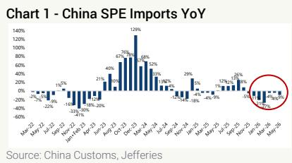
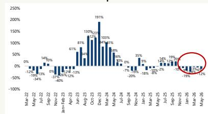
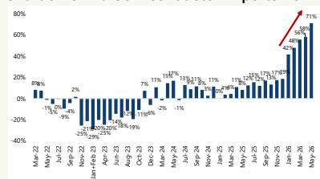
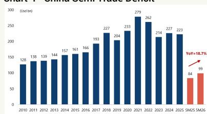
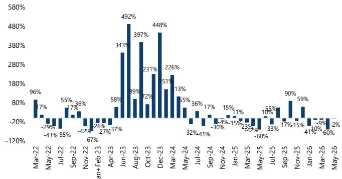
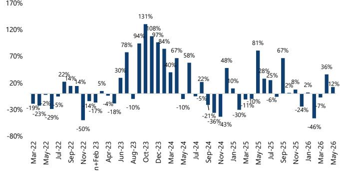
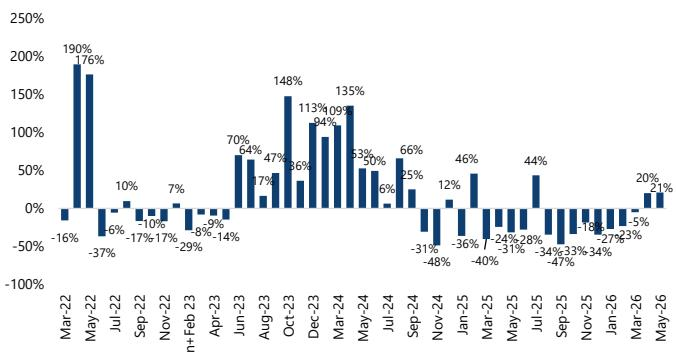
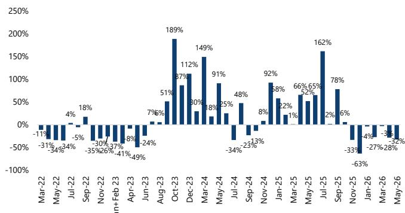

## China WFE: Fast-Growing Semi Deficit to Drive Strong WFE Capex

China's May SPE/WFE imports fell 9%/12%, but testing/packaging grew 25%/19%. Positively, WFE's fall is entirely driven by a 32% decline in etching, as deposition/ion implanting grew 12%/21%. Fall in etching is associated with a 28%/58% fall in WFE imports from Japan/Malaysia. YTD, WFE imports fell 12%, driven by 24%/18% fall in litho/etching, while imports from Japan/Netherlands dropped the most, by 28%/24%. We still expect 2026 WFE capex to fall LSD to MSD.

China's WFE imports fell 12% in May, worse than previous two months, but it is narrow-based. China's May SPE imports fell 9%, driven mainly by 12% decline in WFE. Packaging imports grew 8% YTD, the only category with positive growth. We highlighted before Huawei's "Tau" scaling law is based on advanced packaging, and China does not face any restrictions on packaging tools. Therefore, we expect this to be a strong growth area in the next 12-24 months. For WFE, even though the 12% fall in May is a deterioration from 6%/3% decline in Apr/Mar, we are encouraged that May's fall is narrow-based. It is almost entirely driven by a 24% fall in etching. Deposition and ion implanting grew 12% and 21%, respectively, while litho imports were flattish. YTD, WFE imports fell 12%, driven mainly by 24%/18% decline in litho/etching. Deposition and thermal YTD both grew 3%. We believe the YTD weakness is due to 1) CXMT slowing after big pull-in last year and likely waiting for any sign of relaxation of US restrictions and 2) decline in advanced logic due to pull in last year and very long delivery lead time of critical tools in the grey market. We remain confident of some demand recovery in 2H26, leading to low-single-digit (LSD) to mid-single digit (MSD) growth in WFE capex for the full year. We believe memory capex will be the key driver in 2H26.

Singapore has become the largest source of WFE imports for China. It is worth noting the 32% decline in May etching imports coincided with a 58%/28% fall, in WFE imports from Malaysia/Japan. We saw the same trend for the Apr data. It suggests etching tools that China buys are mainly coming from these two countries. YTD, imports of Japan and the Netherlands fell the most (24%/28%) while imports from Singapore and Taiwan rose 45% and 22%, respectively. In fact, Singapore and Taiwan are the only countries that show positive growth YTD for WFE imports into China. Singapore has overtaken Japan as the largest source of WFE imports into China (5M26), with a 25% import share. Japan ranked No. 2 with 23% share, while the Netherlands' share has fallen to No. 3 at 18%.

Rapidly rising semi trade deficit will drive strong long-term WFE capex growth. China's semiconductor imports grew 71% in May, a new high. Semiconductor imports have been accelerating sharply for five consecutive months, driven by, in our view, skyrocketing memory prices and rising demand for AI-related chips such as CPU, optics, and high-end capacitors. Note semi imports from Korea rose 154% in May and 103% YTD. In May, Korea for the first time overtook Taiwan as the largest source of China's semi imports, with a 37% import share or \~US\$18bn. Our analysis shows China's 5M26 semi trade deficit grew 19% YoY to US\$99bn vs being flattish in the past three years. We see rapidly widening semi trade deficit as one of the biggest drivers of China's WFE capex growth. Moreover, China needs much more foundry capacity in mature nodes (for SRAM/PMIC/optics/power), advanced nodes (< 14nm, CPU/GPU/ADAS), and memory to support its efforts in AI, robotics, and electrification. Together with its WFE localization efforts due to US restrictions, Chinese WFE players are among our top picks in China tech.

  
Source: China Customs, JEF

Chart 2 - China WFE Imports YoY  
  
Source: China Customs, JEF

Chart 3 - China Semiconductor Imports YoY  
  
Source: China Customs, JEF

Chart 4 - China Semi Trade Deficit  
  
Source: China Customs, JEF

Edison Lee, CFA \* | Equity Analyst
852 3743 8009 | edison.lee@JEF.com

Nick Cheng \* | Equity Analyst
+852 3743 8750 | nick.cheng@JEF.com

Matt Ma \* | Equity Analyst
852 3767 1109 | matt.ma@JEF.com

Annie Ping, CFA, FRM \* | Equity Associate +852 3767 1273 | annie.ping@JEF.com

Chart 5 - China Semiconductor Imports YoY  
  
Source: China Customs, JEF

Chart 6 - China SPE Imports YoY  
  
Source: China Customs, JEF

Chart 7 - China Lithography Equipment Imports YoY  
  
Source: China Customs, JEF

Chart 8 - China Deposition Equipment Imports YoY  
  
Source: China Customs, JEF

Chart 9 - China Ion Implanting Equipment Imports YoY  
  
Source: China Customs, JEF

Chart 10 - China Etching Equipment Imports YoY  
  
Source: China Customs, JEF

Table 1 - Quarterly SPE Imports by Key Countries (US\$m)

<table><tr><td></td><td>1Q20</td><td>2Q20</td><td>3Q20</td><td>4Q20</td><td>1Q21</td><td>2Q21</td><td>3Q21</td><td>4Q21</td><td>1Q22</td><td>2Q22</td><td>3Q22</td><td>4Q22</td><td>1Q23</td><td>2Q23</td><td>3Q23</td><td>4Q23</td><td>1Q24</td><td>2Q24</td><td>3Q24</td><td>4Q24</td><td>1Q25</td><td>2Q25</td><td>3Q25</td><td>4Q25</td><td>1Q26</td><td>5M26</td></tr><tr><td>Germany</td><td>183</td><td>193</td><td>186</td><td>249</td><td>272</td><td>272</td><td>272</td><td>232</td><td>232</td><td>265</td><td>264</td><td>284</td><td>247</td><td>244</td><td>259</td><td>336</td><td>341</td><td>305</td><td>291</td><td>367</td><td>319</td><td>364</td><td>300</td><td>380</td><td>395</td><td>325</td></tr><tr><td>Israel</td><td>93</td><td>117</td><td>120</td><td>120</td><td>202</td><td>104</td><td>179</td><td>215</td><td>187</td><td>188</td><td>205</td><td>275</td><td>238</td><td>236</td><td>318</td><td>237</td><td>310</td><td>181</td><td>154</td><td>290</td><td>268</td><td>241</td><td>233</td><td>427</td><td>158</td><td>318</td></tr><tr><td>Japan</td><td>1,544</td><td>1,788</td><td>1,988</td><td>2,912</td><td>2,292</td><td>3,071</td><td>2,762</td><td>2,923</td><td>2,748</td><td>2,255</td><td>2,673</td><td>2,045</td><td>2,421</td><td>2,343</td><td>3,160</td><td>3,342</td><td>3,066</td><td>6,156</td><td>3,108</td><td>4,242</td><td>2,901</td><td>3,146</td><td>3,737</td><td>3,168</td><td>3,137</td><td>3,970</td></tr><tr><td>Korea</td><td>852</td><td>717</td><td>1,027</td><td>911</td><td>1,089</td><td>1,304</td><td>993</td><td>955</td><td>958</td><td>888</td><td>1,038</td><td>658</td><td>556</td><td>536</td><td>877</td><td>817</td><td>870</td><td>887</td><td>875</td><td>1,150</td><td>922</td><td>1,044</td><td>1,180</td><td>913</td><td>756</td><td>1,370</td></tr><tr><td>Latvia</td><td>124</td><td>186</td><td>146</td><td>156</td><td>210</td><td>233</td><td>458</td><td>458</td><td>377</td><td>353</td><td>305</td><td>324</td><td>246</td><td>218</td><td>337</td><td>955</td><td>907</td><td>407</td><td>388</td><td>268</td><td>783</td><td>981</td><td>1,482</td><td>1,499</td><td>1,518</td><td>1,334</td></tr><tr><td>Netherlands</td><td>445</td><td>919</td><td>903</td><td>531</td><td>928</td><td>875</td><td>539</td><td>1,100</td><td>866</td><td>728</td><td>519</td><td>661</td><td>614</td><td>1,501</td><td>2,733</td><td>2,691</td><td>2,221</td><td>1,879</td><td>3,142</td><td>2,525</td><td>2,094</td><td>1,338</td><td>2,780</td><td>2,899</td><td>1,649</td><td>2,068</td></tr><tr><td>Sweden</td><td>669</td><td>837</td><td>995</td><td>766</td><td>1,107</td><td>1,469</td><td>1,569</td><td>1,579</td><td>1,512</td><td>1,642</td><td>1,371</td><td>951</td><td>1,335</td><td>1,991</td><td>1,041</td><td>2,371</td><td>1,965</td><td>1,886</td><td>2,080</td><td>6,070</td><td>4,771</td><td>2,147</td><td>2,627</td><td>1,919</td><td>1,974</td><td>5,587</td></tr><tr><td>Taiwan</td><td>344</td><td>374</td><td>405</td><td>444</td><td>461</td><td>613</td><td>672</td><td>626</td><td>635</td><td>648</td><td>625</td><td>631</td><td>512</td><td>549</td><td>590</td><td>548</td><td>446</td><td>699</td><td>837</td><td>633</td><td>690</td><td>578</td><td>776</td><td>733</td><td>743</td><td>1,288</td></tr><tr><td>US</td><td>1,344</td><td>1,443</td><td>1,696</td><td>1,330</td><td>1,834</td><td>1,978</td><td>1,902</td><td>1,876</td><td>1,797</td><td>1,879</td><td>1,740</td><td>1,121</td><td>975</td><td>1,197</td><td>1,831</td><td>1,970</td><td>1,436</td><td>1,607</td><td>1,530</td><td>1,657</td><td>3,134</td><td>1,204</td><td>1,376</td><td>709</td><td>682</td><td>1,382</td></tr><tr><td>Others</td><td>208</td><td>287</td><td>317</td><td>340</td><td>346</td><td>422</td><td>417</td><td>407</td><td>403</td><td>403</td><td>403</td><td>434</td><td>338</td><td>338</td><td>338</td><td>623</td><td>623</td><td>653</td><td>653</td><td>653</td><td>582</td><td>582</td><td>616</td><td>616</td><td>616</td><td>824</td></tr><tr><td>Total RMHS</td><td>5,778</td><td>6,784</td><td>7,750</td><td>6,758</td><td>8,736</td><td>10,355</td><td>9,483</td><td>10,453</td><td>9,693</td><td>9,143</td><td>9,300</td><td>7,256</td><td>7,159</td><td>8,788</td><td>13,076</td><td>13,968</td><td>11,558</td><td>11,485</td><td>13,029</td><td>13,938</td><td>11,472</td><td>11,635</td><td>15,296</td><td>13,337</td><td>9,775</td><td>16,454</td></tr></table>

Source: China Customs, JEF

Table 2 - Quarterly SPE Imports YoY by Key Countries

<table><tr><td></td><td>1Q20</td><td>2Q20</td><td>3Q20</td><td>4Q20</td><td>1Q21</td><td>2Q21</td><td>3Q21</td><td>4Q21</td><td>1Q22</td><td>2Q22</td><td>3Q22</td><td>4Q22</td><td>1Q23</td><td>2Q23</td><td>3Q23</td><td>4Q23</td><td>1Q24</td><td>2Q24</td><td>3Q24</td><td>4Q24</td><td>1Q25</td><td>2Q25</td><td>3Q25</td><td>4Q25</td><td>1Q26</td><td>5M26</td></tr><tr><td>Germany</td><td>-21%</td><td>-23%</td><td>-40%</td><td>50%</td><td>67%</td><td>41%</td><td>47%</td><td>25%</td><td>-14%</td><td>-3%</td><td>-3%</td><td>-38%</td><td>6%</td><td>-19%</td><td>36%</td><td>74%</td><td>38%</td><td>43%</td><td>-19%</td><td>5%</td><td>-6%</td><td>19%</td><td>3%</td><td>4%</td><td>-39%</td><td>-42%</td></tr><tr><td>Israel</td><td>166%</td><td>-27%</td><td>35%</td><td>0%</td><td>116%</td><td>-31%</td><td>39%</td><td>110%</td><td>-10%</td><td>-43%</td><td>54%</td><td>10%</td><td>-10%</td><td>-55%</td><td>-14%</td><td>31%</td><td>23%</td><td>-52%</td><td>-23%</td><td>-13%</td><td>33%</td><td>-12%</td><td>47%</td><td>-7%</td><td>-34%</td><td>-19%</td></tr><tr><td>Japan</td><td>30%</td><td>40%</td><td>27%</td><td>11%</td><td>48%</td><td>72%</td><td>39%</td><td>53%</td><td>20%</td><td>-27%</td><td>-3%</td><td>-30%</td><td>-12%</td><td>4%</td><td>18%</td><td>63%</td><td>27%</td><td>35%</td><td>-2%</td><td>25%</td><td>-5%</td><td>0%</td><td>20%</td><td>-25%</td><td>-20%</td><td>-20%</td></tr><tr><td>Korea</td><td>24%</td><td>-6%</td><td>32%</td><td>4%</td><td>28%</td><td>82%</td><td>-3%</td><td>5%</td><td>-14%</td><td>-32%</td><td>5%</td><td>-31%</td><td>-43%</td><td>-33%</td><td>-15%</td><td>24%</td><td>63%</td><td>50%</td><td>0%</td><td>38%</td><td>6%</td><td>-18%</td><td>35%</td><td>-29%</td><td>-18%</td><td>-15%</td></tr><tr><td>Russia</td><td>246%</td><td>-10%</td><td>32%</td><td>52%</td><td>70%</td><td>-15%</td><td>65%</td><td>194%</td><td>-7%</td><td>-86%</td><td>64%</td><td>-29%</td><td>-61%</td><td>-55%</td><td>49%</td><td>190%</td><td>188%</td><td>61%</td><td>-41%</td><td>-11%</td><td>87%</td><td>143%</td><td>274%</td><td>-7%</td><td>27%</td><td>-10%</td></tr><tr><td>Netherlands</td><td>75%</td><td>135%</td><td>167%</td><td>-24%</td><td>108%</td><td>-5%</td><td>-40%</td><td>107%</td><td>-7%</td><td>-17%</td><td>-4%</td><td>-40%</td><td>-29%</td><td>106%</td><td>426%</td><td>307%</td><td>262%</td><td>25%</td><td>-15%</td><td>-6%</td><td>-29%</td><td>-29%</td><td>-124%</td><td>54%</td><td>-21%</td><td>-21%</td></tr><tr><td>Other</td><td>200%</td><td>-20%</td><td>54%</td><td>6%</td><td>65%</td><td>-1%</td><td>48%</td><td>106%</td><td>37%</td><td>-10%</td><td>-7%</td><td>-40%</td><td>-25%</td><td>-5%</td><td>49%</td><td>149%</td><td>91%</td><td>36%</td><td>-25%</td><td>-32%</td><td>-18%</td><td>-14%</td><td>26%</td><td>-15%</td><td>-1%</td><td>20%</td></tr><tr><td>Taiwan</td><td>-40%</td><td>-17%</td><td>7%</td><td>26%</td><td>34%</td><td>64%</td><td>66%</td><td>42%</td><td>38%</td><td>6%</td><td>-7%</td><td>0%</td><td>-19%</td><td>-15%</td><td>-6%</td><td>-13%</td><td>-13%</td><td>27%</td><td>42%</td><td>15%</td><td>55%</td><td>-17%</td><td>-7%</td><td>-10%</td><td>8%</td><td>18%</td></tr><tr><td>US</td><td>90%</td><td>15%</td><td>27%</td><td>7%</td><td>36%</td><td>37%</td><td>12%</td><td>41%</td><td>-2%</td><td>-5%</td><td>-9%</td><td>-40%</td><td>-46%</td><td>-36%</td><td>5%</td><td>76%</td><td>47%</td><td>34%</td><td>-16%</td><td>-18%</td><td>-8%</td><td>-25%</td><td>-10%</td><td>-57%</td><td>-48%</td><td>-33%</td></tr><tr><td>Others</td><td>15%</td><td>15%</td><td>23%</td><td>33%</td><td>73%</td><td>25%</td><td>36%</td><td>13%</td><td>-2%</td><td>-9%</td><td>4%</td><td>7%</td><td>-17%</td><td>-14%</td><td>32%</td><td>44%</td><td>22%</td><td>15%</td><td>-27%</td><td>7%</td><td>-18%</td><td>27%</td><td>-27%</td><td>-17%</td><td>-18%</td><td></td></tr><tr><td>Total</td><td>42%</td><td>23%</td><td>33%</td><td>7%</td><td>51%</td><td>53%</td><td>22%</td><td>55%</td><td>11%</td><td>-32%</td><td>-1%</td><td>-31%</td><td>-26%</td><td>-4%</td><td>39%</td><td>92%</td><td>61%</td><td>31%</td><td>0%</td><td>0%</td><td>-1%</td><td>-1%</td><td>17%</td><td>-4%</td><td>-16%</td><td>-13%</td></tr></table>

Source: China customs, JEF

Table 3 - Quarterly SPE Imports by Key Product Categories (US\$m)

<table><tr><td></td><td>1Q20</td><td>2Q20</td><td>3Q20</td><td>4Q20</td><td>1Q21</td><td>2Q21</td><td>3Q21</td><td>4Q21</td><td>1Q22</td><td>2Q22</td><td>3Q22</td><td>4Q22</td><td>1Q23</td><td>2Q23</td><td>3Q23</td><td>4Q23</td><td>1Q24</td><td>2Q24</td><td>3Q24</td><td>4Q24</td><td>1Q25</td><td>2Q25</td><td>3Q25</td><td>4Q25</td><td>1Q26</td><td>5M26</td></tr><tr><td>Wafer Fabrication</td><td>2,906</td><td>3,488</td><td>3,839</td><td>3,302</td><td>4,928</td><td>6,027</td><td>4,723</td><td>5,458</td><td>5,173</td><td>4,702</td><td>4,876</td><td>3,915</td><td>4,060</td><td>5,152</td><td>8,801</td><td>9,353</td><td>7,764</td><td>7,527</td><td>8,826</td><td>9,378</td><td>7,377</td><td>7,629</td><td>10,175</td><td>9,240</td><td>6,504</td><td>10,719</td></tr><tr><td>Inspecting &amp; Testing</td><td>548</td><td>615</td><td>597</td><td>451</td><td>725</td><td>803</td><td>881</td><td>1,022</td><td>883</td><td>1,037</td><td>1,079</td><td>942</td><td>805</td><td>1,141</td><td>1,531</td><td>1,418</td><td>1,078</td><td>1,059</td><td>1,291</td><td>1,607</td><td>1,207</td><td>1,051</td><td>1,661</td><td>1,062</td><td>778</td><td>1,567</td></tr><tr><td>Other</td><td>274</td><td>343</td><td>518</td><td>493</td><td>577</td><td>724</td><td>845</td><td>795</td><td>634</td><td>651</td><td>501</td><td>328</td><td>312</td><td>334</td><td>355</td><td>377</td><td>294</td><td>350</td><td>360</td><td>340</td><td>315</td><td>320</td><td>398</td><td>481</td><td>296</td><td>463</td></tr><tr><td>Cristival Gruwine</td><td>189</td><td>226</td><td>212</td><td>231</td><td>249</td><td>389</td><td>444</td><td>402</td><td>588</td><td>530</td><td>181</td><td>459</td><td>397</td><td>449</td><td>426</td><td>445</td><td>443</td><td>472</td><td>265</td><td>426</td><td>321</td><td>420</td><td>325</td><td>439</td><td>276</td><td>463</td></tr><tr><td>Parts</td><td>1,406</td><td>1,648</td><td>2,106</td><td>1,748</td><td>1,788</td><td>1,897</td><td>2,079</td><td>2,137</td><td>1,907</td><td>1,682</td><td>1,798</td><td>1,291</td><td>1,105</td><td>1,265</td><td>1,360</td><td>1,557</td><td>1,267</td><td>1,572</td><td>1,371</td><td>1,461</td><td>1,477</td><td>1,527</td><td>1,992</td><td>1,493</td><td>1,416</td><td>2,326</td></tr><tr><td>Others</td><td>452</td><td>487</td><td>579</td><td>459</td><td>547</td><td>611</td><td>651</td><td>501</td><td>507</td><td>504</td><td>772</td><td>383</td><td>429</td><td>479</td><td>820</td><td>684</td><td>715</td><td>815</td><td>830</td><td>830</td><td>782</td><td>631</td><td>735</td><td>511</td><td>831</td><td>831</td></tr><tr><td>Total (RHS)</td><td>5,778</td><td>6,784</td><td>7,750</td><td>6,758</td><td>8,736</td><td>10,355</td><td>9,483</td><td>10,453</td><td>9,693</td><td>9,143</td><td>9,390</td><td>7,256</td><td>7,159</td><td>7,898</td><td>13,076</td><td>13,968</td><td>11,558</td><td>11,485</td><td>13,029</td><td>13,938</td><td>11,477</td><td>11,635</td><td>15,296</td><td>13,337</td><td>9,775</td><td>16,452</td></tr></table>

Source: China Customs, JEF

Table 4 - Quarterly SPE Imports YoY by Key Product Categories

<table><tr><td></td><td>1Q20</td><td>2Q20</td><td>3Q20</td><td>4Q20</td><td>1Q21</td><td>2Q21</td><td>3Q21</td><td>4Q21</td><td>1Q22</td><td>2Q22</td><td>3Q22</td><td>4Q22</td><td>1Q23</td><td>2Q23</td><td>3Q23</td><td>4Q23</td><td>1Q24</td><td>2Q24</td><td>3Q24</td><td>4Q24</td><td>1Q25</td><td>2Q25</td><td>3Q25</td><td>4Q25</td><td>1Q26</td><td>5M26</td></tr><tr><td>Wafer Fabrication</td><td>59%</td><td>37%</td><td>31%</td><td>7%</td><td>70%</td><td>73%</td><td>23%</td><td>65%</td><td>5%</td><td>-22%</td><td>3%</td><td>-28%</td><td>-22%</td><td>10%</td><td>81%</td><td>139%</td><td>91%</td><td>46%</td><td>0%</td><td>0%</td><td>-5%</td><td>1%</td><td>15%</td><td>-1%</td><td>-14%</td><td>-12%</td></tr><tr><td>Inspection &amp; Tacture</td><td>76%</td><td>10%</td><td>14%</td><td>-6%</td><td>32%</td><td>30%</td><td>48%</td><td>137%</td><td>22%</td><td>29%</td><td>22%</td><td>-8%</td><td>-9%</td><td>10%</td><td>42%</td><td>50%</td><td>34%</td><td>-7%</td><td>-16%</td><td>13%</td><td>12%</td><td>-1%</td><td>29%</td><td>-34%</td><td>-36%</td><td>-15%</td></tr><tr><td>Packaging</td><td>53%</td><td>-16%</td><td>0%</td><td>56%</td><td>109%</td><td>124%</td><td>56%</td><td>61%</td><td>14%</td><td>-24%</td><td>-41%</td><td>-59%</td><td>-51%</td><td>-39%</td><td>-29%</td><td>13%</td><td>-6%</td><td>5%</td><td>-2%</td><td>-8%</td><td>7%</td><td>-9%</td><td>0%</td><td>12%</td><td>-4%</td><td>8%</td></tr><tr><td>Crystal Growing</td><td>-18%</td><td>-11%</td><td>-28%</td><td>-12%</td><td>32%</td><td>72%</td><td>110%</td><td>103%</td><td>114%</td><td>-2%</td><td>-6%</td><td>-15%</td><td>-16%</td><td>-12%</td><td>7%</td><td>12%</td><td>5%</td><td>-38%</td><td>-4%</td><td>-27%</td><td>-11%</td><td>23%</td><td>3%</td><td>33%</td><td>-35%</td><td>-25%</td></tr><tr><td>Parts</td><td>65%</td><td>28%</td><td>58%</td><td>7%</td><td>28%</td><td>15%</td><td>-1%</td><td>22%</td><td>6%</td><td>-11%</td><td>-14%</td><td>-40%</td><td>-42%</td><td>-25%</td><td>-24%</td><td>21%</td><td>15%</td><td>14%</td><td>1%</td><td>-6%</td><td>17%</td><td>-3%</td><td>45%</td><td>2%</td><td>-4%</td><td>-5%</td></tr><tr><td>Others</td><td>-34%</td><td>-22%</td><td>67%</td><td>-3%</td><td>1%</td><td>-15%</td><td>-55%</td><td>7%</td><td>23%</td><td>-34%</td><td>41%</td><td>-33%</td><td>-24%</td><td>-39%</td><td>-15%</td><td>116%</td><td>60%</td><td>49%</td><td>23%</td><td>1%</td><td>0%</td><td>10%</td><td>-12%</td><td>-12%</td><td>-25%</td><td>-30%</td></tr><tr><td>Total (RHS)</td><td>42%</td><td>23%</td><td>33%</td><td>7%</td><td>51%</td><td>53%</td><td>22%</td><td>55%</td><td>11%</td><td>-12%</td><td>-1%</td><td>-31%</td><td>-26%</td><td>-4%</td><td>39%</td><td>92%</td><td>61%</td><td>31%</td><td>0%</td><td>0%</td><td>-1%</td><td>1%</td><td>17%</td><td>-4%</td><td>-16%</td><td>-13%</td></tr></table>

Source: China Customs, JEF

Table 5 - Quarterly Semiconductor Imports by Key Countries (US\$m)

<table><tr><td>(US$mn)</td><td>1Q20</td><td>2Q20</td><td>3Q20</td><td>4Q20</td><td>1Q21</td><td>2Q21</td><td>3Q21</td><td>4Q21</td><td>1Q22</td><td>2Q22</td><td>3Q22</td><td>4Q22</td><td>1Q23</td><td>2Q23</td><td>3Q23</td><td>4Q23</td><td>1Q24</td><td>2Q24</td><td>3Q24</td><td>4Q24</td><td>1Q25</td><td>2Q25</td><td>3Q25</td><td>4Q25</td><td>1Q26</td><td>SM26</td></tr><tr><td>Germany</td><td>288</td><td>284</td><td>346</td><td>378</td><td>435</td><td>441</td><td>458</td><td>474</td><td>409</td><td>475</td><td>584</td><td>495</td><td>362</td><td>504</td><td>405</td><td>400</td><td>367</td><td>422</td><td>500</td><td>457</td><td>462</td><td>730</td><td>1,623</td><td>1,694</td><td>1,688</td><td>2,959</td></tr><tr><td>USA</td><td>704</td><td>734</td><td>749</td><td>750</td><td>586</td><td>733</td><td>754</td><td>1,103</td><td>1,080</td><td>1,080</td><td>1,080</td><td>1,964</td><td>828</td><td>828</td><td>996</td><td>996</td><td>1,100</td><td>934</td><td>1,200</td><td>1,284</td><td>1,234</td><td>3,696</td><td>4,299</td><td>4,399</td><td>4,272</td><td>5,044</td></tr><tr><td>Japan</td><td>3,938</td><td>4,602</td><td>4,706</td><td>5,054</td><td>4,773</td><td>5,634</td><td>5,986</td><td>5,936</td><td>4,971</td><td>4,549</td><td>5,267</td><td>5,299</td><td>5,604</td><td>4,660</td><td>5,075</td><td>5,248</td><td>4,333</td><td>4,384</td><td>4,899</td><td>5,777</td><td>4,270</td><td>5,721</td><td>8,855</td><td>9,817</td><td>11,064</td><td>20,936</td></tr><tr><td>Korea</td><td>14,859</td><td>16,228</td><td>19,046</td><td>18,619</td><td>18,460</td><td>20,927</td><td>23,853</td><td>25,059</td><td>22,500</td><td>20,937</td><td>22,405</td><td>18,637</td><td>14,634</td><td>15,967</td><td>17,084</td><td>18,468</td><td>19,285</td><td>21,343</td><td>20,544</td><td>22,876</td><td>18,993</td><td>22,560</td><td>24,716</td><td>27,827</td><td>34,050</td><td>68,117</td></tr><tr><td>Greece</td><td>6,801</td><td>7,800</td><td>8,900</td><td>7,745</td><td>7,245</td><td>8,616</td><td>8,000</td><td>8,788</td><td>7,900</td><td>7,000</td><td>7,500</td><td>7,842</td><td>5,500</td><td>5,418</td><td>6,050</td><td>6,050</td><td>4,827</td><td>6,540</td><td>6,500</td><td>6,700</td><td>3,900</td><td>3,500</td><td>1,231</td><td>1,000</td><td>789</td><td>315</td></tr><tr><td>Netherlands</td><td>16</td><td>18</td><td>17</td><td>17</td><td>20</td><td>21</td><td>27</td><td>18</td><td>22</td><td>21</td><td>15</td><td>15</td><td>17</td><td>14</td><td>24</td><td>17</td><td>16</td><td>13</td><td>14</td><td>21</td><td>18</td><td>24</td><td>64</td><td>114</td><td>165</td><td>315</td></tr><tr><td>Singapore</td><td>1,451</td><td>1,489</td><td>1,763</td><td>1,869</td><td>1,747</td><td>1,650</td><td>1,907</td><td>1,988</td><td>1,833</td><td>1,593</td><td>1,984</td><td>1,673</td><td>1,185</td><td>1,275</td><td>1,464</td><td>1,657</td><td>1,383</td><td>1,681</td><td>2,003</td><td>1,964</td><td>1,712</td><td>2,049</td><td>3,169</td><td>3,334</td><td>3,937</td><td>7,749</td></tr><tr><td>Malaysia</td><td>23,000</td><td>27,500</td><td>31,500</td><td>37,800</td><td>32,882</td><td>36,110</td><td>38,800</td><td>43,855</td><td>35,947</td><td>34,500</td><td>40,839</td><td>39,396</td><td>30,599</td><td>31,800</td><td>33,200</td><td>37,220</td><td>37,590</td><td>37,590</td><td>38,600</td><td>37,828</td><td>36,000</td><td>36,000</td><td>36,000</td><td>36,000</td><td>36,000</td><td>76,148</td></tr><tr><td>US</td><td>3,336</td><td>3,677</td><td>3,385</td><td>3,824</td><td>4,007</td><td>4,336</td><td>3,952</td><td>3,446</td><td>3,111</td><td>2,974</td><td>3,012</td><td>1,884</td><td>1,096</td><td>2,814</td><td>2,147</td><td>2,255</td><td>2,408</td><td>2,949</td><td>3,226</td><td>3,312</td><td>3,737</td><td>6,112</td><td>9,173</td><td>9,504</td><td>10,037</td><td>17,703</td></tr><tr><td>UK</td><td>9,599</td><td>10,561</td><td>10,541</td><td>11,872</td><td>11,817</td><td>11,877</td><td>11,877</td><td>11,877</td><td>11,877</td><td>11,877</td><td>11,877</td><td>11,877</td><td>11,877</td><td>11,877</td><td>11,877</td><td>11,877</td><td>11,877</td><td>11,877</td><td>11,877</td><td>11,877</td><td></td><td></td><td></td><td></td><td></td><td></td></tr><tr><td>Total (RHS)</td><td>63,993</td><td>72,946</td><td>85,800</td><td>87,281</td><td>81,648</td><td>90,338</td><td>99,390</td><td>103,692</td><td>93,429</td><td>90,450</td><td>94,670</td><td>87,070</td><td>78,705</td><td>75,901</td><td>78,876</td><td>83,827</td><td>73,327</td><td>79,352</td><td>87,636</td><td>90,008</td><td>75,271</td><td>87,624</td><td>100,712</td><td>104,837</td><td>111,843</td><td>207,055</td></tr></table>

Source: China Customs, JEF

Table 6 - Quarterly Semiconductor Imports YoY by Key Countries

<table><tr><td>(Wt)</td><td>1Q20</td><td>2Q20</td><td>3Q20</td><td>4Q20</td><td>1Q21</td><td>2Q21</td><td>3Q21</td><td>4Q21</td><td>1Q22</td><td>2Q22</td><td>3Q22</td><td>4Q22</td><td>1Q23</td><td>2Q23</td><td>3Q23</td><td>4Q23</td><td>1Q24</td><td>2Q24</td><td>3Q24</td><td>4Q24</td><td>1Q25</td><td>2Q25</td><td>3Q25</td><td>4Q25</td><td>1Q26</td><td>4M26</td></tr><tr><td>Germany</td><td>-14%</td><td>-24%</td><td>-13%</td><td>13%</td><td>51%</td><td>74%</td><td>32%</td><td>26%</td><td>-6%</td><td>8%</td><td>28%</td><td>4%</td><td>-11%</td><td>-6%</td><td>-31%</td><td>-19%</td><td>1%</td><td>-16%</td><td>23%</td><td>14%</td><td>26%</td><td>73%</td><td>224%</td><td>271%</td><td>265%</td><td>262%</td></tr><tr><td>Israel</td><td>1729%</td><td>316%</td><td>36%</td><td>-5%</td><td>-17%</td><td>-1%</td><td>21%</td><td>53%</td><td>84%</td><td>6%</td><td>23%</td><td>-13%</td><td>-23%</td><td>-28%</td><td>-6%</td><td>15%</td><td>10%</td><td>9%</td><td>21%</td><td>26%</td><td>35%</td><td>290%</td><td>356%</td><td>57%</td><td>161%</td><td>51%</td></tr><tr><td>Japan</td><td>8%</td><td>14%</td><td>-2%</td><td>5%</td><td>21%</td><td>22%</td><td>27%</td><td>17%</td><td>4%</td><td>-19%</td><td>-12%</td><td>-11%</td><td>13%</td><td>2%</td><td>-4%</td><td>3%</td><td>-23%</td><td>-6%</td><td>-3%</td><td>6%</td><td>-1%</td><td>31%</td><td>81%</td><td>70%</td><td>159%</td><td>169%</td></tr><tr><td>Korea</td><td>3%</td><td>0%</td><td>14%</td><td>15%</td><td>24%</td><td>29%</td><td>25%</td><td>35%</td><td>22%</td><td>0%</td><td>-6%</td><td>-26%</td><td>-35%</td><td>-24%</td><td>-24%</td><td>-1%</td><td>32%</td><td>34%</td><td>20%</td><td>24%</td><td>-2%</td><td>-6%</td><td>18%</td><td>22%</td><td>79%</td><td>101%</td></tr><tr><td>Malaysia</td><td>1%</td><td>0%</td><td>-5%</td><td>0%</td><td>7%</td><td>29%</td><td>-1%</td><td>29%</td><td>9%</td><td>-51%</td><td>-10%</td><td>-30%</td><td>-30%</td><td>-27%</td><td>-23%</td><td>-12%</td><td>-15%</td><td>-5%</td><td>-6%</td><td>1%</td><td>22%</td><td>-31%</td><td>-81%</td><td>-84%</td><td>-86%</td><td>-86%</td></tr><tr><td>Netherlands</td><td>18%</td><td>5%</td><td>-1%</td><td>-14%</td><td>19%</td><td>15%</td><td>57%</td><td>10%</td><td>29%</td><td>6%</td><td>-21%</td><td>-15%</td><td>-42%</td><td>-24%</td><td>12%</td><td>9%</td><td>6%</td><td>-26%</td><td>-40%</td><td>25%</td><td>16%</td><td>30%</td><td>353%</td><td>443%</td><td>817%</td><td>908%</td></tr><tr><td>Singapore</td><td>-3%</td><td>-9%</td><td>-10%</td><td>1%</td><td>20%</td><td>11%</td><td>8%</td><td>6%</td><td>5%</td><td>-4%</td><td>-6%</td><td>-16%</td><td>-35%</td><td>-20%</td><td>-26%</td><td>-1%</td><td>17%</td><td>32%</td><td>37%</td><td>19%</td><td>24%</td><td>22%</td><td>58%</td><td>70%</td><td>130%</td><td>133%</td></tr><tr><td>Kuwait</td><td>11%</td><td>-2%</td><td>32%</td><td>31%</td><td>43%</td><td>15%</td><td>17%</td><td>17%</td><td>-2%</td><td>8%</td><td>-3%</td><td>-11%</td><td>-20%</td><td>-18%</td><td>-12%</td><td>-4%</td><td>0%</td><td>3%</td><td>8%</td><td>2%</td><td>2%</td><td>-10%</td><td>10%</td><td>13%</td><td>37%</td><td>37%</td></tr><tr><td>US</td><td>-1%</td><td>10%</td><td>-2%</td><td>12%</td><td>20%</td><td>18%</td><td>17%</td><td>-10%</td><td>-22%</td><td>-31%</td><td>-24%</td><td>-11%</td><td>-39%</td><td>-32%</td><td>-29%</td><td>-27%</td><td>27%</td><td>46%</td><td>50%</td><td>47%</td><td>55%</td><td>107%</td><td>184%</td><td>187%</td><td>169%</td><td>134%</td></tr><tr><td>Others</td><td>50%</td><td>39%</td><td>18%</td><td>16%</td><td>20%</td><td>12%</td><td>3%</td><td>2%</td><td>0%</td><td>3%</td><td>2%</td><td>-7%</td><td>-29%</td><td>-24%</td><td>-16%</td><td>1%</td><td>17%</td><td>3%</td><td>-2%</td><td>-9%</td><td>-14%</td><td>-24%</td><td>-44%</td><td>-51%</td><td>-46%</td><td>-44%</td></tr><tr><td>Total</td><td>1,000</td><td>1,000</td><td>1,000</td><td>1,000</td><td>1,000</td><td>1,000</td><td>1,000</td><td>1,000</td><td>1,000</td><td>1,000</td><td>1,000</td><td>1,000</td><td>1,000</td><td>1,000</td><td>1,000</td><td>1,000</td><td>1,000</td><td>1,100</td><td>11%</td><td>11%</td><td>1,000</td><td>1,000</td><td>1,000</td><td>1,000</td><td>1,000</td><td>1,000</td></tr></table>

Source: China Customs, JEF

## Analyst Certification:

I, Edison Lee, CFA, certify that all of the views expressed in this research report accurately reflect my personal views about the subject security(ies) and subject company(ies). I also certify that no part of my compensation was, is, or will be, directly or indirectly, related to the specific recommendations or views expressed in this research report.

I, Nick Cheng, certify that all of the views expressed in this research report accurately reflect my personal views about the subject security(ies) and subject company(ies). I also certify that no part of my compensation was, is, or will be, directly or indirectly, related to the specific recommendations or views expressed in this research report.

I, Jacky He, certify that all of the views expressed in this research report accurately reflect my personal views about the subject security(ies) and subject company(ies). I also certify that no part of my compensation was, is, or will be, directly or indirectly, related to the specific recommendations or views expressed in this research report.

I, Matt Ma, certify that all of the views expressed in this research report accurately reflect my personal views about the subject security(ies) and subject company(ies). I also certify that no part of my compensation was, is, or will be, directly or indirectly, related to the specific recommendations or views expressed in this research report.

I, Annie Ping, CFA, FRM, certify that all of the views expressed in this research report accurately reflect my personal views about the subject security(ies) and subject company(ies). I also certify that no part of my compensation was, is, or will be, directly or indirectly, related to the specific recommendations or views expressed in this research report.

Registration of non-US analysts: Edison Lee, CFA is employed by JEF Hong Kong Limited, a non-US affiliate of JEF LLC and is not registered/qualified as a research analyst with FINRA. This analyst(s) may not be an associated person of JEF LLC, a FINRA member firm, and therefore may not be subject to the FINRA Rule 2241 and restrictions on communications with a subject company, public appearances and trading securities held by a research analyst.

Registration of non-US analysts: Nick Cheng is employed by JEF Hong Kong Limited, a non-US affiliate of JEF LLC and is not registered/qualified as a research analyst with FINRA. This analyst(s) may not be an associated person of JEF LLC, a FINRA member firm, and therefore may not be subject to the FINRA Rule 2241 and restrictions on communications with a subject company, public appearances and trading securities held by a research analyst.
Registration of non-US analysts: Jacky He is employed by JEF Hong Kong Limited, a non-US affiliate of JEF LLC and is not registered/qualified as a research analyst with FINRA. This analyst(s) may not be an associated person of JEF LLC, a FINRA member firm, and therefore may not be subject to the FINRA Rule 2241 and restrictions on communications with a subject company, public appearances and trading securities held by a research analyst.
Registration of non-US analysts: Matt Ma is employed by JEF Hong Kong Limited, a non-US affiliate of JEF LLC and is not registered/qualified as a research analyst with FINRA. This analyst(s) may not be an associated person of JEF LLC, a FINRA member firm, and therefore may not be subject to the FINRA Rule 2241 and restrictions on communications with a subject company, public appearances and trading securities held by a research analyst.
Registration of non-US analysts: Annie Ping, CFA, FRM is employed by JEF Hong Kong Limited, a non-US affiliate of JEF LLC and is not registered/qualified as a research analyst with FINRA. This analyst(s) may not be an associated person of JEF LLC, a FINRA member firm, and therefore may not be subject to the FINRA Rule 2241 and restrictions on communications with a subject company, public appearances and trading securities held by a research analyst.

As is the case with all JEF employees, the analyst(s) responsible for the coverage of the financial instruments discussed in this report receives compensation based in part on the overall performance of the firm, including investment banking income. We seek to update our research as appropriate, but various regulations may prevent us from doing so. Aside from certain industry reports published on a periodic basis, the large majority of reports are published at irregular intervals as appropriate in the analyst's judgement.

## Investment Recommendation Record

(Article 3(1)e and Article 7 of MAR)

Recommendation Published

June 24, 2026 13:29 P.M.

Recommendation Distributed

June 24, 2026 13:29 P.M.

## Explanation of JEF Ratings

Buy - Describes securities that we expect to provide a total return (price appreciation plus yield) of 15% or more within a 12-month period.

Hold - Describes securities that we expect to provide a total return (price appreciation plus yield) of plus 15% or minus 10% within a 12-month period. Underperform - Describes securities that we expect to provide a total return (price appreciation plus yield) of minus 10% or less within a 12-month period. The expected total return (price appreciation plus yield) for Buy rated securities with an average security price consistently below \$10 is 20% or more within a 12-month period as these companies are typically more volatile than the overall stock market. For Hold rated securities with an average security price consistently below \$10, the expected total return (price appreciation plus yield) is plus or minus 20% within a 12-month period. For Underperform rated securities with an average security price consistently below \$10, the expected total return (price appreciation plus yield) is minus 20% or less within a 12-month period.

NR - The investment rating and price target have been temporarily suspended. Such suspensions are in compliance with applicable regulations and/or JEF policies.

CS - Coverage Suspended. JEF has suspended coverage of this company.

NC - Not covered. JEF does not cover this company.

Restricted - Describes issuers where, in conjunction with JEF engagement in certain transactions, company policy or applicable securities regulations prohibit certain types of communications, including investment recommendations.

Monitor - Describes securities whose company fundamentals and financials are being monitored, and for which no financial projections or opinions on the investment merits of the company are provided.

## Valuation Methodology

JEF' methodology for assigning ratings may include the following: market capitalization, maturity, growth/value, volatility and expected total return over the next 12 months. The price targets are based on several methodologies, which may include, but are not restricted to, analyses of market risk, growth rate, revenue stream, discounted cash flow (DCF), EBITDA, EPS, cash flow (CF), free cash flow (FCF), EV/EBITDA, P/E, PE/growth, P/CF, P/FCF, premium (discount)/average group EV/EBITDA, premium (discount)/average group P/E, sum of the parts, net asset value, dividend returns, and return on equity (ROE) over the next 12 months.

## JEF Franchise Picks

JEF Franchise Picks include stock selections from among the best stock ideas from our equity analysts over a 12 month period. Stock selection is based on fundamental analysis and may take into account other factors such as analyst conviction, differentiated analysis, a favorable risk/reward ratio and investment themes that JEF analysts are recommending. JEF Franchise Picks will include only Buy rated stocks and the number can vary depending on analyst recommendations for inclusion. Stocks will be added as new opportunities arise and removed when the reason for inclusion changes, the stock has met its desired return, if it is no longer rated Buy and/or if it triggers a stop loss. Stocks having 120 day volatility in the bottom quartile of S&P stocks will continue to have a 15% stop loss, and the remainder will have a 20% stop. Franchise Picks are not intended to represent a recommended portfolio of stocks and is not sector based, but we may note where we believe a Pick falls within an investment style such as growth or value.

## Risks which may impede the achievement of our Price Target

This report was prepared for general circulation and does not provide investment recommendations specific to individual investors. As such, the financial instruments discussed in this report may not be suitable for all investors and investors must make their own investment decisions based upon their specific investment objectives and financial situation utilizing their own financial advisors as they deem necessary. Past performance of the financial instruments recommended in this report should not be taken as an indication or guarantee of future results. The price, value of, and income from, any of the financial instruments mentioned in this report can rise as well as fall and may be affected by changes in economic, financial and political factors. If a financial instrument is denominated in a currency other than the investor's home currency, a change in exchange rates may adversely affect the price of, value of, or income derived from the financial instrument described in this report. To the extent prices are shown in non-US currency, please note that our local currency price targets are based on a currency conversion using an exchange rate as of the prior trading day (unless otherwise noted). Should there be fluctuations in the exchange rate after this date, that will affect the non-US target prices and should no longer be relied upon. In addition, investors in securities such as ADRs, whose values are affected by the currency of the underlying security, effectively assume currency risk.

<table><tr><td colspan="3">Distribution of Ratings</td><td colspan="2">IB Serv./Past12 Mos.</td><td colspan="2">JIL Mkt Serv./Past12 Mos.</td></tr><tr><td></td><td>Count</td><td>Percent</td><td>Count</td><td>Percent</td><td>Count</td><td>Percent</td></tr><tr><td>BUY</td><td>2219</td><td>62.30%</td><td>384</td><td>17.31%</td><td>114</td><td>5.14%</td></tr><tr><td>HOLD</td><td>1181</td><td>33.16%</td><td>105</td><td>8.89%</td><td>20</td><td>1.69%</td></tr><tr><td>UNDERPERFORM</td><td>162</td><td>4.55%</td><td>1</td><td>0.62%</td><td>1</td><td>0.62%</td></tr></table>

## Other Important Disclosure

## Other Important Disclosures

JEF does business and seeks to do business with companies covered in its research reports, and expects to receive or intends to seek compensation for investment banking services among other activities from such companies. As a result, investors should be aware that JEF may have a conflict of interest that could affect the objectivity of this report. Investors should consider this report as only a single factor in making their investment decision. JEF Equity Research refers to research reports produced by analysts employed by one of the following JEF Financial Group Inc. ("JEF") companies:

United States: JEF LLC which is an SEC registered broker-dealer and a member of FINRA (and distributed by JEF Services, LLC, an SEC registered Investment Adviser, to clients paying separately for such research).

Canada: JEF Securities Inc., which is an investment dealer registered in each of the thirteen Canadian jurisdictions and a dealer member of the Canadian Investment Regulatory Organization, including research reports produced jointly by JEF Securities Inc. and another JEF entity (and distributed by JEF Securities Inc.).

Where JEF Securities Inc. distributes research reports produced by JEF LLC, JEF International Limited, JEF Japan Company Limited, or JEF India Private Limited, you are advised that each of JEF LLC, JEF International Limited, JEF Japan Company Limited, and JEF India Private Limited operates as a dealer in your jurisdiction under an exemption from the dealer registration requirements contained in National Instrument 31-103 Registration Requirements, Exemptions and Ongoing Registrant Obligations and, as such, each of JEF LLC, JEF International Limited, JEF Japan Company Limited, and JEF India Private Limited is not required to be and is not a registered dealer or adviser in your jurisdiction. You are advised that where JEF LLC or JEF International Limited prepared this research report, it was not prepared in accordance with Canadian disclosure requirements relating to research reports in Canada.

United Kingdom: JEF International Limited, which is authorized and regulated by the Financial Conduct Authority; registered in England and Wales No. 1978621; registered office: 100 Bishopsgate, London EC2N 4JL; telephone +44 (0)20 7029 8000; facsimile +44 (0)20 7029 8010.

Germany: JEF GmbH, which is authorized and regulated by the Bundesanstalt fuer Finanzdienstleistungsaufsicht, BaFin-ID: 10150151; registered office: Bockenheimer Landstr. 24, 60323 Frankfurt a.M., Germany; telephone: +49 (0) 69 719 1870

Hong Kong: JEF Hong Kong Limited, which is licensed by the Securities and Futures Commission of Hong Kong with CE number ATS546; located at Level 26, Two International Finance Center, 8 Finance Street, Central, Hong Kong; telephone: +852 3743 8000.

Singapore: JEF Singapore Limited, which is licensed by the Monetary Authority of Singapore; located at 10 Collyer Quay #41-01, Ocean Financial Centre, Singapore 049315, telephone: +65 6551 3950.

Japan: JEF Japan Company Limited, which is a securities company registered by the Financial Services Agency of Japan and is a member of the Japan Securities Dealers Association; located at Tokyo Midtown Hibiya 30F Hibiya Mitsui Tower, 1-1-2 Yuraku-cho, Chiyoda-ku, Tokyo 100-0006; telephone +813 5251 6100; facsimile +813 5251 6101.

India: JEF India Private Limited (CIN - U74140MH2007PTC200509), licensed by the Securities and Exchange Board of India for: Stock Broker (NSE & BSE) INZ000243033, Research Analyst INH000000701 and Merchant Banker INM000011443, located at Level 16, Express Towers, Nariman Point, Mumbai 400 021, India; Tel +91 22 4356 6000. Compliance Officer name: Sanjay Pai, Tel No: +91 22 42246150, Email: spai@JEF.com, Grievance officer name: Sanjay Pai, Tel no. +91 22 42246150, Email: compliance\_india@JEF.com. Registration granted by SEBI and certification from NISM in no way guarantee performance of the intermediary or provide any assurance of returns to investors.

Australia: JEF (Australia) Pty Limited (ACN 623 059 898), which holds an Australian financial services license (AFSL 504712) and is located at Level 20, 60 Martin Place, Sydney NSW 2000; telephone +61 2 9364 2800.

Dubai: JEF International Limited, Dubai branch, which is licensed by the Dubai Financial Services Authority (DFSA Reference Number F007325); registered office Unit L31-06, L31-07, Level 31, ICD Brookfield Pace, DIFC, PO Box 121208, Dubai, UAE.

This report was prepared by personnel who are associated with JEF (JEF Securities Inc., JEF International Limited, JEF GmbH, JEF Hong Kong Limited, JEF Singapore Limited, JEF Japan Company Limited, JEF India Private Limited), and JEF (Australia) Pty Ltd; or by personnel who are associated with both JEF LLC and JEF Services LLC ("JRS"). JEF LLC is a US registered broker-dealer and is affiliated with JRS, which is a US registered investment adviser. JRS does not create tailored or personalized research and all research provided by JRS is impersonal. If you are paying separately for this research, it is being provided to you by JRS. Otherwise, it is being provided by JEF LLC. JEF LLC, JRS, and their affiliates are collectively referred to below as "JEF". JEF may seek to do business with companies covered in this research report. As a result, investors should be aware that JEF may have a conflict of interest that could affect the objectivity of this report. Investors should consider this report as only one of many factors in making their investment decisions. Specific conflict of interest and other disclosures that are required by FINRA, the Canadian Investment Regulatory Organization and other rules are set forth in this disclosure section.

If you are receiving this report from a non-US JEF entity, please note the following: Unless prohibited by the provisions of Regulation S of the U.S. Securities Act of 1933, as amended, this material is distributed in the United States by JEF LLC, which accepts responsibility for its contents in accordance with the provisions of Rule 15a-6 under the US Securities Exchange Act of 1934, as amended. Transactions by or on behalf of any US person may only be effected through JEF LLC. In the United Kingdom and European Economic Area this report is issued and/or approved for distribution by JEF International Limited ("JIL") and/or JEF GmbH and is intended for use only by persons who have, or have been assessed as having, suitable professional experience and expertise, or by persons to whom it can be otherwise lawfully distributed. JEF LLC, JIL, JEF GmbH and their affiliates, may make a market or provide liquidity in the financial instruments referred to in this report; and where they do make a market, such activity is disclosed specifically in this report under "company specific disclosures".

For Canadian investors, this material is intended for use only by professional or institutional investors. None of the investments or investment services mentioned or described herein is available to other persons or to anyone in Canada who is not a "permitted client" as defined by National Instrument 31-103 Registration Requirements, Exemptions and Ongoing Registrant Obligations, as applicable. This research report is a general discussion of the merits and risks of a security or securities only, and is not in any way meant to be tailored to the needs and circumstances of any recipient. The information contained herein is not, and under no circumstances is to be construed as, an offer to sell securities described herein, or solicitation of an offer to buy securities described herein, in Canada or any province or territory thereof. Any offer or sale of the securities described herein in Canada will be made only under an exemption from the requirements to file a prospectus with the relevant Canadian securities regulators, if applicable, and only by a dealer properly registered under applicable securities laws or, alternatively, pursuant to an exemption from the dealer registration requirement in the relevant province or territory of Canada in which such offer or sale is made. The information contained herein is under no circumstances to be construed as investment advice in any province or territory of Canada and is not tailored to the needs of the recipient. To the extent that the information contained herein references securities of an issuer incorporated, formed or created under the laws of Canada or a province or territory of Canada, any trades in such securities must be conducted through a dealer registered in Canada. No securities commission or similar regulatory authority in Canada has reviewed or in any way passed judgment upon this research report, the information contained herein or the merits of the securities described herein, and any representation to the contrary is an offence. In Singapore, JEF Singapore Limited ("JSL") is regulated by the Monetary Authority of Singapore. For investors in the Republic of Singapore, where this material is prepared and issued by a JEF affiliate outside of Singapore, it is distributed by JSL pursuant to Regulation 32C of the Financial Advisers Regulations. The material contained in this document is intended solely for accredited, expert or institutional investors, as defined under the Securities and Futures Act 2001 (Singapore). If there are any matters arising from, or in connection with this material, please contact JSL, located at 80 Raffles Place #15-20, UOB Plaza 2, Singapore 048624, telephone: +65 6551 3950. In Dubai, this material is issued and distributed by JEF International Limited, Dubai branch, and is intended solely for Professional Clients and should not be distributed to, or relied upon by, Retail Clients (as defined by DFSA). A distribution of ratings in percentage terms in each sector covered is available upon request from your sales representative. In Japan, this material is issued and distributed by JEF Japan Company Limited to institutional investors only. In Hong Kong, this report is issued and approved by JEF Hong Kong Limited and is intended for use only by professional investors as defined in the Hong Kong Securities and Futures Ordinance and its subsidiary legislation. In the Republic of China (Taiwan), this report should not be distributed. The research in relation to this report is conducted outside the People's Republic of China ("PRC"). This report does not constitute an offer to sell or the solicitation of an offer to buy any securities in the PRC. PRC investors shall have the relevant qualifications to invest in such securities and shall be responsible for obtaining all relevant approvals, licenses, verifications and/or registrations from the relevant governmental authorities themselves. In India, this report is made available by JEF India Private Limited. In Australia, this report is issued and/or approved for distribution by, or on behalf of, JEF (Australia) Securities Pty Ltd (ACN 610 977 074), which holds an Australian financial services license (AFSL 487263). It is directed solely at wholesale clients within the meaning of the Corporations Act 2001 (Cth) of Australia (the "Corporations Act"), in connection with their consideration of any investment or investment service that is the subject of this report. This report may contain general financial product advice. Where this report refers to a particular financial product, you should obtain a copy of the relevant product disclosure statement or offer document before making any decision in relation to the product. Recipients of this document in any other jurisdictions should inform themselves about and observe any applicable legal requirements in relation to the receipt of this document.

This report is not an offer or solicitation of an offer to buy or sell any security or derivative instrument, or to make any investment. Any opinion or estimate constitutes the preparer's best judgment as of the date of preparation, and is subject to change without notice. JEF assumes no obligation to maintain or update this report based on subsequent information and events. JEF, and their respective officers, directors, and employees, may have long or short positions in, or may buy or sell any of the securities, derivative instruments or other investments mentioned or described herein, either as agent or as principal for their own account. This material is provided solely for informational purposes and is not tailored to any recipient, and is not based on, and does not take into account, the particular investment objectives, portfolio holdings, strategy, financial situation, or needs of any recipient. As such, any advice or recommendation in this report may not be suitable for a particular recipient. JEF assumes recipients of this report are capable of evaluating the information contained herein and of exercising independent judgment. A recipient of this report should not make any investment decision without first considering whether any advice or recommendation in this report is suitable for the recipient based on the recipient's particular circumstances and, if appropriate or otherwise needed, seeking professional advice, including tax advice. JEF does not perform any suitability or other analysis to check whether an investment decision made by the recipient based on this report is consistent with a recipient's investment objectives, portfolio holdings, strategy, financial situation, or needs.

By providing this report, neither JRS nor any other JEF entity accepts any authority, discretion, or control over the management of the recipient's assets. Any action taken by the recipient of this report, based on the information in the report, is at the recipient's sole judgment and risk. The recipient must perform his or her own independent review of any prospective investment. If the recipient uses the services of JEF LLC (or other affiliated broker-dealers), in connection with a purchase or sale of a security that is a subject of these materials, such broker-dealer may act as principal for its own accounts or as agent for another person. Only JRS is registered with the SEC as an investment adviser; and therefore neither JEF LLC nor any other JEF affiliate has any fiduciary duty in connection with distribution of these reports.

The price and value of the investments referred to herein and the income from them may fluctuate. Past performance is not a guide to future performance, future returns are not guaranteed, and a loss of original capital may occur. Fluctuations in exchange rates could have adverse effects on the value or price of, or income derived from, certain investments.

This report may contain forward looking statements that may be affected by inaccurate assumptions or by known or unknown risks, uncertainties, and other important factors. As a result, the actual results, events, performance or achievements of the financial product may be materially different from those expressed or implied in such statements.

This report has been prepared independently of any issuer of securities mentioned herein and not as agent of any issuer of securities. No Equity Research personnel have authority whatsoever to make any representations or warranty on behalf of the issuer(s). Any comments or statements made herein are those of the JEF entity producing this report and may differ from the views of other JEF entities.

This report may contain information obtained from third parties, including ratings from credit ratings agencies such as Standard & Poor's, and information derived from third-party or proprietary generative artificial intelligence (Gen AI) models. JEF does not guarantee the accuracy, completeness, timeliness or availability of this information, and is not responsible for any errors or omissions (negligent or otherwise), regardless of the cause, or for the results obtained from the use of such content. Neither JEF nor any third-party content providers, including providers of Gen AI models, give any express or implied warranties, including, but not limited to, any warranties of merchantability or fitness for a particular purpose or use. Neither JEF nor any third-party content provider shall be liable for any direct, indirect, incidental, exemplary, compensatory, punitive, special or consequential damages, costs, expenses, legal fees, or losses (including lost income or profits and opportunity costs) in connection with any use of their content, including ratings. Credit ratings are statements of opinions and are not statements of fact or recommendations to purchase, hold or sell securities. They do not address the suitability of securities or the suitability of securities for investment purposes, and should not be relied on as investment advice. Reproduction and distribution of third party content in any form is prohibited except with the prior written permission of the related third party.

JEF reports are disseminated and available electronically, and, in some cases, also in printed form. Electronic research is simultaneously made available to all clients. This report or any portion hereof may not be copied, reprinted, sold, or redistributed or disclosed by the recipient or any third party, by content scraping or extraction, automated processing, or any other form or means, without the prior written consent of JEF. Any unauthorized use is prohibited. Neither JEF nor any of its respective directors, officers or employees, is responsible for guaranteeing the financial success of any investment, or accepts any liability whatsoever for any direct, indirect or consequential damages or losses arising from any use of this report or its contents. Nothing herein shall be construed to waive any liability JEF has under applicable U.S. federal or state securities laws.

For Important Disclosure information relating to JRS, please see https://adviserinfo.sec.gov/IAPD/Content/Common/crd\_iapd\_Brochure.aspx?BRCHR\_VRSN\_ID=483878 and https://adviserinfo.sec.gov/Firm/292142 or visit our website at https://javatar.bluematrix.com/sellside/Disclosures.action, or www.JEF.com, or call 1.888.JEF.

© 2026 JEF