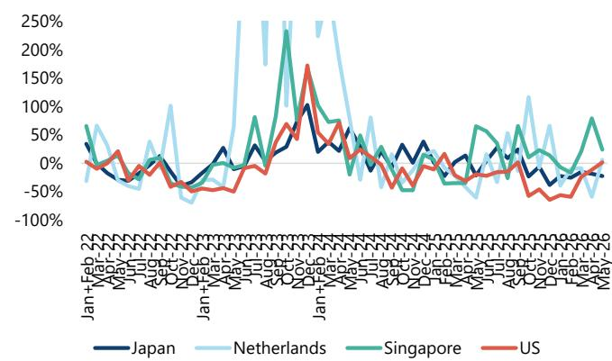
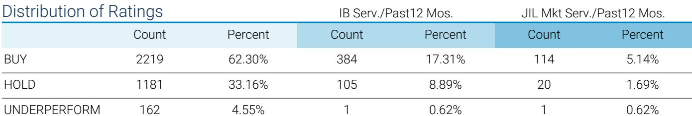
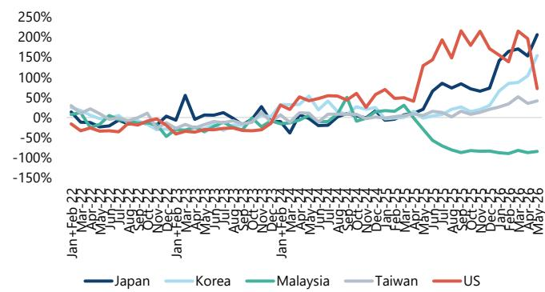

# JEF：中国半导体设备进口的窄幅下跌背后，藏着一个更大的结构性故事

5月中国半导体设备进口数据出炉，表面看并不乐观——WFE（晶圆制造设备）进口同比下降12%，连续三个月恶化。但如果只看总量，你会错过真正的信号。

JEF（JEF）最新研报的核心判断是：这轮下跌是“窄基”的，几乎完全由刻蚀设备进口骤降驱动，而沉积、离子注入等关键环节仍在增长。更关键的是，报告揭示了一个更长期、更具决定性的驱动力——中国半导体贸易逆差正在以惊人的速度扩大，这将成为未来WFE资本开支持续强劲的根本支撑。

这份报告的价值不在于告诉你5月数据好不好，而在于它帮你把短期波动和长期结构分开了。对于关注中国半导体自主化进程的决策者来说，理解这种“窄幅下跌”背后的逻辑，比纠结于月度数字本身重要得多。

> **KC评论：** 很多读者看到设备进口下降，第一反应是“自主化受阻”或“需求疲软”。但JEF的分析恰恰相反——下跌是结构性的、局部的，而真正的增长引擎（贸易逆差驱动的长期资本开支）正在加速。这种“总量悲观、结构乐观”的错位，恰恰是专业研报最有价值的地方。完整报告里有更详细的设备分类和国别数据，能帮你验证这个判断到底站不站得住。

## 1. 5月的下跌是窄基的，真正需要关注的是哪些环节在逆势增长

5月WFE进口下降12%，听起来确实比4月的6%和3月的3%降幅更大。但JEF的分析师指出，这个下跌几乎完全由刻蚀设备贡献——刻蚀进口骤降24%，而沉积设备增长12%，离子注入设备增长21%，光刻设备基本持平。

这意味着什么？下跌不是系统性的需求萎缩，而是特定环节、特定供应商的调整。报告认为，刻蚀设备下降主要与从日本和马来西亚的进口骤降有关——5月从这两国的WFE进口分别下降58%和28%。这很可能反映了特定设备商的交货节奏或库存调整，而非中国晶圆厂整体削减资本开支。

从更长时间维度看，前5个月WFE进口累计下降12%，光刻和刻蚀分别下降24%和18%，但沉积和热处理设备都实现了3%的正增长。这种分化本身就说明，中国半导体设备采购正在发生结构性调整——从追求全面扩张转向有重点的补强。

> **KC评论：** 刻蚀设备进口大幅下降，会不会是国产替代的体现？报告没有直接回答，但这正是值得追问的方向。完整报告里有按国别和产品类别的详细表格，能帮你判断这到底是短期供应扰动，还是长期国产替代的真实信号。

## 2. 新加坡取代日本成为中国最大WFE进口来源地，供应链正在重新编织

这是报告中最具地缘政治含义的发现之一。前5个月，中国从新加坡的WFE进口同比增长45%，占比达到25%，首次超越日本（23%）成为第一大来源。荷兰的份额则从高位回落至18%。

与此同时，从日本和荷兰的进口分别下降24%和28%，而中国台湾对大陆的WFE出口增长22%。新加坡和台湾成为前5个月仅有的两个对中国WFE出口正增长的经济体。

这个变化不是偶然的。它反映了全球半导体设备供应链正在经历一轮“再布线”——美国出口管制推动设备商通过第三地中转或设立新产能来服务中国客户。新加坡作为中立枢纽的地位正在上升，而台湾则凭借其在成熟制程和封装领域的优势，持续向大陆输送设备。

对于关注供应链安全的读者来说，这个趋势意味着：即便美国维持甚至收紧管制，中国仍有渠道获取关键设备，但成本更高、交货期更长、不确定性更大。JEF在报告中提到，先进逻辑客户去年大量提前拉货，加上灰市关键设备交货期很长，是当前进口疲软的原因之一。这正好印证了“买得到但买得贵、等得久”的现实。

## 3. 半导体贸易逆差正在加速扩大，这是WFE资本开支最根本的驱动力

如果说前两个观察是“短期信号”，那么这一条就是“长期逻辑”。

JEF的数据显示，5月中国半导体进口同比增长71%，连续五个月加速增长。前5个月，中国半导体贸易逆差达到990亿美元，同比增长19%，而过去三年基本持平。韩国首次超越台湾成为中国最大的半导体进口来源地，5月从韩国进口同比增长154%，前5个月累计增长103%。

报告认为，这个快速扩大的贸易逆差是推动中国WFE资本开支增长的最重要驱动力之一。逻辑很简单：中国对半导体的需求在AI、机器人、电动化等领域的推动下持续爆发，但本土产能远远跟不上。要缩小这个缺口，就必须持续投入设备。

> **KC评论：** 贸易逆差扩大这个指标，比任何月度设备进口数据都更能反映中国半导体产业的真实压力。它说明需求侧的增长远快于供给侧的能力建设。对于投资者来说，这意味着设备国产化不是一个“可选项”，而是一个“必选项”。完整报告里有贸易逆差的趋势图和按地区的进口拆分，能帮你量化这个缺口到底有多大。

## 4. 先进封装是唯一正增长的设备类别，华为“Tau”缩放定律正在变成实际需求

在整体WFE进口下滑的背景下，有一个品类表现抢眼：封装设备。前5个月，中国封装设备进口同比增长8%，是唯一实现正增长的设备类别。

JEF特别指出，华为提出的“Tau”缩放定律本质上依赖于先进封装技术，而中国在封装设备领域不受任何出口管制限制。这意味着过去12-24个月，先进封装将是明确的增长领域。

这个判断与整个行业的技术趋势高度一致。当先进制程的推进遇到物理极限，先进封装就成为提升芯片性能的关键路径。中国在先进制程设备上受到限制，反而可能加速其在先进封装领域的投入——这是一个“绕道超车”的逻辑。

对于投资者来说，这意味着封装设备相关公司可能比光刻或刻蚀设备公司更早受益于中国的自主化进程。但报告没有展开的是，先进封装设备的技术壁垒和竞争格局如何，以及中国厂商在哪些环节已经具备竞争力。

## 5. 报告没有完全回答的问题：下半年复苏的节奏和确定性

JEF对2026年全年WFE资本开支的判断是“低个位数到中个位数增长”，并认为下半年会有需求复苏，存储资本开支将是主要驱动力。

但这个判断有几个前提需要验证：第一，CXMT（长鑫存储）是否真的在等待美国放松管制，还是会继续按计划扩产？第二，先进逻辑客户去年大量提前拉货的影响会在什么时候消化完毕？第三，灰市关键设备的交货期何时能恢复正常？

报告承认，前5个月WFE进口疲软，部分原因就是CXMT在去年大量拉货后放缓，以及先进逻辑客户的提前拉货效应。这些因素的消退时间点，将直接决定下半年复苏的力度。

> **KC评论：** 报告给出了一个清晰的框架——短期看库存消化和交货期，中期看贸易逆差驱动的资本开支，长期看国产替代。但具体到投资决策，还需要更细的拆分：哪些设备品类国产化率最低？哪些公司已经在关键环节取得突破？这些问题的答案，在完整报告的数据和图表中有更深入的线索。

## 顺着这些未解问题，继续读完整报告

JEF这份研报的价值，不在于告诉你5月数据好坏，而在于它提供了一个分析框架：如何区分短期波动和长期结构，如何从贸易逆差推导资本开支，如何从国别变化判断供应链重组。

但报告也留下了几个值得继续追问的问题：刻蚀设备的大幅下降，到底是短期供应扰动还是国产替代的真实体现？先进封装领域的国产化进展到底到了什么程度？下半年存储资本开支的复苏，具体会由哪些厂商驱动？

这些问题的答案，藏在完整的图表和更细分的分类数据里。每天，我们的AI agent加上人工review，会从投行研报中筛选出最有价值的中文摘要和KC评论，更新约10-40页，并整理当天最新数据图表合集。既方便喂给AI做进一步分析，也方便人工快速把握市场动态。如果你也在跟踪中国半导体设备这条线，欢迎来我们的社群和微信群里继续讨论。

Personal reading notes and learning share only. Not investment advice.

