MS European Capital Goods
25 $^{th}$ June 2026

MORGANSTANLEYRESEARCH Europe

MS & Co. International plc+

# Industrial capex > production. A case for selective broadening out

Max Yates  
Equity Analyst  
Max.Yates@morganstanley.com  
+44 20 7425-1917

Harry Stephenson
Research Associate
Harry.Stephenson@morganstanley.com
+44 20 7425-0859

Sara Chemello
Research Associate
Sara.Chemello@morganstanley.com
+44 20 7425-2931

## Capex resilience. Customers learning to live with uncertainty

\- Reminiscent of 2022. Data center, strategic capex and price will protect nominal sector earnings. The bigger sector risks are 1) EBITA margins and cost pressure, and 2) multiples, particularly if interest rates start moving higher.

\- Capex ‘green-shoots’, in particular in US and in Asia. Customers ‘looking through’

\- Less risk of an industrial demand collapse from here, given demand for many short-cycle companies has not grown volumes versus 2019 levels.

\- Cost inflation is back. This time affecting Electricals more than Mechanicals. Some concerns across Signify, Vestas, Weir and Rexel.

## Selective in Electricals / Mechanicals. Keep our quality growth skew.

\- Electricals: we prefer Schneider (OW). Best balance of growth vs valuation. We also stay OW Legrand and view the recent sell-off as overdone.

\- We like upstream mining. Since March-26, we have preferred Epiroc (OW) to Sandvik (EW). Too early to buy the mid-stream names.

\- Stocks for a broadening out: Atlas Copco (OW), Knorr Bremse (OW), Spirax (OW). Risk reward on Siemens (EW) also looks positive here into 2027.

\- We stay cautious on Wartsila (UW), Signify (UW), and Kone (UW).

End market order growth trends. Electrification order growth has likely peaked. Process / Construction is in no mans land  
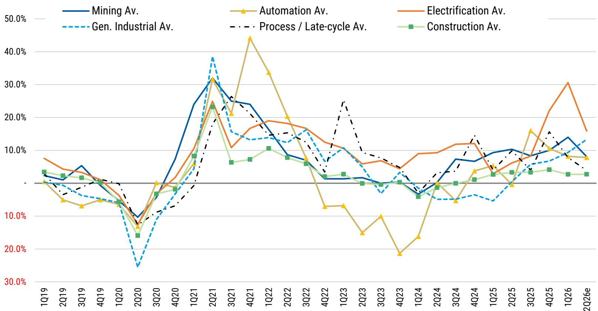

## Global capex in 2026. Still a thematic world. Capex growth (based on analyst ests) is still confined to a smaller number of sub-sectors. Process is a soft spot.

We see a mixed picture for capex into 2026. Hyperscaler, and Semis are bright spots. We see relatively higher risks in O&G, Pharma and Chemicals

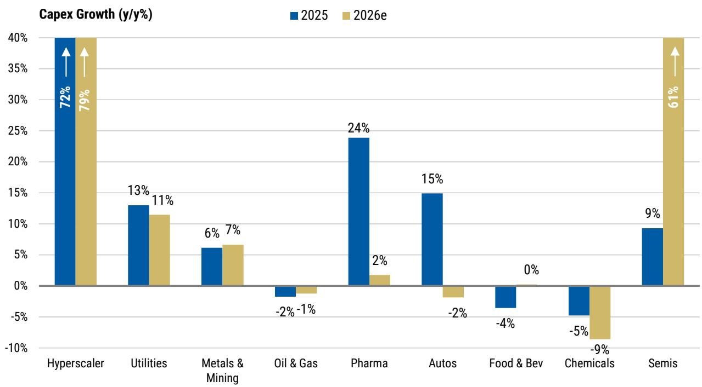

Capex green shoots. We see this in US manufacturing starts, and Asia (ex China) Cap Goods imports, which lead Machinery gross capital formation.

US Dodge manufacturing starts. After many headlines on US ‘reshoring’ we are starting to see manufacturing starts grow again, which was a driver in 2021-22.

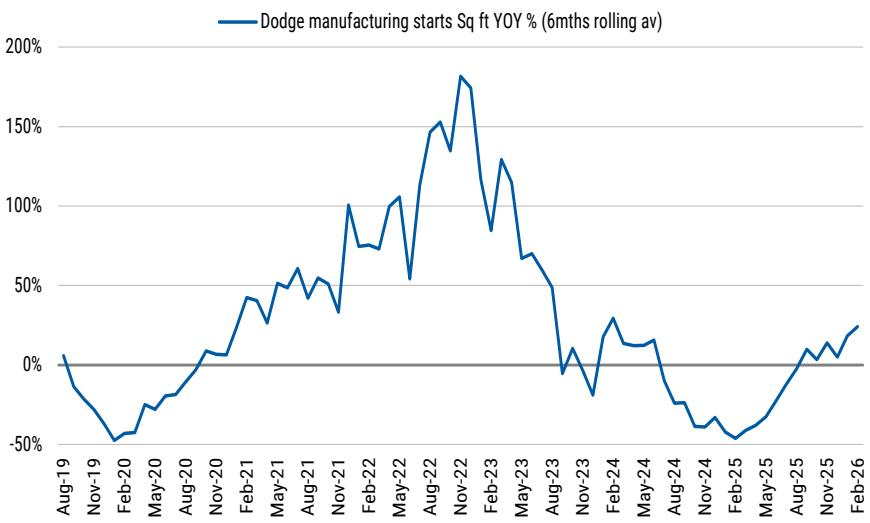

Our Asia economists see an emerging Asia (ex China) capex cycle. Capital Goods imports have picked up, and this should translate into greater gross fixed capital formation for machinery.

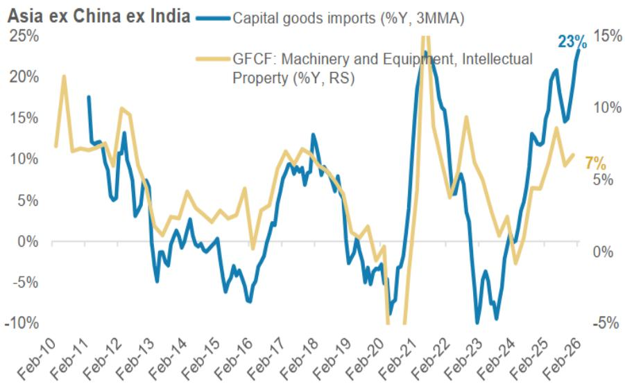

## European Infra / Capex still has challenges. German Infra spending is taking longer, and European manufacturers (eg Auto) are still seeing challenges

German Infrastructure budget. Even with a German fiscal plan, the rate of Infra spending is falling behind expectations

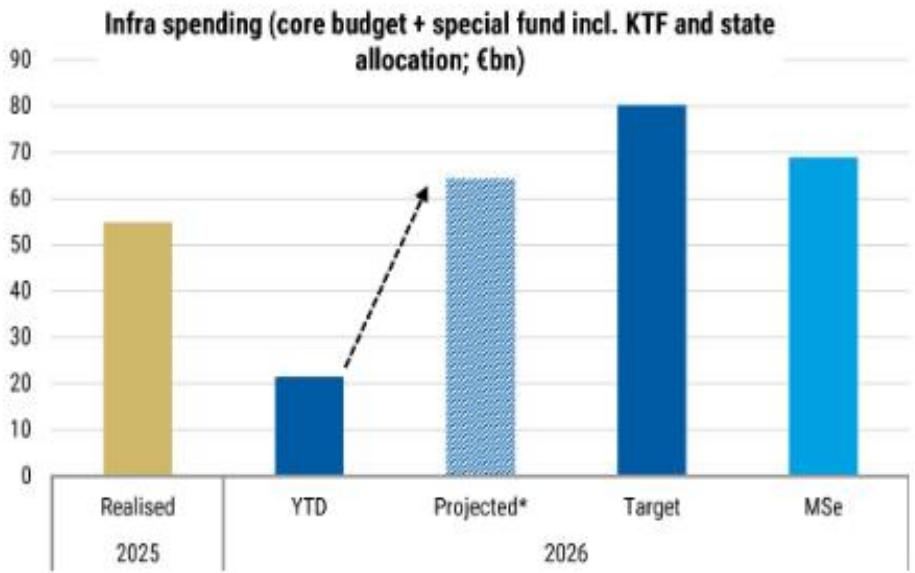

European Auto OEM's market share. Market share relative to global peers is continuing to increase. This is affecting EU Auto capex, a big European Industrial capex market

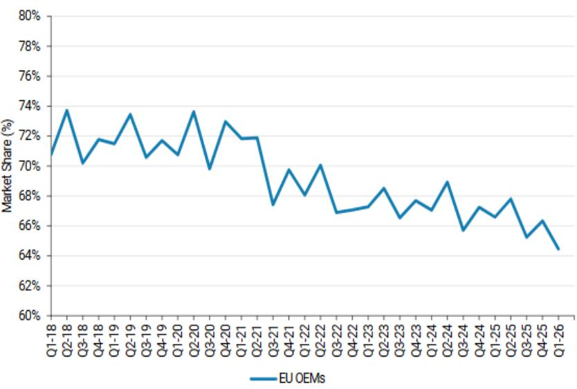

Hyperscaler capex still stands out, and data centers are still the main growth driver for Electricals. 79% growth in 2026e, and 39% in 2027e

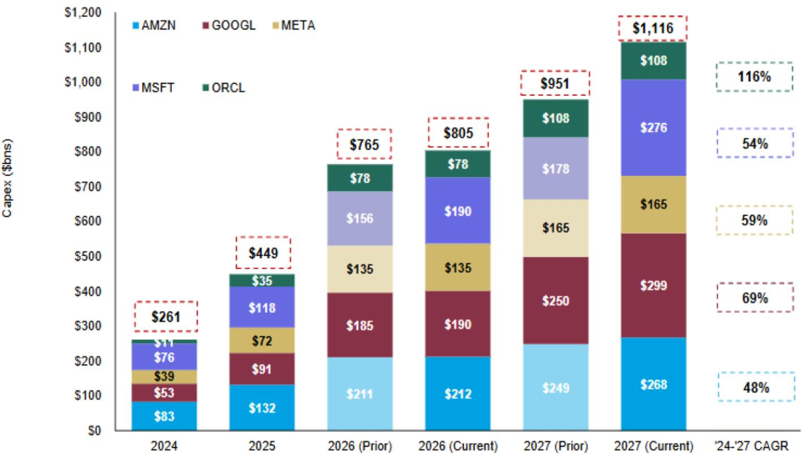

European and US IP. We are less fearful of a sharp Cap Goods volume slowdown. We are already coming out of a 2023-24 Industrial production recession in Europe. But we think risks are higher for the ‘production / consumer’ linked companies in our coverage.

EU and US Industrial production. We are coming off low levels, while the US has moved broadly sideways in 2023-25.

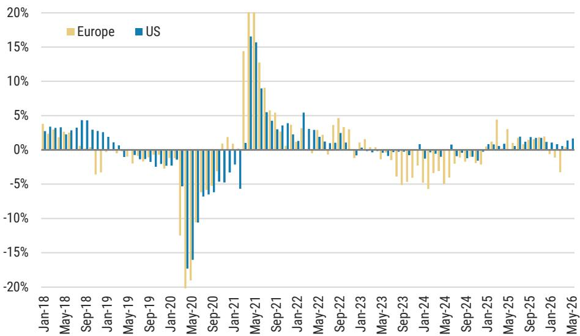  
Sandvik Machining volume growth has been negative for the majority of the last 3 years.

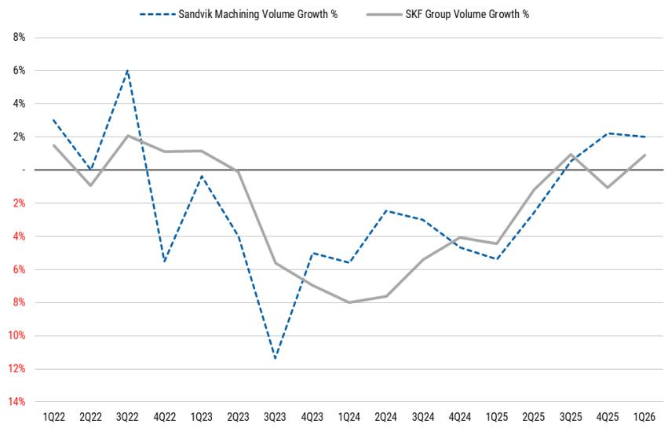

## Short-cycle data across US and Asia is still delivering strong growth rates. In particular, we would highlight US durable goods orders and Japan machine tool orders.

US Durable goods orders. These have continued to accelerate into 2Q26, which suggests to us that we are not seeing any major snap-back from potential pre-buying

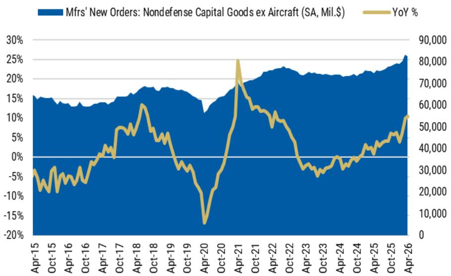  
Japan machine tool orders. These continue to deliver attractive growth rates, suggesting a continued strong backdrop for Factory Automation in our view.

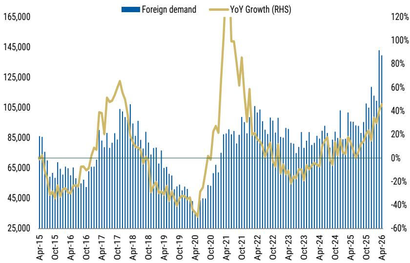

## EMEA revenue exposure vs North America. We prefer US exposure over EU at this point in the cycle, given favourable short-cycle data and scope for incremental capex

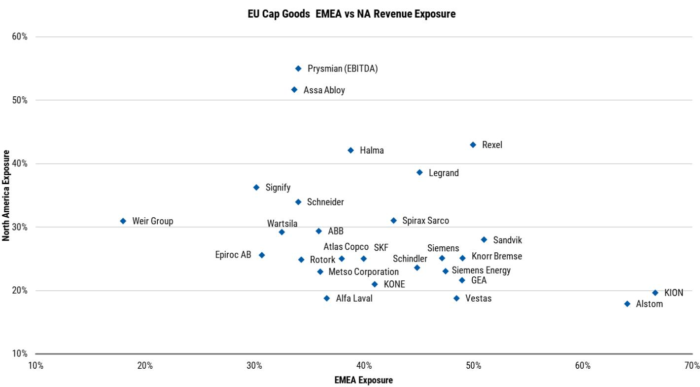

# EBITA margins – Arguably a bigger risk than growth. In 2022, companies with backlogs saw margin pressure. In 2026, Electricals costs are rising faster

Raw material average cost increases, and raw mats cost increases YOY in 2026 for Electricals and Mechanicals. Raw materials are typically 5-10% of Cap Goods company costs

Raw Material Average Cost Increase  
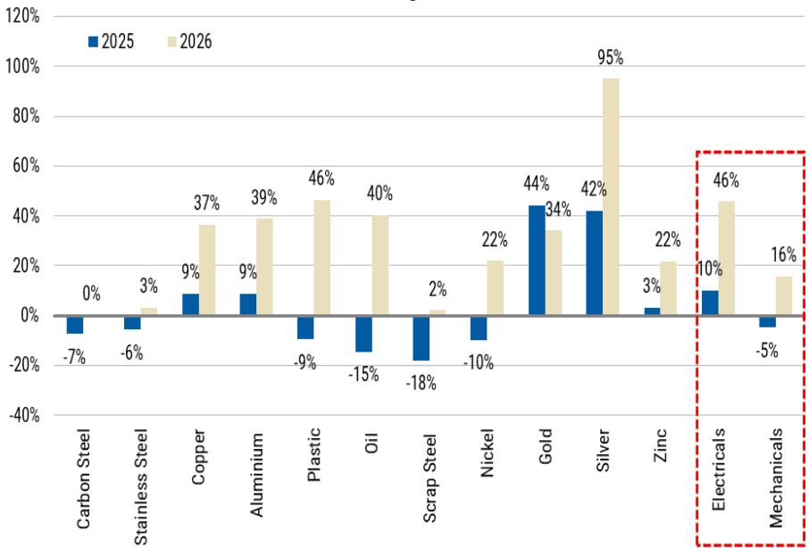

Costs for Industrial companies have continued to rise for Industrials across a number of cost buckets. We think prices will need to rise $\sim 4\%$ in 2026e.

<table><tr><td></td><td>% of sales</td><td>2025</td><td>2026e</td></tr><tr><td>Raw materials</td><td>6%</td><td>2%</td><td>27%</td></tr><tr><td>Components</td><td>30%</td><td>3.0%</td><td>3.5%</td></tr><tr><td>Wages</td><td>25%</td><td>2.9%</td><td>3.5%</td></tr><tr><td>Freight</td><td>5%</td><td>8.2%</td><td>6.0%</td></tr><tr><td>D&amp;A</td><td>3%</td><td>3.0%</td><td>3.0%</td></tr><tr><td>Other costs</td><td>13%</td><td>2.5%</td><td>3.0%</td></tr><tr><td>Electricity</td><td>1%</td><td>-0.1%</td><td>25.0%</td></tr><tr><td>Cap Goods Annual cost inflation</td><td>82%</td><td>2.5%</td><td>4.4%</td></tr></table>

## EBITA margins – 2026 YOY increase in consensus margins (bps)

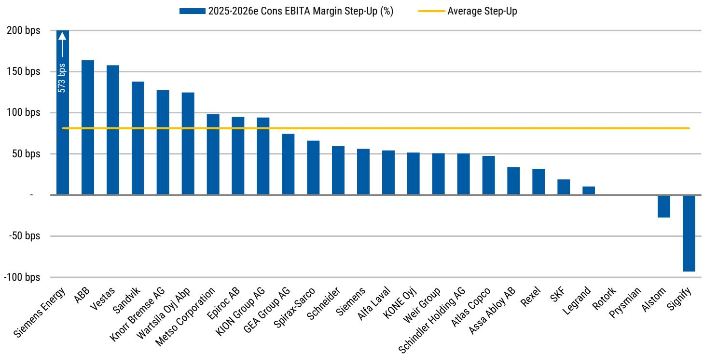

European sectors consensus EPS revisions (45 days). Cap Goods has seen relatively favourable EPS revisions versus the rest of the market.

We show cyclical (sectors) vs Defensives (sectors) across the broader European market. We have seen a pull-back, but it has been relatively modest so far compared to ‘typical cyclical pullbacks’.

European Sectors NTM Earnings Revision Ratio (FFMCap Weighted)  
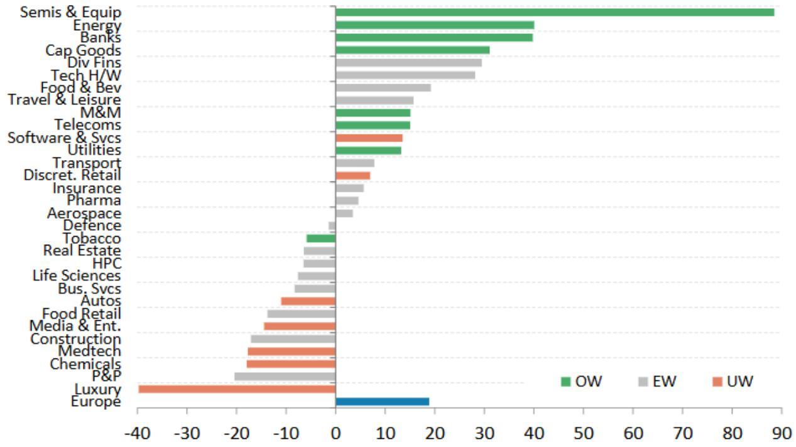

## Cap Goods EBITA revisions and multiple re-rating / de-rating since the start of the Iran conflict. Electricals have seen upgrades and re-rating. Mechanicals, a 10-25% de-rating

Electricals have mostly seen small upgrades to 2027 consensus, and this has largely combined with multiple re-rating. Schneider has lagged, while Prysmian, Signify and ABB have led the re-rating

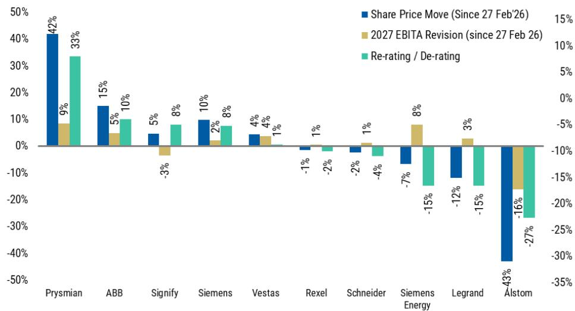  
Mechanicals. 93% of mechanicals de-rated since the start of the Iran conflict. The majority of companies have de-rated by 10%-22% on concerns over global growth

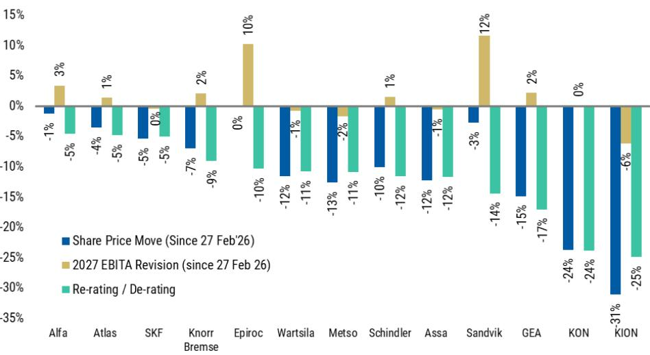

## Cap Goods Multiple vs 10-Year Average. 70% of stocks in our coverage are at or above their 10-year average valuations.

Left to right. The stocks on the left are trading at a high current valuation vs their ten-year average. Stocks on the right are relatively cheaper vs ten-year average. The thematic stocks (grid, power, data centre) are all relatively expensive versus history. We continue to like the risk/reward at Schneider, Epiroc, Siemens Energy, Legrand, Atlas Copco and Knorr Bremse. We remain Underweight on Wartsila, Signify and Kone

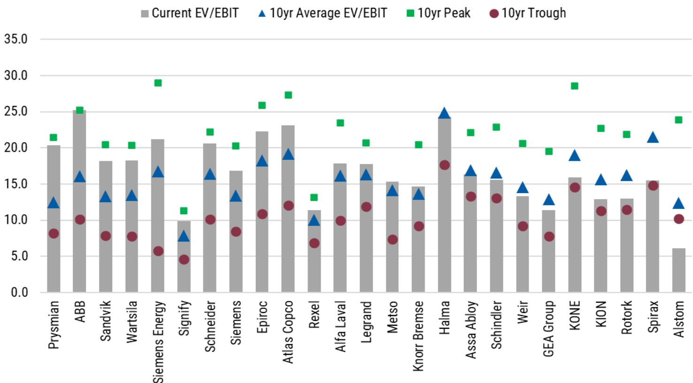

Fundamental Views: What to Own – What to Avoid. We keep a quality growth bias.

Atlas Copco

KNORR-BREMSE

L1 legrand

Spirax Group

Schneider Electric

Rexel

SIEMENS
energy

## KONE ⑤ignify

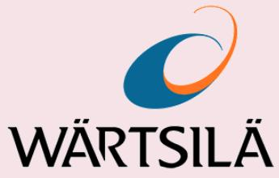

# Industrial data. Holding up so far. US / Asia are reassuring, while Europe is moving sideways

## Europe. Soft data like the IFO has weakened, with the German IFO declining -3.1% YoY in June, despite a small MoM improvement

German Industrial is now back in negative territory YOY since January. April IP was -0.5% YoY.

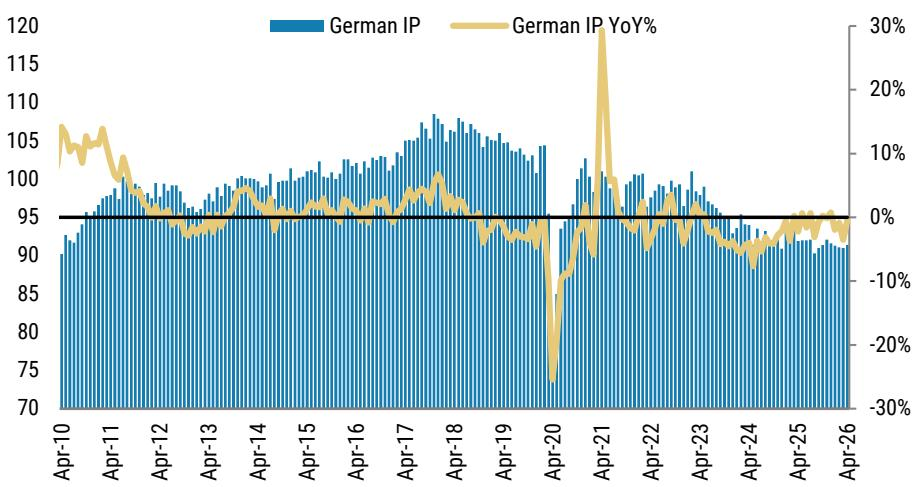  
German IFO business expectations have dipped. They are not yet at 2022 lows but have deteriorated.

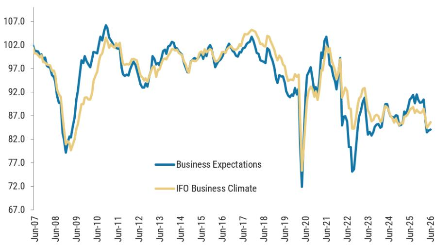

## Europe. Resi construction starts (Germany) and permits (France) are still nicely positive. Companies (RXL, St Gobain) see a slower 1Q26 start (weather)

German and French residential permits are still showing positive signs.  
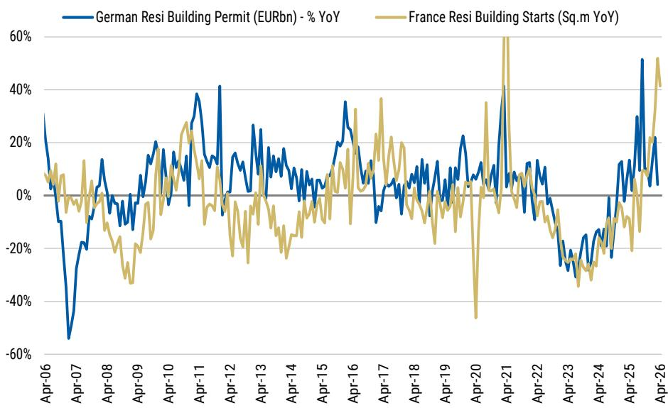

Companies (Rexel, St Gobain) had a slower start to 1Q26 with volumes again turning slightly negative (partially weather)  
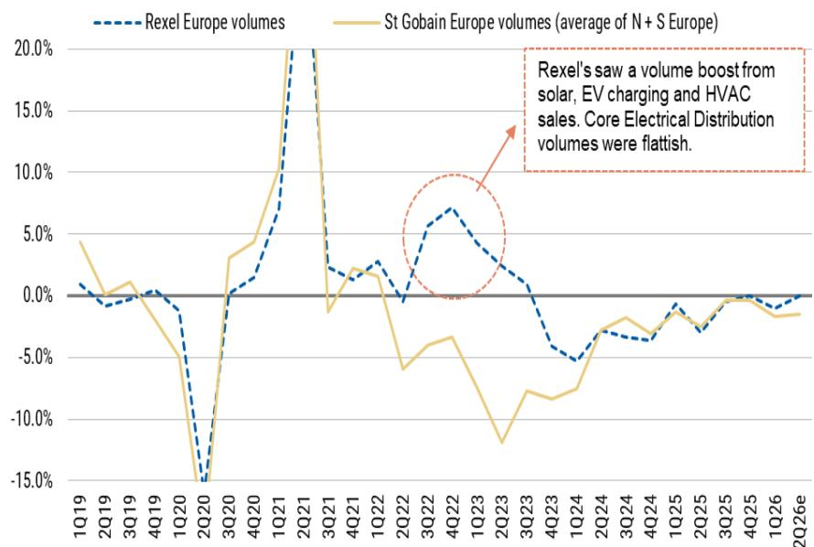

## US. The ISM new orders showed some moderation in March from a much-improved Feb. New orders / Inventory do not suggest any major cause for concern.

US ISM new orders. A modest recovery in May, after a March pull back. Still nicely above 50 suggesting US industrial resilience.

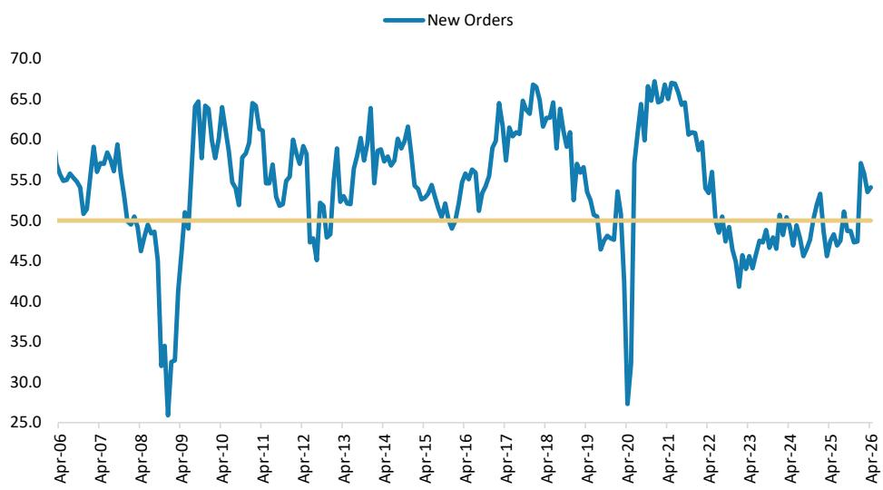

The US ISM new orders to inventory remains well above the US ISM level. We do not see the US Industrial recovery as being derailed.

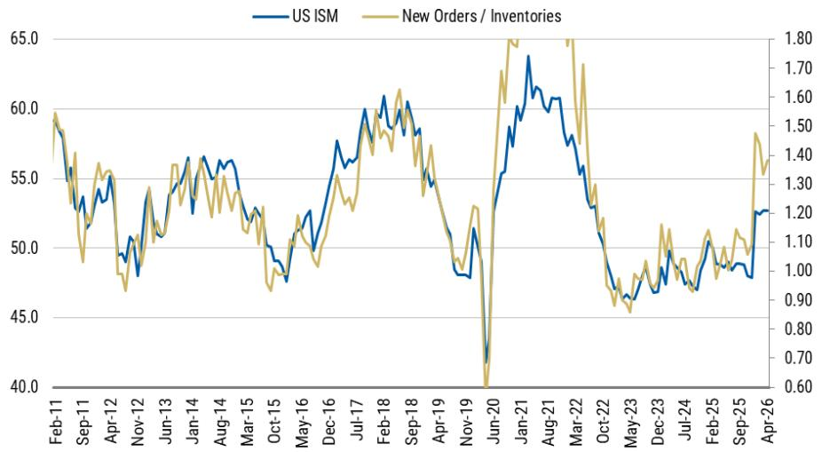

## Hard US Data. Fastenal April sales growth (14.3%) continued on a recovery path. Rockwell's orders also increased materially QoQ (\~20%) in the US.

Fastenal Daily sales growth. No signs of a slowdown. May (14.8%) vs Apr (14.3%) vs Mar (11.5%)

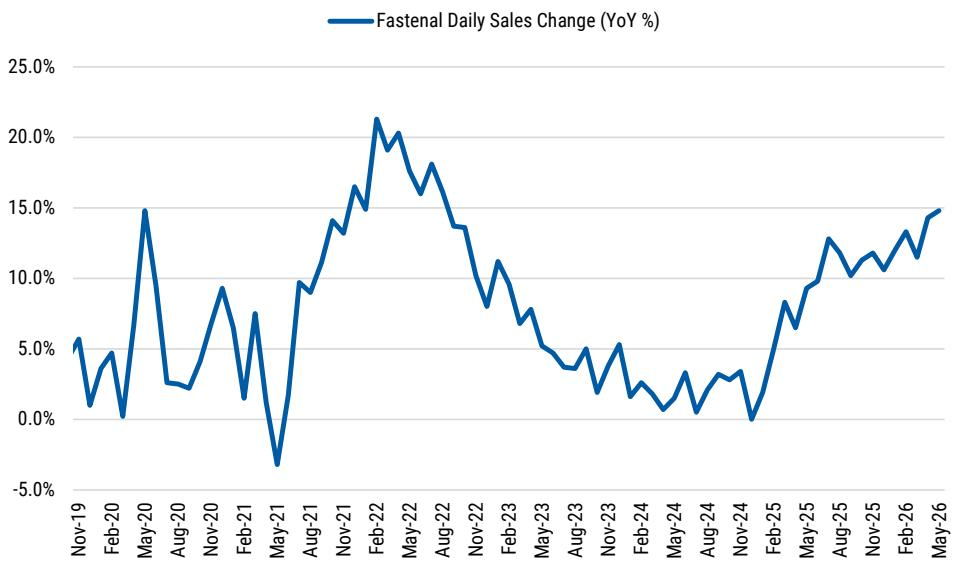  
Rockwell orders were +20% QoQ, with the company pointing to some project capex unlock in the quarter across end markets like Automotive and Food and Beverage.

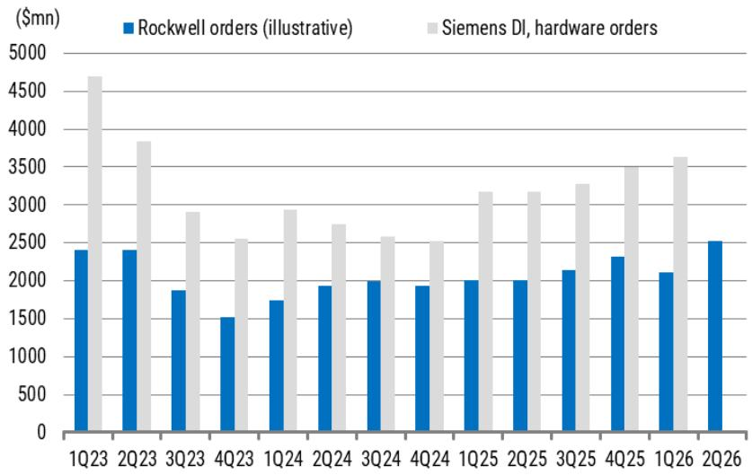

Asia short-cycle data. Foreign Japan Machine Tool orders have accelerated through 1Q26, while Airtac sales were still +25% YOY in April.

Japan Machine Tool orders. Foreign demand grew at 46% in April, compared to 35% on average in Jan - Mar.

  
Airtac sales. Overall 1Q26 sales growth was +11% QoQ and +24% YOY. Shipments to battery, general machinery and electronics was strong in March

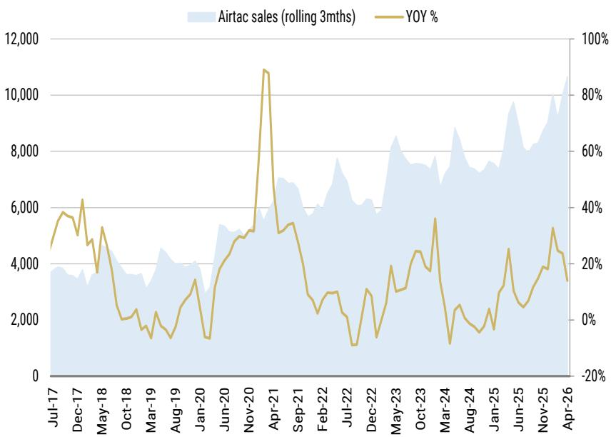

## Asia Automation (including Fanuc Factory Automation) is strong. This illustrates continued Asia investments.

Fanuc factory automation orders saw a strong YOY increase in calendar 1Q26. Siemens order intake did not see the same intake, with Siemens lagging our expectation on China growth

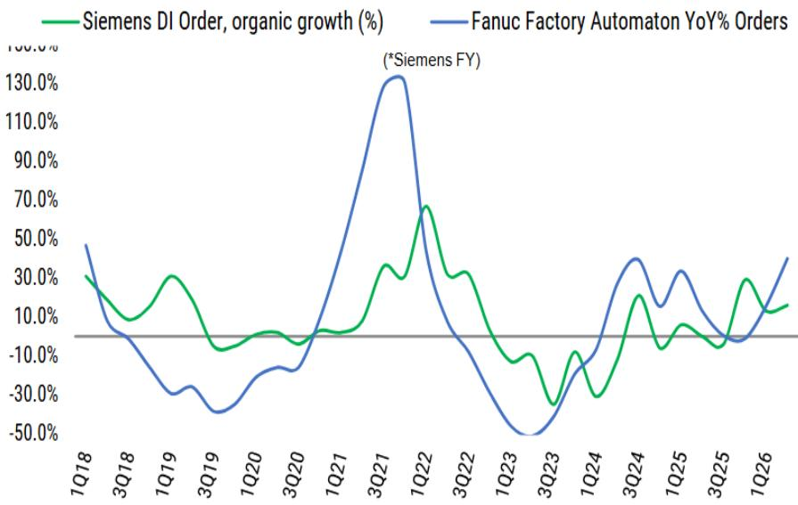

MIR China Automation data. This shows the YOY change in total China automation spend by end market. We can see particular strength in Battery and Electronics.  
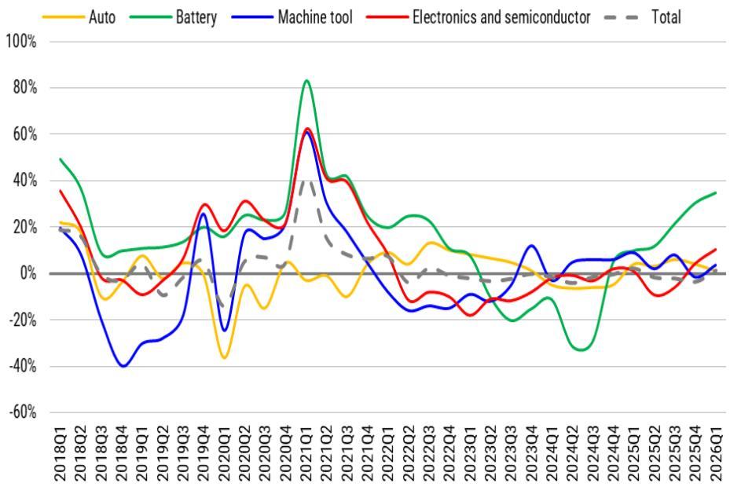

## Pre-buying debate. Is the March / April demand resilience real, or is it more pre-buy ahead of price rises? We have seen instances of companies highlighting pre-buy.

<table><tr><td>Company</td><td>Commentary</td></tr><tr><td>Metso</td><td>&quot;... with Aggregates... in this order intake, we see a clear pattern that some of the orders are placed not only for the second quarter but also for the second half of the year, so sort of a pre-buying phenomena visible in that regard.&quot;</td></tr><tr><td>Kion</td><td>&quot;The increase in new business contained pull-forward effects related to the price increases announced for early April 2026 intended to offset rising costs resulting from the Iran war.&quot;</td></tr><tr><td>Sandvik</td><td>&quot;Also solid demand in general industry. This is partly driven by prebuying, but also we are seeing early signs of an improved underlying sentiment in the market.&quot;</td></tr><tr><td>Flowserve</td><td>&quot;With the dynamics in the Middle East... we&#x27;re seeing folks trying to think about expanding capacity or doing things a little bit differently or potentially accelerating projects, and a lot of this is around energy security... customers talking about doing things differently about increasing capacity or actual expansions and even new projects.&quot;</td></tr><tr><td>Carrier</td><td>&quot;April movement was better than we thought. And I think part of that was probably people trying to beat the price.&quot;</td></tr><tr><td>3M</td><td>&quot;And then when you put all that together, it gives us a sense that perhaps there&#x27;s some advanced buying from these price increases that are going out.&quot;</td></tr><tr><td>Wacker Chemie</td><td>&quot;We had a solid start to the year and even surpassed our own expectations due to pull-forward effects... stemming from the conflict in the Middle East...&quot;</td></tr><tr><td>BASF</td><td>&quot;You really saw an uptick in the volumes... it&#x27;s difficult to evaluate now, are we talking about restocking effects? Or is this really an underlying demand development?&quot;</td></tr></table>

## Key ideas, positioning and valuation

## Stock Selection – Screen

## Overweight Ideas

\- Schneider (OW, PT €300): Best in class topline growth, and productivity accelerating group margin expansion in 2026/27.

\- Rexel (OW, PT €42): Upside to FY26 organic growth guidance from pricing. Mid-term margin upside from self-help.

\- Knorr Bremse (OW, PT €116): Solid backdrop for Rail end market, with continued cost optimization supporting group margin expansion beyond 14%. Balance sheet optionality.

\- Siemens Energy (TP, OW, PT € 200): Outstanding visibility with some modest upside to consensus. However, we continue to get closer to the peak in Gas orders, in our view.

\- Epiroc (OW, PT SEK 300) : Consensus margin downgrades done, and a multi-year order growth story.

\- Atlas Copco (OW, PT SEK 200): VT recovery on semi capex growth, Compressor Energy efficiency tailwinds, with balance sheet optionality.

\- Legrand (OW, PT €166): Upside to 2026 organic growth estimates, and M&A contributions in 2025-26 above trend.

\- Spirax (OW, PT GBp 8,500): Headwinds from semis / biopharma becoming growth tailwinds, and helping margin mix

## Margins

\- Signify (TP, UW, PT €15) : Organic growth lagging peers. Pricing pressure can lead to EBITA margins down YOY in 2026. Slow start to the year in 1Q26 and risk to the dividend.

End Market Exposure

\- KONE (TP, UW, PT €46.6): Full valuation relative to EPS growth CAGR. China remains a drag to growth in 2026, and ISP competition in service continues.

\- Wartsila (TP, UW, PT €29): Peak valuation, with limited consensus upside. Increased competition in Energy, and Marine set to sequentially weaken through 2026.

## Underweight Ideas

## MS vs Consensus for Electricals and Mechanicals (2027 EBIT)

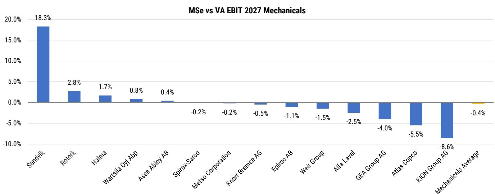

MSe vs VA EBIT 2027 Electricals  
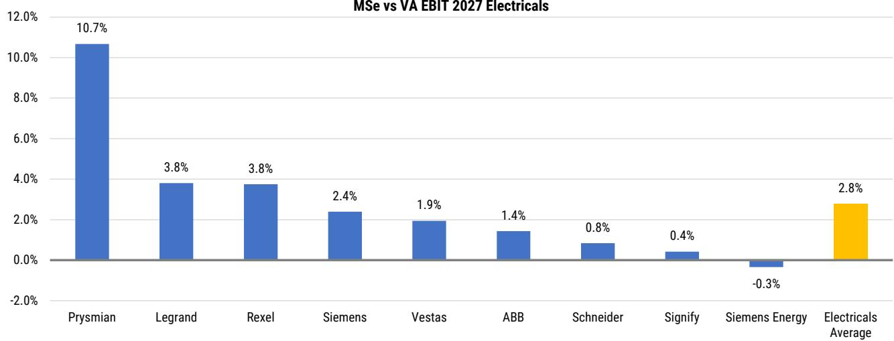

## Sector valuation. Trading at a 23% premium vs the market. Defensives have also de-rated vs cyclicals through 2025. This also indicates expectations of a cyclical recovery

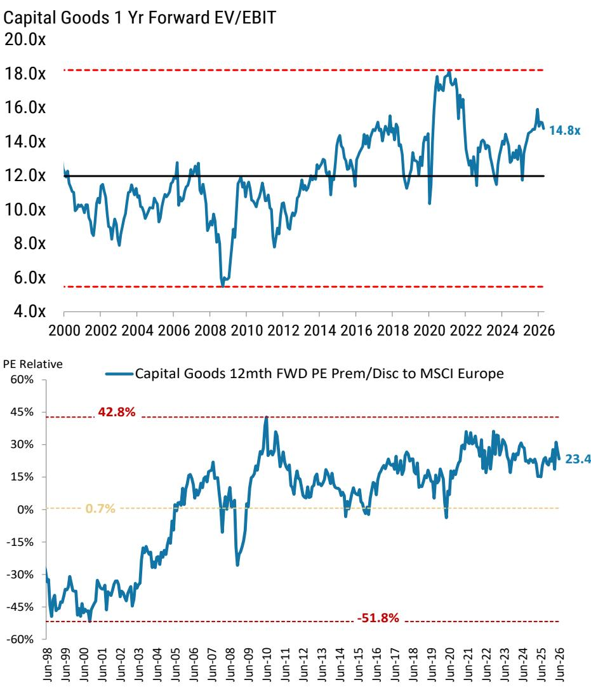

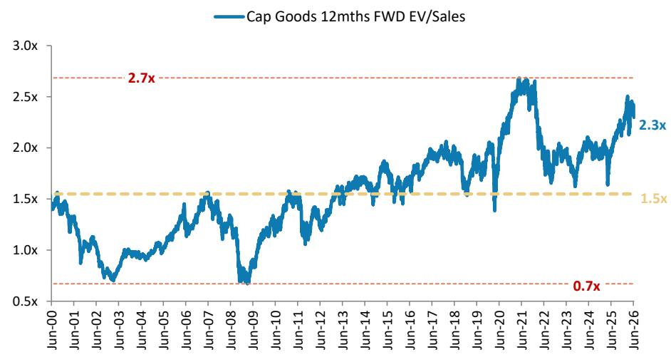

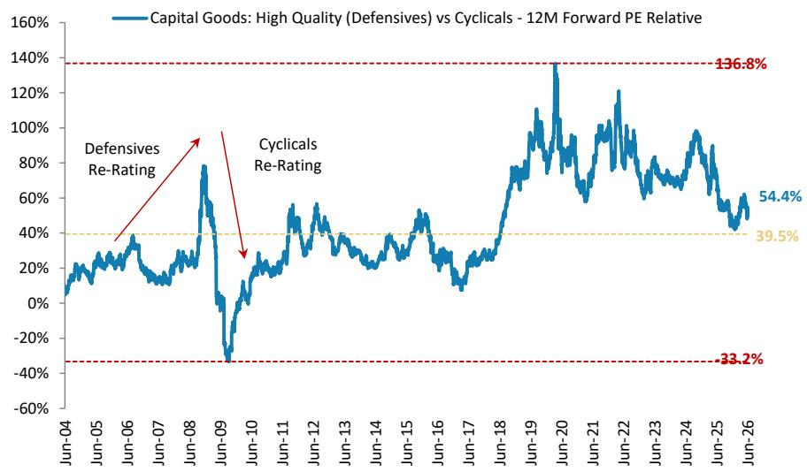

## European vs US Industrials valuation dispersion. Still a lot of room for Europe to close the gap in a continued Iran conflict de-escalation.

US Cap Goods back to a peak premium vs its EU peers.

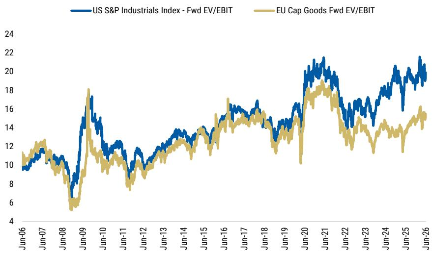  
The ‘European’ discount is most notable in 1) Siemens Energy vs GE Vernova, 2) Siemens vs Rockwell, and 3) Schneider vs Eaton.

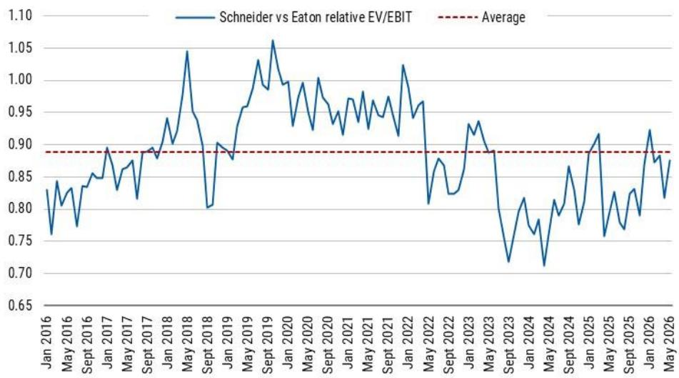

## Thematic valuations within Industrials (2028 EV/EBIT). Semi-cap (22x) at a premium. Defence (14x), Electrification (15.5x) and Aero Engines (16x) more tightly grouped.

Electrification stocks (ABB, SU, LR) are trading on similar multiples to Aero Engines. Power Gen is a 20% premium to Defence.

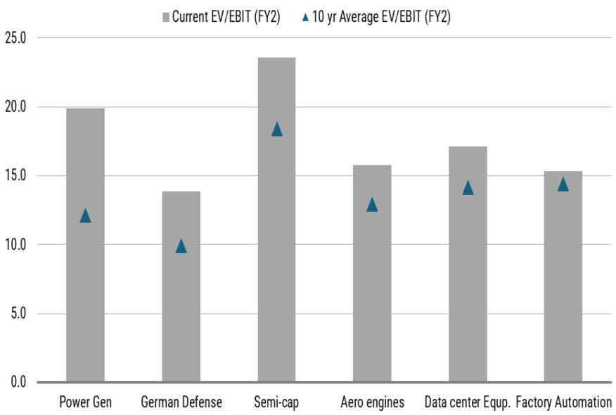

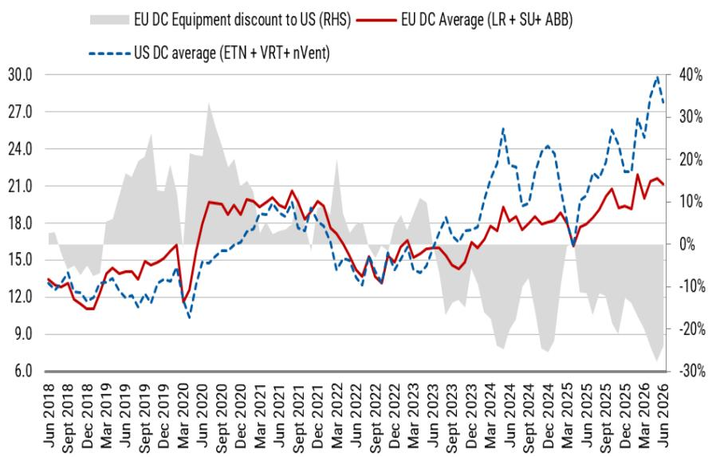

# Digging into company valuations. Siemens is back to a -14% discount to its theoretical SOTP, while Schneider screens as attractive vs ABB

Siemens EV/EBIT vs a weighted average of its peer group (weighted by Siemens' divisional exposure). Siemens is back to trading at an 14% discount to its theoretical SOTP

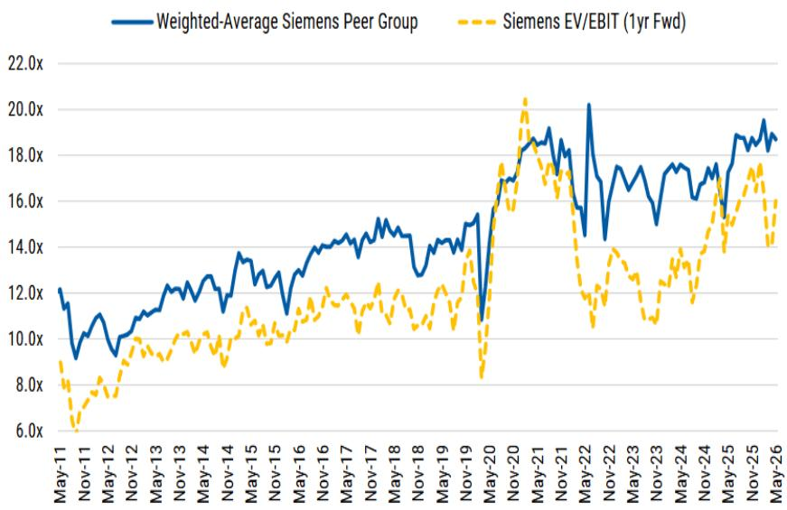  
Schneider vs ABB relative EV/EBIT. Schneider is trading at a c.20% discount to ABB on consensus EV/EBIT. Schneider screens as relatively attractive.

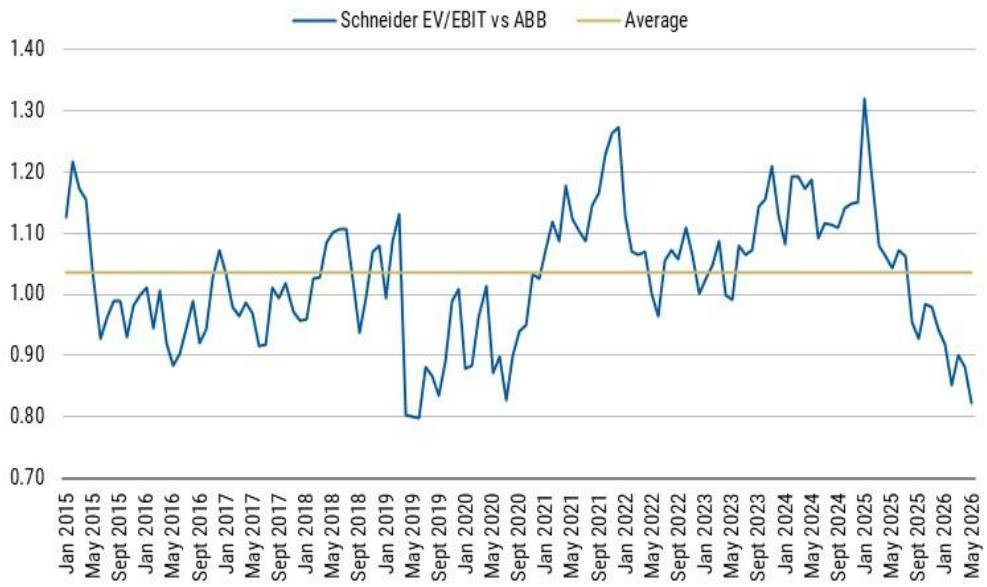

## 2026e P/E multiple vs 2026-28e EPS CAGR. We see an attractive combination of valuation and EPS growth at Rexel and KBX.

2026e P/E vs 2026-28 EPS CAGR  
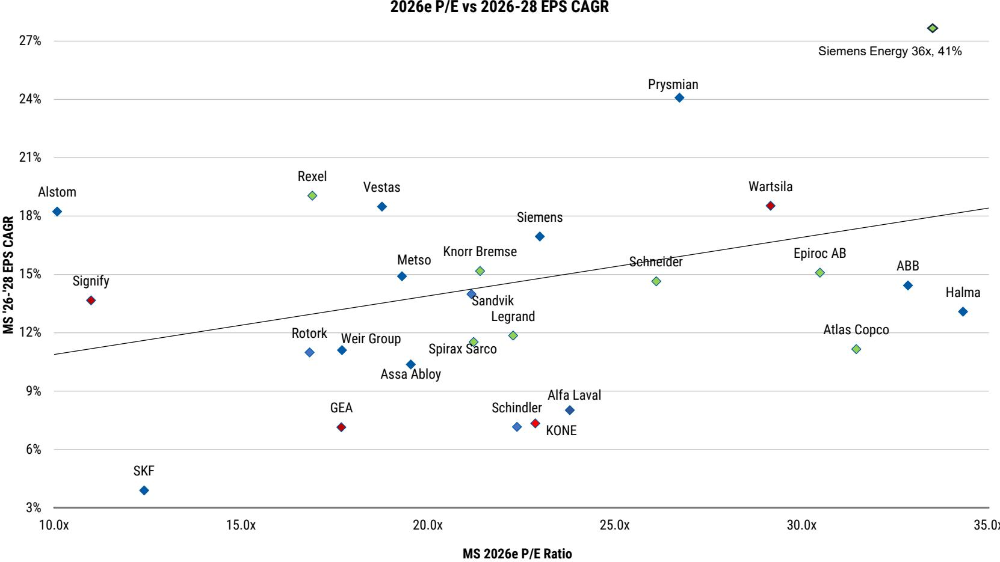

## Long-only positioning data in the sector. Schneider well owned, but Legrand is catching up. Siemens Energy remains below large-cap electricals in ownership.

European Fund Positioning in Legrand, Schneider, Siemens & ABB: % of Funds OW  
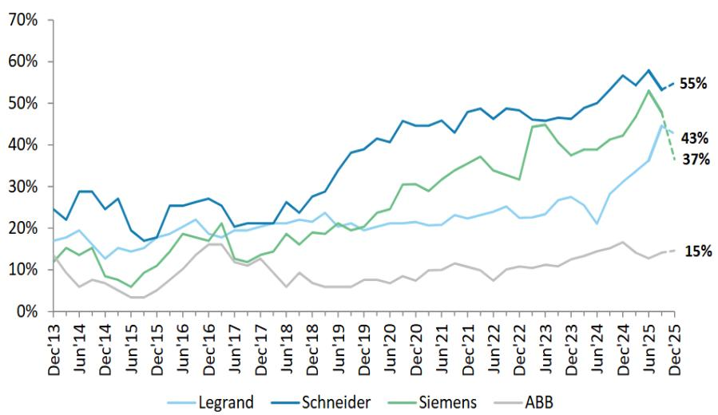

Fund Positioning in Siemens Energy: % of Funds OW  
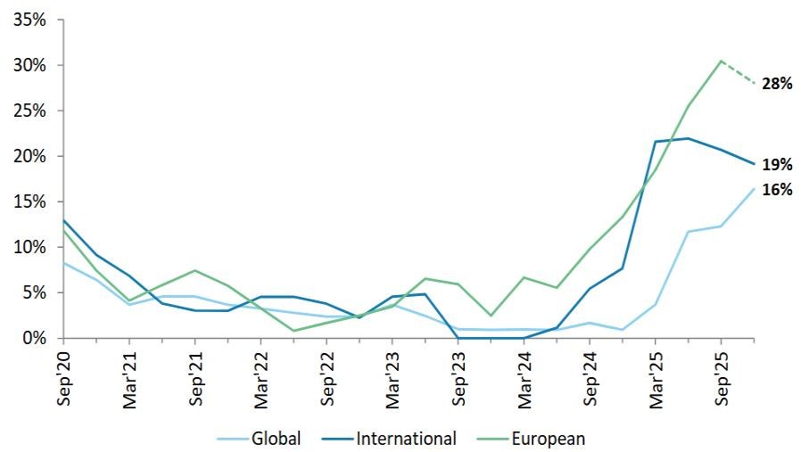

Capital Goods: Sector performance versus the European Stoxx 600. Since 2016, the sector has only underperformed the market in 2/10 years, ie 20% of the time.  
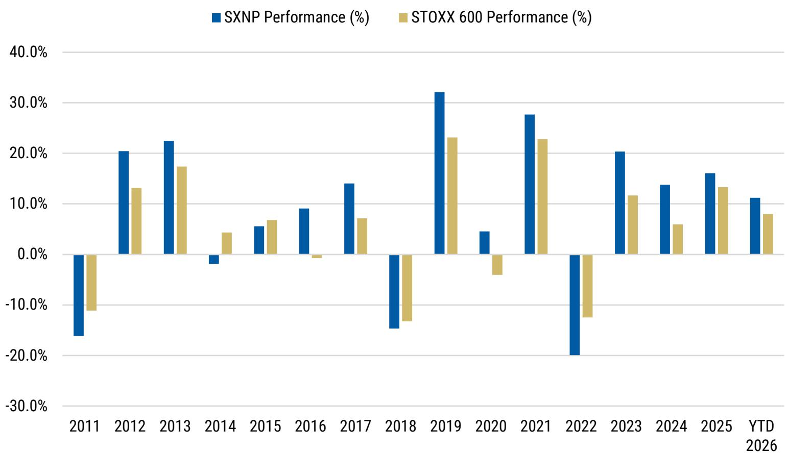

Industrial capex > production. A case for selective broadening out June 25th, 2026

## Capital Goods Comp Sheet

<table><tr><td rowspan="2"></td><td>Currency</td><td>MS</td><td>Share</td><td>MS</td><td>% Upside/</td><td>Mkt Cap</td><td colspan="3">P/E</td><td colspan="3">EV/Sales</td><td colspan="3">EV/EBITDA</td><td colspan="3">EV/EBIT</td><td colspan="3">Dividend Yield (%)</td><td colspan="3">FCF Yield (%)</td><td colspan="4">Relative to SXNP</td><td colspan="4">Relative to SXNP(EUR)</td></tr><tr><td>Price</td><td>Rating</td><td>Price</td><td>PT</td><td>(Downside)</td><td>EUR (in bn)</td><td>2026e</td><td>2027e</td><td>2028e</td><td>2026e</td><td>2027e</td><td>2028e</td><td>2026e</td><td>2027e</td><td>2028e</td><td>2026e</td><td>2027e</td><td>2028e</td><td>2026e</td><td>2027e</td><td>2028e</td><td>2026e</td><td>2027e</td><td>2028e</td><td>1M</td><td>3M</td><td>6M</td><td>12M</td><td>1M</td><td>3M</td><td>6M</td><td>12M</td></tr><tr><td colspan="33">Electricals</td></tr><tr><td>ABB</td><td>CHF</td><td>E</td><td>86.1</td><td>74.0</td><td>-14.1%</td><td>169.8</td><td>34.1</td><td>29.3</td><td>26.0</td><td>5.1</td><td>4.5</td><td>4.2</td><td>22.2</td><td>19.3</td><td>17.2</td><td>24.7</td><td>21.5</td><td>19.0</td><td>1.6%</td><td>1.9%</td><td>2.1%</td><td>2.7%</td><td>3.1%</td><td>3.4%</td><td>0.9%</td><td>23.0%</td><td>37.1%</td><td>68.6%</td><td>-0.4%</td><td>21.7%</td><td>38.2%</td><td>72.4%</td></tr><tr><td>Alstom</td><td>EUR</td><td>E</td><td>16.2</td><td>22.0</td><td>36.0%</td><td>7.9</td><td>8.6</td><td>7.2</td><td>5.9</td><td>0.4</td><td>0.4</td><td>0.3</td><td>5.4</td><td>4.2</td><td>3.2</td><td>nm</td><td>nm</td><td>nm</td><td>0.0%</td><td>0.0%</td><td>0.0%</td><td>7.0%</td><td>10.0%</td><td>13.0%</td><td>-6.0%</td><td>-42.4%</td><td>-43.3%</td><td>-30.2%</td><td>-6.0%</td><td>-42.4%</td><td>-43.3%</td><td>-30.2%</td></tr><tr><td>Legrand</td><td>EUR</td><td>O</td><td>146.8</td><td>166.0</td><td>13.1%</td><td>39.0</td><td>24.5</td><td>21.8</td><td>19.6</td><td>4.0</td><td>3.6</td><td>3.3</td><td>17.0</td><td>15.0</td><td>13.5</td><td>19.3</td><td>17.1</td><td>15.5</td><td>2.0%</td><td>2.2%</td><td>2.5%</td><td>4.1%</td><td>4.9%</td><td>5.3%</td><td>-5.7%</td><td>-0.9%</td><td>7.1%</td><td>18.5%</td><td>-5.7%</td><td>-0.9%</td><td>7.1%</td><td>18.5%</td></tr><tr><td>Prysmian</td><td>EUR</td><td>E</td><td>148.4</td><td>140.0</td><td>-5.6%</td><td>42.5</td><td>27.6</td><td>20.5</td><td>17.9</td><td>2.0</td><td>1.8</td><td>1.6</td><td>14.9</td><td>11.6</td><td>10.1</td><td>19.6</td><td>14.7</td><td>12.6</td><td>0.7%</td><td>0.9%</td><td>1.0%</td><td>3.2%</td><td>3.8%</td><td>4.7%</td><td>-2.8%</td><td>46.4%</td><td>64.1%</td><td>148.9%</td><td>-2.8%</td><td>46.4%</td><td>64.1%</td><td>148.9%</td></tr><tr><td>Rexel</td><td>EUR</td><td>O</td><td>37.1</td><td>42.0</td><td>13.1%</td><td>11.0</td><td>17.2</td><td>13.9</td><td>12.2</td><td>0.7</td><td>0.7</td><td>0.6</td><td>9.0</td><td>8.0</td><td>7.1</td><td>11.9</td><td>10.4</td><td>9.1</td><td>2.9%</td><td>3.2%</td><td>3.7%</td><td>4.4%</td><td>5.7%</td><td>7.2%</td><td>-0.7%</td><td>4.0%</td><td>3.1%</td><td>33.1%</td><td>-0.7%</td><td>4.0%</td><td>3.1%</td><td>33.1%</td></tr><tr><td>Schneider</td><td>EUR</td><td>O</td><td>279.5</td><td>300.0</td><td>7.3%</td><td>163.2</td><td>27.5</td><td>23.6</td><td>20.9</td><td>4.0</td><td>3.6</td><td>3.2</td><td>19.6</td><td>16.8</td><td>14.6</td><td>21.6</td><td>18.5</td><td>16.0</td><td>1.6%</td><td>1.9%</td><td>2.2%</td><td>3.1%</td><td>3.8%</td><td>4.3%</td><td>2.0%</td><td>4.9%</td><td>9.9%</td><td>13.2%</td><td>2.0%</td><td>4.9%</td><td>9.9%</td><td>13.2%</td></tr><tr><td>Siemens</td><td>EUR</td><td>E</td><td>272.3</td><td>260.0</td><td>-4.5%</td><td>211.0</td><td>23.7</td><td>19.8</td><td>17.3</td><td>2.8</td><td>2.5</td><td>2.3</td><td>16.1</td><td>13.6</td><td>11.9</td><td>19.4</td><td>16.0</td><td>13.8</td><td>2.1%</td><td>2.2%</td><td>2.4%</td><td>4.2%</td><td>4.8%</td><td>5.5%</td><td>-0.5%</td><td>18.9%</td><td>6.0%</td><td>12.3%</td><td>-0.5%</td><td>18.9%</td><td>6.0%</td><td>12.3%</td></tr><tr><td>Siemens Energy</td><td>EUR</td><td>O</td><td>162.5</td><td>200.0</td><td>23.1%</td><td>118.1</td><td>37.6</td><td>25.9</td><td>19.1</td><td>3.1</td><td>2.6</td><td>2.2</td><td>NM</td><td>NM</td><td>NM</td><td>26.8</td><td>18.2</td><td>13.1</td><td>1.3%</td><td>1.9%</td><td>2.6%</td><td>6.4%</td><td>5.7%</td><td>6.5%</td><td>-9.2%</td><td>0.2%</td><td>26.1%</td><td>68.0%</td><td>-9.2%</td><td>0.2%</td><td>26.1%</td><td>68.0%</td></tr><tr><td>Signify</td><td>EUR</td><td>U</td><td>17.8</td><td>15.0</td><td>-15.9%</td><td>2.7</td><td>9.6</td><td>8.5</td><td>7.4</td><td>0.6</td><td>0.6</td><td>0.6</td><td>5.7</td><td>5.1</td><td>4.7</td><td>8.0</td><td>7.1</td><td>6.5</td><td>8.4%</td><td>8.9%</td><td>9.1%</td><td>13.7%</td><td>13.6%</td><td>15.1%</td><td>-15.1%</td><td>-10.0%</td><td>-22.0%</td><td>-34.9%</td><td>-15.1%</td><td>-10.0%</td><td>-22.0%</td><td>-34.9%</td></tr><tr><td>Vestas</td><td>DKK</td><td>E</td><td>175.4</td><td>196.0</td><td>11.7%</td><td>23.5</td><td>NM</td><td>NM</td><td>NM</td><td>1.0</td><td>0.9</td><td>0.9</td><td>8.1</td><td>6.5</td><td>5.7</td><td>13.8</td><td>10.3</td><td>9.0</td><td>1.0%</td><td>1.3%</td><td>1.4%</td><td>5.0%</td><td>5.0%</td><td>6.7%</td><td>-11.7%</td><td>0.2%</td><td>-5.8%</td><td>55.1%</td><td>-11.8%</td><td>0.1%</td><td>-5.8%</td><td>54.7%</td></tr><tr><td colspan="33">UK Engineers</td></tr><tr><td>Halma</td><td>GBp</td><td>E</td><td>39.0</td><td>44.5</td><td>14.0%</td><td>17.0</td><td>30.5</td><td>26.9</td><td>NM</td><td>5.2</td><td>4.6</td><td>4.2</td><td>21.0</td><td>18.5</td><td>16.6</td><td>23.0</td><td>20.1</td><td>18.0</td><td>0.9%</td><td>1.0%</td><td>1.1%</td><td>2.9%</td><td>3.3%</td><td>3.8%</td><td>-16.4%</td><td>-5.6%</td><td>1.1%</td><td>6.0%</td><td>-16.2%</td><td>-5.3%</td><td>2.4%</td><td>5.1%</td></tr><tr><td>Rotork</td><td>GBp</td><td>E</td><td>3.1</td><td>3.5</td><td>14.3%</td><td>2.9</td><td>16.9</td><td>15.0</td><td>13.7</td><td>3.0</td><td>2.7</td><td>2.4</td><td>12.2</td><td>10.5</td><td>9.3</td><td>13.4</td><td>11.3</td><td>10.0</td><td>3.1%</td><td>3.8%</td><td>4.2%</td><td>6.2%</td><td>6.6%</td><td>6.9%</td><td>-3.1%</td><td>-10.5%</td><td>-14.2%</td><td>-21.7%</td><td>-2.8%</td><td>-10.2%</td><td>-13.1%</td><td>-22.4%</td></tr><tr><td>Spirax Group</td><td>GBp</td><td>O</td><td>68.0</td><td>85.0</td><td>25.0%</td><td>5.8</td><td>21.2</td><td>18.7</td><td>17.0</td><td>3.2</td><td>3.0</td><td>2.8</td><td>13.0</td><td>11.7</td><td>10.6</td><td>15.5</td><td>13.9</td><td>12.5</td><td>2.7%</td><td>3.1%</td><td>3.4%</td><td>4.4%</td><td>4.9%</td><td>5.5%</td><td>-4.4%</td><td>-7.1%</td><td>-8.1%</td><td>-1.3%</td><td>-4.1%</td><td>-6.7%</td><td>-6.9%</td><td>-2.1%</td></tr><tr><td>Weir Group</td><td>GBp</td><td>E</td><td>23.6</td><td>28.0</td><td>18.8%</td><td>7.1</td><td>17.9</td><td>15.9</td><td>14.5</td><td>2.7</td><td>2.4</td><td>2.2</td><td>11.4</td><td>10.3</td><td>9.3</td><td>13.1</td><td>11.7</td><td>10.6</td><td>2.0%</td><td>2.2%</td><td>2.4%</td><td>4.8%</td><td>5.3%</td><td>6.0%</td><td>-7.8%</td><td>-24.5%</td><td>-25.6%</td><td>-21.6%</td><td>-7.5%</td><td>-24.2%</td><td>-24.5%</td><td>-22.2%</td></tr><tr><td colspan="33">Mechanicals</td></tr><tr><td>Alfa Laval AB</td><td>SEK</td><td>E</td><td>546.2</td><td>485.0</td><td>-11.2%</td><td>20.2</td><td>24.5</td><td>22.8</td><td>21.0</td><td>3.4</td><td>3.2</td><td>3.0</td><td>16.0</td><td>14.7</td><td>13.5</td><td>18.3</td><td>16.9</td><td>15.4</td><td>1.8%</td><td>2.0%</td><td>2.2%</td><td>3.4%</td><td>3.9%</td><td>4.3%</td><td>-2.8%</td><td>-2.6%</td><td>9.9%</td><td>21.6%</td><td>-4.8%</td><td>-5.1%</td><td>7.0%</td><td>21.9%</td></tr><tr><td>Assa Abloy AB</td><td>SEK</td><td>E</td><td>329.6</td><td>365.0</td><td>10.7%</td><td>32.8</td><td>19.4</td><td>17.4</td><td>15.9</td><td>2.8</td><td>2.5</td><td>2.4</td><td>13.3</td><td>12.1</td><td>11.2</td><td>15.3</td><td>13.8</td><td>12.7</td><td>2.1%</td><td>2.3%</td><td>2.6%</td><td>5.1%</td><td>5.2%</td><td>5.8%</td><td>-4.0%</td><td>-9.6%</td><td>-15.8%</td><td>-5.1%</td><td>-6.0%</td><td>-11.9%</td><td>-18.0%</td><td>-4.8%</td></tr><tr><td>Atlas Copco</td><td>SEK</td><td>O</td><td>190.6</td><td>200.0</td><td>4.9%</td><td>83.2</td><td>31.3</td><td>27.6</td><td>25.0</td><td>5.6</td><td>5.1</td><td>4.6</td><td>20.0</td><td>18.0</td><td>16.3</td><td>24.7</td><td>21.6</td><td>19.3</td><td>1.7%</td><td>1.8%</td><td>2.0%</td><td>2.9%</td><td>3.2%</td><td>3.4%</td><td>5.7%</td><td>7.9%</td><td>7.0%</td><td>10.2%</td><td>3.5%</td><td>5.2%</td><td>4.2%</td><td>10.5%</td></tr><tr><td>Epiroc AB</td><td>SEK</td><td>O</td><td>263.5</td><td>300.0</td><td>13.9%</td><td>28.6</td><td>30.1</td><td>25.3</td><td>22.8</td><td>5.0</td><td>4.4</td><td>4.0</td><td>19.3</td><td>16.2</td><td>14.4</td><td>23.8</td><td>19.8</td><td>17.6</td><td>1.5%</td><td>1.8%</td><td>2.1%</td><td>3.3%</td><td>3.4%</td><td>4.2%</td><td>-2.3%</td><td>8.0%</td><td>19.6%</td><td>10.3%</td><td>-4.3%</td><td>5.2%</td><td>16.5%</td><td>10.6%</td></tr><tr><td>GEA Group AG</td><td>EUR</td><td>E</td><td>58.8</td><td>60.0</td><td>2.0%</td><td>9.6</td><td>18.2</td><td>17.1</td><td>16.0</td><td>1.7</td><td>1.6</td><td>1.5</td><td>10.1</td><td>9.3</td><td>8.5</td><td>13.0</td><td>12.0</td><td>10.9</td><td>2.4%</td><td>2.7%</td><td>3.1%</td><td>3.7%</td><td>5.2%</td><td>5.4%</td><td>6.5%</td><td>-12.0%</td><td>-5.8%</td><td>-17.1%</td><td>6.5%</td><td>-12.0%</td><td>-5.8%</td><td>-17.1%</td></tr><tr><td>KION Group AG</td><td>EUR</td><td>E</td><td>40.9</td><td>48.0</td><td>17.3%</td><td>4.0</td><td>10.9</td><td>8.9</td><td>7.5</td><td>0.6</td><td>0.5</td><td>0.5</td><td>3.4</td><td>3.0</td><td>2.7</td><td>7.7</td><td>6.3</td><td>5.2</td><td>2.3%</td><td>2.9%</td><td>3.6%</td><td>16.7%</td><td>17.5%</td><td>17.9%</td><td>-9.3%</td><td>-20.0%</td><td>-47.3%</td><td>-20.4%</td><td>-9.3%</td><td>-20.0%</td><td>-47.3%</td><td>-20.4%</td></tr><tr><td>Knorr Bremse AG</td><td>EUR</td><td>O</td><td>103.5</td><td>116.0</td><td>12.1%</td><td>16.7</td><td>21.9</td><td>18.4</td><td>16.5</td><td>2.2</td><td>2.0</td><td>1.8</td><td>11.3</td><td>9.9</td><td>8.7</td><td>15.2</td><td>13.1</td><td>11.5</td><td>1.8%</td><td>2.2%</td><td>2.5%</td><td>4.7%</td><td>5.9%</td><td>6.5%</td><td>2.0%</td><td>-5.5%</td><td>1.1%</td><td>7.7%</td><td>2.0%</td><td>-5.5%</td><td>1.1%</td><td>7.7%</td></tr><tr><td>Kone Oyj</td><td>EUR</td><td>U</td><td>49.4</td><td>46.6</td><td>-5.7%</td><td>26.2</td><td>23.2</td><td>21.8</td><td>20.1</td><td>2.1</td><td>2.1</td><td>2.0</td><td>14.2</td><td>13.4</td><td>12.5</td><td>17.0</td><td>15.9</td><td>14.7</td><td>4.2%</td><td>4.5%</td><td>4.8%</td><td>3.4%</td><td>3.5%</td><td>3.6%</td><td>-4.2%</td><td>-20.4%</td><td>-26.7%</td><td>-28.5%</td><td>-4.2%</td><td>-20.4%</td><td>-26.7%</td><td>-28.5%</td></tr><tr><td>Metso Corporation</td><td>EUR</td><td>E</td><td>14.9</td><td>16.5</td><td>10.7%</td><td>12.3</td><td>19.5</td><td>16.7</td><td>14.7</td><td>2.4</td><td>2.1</td><td>1.9</td><td>12.5</td><td>10.8</td><td>9.4</td><td>14.0</td><td>12.0</td><td>10.6</td><td>2.7%</td><td>2.8%</td><td>2.8%</td><td>5.5%</td><td>5.9%</td><td>5.9%</td><td>-5.5%</td><td>-5.3%</td><td>-6.7%</td><td>23.3%</td><td>-5.5%</td><td>-5.3%</td><td>-6.7%</td><td>23.3%</td></tr><tr><td>Sandvik</td><td>SEK</td><td>E</td><td>393.0</td><td>410.0</td><td>4.3%</td><td>44.2</td><td>21.3</td><td>16.2</td><td>16.3</td><td>3.4</td><td>2.7</td><td>2.7</td><td>13.5</td><td>10.7</td><td>10.8</td><td>17.2</td><td>12.9</td><td>13.0</td><td>2.2%</td><td>2.9%</td><td>2.9%</td><td>3.8%</td><td>5.2%</td><td>6.6%</td><td>0.9%</td><td>5.0%</td><td>24.1%</td><td>70.2%</td><td>-1.2%</td><td>2.3%</td><td>20.9%</td><td>70.6%</td></tr><tr><td>Schindler Holding AG</td><td>CHF</td><td>E</td><td>266.4</td><td>269.0</td><td>1.0%</td><td>30.9</td><td>22.7</td><td>20.9</td><td>19.8</td><td>2.0</td><td>1.9</td><td>1.8</td><td>12.6</td><td>11.4</td><td>10.5</td><td>15.8</td><td>14.3</td><td>13.1</td><td>2.5%</td><td>2.7%</td><td>2.9%</td><td>4.7%</td><td>5.2%</td><td>5.6%</td><td>1.0%</td><td>-8.3%</td><td>-19.2%</td><td>-25.4%</td><td>-0.2%</td><td>-9.3%</td><td>-18.5%</td><td>-23.5%</td></tr><tr><td>SKF</td><td>SEK</td><td>++</td><td>247.7</td><td>++</td><td>NA</td><td>10.1</td><td>12.9</td><td>12.3</td><td>12.0</td><td>1.3</td><td>1.2</td><td>1.2</td><td>7.6</td><td>7.2</td><td>6.9</td><td>9.4</td><td>8.9</td><td>8.5</td><td>3.2%</td><td>3.4%</td><td>3.4%</td><td>5.4%</td><td>5.9%</td><td>5.5%</td><td>1.5%</td><td>5.2%</td><td>-6.4%</td><td>1.3%</td><td>-0.6%</td><td>2.5%</td><td>-8.9%</td><td>1.6%</td></tr><tr><td>Wartsila Oyj Abp</td><td>EUR</td><td>U</td><td>32.7</td><td>29.0</td><td>-11.3%</td><td>19.3</td><td>28.8</td><td>24.0</td><td>20.5</td><td>2.7</td><td>2.4</td><td>2.2</td><td>16.9</td><td>14.2</td><td>12.2</td><td>20.2</td><td>16.7</td><td>14.3</td><td>2.1%</td><td>2.5%</td><td>2.9%</td><td>2.4%</td><td>2.5%</td><td>2.6%</td><td>-9.7%</td><td>-7.9%</td><td>-1.1%</td><td>48.8%</td><td>-9.7%</td><td>-7.9%</td><td>-1.1%</td><td>48.8%</td></tr><tr><td colspan="33">Averages</td></tr><tr><td>Electricals</td><td></td><td></td><td></td><td></td><td></td><td></td><td></td><td></td><td></td><td></td><td></td><td></td><td></td><td></td><td></td><td></td><td></td><td></td><td></td><td></td><td></td><td></td><td></td><td></td><td></td><td></td><td></td><td></td><td></td><td></td><td></td><td></td></tr></table>

## The Industrial Cycle

Regional PMIs. US May'26 reading of 54.0 vs 51.6 for EU. However, US new orders did moderate from the prior month within the overall PMI

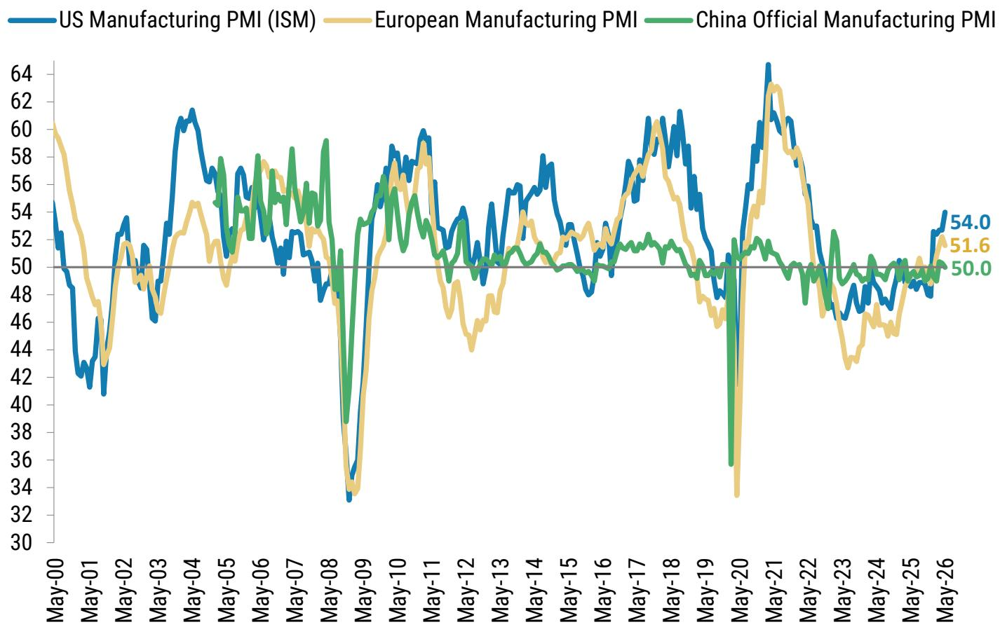

European IP is already at depressed levels. Part of this is structural, but we think it is less clear that current events result in another material leg down.

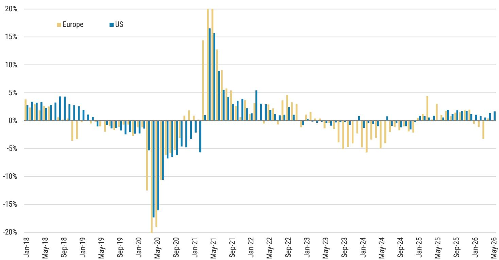

## EU Construction. Residential is coming off a sharp downturn, and Europe is structurally underbuilding houses. However, slower rate cuts in Europe will slow the recovery

EU Industrial production index vs EU Construction indicator. No European Industrial production growth in the last 15 years, but less depressed than EU residential permits.

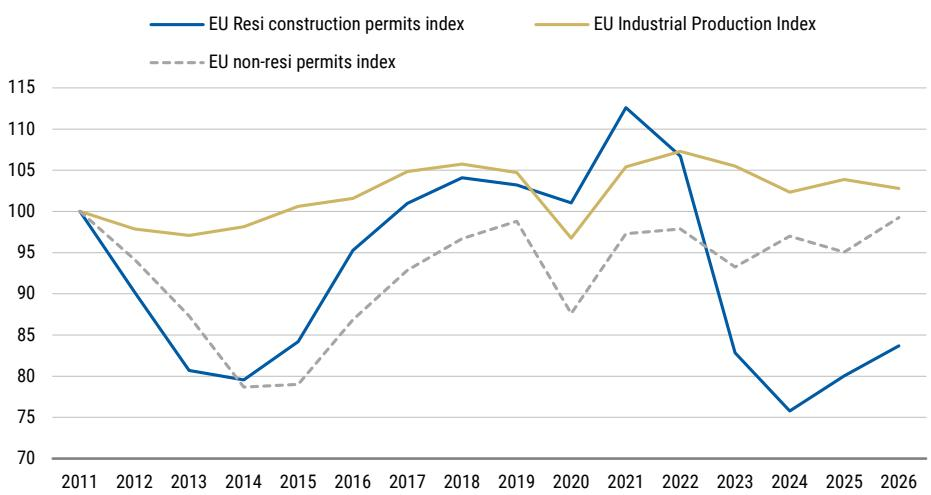  
EU Residential housing completions, versus average annual required completions in 2025-30. Europe is under-building in most major EU countries vs actual needs by \~30%.

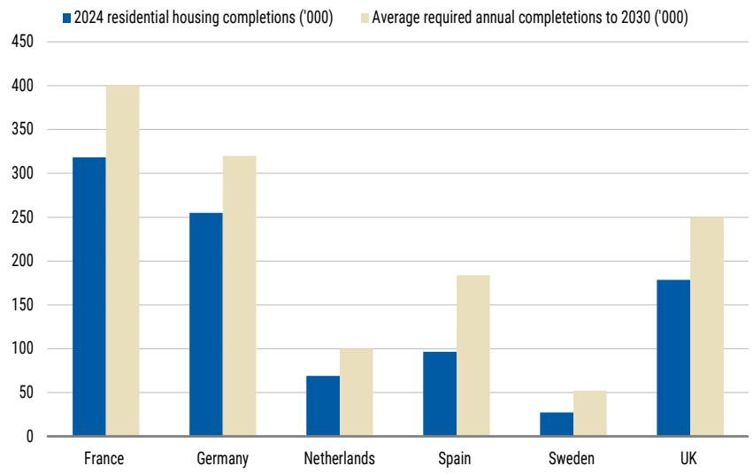

## Structural EU manufacturing headwinds remain. Higher European power prices, US tariffs on European Goods, and Europe losing production share globally.

Average cost of power in Europe vs US. We see this as one of the factors that is disincentivizing investment into European manufacturing capacity. This will remain as a headwind in the mid-term.

Average cost of power (€/MWh)  
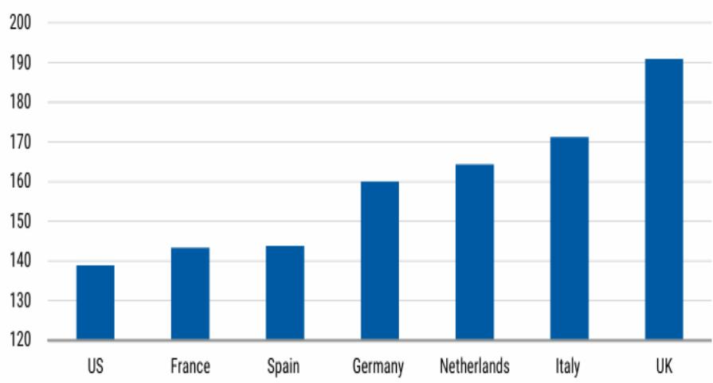  
EU most exported goods to the US. Pharma/ Medicine and Auto are the most exported categories.  
EU most exported good to the United States (Bn euros)


German Fiscal spending. MS estimates point to a 25bps tailwind for 2026 GDP. But the incremental spending in the budget so far is less than expected.


<table><tr><td rowspan="2"></td><td rowspan="2">2024(realized)Core budget</td><td colspan="3">2026 (planned)</td><td rowspan="2">Additionalvs. 2024</td></tr><tr><td>Core budget</td><td>Infra. fund</td><td>Total</td></tr><tr><td>Estimate of additional infra. spending by central gov.(all areas)*</td><td></td><td></td><td></td><td></td><td>17.2</td></tr><tr><td>of whichTransport</td><td>30.5</td><td>13.7</td><td>21.3</td><td>35.0</td><td>4.5</td></tr><tr><td>of which railway</td><td>16.1</td><td>2.6</td><td>16.3</td><td>18.9</td><td>2.8</td></tr><tr><td>of which roads</td><td>9.6</td><td>6.8</td><td>5.0</td><td>11.8</td><td>2.2</td></tr><tr><td>Hospitals</td><td>0.0**</td><td>0.0**</td><td>6.0</td><td>6.0</td><td>6.0</td></tr><tr><td>Digitalisation</td><td>2.7***</td><td>0.5***</td><td>8.5</td><td>8.5</td><td>5.9</td></tr><tr><td>of which broadband</td><td>1.2</td><td>0</td><td>2.3</td><td>2.3</td><td>1.1</td></tr><tr><td>of which other (incl. public admin. and R&amp;D)</td><td>1.5***</td><td>0.5***</td><td>6.2</td><td>6.2</td><td>4.7</td></tr></table>

## German €500bn fiscal plan. €50bn pa compares to €216bn German non-resi and civil engineering spend. We expect a balanced split for spending

Annual spend in Germany across various end markets. This puts the potential €50bn per year German fiscal plan spend into context.

  
Potential split of the German spending plan by end market (based on a German public policy paper). Decarbonisation includes building renovation, grid and renewables.


## US: The k-shaped economy also affects industrials. US residential construction remains weak, while consumer confidence has taken another step back.

US residential construction. A weak year so far, with permitting and new starts remaining subdued.

  
University of Michigan Consumer expectations. This took another step down in March, suggesting continued pressure for the US consumer.  
University of Michigan: Consumer Expectations (NSA, Q1-66=100)


## Inventory levels. Not a major cause for concern. Still about long-run trend levels, but US inventory levels moderated in 3Q and 4Q.


US Industrial. US durable goods orders accelerated in March. US Manufacturing investment has plateaued since 2000. But we expect a re-acceleration in 2026-30.

US Durable goods orders (Cap Goods ex aero) grew at 9.5% in March, and accelerated from 6% in Feb

  
US manufacturing investment (\$bn). Investment has slowed significantly post 2000. Incremental investments are now going into the US.


# US Reshoring. Projects are being announced, but these have been slow to work through to company revenues. ROW FDI in US slowed after a 2022-23 pick-up

Annual Eaton Mega-project announcements tracked by Eaton. These have continued to rise, but we think more recently this has been limited to data centers, while some projects in clean energy have been cancelled.


Foreign direct investment in the US. This moderated in 2023-24, after an initial wave of Auto, Battery and semis investments. Tariffs have created uncertainty, and delayed investment plans.


## China: Automation data in China has been solid. Battery investment remains the stand-out Automation end market in China.

Machine tool orders into China. Still growing strongly in April at +57% YOY.

  
China Automation trends by end market. Battery stands out as having inflected positively in 1Q26.


## China. Top-down data (eg FAI) has weakened recently, but overall, we continue to think China Industrial is in much better shape than construction.

China Fixed Asset investment YOY growth. China FAI weakened materially in May 2026 and remains well below historic levels

  
China housing starts. These are down c.20% in the first 3 mths of 2026. We expect continued weakness.


## Order volumes (or sales) vs 2019 levels after excluding price. Schneider's sales have grown at a $5\%$ volume CAGR since 2019. Legrand and Rexel sales have lagged.


Mechanicals. Order volumes (ex price) in Marine names have seen a bigger uptick than any other end market. Short-cycle volumes are much more depressed.


## Sector Margin and Balance Sheets

Cap Goods EBITA margins. These have continued to move higher with inflation. However, pricing is resilient, and cost inflation is in check.

EBITA margins vs Cap Goods PPI inflation. Cap Goods margins have moved higher in inflation. More recently this has been driven by electrification, while the Cap Goods margin excluding inflation has actually been moving lower in the last three quarters.


## End Market EBIT Margins. Total sector margins are up, but end markets have diverged. Automation has recovered, and Electrification has corrected.

Cap Goods EBITA margins. Consensus is currently forecasting +81bps of margin expansion for 2026.

Company 2025 EBITA margins vs 2019 levels. We like a mix of companies. Siemens Energy, where margins can go higher, but also KBX and Atlas, which are below 2019.

Cap Goods 2025 margins compared with 2019. Companies on the left of the chart have seen a significant margin step-up versus 2019 levels. Interestingly, this is not ‘just’ Electrification names. GEA, Metso and Rexel have improved efficiency.


## Cap Goods pricing has surprised positively, even as inflation has moderated. PPI trends remain encouraging, suggesting room for more margin expansion in 2026.

Producer price inflation for the main electrical equipment categories is still positive. Our channel checks also do not point to lead times going back to normal in medium and high voltage products.


Raw materials. The input cost environment remains relatively benign, with the major raw material being steel where cost increases are manageable.


## Breakdown of Cap Goods company cost inflation. We see c.4% cost inflation for Cap Goods companies in 2026, which can be offset by price.

Approximate cost split for a Cap Goods company. Here we are expecting another relatively benign year of cost inflation of 4% for Cap Goods companies. We believe this can again be offset with price.

<table><tr><td></td><td>% of sales</td><td>2025</td><td>2026e</td></tr><tr><td>Raw materials</td><td>6%</td><td>2%</td><td>27%</td></tr><tr><td>Components</td><td>30%</td><td>3.0%</td><td>3.5%</td></tr><tr><td>Wages</td><td>25%</td><td>2.9%</td><td>3.5%</td></tr><tr><td>Freight</td><td>5%</td><td>8.2%</td><td>6.0%</td></tr><tr><td>D&amp;A</td><td>3%</td><td>3.0%</td><td>3.0%</td></tr><tr><td>Other costs</td><td>13%</td><td>2.5%</td><td>3.0%</td></tr><tr><td>Electricity</td><td>1%</td><td>-0.1%</td><td>25.0%</td></tr><tr><td>Cap Goods Annual cost inflation</td><td>82%</td><td>2.5%</td><td>4.4%</td></tr></table>

Manufacturing wages. These are currently increasing by $\sim 4.4\%$ YOY, and are at $\sim$ 37 per hour in the US. European wage inflation closer to $3.5\%$ .


## Breakdown of Electrical equipment (Schneider) raw materials exposure. We think this alone will require a $\sim 2\%$ price increase YOY in 2026, on top of other inflation.

Schneider Raw materials cost split (total raw materials costs are \~8% of sales). Silver prices and plastics have increased significantly

## MSe Schneider's Raw Material Costs


Raw materials cost increases (at spot) for 2026. Plastics and Silver stand-out, which is more of a headwind for Electrical equipment companies.

Raw Material Average Cost Increase  


## Cap Goods tariffs impact. This has been uneven across the sector, but impacted names like Schneider, Atlas and Epiroc. Others (eg ABB) are more local-for-local

Tariffs impact (gross unless stated) on EBIT margins in 2025. We saw bigger impacts for Schneider and Legrand. In Mechanicals, Atlas and Epiroc also highlighted a negative impact

■ 2025 Tariffs impact on profit margins  


ABB's production. ABB has relatively limited impact and highlighted that their production was relatively local for local, and with limited imports into the US from Asia (eg China).


Balance sheets are relatively strong across the sector. Atlas, Legrand and Halma are best positioned to continue to create value through M&A, given their track record.


## Electricals. Legrand in particular has stepped up M&A, at attractive valuations. Siemens' ROCE has now fallen, after two large software deals.

M&A contribution to sales growth for ABB, Legrand and Rexel. Legrand stands out as accelerating M&A in 2024 and 2025.

  
Siemens' ROCE has come under pressure from recent software deals. We see more capacity for larger M&A at ABB, than Schneider, in 2026.


## Mechanicals acquisitions. Alfa Laval has proved to be an efficient acquirer, as it has also improved its ROCE. Epiroc's ROCE has seen the biggest decline.

M&A contribution to sales growth for Alfa, Atlas, Sandvik and Epiroc. Atlas has been relatively consistent, while we think the bulk of M&A is now behind us for Sandvik and Epiroc.

  
Return on capital employed for Alfa, Atlas, Sandvik and Epiroc. We have seen the most significant decline in Epiroc's ROCE, while Alfa Laval is the only company that has continued to improve its ROCE.


## End-market data

Automation: Key vendor Sales growth now positive. More of a gradual recovery with Rockwell guiding to 2-6% organic growth for 2026.

Organic growth for Automation players is now positive  
  
Siemen DI sales growth indexed. China not so depressed


<table><tr><td></td><td>FY26vs. FY25</td><td>Assumptions atGuidance Midpoint</td></tr><tr><td></td><td>Up mid single digits</td><td>Automotive up mid single digitsSemiconductor flate-Commerce &amp; Warehouse Automation up ~10%</td></tr><tr><td></td><td>Up mid single digits</td><td>Food &amp; Beverage up mid single digitsLife Sciences up mid single digitsTire up low single digits</td></tr><tr><td></td><td>Up low single digits</td><td>Energy up low single digitsMining up low single digitsChemicals up low single digits</td></tr></table>

## Automation. Current orders / sales in Discrete are below ‘trend’. Given Siemens’ regional exposure (EU + China), we do not forecast a snap-back in demand

Siemens Automation hardware orders and sales versus ‘trend’ growth. Trend ‘growth’ is based on 3% volume growth +10% cumulative price since 2019. A ‘normalisation’ in selling could result in a 25% uplift for Siemens PLC hardware sales by 2027 vs 2025


Siemens Omron Mitsubishi Inovance\* Rockwell Automation Keyence Schneider Others

Siemens Inovance Mitsubishi Wuxi Xinjie Delta Electronics Omron Others

## China competition in Automation. Primarily in domestic China for now, but companies like Inovance might increasingly look overseas


China Automation - Large PLC Market Share  


Inovance Industrial Automation order growth  


China Small PLC Sales Growth, %YoY  


## Automotive : A slow production recovery in Europe in 2026e

Light Vehicle Production – Europe down -0.5%/ in 2026e and up +1.9% in 2027e, vs +2% in 2025

  
Used Car Prices – up 1.8% YoY in April

Auto Capex – Risk of further capex reductions given pressure on Auto OEM EBIT margins  


  
Source: Haver, IHS. Datastream, MS estimates (e)

Capex for Key OEMs: Europe Auto capex spending is set to be weaker than US and China in 2026  


Chemicals and Pharma: Chemicals capex (-8%) following volumes lower. Pharma spending diverging. Weaker for GLP-1 companies, but Biopharma still growing.

Chemicals capex tracker. This declined by -5% in 2025, and we expect an accelerated decline in 2026 of -8%.  


EU Chemicals sales volumes vs Cap Goods short-cycle volumes. Weaker volumes = weaker capex  
  
Global Pharma capex. Overall rising by 1.8% in 2026e. Growth relatively lower after a strong 2024-25 driven by GLP-1 co's, .


Spirax's bio-pharma order and sales growth is still under-shooting 'real demand' after a period of destock  


## European and US Resi Construction – European permitting is starting a recovery as US resi starts weaken. US remodelling still growing.

Germany and France permits remain in positive territory

US Housing starts rose -2% YOY in Apr'26  


US remodelling activity. \~+2% growth forecast for 2026  
  
Source: Haver, Datastream, MS

US Non-residential construction forecasts. MS forecasts a broadly stable market in 2026, followed by a +4% recovery in 2027.

US Non-Residential Construction (\$M)  


US Non-resi construction. Growth has been limited to a few sub-segments. Office construction at trough, but ABI suggests too early to talk about an office recovery.

US non-resi construction (SAAR \$m). Now slightly positive.  


Mar'26 ABI billings data is still slightly below 50 (49.8 currently).  


US non-resi construction volumes (ex manufacturing, DC and inflation) are slightly down vs 2019.  
Value of US non-resi put in place spend (\$bn): 2025 vs 2019  
  
US office (sq ft) under construction is now 16.4m. This is -87% vs 1Q20 levels. Vacancy rates slightly lower at 18%.

  
Source: Haver, Datastream, CBRE, MS

## China Property: -20% YTD 2026, and elevated inventory points to further declines.

China new construction starts. -20% YTD 2026.

  
China GFA inventory. Running at >30 months of inventory versus 15 months historically.


## Data Center. Installed capacity to grow 6x in 2030 vs 2023. Annual additions (GW) to grow 40% in 2026-27, before slowing to 13% in 2028-30.

MS forecasts for installed data center capacity by region (MW): In these forecasts, the US is set to remain the largest and fastest-growing region in the 2025-30 period.

MS 2030e Global DC Capacity (GW)  


Data Center annual additions (MS forecasts). This implies 23% CAGR from 2025-30 in annual capacity additions, but with faster average annual growth in 2026-27e (40%), before a deceleration in 2028-30 (13%).


## Data Center. MS forecasts are for 79% hyperscaler capex growth. Hyperscaler capital intensity looks elevated. Capex can still grow with revenues in 2027e, in our view.

Cloud Providers' Capex Expectations – 2025 indicated at +72%, before reaching 79% in 2026, and decelerating to 39% in 2027

  
Hyperscaler Capex to sales, from a historical perspective. This are 25%, which is elevated, but not yet at Telecom dot-com levels


# Data center equipment suppliers. 25% of Schneider and Legrand revenues.


<table><tr><td></td><td>Product Exposure</td><td>$/MW</td></tr><tr><td>Legrand</td><td>80% White-space + 20% Grey-space</td><td>2 - 3 mn</td></tr><tr><td>Vertiv</td><td>~40% White-space + ~60% Grey-space</td><td>3.25 - 3.75mn</td></tr><tr><td>Eaton</td><td>80% grey-space + 20% white-space</td><td>1.7 - 2.9mn(or 1.2 - 2.4mn ex.BOYD)</td></tr><tr><td>Schneider</td><td>75% grey-space +25% white-space</td><td>1.2-3.3mn</td></tr></table>

<table><tr><td colspan="2"></td><td>Vertiv</td><td>Eaton</td><td>Schneider</td><td>ABB</td><td>Siemens</td><td>Legrand</td></tr><tr><td rowspan="2">Rack</td><td>Racks/Enclosure</td><td>√</td><td>√</td><td>√</td><td>X</td><td>X</td><td>√</td></tr><tr><td>Integrated Racks</td><td>√</td><td>√</td><td>√</td><td>X</td><td>X</td><td>√</td></tr><tr><td rowspan="7">Power</td><td>In-rack PDU</td><td>√</td><td>√</td><td>√</td><td>√</td><td>√</td><td>√</td></tr><tr><td>UPS</td><td>√</td><td>√</td><td>√</td><td>√</td><td>X</td><td>√</td></tr><tr><td>MV - UPS</td><td>X</td><td>X</td><td>X</td><td>X</td><td>√</td><td>X</td></tr><tr><td>Busway</td><td>√</td><td>√</td><td>√</td><td>√</td><td>√</td><td>√</td></tr><tr><td>LV Switchboard &amp; Panelboard</td><td>√</td><td>√</td><td>√</td><td>√</td><td>√</td><td>√</td></tr><tr><td>MV Switchgear &amp; Switchgear</td><td>√</td><td>√</td><td>√</td><td>√</td><td>√</td><td>X</td></tr><tr><td>Energy Storage</td><td>X</td><td>√</td><td>√</td><td>√</td><td>X</td><td>X</td></tr><tr><td rowspan="9">Cooling</td><td>Air Cooling</td><td></td><td></td><td></td><td></td><td></td><td></td></tr><tr><td>Room</td><td>√</td><td>√</td><td>√</td><td>X</td><td>X</td><td>X</td></tr><tr><td>Row</td><td>√</td><td>√</td><td>√</td><td>X</td><td>X</td><td>√</td></tr><tr><td>Rack (Rear Door Cooling)</td><td>√</td><td>√</td><td>√</td><td>X</td><td>X</td><td>√</td></tr><tr><td>Liquid Cooling</td><td></td><td></td><td></td><td></td><td></td><td></td></tr><tr><td>Direct to Chip - cold plate</td><td>Cooltera (M&amp;A)</td><td>√</td><td>√</td><td>X</td><td>X</td><td>X</td></tr><tr><td>Immersive</td><td>X</td><td>X</td><td>X</td><td>X</td><td>X</td><td>X</td></tr><tr><td>Liquid Cooling Support</td><td></td><td></td><td></td><td></td><td></td><td></td></tr><tr><td>CDU (Coolant Distribution Unit)</td><td>√</td><td>√</td><td>√</td><td>X</td><td>X</td><td>√</td></tr><tr><td>DCIM</td><td>DCIM Software</td><td>√</td><td>√</td><td>√</td><td>X</td><td>√</td><td>X</td></tr></table>

## Data center themes. Liquid cooling gaining share, and EMEA growth has lagged.

Liquid cooling will have a growing share of the overall market, and we estimate 50%+ growth pa, out to 2028.

## Cooling remains a significant cost within the overall data center (c20%).

Data Center Cooling Market Size  


## 30% Building Shell & Core

\- Building Shell (including roof)
- Raised Floor
- Lobby/Entrance
- Shipping/Receiving Area

## Electrical Systems

\- Generator
- Batteries
- Power Distribution Unit
- Uninterrupted Power Supply

## HVAC/Mechanical System

• Computer Room Air Conditioner (CRAC)

\- Energy Efficient DSE

## 15% Colocation Fit-out

\- Racks & Cages

• Hot and Cold Containment System

Vertiv organic sales growth %  


Data center 800v DC. We estimate this will be 20-30% of installations by 2030. Key equipment suppliers continue to reposition their portfolios for this change.

<table><tr><td>Oct, 2025</td><td>NVIDIA partners for 800 HVDC / MGX rack architecture</td></tr><tr><td>Silicon providers</td><td>Analog Devices, Inc. (ADI), AOS, EPC, Infineon, Innoscience, MPS, Navitas, onsemi, Power Integrations, Renesas, Richtek, ROHM, STMicroelectronics and Texas Instruments</td></tr><tr><td>Power system component providers</td><td>BizLink, Delta, Flex, GE Vernova, Lead Wealth, LITEON and Megmeet</td></tr><tr><td>Data centre power system providers</td><td>ABB, Eaton, GE Vernova, Heron Power, Hitachi Energy, Mitsubishi Electric, Schneider Electric, Siemens and Vertiv</td></tr></table>

Evolving Data center design. 800v DC is becoming more topical, with solid state transformers becoming a key product in the sidecar. The top design is existing architecture, while the lower design is the 800v DC design.


## Food, Beverage and Dairy investment. No growth in 2026, with longer-term consumption trends unsupportive for future investments.

Another flat year in 2026 for Food and Beverage capex  
  
Dairy prices have also started to soften since mid-2025


GEA organic revenue growth vs food and beverage capex.  


Processed and Fresh dairy consumption are not expected to grow (per capita) in developed countries while populations are also not growing.  


## Grid investment. Spending growing at 6% in 2026e, with growth plateauing later in the decade. Grid order trends, and spending beyond 2030e is a debate

European Transmission and Distribution Networks Capex. 2025/2030 forecasts are up 22/25% vs one-year ago.

  
US Utilities capex growing at 6% in 2026e, before decelerating to 5% in 2027.


## Grid investment. Cycle duration. Europe spend is at risk of peaking in 2030, based on TSO spending forecasts, while US spending needs to continue, given grid age.

TenneT (German TSO) capex investments. These significantly increase in 2023-29, before declining by \~25% in 2030-34.

  
US miles of transmission lines added in 2009-18 and grid equipment reaching end of useful life in 2030-39. The US needs c2x replaced in 2030-39, vs what was installed in 2009-18.

  
Miles of line added per Federal Energy Regulatory Commission Form 1
Miles of line reaching end of useful life

## Grid equipment supply demand. Cables supply demand is potentially becoming more balanced in 2030. US has to import large power transformers, but global capacity is also increasing.

Demand for HV cables is higher than supply for now. But this is likely to become more balanced towards the end of the decade.  


US Transformer supply gap. The demand for US transformers is set to rise from around 900 units to 1,500 units, and domestic supply is well below this level  


## Marine: Weakness in ship orders will filter through to 2026 orders for Alfa / Wartsila.

New ship orders are 28% lower YOY in 2025 vs 2024. This follows four strong years in 2021-24.

  
Marine freight rates. Tankers had a recent spike due to disruption to the fleet (sanctions), but have started to decelerate in May

  
MS new ship order forecasts. We are less optimistic on a 2026 recovery.

  
Containership supply is outgrowing demand, which may limit new orders.


## Mining. Long-term copper capex tailwinds, but new project approvals take time. Gold capex is the relative bright spot for 2026.

MS Global Mining Capex Tracker (bottom-up): Slightly up YOY in 2026

  
Gold Capex is forecast at +28% growth YOY in 2026e

  
Copper project sanctioning. A better year for greenfield / brownfield sanctioning in 2025, but bigger projects more in 2027-28.  
Copper mine project sanctioning

  
Source: WoodMac, FactSet, Visible Alpha, Datastream, MS estimates (e)  
Copper supply vs. demand. 8m tonnes of new copper supply needed by 2035 (\$210m of cumulative copper capex needs). This implies copper capex will grow at a 10% 2025-35 CAGR.


Mining. Aging fleet, and strong commodity prices will continue to drive replacement spending on equipment, and aftermarket growth.

Sandvik Mining orders vs commodity prices. Supportive backdrop and upside risk on mining equipment orders.

  
Commodity exposure across the mining equipment. Prefer Gold for 2026

Sandvik Mining vs Epiroc orders. Market share gains  


Average age of fleet at Epiroc. Aging fleet that needs continued replacement spend  


## Power Gen: 2025 an exceptional year. 2026 to be better but likely the peak.


Regional Gas Turbine Orders. US driving recent strength  
  
Gas turbine capacity build. Heading towards balanced supply demand

Total Gas turbine + Primary engine + Fuel cell Supply (GW)  
  
Market shares. GEV's share of orders from US is higher than ENR


## Oil & Gas. Spending holding up, with Refinery capex forecast to grow +6% in 2026.

Oil & Gas Capex – LSD capex growth YoY in 2026e  
  
Refinery margins are currently relatively strong, which helps the backdrop for downstream spending

  
O&G capex has historically moved with the oil price. Oil prices have been volatile, particularly in early 2026


LNG capex set to decline in 2026e overall. Regasification spending expected to re-accelerate with projects being completed  


## Semi-conductors. Capex +61% YOY in 2026, driven by an inflection in memory spend.

Semis capex +61% YOY in 2026, after +9% in 2025.


Memory pricing has taken a significant step-up due to supply demand tightness.  


Atlas Vacuum sales growth vs semis capex. Atlas had a softer year in 2025, impacted by Intel and Industrial vacuum.  


Atlas EV/EBIT vs ASML. Valuations look consistent.  


  
On-shore wind additions. Europe growing at a 8% 2025-30 CAGR, while US peaks in 2027, driven by the timing of IRA credit expiries.

Wind turbines: Europe onshore continuing to grow. US peaks in 2027. The next wave of offshore tenders in Europe (UK, Germany) will be key.

  
Offshore wind installations. Visibility on demand has reduced with upcoming UK tenders key to understand future demand.

  
Vestas onshore wind additions have lagged the broader EU market, pointing to some share loss.

  
Combined, there are auctions for \~30GW across 2025-26. This is supportive for installations to grow to >10GW later this decade.  
Upcoming auctions and tenders $^{1}$

  
2025
CfD AR7

  
2025 / 2026
Korean Tender
1,000-1,500 MW $^{2}$

  
2025
Polish tender
4,000 MW

  
2025 ORESS 2.1 900 MW

  
2026
Dutch tender
2,000 MW

  
2026
Danish tender
2,000 MW

  
2026 Taiwan tender \~3,000 MW

  
2026
Belgian tender
700 MW

  
2026
Australian tender
2,000 MW  
2026
CfD AR8

  
2026
German tender
3,500MW $^{1}$

## Wind turbines: Onshore wind will play a role in the overall power mix, but stocks like Vestas are already priced for a significant recovery in profitability, we think.

Wind turbine producer margins. Current consensus assumes Vestas margins return to 9% in 2027.

  
Vestas EV/Sales is already pricing in a return to $>10\%$ EBIT margins, which we think will take time.


## Company slides

## Schneider Electric – Overweight, PT €300

Schneider EM has lagged in EBITA margin expansion in 2025, but we expect productivity savings, recovery in buildings and automation, SAAS transition to deliver margin expansion in 26-27.

Organic Revenue Growth  
  
Average organic growth. We see Schneider's organic revenues growing +10.6% in 2026, in-line with ABB, but ahead of the sector.


Schneider net price. Even in times of sharp raw mats inflation (eg 2021), Schneider has kept net price positive.  
  
Schneider's valuation no longer looks expensive versus EU DC exposed peers (e.g. Legrand), and still looks undemanding compared to US peers


## Epiroc – Overweight, PT SEK 300

We switched our preference to Epiroc over Sandvik (EW). Epiroc's valuation premium over Sandvik is back near all-time lows.  


While Sandvik's total order growth has outperformed peers, it now has tough comps for 2026, while we expect Epiroc's acceleration into year-end to continue.  


Quarterly margins. Epiroc and Sandvik Mining and Rock margins have largely converged...  


... and we note that the commodity price backdrop points to upside risks to our order forecasts.  
  
Source: Company Data, Datastream, MS estimates (e).

Industrial capex > production. A case for selective broadening out June 25th, 2026

## Atlas Copco – Overweight, PT SEK 200

Atlas group consensus EBIT. We believe Atlas consensus estimates are now in a better place, allowing a platform for a re-rating.


Atlas orders vs VAT. Scope for an acceleration in 1Q26.  


Atlas Copco Book: bill versus share price.  


Atlas Copco EV/EBIT vs Mechanicals. Valuation looks undemanding versus its recent history.  


Industrial capex > production. A case for selective broadening out June 25th, 2026

## Legrand – Overweight, PT €166

Legrand 2026 scenarios. Our bull case scenario for Legrand is €185 per share. Here, Legrand would grow 12.5% and margins would reach 21.5%.  


European Construction permits are recovering, which is encouraging for Legrand's European organic growth into 2026.  
  
Legrand multiples paid for M&A (EV/Sales). Legrand has a track record of acquiring at attractive multiples, but these have stepped up as they have pushed more into data centers.


Legrand's valuation no longer screens as demanding versus Schneider.  


## Siemens Energy: Overweight, PT €200

Siemens Energy slot reservations. We see orders for Gas services growing 12% in 2026e.

  
Gas turbine annual demand. We see demand sustaining broadly at 2025 levels, underpinned by replacements into the 2030s.

  
Siemens Energy – Executing ahead of peers on grid margins.

  
Siemens Energy – EV/EBITDA: Looks attractive relative to peer GE Vernova and also other European names.


## Rexel – Overweight, PT €42

Rexel volume growth by region. Rexel's volumes are only slightly above 2009, which gives room for a recovery.

  
Rexel end market exposure. Rexel has some exposure to Industrial (26%) and should benefit if the US ISM starts improving.


We see multiple levers for Rexel to get to its $>7\%$ margin target, which include the UK / Germany turn-around, and AI driven productivity.  
  
We think current valuation is undemanding if Rexel can get to the mid-term target of $>7\%$ margins.


Industrial capex > production. A case for selective broadening out June 25th, 2026

## Knorr Bremse – Overweight, PT €116

EBIT margin expansion since 2023. CVS improved despite two negative years of growth.

Knorr Bremse Operating EBIT margin (2023-2025)  
  
US Truck orders are volatile but 3mths SAAR is showing signs of stabilizing. We think CVS estimates have bottomed.  
Revenue per employee has continued to increase, outlining that KBX is becoming a more efficient company.


  
Knorr EV/EBIT vs the sector. We think KBX can return to a premium versus the sector.  
Knorr Bremse EV/EBIT Relative to CapGoods Sector


Industrial capex > production. A case for selective broadening out June 25th, 2026

## Spirax Group – Overweight, PT £8.5

Spirax Group End Market Exposure. We like Spirax's exposure to structurally growing end markets like Biopharma and Semis.

\- Food & Beverage
- Pharma & Biotech
- OEM Machinery
- Oil & Gas
- Chemicals
- Power Generation
- Healthcare
- Semiconductor
- Water & Wastewater
- Buildings
- Mining & Precious Metal Processing
- Transport
- Other

  
Biopharm book-to-bill ratio back >1x. Key to the Watson Marlow recovery.  
Biopharm ■ Orders — Sales

  
Spirax's EBIT margins remain well above sector average, and we expect them to return to the 22-23% range by 2027.

  
Spirax EV/EBIT relative to sector has de-rated versus the sector and is back to attractive levels, given we think consensus has now stabilised.  
Spirax EV/EBIT Relative to CapGoods Sector


## Siemens – Equal-weight, PT €260

Siemens Digital Industries margins in hardware and software. We think software can reach mid-20s at least in 2027.  
  
Siemens software peer margins. We maintain ‘high 20’s’ should be a realistic margin ambition for Siemens DI software over time.


Siemens: Clear improvement in free-cash-flow margins – closed the gap with ABB.  


Siemens EV/EBIT vs its weighted average peer group multiple (based on its peer SOTP).  


## GEA – Equal-weight, PT €60

GEA End market exposure (12mths rolling sales). We see no growth in Food and Beverage capex, Chemicals and Pharma declining, which will be headwinds for GEA's 2026 orders.


GEA's share price vs the FAO Dairy Price indicator. Dairy pricing has started to soften, due to high production rates.  
  
GEA organic growth index across Equipment and Services. GEA has struggled to grow its new equipment business. Services then cannot sustain recent growth rates into 2026-28.


2026e Dairy Capex (\$M) is set to be weak, driven by lower capex at Nestle – consensus expects a return to growth in 2027 and 2028.  


Industrial capex > production. A case for selective broadening out June 25th, 2026

## Wartsila – Underweight, PT €29

Marine Retrofits and upgrades revenues and orders. This is now 17% of Marine aftermarket revenues, and a €139m gap has opened up between orders and sales


Price per MW increase or decrease in 2025. Wartsila has not seen the same uplift in 2025 as others.  
  
Wartsila's $93\%$ share price increase has led to a significant re-rating, given 2027 consensus EBITA has only increased by $11\%$ in that time.  
Share price move (since 1-Jan 2025) 2027 EBITA Revision (since 1-Jan '25) Re-rating / De-rating

  
We see valuation at demanding levels compared to companies like Siemens Energy.

## Signify – Underweight, PT €15

Signify Price cost impact on EBIT. Price cost remains a significant drag on margins, which we expect to continue in 2026.


Lighting producer price inflation (Europe). Price increases have flattened out in aggregate but are negative for Signify.  


Signify organic revenue growth vs peer Acuity. Signify has lagged, and we do not expect a 2026 inflexion.  
YoY Organic Revenue Growth  


Signify EV/EBIT vs Electricals. Signify has been trading at a 40-60% discount to Electricals in 2024-26. There is currently a 54% discount.  


## Kone – Underweight, PT €46.6

We don't expect the E&E New Equipment market to bottom before 2027, at the earliest.  


Even after bottoming, China should remain the key driver for the E&E New Equipment market.  


Big 4 OEMs have steadily lost market share against independent service providers over the last two decades.  
  
Source: Company Data, Datastream, Otis, TKE, Schindler, MS estimates (e)

Kone trades at its historical median 1-year forward EV/EBIT.  


## Appendix: Long-term Industrial production and PMI trends

## Hard Data: Industrial Production – Different regions, different cycles.

Global Industrial Production – Global growth is hovering around 1%  


US Industrial Production +1.7% in May'26  


European Industrial Production: 0.3% in Apr'26  


China Industrial Production – Slower growth in each new cycle  


Long-Term Manufacturing Output: Back towards long-term peaks in the US – stocks relying on pure EU Industrial Production have a weak mid-term outlook.

Europe – still slightly below 2007 levels  


US – still slightly below 2018 levels  


Global PMI – Excluding crisis moments, closer to a trough than a peak.  


  
Source: Haver, Datastream, MS


## "PMI Classic": The PMI playbook.

Classic PMI Playbook: Duration – the ISM spends \~9.0 months below 50-threshold  


Classic PMI Playbook: Trough level – the average trough is \~42.2  


Classic PMI Playbook: Time to trough – average is \~5.4 months after falling below 50  


Classic PMI Playbook: Capital Goods – sector trough compared with ISM – 0.8 months before  


US ISM: Coming off the back of a long but shallow ISM down-cycle.  


## MS

## Disclosure section (cont.)

The information and opinions in MS were prepared or are disseminated by MS Europe S.E., regulated by Bundesanstalt fuer Finanzdienstleistungsaufsicht (BaFin) and/or MS & Co. International plc, authorized by the Prudential Regulation Authority and regulated by the Financial Conduct Authority and the Prudential Regulation Authority. MS & Co. International plc disseminates in the UK research that it has prepared, and which has been prepared by any of its affiliates, only to persons who (i) are professionals falling within Article 19(5) of the Financial Services and Markets Act 2000 (Financial Promotion) Order 2005 (as amended, the "Order"); (ii) are persons who are high net worth entities falling within Article 49(2)(a) to (d) of the Order; or (iii) are persons to whom an invitation or inducement to engage in investment activity (within the meaning of section 21 of the Financial Services and Markets Act 2000, as amended) may otherwise lawfully be communicated or caused to be communicated. As used in this disclosure section, MS includes RMB MS Proprietary Limited, MS Europe S.E., MS & Co International plc and its affiliates.

For important disclosures, stock price charts and equity rating histories regarding companies that are the subject of this report, please see the MS Disclosure Website at www.morganstanley.com/eqr/disclosures/webapp/generalresearch, or contact your investment representative or MS at 1585 Broadway, (Attention: Research Management), New York, NY, 10036 USA.

For valuation methodology and risks associated with any recommendation, rating or price target referenced in this research report, please contact the Client Support Team as follows: US/Canada +1 800 303-2495; Hong Kong +852 2848-5999; Latin America +1 718 754-5444 (U.S.); London +44 (0)20-7425-8169; Singapore +65 6834-6860; Sydney +61 (0)2-9770-1505; Tokyo +81 (0)3-6836-9000. Alternatively you may contact your investment representative or MS at 1585 Broadway, (Attention: Research Management), New York, NY 10036 USA.

## Analyst Certification

The following analysts hereby certify that their views about the companies and their securities discussed in this report are accurately expressed and that they have not received and will not receive direct or indirect compensation in exchange for expressing specific recommendations or views in this report: Sara Chemello; Max R Yates.

## Global Research Conflict Management Policy

MS has been published in accordance with our conflict management policy, which is available at www.morganstanley.com/institutional/research/conflictpolicies. A Portuguese version of the policy can be found at www.morganstanley.com.br

## Important Regulatory Disclosures on Subject Companies

As of May 29, 2026, MS beneficially owned 1% or more of a class of common equity securities of the following companies covered in MS: Alstom, Assa Abloy AB, Atlas Copco, Epiroc AB, GEA Group AG, Halma PLC, KION Group AG, Legrand, Prysmian SpA, Rotork PLC, Schindler Holding AG, Schneider Electric, Siemens, Siemens Energy AG, Signify NV, SKF, Spirax Group PLC, Weir Group PLC.

Within the last 12 months, MS managed or co-managed a public offering (or 144A offering) of securities of Schneider Electric.

Within the last 12 months, MS has received compensation for investment banking services from Schneider Electric, Siemens.

## Disclosure section (cont.)

In the next 3 months, MS expects to receive or intends to seek compensation for investment banking services from ABB, Alfa Laval AB, Alstom, Assa Abloy AB, Atlas Copco, Epiroc AB, GEA Group AG, Halma PLC, KION Group AG, Knorr Bremse AG, Kone Oyj, Legrand, Metso Corporation, Prysmian SpA, Rotork PLC, Sandvik, Schindler Holding AG, Schneider Electric, Siemens, Siemens Energy AG, SKF, Spirax Group PLC, Wartsila Oyj Abp, Weir Group PLC.

Within the last 12 months, MS has received compensation for products and services other than investment banking services from ABB, Alstom, KION Group AG, Legrand, Prysmian SpA, Schneider Electric, Siemens, Siemens Energy AG, Signify NV.

Within the last 12 months, MS has provided or is providing investment banking services to, or has an investment banking client relationship with, the following company: ABB, Alfa Laval AB, Alstom, Assa Abloy AB, Atlas Copco, Epiroc AB, GEA Group AG, Halma PLC, KION Group AG, Knorr Bremse AG, Kone Oyj, Legrand, Metso Corporation, Prysmian SpA, Rotork PLC, Sandvik, Schindler Holding AG, Schneider Electric, Siemens, Siemens Energy AG, SKF, Spirax Group PLC, Wartsila Oyj Abp, Weir Group PLC.

Within the last 12 months, MS has either provided or is providing non-investment banking, securities-related services to and/or in the past has entered into an agreement to provide services or has a client relationship with the following company: ABB, Alstom, KION Group AG, Legrand, Prysmian SpA, Schneider Electric, Siemens, Siemens Energy AG, Signify NV.

MS & Co. International plc is a corporate broker to Spirax Group PLC.

The equity research analysts or strategists principally responsible for the preparation of MS have received compensation based upon various factors, including quality of research, investor client feedback, stock picking, competitive factors, firm revenues and overall investment banking revenues. Equity Research analysts' or strategists' compensation is not linked to investment banking or capital markets transactions performed by MS or the profitability or revenues of particular trading desks.

MS and its affiliates do business that relates to companies/instruments covered in MS, including market making, providing liquidity, fund management, commercial banking, extension of credit, investment services and investment banking. MS sells to and buys from customers the securities/instruments of companies covered in MS on a principal basis. MS may have a position in the debt of the Company or instruments discussed in this report. MS trades or may trade as principal in the debt securities (or in related derivatives) that are the subject of the debt research report.

Certain disclosures listed above are also for compliance with applicable regulations in non-US jurisdictions.

## STOCK RATINGS

MS uses a relative rating system using terms such as Overweight, Equal-weight, Not-Rated or Underweight (see definitions below). MS does not assign ratings of Buy, Hold or Sell to the stocks we cover. Overweight, Equal-weight, Not-Rated and Underweight are not the equivalent of buy, hold and sell. Investors should carefully read the definitions of all ratings used in MS. In addition, since MS contains more complete information concerning the analyst's views, investors should carefully read MS, in its entirety, and not infer the contents from the rating alone. In any case, ratings (or research) should not be used or relied upon as investment advice. An investor's decision to buy or sell a stock should depend on individual circumstances (such as the investor's existing holdings) and other considerations.

# Disclosure section (cont.)

Global Stock Ratings Distribution

(as of May 31, 2026)

The Stock Ratings described below apply to MS's Fundamental Equity Research and do not apply to Debt Research produced by the Firm.

For disclosure purposes only (in accordance with FINRA requirements), we include the category headings of Buy, Hold, and Sell alongside our ratings of Overweight, Equal-weight, Not-Rated and Underweight. MS does not assign ratings of Buy, Hold or Sell to the stocks we cover. Overweight, Equal-weight, Not-Rated and Underweight are not the equivalent of buy, hold, and sell but represent recommended relative weightings (see definitions below). To satisfy regulatory requirements, we correspond Overweight, our most positive stock rating, with a buy recommendation; we correspond Equal-weight and Not-Rated to hold and Underweight to sell recommendations, respectively..

<table><tr><td rowspan="2">STOCK RATING CATEGORY</td><td colspan="2">COVERAGE UNIVERSE</td><td colspan="3">INVESTMENT BANKING CLIENTS (IBC)</td><td colspan="2">OTHER MATERIAL INVESTMENT SERVICES CLIENTS (MISC)</td></tr><tr><td>COUNT</td><td>% OF TOTAL</td><td>COUNT</td><td>% OF TOTAL IBC</td><td>% OF RATING CATEGORY</td><td>COUNT</td><td>% OF TOTAL OTHER MISC</td></tr><tr><td>Overweight/Buy</td><td>1542</td><td>42%</td><td>465</td><td>51%</td><td>30%</td><td>707</td><td>43%</td></tr><tr><td>Equal-weight/Hold</td><td>1571</td><td>43%</td><td>369</td><td>40%</td><td>23%</td><td>723</td><td>44%</td></tr><tr><td>Not-Rated/Hold</td><td>3</td><td>0%</td><td>0</td><td>0%</td><td>0%</td><td>1</td><td>0%</td></tr><tr><td>Underweight/Sell</td><td>551</td><td>15%</td><td>86</td><td>9%</td><td>16%</td><td>201</td><td>12%</td></tr><tr><td>TOTAL</td><td>3,667</td><td></td><td>920</td><td></td><td></td><td>1632</td><td></td></tr></table>

Data include common stock and ADRs currently assigned ratings. Investment Banking Clients are companies from whom MS received investment banking compensation in the last 12 months. Due to rounding off of decimals, the percentages provided in the "% of total" column may not add up to exactly 100 percent.

Analyst Stock Ratings

Overweight (O). The stock's total return is expected to exceed the average total return of the analyst's industry (or industry team's) coverage universe, on a risk-adjusted basis, over the next 12-18 months.

Equal-weight (E). The stock's total return is expected to be in line with the average total return of the analyst's industry (or industry team's) coverage universe, on a risk-adjusted basis, over the next 12-18 months.

Not-Rated (NR). Currently the analyst does not have adequate conviction about the stock's total return relative to the average total return of the analyst's industry (or industry team's) coverage universe, on a risk-adjusted basis, over the next 12-18 months.

Underweight (U). The stock's total return is expected to be below the average total return of the analyst's industry (or industry team's) coverage universe, on a risk-adjusted basis, over the next 12-18 months.

Unless otherwise specified, the time frame for price targets included in MS is 12 to 18 months.

## MS

## Disclosure section (cont.)

## Analyst Industry Views

Attractive (A): The analyst expects the performance of his or her industry coverage universe over the next 12-18 months to be attractive vs. the relevant broad market benchmark, as indicated below.

In-Line (I): The analyst expects the performance of his or her industry coverage universe over the next 12-18 months to be in line with the relevant broad market benchmark, as indicated below.

Cautious (C): The analyst views the performance of his or her industry coverage universe over the next 12-18 months with caution vs. the relevant broad market benchmark, as indicated below.

Benchmarks for each region are as follows: North America - S&P 500; Latin America - relevant MSCI country index or MSCI Latin America Index; Europe - MSCI Europe; Japan - TOPIX; Asia - relevant MSCI country index or MSCI sub-regional index or MSCI AC Asia Pacific ex Japan Index.

## Important Disclosures for MS Smith Barney LLC Customers

Important disclosures regarding any material conflict of interest that can reasonably be expected to have influenced MS Smith Barney LLC's choice of a third-party research provider or the subject company of a third-party research report, are available on the MS Wealth Management disclosure website at www.morganstanley.com/online/researchdisclosures. For MS specific disclosures, you may refer to https://www.morganstanley.com/eqr/disclosures/webapp/generalresearch.

Each MS report is reviewed and approved on behalf of MS Smith Barney LLC. This review and approval is conducted by the same person who reviews the research report on behalf of MS. This could create a conflict of interest.

## Other Important Disclosures

MS policy is to update research reports as and when the Research Analyst and Research Management deem appropriate, based on developments with the issuer, the sector, or the market that may have a material impact on the research views or opinions stated therein. In addition, certain Research publications are intended to be updated on a regular periodic basis (weekly/monthly/quarterly/annual) and will ordinarily be updated with that frequency, unless the Research Analyst and Research Management determine that a different publication schedule is appropriate based on current conditions.

MS is not acting as a municipal advisor and the opinions or views contained herein are not intended to be, and do not constitute, advice within the meaning of Section 975 of the Dodd-Frank Wall Street Reform and Consumer Protection Act.

MS produces an equity research product called a "Tactical Idea." Views contained in a "Tactical Idea" on a particular stock may be contrary to the recommendations or views expressed in research on the same stock. This may be the result of differing time horizons, methodologies, market events, or other factors. For all research available on a particular stock, please contact your sales representative or go to Matrix at http://www.morganstanley.com/matrix.

MS is provided to our clients through our proprietary research portal on Matrix and also distributed electronically by MS to clients. Certain, but not all, MS products are also made available to clients through third-party vendors or redistributed to clients through alternate electronic means as a convenience. For access to all available MS, please contact your sales representative or go to Matrix at http://www.morganstanley.com/matrix.

Any access and/or use of MS is subject to MS's Terms of Use (http://www.morganstanley.com/terms.html). By accessing and/or using MS, you are indicating that you have read and agree to be bound by our Terms of Use (http://www.morganstanley.com/terms.html). In addition you consent to MS processing your personal data and using cookies in accordance with our Privacy Policy and our Global Cookies Policy (http://www.morganstanley.com/privacy\_pledge.html), including for the purposes of setting your preferences and to collect readership data so that we can deliver better and more personalized service and products to you. To find out more information about how MS processes personal data, how we use cookies and how to reject cookies see our Privacy Policy and our Global Cookies Policy (http://www.morganstanley.com/privacy\_pledge.html). Please use the provided link to review the Terms and Conditions and Most Important Terms and Conditions for MS India Company Private Limited (https://www.morganstanley.com/assets/pdfs/about-us-global-offices/india/Terms\_and\_conditions.pdf) and the following link to review the audit report (https://ny.matrix.ms.com/eqr/research/webapp/researchdocs/MSICPL\_Morgan\_Stanley\_Research\_Audit\_Report.pdf) If you do not agree to our Terms of Use and/or if you do not wish to provide your consent to MS processing your personal data or using cookies please do not access our research.

## MS

## Disclosure section (cont.)

MS does not provide individually tailored investment advice. MS has been prepared without regard to the circumstances and objectives of those who receive it. MS recommends that investors independently evaluate particular investments and strategies, and encourages investors to seek the advice of a financial adviser. The appropriateness of an investment or strategy will depend on an investor's circumstances and objectives. The securities, instruments, or strategies discussed in MS may not be suitable for all investors, and certain investors may not be eligible to purchase or participate in some or all of them. MS is not an offer to buy or sell or the solicitation of an offer to buy or sell any security/instrument or to participate in any particular trading strategy. The value of and income from your investments may vary because of changes in interest rates, foreign exchange rates, default rates, prepayment rates, securities/instruments prices, market indexes, operational or financial conditions of companies or other factors. There may be time limitations on the exercise of options or other rights in securities/instruments transactions. Past performance is not necessarily a guide to future performance. Estimates of future performance are based on assumptions that may not be realized. If provided, and unless otherwise stated, the closing price on the cover page is that of the primary exchange for the subject company's securities/instruments.

The fixed income research analysts, strategists or economists principally responsible for the preparation of MS have received compensation based upon various factors, including quality, accuracy and value of research, firm profitability or revenues (which include fixed income trading and capital markets profitability or revenues), client feedback and competitive factors. Fixed Income Research analysts', strategists' or economists' compensation is not linked to investment banking or capital markets transactions performed by MS or the profitability or revenues of particular trading desks.

The "Important Regulatory Disclosures on Subject Companies" section in MS lists all companies mentioned where MS owns 1% or more of a class of common equity securities of the companies. For all other companies mentioned in MS, MS may have an investment of less than 1% in securities/instruments or derivatives of securities/instruments of companies and may trade them in ways different from those discussed in MS. Employees of MS not involved in the preparation of MS may have investments in securities/instruments or derivatives of securities/instruments of companies mentioned and may trade them in ways different from those discussed in MS. Derivatives may be issued by MS or associated persons.

With the exception of information regarding MS, MS is based on public information. MS makes every effort to use reliable, comprehensive information, but we make no representation that it is accurate or complete. We have no obligation to tell you when opinions or information in MS change apart from when we intend to discontinue equity research coverage of a subject company. Facts and views presented in MS have not been reviewed by, and may not reflect information known to, professionals in other MS business areas, including investment banking personnel.

MS personnel may participate in company events such as site visits and are generally prohibited from accepting payment by the company of associated expenses unless pre-approved by authorized members of Research management.

MS may make investment decisions that are inconsistent with the recommendations or views in this report.

To our readers based in Taiwan or trading in Taiwan securities/instruments: Information on securities/instruments that trade in Taiwan is distributed by MS Taiwan Limited ("MSTL"). Such information is for your reference only. The reader should independently evaluate the investment risks and is solely responsible for their investment decisions. MS may not be distributed to the public media or quoted or used by the public media without the express written consent of MS. Any non-customer reader within the scope of Article 7-1 of the Taiwan Stock Exchange Recommendation Regulations accessing and/or receiving MS is not permitted to provide MS to any third party (including but not limited to related parties, affiliated companies and any other third parties) or engage in any activities regarding MS which may create or give the appearance of creating a conflict of interest. Information on securities/instruments that do not trade in Taiwan is for informational purposes only and is not to be construed as a recommendation or a solicitation to trade in such securities/instruments. MSTL may not execute transactions for clients in these securities/instruments.

MS is not incorporated under PRC law and the research in relation to this report is conducted outside the PRC. MS does not constitute an offer to sell or the solicitation of an offer to buy any securities in the PRC. PRC investors shall have the relevant qualifications to invest in such securities and shall be responsible for obtaining all relevant approvals, licenses, verifications and/or registrations from the relevant governmental authorities themselves. Neither this report nor any part of it is intended as, or shall constitute, provision of any consultancy or advisory service of securities investment as defined under PRC law. Such information is provided for your reference only.

## MS

## Disclosure section (cont.)

MS is disseminated in Brazil by MS C.T.V.M. S.A. located at Av. Brigadeiro Faria Lima, 3600, 6th floor, São Paulo - SP, Brazil; and is regulated by the Comissão de Valores Mobiliários; in Mexico by MS México, Casa de Bolsa, S.A. de C.V which is regulated by Comision Nacional Bancaria y de Valores. Paseo de los Tamarindos 90, Torre 1, Col. Bosques de las Lomas Floor 29, 05120 Mexico City; in Japan by MS MUFG Securities Co., Ltd. and, for Commodities related research reports only, MS Capital Group Japan Co., Ltd; in Hong Kong by MS Asia Limited (which accepts responsibility for its contents) and by MS Bank Asia Limited; in Singapore by MS Asia (Singapore) Pte. (Registration number 199206298Z) and/or MS Asia (Singapore) Securities Pte Ltd (Registration number 200008434H), regulated by the Monetary Authority of Singapore (which accepts legal responsibility for its contents and should be contacted with respect to any matters arising from, or in connection with, MS) and by MS Bank Asia Limited, Singapore Branch (Registration number T14FC0118J); in Australia to "wholesale clients" within the meaning of the Australian Corporations Act by MS Australia Limited A.B.N. 67 003 734 576, holder of Australian financial services license No. 233742, which accepts responsibility for its contents; in Australia to "wholesale clients" and "retail clients" within the meaning of the Australian Corporations Act by MS Wealth Management Australia Pty Ltd (A.B.N. 19 009 145 555, holder of Australian financial services license No. 240813, which accepts responsibility for its contents; in Korea by MS & Co International plc, Seoul Branch; in India by MS India Company Private Limited having Corporate Identification No (CIN) U22990MH1998PTC115305, regulated by the Securities and Exchange Board of India ("SEBI") and holder of licenses as a Research Analyst (SEBI Registration No. INH000001105); Stock Broker (SEBI Stock Broker Registration No. INZ000244438), Merchant Banker (SEBI Registration No. INM000011203), and depository participant with National Securities Depository Limited (SEBI Registration No. IN-DP-NSDL-567-2021) having registered office at Altimus, Level 39 & 40, Pandurang Budhkar Marg, Worli, Mumbai 400018, India; Telephone no. +91-22-61181000; Compliance Officer Details: Mr. Tejarshi Hardas, Tel. No.: +91-22-61181000 or Email: tejarshi.hardas@morganstanley.com; Grievance officer details: Mr. Tejarshi Hardas, Tel. No.: +91-22-61181000 or Email: msic-compliance@morganstanley.com. MS India Company Private Limited (MSICPL) may use AI tools in providing research services. All recommendations contained herein are made by the duly qualified research analysts; in Canada by MS Canada Limited; in Germany and the European Economic Area where required by MS Europe S.E., authorised and regulated by Bundesanstalt fuer Finanzdienstleistungsaufsicht (BaFin) under the reference number 149169; in the US by MS & Co. LLC, which accepts responsibility for its contents. MS & Co. International plc, authorized by the Prudential Regulation Authority and regulated by the Financial Conduct Authority and the Prudential Regulation Authority, disseminates in the UK research that it has prepared, and research which has been prepared by any of its affiliates, only to persons who (i) are investment professionals falling within Article 19(5) of the Financial Services and Markets Act 2000 (Financial Promotion) Order 2005 (as amended, the "Order"); (ii) are persons who are high net worth entities falling within Article 49(2)(a) to (d) of the Order; or (iii) are persons to whom an invitation or inducement to engage in investment activity (within the meaning of section 21 of the Financial Services and Markets Act 2000, as amended) may otherwise lawfully be communicated or caused to be communicated. RMB MS Proprietary Limited is a member of the JSE Limited and A2X (Pty) Ltd. RMB MS Proprietary Limited is a joint venture owned equally by MS International Holdings Inc. and RMB Investment Advisory (Proprietary) Limited, which is wholly owned by FirstRand Limited. The information in MS is being disseminated by MS Saudi Arabia, regulated by the Capital Market Authority in the Kingdom of Saudi Arabia, and is directed at Sophisticated investors only.

The information in MS is being communicated by MS & Co. International plc (DIFC Branch), regulated by the Dubai Financial Services Authority (the DFSA) or by MS & Co. International plc (ADGM Branch), regulated by the Financial Services Regulatory Authority Abu Dhabi (the FSRA), and is directed at Professional Clients only, as defined by the DFSA or the FSRA, respectively. The financial products or financial services to which this research relates will only be made available to a customer who we are satisfied meets the regulatory criteria of a Professional Client. A distribution of the different MS Research ratings or recommendations, in percentage terms for Investments in each sector covered, is available upon request from your sales representative. The information in MS is being communicated by MS & Co. International plc (QFC Branch), regulated by the Qatar Financial Centre Regulatory Authority (the QFCRA), and is directed at business customers and market counterparties only and is not intended for Retail Customers as defined by the QFCRA. As required by the Capital Markets Board of Turkey, investment information, comments and recommendations stated here, are not within the scope of investment advisory activity. Investment advisory service is provided exclusively to persons based on their risk and income preferences by the authorized firms. Comments and recommendations stated here are general in nature. These opinions may not fit to your financial status, risk and return preferences. For this reason, to make an investment decision by relying solely to this information stated here may not bring about outcomes that fit your expectations. The trademarks and service marks contained in MS are the property of their respective owners. Third-party data providers make no warranties or representations relating to the accuracy, completeness, or timeliness of the data they provide and shall not have liability for any damages relating to such data. The Global Industry Classification Standard (GICS) was developed by and is the exclusive property of MSCI and S&P.

MS, or any portion thereof may not be reprinted, sold or redistributed without the written consent of MS. Indicators and trackers referenced in MS may not be used as, or treated as, a benchmark under Regulation EU 2016/1011, or any other similar framework.

The issuers and/or fixed income products recommended or discussed in certain fixed income research reports may not be continuously followed. Accordingly, investors should regard those fixed income research reports as providing stand-alone analysis and should not expect continuing analysis or additional reports relating to such issuers and/or individual fixed income products.

MS may hold, from time to time, material financial and commercial interests regarding the company subject to the Research report.

Registration granted by SEBI and certification from the National Institute of Securities Markets (NISM) in no way guarantee performance of the intermediary or provide any assurance of returns to investors. Investment in securities market are subject to market risks. Read all the related documents carefully before investing.
KD170626

The Americas

1585 Broadway
New York, NY 10036-8293
United States
+1 212 761 4000

Europe
20 Bank Street, Canary Wharf
London E14 4AD
United Kingdom
+44 (0)20 7425 8000

Japan
1-9-7 Otemachi, Chiyoda-ku
Tokyo 100-8104
Japan
+81 (0) 3 6836 5000

1 Austin Road West
Kowloon
Hong Kong
+852 2848 5200

Asia/Pacific