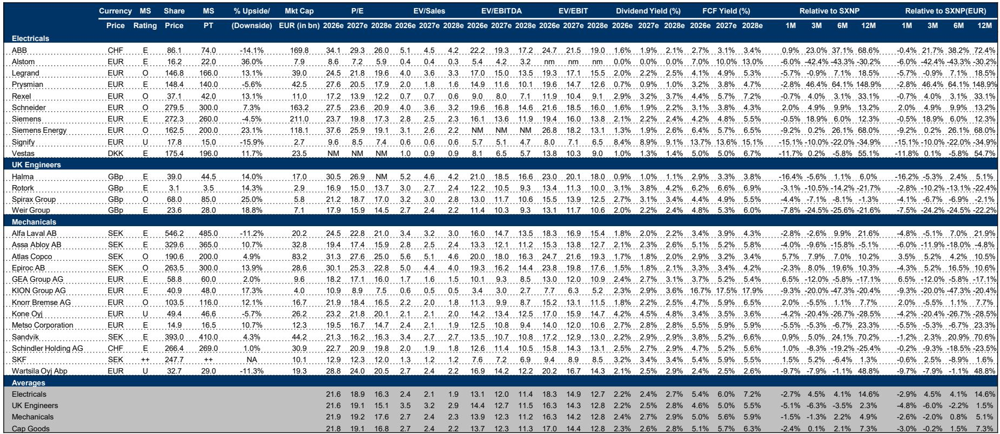
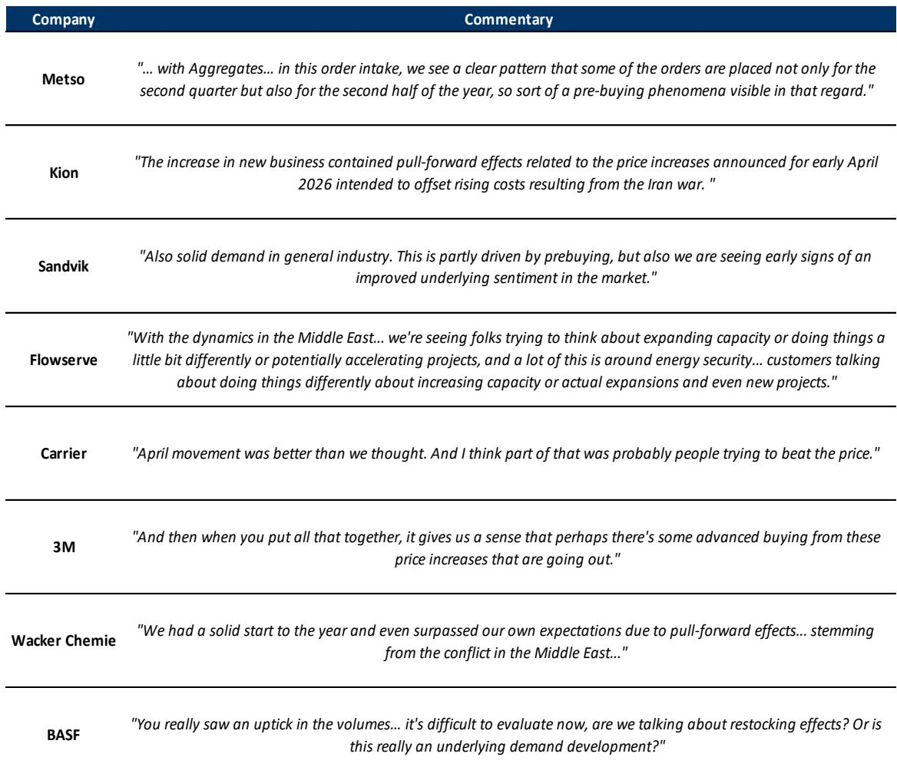
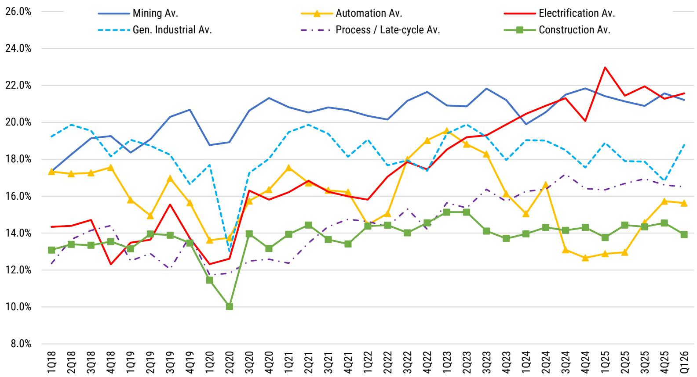

# 摩根斯坦利：MS：工业资本开支比生产更值得关注——一个选择性扩散的时机

工业投资者正站在一个微妙的岔路口。全球宏观经济叙事在过去半年经历了从“衰退恐惧”到“地缘冲突溢价”再到“软着陆预期”的多次翻转，市场对欧洲工业股的定价已经出现了显著分化。MS在2026年6月发布的一份欧洲资本品深度报告中，给出了一个清晰且可操作的核心判断：资本开支（capex）的韧性正在取代产量增长，成为工业板块最可靠的利润支撑；但与此同时，成本压力正在从机械向电气领域转移，这意味着行业内部的胜负手正在切换。

这份报告的价值不在于预测宏观走向——那从来不是投行研报最擅长的部分。它的价值在于，它用大量硬数据（订单、库存、产能利用率、成本结构）拆解了当前工业板块“哪里在真增长、哪里只是价格幻觉、哪里可能被市场误判”。对于持有或正在考虑配置欧洲工业股的投资者而言，这份报告提供的不是一个简单的“买或卖”，而是一个精细化的筛选框架。

以下是我们从这份研报中提炼的五层核心洞察，以及它们对投资决策的含义。

> **KC评论：** MS的核心论点是“Industrial capex > production”。翻译成白话就是：现在看工业股，不要只看工厂开了多少、产量增加了多少，而要看企业有没有能力把资本开支转化为定价权和利润。这是一个非常关键的视角切换——在通胀和地缘冲突叠加的环境下，单纯追求量的增长反而可能带来利润率压缩。

## 1. 这轮资本开支的韧性来自“战略支出”，而非周期性复苏

MS分析师指出，当前全球工业资本开支的韧性，在结构上与2022年相似，但与2023-2024年截然不同。支撑增长的主要不是传统的制造业补库存或消费者需求回暖，而是三个“战略型”驱动力：数据中心建设、能源安全相关的产能投资、以及价格传导能力。

报告特别强调了“客户正在学会与不确定性共存”这一判断。这意味着，尽管宏观环境存在伊朗冲突、利率波动、欧洲工业生产疲软等负面因素，但企业并没有像以往周期那样大幅削减资本开支。相反，许多客户选择“看穿”（looking through）短期波动，继续推进战略项目。这在短期周期数据上表现为：美国耐用品订单持续加速，日本机床订单保持强劲增长，亚洲（除中国外）的资本品进口正在形成一轮新的资本开支周期。

但这里有一个重要的结构性差异。MS的数据显示，全球资本开支增长仍然高度集中在少数子行业：超大规模数据中心和半导体是最大的亮点，而石油天然气、制药和化工领域的资本开支风险相对更高。这意味着，所谓的“资本开支韧性”并不是普适的，而是高度主题化的。投资者不能简单地买入整个工业板块，而必须精准定位那些受益于战略支出的子行业和公司。

## 2. 利润率风险正在从机械转向电气——这是一个容易被忽视的切换

如果说增长端还有可辨别的亮点，那么利润率端的问题则更加复杂，也更容易被市场低估。MS明确指出，2026年利润率风险可能比增长风险更大。尤其是在电气领域，成本压力正在快速积累。

报告详细拆解了工业企业的成本结构：原材料通常只占资本品公司成本的5-10%，但2026年原材料成本同比上涨了27%；同时，电价上涨了25%，工资和组件成本也在温和上升。综合来看，MS估算2026年资本品行业的年度成本通胀率约为4.4%，而2025年仅为2.5%。这意味着企业需要提价约4%才能维持利润率不变。

关键的区别在于：机械公司通常在2022年已经经历过一轮成本冲击，利润率基数已经调整；而电气公司正面临成本上涨的“迟来冲击”。报告特别点名了Signify、Vestas、Weir和Rexel等公司存在利润率压力。这与市场普遍认为“电气化主题=高增长+高利润”的直觉形成反差——在通胀环境下，电气公司的成本传导能力可能并不像市场想象的那么强。

> **KC评论：** 这是一个典型的“二阶效应”。市场已经充分定价了电气化带来的收入增长，但可能低估了铜、铝、硅钢等原材料价格大幅上涨对电气公司利润率的侵蚀。MS认为，电气公司需要更积极的提价来抵消成本，但提价又可能抑制需求。这个动态平衡在完整报告中通过详细的成本模型和公司案例被进一步拆解，是理解当前电气股估值是否合理的关键。

## 3. 美国与亚洲的“短周期数据”正在发出乐观信号，而欧洲仍在挣扎

MS在报告中用大量篇幅展示了全球不同区域的短周期工业数据。结论是明确的：美国与亚洲（尤其是日本和除中国外的亚洲国家）的工业活动正在改善或保持强劲，而欧洲则基本处于“横盘”状态。

美国方面，ISM新订单指数虽然3月有所回调，但整体仍在50以上；Fastenal的日销售额增长在4月达到14.3%，5月进一步加速至14.8%；Rockwell的订单环比增长了约20%，且公司提到汽车和食品饮料等终端市场出现了项目资本开支的解锁。这些数据共同指向一个判断：美国工业复苏并没有被地缘冲突打断。

亚洲方面，日本机床订单的外需部分在4月同比增长了46%，比一季度35%的平均增速进一步加速；Airtac的销售额一季度同比增长24%，电池和电子设备领域的发货尤其强劲。Fanuc的工厂自动化订单也出现了强劲的同比增长。MS认为，这说明亚洲（尤其是日本和东南亚）正在承接一轮新的自动化投资浪潮。

相比之下，欧洲的情况要复杂得多。德国IFO商业预期指数虽然环比小幅改善，但同比仍在下降；德国工业生产自1月以来同比转负。欧洲汽车OEM的全球市场份额持续下滑，这直接影响了欧洲最大的工业资本开支市场——汽车行业的资本支出。即使是备受期待的德国基础设施支出计划，实际执行速度也落后于预期。

这种区域分化意味着，欧洲工业公司的业绩表现将高度取决于其收入的地域暴露。MS明确表示，在当前周期阶段，他们更偏好美国敞口而非欧洲敞口。这对投资者意味着：同样是一家欧洲上市的工业公司，如果其收入中美国占比高，其业绩韧性可能显著优于那些依赖欧洲本土市场的同行。

## 4. 估值分化已经很大，但“欧洲折扣”可能提供机会

在经历了伊朗冲突引发的市场波动后，欧洲工业股的估值已经出现了显著分化。MS的数据显示，70%的覆盖股票当前估值高于其十年平均水平。但关键在于，这一溢价是由少数“主题股”（电网、电力、数据中心相关）拉动的，而大部分机械股已经经历了10%到22%的估值下杀。

具体来看，电气公司大多经历了小幅的盈利上调与估值重估，其中Prysmian、Signify和ABB领涨；而机械公司中，93%的股票自伊朗冲突以来出现了估值下调。这种分化在跨市场比较中更加明显：美国资本品相对于欧洲同行的估值溢价已经回到历史高点。西门子能源相对于GE Vernova、西门子相对于罗克韦尔、施耐德相对于伊顿，都存在显著的“欧洲折扣”。

MS认为，这种折扣在伊朗冲突持续缓和的情况下，存在收窄的空间。报告特别指出了几个值得关注的相对价值机会：西门子相对于其理论SOTP（分类加总估值）存在14%的折扣；施耐德相对于ABB的估值折价约为20%。

> **KC评论：** 这里的核心问题是：欧洲折扣是合理的（因为欧洲经济基本面确实更差），还是市场过度悲观后的机会？MS的立场是“选择性看多”——他们并不认为整个欧洲工业板块会系统性重估，但认为一些质量较高、美国敞口较大、且估值已被压低的公司（如Atlas Copco、Knorr Bremse、Spirax）存在修复空间。完整的股票选择逻辑和风险收益权衡，在报告中有更细致的拆解。

## 5. 报告尚未完全回答的关键问题：“预购买”的可持续性与利润率传导的时滞

任何一份研报都无法穷尽所有不确定性。MS在这份报告中坦诚地提出了一个核心争议：当前看到的短期需求韧性，有多少是真实的终端需求改善，又有多少是“预购买”——即客户为了规避涨价而提前下单？

报告汇总了Metso、Kion、Sandvik、Flowserve、Carrier、3M、Wacker Chemie、BASF等多家公司的管理层评论，几乎都提到了“预购买”或“提前效应”的存在。Sandvik的管理层说得比较平衡：“部分由预购买驱动，但我们也看到了市场情绪改善的早期迹象。”而BASF则坦承：“很难判断这是补库存还是真实需求。”

这个问题的重要性在于：如果当前的需求增长主要是预购买驱动的，那么一旦价格调整完成，后续几个季度的订单可能会明显回落。这对那些依赖短期订单流的公司（尤其是短周期机械公司）影响更大。MS对此的分析是谨慎乐观的——他们指出当前许多短周期公司的销量仍未恢复到2019年水平，因此即使有预购买，大幅下滑的风险也有限。但这个判断仍然需要后续数据的验证，尤其是2026年下半年的订单趋势。

另一个未完全回答的问题是：成本上涨向终端价格的传导需要多长时间，以及哪些公司有能力完全传导。MS估算电气公司需要提价约4%才能覆盖成本，但不同公司的定价能力和客户粘性差异巨大。报告虽然给出了成本模型，但并未对不同公司的价格传导能力做系统性的横向比较。这恰恰是投资者在阅读完整报告时可以进一步深挖的方向。

---

工业投资的魅力在于，它既不是纯粹的宏观赌注，也不是简单的个股选择。它要求投资者理解产业链的物理流动、成本结构、以及企业之间的竞争动态。MS的这份报告提供了一个很好的分析框架：它没有给出一个“全板块看多”或“全板块看空”的简单结论，而是帮投资者理清了哪些区域、哪些子行业、哪些公司在当前环境下更有优势，哪些风险被市场低估。

对于希望更深入理解这份报告完整逻辑、看到所有原始数据图表和公司细节的读者，我们每天会由AI agent和人工review生成国际投行中文摘要与KC评论，daily更新约10-40页，并整理当天最新数据图表合集。这些内容既方便喂给AI进行二次分析，也方便人工快速把握全球市场的动态变化。欢迎加入我们的星球和微信群，继续讨论这些未解的问题——比如预购买的可持续性、电气公司利润率传导的具体时滞、以及欧洲折扣是否真的会收窄。

Personal reading notes and learning share only. Not investment advice.

