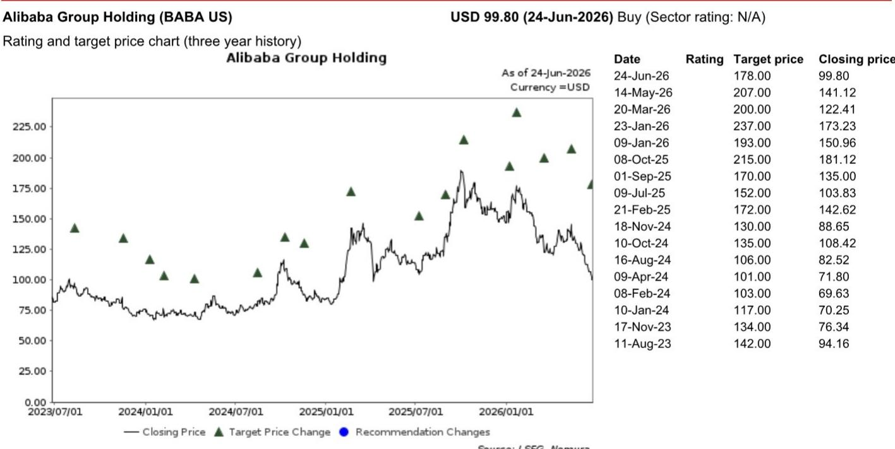
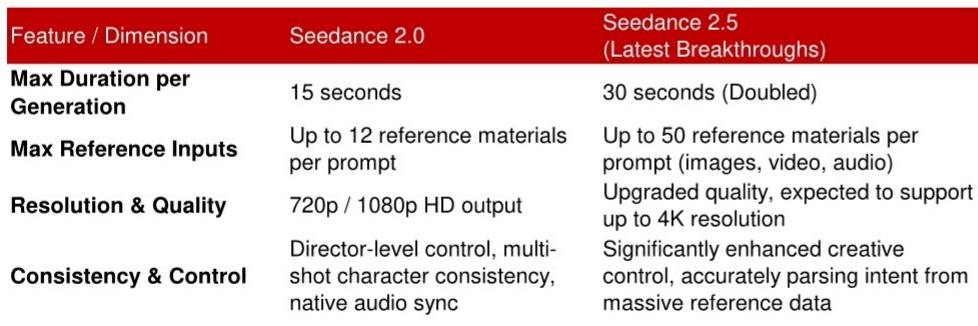
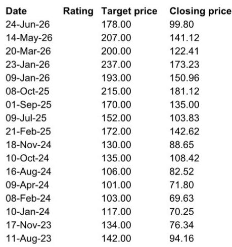

# NOM：字节AI视频生成已跨过“生产门槛”，但真正的战场还在别处

字节跳动旗下火山引擎近日举办了一场AI云峰会，发布了视频生成工具Seedance 2.5和基础模型Doubao Seed 2.1。NOM随即发布了一份深度解读，核心判断是：视频生成和AI编程正在成为中国AI平台竞争最激烈的商业化赛道，但字节在这两个领域的位势并不相同。这份报告最值得关注的信号不是技术参数，而是它揭示了AI竞争正在从“谁能吸引最多C端流量”转向“谁能在B端场景中真正赚到钱”。

## 1. 字节的视频生成已领先一个身位，但商业化规模仍需验证

Seedance 2.5的参数升级足够亮眼：单次输出从15秒提升到30秒，分辨率升级至4K，参考素材输入量从12个跃升至50个。但NOM分析师更看重的是这些参数背后的商业逻辑——它们直接指向了短视频电商、广告和短剧这三个最可能率先实现AI视频商业化的场景。

NOM特别指出，Seedance 2.0已经被定义为字节第一款“跨过生产门槛”的视频模型。这意味着它不再是一个实验性的UGC工具，而是能够产出可用于商业投放的视频内容。Seedance 2.5在此基础上进一步强化了可控编辑和多参考能力，让同一个创意基底可以根据不同产品、价格点、国家、语言、用户群体快速迭代。

> **KC评论：** 这里的关键不是技术参数本身，而是“生产门槛”这个判断。一个AI视频工具如果只是生成效果好但不可控、不可编辑、不可批量复制，它就永远停留在实验室demo阶段。Seedance 2.5的多参考和可控编辑功能，恰恰是在解决从“能看”到“能用”之间的鸿沟。完整报告中有详细的参数对比表和具体商业用例拆解，值得细看。

## 2. AI编程才是字节真正的短板，但这个市场尚未有赢家

如果说视频生成是字节的强项，那么AI编程就是它的软肋。NOM通过行业联系人了解到，字节目前在国内AI编程领域落后于第一梯队，后者包括智谱GLM-5.2、Deepseek和阿里巴巴的通义千问。

但NOM同时给出了一个重要的判断：AI编程市场尚未出现明确的领导者。这意味着字节虽然落后，但并非没有追赶机会。更难能可贵的是，NOM捕捉到了一个关键的市场信号：竞争正在急剧加速，产品迭代周期已经从5-6个月压缩到1-2个月。

> **KC评论：** 这是一个典型的“未定胜负的战场”。字节的Doubao Seed 2.1被定位为“进入AI编程领域的入场券”，但NOM提醒，入场券不等于门票。完整报告中有字节在MaaS市场份额的拆解——接近50%的份额中，超过一半来自Seedance 2.0，而非基础模型。这个数字本身就说明问题。

## 3. 芯片供给限制正迫使AI平台做出战略取舍

NOM在这份报告中提出了一个容易被忽略的宏观判断：持续的芯片供给限制正在迫使AI平台将资源集中在单一战场。这意味着行业正在从“全面开花”转向“重点突破”。

这个判断恰好解释了字节为什么选择在这个时间点推出订阅版豆包AI聊天机器人——当它的免费版本已经积累了超过1.5亿日活跃用户时，转向订阅制并非简单的变现尝试，而是一种资源再分配：将有限的算力资源从C端聊天场景向B端商业场景倾斜。

NOM的逻辑链是：芯片供给约束 -> AI平台无法同时在所有赛道投入 -> 竞争焦点从C端流量转向B端商业化 -> 视频生成和AI编程成为当前最接近可规模化商业化的赛道。

> **KC评论：** 这个框架的价值在于，它提供了一个理解中国AI行业竞争格局的“资源约束视角”。当行业普遍关注模型参数和用户增长时，NOM提醒我们：真正的竞争约束可能不是技术能力，而是算力分配效率。完整报告对芯片供给约束的具体影响有更细致的分析，包括对各家云厂商的不同影响。

## 4. 阿里云才是更完整的AI云玩家，但短期有下行风险

NOM在报告中对阿里巴巴给出了明确的判断：它仍然是更全面的AI云玩家，拥有从AI芯片（平头哥）、CPU/GPU云基础设施、百炼大模型平台到通义千问的完整AI价值链。

这个判断的支撑点在于：阿里在AI编程领域处于第一梯队，在视频生成领域与字节竞争，在基础模型上保持领先，同时拥有最完整的云基础设施。而字节虽然在视频生成上领先，但基础模型和AI编程仍是短板。

NOM认为阿里当前13倍CY27F PE的估值提供了有吸引力的入场点，但同时警告：6月季度的电商客户管理收入（CMR）可能低于预期。这是一个典型的“长期看好、短期谨慎”的框架。

## 5. 报告尚未完全回答的三个关键问题

这份NOM研报虽然洞察深刻，但也留下了几个值得继续追问的问题：

第一，字节视频生成的商业化规模到底有多大？NOM指出了TikTok Shop商家、广告主、短剧制作方是潜在客户，但没有给出具体的市场空间测算。Seedance 2.5能否真正带来可量化的收入增长，还是只是一个技术示范？

第二，AI编程市场的竞争格局会如何演变？如果迭代周期压缩到1-2个月，这意味着技术领先的窗口期极短。字节是否有可能通过快速追赶实现弯道超车？第一梯队的护城河在哪里？

第三，芯片供给约束会持续多久？这是影响整个行业战略取舍的底层变量。如果芯片供给缓解，AI平台是否会重新回到“全面扩张”模式？字节的战略重心会再次调整吗？

这些问题在报告中只是被点到，但没有充分展开。它们恰恰是理解中国AI行业未来6-12个月走向的关键。

## 6. 给读者的观察框架：如何跟踪AI商业化的真实进展

基于这份NOM研报，我们建议读者建立一个三层观察框架：

第一层看技术参数，但不要只看参数本身。要看参数升级是否直接对应商业场景的痛点。比如Seedance 2.5的30秒输出和4K分辨率，对应的是短视频电商对高质量、长时长产品展示视频的需求。

第二层看收入结构。字节在MaaS市场接近50%的份额中，超过一半来自视频生成工具。这个数字本身就说明了哪类AI产品真正在产生收入。跟踪各家AI平台的收入结构变化，比跟踪用户增长更能反映商业化进展。

第三层看资源分配信号。芯片供给约束下，AI平台的战略取舍会体现在产品发布节奏、免费与订阅策略、以及是否在非核心赛道收缩。字节推出订阅版豆包就是一个重要的资源分配信号。

---

以上讨论基于NOM的这份研报，但报告中的完整数据、图表和更细分的商业用例拆解，我们无法在一篇文章中穷尽。每天，我们的AI agent和人工团队会生成国际投行中文摘要与KC评论，daily更新约10-40页，并整理当天最新数据图表合集，方便喂给AI，也方便人工快速把握market dynamics。欢迎来星球微信群里继续讨论。

Personal reading notes and learning share only. Not investment advice.

