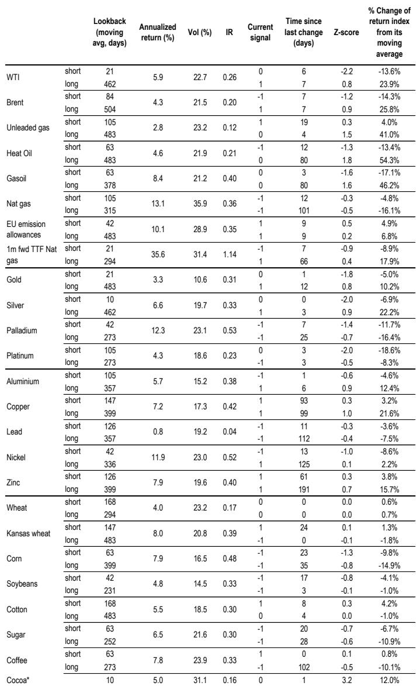
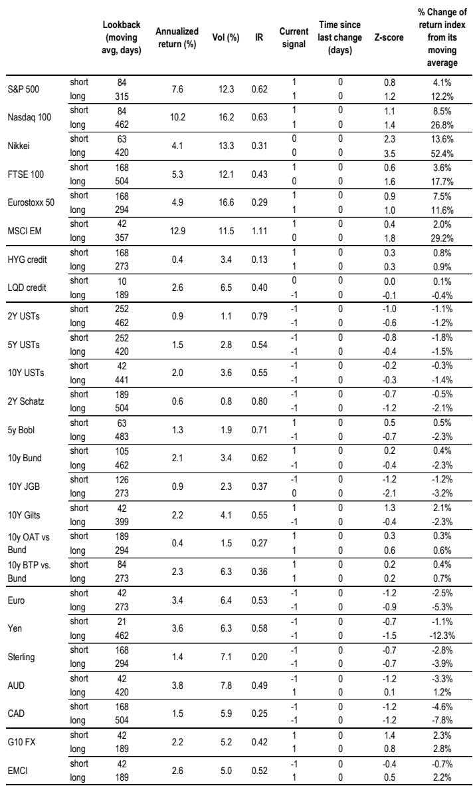
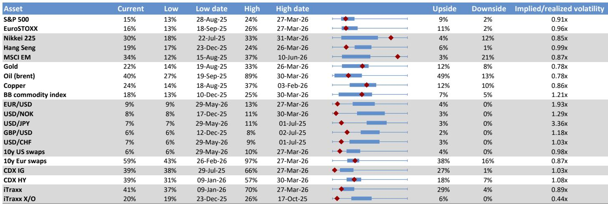

# The Retail Leverage Cycle Has Peaked, and Tech Stocks Are the Most Exposed

The most important macro financial development of the past several weeks is not a policy shift or an earnings surprise. It is the quiet, measurable retreat in retail investor leverage. After reaching extreme levels earlier this year, the two primary channels through which individual investors amplify their market exposure—options trading and margin borrowing—are now showing clear signs of peaking. Historically, such peaks have preceded multi-month corrections in the equity segments most favored by retail participants, particularly technology stocks. The current environment carries the same risk, and the data suggests this is not a temporary pause but the beginning of a structural headwind.

Why now matters is a matter of timing and concentration. The rally in tech stocks over the past 18 months has been substantially fueled by leveraged retail flows. These flows created a self-reinforcing cycle: rising prices attracted more leveraged buying, which in turn pushed prices higher. That cycle is now reversing. The leverage that amplified the move up will amplify the move down as positions are unwound. The question for institutional investors is not whether this matters, but how to position for the downstream consequences across asset classes.

The report from a global investment bank's Flows & Liquidity team provides the most granular available view of this phenomenon. It examines leverage across four investor types—retail, hedge funds, risk parity funds, and banks—and across two dimensions of economic leverage. The conclusion is nuanced but actionable: the retreat in retail and risk parity leverage is real and advanced; the peaking in hedge fund and bank leverage is tentative; and the macro backdrop of declining corporate and household leverage offers a cushion against systemic risk. The net effect is a market that is more fragile at the margin, not a market on the verge of collapse. This distinction is critical for strategy.

## Retail Investors Are Deleveraging Through Both Options and Margin Accounts, Creating a Direct Headwind for Tech Stocks

The report identifies three channels through which retail investors express leverage: leveraged ETFs, options, and margin accounts. The first channel shows little evidence of retreat. Flows into leveraged equity ETFs remain robust, with only the normal profit-taking seen in strong up months. This is important because leveraged ETFs have become a significant amplification mechanism, particularly in markets like Korea where tech-focused leveraged products have attracted substantial AUM. The rebalancing flows from these ETFs have been a major force in recent months.

The retreat is concentrated in the other two channels. The report's proxy for retail option buying—exchange-traded call option purchases by customers with fewer than 10 contracts—peaked on June 5 at nearly 14 million contracts. This matches the peaks seen in October 2025 and November 2021. In both previous instances, tech stocks experienced multi-month corrections, with the eventual bottom occurring when the metric fell to between 2 and 4 million contracts. The current reading is still elevated but declining. The implication is that the marginal impulse from retail options activity is fading.

The margin account picture is equally telling. The NYSE Net Debit balance, which serves as a proxy for US individual investor leverage, stands at extreme levels by historical standards. This year's peak matches the end of 2021 and mid-2018, both of which were followed by multi-month equity market corrections. The report notes tentative signs of retreat in recent months. The mechanism is straightforward: when retail investors borrow to buy stocks, they create forced selling pressure when prices decline or when margin calls are triggered. The retreat in margin debt suggests that this source of buying power is diminishing.

The so what here is direct. Tech stocks are the preferred habitat of retail investors. The retreat in options and margin leverage removes a key source of demand for these names. The report does not quantify the exact impact, but the historical pattern is clear: when retail leverage peaks and then declines, the most heavily owned sectors suffer the most. This is not a prediction of a crash, but it is a forecast of relative underperformance unless other buyers step in to fill the gap.

## Risk Parity Fund Leverage Has Already Peaked, Removing a Key Source of Systematic Buying

The report's analysis of risk parity fund leverage is more definitive than its assessment of hedge funds or banks. The implied leverage proxy for risk parity funds retreated in recent weeks after reaching its highest level in over a decade in mid-May. This is a meaningful development because risk parity funds are large, systematic, and mechanically driven. They do not make discretionary decisions about when to reduce exposure; they do so based on volatility and correlation regimes.

The mechanism is well understood. Risk parity funds target a constant risk level, typically measured by volatility. When asset prices rise and volatility remains low, their leverage increases. When volatility spikes or correlations change, they are forced to delever. The May peak in risk parity leverage suggests that the conditions that allowed these funds to build exposure are now reversing. The retreat, while not catastrophic in size, removes a source of demand that had been supporting a broad range of assets, including bonds and equities.

The implication for portfolio construction is that the tailwind from systematic strategies is fading. This does not mean risk parity funds are about to cause a crisis, but it does mean that the marginal buyer that was supporting prices in a low-volatility environment is stepping back. Investors who have relied on the assumption that systematic funds would continue to provide demand should reassess their positioning.

## Hedge Fund and Bank Leverage Show Only Tentative Signs of Peaking, But the Trend Is Worth Monitoring

The report's analysis of hedge fund leverage is more cautious. The proxy, based on the ratio of hedge fund return volatility to underlying asset volatility, has been drifting higher since 2023. March 2026 marked a potential local peak, but the current level is not particularly high by historical standards, especially compared to pre-2008 norms. This suggests that hedge funds have not been as aggressive in building leverage as retail investors or risk parity funds.

The same applies to banks. The report notes that deregulation has allowed US banks to increase leverage in recent years, but the current level remains well below pre-financial crisis norms. The proxy shows tentative signs of peaking, but the data is not conclusive. The so what is that the hedge fund and bank channels are not yet a source of concern, but they could become one if the trend continues. If further signs of peaking emerge, it would add to the narrative that the overall leverage cycle is turning.

The distinction matters for strategy. If only retail and risk parity leverage are retreating, the impact is concentrated in specific segments and systematic strategies. If hedge fund and bank leverage also begin to decline, the effect would be broader and more severe. Investors should monitor these proxies closely in the coming weeks.

## Corporate and Household Leverage Are Declining, Which Reduces Macro Vulnerability but Does Not Eliminate Micro Risk

The report provides a useful counterpoint to the leverage concerns by examining economic leverage. The stock of non-financial corporate sector and household debt as a percentage of nominal GDP for the global economy ex-China has been on a declining trend since the pandemic. This is a positive development because it reduces the vulnerability of the real economy to macro shocks.

The report also highlights a striking fact: despite the sharp rise in interest rates since early 2022, the net interest paid by US non-financial corporates as a proportion of cash flows has declined markedly. This is because the interest rates on short-term assets repriced faster than the rates on liabilities. The net effect is that corporate balance sheets are in better shape than headline interest rate levels would suggest.

The so what is that the macro backdrop is supportive, but it does not protect against the specific risks posed by retail deleveraging. The economy can be healthy while certain segments of the market correct. The 2021 peak in retail leverage was followed by a multi-month correction in tech stocks, even though the broader economy was recovering. The same dynamic could play out now. Investors should not confuse macro resilience with market immunity.

## The Report Leaves an Open Question: How Far Will the Deleveraging Go, and What Triggers the Next Phase?

The report is rigorous in its measurement of current leverage levels, but it does not fully answer the question of how far the deleveraging will go. The historical analogies are useful but imprecise. The 2021 peak in retail options activity was followed by a correction that lasted several months and saw the metric fall from 14 million contracts to between 2 and 4 million. If the same pattern holds, the current retreat has a long way to go.

The report also does not identify the specific trigger that would accelerate the deleveraging. In 2021, the trigger was a combination of rising rates and a shift in Fed policy. In 2018, it was the trade war and tightening financial conditions. Today, the trigger could be any number of factors: a surprise inflation print, a geopolitical event, or simply the exhaustion of the retail buying impulse. The absence of a clear trigger does not mean the risk is absent; it means the risk is latent and could materialize quickly.

The question for investors is whether to wait for the trigger or to position ahead of it. The report's data suggests that the deleveraging is already underway, even if the pace is gradual. The prudent approach is to assume that the trend will continue and to adjust exposure accordingly, particularly in the tech sector.

## A Decision Framework for Investors: Three Questions to Determine Your Exposure to the Deleveraging Cycle

The report's findings can be translated into a practical decision framework. Investors should ask themselves three questions.

First, what is your exposure to the segments most directly affected by retail deleveraging? The report identifies tech stocks as the primary habitat of retail options and margin activity. If your portfolio has a significant overweight to US technology, you are directly exposed to the headwind. The appropriate response is to reduce exposure or to hedge it through options or sector shorts.

Second, what is your exposure to systematic strategies that may be affected by risk parity deleveraging? If your portfolio includes risk parity funds or strategies that rely on low volatility and stable correlations, the retreat in risk parity leverage could reduce expected returns. The appropriate response is to review the assumptions underlying these strategies and to consider reducing allocation if the volatility environment changes.

Third, what is your macro hedge? The report shows that corporate and household leverage are declining, which reduces systemic risk. This means that the deleveraging is likely to be contained to specific segments rather than causing a broad market crash. The appropriate response is to maintain a macro hedge against a correction in tech and growth stocks, but not to assume that the entire market is at risk.

The framework is simple, but it forces investors to be specific about where the risks lie. The report's data provides the foundation for this analysis; the framework turns data into action.

## Join the Community to Read the Full Report and Review the Original Charts

The analysis above is based on a single report from a global investment bank's Flows & Liquidity team. The full report contains additional data on bond supply-demand dynamics, central bank purchases, and cross-asset positioning that provide further context for the leverage picture. The charts showing the historical patterns of retail options activity, margin debt, and risk parity leverage are essential for understanding the magnitude of the current retreat. Join the community to read the full report and review the original charts.

*This article is for learning and discussion only and does not constitute investment advice.*

Personal reading notes and learning share only. Not investment advice.

