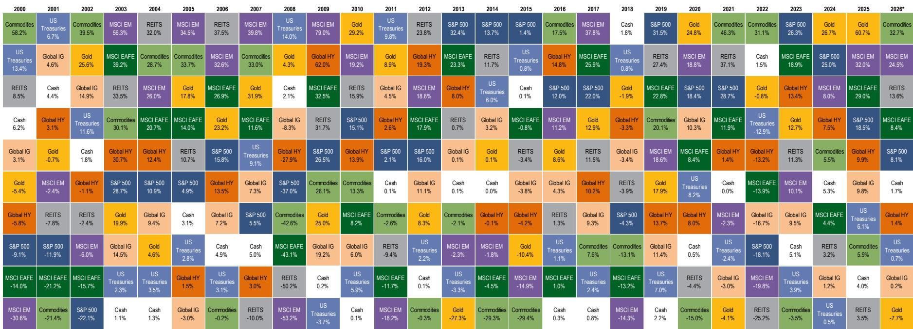
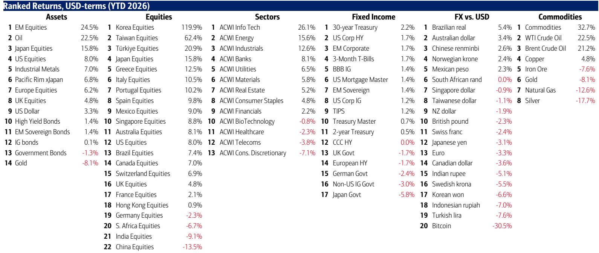
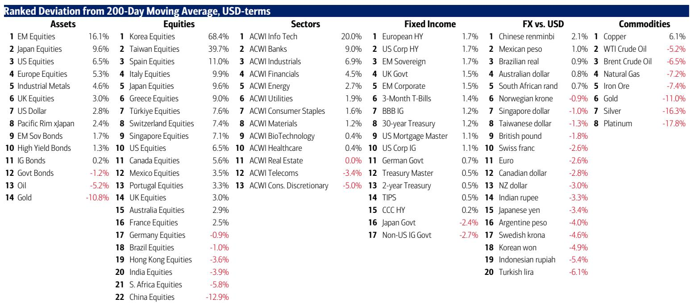

# The Market Is Rotating Away From Mega-Cap Tech, But This Is Not a Bear Signal — It Is a Regime Shift

The most important data point in this week's flow report is not the record $9.3 billion outflow from technology stocks. It is the $25.5 billion that flowed out of cash — the largest weekly cash withdrawal in eight weeks. That money did not go to the sidelines. It went somewhere else. Investors are not fleeing risk. They are reallocating it. The narrative that dominated markets for the past two years — that the only way to win is to own the largest US technology stocks — is breaking. What replaces it is more complex, more cyclical, and potentially more durable.

A global investment bank's latest flow report, dated June 25, 2026, reveals a market at an inflection point. The BofA Bull & Bear Indicator has fallen to 9.1 from 9.2, still in "sell signal" territory after triggering in May. Historically, such signals have led to average losses of 2-3% for global stocks over two to three months, with a roughly 60% hit ratio and maximum drawdowns of 15-20%. But the flows beneath this headline suggest something more nuanced than a simple risk-off move. Technology saw a record weekly outflow of $9.3 billion, following a record $19.2 billion inflow the prior week. Real estate saw its biggest inflow since March 2024. Infrastructure saw its biggest inflow in six weeks. Energy saw its largest outflow since April 2025. The pattern is not fear. It is rotation.

The most contrarian secular trade in markets today is not bitcoin, not gold, and not emerging markets. It is long the long end of the US Treasury curve. Since the new Fed chair assumed office on May 22, 2026, US Treasuries have returned 3.2%, while stocks have fallen 1.6%. The report shows that the new chair is mirroring the trajectory of past Fed chairs whose terms saw lower bond yields — Eccles, Volcker, Greenspan, and Bernanke. If this pattern holds, the bond market may be signaling something that equity markets have not yet priced: that the era of persistently high rates is ending, and with it, the era of mega-cap tech dominance.

This is not a call to sell everything. It is a call to understand that the market's center of gravity is shifting. The flows tell a story of capital moving from concentration to dispersion, from momentum to value, from the largest names to the most overlooked corners. Investors who treat this as a warning to hide in cash will miss the opportunity. Those who treat it as a signal to redeploy into the next cycle will be positioned for what comes next.

## The Record Tech Outflow Is Not a Panic — It Is a Profit-Taking Rotation Into Cyclicals and Rate-Sensitive Assets

The $9.3 billion outflow from technology stocks is the largest on record, but it follows a record $19.2 billion inflow. This is not a crash. It is a rotation. The capital is moving into assets that benefit from a lower-rate, higher-growth, more cyclical environment. Real estate inflows hit their highest level in over two years. Infrastructure saw its strongest week in six weeks. Even within fixed income, the flows show a preference for risk: high-yield bonds saw inflows for the second consecutive week, and emerging market debt saw inflows for the second week as well. The only fixed income category to see an outflow was Treasuries — the first outflow in nine weeks.

The report identifies two key catalysts for a proper risk-off summer: the MAGS ETF falling below $60 and the AUDJPY cross dropping below 110. Neither has triggered yet. The MAGS ETF, which tracks the Magnificent Seven, is still above that threshold. The AUDJPY, a classic risk appetite barometer, is still above 110. Until these levels break, the rotation should be interpreted as repositioning, not capitulation. The flows into REITs, infrastructure, and high-yield bonds suggest that investors are betting on a "soft landing" scenario where rates decline and economic growth persists, just not in the sectors that led the last cycle.

The so-called "hyperscaler" question — how far do the mega-cap AI infrastructure spenders need to fall for the market to start pricing in capex cuts — remains unanswered. But the flows suggest that the market is already pricing a slowdown in AI-related capital expenditure, or at least a shift in where that spending flows. The liquidity that was concentrated in mega-cap tech is now flowing into semiconductors, small and mid-cap stocks, housing-related equities, and REITs. This is a bet on the "Trump pivot to affordability" — a political and economic strategy that prioritizes lower rates and more accessible housing over the inflation-fueled boom of the previous cycle.

## The New Fed Chair Is Following a Historic Path Toward Lower Yields, and the Bond Market Is Already Pricing It

The report includes a table comparing every Fed chair since Eccles. The data is striking. The new chair's term began on May 22, 2026. Since then, the 10-year yield has fallen by 17 basis points, and the S&P 500 has declined by 2%. This early trajectory mirrors the paths of Eccles, Volcker, Greenspan, and Bernanke — all chairs whose terms saw lower bond yields. It diverges from the paths of Martin, Miller, Yellen, and Powell, all of whom saw rising yields during their tenures.

The implication is profound. If the new chair follows the "lower yield" path, the bond market is not wrong to rally. The "nouveau-hawkish" tone that the Fed has adopted since the transition has yet to convince any investor to abandon the core "Anything But Bonds" allocation that has dominated since 2022. But the early data suggests that the bond market is betting against the hawkish rhetoric. Long-duration Treasuries remain the most contrarian trade in global markets. The report's data shows that since 2020, private clients have poured $48 billion into T-notes versus $28 billion into T-bills — a preference for duration that has only intensified.

The question that the report does not fully answer is whether this bond rally is sustainable. The Fed's rhetoric remains hawkish. Inflation data has not yet decisively broken lower. And the geopolitical landscape — the report notes that the era of sanctions may be ending, which would be dollar-positive — could reverse the yield decline. But the historical precedent is clear: when a new Fed chair presides over falling yields in the first two months, the trend has tended to persist. Investors who ignore this signal risk being caught on the wrong side of the biggest macro trade of the decade.

## The Dollar Is a "Rent," Not an "Own," and Gold Below $4,000 Is a Buying Opportunity

The report's framing of the US dollar as a "rent, not an own" is one of its most provocative claims. The dollar has rallied this year, up 3.2% year-to-date. But the report argues that the secular trend favors emerging markets over the US, and that gold below $4,000 represents a good entry point. Gold is down 7.2% year-to-date, making it one of the worst-performing major asset classes. Yet the report calls this a buying opportunity.

The logic rests on two pillars. First, the era of fractured geopolitics and populist politics is not ending. The report states that the 2020s will remain an era where governments prioritize booms over inflation control. This is inflationary for assets but deflationary for currencies — a favorable backdrop for gold. Second, the end of the Iran sanctions era and the broader trend toward de-dollarization mean that the dollar's reserve currency premium is eroding. The dollar may strengthen cyclically, but secularly, it is declining.

The report's chart on gold shows that the current price is well below the peaks seen during the 2020-2024 bull run. The YTD performance of gold is -7.2%, compared to commodities at 21.9% and international stocks at 11.5%. This divergence is unusual. Gold typically rallies when real rates fall and when geopolitical risk rises. Both conditions are present. The fact that gold is not rallying suggests that the market is not yet pricing the full extent of the regime shift. For investors with a multi-year horizon, this may be the opportunity.

## The Secular Trade Remains Long Emerging Markets, But the Near-Term Flows Tell a Different Story

The report's Chart 2 shows the price relative of the S&P 500 versus emerging markets, and the secular trend is clearly in favor of EM. Yet the weekly flow data tells a more complicated story. Emerging market equities saw $11.1 billion in outflows last week, the second consecutive week of outflows. China alone saw $240 billion in year-to-date outflows. The report's own data shows that the "secular trade" is long EM, but the "cyclical trade" is currently short EM.

This tension is the central analytical challenge for investors. The long-term case for EM is strong: demographics, commodity demand, and the shift away from US-centric supply chains all favor non-US markets. But the near-term headwinds are real: a strong dollar, hawkish Fed rhetoric, and geopolitical uncertainty are driving capital back to the US. The report's flow data shows that US equities have seen $332.7 billion in year-to-date inflows, while EM equities have seen $131.3 billion in outflows. The divergence is extreme.

The resolution of this tension will depend on the path of the dollar and the Fed. If the new Fed chair delivers lower yields and a weaker dollar, EM will likely rally sharply. If the dollar remains strong, EM will continue to struggle. The report does not resolve this question. It simply notes that the secular trade remains long EM, and leaves the timing to the reader. This is one of the most important open questions in the report, and it is the kind of question that requires ongoing analysis, not a single decision.

## A Decision Framework for the Second Half of 2026: Three Scenarios

The report's data can be organized into three scenarios that help investors navigate the second half of 2026. Each scenario is defined by the interaction of three variables: the path of the 10-year yield, the level of the MAGS ETF, and the direction of the dollar.

Scenario One: The Soft Landing. In this scenario, the 10-year yield continues to decline, the MAGS ETF stabilizes above $60, and the dollar weakens. This is the scenario that the flow data currently supports. Real estate, infrastructure, and EM debt would benefit. Technology would underperform as capital rotates into cyclicals. Gold would rally. This scenario is consistent with the historical precedent of a new Fed chair presiding over lower yields.

Scenario Two: The Hard Landing. In this scenario, the MAGS ETF breaks below $60 and the AUDJPY breaks below 110. These are the report's identified catalysts for a proper risk-off summer. In this scenario, the 10-year yield would likely decline further as investors flee to safety, but equities would sell off broadly. Cash would outperform. Gold would rally as a safe haven, not as a cyclical trade. This scenario would validate the BofA Bull & Bear sell signal, which has historically led to 2-3% losses over two to three months.

Scenario Three: The No Landing. In this scenario, the Fed's hawkish rhetoric proves correct, inflation reaccelerates, and the 10-year yield rises. The dollar strengthens. Technology stocks, which benefit from nominal growth and low discount rates, would initially rally but would eventually be hurt by rising rates. Gold would fall. This is the scenario that the bond market is currently betting against, but it cannot be dismissed.

The report provides the data to monitor these scenarios. The key levels are clear: MAGS at $60, AUDJPY at 110, the 10-year yield at its current level, and the dollar index. Investors should not try to predict which scenario will materialize. They should position their portfolios to survive all three and thrive in at least two. That means owning duration, diversifying away from mega-cap tech, and maintaining exposure to gold and EM — but at prices that offer a margin of safety.

## What the Report Does Not Fully Answer — And Why That Matters

The report leaves several critical questions open. First, how far do hyperscalers need to fall before the market starts pricing in capex cuts? The record tech outflow suggests that investors are already reducing exposure, but the earnings impact of lower capex has not yet been modeled. Second, will the new Fed chair's early trajectory toward lower yields persist, or will the "nouveau-hawkish" rhetoric eventually be backed by action? The historical precedent is clear, but every cycle is different. Third, is the dollar's strength a cyclical phenomenon driven by rate differentials, or a secular phenomenon driven by US economic outperformance? The answer determines whether the EM trade is a contrarian opportunity or a value trap.

These are not gaps in the report. They are the report's most valuable features. A research report that answers every question is a report that has outlived its usefulness. A report that identifies the right questions is a report that investors will return to week after week. The flow data will update. The levels will be tested. The scenarios will resolve themselves. The investors who understand the framework will be prepared.

Join the community to read the full report and review the original charts.

*This article is for learning and discussion only and does not constitute investment advice.*

Personal reading notes and learning share only. Not investment advice.

