TOP of MIND

## AN AI JOB APOCALYPSE?

Rapid improvements in AI capabilities and growing corporate adoption have led to predictions that the technology could lead to large-scale job losses before the end of the decade. So, just how concerned should we be about an AI “job apocalypse”? MIT’s Daron Acemoglu and Neil Thompson and GS’ Joseph Briggs generally agree that these predictions likely won’t come to pass, though they differ on the scale of disruption ahead. Briggs expects significant labor displacement but only temporarily as new jobs eventually emerge. Thompson is less convinced about large-scale job displacement and takes comfort in the ability to anticipate changes, seeing AI as a rising tide rather than a crashing wave for labor. And Acemoglu expects a small net negative impact on labor over the next five years, with possible larger losses over the longer term if investment remains focused on replacing rather than complementing workers. Amid this debate, we find that AI's impact on corporate labor needs—and earnings—remains too uncertain for markets to reward (for now).

No general law of economics says that job creation must match job destruction. Job growth over the last 80+ years resulting from a combination of changing tasks, new tasks, and a shifting structure of occupations has not occurred at an even pace.
- Daron Acemoglu

Previous automation waves have resulted in many new jobs, which offers some reassurance. But AI also processes information in ways more similar to humans than previous technologies, so more worry may be warranted.

Despite our expectation that AI-related job losses will lead to a meaningful amount of labor displacement, we continue to expect that labor market headwinds will be temporary. Key to this view is our expectation that over the long run AI will create many new jobs even as it destroys existing ones.

## WHAT'S INSIDE

INTERVIEWS WITH:

Daron Acemoglu, Institute Professor at MIT

Neil Thompson, Director of the FutureTech research project at MIT's Computer Science and Artificial Intelligence Lab

HOW MUCH AI LABOR DISPLACEMENT?
Joseph Briggs, GS Global Economics Research

\- Neil Thompson

AI & LABOR: SUBSTITUTION VS. AUGMENTATION
Elsie Peng, GS US Economics Research

IS AI HURTING NEW GRADUATES?
Jessica Rindels and Pierfrancesco Mei, GS US Economics Research

AI'S UNEVEN TOLL ON WORKERS
Pierfrancesco Mei, GS US Economics Research

\- Joseph Briggs

AI: LIMITED LABOR PRODUCTIVITY UPLIFT SO FAR
Ryan Hammond, GS US Portfolio Strategy Research

AI AGENTS VS. HUMANS: WHO COSTS MORE? James Schneider and Luya You, GS Equity Research

Allison Nathan | allison.nathan@gs.com

...AND MORE

Jenny Grimberg | jenny.grimberg@gs.com

Ashley Rhodes | ashley.rhodes@gs.com

# Macro news and views

## We provide a brief snapshot on the most important economies for the global markets

## US

## Latest GS proprietary datapoints/major changes in views

\- We raised our sequential 2H26 GDP growth forecast to 2% (from 1.9%) and lowered our 12m recession odds to the 15% long-term norm (from 25%) following the US-Iran deal.

## Datapoints/trends we're focused on

\- Fed policy; the hawkish June meeting raises the risk of hikes later this year, but we expect the Fed to remain on hold in '26 as most FOMC voters likely still lean toward unchanged policy rates and the latest projections may be stale given the deal.

\- Core PCE inflation, which we expect to remain close to 3% through YE before declining to close to 2% in 2027 (yoy).

\- Real income, which will likely slow in 2H26, keeping real consumer spending growth at just 1.5%.

## US recession risk: back to its long-term norm

US 12m ahead recession probability, %  
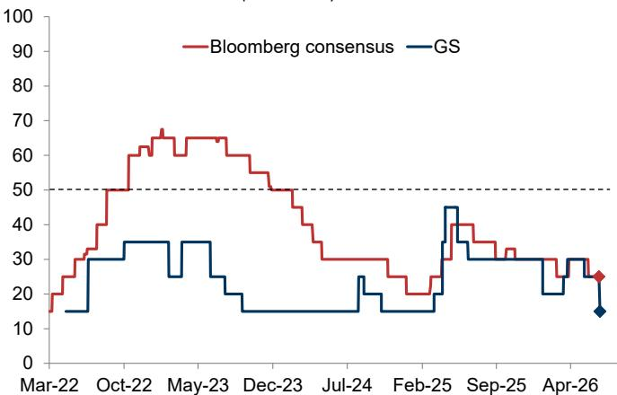  
Source: Bloomberg, GS GIR.

## Europe

## Latest GS proprietary datapoints/major changes in views

\- We raised our 2026/27 EA GDP growth forecasts to 0.5%/1.2% (from 0.3%/0.9%, yoy) and lowered our EA/UK peak core inflation forecasts to 2.6%/2.9% (from 2.7%/3.1%, yoy) partly to reflect the lower energy prices we now expect.

## Datapoints/trends we're focused on

\- UK politics; Burnham is expected to succeed Starmer as PM, which could lead to slower fiscal consolidation.

\- BoE policy; recent weak activity data and a continued deceleration in underlying inflation measures have raised our confidence that the BoE will remain on hold this year before cutting rates in 2027.

• EA fiscal deficits, which have widened on average vs pre-covid.

Euro area: deteriorating fiscal balances (for most)
Fiscal balances in the Euro area, % of GDP  
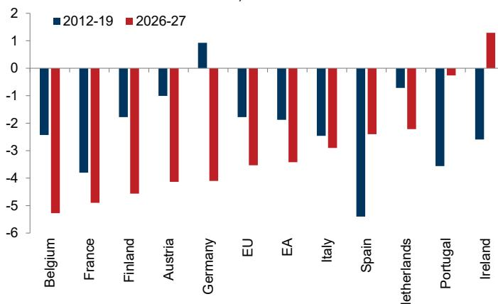  
Source: Haver Analytics, European Commission, GS GIR.

## Japan

## Latest GS proprietary datapoints/major changes in views

\- No major changes in views.

## Datapoints/trends we're focused on

\- BoJ policy; we expect the BoJ to continue hiking rates roughly every six months, with the next hike likely in Jan 2027, to a policy rate of 1.5% next summer, though uncertainty around the timing of the next hike remains high.

\- Japan fiscal outlook, which could worsen if PM Takaichi implements her expansionary plans and long-term interest rates rise further toward the levels of other G10 economies.

\- Japanese real GDP growth, which we expect to decline to 0.5% in 2026 (from 1.1% last year, both yoy).

Japan: a potentially less sustainable fiscal outlook
Debt/GDP ratio by interest rate scenario, % of GDP

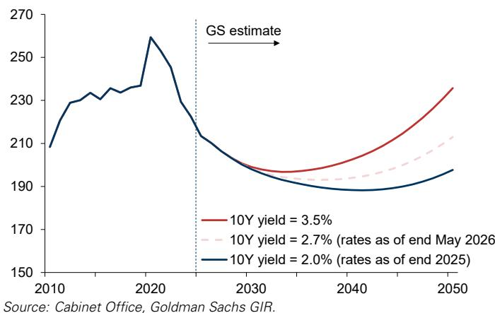  
Source: Cabinet Office, GS GIR.

## Emerging Markets (EM)

## Latest GS proprietary datapoints/major changes in views

\- We lowered our 2Q26 China real GDP growth forecast to 3.5% (from 4.0%, both qoq ann.) given weak April and May activity data, though we expect growth to rebound to 5.0% in 3Q26 (qoq ann.), for full-year real GDP growth of 4.7%.

## Datapoints/trends we're focused on

\- AI investment boom, which will likely continue boosting growth in several Asian economies involved in the tech and AI supply chain, especially Taiwan and South Korea.

\- China's current account surplus, which continues to grow and could weigh on trading partners' export growth.

• RMB internationalization, which could accelerate ahead.

## Asia: surging tech exports

Asia ex. Mainland China tech exports to world, 3m ann., \$bn

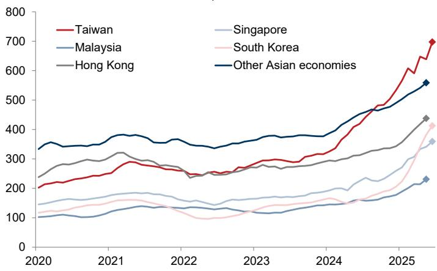  
Source: Haver Analytics, GS GIR.

# An AI job apocalypse?

Rapid improvements in AI capabilities and growing corporate efforts to integrate the technology into enterprise workflows have raised concerns that AI could trigger a “job apocalypse”, especially as some companies have cited AI as a factor in recent layoffs (see pg. 16), entry-level hiring appears to be softening in some AI-exposed occupations, and unemployment among college graduates has risen above the pre-pandemic average. So, just how concerned should we be about the disruptive potential of AI for the US labor market?

Some prominent technologists predict that AI could ultimately eliminate a massive number of jobs. They argue that, unlike previous technological shifts that primarily automated routine manual labor and clerical tasks, increasingly capable AI models will soon be able to handle much of the cognitive work humans perform, leaving many workers with less to do. They also point to the unprecedented speed of AI advances, which could outpace the labor market's natural ability to adapt, leading to substantial displacement in as soon as the next few years. And even if the technology eventually creates new roles, they warn of a skills mismatch, which could mean that these new roles will be filled by AI itself rather than displaced human workers.

GS Senior Global Economist Joseph Briggs also expects significant labor displacement, estimating more than 9% of the labor force—around 15mn workers—could lose their jobs during the 10-year AI transition he assumes. But he believes these losses will prove temporary owing to his expectation that AI will create many new jobs over the long term even as it destroys existing ones, taking comfort from the historical precedent of technological innovations creating much new work and the dynamism of the US economy (which GS CEO David Solomon also cites as a key reason why he believes the narrative of an AI job apocalypse is overblown). And the 10-year AI transition period that Briggs assumes should provide the labor market time to adapt.

Neil Thompson, Director of the FutureTech research project at MIT's Computer Science and AI lab, is less convinced that AI will drive large-scale job displacement. He explains that “capability is only one step in the process that leads to labor market change”—AI must also perform reliably, have access to the right information, and be cost effective to meaningfully impact jobs. And because most jobs consist of many tasks, only some of which can be automated, he expects a slower and more uneven labor market adjustment than AI’s current capabilities suggest. Thompson also takes some—though not complete—comfort from previous automation waves that created many new jobs. So, he describes AI’s impact on the labor market more as a “rising tide” than a “crashing wave”: real change and churn, especially if adoption accelerates quickly, but not sudden, widespread job loss.

We then spoke again with Daron Acemoglu, Institute Professor at MIT and winner of the Nobel Prize in Economics. He expects AI to have only a small net negative impact on labor over the next five years—far less than some technologists predict—as current AI models are more likely to replace than complement workers (GS US Economist Elsie Peng indeed finds that AI is currently substituting more than augmenting, resulting in a small net drag on the labor market). But Acemoglu warns that job losses could be larger over the longer term if AI investment continues to focus more on replacing than complementing workers, and especially so if agentic advances, improvements in AI models' social capabilities, or AI-robotics integration expand the set of jobs that the technology could impact (GS equity analysts James Schneider and Luya You also argue that falling token costs could make more enterprise workflows economically viable to automate). And Acemoglu is less comforted than Briggs and Thompson by history, pointing out that “no general law of economics says that job creation must match job destruction.”

So, which workers will be most impacted by these labor market shifts? While much of the concern about AI-driven job losses has centered on new graduates and white-collar workers more broadly, GS US Economists Jessica Rindels and Pierfrancesco Mei find that AI has had little impact on college graduates' job prospects so far. But they argue that could change over the near term as college graduates are disproportionately employed in industries with high AI adoption rates and occupations with more potentially automatable tasks. Even so, Rindels and Mei remain relatively optimistic about college graduates' longer-term prospects, finding that they have historically adjusted more nimbly than other workers to technological disruption.

As for white-collar workers more broadly, Acemoglu argues that those performing cognitive, routine tasks under predictable conditions—such as customer service and back-office work—will bear the brunt of AI displacement. As these tasks are disproportionately performed by lower-paid white-collar workers, he expects this to lead to a rise in income inequality over the coming years. However, Acemoglu notes that if workers in higher-paid managerial roles are also displaced, as some think they could be, then inequality could actually decline.

Thompson agrees that much will depend on what types of work AI ultimately automates, with the key being whether it automates the most or least expert parts of a job. If AI automates the least expert tasks, employment would fall while wages rise as the work becomes more specialized; if it instead automates the most expert tasks, employment would rise while wages fall as more workers can do the job. That framework suggests the impact will cut across the occupation and wage distribution rather than hitting one worker group in particular.

Amid this debate, GS Senior US Equity Strategist Ryan Hammond finds that the technology's impact on corporate labor needs—and, crucially, earnings—remains too uncertain for markets to reward today. As a result, he says, investors continue to favor the AI infrastructure complex, where earnings benefits are more tangible. But Hammond expects this to change, with the AI trade eventually broadening to include labor productivity beneficiaries as clearer evidence that AI's much-touted productivity benefits can generate a durable earnings uplift emerges.

## Allison Nathan, Editor

Email: allison.nathan@gs.com
Tel: 212-357-7504
GS & Co. LLC

# Interview with Daron Acemoglu

Daron Acemoglu is an Institute Professor at MIT and author of several books. He received the Nobel Memorial Prize in Economic Sciences in 2024 (jointly with Simon Johnson and James A. Robinson). Below, he argues that AI is likely to have a small net negative impact on labor over the next five years and a larger negative impact over the longer term unless the industry directs more investment toward advances that complement, rather than replace, workers.
The views stated herein are those of the interviewee and do not necessarily reflect those of GS.

## Allison Nathan: The consensus among economists seems to be that aggregate labor market data is not yet indicating significant labor market impacts from AI technology despite headlines of large AI-related layoffs. Do you agree?

Daron Acemoglu: Yes. Well-informed people like my colleague Erik

Brynjolfsson have observed an impact on the entry-level job market. But I broadly agree with the consensus that no huge effect is notable in the aggregate data yet. Some of the layoff headlines may be AI whitewashing, and some of them are genuine attempts by a handful of brave companies to experiment with completing more tasks with AI. But these efforts are not large enough to show up in the aggregate data, except possibly in some slowdown in hiring in AI-exposed entry-level positions.

## Allison Nathan: Do you expect a larger impact to be visible anytime soon?

Daron Acemoglu: Yes. While it's very difficult to make predictions with any degree of certainty, as these company efforts intensify, I suspect these impacts will become more visible in 2027 in the form of layoffs or a hiring slowdown in jobs where AI can at least have a chance of replacing some tasks. AI is more likely to replace than augment jobs in the near term simply because current AI models are not good at complementing workers beyond simple tasks like reference checks, except in a few fields such as biological and chemical research. So, I expect a net negative impact on the number of jobs in coming years.

But it is important to emphasize that, in my estimation, the scale of job losses won't be anywhere close to the very large layoffs some are predicting. I estimate such losses will be less than, say, 2-4% over the next five years. My caution about AI's spread and, in turn, its economic impact, reflects the relative lack of user-friendly applications today that would enable large employers to leverage the foundation models.

Right now, workers are largely engaged in prompt engineering, which is difficult, inconsistent, and time-consuming. Coding/software engineering remains the notable exception because many aspects of coding are now routinized and software engineers today are AI experts that know how to leverage, troubleshoot, and check the models. Agentic advances may open the door to developing applications that enable broader AI use, but that's unlikely if every company must develop its own applications. What's required to move the needle is the

development of applications that all companies can leverage, like the Microsoft Office version of AI, so to speak.

So, I expect only a small net negative impact on labor over the next five years or so, concentrated in white-collar workers whose tasks are cognitive and routine and involve performing similar functions under predictable conditions rather than typically confronting new and unusual things or constant innovation, creation, and intense social interaction or judgment. These exposed occupations include customer service representatives or back-office work. In the US, these workers number roughly 8-9 million, which is not a small number but accounts for only roughly 5% of the workforce. And the impact could be even smaller and slower if the early movers that are already experimenting with AI labor replacement get their mouths burned.

AI is more likely to replace than augment jobs in the near term simply because current AI models are not good at complementing workers beyond simple tasks like reference checks... So, I expect a net negative impact on the number of jobs in coming years. But... the scale of job losses won't be anywhere close to the very large layoffs some are predicting."

## Allison Nathan: Does your calculus about AI's labor market impact shift over the medium-to-longer term?

Daron Acemoglu: Much more uncertainty exists over a 10- to 15-year horizon. How this evolves depends on where investments are directed. I have argued for over 10 years that the complementary path—whereby AI technology complements versus replaces human labor—could be quite productive. But such a path requires different investments in terms of pre-training and domain-specific applications and data. And those investments are not happening on a sufficient scale today to support a human-complementary path. A shift in the industry's priorities and incentives that leads to greater investment in this direction could result in a much more positive outcome for labor. But should things continue as they are, I would expect bigger net job losses within the next 10 to 15 years.

Many wild cards could also worsen these losses. If agentic advances lead to widely accessible, user-friendly applications, then job losses could extend beyond back-office white-collar workers to middle-manager roles that involve more judgement and even to more senior managerial roles should the

technology's cognitive abilities vastly improve from here. The large chunk of jobs that involve social interactions could also come under threat if the social dimensions of models continue to improve and human consumers become more accepting of interacting with bots, which younger generations seem more open to.

And perhaps one of the biggest wildcards is the potential integration of AI and robotics. Significant efforts are being made on this front, especially outside of the US, but several challenges exist to such integration on both the robotics and AI sides. Robots need to be flexible and gentle while still being able to perform physically challenging tasks, and AI models currently don't do very well on spatial causal relations, which combine spatial reasoning with causal inference. AI models also lack immediate feedback controls, which require much greater awareness of the environment than what large language models (LLMs) can achieve by simply reading text and understanding words. So, many advances would be required, which suggests progress will likely be slow. But should amazing breakthroughs occur, that would greatly increase the number of jobs that AI could impact given that roughly 50% of jobs in the US economy require physical labor.

A shift in the industry's priorities and incentives that leads to greater investment in [the complementary path] could result in a much more positive outcome for labor. But should things continue as they are, I would expect bigger net job losses within the next 10 to 15 years."

## Allison Nathan: The vast majority of job growth since 1940 has been driven by technology and the creative destruction process. So, do you think this time will be different?

Daron Acemoglu: Not necessarily. But no general law of economics says that job creation must match job destruction. Job growth over the last 80+ years resulting from a combination of changing tasks, new tasks, and a shifting structure of occupations has not occurred at an even pace. For example, fewer jobs for workers without a college degree have been created since 1980 than before 1980, leading to a decline in this group's employment-to-population ratio and wages, especially among men. During the 1950s, 1960s, and early 1970s, job creation exceeded job destruction, which led to increased demand for labor and a faster rise in wages than productivity. But since the late 1970s, job creation has mostly fallen short of job destruction, with the destruction centered in manufacturing jobs. The job losses I expect in the coming years amount to a similar scenario, but with the job losses instead centered around cognitive office jobs. So, nothing is completely different this time around, but every period is different in terms of the balance between job creation and destruction.

Allison Nathan: What implications will AI likely have for wages and income inequality?

Daron Acemoglu: To answer that, it's important to understand that inequality and employment are more tightly linked than is sometimes implied because declining or stagnant wages for some groups typically reduce these groups' employment-to-population ratio or participation rate as they become less motivated to work. So, a decline in wages and employment will likely go hand-in-hand for specific groups. And, assuming lower-paid white-collar workers will be hit hardest by AI, at least in the coming years labor income inequality will likely rise.

Of course, if job losses also encompass high-paid managerial roles, as some people seem to expect, then income inequality could actually decline. But, as we've discussed, I don't believe that's the more likely scenario. And even if well-paid managers did find themselves in the crosshairs, they would likely have more success at finding new jobs than the next layer of displaced workers. So, they'd still be unlikely to bear the brunt of AI displacement.

## Allison Nathan: What about the implications for capital versus labor income? Which is more likely to reap the benefits of AI technology?

Daron Acemoglu: Labor-capital inequality—the gap between income earned from work and income generated from assets—will more certainly increase. LLMs are increasing the capital intensity of production. The huge capital investment they require is a telltale sign that capital income will increase, even if some of those investments aren't fully profitable or don't break even. They nevertheless generate substantial revenue, almost all of which is capital-based; while AI companies presumably pay their employees well, the main input is data and compute. So, labor-capital inequality will rise. Moreover, since many of these companies have concentrated ownership, inequality will increase even within capital income earners.

## Allison Nathan: What role, if any, will policy have in shaping labor market outcomes?

Daron Acemoglu: Policy has a vital role to play. But before we even involve policy, we must first arrive at a societal consensus about what we want from AI and what AI can deliver. In my view, complementary AI could result in productivity and labor benefits and prove enormously useful for the economy and society at large. But what's missing today is a clear conversation about what it would take to purposefully build human-complementary AI tools. Some people argue that the best approach would be to double down on LLMs and then use them in human-complementary ways. I disagree. In my view, an approach that shifts the focus from “machine intelligence” to “machine usefulness”—or from machines designed to mimic and replicate human abilities to those designed to augment and empower human capabilities—would be better.

Once the way forward is agreed, we can then start to think seriously about the right policies to implement, spanning everything from the structure of the tax system, to what the government can do in terms of creating lodestars and directions for the AI industry, and broader competitive measures to ensure that the industry doesn't become too concentrated. As I have long said, technology is not destiny—we have the power to shape what it does and who it benefits based on the choices we make.

# Interview with Neil Thompson

Neil Thompson is the Director of the FutureTech research project at MIT's Computer Science and Artificial Intelligence Lab and a Principal Investigator at MIT's Initiative on the Digital Economy. Below, he argues that AI's impact on the labor market is more likely to resemble a rising tide than a crashing wave, driving uneven churn that workers, firms, and policymakers can anticipate and manage rather than sudden, widespread job loss.

The views stated herein are those of the interviewee and do not necessarily reflect those of GS.

## Jenny Grimberg: What is the right way to think about AI's potential impact on the labor market?

Neil Thompson: We should think of AI as a transformative technology that is already highly capable and quickly becoming even more so but recognize that capability is only one step in the process that leads to labor market

change. For AI to meaningfully affect jobs, it must be able to perform a task when given the right information, have access to that information, and be cost effective. That's often a tall order. Even with perfect information, AI doesn't have a 100% task success rate. It may be able to automate part of a process, like check-in at a doctor's office, but it can't give reliable medical advice without access to privacy records or other sensitive data that isn't easily obtained. And we've found that, in many cases, an AI system is too expensive to run at the level of precision required.

In practice, that means that while AI's capabilities will continue to improve rapidly, which will undoubtedly lead many people to conclude that it will have a very large impact on labor and the economy more broadly, the adoption process will be lengthy. Large businesses will likely automate before small ones, and the highest-value use cases will be prioritized before a long tail of tasks that will take much longer to automate, or never be automated at all. In that sense, AI will likely resemble previous automation waves: the set of tasks the technology can theoretically automate will be much bigger than the set it actually automates. So, the impact AI ultimately has on the labor market may not be nearly as large as its impressive capabilities suggest.

## The impact AI ultimately has on the labor market may not be nearly as large as its impressive capabilities suggest."

## Jenny Grimberg: You often make the distinction between "expert" and "inexpert" tasks. Why is that distinction so important for understanding how AI will impact labor?

Neil Thompson: We have found that, for most jobs, only a fraction of the tasks in that job can be automated. What happens to the worker whose job is partially automated is a key question that my colleague David Autor and I have explored. People often think about this through the demand lens: if 30% of a job is automated, demand for that job may fall by 30%, resulting in lower wages and fewer workers. But thinking about this through the supply lens is more useful. If AI automates the least expert part of a job, workers can spend more time on valuable tasks. In that scenario, employment falls while wages rise because the remaining work is more specialized. But if AI instead automates the most expert part of a job, workers are left doing the lower-value tasks, leading employment to rise while wages fall as more people can do the work and it becomes less valuable.

Think about the fate of taxi drivers vs. proofreaders over the last several decades. GPS technology automated the most expert part of a taxi driver's job—knowing all the streets and routes around a city. So, competition in the space has increased, with many more taxi drivers now than ever before, which has driven down wages. Conversely, word processing technologies automated the least expert part of a proofreader's job—checking spelling and grammar—and left them with much more complex tasks like figuring out how to structure an argument and present evidence. So, fewer people are now employed as proofreaders, and those who remain are more highly compensated.

AI technology will likely do both, automating expert tasks in some jobs and inexpert tasks in others. So, the labor market impacts will be diverse, and businesses and governments must plan for much more uneven outcomes than the headline debate often suggests.

Jenny Grimberg: What impact is AI having on expertise so far, and what does that suggest for how it will ultimately impact the aggregate level of jobs?

Neil Thompson: We find that AI is expertise-increasing in some jobs and expertise-degrading in others, with these effects appearing evenly across the job distribution rather than being concentrated in high- or low-wage jobs. That matters because it implies that when AI partially automates jobs, it doesn't push the labor market in a single direction. In some cases, the remaining work becomes more valuable, in others less so, and the employment effects run both ways, as we've discussed.

But at the aggregate level, what really matters is that some jobs will likely be largely automated and disappear, while new jobs are created. The balance between those two forces is uncertain. Previous automation waves have resulted in many new jobs, which offers some reassurance. But AI also processes information in ways more similar to humans than previous technologies, so more worry may be warranted. Still, it's too early to know whether AI will result in substantial unemployment or whether the new tasks it creates, along with the extra leverage it gives workers, will ensure that plenty of meaningful work continues to exist.

## Jenny Grimberg: But do AI's broad capabilities make significant job replacement more likely than in the past?

Neil Thompson: Not necessarily. Capability is not the same as reliability. Traditional technologies like spreadsheets or databases have a limited scope, but within that scope they perform perfectly—we never worry about Excel multiplying numbers incorrectly or a database missing records so long as we query them correctly. AI tools have a much broader scope, but they can hallucinate or even go off the rails, and those problems haven’t yet been solved. So, AI is a powerful assistive tool, but it can’t be slotted into a process and just forgotten about. The technology’s broad scope also means it will likely create new tasks and increase output at the individual and firm levels, potentially leading organizations to grow both in terms of headcount and their bottom lines. So, we should be skeptical of the notion that AI will destroy work without creating new work along the way just because it’s so broad and powerful in its capabilities.

We should be skeptical of the notion that AI will destroy work without creating new work along the way just because it's so broad and powerful in its capabilities."

## Jenny Grimberg: If AI inference costs continue to fall, would that translate into much wider adoption and larger labor market impacts?

Neil Thompson: Not as much as you might think. Sure, if smaller and cheaper "meek models"—which operate with limited computational resources—can eventually perform tasks that today require the most advanced frontier models, that would ease adoption somewhat by, for example, making it possible to run powerful AI on a phone or a single GPU. But for most AI systems, the marginal cost of running them is not the main barrier to adoption. The cost of training the model, which includes infrastructure and data costs, also factors into the price of a model, whether it's an in-house model or third-party subscription, and often matters more. Even if AI models become cheaper and easier to deploy, a lack of access to private data, rapidly changing decision criteria, or a need for significant back-and-forth interaction between a human and the AI system may still impede adoption, as could the fact that AI performance is known to degrade fairly quickly as tasks become more complex. So, a further decline in inference costs could increase adoption, but it wouldn't on its own determine the scale of AI's labor market impact.

## Jenny Grimberg: Who will capture the economic value that AI creates? Does labor have any shot of doing so?

Neil Thompson: The value will accrue to the owner of the scarce resource. If an AI system and a human jointly perform a task and the necessary AI expertise is rare or hard to access, the system provider can charge a premium. But if that expertise is commoditized—which we're seeing in many cases today given intense competition among providers—the value is more likely to accrue to the worker, especially if AI automates the least expert parts of the job. The same logic applies to

businesses. Even if the provision of the AI tool itself is generating the economic value, it may not accrue to the model builder. In some cases, proprietary data is the scarcer asset, so the data provider captures the value. And firms with unique datasets that are important for running a manufacturing process, managing client relationships, or supporting other key operations will find those assets becoming even more valuable as AI tools improve.

## Jenny Grimberg: Ultimately, how important will the speed of AI adoption be in shaping labor market outcomes?

Neil Thompson: Speed is critical. Consumer AI adoption has been very rapid but shallow, with consumers mainly using AI for simple queries. And enterprise adoption remains limited. We find that only around 10-20% of S&P 500 firms are currently using AI in ways that are generating revenue and meaningfully benefitting them. If that number were to rise sharply, the labor market impact would be more significant. Fast, wide-scale adoption would cause more disruption, not necessarily because fewer jobs would exist overall, but because churn would occur more quickly: some tasks and jobs would disappear, new ones would be created, and workers would have less time to transition into new roles. Workers, businesses, and the government will need to manage that process, and the faster it occurs, the more challenging it will be.

## Jenny Grimberg: So, are the worries that AI will lead to a job apocalypse warranted, or overblown?

Neil Thompson: I am neither complacent nor alarmist. People are right to focus on AI's rapidly evolving capabilities as a potential challenge to labor. But it's still too early to say that we are headed for large-scale job destruction, and I am skeptical that widespread AI layoffs are already occurring despite how some firms are characterizing recent headcount reductions. The more likely near-term outcome is partial rather than complete automation of jobs, which will push some workers to become more expert and others less expert. That points to change and churn, but not necessarily widespread job losses. Over the longer term, the key question is how quickly AI will create new tasks and how effectively we leverage the technology to generate an “AI dividend” in the form of higher productivity and prosperity. So, I am worried about the churn, optimistic about the dividend, and uncertain about the long-term impact on jobs.

I think about this as the difference between crashing waves and rising tides. In a crashing wave scenario, workers are walking along the seashore on a beautiful day and, out of nowhere, a wave hits and washes many of them away. But our research suggests that is not the dominant pattern. Instead, the more common pattern is that of a rising tide. In such a scenario, some workers are on the sand, some are ankle-deep in water, and some are up to their knees as the tide comes in. AI is coming just as the rising tide is, but not without warning. That doesn't mean the adjustment will be easy, especially if the tide rises fast. But it does mean workers and businesses can anticipate it and have a better shot at managing the transition. Policy also has an important role to play, both in helping workers navigate the churn through retraining and wage insurance and in thinking more broadly about how to ensure that the gains from AI accrue to labor. So, the risks to the labor market are real, but likely not apocalyptic.

# AI & the US labor market: a visible...

Employment growth has fallen below its 2015-2019 trend in many non-tech...

Year-over-year payrolls growth deviation from 2015-19 trend, non-tech service sectors, pp

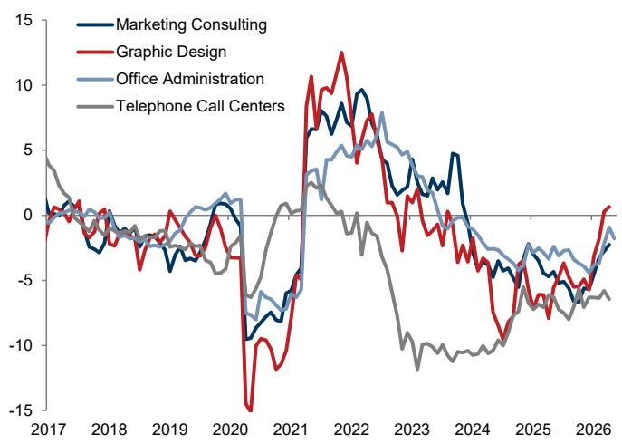  
Source: US Bureau of Labor Statistics, Haver Analytics, GS GIR.  
...with tech's share of total employment continuing to decline relative to its long-run trend

...and tech service sectors where AI use cases have been established...
Year-over-year payrolls growth deviation from 2015-19 trend, tech service sectors, pp

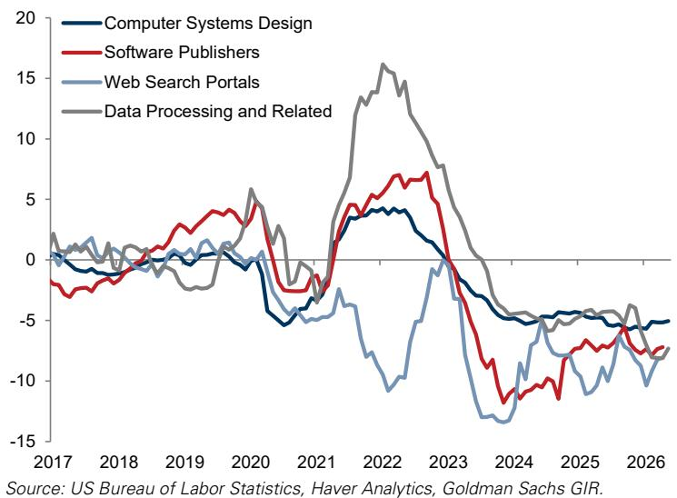  
Tech sector\* share of total employment, %

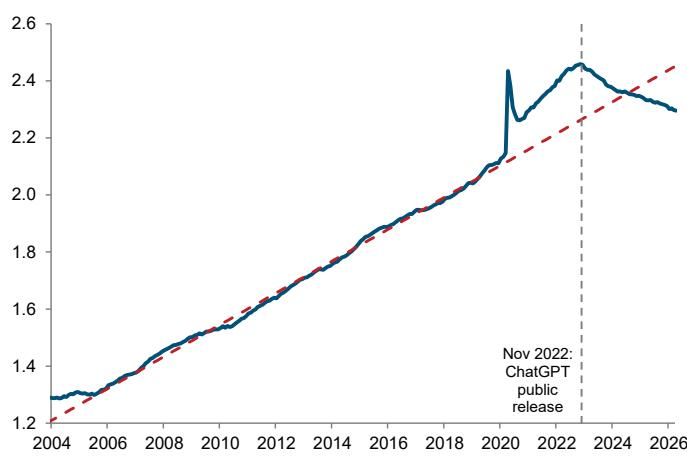  
In aggregate, industries with established AI use cases are seeing employment contract by around 11k per month...  
Avg monthly job growth in AI-affected sectors\*, last 3m, thousands

\*Tech refers to the software publishers, data processing & related, web search & related, and computer systems design subsectors. Red line is 2007-19 trend. Source: US Bureau of Labor Statistics, Haver Analytics, GS GIR.

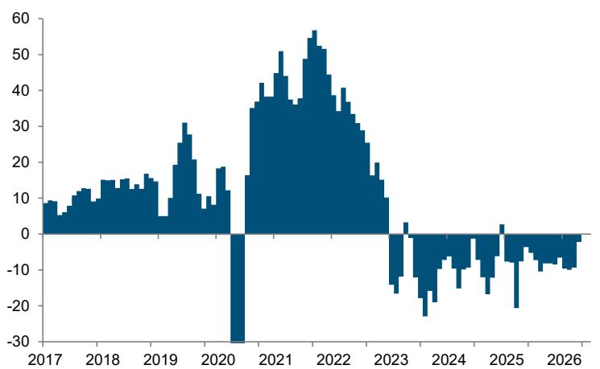  
\*Management consulting, graphic design, office administration, telephone call centers, computer systems, software publishers, web search, data processing, movie production, broadcasting, publishing, and document preparation services.
Source: US Bureau of Labor Statistics, GS GIR.

...and layoffs attributed to AI have accelerated in recent months as many high-profile tech companies have announced layoff plans. Layoffs attributed to each factor in corporate announcements, thousands

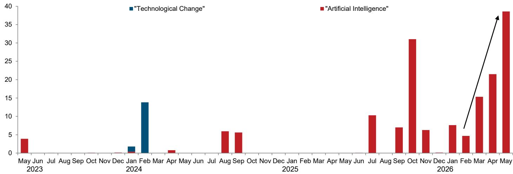  
Source: Challenger, Gray & Christmas, GS GIR.

# ...but overall limited impact so far

Despite this, AI's overall impact on the labor market remains limited, with no statistically significant relationship between AI adoption and unemployment...

Relationship between AI adoption (x-axis) and the unemployment rate (y-axis)\* by industry

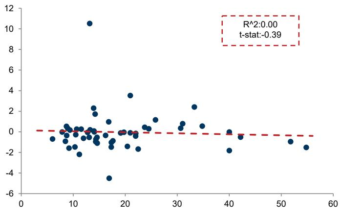  
...AI exposure and unemployment...

...AI adoption and employment growth...
Relationship between AI adoption (x-axis) and employment growth (y-axis)\* by industry

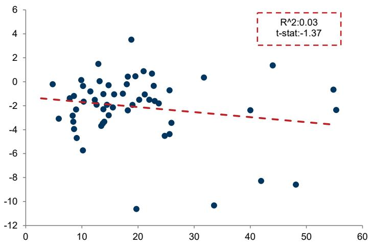  
...or AI exposure and employment growth

Relationship between AI exposure (x-axis) $^{**}$ and the unemployment rate (y-axis) $^{*}$ by industry  
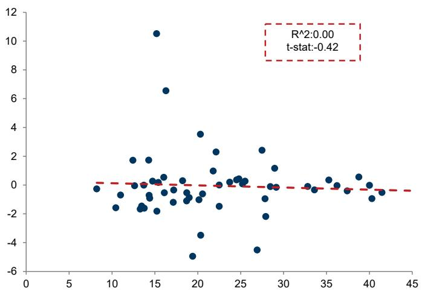  
Relationship between AI exposure (x-axis) $^{**}$ and employment growth (y-axis) $^{*}$ by industry

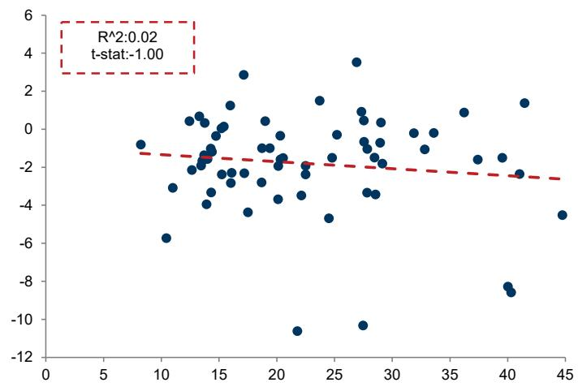  
The correlation between AI exposure/adoption and broad measures of labor market slack also remains limited, though early signs of a negative relationship between AI adoption and job growth and hours worked growth have emerged

Regression of industry-level labor market outcomes on AI exposure (lhs chart) and AI adoption (rhs chart), coefficient\*\*\*  
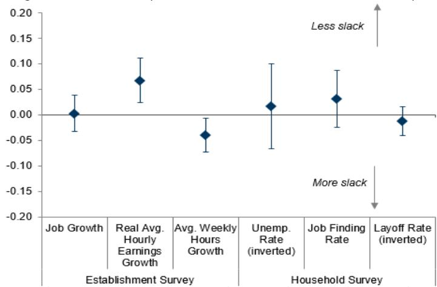  
\*Latest 3m average minus the 2015-2019 average.

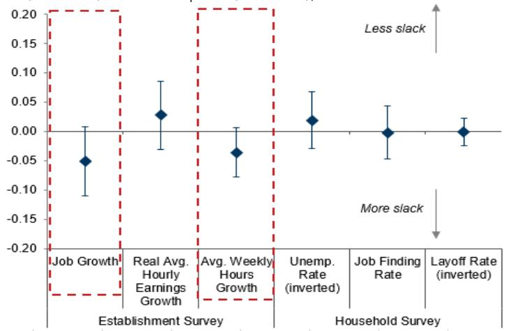  
\*\*See this note for more detail on how we calculate AI exposure scores.  
\*\*\*All dependent variables are taken as the deviation from 2015-2019 averages. Average coefficient over the past three months is plotted.  
Source for all charts: US Bureau of Labor Statistics, IPUMS, US Census Bureau, GS GIR.  
Special thanks to GS global economists Joseph Briggs and Sarah Dong for charts, which were originally featured in the AI Adoption Tracker.

# How much AI labor displacement?

Joseph Briggs argues that while the AI transition could displace more than 9% of workers, the labor market hit should be temporary as new job creation absorbs these losses over the long term

We continue to expect that AI will significantly boost economic activity, with our baseline forecasts assuming a 15% uplift to economy-wide productivity and GDP following full adoption. While the AI transition will undoubtedly lead to some labor displacement, we remain positive on the long-run benefits of AI and expect the new jobs it creates to more than offset any near-term labor market headwinds (which remain modest today, see pgs. 8-9) over the long run.

## Moderate near-term displacement

Last year, we estimated that each 1pp increase in technology-driven productivity growth raises the unemployment rate by 0.3-0.4pp in the near term—as AI-displaced workers experience an extended period of joblessness before finding new work—but that this “frictional” unemployment fades back to zero after two years as workers find new jobs.

Each 1% increase in technology-driven productivity raises the unemployment rate by 0.3-0.4pp
Effect of a 1pp increase in labor productivity due to a positive technology shock on the unemployment rate, pp

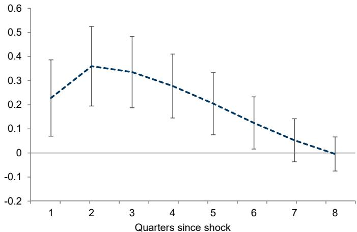  
Source: Gali (1999), GS GIR.

Combining this historical pattern with our baseline forecast for a 15% productivity boost from AI implies that around 6% of workers—equivalent to around 10-11mn workers—would experience an unemployment spell due to AI over its adoption cycle. This estimate is consistent with our bottom-up, task-based analysis of AI displacement risks, that led us to conclude that AI will likely displace 6-7% of workers (with plausible estimates ranging from 3-14%). If adoption occurs over a 10-year period, then the peak impact on the unemployment rate would be a bit more than 0.5pp.

Our prior estimates of the likely rise in the unemployment rate (i.e., the stock of unemployed workers at any given time) likely understate the total amount of displacement (i.e., the flow out of existing jobs) if some workers find new positions quickly after being displaced. Furthermore, some displaced workers

may exit the labor force rather than look for a new job, thereby further dampening the unemployment rate increase.

To finetune our estimates of total displacement, we examine how technology-driven productivity gains impact gross job formation and destruction rates (both measured as the share of overall employment). These updated estimates imply that technology-driven productivity gains modestly lower new job creation (as some businesses pause hiring) and moderately increase job destruction.

Most importantly, our new estimates suggest that each 1% increase in productivity due to technological change cumulatively raises the job destruction rate by around 0.5-0.6pp in the two years following the shock—roughly 50% higher than our prior displacement estimate—implying that up to 9% of workers could be displaced over the entire 10-year AI adoption cycle under our baseline productivity forecast.

Each 1% increase in technology-driven productivity cumulatively raises the job destruction rate by 0.5-0.6pp over two years
Effect of a 1pp increase in labor productivity due to a positive technology shock on gross job formation/destruction, pp

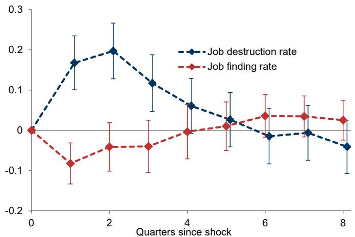  
Source: BLS, GS GIR.

And historical patterns suggest some upside risk to even this larger estimate. Leveraging industry-level, utilization-adjusted total factor productivity shocks (TFP) to help disentangle factors that could amplify job displacement reveals two patterns that suggest further displacement upside.

First, larger TFP shocks tend to lead to greater displacement. For TFP shocks above the 75th percentile of their historical distribution, we find that each 1% boost to productivity raises the cumulative job loss rate by 0.6-0.7% over a two-year window. Given that we anticipate the AI boost to productivity will be larger than most historical episodes, this pattern suggests more scope for displacement during the AI transition.

Second, the effects of productivity shocks were larger in the late 1990s and early 2000s, with each 1% technology-driven boost to productivity cumulatively raising the gross job destruction rate by 0.6-0.7%. Given that the information and communication technology (ICT) productivity boom is the closest historical analogue to the AI productivity boom that we anticipate, this also suggests more scope for displacement.

In light of this new evidence, it seems reasonable to expect that the AI transition could lead to the displacement of over 9% of the labor force—or around 15mn workers. Assuming these

Cumulative effect of a 1% increase in TFP due to a positive technology shock on gross job destruction, pp

<table><tr><td colspan="3">Joseph Briggs, Senior Global Economist</td></tr><tr><td>Email:</td><td>joseph.briggs@gs.com</td><td>GS &amp; Co. LLC</td></tr><tr><td>Tel:</td><td>212-902-2163</td><td></td></tr></table>

job losses are distributed across a 10-year adoption period and that most workers find new work within a year, the unemployment rate would likely still rise by less than 1pp.

We see more scope for displacement given that we expect a large productivity uplift, especially if job losses follow patterns seen in the late 1990s or the goods sector

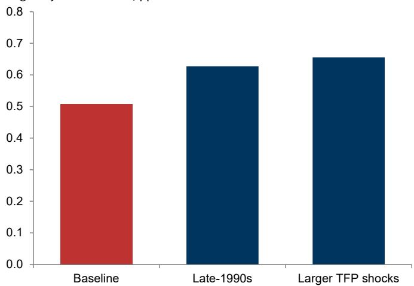  
Source: Fernald (2014), BLS, GS GIR.

## New job creation is a powerful offset to labor disruption

Despite our expectation that AI-related job losses will lead to a meaningful amount of labor displacement, we continue to expect that labor market headwinds will be temporary. Key to this view is our expectation that over the long run AI will create many new jobs even as it destroys existing ones.

Historical evidence provides support for this view. As we've noted, technology has been a key driver of long-run job growth. About $60\%$ of workers today are in occupations that didn't exist in 1940, which account for $85\%$ of the job growth since then.

The US economy creates 25-35mn gross new jobs in a typical year Millions  
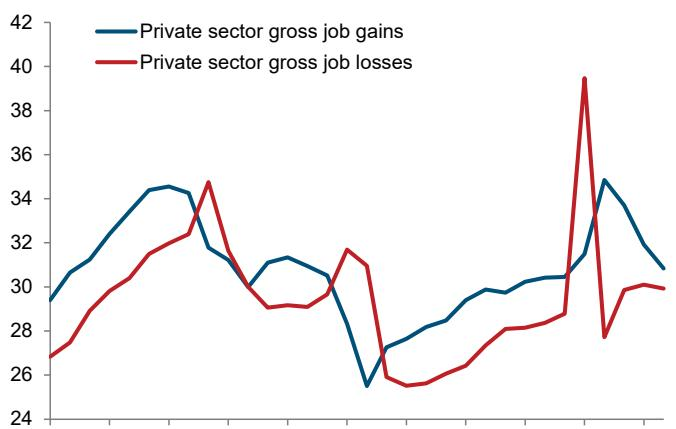  
1993 1996 1999 2002 2005 2008 2011 2014 2017 2020 2023
Source: BLS, Haver Analytics, GS GIR.

Most importantly, the US labor market is incredibly dynamic. Although the US economy adds a few million net jobs per year at most—well below the annual AI-related job losses that we anticipate during the transition—this number is the difference between much larger gross job gains (defined as net job gains at expanding and opening establishments) and gross job losses (defined as net job losses at expanding and closing establishments). These gross measures have historically

fluctuated between 25 and 35mn per year, implying that the economy is constantly creating and destroying jobs, even during normal times.

In a dynamic AI-enabled economy, it is quite plausible that a moderate step-up in the pace of job creation will boost gross job gains enough to absorb most AI-related job losses and mitigate the labor market hit from AI disruption.

Where will these new jobs emerge? It is hard to say exactly, but history again provides a guide.

First, technology can directly create new occupations, as was the case for the nearly 15mn jobs in occupations enabled by the emergence of the digital economy.

Second, it can create new occupations by enabling increased specialization, a dynamic that has been a key driver of the increase in healthcare employment from roughly 2mn to over 18mn over the last 60 years.

Third, technology can indirectly boost discretionary demand in occupations that emerge due to income gains, even if these roles were already technologically feasible. For example, 1mn workers today are employed in industries like pet care, nail salons, educational support/tutoring, and athletic coaching that have grown rapidly in recent decades.

In our view, the combination of these dynamics should create enough new jobs to reabsorb AI-displaced workers, thereby limiting the risks of persistent job loss over the long run.

## Risks around displacement

We see two key risks around our relatively benign AI labor market outlook.

First, even if our updated estimate that the AI transition will displace over 9% of workers is correct, the job losses could be concentrated over a shorter period, resulting in a notably larger rise in the unemployment rate. Indeed, the long-run decline in the “routine occupation” share of the labor force has historically mostly occurred in economic recessions, when the economy is less able to create new positions. The labor market transition would likely be more painful if this dynamic repeats itself, but even in this scenario displacement-related job losses would still likely be temporary.

The second more existential risk is that “this time is different” and AI is fundamentally a more labor-replacing technology than those that inform our historical analysis. While tech sector commentators extrapolating from their own experience tend to lean into this view, we believe that past technology shocks provide a useful guide to the likely labor displacement from AI automation (although effects could be larger if the eventual emergence of AGI eventually makes human input in knowledge-based work tasks redundant).

That said, the answer to “is this time different?” will be hard to prove or disprove until the labor market holds up or doesn’t in the coming years. So, the debate around this question will remain lively for the foreseeable future.

# AI & labor: substitution vs. augmentation

## Elsie Peng investigates AI's impact on the US labor market through two key channels of impact: substitution and augmentation

AI's impact on the US labor market is more nuanced than the headline debate—namely, that AI will either lead to significant job losses or usher in a historic era of productivity growth—suggests. We find that AI is both substituting for labor by performing tasks humans once did and augmenting labor by making workers more productive.

This nuance matters because the aggregate labor market impacts from substitution versus augmentation of labor differ. When AI substitutes for labor, the employment effect is straightforwardly negative—firms automate and hire fewer people. When AI augments labor, the impact is less clear-cut—a more productive worker means that fewer workers produce the same output, but lower production costs may also increase demand sufficiently to create more jobs overall—a dynamic known as the Jevons paradox. In practice, we find that AI augmentation has created jobs, but not enough to fully offset the job losses from AI substitution, resulting in a small net drag on the labor market.

## Complementarity is key

Most AI exposure indices simply measure the overlap between AI capabilities and job requirements. But two occupations with similar AI exposure may differ in their degree of AI “complementarity.” For example, customer service representatives and interior designers face similar levels of AI exposure, but AI is far more complementary to interior designers because their work involves more unstructured tasks and requires a physical presence at worksites that AI cannot yet replicate. Combining an exposure score with a complementarity score $^{1}$ therefore provides a better gauge of AI’s occupation-level impacts. Occupations with high exposure but low complementarity—e.g. telephone operators, insurance claims clerks, and bill collectors—face the highest substitution risk, while occupations with high exposure and high complementarity—e.g. education workers, construction managers, and judges—have the highest augmentation potential.

Whether AI is more likely to augment or substitute for labor depends on its level of exposure and complementarity profile...  
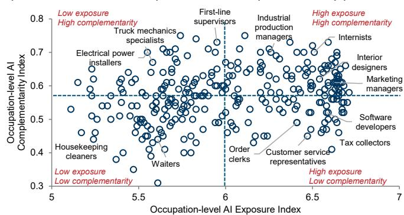  
Source: GS GIR.

...with telephone operators, insurance claims clerks, and bill collectors facing the highest substitution risk and education workers, judges, and construction managers having the highest augmentation potential

Occupations most exposed to AI substitution effect, displacement score  
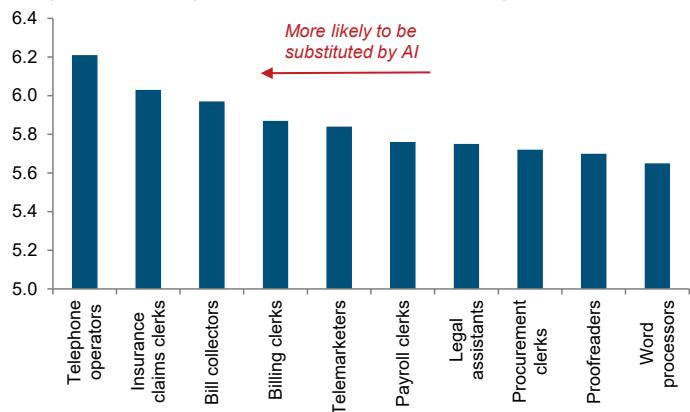

Occupations most exposed to AI augmentation effect, augmentation score  
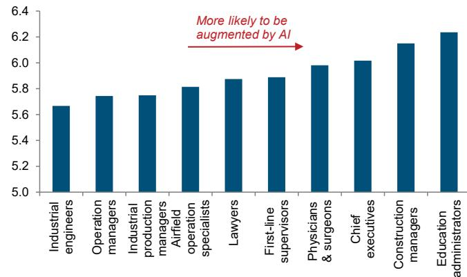  
Source: GS GIR.

## Negative substitution effects, positive augmentation effects

Since ChatGPT's launch in November 2022, this gauge suggests that industries with high AI substitution risk have experienced a notable decline in payroll employment while industries with high augmentation potential have experienced somewhat larger employment gains than those less exposed to AI, especially in recent months. Consistent with this pattern, occupations with high substitution risk have also experienced a larger rise in unemployment rates than other occupations, while those with high augmentation potential have experienced a slightly smaller increase, with much of this divergence emerging since mid-2025 when enterprise AI adoption started to rise (we exclude healthcare, education, and government from this analysis because post-pandemic job growth in these sectors largely reflected catch-up hiring rather than AI effects).

Occupations more exposed to AI substitution have also experienced a sharper decline in job openings, with the effect most visible in computer and information services, sales, and management occupations. By contrast, occupations more likely to be augmented by AI, as well as those with limited AI applicability, have experienced a more gradual normalization toward pre-pandemic baselines.

Jan-18 Jan-19 Jan-20 Jan-21 Jan-22 Jan-23 Jan-24 Jan-25 Jan-26

Since ChatGPT's launch, industries and occupations with high AI substitution risk have experienced larger declines in employment and increases in unemployment on average
Payroll employment by industry exposure to AI, index, 4Q22=100

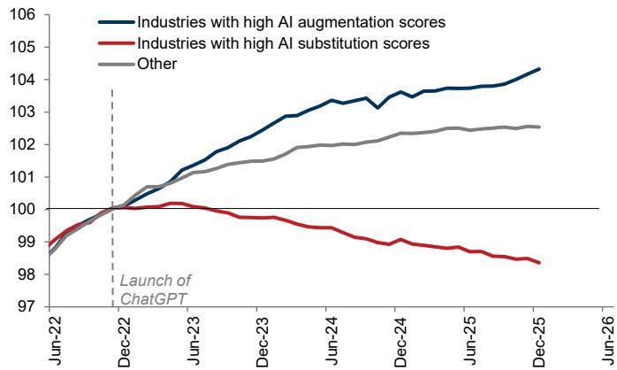  
3m average unemployment rate relative to 4Q22, pp

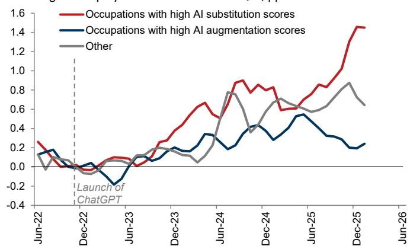  
Source: Department of Labor, GS GIR.

Occupations with high AI substitution risk have experienced larger declines in job openings over the past couple of years
Job openings by AI exposure, index, 4Q19=100

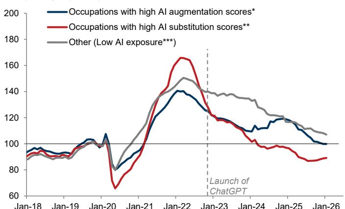

\*We define an occupation as having a high AI augmentation score if only some of its core tasks are automatable by AI, with others still requiring human judgement, creativity, or interpersonal skills.

\*\*We define an occupation as having a high AI substitution score if most of its core tasks can be readily automated.

\*\*\*We define an occupation as having a low AI exposure if only a small share of its core tasks can be automated by AI.

See this note for more details on the methodology.

Source: LinkUp, GS GIR.

## A small labor market drag

This analysis suggests that AI substitution has reduced monthly payroll growth by roughly 25k and raised the unemployment

rate by 0.16pp over the past year. Augmentation has partially offset this shift, adding around 9k to monthly payroll growth and lowering the unemployment rate by 0.06pp. This implies a still-small net Al drag of 16k on monthly payroll growth and a 0.1pp increase in the unemployment rate. Younger and less experienced workers have been hit harder by Al substitution effects, bearing the brunt of the impact, with the wage and unemployment rate gaps between entry-level and experienced workers widening by 1.3% and 0.6pp, respectively, from pre-pandemic averages.

The unemployment rate and wage gaps between entry-level and experienced workers have widened more sharply in occupations more exposed to AI substitution

Standardized measure (x-axis), pp (y-axis)  
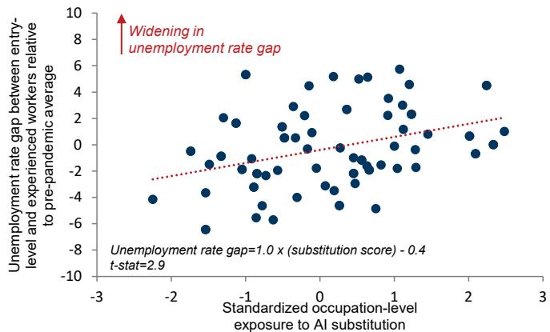

Standardized measure (x-axis), % (y-axis)  
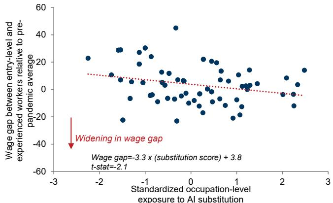

Note: We use age to approximate for work experience. Entry-level workers are defined as workers under the age of 30, and experienced workers are defined as workers aged 31-50. The top chart plots the unemployment rate gap as of January 2026 using the monthly CPS sample, and the bottom chart plots the wage gap as of 2025 using the annual ASEC sample.

Source: Department of Labor, GS GIR.

That said, augmentation measures alone don't fully capture the boost to construction hiring from the AI infrastructure investment boom or the additional labor demand that AI-driven productivity and income gains have generated. So, the true AI drag on the labor market is likely smaller than our estimates imply.

Elsie Peng, US Economist

Email: elsie.peng@gs.com
Tel: 212-357-3137

GS & Co. LLC

# Is AI hurting new graduates?

## Jessica Rindels and Pierfrancesco Mei explore how AI is and will likely impact college graduates' employment prospects

The unemployment rate for US college graduates stood at 2.7% last month, well above the 2019 average of 2.1% and much higher than the unemployment rates for other education levels on a standardized basis (relative to its normal level and volatility over the business cycle). Amid accelerating AI adoption and reports of AI automating routine tasks traditionally done by entry-level white-collar employees, this has raised the question of whether AI adoption is especially tough on new graduates. While some studies have found that AI has had a significant negative impact on early-career workers—including new college graduates—we find little impact on graduates' employment prospects so far. We think this dynamic could change over the near term but are more optimistic about college graduates' prospects over the longer term.

College graduates are currently unemployed at a higher rate than other education levels

Unemployment rates by education level, normalized score

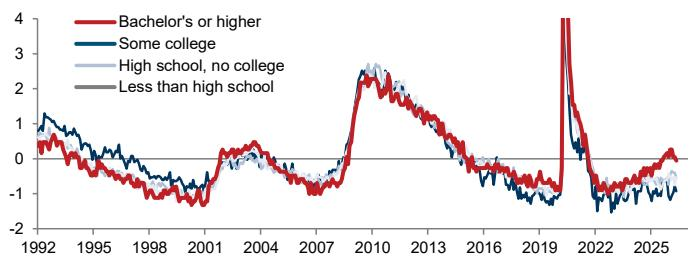  
Source: Department of Labor, GS GIR.

## Little impact so far...

We are less convinced than some others that AI adoption has significantly impacted college graduates' job prospects so far. AI-related employment headwinds have so far been modest and limited to a few specific AI-exposed subindustries, such as software publishing, data processing, and call centers. Notably, the unemployment rate for young tech workers—which rose markedly in 2024—has normalized and is now in line with the unemployment rate for all tech workers. We also find only a slight positive correlation between industry-level AI adoption and unemployment for workers aged 20-30 and college grads.

## ...but some disruption ahead...

That said, we believe AI could impact college graduates more meaningfully ahead, for two reasons.

First, we find a strong positive correlation between the share of workers with a college degree and AI adoption at the industry level, with adoption highest in the management, information services, professional and business services, and finance sectors—where college graduates account for over 60% of the workforce—and lowest in the food services, construction, and transportation sectors—where they account for less than 25%.

Second, we find that college graduates are disproportionately employed in occupations with greater shares of work tasks that could be automated following the full adoption of generative AI. Roughly 40% of employment in legal, architecture and

engineering, and physical, life, and social science occupations—all areas where college graduates account for over 75% of the workforce—is exposed to AI automation, while the comparable figure for construction, repair and maintenance, and grounds cleaning occupations—where college graduates account for only around 10% of the workforce—is less than 10%. College graduates are disproportionately employed in

occupations with greater exposure to AI automation  
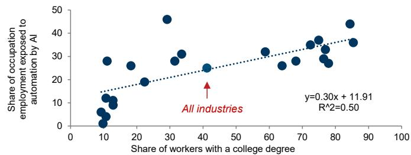  
Source: Department of Labor, GS GIR.

## ...that should be offset in the longer run

While these facts suggest that AI could eventually impact college graduates more meaningfully, several factors should help offset the potential burden over the longer term.

First, higher AI adoption does not necessarily imply greater risk of job displacement because AI can also augment labor and boost employment growth in many occupations, not just substitute for it. Second, we expect AI-related job gains in other areas to partly offset AI-related job displacement, as technological change has historically been a main driver of employment growth via the creation of new occupations.

Third, we find that college graduates and young workers in particular tend to fare better than other education and age cohorts when displaced by new technologies. Relative to these other cohorts, college graduates have historically experienced smaller earnings declines after being displaced from jobs that technology disrupted, and displaced workers under the age of 30 were around 10pp more likely to find a new job in a different occupational category and move up the occupational ladder into positions requiring more advanced skills.

Lastly, we have found that college students are beginning to respond to AI-driven labor market shifts. Over the past year, enrollment in majors such as computer and information sciences—which feed into occupations with high displacement risk and weak recent job growth—has declined while majors such as healthcare and engineering—whose related occupations are less exposed to AI and have experienced stronger job growth—have seen enrollment rise.

Taken together, these patterns suggest that while early-career college graduates may be disproportionately exposed to AI-related employment headwinds in the near term, they will likely adjust more flexibly to potential disruptions through occupational mobility and skill upgrading over the long term.

<table><tr><td colspan="3">Jessica Rindels, US Economist</td></tr><tr><td>Email:</td><td>jessica.rindels@gs.com</td><td>GS &amp; Co. LLC</td></tr><tr><td>Tel:</td><td>972-368-1516</td><td></td></tr><tr><td colspan="3">Pierfrancesco Mei, US Economist</td></tr><tr><td>Email:</td><td>pierfrancesco.mei@gs.com</td><td>GS &amp; Co. LLC</td></tr><tr><td>Tel:</td><td>212-902-8809</td><td></td></tr></table>

Technology-displaced workers face persistently lower earnings... Real hourly wage around displacement, index, 100=year before displacement

# Al's uneven toll on workers

## Pierfrancesco Mei argues that AI will likely have large but uneven impacts on workers

AI is set to significantly reshape the labor market, bringing large productivity gains but uneven consequences for workers, much like past technological shifts. Using history as a guide $^{1}$ , we find that while most workers will benefit from AI-driven gains in productivity and real income, the transition could impose real costs on displaced workers, who face earnings losses, slower career progression, and higher unemployment risk. However, younger, more mobile workers tend to adjust more easily, and retraining can help improve outcomes over time.

Technological displacement shapes workers' trajectories
History offers four main insights into the impact of technological displacement on workers:

1. Workers displaced from technology-disrupted jobs tend to face a somewhat more challenging return to employment than those leaving more stable roles. On average, they take about one month longer to find a new job and incur real earnings losses of over 3% upon reemployment, compared with negligible losses for workers displaced from more stable occupations. This largely owes to occupational downgrading: technology-displaced workers are more likely to move into roles with higher routine content and lower analytical and interpersonal demands, likely reflecting a decline in the market value of their existing skills.

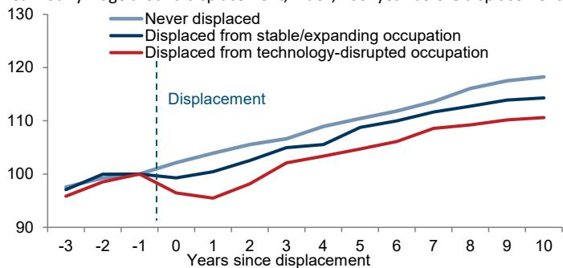  
...and greater job instability in the years following displacement Probability of returning to unemployment in each year since displacement, %

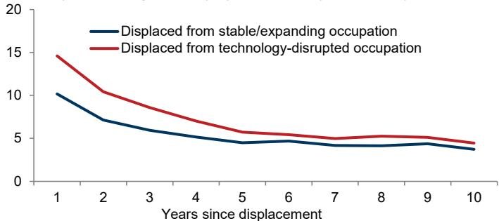  
Source: Census Bureau, US Bureau of Labor Statistics, GS GIR.

2. The effects of technological displacement extend beyond initial job loss. Over the decade following displacement, technology-displaced workers see real earnings grow nearly 10pp less than workers who were never displaced, and roughly 5pp less than workers displaced from non-

technology-impacted occupations. The likelihood of subsequent unemployment also remains higher for technology-displaced workers, particularly in the first five years. And those displaced early in their careers tend to accumulate wealth more slowly—largely due to delayed homeownership—and are slightly less likely to form a household relative to their never-displaced peers.

3. The impact of technological displacement varies widely across workers. Among technology-displaced workers, younger, college-educated, and urban workers tend to experience roughly half the cumulative earnings losses of other technology-displaced workers as greater occupational mobility allows them to move to less routine roles that are less exposed to further displacement risk. Workers with shorter job tenure also tend to fare better, likely because their skills are more readily transferable.

Retraining can also help cushion these impacts. Workers who participate in retraining programs within three years of a job loss achieve \~2pp stronger cumulative real wage growth over the next decade, and their probability of future unemployment declines by \~10pp. This likely reflects skill upgrading as retrained workers tend to move into roles with higher abstract content and greater complementarity with technology, reducing their exposure to further automation.

## 4. Recessions amplify the costs of technological

displacement. Firms tend to shed routine jobs during downturns, and workers displaced by technology in these periods face even wider gaps in outcomes relative to other displaced workers. On average, they spend about three more weeks unemployed and experience a roughly 5pp higher risk of future unemployment and labor force exit.

## Mitigating the costs of technological displacement

All told, as with previous waves of technological change, AI-driven displacement will likely impose real but varied costs on workers—costs that could be larger in the event of a downturn. Encouragingly, however, younger workers most at risk from the erosion of entry-level positions have historically adjusted more quickly to technology-induced shifts in labor demand. And retraining programs can help mitigate these effects for workers across all age groups, helping displaced workers achieve more stable employment and modestly higher wages over time.

Retraining improves outcomes for technology-displaced workers
Outcomes for technology-displaced workers 10 years after displacement, %  
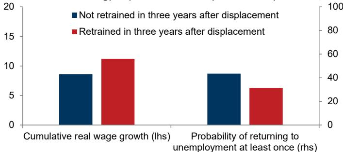

<table><tr><td>Email:</td><td>pierfrancesco.mei@gs.com</td><td>GS &amp; Co. LLC</td></tr><tr><td>Tel:</td><td>212-902-8809</td><td></td></tr></table>

# Corporate take on AI's labor impact

<table><tr><td>Company</td><td>Key message</td><td>Implied workforce impact</td><td>Recent layoff/workforce announcements</td></tr><tr><td>Alphabet (Google)</td><td>Nearly half of all code is generated by AI; agents used in finance teams.</td><td>Leveraging AI to &quot;moderate the pace of headcount growth.&quot;</td><td>Cut an est. 1.5-3k jobs this year, largely in its cloud business, as part of its AI restructuring.</td></tr><tr><td>Amazon</td><td>Scaling robotics and automation is a many-year effort to improve productivity. AI will reinvent every customer experience.</td><td>Decelerating headcount growth (1% yoy in Q1 2026) as automation replaces manual roles.</td><td>In January 2026, Amazon said it would cut 16k additional corporate employees, on top of 14k white-collar layoffs in October 2025.</td></tr><tr><td>Block (Square)</td><td>Strategic shift to an &quot;automated&quot; company; production code changes per engineer increased 2.5x; 60% of code changes now made by non-engineers.</td><td>Workforce reduction plan involves an &quot;increased reliance on automation and AI tools.&quot;</td><td>In February 2026, Block announced a workforce reduction of over 40%, or about 4k employees.</td></tr><tr><td>C.H. Robinson</td><td>Initiated a 2025 Restructuring Program leveraging AI to streamline operations.</td><td>Automating manual tasks to drive operating leverage; focus on decoupling headcount growth from volume growth.</td><td>Average headcount was down about 12% year-over-year in Q1 2026 and was down about 3% sequentially.</td></tr><tr><td>Cisco</td><td>&quot;AgenticOps&quot; is the new operating model for AI-driven IT; 90% of support cases use AI.</td><td>Shifting resources from legacy infrastructure and processes toward investments into silicon, security, and internal AI adoption.</td><td>In May 2026, Cisco laid off ~4k employees as part of its push toward AI adoption. It expects to pay $1bn in termination costs.</td></tr><tr><td>Citi</td><td>AI deployment is transforming operational capabilities and freeing up ~100k hours of developer capacity every week.</td><td>Shifting focus to &quot;next-gen execution&quot; with a leaner, higher-performing team.</td><td>In 2024, Citi announced plans to reduce its workforce by 20k roles over the medium term as part of efforts to streamline operations.</td></tr><tr><td>Cloudflare</td><td>Adopting an agentic AI-first operating model, Cloudflare OS, where AI is a core part of the workforce.</td><td>Internal AI usage has risen; 97% of R&amp;D workers use AI coding tools; AI agents review all production code before deployment.</td><td>In May 2026, Cloudflare announced it was reducing its current workforce by approximately 20% (1.1k).</td></tr><tr><td>Coinbase</td><td>Restructuring to manage operating expenses and &quot;optimize the company for the AI era.&quot;</td><td>65% of customer support is automated; using LLM agents for compliance investigations.</td><td>In May 2026, Coinbase said it was reducing its workforce by 14%, citing the use of AI to improve operations.</td></tr><tr><td>Dow</td><td>Using AI to simplify end-to-end work processes and automate manual hand-offs.</td><td>Reduce workforce as part of cost-saving efforts that will use AI to boost productivity.</td><td>Announced a workforce reduction of 4.5k roles in January 2026 amid increasing use of AI.</td></tr><tr><td>IBM</td><td>$4.5bn productivity gains achieved; uses &quot;IBM Bob&quot;, AI coding agent, to boost software development productivity.</td><td>Transforming into a &quot;hybrid model of people plus software.&quot;</td><td>Reported a $0.3bn &quot;workforce rebalancing&quot; charge in its Q1 2026 earnings results.</td></tr><tr><td>Intuit</td><td>&quot;System of intelligence&quot; strategy leverages AI + HI (Human Intelligence) to complete complex jobs on behalf of customers.</td><td>Shifting from manual reporting to AI agents; coders delivering 39% more code while achieving 40% faster coding speeds.</td><td>Announced 17% reduction in full-time workforce in May 2026 to simplify structure and accelerate AI.</td></tr><tr><td>Meta Platforms</td><td>AI is enabling single individuals to do projects that used to require big teams. Agentic coding is driving a 30-80% increase in output per engineer.</td><td>Organization is &quot;flattening&quot;; saving resources to invest in &quot;superintelligence.&quot;</td><td>In April 2026, Meta announced it will lay off about 10% of its workforce to streamline operations and help fund more investment in AI.</td></tr><tr><td>Microsoft</td><td>Focusing on building high-performing teams and evolving operations to increase pace and agility.</td><td>Continued investment toward AI, R&amp;D compute capacity, and talent while overall headcount contracts.</td><td>FY2026 guidance expects decline in yoy headcount; voluntary retirement buyouts impacting up to 7% of its US workforce; Xbox division plans to announce significant layoffs in July 2026.</td></tr><tr><td>Nasdaq</td><td>Established a dedicated AI Integration Team to streamline implementation and accelerate adoption across functions.</td><td>Shift human roles from resource-intensive manual workflows to high-value investigation.</td><td>Established a $100mn AI expense efficiency target; said areas in finance, marketing, legal and HR could see headcount reductions.</td></tr><tr><td>Oracle</td><td>AI &quot;fusion agentic apps&quot; autonomously execute routine work.</td><td>Optimizing labor costs and reducing time spent on manual coordination.</td><td>Some estimates suggest Oracle could cut up to 30k jobs this year as part of targeted moves toward operational efficiencies to offset the significant capacity buildout.</td></tr><tr><td>Pinterest</td><td>50% of code is AI-generated; reallocating resources to AI roles.</td><td>Strategic shift to &quot;AI-powered&quot; destination.</td><td>Recorded a roughly $47mn restructuring charge in its Q1 2026 results.</td></tr><tr><td>Salesforce</td><td>Shift toward an &quot;Agentic Enterprise&quot; with AI agents driving greater productivity and operational efficiency.</td><td>Ongoing workforce and office space reduction to drive greater operational efficiencies; redeployment of roles to high growth areas.</td><td>In February 2026, Salesforce cut 1k roles with another round of layoffs in June 2026 across sales, admin, tech, and product roles.</td></tr><tr><td>ServiceNow</td><td>Introduction of &quot;autonomous workforce&quot; with AI specialists designed to execute jobs end-to-end.</td><td>AI agents handle ~90% of internal support and customer service requests; automating tasks in finance, marketing, legal, and HR.</td><td>In June 2026, ServiceNow announced layoffs to hundreds of staff, saying that &quot;real AI efficiencies&quot; are being generated.</td></tr><tr><td>Snap</td><td>40% of new code is AI-generated; AI enables &quot;small squads&quot; to do more.</td><td>Reduction of repetitive work; shift from AI R&amp;D to deployment phase.</td><td>In April 2026, Snap said it would cut 1k jobs as it gains efficiency through deploying AI.</td></tr><tr><td>Verizon</td><td>Transformation into an &quot;AI-first&quot; company. Beginning to embed AI and automation into operations and customer interactions.</td><td>Shift toward hiring &quot;AI-savvy&quot; individuals to complement the workforce; focus on using AI to replace a large share of customer service jobs.</td><td>Cut 13k jobs in Q4 2025, though Verizon framed the move as a response to customer churn/earnings pressures. Set up a $20mn fund to re-skill laid off workers with AI skills.</td></tr><tr><td>Walmart</td><td>AI and automation will drive labor productivity and lower marginal costs.</td><td>Growth at a lower marginal cost; focus on upskilling roles for &quot;retail&#x27;s next era.&quot;</td><td>In May 2026, Walmart said it could cut or relocate about 1k workers as it combines more of its technology and product teams.</td></tr><tr><td>Workday</td><td>Strategic pivot to agentic AI that automates workflows while maintaining human-in-the-loop guardrails.</td><td>&gt;50% of committed code is AI generated; 22% growth in engineering output over last 6m; dev. timelines reduced to 3m driven by AI.</td><td>Eliminated about 400 jobs in February 2026 within Global Customer Operations which also includes customer support roles.</td></tr></table>

Note: Table does not constitute an exhaustive list of company commentary on AI and recent corporate layoffs. Source: Company data, AlphaSense, WSJ, various news sources, compiled by GS GIR.

# AI: limited labor productivity uplift so far

## Ryan Hammond argues that AI's impact on labor and profits remains uncertain, keeping focus on infrastructure beneficiaries for now

While recent corporate layoff announcements (see pg. 16) have intensified concerns about AI-driven job losses, uncertainty remains high about how AI will ultimately impact companies' labor force needs and, in turn, corporate profits. The key question is whether AI will be revenue-enhancing (i.e., generate more revenues with the same labor force), margin-enhancing (i.e., generate similar revenues with a smaller labor force), or both. The earnings impact will also depend on the timeline of corporate AI adoption and how much of the labor productivity gains accrue to capital. Given this uncertainty, investors have continued to favor companies with tangible near-term earnings benefits, which are largely concentrated in the AI infrastructure complex. We expect this to eventually broaden to include labor productivity beneficiaries, but only as more definitive evidence of an earnings uplift emerges.

## AI workforce impact remains uncertain

Corporate commentary during 1Q26 earnings season indicated that uncertainty around AI's impact is unlikely to be resolved in the near term. Enterprise AI adoption remains nascent, consistent with broader economy-wide adoption surveys. While $54\%$ of S&P 500 companies discussed AI in the context of labor productivity in Q1 earnings calls, only $11\%$ quantified AI labor productivity gains in specific use cases (vs. $10\%$ in the prior quarter)—largely in coding, engineering, call centers, customer support, and marketing. And just $2\%$ of firms tied such gains to earnings, with the majority of those firms focused on quantifying the cost savings related to AI labor productivity.

At the same time, rising concerns around token economics—which have improved (see pg. 18) but remain challenging, with several companies flagging the high costs associated with token usage in recent commentary and capping employee token budgets—suggest that the upfront costs associated with AI consumption could offset some of the potential earnings uplift from increased labor productivity.

Only 2% of companies tied AI productivity gains to earnings in Q1 Share of S&P 500 firms discussing AI productivity on earnings calls, %  
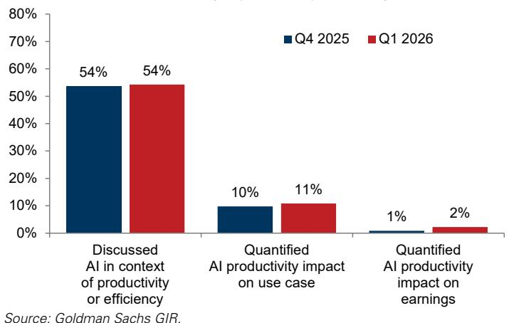

## Markets aren't buying it (yet)

Intra-market performance suggests investors share this uncertainty about the long-term impact of AI on companies' labor forces and earnings. Share price performance following Q1 earnings results did not meaningfully differ between companies that discussed AI productivity benefits and those that did not. And a basket of stocks that have mentioned specific plans to implement AI into their internal workflows (GSXUPROD $^{1}$ ) has traded sideways relative to the equal-weight S&P 500 during the past few years (+33% vs. +27%).

Our basket of stocks with the largest potential earnings upside from AI productivity gains (GSTHLTAI) sends a similar signal $^{2}$ . The sector-neutral basket has lagged the equal-weight S&P 500 since the end of 2023 and has traded sideways on a relative basis in the past two months (+1% vs. +3%). This suggests investors are not yet confident that AI-driven productivity gains will translate into a meaningful earnings boost.

Infrastructure still leads the AI trade... but likely not forever
Investors have instead continued to reward companies seeing more meaningful near-term earnings benefits from AI, which are mostly concentrated in the infrastructure complex. A basket of AI infrastructure stocks (GSCBAIP2 $^{3}$ ) has risen by 74% YTD, outperforming the equal-weight S&P 500 by 65pp, with gains largely driven by positive earnings revisions. We expect this dynamic to persist in the near term. While consensus estimates imply hyperscaler capex of 920bn in 2027—implying a sharp deceleration in growth from 84% in 2026 to 22% in 2027—we believe these estimates are too conservative. Continued robust capex growth should support further earnings and share price upside for AI infrastructure beneficiaries in the near term, albeit with more volatility.

Eventually, we expect investors to broaden their exposure beyond the AI infrastructure complex to subsequent phases of the AI trade, including labor productivity beneficiaries. However, this shift will likely require clear evidence of a meaningful and tangible earnings impact, which may take time to emerge.

The AI infrastructure complex has outperformed the equal-weight S&P 500 since the end of 2023

Indexed return of AI-related portfolios vs. equal-weight S&P 500  
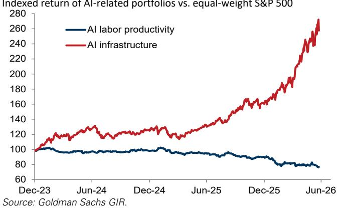

<table><tr><td colspan="3">Ryan Hammond, Senior US Equity Strategist</td></tr><tr><td>Email:</td><td>ryan.hammond@gs.com</td><td>GS &amp; Co. LLC</td></tr><tr><td>Tel:</td><td>212-902-5625</td><td></td></tr></table>

# AI agents vs. humans: who costs more?

As token unit costs fall, AI agents are becoming increasingly competitive with human labor across a wider range of enterprise workflows. Simulating agent workloads across coding, call center, and data-entry tasks, we find that even million-token daily workflows can compare favorably with human labor costs—especially as token unit costs continue to fall—with meaningful implications for margins and returns for both AI model makers and enterprise end-users.

## What AI agents and tokens actually are

AI agents can do much more than traditional chatbots; they can plan, use tools, validate work, and take actions with limited human input. Tokens are the unit that powers this activity, and as agents become more capable, they consume vastly more tokens.

## Token economics are turning more favorable

Agentic AI will likely continue driving token consumption, just as token unit economics are improving. We estimate that global token demand could rise by roughly 24x by 2030 versus 2026 levels, reflecting growing consumer and enterprise AI agent adoption. More importantly, all-in token production costs appear to be falling faster and more consistently than expected, even as leading token prices have begun to stabilize in some areas. This suggests that the industry may be entering a new phase where increased token usage can support not only revenue growth, but also incremental margin expansion for hyperscalers and model makers.

  
Note: Token costs are the total computing costs realized by hyperscalers and model makers; token prices are the prices charged to enterprises and end-users. Source: Data compiled by GS GIR.

## Falling token costs can expand the AI frontier

As token unit costs continue to decline, AI agents may become increasingly economical relative to human labor, expanding the range of enterprise workflows that firms can automate at an attractive return on investment (ROI). Coding is a compelling example: It is high value, largely text-based, and supported by a mature tooling stack, which allows even token-heavy agentic workflows to remain less expensive than equivalent human labor. Other categories that are operationally harder and more expensive to execute like real-time voice and call center automation are more constrained for now. However, the broader trend is clear: ongoing declines in token costs and, in turn, prices may lower the breakeven point for automation and render more AI use cases economically viable.

Coding agents are currently cost effective against human labor, while other categories remain more constrained for now  
Human vs. AI cost per day (lhs, \$) and tokens consumed per day (rhs, count)  
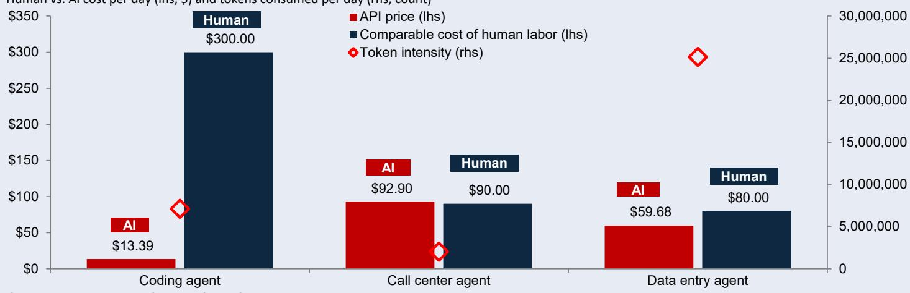  
Source: Data compiled by GS GIR.

<table><tr><td>Email:</td><td>jim.schneider@gs.com</td><td>GS &amp; Co. LLC</td></tr><tr><td>Tel:</td><td>212-357-2929</td><td></td></tr></table>

# Prior tech transitions & the labor market

Growing concerns about an AI job apocalypse have sparked fears that humans could “go the way of horses” as production inputs...

US equine population for production purposes, mn  
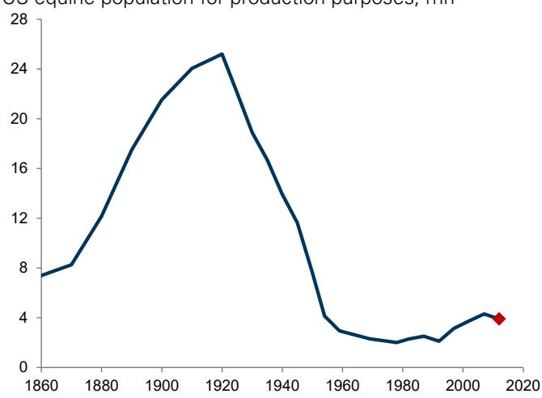  
Source: GS GIR.

...but technological replacement potential does not always lead to job losses, as evidenced by continued employment growth in roles such as fitness trainers and real estate agents
Employment in technology-disrupted discretionary services, index, 2015=100

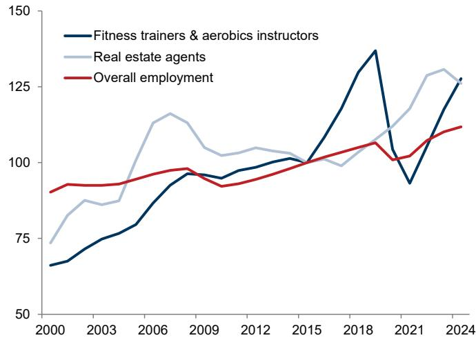  
In fact, technological change has been a key driver of employment growth via the creation of new occupations... Employment by new and pre-existing occupations, mn

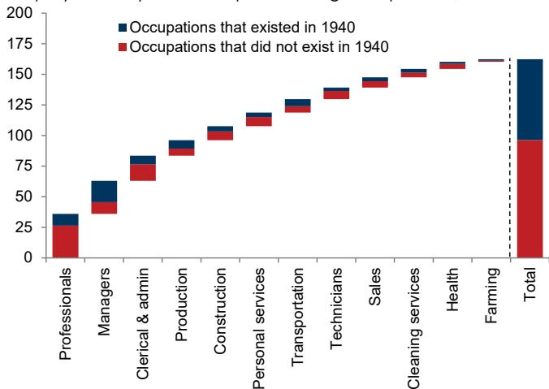  
Source: Autor et al. (2022), GS GIR.  
Source: US Bureau of Labor Statistics, Haver Analytics, GS GIR. ...and, historically, the creation of new roles has roughly offset worker displacement from automation

Contributions to total wage bill growth, pp

Technology can also create new and more specialized roles within an occupation, as has been the case for healthcare
Distinct healthcare occupations according to the Census Alphabetical Occupation Index, count

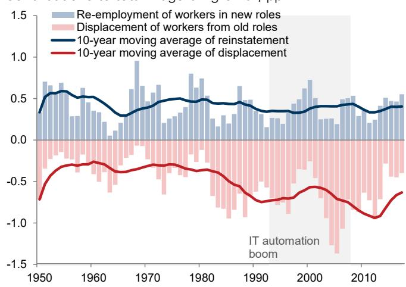  
Source: Acemoglu and Restrepo (2019), GS GIR.

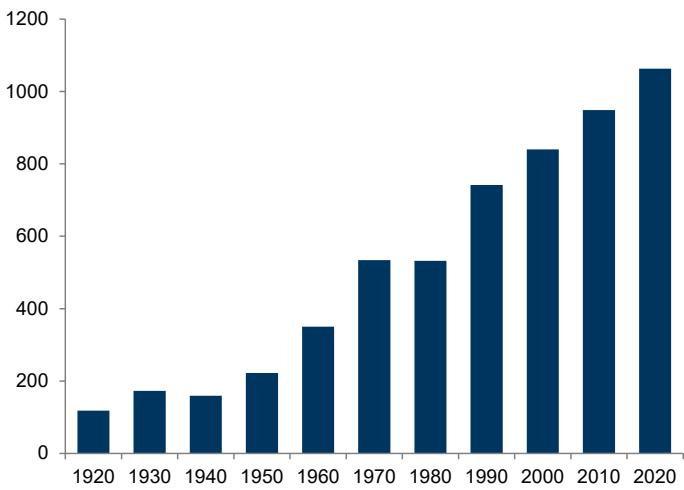  
Source: Census Bureau, GS GIR.  
But even as technology creates new jobs, it also leads to a rise in frictional unemployment as workers transition to these jobs—a pattern we expect to persist under greater AI adoption. Effect of a 1pp increase in labor productivity due to a technology shock on the unemployment rate, pp  
Special thanks to GS global economists Joseph Briggs and Sarah Dong for charts.

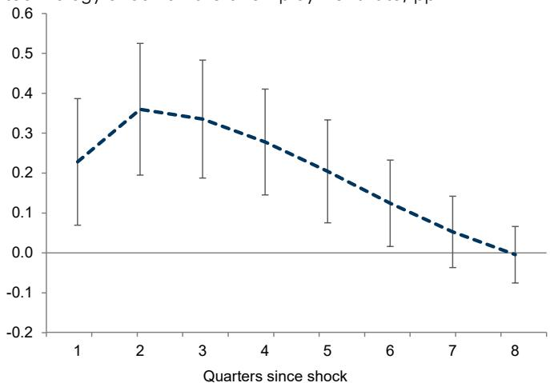  
Source: Gali (1999), GS GIR.

Forecasts

# Summary of our key forecasts

Watching

\- Globally, we expect real GDP growth to slow to 2.4% yoy in 2026 amid lingering headwinds from the rise in energy prices from the Iran conflict. We expect global core inflation to end the year at 2.9%, reflecting a fading tariff boost and further normalization in shelter and wage inflation but a boost from energy price passthrough.
- In the US, we expect moderate real GDP growth of 2.0% on a Q4/Q4 basis in 2026, reflecting still-subdued consumer spending growth but a boost from the AI boom via higher equity wealth as well as strong capex. We expect core PCE inflation of 3.2% by December 2026 given the effects of tariffs, energy price passthrough, AI demand exaggerated by measurement issues, and higher financial services prices, with it falling closer to 2% in 2027. We expect the unemployment rate to end 2026 at 4.4%.
- We expect the Fed to leave the policy rate unchanged at 3.5-3.75% this year, though the hawkish June FOMC meeting raises the risk of interest rate hikes later this year.
- In the Euro area, we expect real GDP growth to improve in 2H26 given easing financial conditions and likely lower energy prices for full-year real GDP growth of 0.5% yoy. We expect core inflation to rise to a peak of 2.6% yoy in 4Q26 amid lingering energy price passthrough before declining to 2.0% by end-2028.
- We expect the ECB to deliver one more 25bp hike in September to a peak policy rate of 2.5% before cutting back to 2% in 2027.
- In China, we expect sequential growth to rebound in 3Q26 from 2Q26 as the oil shock reverses and fiscal spending increases for full-year real GDP growth of 4.7% yoy. We expect CPI/PPI inflation to rise to 1.0%/2.0% yoy this year largely owing to commodity price passthrough.
- WATCH THE US-IRAN AGREEMENT. The agreement between the US and Iran has reduced the downside risks to our economic outlook, though the situation remains uncertain and we will be closely watching how oil flows through the Strait of Hormuz evolve from here.

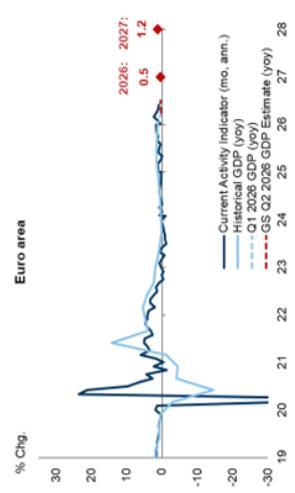

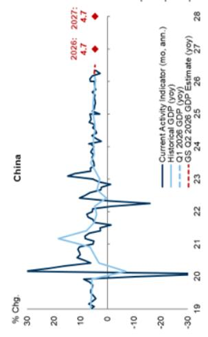  
Growth

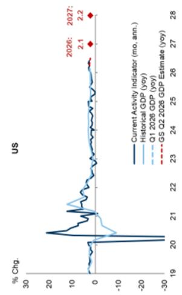

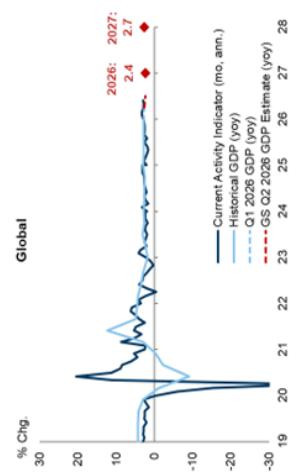

<table><tr><td colspan="7">Economics</td><td colspan="7">Markets</td><td colspan="9">Equities</td><td></td></tr><tr><td rowspan="2">GDP growth (%)</td><td colspan="4">2026</td><td colspan="2">2027</td><td rowspan="2">Interest rates 10Yr (%)</td><td rowspan="2">Last</td><td rowspan="2">E2026</td><td rowspan="2">E2027</td><td rowspan="2">FX</td><td rowspan="2">Last</td><td rowspan="2">3m</td><td rowspan="2">12m</td><td rowspan="2">S&amp;P 500</td><td colspan="2">E2026</td><td colspan="2">E2027</td><td rowspan="2">Returns (%)</td><td rowspan="2">12m</td><td rowspan="2">YTD</td><td rowspan="2">E2026 P/E</td></tr><tr><td>GS (Q4/Q4)</td><td>Cons. (Q4/Q4)</td><td>GS (CY)</td><td>Cons. (CY)</td><td>GS (CY)</td><td>Cons. (CY)</td><td>GS</td><td>Cons.</td><td>GS</td><td>Cons.</td></tr><tr><td>Global</td><td>2.3</td><td>--</td><td>2.4</td><td>2.5</td><td>2.7</td><td>2.6</td><td>US</td><td>4.41</td><td>4.40</td><td>4.25</td><td>EUR/$</td><td>1.13</td><td>1.14</td><td>1.20</td><td>Price</td><td colspan="2">8,000</td><td colspan="2"></td><td>S&amp;P 500</td><td>12.8</td><td>7.5</td><td>22.4x</td></tr><tr><td>US</td><td>2.0</td><td>2.0</td><td>2.1</td><td>2.2</td><td>2.2</td><td>2.1</td><td>Germany</td><td>2.87</td><td>3.00</td><td>3.00</td><td>GBP/$</td><td>1.32</td><td>1.33</td><td>1.33</td><td>EPS</td><td>$340</td><td>$341</td><td>$385</td><td>$398</td><td>MXAPJ</td><td>21.2</td><td>23.4</td><td>14.1x</td></tr><tr><td>China</td><td>4.6</td><td>4.5</td><td>4.7</td><td>5.0</td><td>4.7</td><td>4.6</td><td>Japan</td><td>2.67</td><td>2.50</td><td>2.25</td><td>$/JPY</td><td>162</td><td>160</td><td>155</td><td>Growth</td><td>24%</td><td>24%</td><td>13%</td><td>17%</td><td>Topix</td><td>11.0</td><td>16.3</td><td>18.8x</td></tr><tr><td>Euro area</td><td>0.6</td><td>0.6</td><td>0.5</td><td>1.4</td><td>1.2</td><td>0.6</td><td>UK</td><td>4.56</td><td>4.50</td><td>4.35</td><td>$/CNY</td><td>6.79</td><td>6.80</td><td>6.50</td><td colspan="3"></td><td colspan="2"></td><td>STOXX 600</td><td>2.9</td><td>8.3</td><td>15.4x</td></tr><tr><td rowspan="2">Policy rates (%)</td><td colspan="4">2026</td><td colspan="2">2027</td><td>Commodities</td><td>Last</td><td>2Q26</td><td>4Q26</td><td rowspan="2">Credit (bp)</td><td rowspan="2">Last</td><td rowspan="2">2Q26</td><td rowspan="2">4Q26</td><td rowspan="2">Consumer</td><td colspan="2">2026</td><td colspan="2">2027</td><td colspan="4">Wage Tracker 2026 (%)</td></tr><tr><td>GS</td><td colspan="3">Mkt.</td><td>GS</td><td>Mkt.</td><td>Crude Oil, Brent ($/bbl)</td><td>74</td><td>98</td><td>80</td><td>CPI (%, yoy)</td><td>Unemp. Rate</td><td>CPI (%, yoy)</td><td>Unemp. Rate</td><td>Q1</td><td>Q2</td><td>Q3</td><td>Q4</td></tr><tr><td>US</td><td>3.63</td><td colspan="3">3.98</td><td>3.13</td><td>3.85</td><td>Nat Gas, NYMEX ($/mmBtu)</td><td>3.22</td><td>2.95</td><td>3.50</td><td>USD</td><td>IG</td><td>74</td><td>73</td><td>82</td><td>US</td><td>3.3</td><td>4.4</td><td>2.4</td><td>4.3</td><td>3.5</td><td>3.3</td><td>--</td></tr><tr><td>Euro area</td><td>2.50</td><td colspan="3">2.47</td><td>2.00</td><td>2.42</td><td>Nat Gas, TTF (EUR/MWh)</td><td>40.95</td><td>47</td><td>40</td><td></td><td>HY</td><td>277</td><td>275</td><td>295</td><td>Euro area</td><td>2.9</td><td>6.3</td><td>2.4</td><td>6.2</td><td>-</td><td>-</td><td>--</td></tr><tr><td>China</td><td>1.40</td><td colspan="3">1.29</td><td>1.30</td><td>--</td><td>Copper ($/mt)</td><td>13,030</td><td>13,400</td><td>13,700</td><td>EUR</td><td>IG</td><td>90</td><td>88</td><td>88</td><td>China</td><td>1.0</td><td>--</td><td>1.0</td><td>--</td><td>-</td><td>-</td><td>--</td></tr><tr><td>Japan</td><td>1.00</td><td colspan="3">1.21</td><td>1.50</td><td>1.73</td><td>Gold ($/troy oz)</td><td>4,024</td><td>4,583</td><td>4,836</td><td></td><td>HY</td><td>265</td><td>277</td><td>315</td><td colspan="2"></td><td colspan="2"></td><td colspan="4"></td></tr></table>

# Glossary of GS proprietary indices

## Current Activity Indicator (CAI)

GS CAIs measure the growth signal in a broad range of weekly and monthly indicators, offering an alternative to Gross Domestic Product (GDP). GDP is an imperfect guide to current activity: In most countries, it is only available quarterly and is released with a substantial delay, and its initial estimates are often heavily revised. GDP also ignores important measures of real activity, such as employment and the purchasing managers' indexes (PMIs). All of these problems reduce the effectiveness of GDP for investment and policy decisions. Our CAIs aim to address GDP's shortcomings and provide a timelier read on the pace of growth.

For more, see our CAI page and Global Economics Comment: Technical Updates to Our Global CAIs.

## Dynamic Equilibrium Exchange Rates (DEER)

The GSDEER framework establishes an equilibrium (or “fair”) value of the real exchange rate based on relative productivity and terms-of-trade differentials.

For more, see our GSDEER page, Global Economics Paper No. 227: Finding Fair Value in EM FX, 26 January 2016, and Global Markets Analyst: A Look at Valuation Across G10 FX, 29 June 2017.

## Financial Conditions Index (FCI)

GS FCIs gauge the “looseness” or “tightness” of financial conditions across the world’s major economies, incorporating variables that directly affect spending on domestically produced goods and services. FCIs can provide valuable information about the economic growth outlook and the direct and indirect effects of monetary policy on real economic activity.

FCIs for the G10 economies are calculated as a weighted average of a policy rate, a long-term risk-free bond yield, a corporate credit spread, an equity price variable, and a trade-weighted exchange rate; the Euro area FCI also includes a sovereign credit spread. The weights mirror the effects of the financial variables on real GDP growth in our models over a one-year horizon. FCIs for emerging markets are calculated as a weighted average of a short-term interest rate, a long-term swap rate, a CDS spread, an equity price variable, a trade-weighted exchange rate, and—in economies with large foreign-currency-denominated debt stocks—a debt-weighted exchange rate index.

For more, see our FCI page, Global Economics Analyst: Our New G10 Financial Conditions Indices, 20 April 2017, and Global Economics Analyst: Tracking EM Financial Conditions – Our New FCIs, 6 October 2017.

## GS Analyst Index (GSAI)

The US GSAI is based on a monthly survey of GS equity analysts to obtain their assessments of business conditions in the industries they follow. The results provide timely “bottom-up” information about US economic activity to supplement and cross-check our analysis of “top-down” data. Based on analysts’ responses, we create a diffusion index for economic activity comparable to the ISM’s indexes for activity in the manufacturing and nonmanufacturing sectors.

## Macro-Data Assessment Platform (MAP)

GS MAP scores facilitate rapid interpretation of new data releases for economic indicators worldwide. MAP summarizes the importance of a specific data release (i.e., its historical correlation with GDP) and the degree of surprise relative to the consensus forecast. The sign on the degree of surprise characterizes underperformance with a negative number and outperformance with a positive number. Each of these two components is ranked on a scale from 0 to 5, with the MAP score being the product of the two, i.e., from -25 to +25. For example, a MAP score of +20 (5;+4) would indicate that the data has a very high correlation to GDP (5) and that it came out well above consensus expectations (+4), for a total MAP value of +20.

# Top of Mind archive: click to access

Issue 148
Cracks in private credit
April 27, 2026

Issue 147
Iran conflict: how long, and how bad?
March 20, 2026

Issue 146
Will AI eat software?
March 12, 2026

Issue 145
Americas First
January 26, 2026

Special Issue
2025: 4 themes in charts
December 15, 2025

Issue 144
The US-China tech race
December 4, 2025

Issue 143
AI: in a bubble?
October 22, 2025

Issue 142
Data (un)reliability
September 11, 2025

Issue 141
Stablecoin summer
August 19, 2025

Issue 133
Market concentration: how big a worry?
November 25, 2024

Issue 129
Gen AI: too much spend, too little benefit?
June 25, 2024

Issue 130
How investable is Europe?
August 1, 2024

Issue 128 Central bank divergence room to run? May 21, 2024

Special Issue
2024: 4 themes in charts
December 18, 2024

Issue 140
US fiscal worries: Is this time different?
June 12, 2025

Issue 131
Is the Fed behind the curve?
September 3, 2024

Issue 132
Post-election economic policies
October 21, 2024

Source of photos: www.gettyimages.com.

Issue 127
Weighing the GLP-1 market
April 12, 2024

Issue 126
Global transit & trade: in rough waters
March 12, 2024

Issue 139
Fed independence: how concerning?
May 15, 2025

Issue 134
Will China's policy stimulus be enough?
December 11, 2024

Issue 125
2024: The year of elections
February 1, 2024

Issue 137
Europe's shifting security landscape
March 13, 2025

Issue 136
Trump tariffs: mostly talk, or big action?
February 26, 2025

Issue 124
Middle East risks
December 5, 2023

Issue 135
High bond yields: here to stay?
February 5, 2025

Issue 123 US outperformance: at a turning point? October 30, 2023

Issue 122
Commercial real estate risks
October 9, 2023

Issue 121
Corporate credit concerns
August 10, 2023

Issue 120
Generative AI: hype, or truly transformative?
July 5, 2023

Issue 119
Daunting debt limit dynamics
May 22, 2023

Issue 118 US-China: more decoupling ahead? May 1, 2023

Issue 117
All about bank(panic)s
April 3, 2023

## Disclosure Appendix

## Reg AC

We, Allison Nathan, Jenny Grimberg, Ashley Rhodes, Joseph Briggs, Ryan Hammond, Pierfrancesco Mei, Elsie Peng, and Jessica Rindels, hereby certify that all of the views expressed in this report accurately reflect our personal views, which have not been influenced by considerations of the firm's business or client relationships.

We, James Schneider and Luya You, hereby certify that all of the views expressed in this report accurately reflect our personal views about the subject company or companies and its or their securities. We also certify that no part of our compensation was, is or will be, directly or indirectly, related to the specific recommendations or views expressed in this report.

Unless otherwise stated, the individuals listed on the cover page of this report are analysts in GS' Global Investment Research division.

Contributing Authors: Allison Nathan GS & Co. LLC, Jenny Grimberg GS & Co. LLC, Ashley Rhodes GS & Co. LLC, Ryan Hammond GS & Co. LLC, Pierfrancesco Mei GS & Co. LLC, Elsie Peng GS & Co. LLC, Jessica Rindels GS & Co. LLC, James Schneider, Ph.D., GS & Co. LLC, and Luya You GS & Co. LLC

Unless otherwise stated, the individuals listed in the Contributing Authors disclosure of this report are analysts in GS' Global Investment Research division.

## Regulatory disclosures

## Disclosures required by United States laws and regulations

See company-specific regulatory disclosures above for any of the following disclosures required as to companies referred to in this report: manager or co-manager in a pending transaction; 1% or other ownership; compensation for certain services; types of client relationships; managed/co-managed public offerings in prior periods; directorships; for equity securities, market making and/or specialist role. GS trades or may trade as a principal in debt securities (or in related derivatives) of issuers discussed in this report.

The following are additional required disclosures: Ownership and material conflicts of interest: GS policy prohibits its analysts, professionals reporting to analysts and members of their households from owning securities of any company in the analyst's area of coverage. Analyst compensation: Analysts are paid in part based on the profitability of GS, which includes investment banking revenues. Analyst as officer or director: GS policy generally prohibits its analysts, persons reporting to analysts or members of their households from serving as an officer, director or advisor of any company in the analyst's area of coverage. Non-U.S. Analysts: Non-U.S. analysts may not be associated persons of GS & Co. LLC and therefore may not be subject to FINRA Rule 2241 or FINRA Rule 2242 restrictions on communications with a subject company, public appearances and trading in securities covered by the analysts.

Distribution of ratings: See the distribution of ratings disclosure above. Price chart: See the price chart, with changes of ratings and price targets in prior periods, above, or, if electronic format or if with respect to multiple companies which are the subject of this report, on the GS website at https://www.gs.com/research/hedge.html.

## Additional disclosures required under the laws and regulations of jurisdictions other than the United States

The following disclosures are those required by the jurisdiction indicated, except to the extent already made above pursuant to United States laws and regulations. Australia: GS Australia Pty Ltd and its affiliates are not authorised deposit-taking institutions (as that term is defined in the Banking Act 1959 (Cth)) in Australia and do not provide banking services, nor carry on a banking business, in Australia. This research, and any access to it, is intended only for "wholesale clients" within the meaning of the Australian Corporations Act, unless otherwise agreed by GS. In producing research reports, members of Global Investment Research of GS Australia may attend site visits and other meetings hosted by the companies and other entities which are the subject of its research reports. In some instances the costs of such site visits or meetings may be met in part or in whole by the issuers concerned if GS Australia considers it is appropriate and reasonable in the specific circumstances relating to the site visit or meeting. To the extent that the contents of this document contains any financial product advice, it is general advice only and has been prepared by GS without taking into account a client's objectives, financial situation or needs. A client should, before acting on any such advice, consider the appropriateness of the advice having regard to the client's own objectives, financial situation and needs. A copy of certain GS Australia and New Zealand disclosure of interests and a copy of GS' Australian Sell-Side Research Independence Policy Statement are available at: https://www.goldmansachs.com/disclosures/australia-new-zealand/index.html. Brazil: Disclosure information in relation to CVM Resolution n. 20 is available at https://www.gs.com/worldwide/brazil/area/gir/index.html. Where applicable, the Brazil-registered analyst primarily responsible for the content of this research report, as defined in Article 20 of CVM Resolution n. 20, is the first author named at the beginning of this report, unless indicated otherwise at the end of the text. Canada: This information is being provided to you for information purposes only and is not, and under no circumstances should be construed as, an advertisement, offering or solicitation by GS & Co. LLC for purchasers of securities in Canada to trade in any Canadian security.

GS & Co. LLC is not registered as a dealer in any jurisdiction in Canada under applicable Canadian securities laws and generally is not permitted to trade in Canadian securities and may be prohibited from selling certain securities and products in certain jurisdictions in Canada. If you wish to trade in any Canadian securities or other products in Canada please contact GS Canada Inc., an affiliate of The GS Group Inc., or another registered Canadian dealer. Hong Kong: Further information on the securities of covered companies referred to in this research may be obtained on request from GS (Asia) L.L.C. India: Further information on the subject company or companies referred to in this research may be obtained from GS (India) Securities Private Limited, Research Analyst - SEBI Registration Number INH000001493, 10th Floor, Ascent-Worli, Sudam Kalu Ahire Marg, Worli, Mumbai-400 025, India, Corporate Identity Number U74140MH2006FTC160634, Phone +91 22 6616 9000, Fax +91 22 6616 9001. GS may beneficially own 1% or more of the securities (as such term is defined in clause 2 (h) the Indian Securities Contracts (Regulation) Act, 1956) of the subject company or companies referred to in this research report. Registration granted by SEBI and certification from NISM in no way guarantee performance of the intermediary or provide any assurance of returns to investors. GS (India) Securities Private Limited compliance officer and investor grievance contact details, a copy of the annual compliance audit report and other relevant information and disclosures can be found at this link: https://www.goldmansachs.com/worldwide/india/research-analyst. Japan: See below. Korea: This research, and any access to it, is intended only for "professional investors" within the meaning of the Financial Services and Capital Markets Act, unless otherwise agreed by GS. Further information on the subject company or companies referred to in this research may be obtained from GS (Asia) L.L.C., Seoul Branch. New Zealand: GS New Zealand Limited and its affiliates are neither "registered banks" nor "deposit takers" (as defined in the Reserve Bank of New Zealand Act 1989) in New Zealand. This research, and any access to it, is intended for "wholesale clients" (as defined in the Financial Advisers Act 2008) unless otherwise agreed by GS. A copy of certain GS Australia and New Zealand disclosure of interests is available at: https://www.goldmansachs.com/disclosures/australia-new-zealand/index.html. Russia: Research reports distributed in the Russian Federation are not advertising as defined in the Russian legislation, but are information and analysis not having product promotion as their main purpose and do not provide appraisal within the meaning of the Russian legislation on appraisal activity. Research reports do not constitute a personalized investment recommendation as defined in Russian laws and regulations, are not addressed to a specific client, and are prepared without analyzing the financial circumstances, investment profiles or risk profiles of clients. GS assumes no responsibility for any investment decisions that may be taken by a client or any other person based on this research report. Singapore: GS (Singapore) Pte. (Company Number: 198602165W), which is regulated by the Monetary Authority of Singapore, accepts legal responsibility for this research, and should be contacted with respect to any matters arising from, or in connection with, this research. Taiwan: This material is for reference only and must not be reprinted without permission. Investors should carefully consider their own investment risk. Investment results are the responsibility of the individual investor. United Kingdom: Persons who would be categorized as retail clients in the United Kingdom, as such term is defined in the rules of the Financial Conduct Authority, should read this research in conjunction with prior GS on the covered companies referred to herein and should refer to the risk warnings that have been sent to them by GS International. A copy of these risks warnings, and a glossary of certain financial terms used in this report, are available from GS International on request.

European Union and United Kingdom: Disclosure information in relation to Article 6 (2) of the European Commission Delegated Regulation (EU) (2016/958) supplementing Regulation (EU) No 596/2014 of the European Parliament and of the Council (including as that Delegated Regulation is implemented into United Kingdom domestic law and regulation following the United Kingdom's departure from the European Union and the European Economic Area) with regard to regulatory technical standards for the technical arrangements for objective presentation of investment recommendations or other information recommending or suggesting an investment strategy and for disclosure of particular interests or indications of conflicts of interest is available at https://www.gs.com/disclosures/europeanpolicy.html which states the European Policy for Managing Conflicts of Interest in Connection with Investment Research.

Japan: GS Japan Co., Ltd. is a Financial Instrument Dealer registered with the Kanto Financial Bureau under registration number Kinsho 69, and a member of Japan Securities Dealers Association, Financial Futures Association of Japan Type II Financial Instruments Firms Association, and Investment Management Association of Japan. Sales and purchase of equities are subject to commission pre-determined with clients plus consumption tax. See company-specific disclosures as to any applicable disclosures required by Japanese stock exchanges, the Japanese Securities Dealers Association or the Japanese Securities Finance Company.

## Global product; distributing entities

GS Global Investment Research produces and distributes research products for clients of GS on a global basis. Analysts based in GS offices around the world produce research on industries and companies, and research on macroeconomics, currencies, commodities and portfolio strategy. This research is disseminated in Australia by GS Australia Pty Ltd (ABN 21 006 797 897); in Brazil by GS do Brasil Corretora de Títulos e Valores Mobiliários S.A.; Public Communication Channel GS Brazil: 0800 727 5764 and / or contatogoldmanbrasil@gs.com. Available Weekdays (except holidays), from 9am to 6pm. Canal de Comunicação com o Público GS Brasil: 0800 727 5764 e/ou contatogoldmanbrasil@gs.com. Horário de funcionamento: segunda-feira à sexta-feira (exceto feriados), das 9h às 18h; in Canada by GS & Co. LLC; in Hong Kong by GS (Asia) L.L.C.; in India by GS (India) Securities Private

Ltd.; in Japan by GS Japan Co., Ltd.; in the Republic of Korea by GS (Asia) L.L.C., Seoul Branch; in New Zealand by GS New Zealand Limited; in Russia by OOO GS; in Singapore by GS (Singapore) Pte. (Company Number: 198602165W); and in the United States of America by GS & Co. LLC. GS International has approved this research in connection with its distribution in the United Kingdom.

GS International (“GSI”), authorised by the Prudential Regulation Authority (“PRA”) and regulated by the Financial Conduct Authority (“FCA”) and the PRA, has approved this research in connection with its distribution in the United Kingdom.

European Economic Area: GS Bank Europe SE (“GSBE”) is a credit institution incorporated in Germany and, within the Single Supervisory Mechanism, subject to direct prudential supervision by the European Central Bank and in other respects supervised by German Federal Financial Supervisory Authority (Bundesanstalt für Finanzdienstleistungsaufsicht, BaFin) and Deutsche Bundesbank and disseminates research within the European Economic Area.

## General disclosures

This research is for our clients only. Other than disclosures relating to GS, this research is based on current public information that we consider reliable, but we do not represent it is accurate or complete, and it should not be relied on as such. The information, opinions, estimates and forecasts contained herein are as of the date hereof and are subject to change without prior notification. We seek to update our research as appropriate, but various regulations may prevent us from doing so. Other than certain industry reports published on a periodic basis, the large majority of reports are published at irregular intervals as appropriate in the analyst's judgment.

GS conducts a global full-service, integrated investment banking, investment management, and brokerage business. We have investment banking and other business relationships with a substantial percentage of the companies covered by Global Investment Research. GS & Co. LLC, the United States broker dealer, is a member of SIPC (https://www.sipc.org).

Our salespeople, traders, and other professionals may provide oral or written market commentary or trading strategies to our clients and principal trading desks that reflect opinions that are contrary to the opinions expressed in this research. Our asset management area, principal trading desks and investing businesses may make investment decisions that are inconsistent with the recommendations or views expressed in this research.

The analysts named in this report may have from time to time discussed with our clients, including GS salespersons and traders, or may discuss in this report, trading strategies that reference catalysts or events that may have a near-term impact on the market price of the equity securities discussed in this report, which impact may be directionally counter to the analyst's published price target expectations for such stocks. Any such trading strategies are distinct from and do not affect the analyst's fundamental equity rating for such stocks, which rating reflects a stock's return potential relative to its coverage universe as described herein.

We and our affiliates, officers, directors, and employees will from time to time have long or short positions in, act as principal in, and buy or sell, the securities or derivatives, if any, referred to in this research, unless otherwise prohibited by regulation or GS policy.

The views attributed to third party presenters at GS arranged conferences, including individuals from other parts of GS, do not necessarily reflect those of Global Investment Research and are not an official view of GS.

Any third party referenced herein, including any salespeople, traders and other professionals or members of their household, may have positions in the products mentioned that are inconsistent with the views expressed by analysts named in this report.

This research is not an offer to sell or the solicitation of an offer to buy any security in any jurisdiction where such an offer or solicitation would be illegal. It does not constitute a personal recommendation or take into account the particular investment objectives, financial situations, or needs of individual clients. Clients should consider whether any advice or recommendation in this research is suitable for their particular circumstances and, if appropriate, seek professional advice, including tax advice. The price and value of investments referred to in this research and the income from them may fluctuate. Past performance is not a guide to future performance, future returns are not guaranteed, and a loss of original capital may occur. Fluctuations in exchange rates could have adverse effects on the value or price of, or income derived from, certain investments.

Certain transactions, including those involving futures, options, and other derivatives, give rise to substantial risk and are not suitable for all investors. Investors should review current options and futures disclosure documents which are available from GS sales representatives or at https://www.theocc.com/about/publications/character-

risks.jsp and https://www.goldmansachs.com/disclosures/cftc\_fcm\_disclosures. Transaction costs may be significant in option strategies calling for multiple purchase and sales of options such as spreads. Supporting documentation will be supplied upon request.

Differing Levels of Service provided by Global Investment Research: The level and types of services provided to you by GS Global Investment Research may vary as compared to that provided to internal and other external clients of GS, depending on various factors including your individual preferences as to the frequency and manner of receiving communication, your risk profile and investment focus and perspective (e.g., marketwide, sector specific, long term, short term), the size and scope of your overall client relationship with GS, and legal and regulatory constraints. As an example, certain clients may request to receive notifications when research on specific securities is published, and certain clients may request that specific data underlying analysts' fundamental analysis available on our internal client websites be delivered to them electronically through data feeds or otherwise. No change to an analyst's fundamental research views (e.g., ratings, price targets, or material changes to earnings estimates for equity securities), will be communicated to any client prior to inclusion of such information in a research report broadly disseminated through electronic publication to our internal client websites or through other means, as necessary, to all clients who are entitled to receive such reports.

All research reports are disseminated and available to all clients simultaneously through electronic publication to our internal client websites. Not all research content is redistributed to our clients or available to third-party aggregators, nor is GS responsible for the redistribution of our research by third party aggregators. For research, models or other data related to one or more securities, markets or asset classes (including related services) that may be available to you, please contact your GS representative or go to https://research.gs.com.

Disclosure information is also available at https://www.gs.com/research/hedge.html or from Research Compliance, 200 West Street, New York, NY 10282.

## © 2026 GS.

You are permitted to store, display, analyze, modify, reformat, and print the information made available to you via this service only for your own use. You may not resell or reverse engineer this information to calculate or develop any index for disclosure and/or marketing or create any other derivative works or commercial product(s), data or offering(s) without the express written consent of GS. You are not permitted to publish, transmit, or otherwise reproduce this information, in whole or in part, in any format to any third party without the express written consent of GS. This foregoing restriction includes, without limitation, using, extracting, downloading or retrieving this information, in whole or in part, to train or finetune a machine learning or artificial intelligence system, or to provide or reproduce this information, in whole or in part, as a prompt or input to any such system.