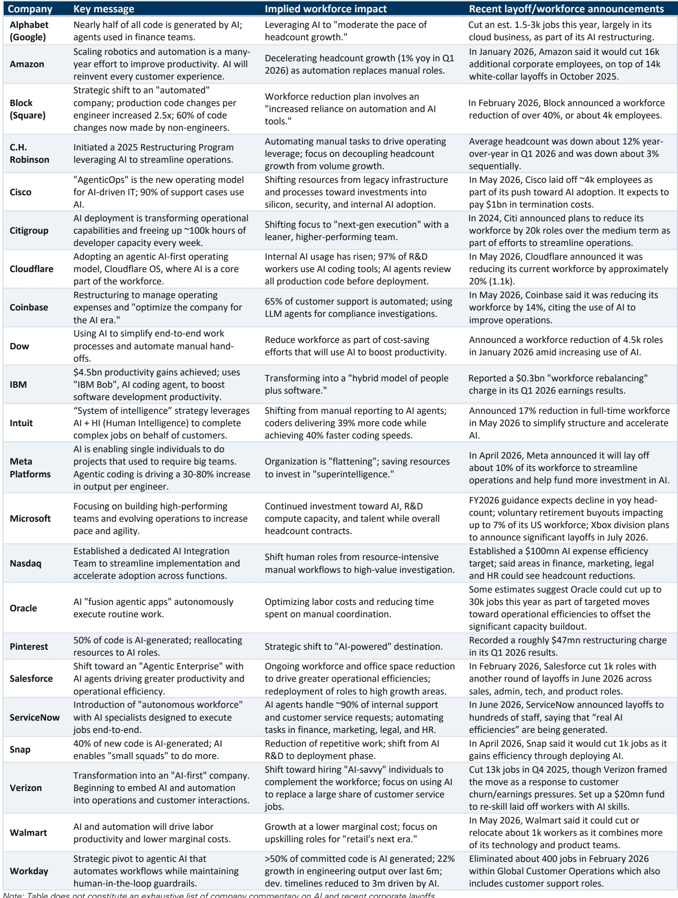
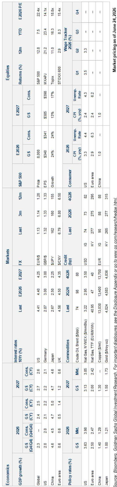
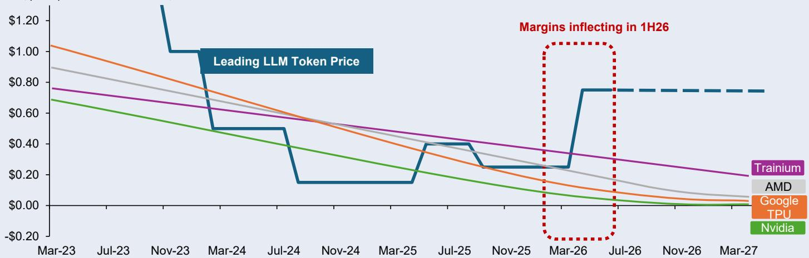

# GS：AI“失业末日”不会来，但真正的考验藏在2027年

关于AI会消灭多少工作岗位，市场已经听过太多耸人听闻的预言。但这份GS最新发布的《Top of Mind》报告，罕见地同时邀请了三位立场不同的顶尖学者与经济分析师——MIT的Daron Acemoglu、Neil Thompson，以及GS首席经济学家Joseph Briggs——来正面辩论同一个问题。他们的结论出奇一致：AI不会引发“失业末日”。但分歧在于，冲击的规模、节奏和谁先受伤，远比公众想象的复杂。

这份报告最值得关注的判断不是“AI不会取代人类”，而是：**未来五年，AI对劳动力市场的净负面影响可能只有2-4%，但2027年将是第一个真正的压力测试节点。而投资者目前完全无法为这种不确定性定价。**

## 1. 三位顶级专家的共识与分歧：冲击会来，但不是海啸

GS这份报告的价值，在于它没有让单一声音主导叙事。三位专家在核心结论上罕见地达成一致：大规模、突发的AI失业不会在短期内发生。但他们的分歧点，恰恰是投资者和产业决策者最应该关注的。

Joseph Briggs的立场相对乐观。他假设AI会在十年过渡期内取代超过9%的劳动力——约1500万工人——但他坚信这些损失是暂时的。他的逻辑基于历史：每一次技术浪潮最终都创造了更多新岗位。美国经济的动态性，加上十年的过渡期，足以让市场自我调整。

Neil Thompson则从技术落地的实际障碍出发。他提醒，能力只是第一步。AI必须可靠、能访问正确数据、并且成本有效，才能真正冲击就业。大多数工作由多个任务组成，只有部分能被自动化。因此，他预期调整将是“缓慢且不均衡的”，更像“涨潮”而非“海啸”。

Daron Acemoglu的立场最为审慎。他预计未来五年AI对就业的净负面影响仅为2-4%，集中于约800-900万从事认知性、常规性、可预测任务的“白领工人”——例如客服和后台岗位。但他警告，如果投资继续集中在“替代”而非“增强”人类的方向，十年以上的长期损失可能更大。

> **KC评论：** 这三位专家的分歧不是“会不会”，而是“多快、多深”。Acemoglu的警告尤其值得注意：他担心的不是短期冲击，而是投资方向一旦锁定在替代路径上，长期后果难以逆转。完整报告中，他详细拆解了为什么当前AI模型在“增强”人类方面能力有限，以及哪些投资方向可能改变这一轨迹——这部分内容对于理解AI产业的长期估值逻辑至关重要。

## 2. 2027年：第一个真正的压力测试节点

Acemoglu给出了一个非常具体的时间点：2027年。他认为，当前企业的AI实验尚未在宏观数据中显现，但随着企业层面的努力加速，2027年我们可能会看到更明显的裁员或招聘放缓迹象。

这个判断基于两个关键观察。第一，目前AI模型在“替代”方面远强于“增强”。GS经济学家Elsie Peng的数据支持了这一观点：AI目前更多是替代而非增强劳动力，对劳动力市场形成了微小净拖累。第二，企业级应用仍处于“提示工程”阶段，缺乏类似“微软Office版AI”这样能大规模推广的工具。除非代理式AI（Agentic AI）进展能打开更广泛的应用场景，否则大规模替代不会发生。

但2027年的风险在于，如果代理式AI、社交能力改进、或AI-机器人集成取得突破，可被影响的岗位范围将急剧扩大。GS股票分析师James Schneider和Luya You也指出，不断下降的Token成本可能使更多企业工作流在经济上变得可自动化。

> **KC评论：** 2027年这个时间节点，是Acemoglu基于技术扩散曲线和企业投资周期的判断。完整报告中，他进一步解释了为什么“代理式AI”是双刃剑——它既能创造新的应用场景，也可能加速替代。这部分技术-经济交叉分析，对于判断AI产业的下一个投资拐点至关重要。

## 3. 谁先受伤？不是最聪明的，也不是最笨的

关于AI冲击的对象，市场普遍认为“白领”和“新毕业生”首当其冲。但GS报告给出了更细致的分层。

GS经济学家Jessica Rindels和Pierfrancesco Mei发现，AI对大学毕业生的就业前景影响目前很小。但短期内，由于大学毕业生集中在AI采用率高的行业和可自动化任务多的岗位，风险正在积累。不过，历史数据显示，大学毕业生比其它工人更能灵活应对技术颠覆。

Acemoglu则给出了一个更尖锐的框架：冲击将集中在从事“认知性、常规性、可预测任务”的白领工人。这些岗位——客服、后台、数据录入——通常由较低收入的白领担任。因此，他预期未来几年收入不平等将加剧。但如果更高薪的管理岗位也被替代，不平等反而可能下降。

Thompson提供了一个更有趣的二分法：如果AI自动化的是工作中最“不专业”的部分，就业会下降但工资会上升（工作变得更专业化）；如果自动化的是最“专业”的部分，就业会上升但工资会下降（更多人能做这份工作）。这意味着冲击将跨越职业和工资分布，而非只击中某一特定群体。

## 4. 市场为什么还没奖励AI赢家？因为不确定性太高

GS高级美国股票策略师Ryan Hammond的结论最直接：AI对劳动力需求和企业盈利的影响太不确定，市场目前无法为此定价。因此，投资者继续青睐AI基础设施领域——那里的盈利收益更具体可见。

但Hammond预期这种情况会改变。随着更清晰的证据表明AI的生产率收益能够转化为可持续的盈利增长，AI交易最终将从基础设施扩展到生产率受益者。

这引出了一个关键问题：为什么AI的生产率提升至今有限？报告显示，目前AI对劳动生产率的提升作用仍然微弱。这可能是因为企业仍在摸索如何有效整合AI，也可能是因为AI当前的能力边界限制了其应用深度。

> **KC评论：** 市场目前对AI的定价高度集中在基础设施层面，而忽略了劳动力市场变化对企业盈利结构的长期影响。完整报告中，Hammond的图表展示了AI生产率提升与企业盈利之间的传导机制——这部分分析对于理解AI主题的二级市场交易策略至关重要。

## 5. 报告尚未完全回答的关键问题：投资方向能否转向？

Acemoglu提出了一个尖锐的追问：如果AI投资继续集中在“替代”路径上，长期就业损失可能显著大于短期预测。他主张，一条“人类互补”的路径——AI技术增强而非取代人类——可以产生更高的生产率收益。但这需要不同的投资方向：在预训练、领域特定应用和数据上投入资源。

问题是，目前这些投资没有以足够规模发生。行业优先级和激励机制需要改变，才能支持一条对人类更友好的路径。如果方向不调整，Acemoglu预期未来十年内会出现更大的净就业损失。

这个追问直接指向了产业政策、企业战略和投资方向的交叉点。它不是一个纯技术问题，而是关于激励机制、市场结构和公共政策的复合问题。

## 6. 给决策者的观察框架：关注三个信号

基于这份报告，投资者和产业决策者可以用三个信号来跟踪AI对劳动力市场的真实影响：

第一，**企业级AI应用的普及速度**。如果出现类似“微软Office版AI”的通用工具，替代节奏将加速。目前，大多数企业仍处于定制化开发阶段，这限制了AI的扩散。

第二，**代理式AI和AI-机器人集成的进展**。这两项技术将显著扩大可被影响的岗位范围。如果它们取得突破，Acemoglu的“小净负面”预测可能需要上调。

第三，**投资方向的结构性变化**。如果风险投资和企业研发支出从“替代”转向“增强”，长期就业结果将显著不同。目前，替代路径仍占主导。

---

这份GS报告的价值不在于给出一个确定的预测，而在于揭示了不确定性本身的结构。三位专家的分歧本身就是最重要的信息：AI对劳动力市场的影响不是一个可以被简单预测的变量，而是一个取决于技术路径、投资方向和政策选择的复合结果。

对于投资者来说，这意味着当前市场对AI主题的定价——高度集中在基础设施——可能低估了劳动力市场变化对下游企业盈利的长期影响。对于产业决策者来说，这意味着2027年之前的窗口期，是调整投资方向、建立增强型AI应用的关键时期。

每天由AI agent加人工review生成的国际投行中文摘要与KC评论，daily更新约10-40页，并整理当天最新数据图表合集，方便喂给AI，也方便人工快速把握market dynamics。欢迎来星球微信群里继续讨论。

Personal reading notes and learning share only. Not investment advice.

