# Insurance: M&A and Reinsurance; Opportunities in a softer rate environment

As premium rate increases slow/soften across a number of classes, we see 1) incremental reinsurance opportunities for insurers to optimise ROEs/Margins + a broad based increase in M&A across the sector, as historically observed, particularly as valuations pull back on businesses materially exposed to classes seeing material rate pressure. In this context, we note that:

Reinsurance markets and excess capital are proving favourable for direct insurers + supply of alternative third party capital which should help support capacity for large scale reinsurance transactions. We think this presents opportunities for IAG's Intermediated business and also for SUN to consider optimising returns across their business. With margins in excess of targets for the personal lines insurers as a result of the hard premium rate cycle, we think IAG / SUN are buying (or have bought) additional reinsurance protections with profit commission terms to help smooth margins by deferring profits into outer years.

□ Japanese non-life insurers (e.g. Tokio Marine) hold significant excess capital supported by divestments of cross-holdings and have publicly flagged International M&A opportunities to diversify their exposures; with Australia noted as an attractive market for growth and diversification. This may present opportunities for both IAG's Commercial business and both SUN/IAG's personal lines businesses; and we highlight the evidence / key points from their strategic disclosures within this report.

\- Across our insurers, IAG is pursuing its acquisition of RACI with SUN flagging potential opportunities in the Commercial space (organic or otherwise). Inwardly, IAG flagged possible reinsurance structures for its Commercial business to release capital (perhaps ROE neutral/ upside) with M&A flagged as not a strategy. Ex the Quota share, and post bank sale, we note that SUN is a pure play general insurer similar to IAG.

\- See within for details.

Julian Braganza, FIAA
+61(2)9321-8487 |
julian.braganza@gs.com
GS Australia Pty Ltd

Chris Matthews, FIAA
+61(2)9321-8370 |
chris.matthews@gs.com
GS Australia Pty Ltd

## Reinsurance: Favourable rate reduction expected in June

1 Apr-26 Renewal backdrop: Risk-adjusted rates fell significantly across US and Asia, returning to early 2020s levels.

1 Jul-26 in Australia is expected to be down between 10-15%; closer to 15% overall: It is likely that this would still not be the bottom for reinsurance rates with reinsurer ROEs still adequate and over-earning long term averages. This could also be supported further if their perils losses are relatively benign.

\- Rate reductions have been the same globally in markets: And have not reflected the starting position of rate adequacy in each of the individual geographies i.e. Every market seems to have a very similar rate reduction across Australia, Africa, and China so rate adequacy today by market may look a little more chequered.

■ Greater competition emerging from 2nd and 3rd Tier reinsurers.

\- Reinsurance demand up \~10%, driven by retention buy-downs, frequency protection, and higher limits/extended CAT (catastrophe) towers. However, with very strong ROEs we think reinsurers are still generating capital in excess of organic growth consumption.

Global reinsurer capital up \~10% to US\$785bn and third-party capital (CAT bonds/insurance-linked securities) up 18%, driven by investor appetite and strong reinsurer retained earnings (ROEs \~17%).

Benign CAT losses reinforce favourable reinsurance trends; significantly higher losses are needed to result in a material shift in pricing.

Exhibit 1: Natural Catastrophe Reinsurance Pricing Cycle as portrayed by Hannover – remains favourable Despite recent rate reduction, reinsurance rates remain very rate adequate.  
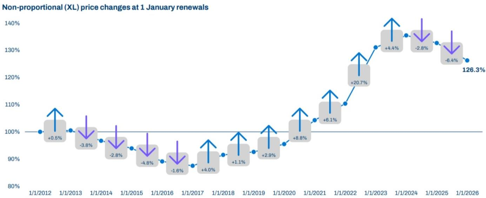  
Source: Company data

Exhibit 2: Reinsurance sector ROEs

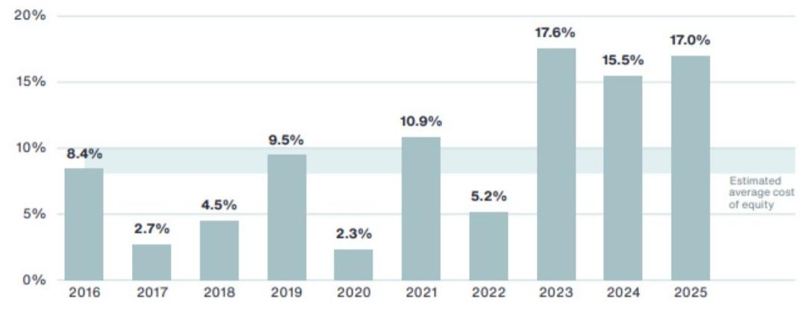  
Source: AON

Exhibit 3: Reinsurance sector capital  
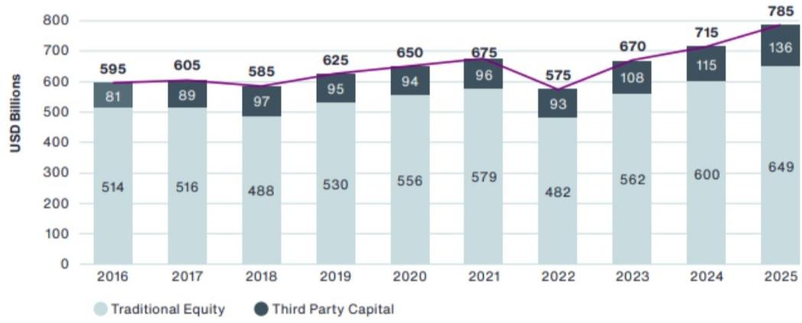  
Source: AON

## IAG's Commercial business strategy

IAG restructured the licensing of its Intermediated business to support a potential reinsurance structure: IAG has transferred its intermediated insurance business (covering the CGU and WFI brands) into a standalone subsidiary which operates under its own separate general insurance license.

The problem IAG is trying to address is that the intermediated business has been earning ROEs that are well below Group ROEs of \~15%: IAG's intermediated business has consistently earned returns that is below Group margins / ROE i.e. 11.7% currently v Group of 15%+. With material expense savings, the Intermediated business is expected to get to \~13% insurance margin / ROE which is still below Group with further capital optimisation initiatives needed to support returns.

While we think reinsurance is a potential catalyst for IAG's Intermediated business, IAG could well be exploring a number of options: IAG is targeting a $13\%$ margin on this business v $11.7\%$ at 1H26 currently; largely through expense ratio reductions. We think there is further upside to margin / ROE for this business through a possible reinsurance transaction with M&A not specifically flagged as a strategy by IAG.

Tokio Marine (Not Covered) 2035 Strategy /Plan: M&A a feature

The company's plan targets $7 \%+$ Profit growth CAGR into FY35

\- Geographic diversification targeted through a combination of a) Organic growth b) Business build out c) Small and medium-sized bolt on M&A d) Large M&A.

■ Building out growth opportunities with low correlation to existing business: both across geography and product set to minimise the impact on capital requirement strain resulting in better ROE trends.

\- Targeting a significant improvement in group ROE to 17%+ from \~13% currently. This will also be driven by a combination of reallocating capital from equity stake to higher returning investments offshore, per the company.

■ Stronger presence in Australia targeted.

Exhibit 4: Tokio Marine 2035 ambitions  
  
Source: Company data

## Tokio Marine /Berkshire Partnership: Collaborating on M&A

Tokio Marine entered into a strategic partnership with Berkshire Hathaway insurance in March this year. The partnership mirrors IAG's own partnership with Berkshire however it also opens up Tokio Marine to large scale M&A in collaboration with Berkshire.

☐ As the foundation of the partnership, Berkshire has taken a stake of 2.5% in Tokio Marine (capped at a maximum of \~10%).

Tokio Marine is also reinsuring a portion of the group insurance portfolio through a Whole of Account Quota Share over a 10 year term. The portion of the reinsurance is undisclosed. This will achieve a reduction in earnings volatility in the insurance portfolio supporting earnigns generation for growth.

Tokio Marine and Berkshire will also look to collaborate on global strategic investment opportunities to drive sustainable growth for both companies. Berkshire is leveraging Tokio Marine's M&A execution capability and Tokio Marine is leveraging Berkshire's capital strength which will significantly broaden M&A options and opportunities.

## Exhibit 5: Tokio Marine Partnership with Berkshire

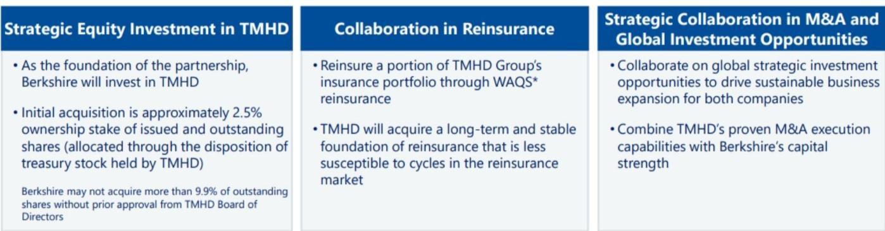

## Reduction of earnings volatility in the insurance underwriting portfolio (including natural disaster risks) The long-term and stable capacity generated to be deployed toward growth areas Significantly broaden M&A options and opportunities

\*Whole of Account Quota Share arrangement

Source: Company data

## Tokio Marine's M&A strategy

Until recently Tokio Marine's focus was on smaller /unlisted targets with lower multiples. The partnership with Berkshire should provide access to a larger pool of capital.

Tokio Marine will have capital capacity / M&A firepower of up to US\$20bn standalone: Driven by 1) Re-deployment of excess capital post sale of equity investments 2) Optimising balance sheet through use of subordinated debt.

☐ Pipeline extends beyond US\$1bn type acquisitions / bolt-ons to large scale M&A in collaboration with Berkshire.

☐ Preference for unlisted targets noting better multiples and ability to negotiate on price v listed players.

☐ M&A preference for lines that are showing more material softening on rate which has better valuations e.g. Financial lines.

☐ FX /weaker Yen is not an issue noting Tokio Marine earns a good proportion of profits in USD that can be deployed.

Source: Company data, GS Global Investment Research

Exhibit 6: M&A framework and track record  
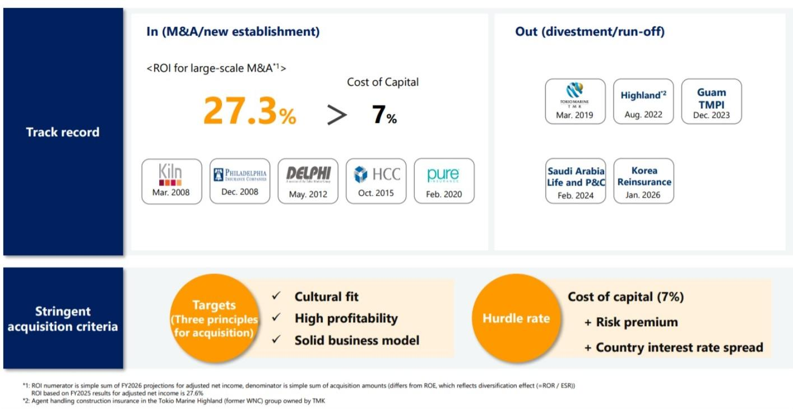

## Exhibit 7: M&A scotp in Commerical

## Rate Cycle and M&A Opportunities

The current rate cycle has entered the early stage of a softening phase, leading to an increase in M&A activity.  
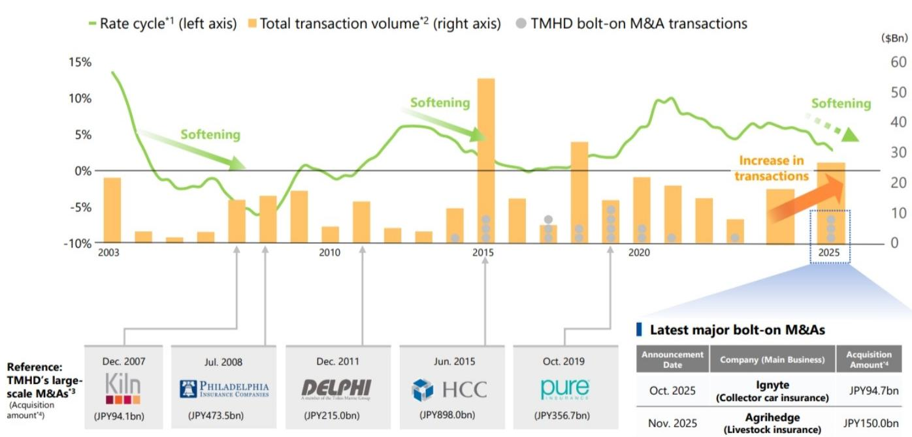  
\*1: U.S. Commercial market (Source) WTW, Commercial Lines Insurance Pricing Survey  
\*2: Global M&A transactions announced between 2003 and 2025, involving \$100M or more, targeting P&C insurance companies (Source) Dealogic. \*3: Date is the announced date. \*4: FX rate at the time of announcement

Exhibit 8: Tokio Marine historical M&A since 2008 TM has been buying global insurers for two decades

<table><tr><td>Target</td><td>Description</td><td>Year</td><td>Value</td></tr><tr><td>Kiln</td><td>Lloyd&#x27;s of London specialist</td><td>2008</td><td>£442m</td></tr><tr><td>Philadelphia Consolidated</td><td>US property &amp; casualty</td><td>2008</td><td>$4.7bn</td></tr><tr><td>Delphi Financial</td><td>US life, property &amp; casualty</td><td>2012</td><td>$2.7bn</td></tr><tr><td>HCC Insurance</td><td>Global property &amp; casualty</td><td>2015</td><td>$7.5bn</td></tr><tr><td>Privilege Underwriters</td><td>US property &amp; casualty</td><td>2019</td><td>$3.1bn</td></tr></table>

Source: Financial Times, Data compiled by GS Global Investment Research

## M&A Strategy - Sompo (Not Covered)

Remains committed to M&A in P&C: post US\$3.5bn acquisition of global insurance and reinsurance company Aspen in Feb-26.

\- Holds >JPY\$1trn (\~A\$8.9bn) of excess capital for growth: with \~60-70% of this committed for overseas M&A.

■ Sompo is targeting large-scale M&A in P&C, with bolt-on M&A also in view:

☐ Looking for targets with alignment in underwriting philosophies, expansion of scale and diversification and ROI exceeding the cost of capital.

☐ North America and Europe are targeted regions for M&A within Commercial markets.

□ Criteria for overseas P&C M&A: 1) Increasing ROE, 2) Growth potential, profitability, and diversification of existing business, 3) Prioritise Aspen's PMI.

☐ Criteria for domestic P&C M&A: Expanding services from pre-disaster to post-disaster.

Sompo strengthened its presence in the Australian market through the recruitment of 9 specialist underwriters in Apr-26: Underwriters have established expertise across property, casualty, financial lines, energy and construction.

\- Even after the completion of the Aspen acquisition, sufficient capacity for growth investments remains, thanks to the accelerated sale of strategic equity holdings and higher-than-expected earnings
- We will implement growth investments that contribute to early profit generation and sustainable profit growth, thereby enhancing capital efficiency through profit growth

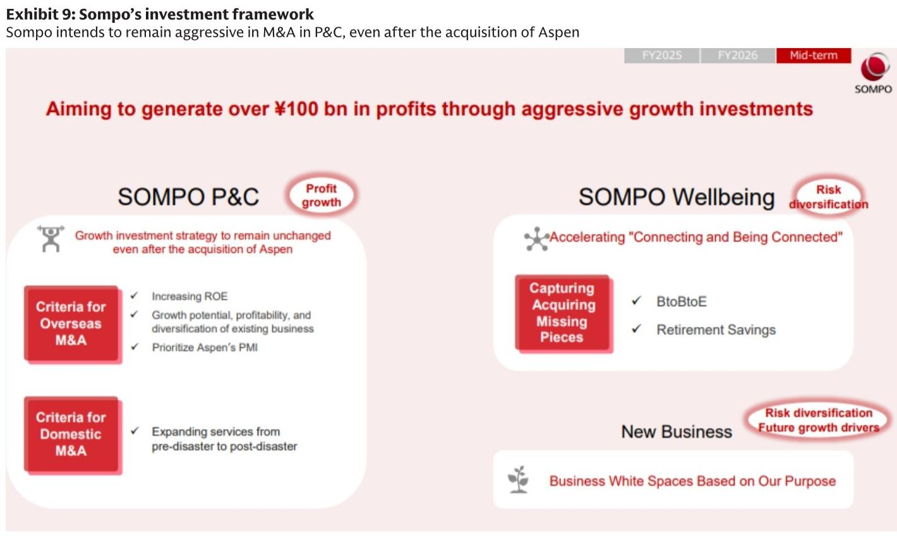  
Source: Company data

## Exhibit 10: Sompo investments in Future growth plan

## Investments in Future Growth

Capital Generation and Allocation  
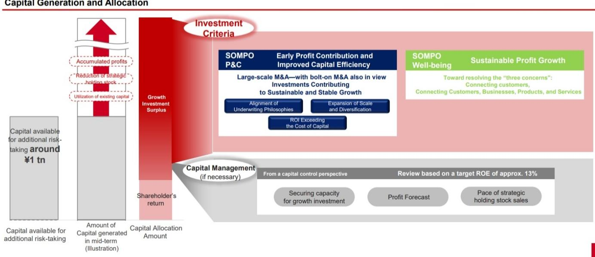

## M&A Strategy - MS&AD (Not Covered)

MS&AD has said it intends to deploy a portion of the remaining proceeds from its divestment of strategic equity holdings to new business investment & additional M&A - see Exhibit 11: A portion of JPY\$0.7trn (\~A\$6.3bn) will be considered for small to medium-sized bolt-on investments to deepen presence in Asian markets and/ or international life insurance companies.

W.R. Berkley 15% acquisition was completed in Mar-26: JPY\$0.6trn (\~A\$5.4bn) allocated to business investment in WRB.

Appears more tentative on large-scale M&A: On its May-26 guidance call, MS&AD noted that there were no immediate plans to deploy ongoing strategic equity holdings divestments into large-scale business investments, although investments in high growth areas and overseas life will continue to be considered.

Exhibit 11: MS&AD use of strategic equity holdings divestment proceeds
Part of JPY\$0.7trn (\~A\$5.4bn) to be allocated to new business investment and additional acquisitions

## 01 Status of Strategic Equity Holdings Sales and Use of Proceeds

Generally obtained approval from issuers for the sale of strategic shareholdings, and will proceed with the sales ahead of schedule\*1.

The proceeds from these sales will be invested in growth areas with sufficient investment efficiency to achieve 1 trillion yen in adjusted profit at an early stage.

For our own shares that are sold as a result of dissolving cross-shareholdings, we will take measures to address supply and demand, such as off-market transactions.

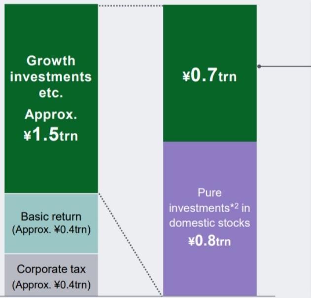

## ■ New business investment & additional acquisitions

– Capital enhancement for growth strategy in the Americas

\- Small- to medium-sized bolt-on investments to deepen presence in Asian markets

– International life insurance with stable and high cash flow, such as corporate pension business

## ■ Investment in organic growth

\- Investment in productivity/innovation (AI, next-gen systems) and top specialists

\- Investment in transforming the business model and structure of domestic life insurance

\- Careful expansion of investments in higher return assets $^{*3}$

## ■ Additional return

\- Share buybacks, considering balance and timing with growth investments

## End of March 2026

\*1 Over 70% of the fair value balance, excluding planned transfers to pure domestic equity investments, is expected to be sold in FY2026 and FY2027.

\*2 Carefully selecting and investing in stocks that are expected to achieve sustainable corporate value growth through profit growth, based on a long-term investment approach.

\*3 Assets held with the expectation of relatively high returns. Refers to pure investments other than ALM-related assets (yen interest rate assets held to match long-term insurance liabilities).

## Commercial vs personal lines ROE and GWP growth

Exhibit 12: Commercial lines insurers - ROE (12m rolling)  
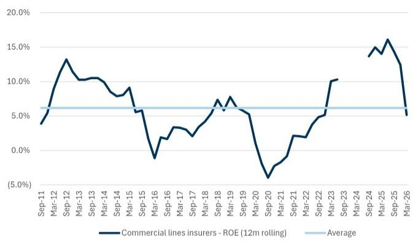  
(1) Due to accounting standard changes and data collection limitations, Sep-23 data is unavailable. (2) We note that APRA defines commercial line insurers as direct insurers that primarily sell commercial lines business.  
Source: APRA, Data compiled by GS Global Investment Research

Exhibit 13: Personal lines insurers - ROE (12m rolling)  
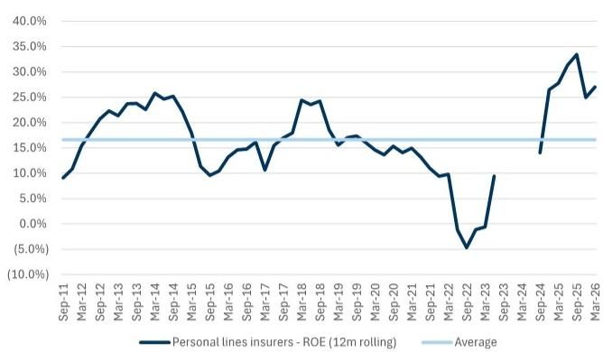  
(1) Due to accounting standard changes and data collection limitations, Sep-23 data is unavailable. (2) APRA defines personal line insurers as direct insurers that primarily sell personal lines business.  
Source: APRA, Data compiled by GS Global Investment Research

Exhibit 14: Direct insurers from large groups - ROE (12m rolling)  
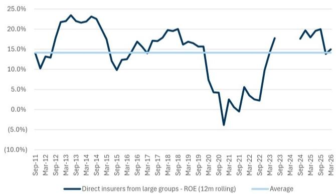  
(1) Due to accounting standard changes and data collection limitations, Sep-23 data is unavailable. (2) We note that APRA defines “Direct insurers from large groups” as insurers in a group that makes up at least 10% of industry gross earned premium.

Exhibit 15: Commercial Lines GWP growth (12m rolling) and average  
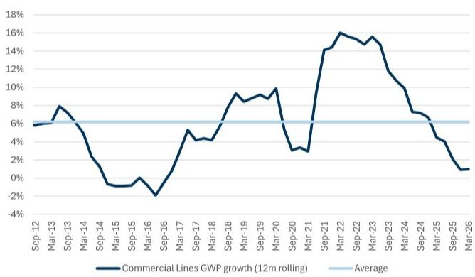  
(1) Due to accounting standard changes and data collection limitations, Sep-23 data is unavailable and has been estimated. (2) We have built up commercial lines GWP to include Commercial motor, Fire and ISR, Directors and officers, Employers liability, Professional indemnity, Public and product liability, Cyber and Other direct classes

Exhibit 16: Personal Lines GWP growth (12m rolling) and average  
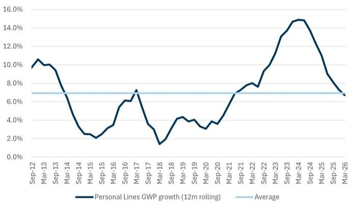  
(1) Due to accounting standard changes and data collection limitations, Sep-23 data is unavailable and has been estimated. (2) We have built up personal lines GWP to include Home, Motor and CTP classes.  
Source: APRA, Data compiled by GS Global Investment Research

## Price Target, Risks and Methodology - IAG

We are Buy-rated. Our 12-month PT of A\$8.60 is 50% based on our DCF valuation and 50% on a multiple of NTA derived from a regression of P/NTA to sustainable ROTE across our financials coverage universe. Our DCF valuation uses a WACC of 9.5% and a TGR of 2.5%.

Key downside risks include: 1) Rate momentum weakens materially and below loss cost inflation; 2) Volume loss; 3) Persistent claims inflation / perils. 4) Lower investment yields.

## Investment Thesis - IAG

IAG is one of Australia's largest Personal and Commercial insurance companies. We have a Buy rating on IAG relative to the rest of our sector coverage. We like IAG because 1) Margins is in a strong position, 2) IAG is targeting ongoing earnings improvement in its Intermediated Insurance business driven by expense ratios, 3) Catastrophe volatility and reserve protection covers, 4) Greensill de-risked.

## Price Target, Risks and Methodology - Suncorp

We are Neutral-rated. Our 12-month PT of A\$20.00 is based equally on our DCF valuation and a multiple of NTA derived from a regression of P/NTA to sustainable ROTE across our financials coverage universe. Our DCF valuation uses a WACC of 9.5% and a TGR of 2.5%.

Key downside risks: 1) Commercial/Personal Rate increases faster than expected and below loss cost inflation; 2) Significant volume loss to competitors as a result of price increases / ROEs; 3) Persistent high claims inflation and higher catastrophe environment; 4) Lower investment yields. 5) We remain watchful of aggregator risks from evolving AI led distribution channels. Key upside risks include: 1) Re-acceleration in pricing environment; 2) More benign claims inflation; and 3) Lower catastrophe environment; 4) Higher investment yields; 5) Reinsurance markets remain favourable.

## Investment Thesis - Suncorp

Suncorp operates across Australia and NZ Commercial and Personal insurance. We expect SUN's underlying margins to remain within its target 10-12% range over the medium term which points to strong ROTE expectations. SUN is targeting the upper end of that range for FY26. Yields, expenses and reinsurance rate benefits remain supportive of margins albeit we remain watchful of inflation spikes relative to pricing. We are Neutral rated on SUN reflecting relative valuation v historical averages noting ROE expectations, however, we are concerned about 1) Moderating rate environment, 2) Volume loss in response to rate increases, 3) Claims inflation outstripping premium rate increases.

## Disclosure Appendix

## Reg AC

We, Julian Braganza, FIAA and Chris Matthews, FIAA, hereby certify that all of the views expressed in this report accurately reflect our personal views about the subject company or companies and its or their securities. We also certify that no part of our compensation was, is or will be, directly or indirectly, related to the specific recommendations or views expressed in this report.

Unless otherwise stated, the individuals listed on the cover page of this report are analysts in GS' Global Investment Research division.

Contributing Authors: Julian Braganza, FIAA GS Australia Pty Ltd, Chris Matthews, FIAA GS Australia Pty Ltd.

Unless otherwise stated, the individuals listed in the Contributing Authors disclosure of this report are analysts in GS' Global Investment Research division.

## GS Factor Profile

The GS Factor Profile provides investment context for a stock by comparing key attributes to the market (i.e. our universe of rated stocks) and its sector peers. The four key attributes depicted are: Growth, Financial Returns, Multiple (e.g. valuation) and Integrated (a composite of Growth, Financial Returns and Multiple). Growth, Financial Returns and Multiple are calculated by using normalized ranks for specific metrics for each stock. The normalized ranks for the metrics are then averaged and converted into percentiles for the relevant attribute. The precise calculation of each metric may vary depending on the fiscal year, industry and region, but the standard approach is as follows:

Growth is based on a stock's forward-looking sales growth, EBITDA growth and EPS growth (for financial stocks, only EPS and sales growth), with a higher percentile indicating a higher growth company. Financial Returns is based on a stock's forward-looking ROE, ROCE and CROCI (for financial stocks, only ROE), with a higher percentile indicating a company with higher financial returns. Multiple is based on a stock's forward-looking P/E, P/B, price/dividend (P/D), EV/EBITDA, EV/FCF and EV/Debt Adjusted Cash Flow (DACF) (for financial stocks, only P/E, P/B and P/D), with a higher percentile indicating a stock trading at a higher multiple. The Integrated percentile is calculated as the average of the Growth percentile, Financial Returns percentile and (100% - Multiple percentile).

Financial Returns and Multiple use the GS analyst forecasts at the fiscal year-end at least three quarters in the future. Growth uses inputs for the fiscal year at least seven quarters in the future compared with the year at least three quarters in the future (on a per-share basis for all metrics).

For a more detailed description of how we calculate the GS Factor Profile, please contact your GS representative.

## M&A Rank

Across our global coverage, we examine stocks using an M&A framework, considering both qualitative factors and quantitative factors (which may vary across sectors and regions) to incorporate the potential that certain companies could be acquired. We then assign a M&A rank as a means of scoring companies under our rated coverage from 1 to 3, with 1 representing high (30%-50%) probability of the company becoming an acquisition target, 2 representing medium (15%-30%) probability and 3 representing low (0%-15%) probability. For companies ranked 1 or 2, in line with our standard departmental guidelines we incorporate an M&A component into our target price. M&A rank of 3 is considered immaterial and therefore does not factor into our price target, and may or may not be discussed in research.

## Quantum

Quantum is GS' proprietary database providing access to detailed financial statement histories, forecasts and ratios. It can be used for in-depth analysis of a single company, or to make comparisons between companies in different sectors and markets.

## Disclosures

## Financial Advisory Disclosure

GS and/or one of its affiliates is acting as a financial advisor in connection with an announced strategic matter involving the following company or one of its affiliates: Insurance Australia Group Limited

## Logo Disclosure

Third party brands used in this report are the property of their respective owners, and are used here for informational purposes only. The use of such brands should not be viewed as an endorsement, affiliation or sponsorship by or for GS or any of its products/services.

The rating(s) for Insurance Australia Group and Suncorp Group is/are relative to the other companies in its/their coverage universe: AMP, ASX Ltd., AUB Group, Challenger Ltd., Computershare, GQG, Insurance Australia Group, Magellan Financial Group, Medibank Private Ltd., NIB Holdings, QBE Insurance Group, Suncorp Group

## Company-specific regulatory disclosures

The following disclosures relate to relationships between The GS Group, Inc. (with its affiliates, “GS”) and companies covered by GS Global Investment Research and referred to in this research.

GS has received compensation for investment banking services in the past 12 months: Insurance Australia Group (A\$7.87)

GS expects to receive or intends to seek compensation for investment banking services in the next 3 months: Insurance Australia Group (A\$7.87)

GS had an investment banking services client relationship during the past 12 months with: Insurance Australia Group (A\$7.87)

GS had a non-investment banking securities-related services client relationship during the past 12 months with: Insurance Australia Group (A\$7.87) and Suncorp Group (A\$18.93)

GS had a non-securities services client relationship during the past 12 months with: Insurance Australia Group (A\$7.87) and Suncorp Group (A\$18.93)

## Distribution of ratings/investment banking relationships

GS Investment Research global Equity coverage universe

<table><tr><td rowspan="2"></td><td colspan="3">Rating Distribution</td><td colspan="3">Investment Banking Relationships</td></tr><tr><td>Buy</td><td>Hold</td><td>Sell</td><td>Buy</td><td>Hold</td><td>Sell</td></tr><tr><td>Global</td><td>50%</td><td>34%</td><td>16%</td><td>65%</td><td>60%</td><td>45%</td></tr></table>

As of April 1, 2026, GS Global Investment Research had investment ratings on 3,074 equity securities. GS assigns stocks as Buys and Sells on various regional Investment Lists; stocks not so assigned are deemed Neutral. Such assignments equate to Buy, Hold and Sell for the purposes of the above disclosure required by the FINRA Rules. See ‘Ratings, Coverage universe and related definitions’ below. The Investment Banking Relationships chart reflects the percentage of subject companies within each rating category for whom GS has provided investment banking services within the previous twelve months.

## Price target and rating history chart(s)

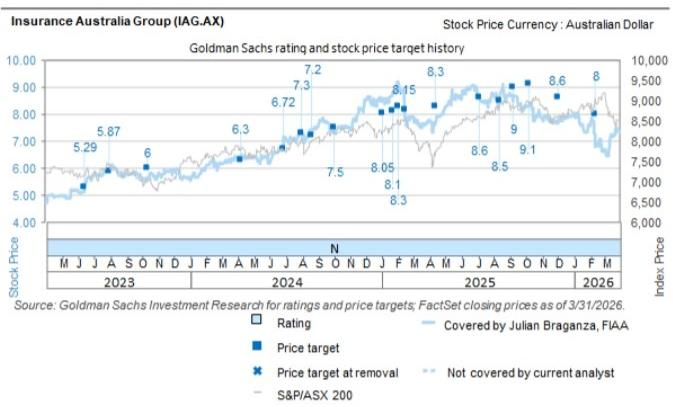  
The price targets shown should be considered in the context of all prior published GS, which may or may not have included price targets, as well as developments relating to the company, its industry and financial markets.

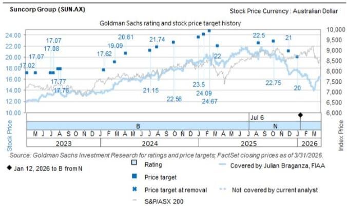  
The price targets shown should be considered in the context of all prior published GS, which may or may not have included price targets, as well as developments relating to the company, its industry and financial markets.

## Target price history table(s)

## Insurance Australia Group (IAG.AX)

Suncorp Group (SUN.AX)

<table><tr><td>Date of report</td><td>Target price (A$)</td><td>Closing price (A$)</td><td>Date of report</td><td>Target price (A$)</td><td>Closing price (A$)</td></tr><tr><td>24-Jun-26</td><td>8.60</td><td>7.87</td><td>03-Jan-26</td><td>20.00</td><td>17.80</td></tr><tr><td>12-Feb-26</td><td>8.00</td><td>6.80</td><td>02-Dec-25</td><td>21.00</td><td>17.28</td></tr><tr><td>02-Dec-25</td><td>8.60</td><td>7.71</td><td>07-Oct-25</td><td>22.75</td><td>20.52</td></tr><tr><td>07-Oct-25</td><td>9.10</td><td>8.30</td><td>14-Aug-25</td><td>22.50</td><td>20.77</td></tr><tr><td>09-Sep-25</td><td>9.00</td><td>8.57</td><td>14-Mar-25</td><td>22.00</td><td>18.66</td></tr><tr><td>13-Aug-25</td><td>8.50</td><td>8.49</td><td>12-Feb-25</td><td>21.00</td><td>20.32</td></tr><tr><td>06-Jul-25</td><td>8.60</td><td>8.65</td><td>21-Jan-25</td><td>20.50</td><td>19.63</td></tr><tr><td>14-Apr-25</td><td>8.30</td><td>7.71</td><td>02-Jan-25</td><td>20.00</td><td>19.06</td></tr><tr><td>13-Feb-25</td><td>8.15</td><td>7.80</td><td>03-Oct-24</td><td>19.20</td><td>17.44</td></tr><tr><td>02-Feb-25</td><td>8.30</td><td>9.20</td><td>31-Jul-24</td><td>18.50</td><td>17.55</td></tr><tr><td>21-Jan-25</td><td>8.10</td><td>8.71</td><td>07-Jul-24</td><td>18.00</td><td>16.55</td></tr><tr><td>02-Jan-25</td><td>8.05</td><td>8.54</td><td>07-Apr-24</td><td>17.54</td><td>16.01</td></tr><tr><td>03-Oct-24</td><td>7.50</td><td>7.30</td><td>26-Feb-24</td><td>16.25</td><td>15.43</td></tr><tr><td>21-Aug-24</td><td>7.20</td><td>7.22</td><td>18-Jan-24</td><td>15.00</td><td>13.78</td></tr><tr><td>31-Jul-24</td><td>7.30</td><td>7.40</td><td>09-Aug-23</td><td>15.13</td><td>13.34</td></tr><tr><td>03-Jul-24</td><td>6.72</td><td>7.01</td><td>31-Jul-23</td><td>15.13</td><td>14.02</td></tr><tr><td>28-Jun-24</td><td>6.72</td><td>7.14</td><td>13-Jul-23</td><td>14.53</td><td>13.34</td></tr><tr><td>07-Apr-24</td><td>6.30</td><td>6.40</td><td>04-Jul-23</td><td>14.53</td><td>13.31</td></tr><tr><td>11-Oct-23</td><td>6.00</td><td>5.53</td><td></td><td></td><td></td></tr><tr><td>21-Aug-23</td><td>5.87</td><td>5.79</td><td></td><td></td><td></td></tr><tr><td>31-Jul-23</td><td>5.87</td><td>5.93</td><td></td><td></td><td></td></tr></table>

Price targets shown in table(s) are unadjusted for corporate actions.

## Regulatory disclosures

## Disclosures required by United States laws and regulations

See company-specific regulatory disclosures above for any of the following disclosures required as to companies referred to in this report: manager or co-manager in a pending transaction; 1% or other ownership; compensation for certain services; types of client relationships; managed/co-managed public offerings in prior periods; directorships; for equity securities, market making and/or specialist role. GS trades or may trade as a principal in debt securities (or in related derivatives) of issuers discussed in this report.

The following are additional required disclosures: Ownership and material conflicts of interest: GS policy prohibits its analysts, professionals reporting to analysts and members of their households from owning securities of any company in the analyst's area of coverage. Analyst compensation: Analysts are paid in part based on the profitability of GS, which includes investment banking revenues. Analyst as officer or director: GS policy generally prohibits its analysts, persons reporting to analysts or members of their households from serving as an officer, director or advisor of any company in the analyst's area of coverage. Non-U.S. Analysts: Non-U.S. analysts may not be associated persons of GS & Co. LLC and therefore may not be subject to FINRA Rule 2241 or FINRA Rule 2242 restrictions on communications with a subject company, public appearances and trading in securities covered by the analysts.

## Additional disclosures required under the laws and regulations of jurisdictions other than the United States

Additional disclosures required under the laws and regulations of jurisdictions other than the United States

The following disclosures are those required by the jurisdiction indicated, except to the extent already made above pursuant to United States laws and regulations. Australia: GS Australia Pty Ltd and its affiliates are not authorised deposit-taking institutions (as that term is defined in the Banking Act 1959 (Cth)) in Australia and do not provide banking services, nor carry on a banking business, in Australia. This research, and any access to it, is intended only for “wholesale clients” within the meaning of the Australian Corporations Act, unless otherwise agreed by GS. In producing research reports, members of Global Investment Research of GS Australia may attend site visits and other meetings hosted by the companies and other entities which are the subject of its research reports. In some instances the costs of such site visits or meetings may be met in part or in whole by the issuers concerned if GS Australia considers it is appropriate and reasonable in the specific circumstances relating to the site visit or meeting. To the extent that the contents of this document contains any financial product advice, it is general advice only and has been prepared by GS without taking into account a client’s objectives, financial situation or needs. A client should, before acting on any such advice, consider the appropriateness of the advice having regard to the client’s own objectives, financial situation and needs. A copy of certain GS Australia and New Zealand disclosure of interests and a copy of GS’ Australian Sell-Side Research Independence Policy Statement are available at: https://www.goldmansachs.com/disclosures/australia-new-zealand/index.html. Brazil: Disclosure information in relation to CVM Resolution n. 20 is available at https://www.gs.com/worldwide/brazil/area/gir/index.html. Where applicable, the Brazil-registered analyst primarily responsible for the content of this research report, as defined in Article 20 of CVM Resolution n. 20, is the first author named at the beginning of this report, unless indicated otherwise at the end of the text. Canada: This information is being provided to you for information purposes only and is not, and under no circumstances should be construed as, an advertisement, offering or solicitation by GS & Co. LLC for purchasers of securities in Canada to trade in any Canadian security. GS & Co. LLC is not registered as a dealer in any jurisdiction in Canada under applicable Canadian securities laws and generally is not permitted to trade in Canadian securities and may be prohibited from selling certain securities and products in certain jurisdictions in Canada. If you wish to trade in any Canadian securities or other products in Canada please contact GS Canada Inc., an affiliate of The GS Group Inc., or another registered Canadian dealer. Hong Kong: Further information on the securities of covered companies referred to in this research may be obtained on request from GS (Asia) L.L.C. India: Further information on the subject company or companies referred to in this research may be obtained from GS (India) Securities Private Limited, Research Analyst - SEBI Registration Number INH000001493, 10th Floor, Ascent-Worli, Sudam Kalu Ahire Marg, Worli, Mumbai-400 025, India, Corporate Identity Number U74140MH2006FTC160634, Phone +91 22 6616 9000, Fax +91 22 6616 9001. GS may beneficially own 1% or more of the securities (as such term is defined in clause 2 (h) the Indian Securities Contracts (Regulation) Act, 1956) of the subject company or companies referred to in this research report. Registration granted by SEBI and certification from NISM in no way guarantee performance of the intermediary or provide any assurance of returns to investors. GS (India) Securities Private Limited compliance officer and investor grievance contact details, a copy of the annual compliance audit report and other relevant information and disclosures can be found at this link:

https://www.goldmansachs.com/worldwide/india/research-analyst. Japan: See below. Korea: This research, and any access to it, is intended only for “professional investors” within the meaning of the Financial Services and Capital Markets Act, unless otherwise agreed by GS. Further information on the subject company or companies referred to in this research may be obtained from GS (Asia) L.L.C., Seoul Branch. New Zealand: GS New Zealand Limited and its affiliates are neither “registered banks” nor “deposit takers” (as defined in the Reserve Bank of New Zealand Act 1989) in New Zealand. This research, and any access to it, is intended for “wholesale clients” (as defined in the Financial Advisers Act 2008) unless otherwise agreed by GS. A copy of certain GS Australia and New Zealand disclosure of interests is available at: https://www.goldmansachs.com/disclosures/australia-new-zealand/index.html. Russia: Research reports distributed in the Russian Federation are not advertising as defined in the Russian legislation, but are information and analysis not having product promotion as their main purpose and do not provide appraisal within the meaning of the Russian legislation on appraisal activity. Research reports do not constitute a personalized investment recommendation as defined in Russian laws and regulations, are not addressed to a specific client, and are prepared without analyzing the financial circumstances, investment profiles or risk profiles of clients. GS assumes no responsibility for any investment decisions that may be taken by a client or any other person based on this research report. Singapore: GS (Singapore) Pte. (Company Number: 198602165W), which is regulated by the Monetary Authority of Singapore, accepts legal responsibility for this research, and should be contacted with respect to any matters arising from, or in connection with, this research. Taiwan: This material is for reference only and must not be reprinted without permission. Investors should carefully consider their own investment risk. Investment results are the responsibility of the individual investor. United Kingdom: Persons who would be categorized as retail clients in the United Kingdom, as such term is defined in the rules of the Financial Conduct Authority, should read this research in conjunction with prior GS on the covered companies referred to herein and should refer to the risk warnings that have been sent to them by GS International. A copy of these risks warnings, and a glossary of certain financial terms used in this report, are available from GS International on request.

European Union and United Kingdom: Disclosure information in relation to Article 6 (2) of the European Commission Delegated Regulation (EU) (2016/958) supplementing Regulation (EU) No 596/2014 of the European Parliament and of the Council (including as that Delegated Regulation is implemented into United Kingdom domestic law and regulation following the United Kingdom's departure from the European Union and the European Economic Area) with regard to regulatory technical standards for the technical arrangements for objective presentation of investment recommendations or other information recommending or suggesting an investment strategy and for disclosure of particular interests or indications of conflicts of interest is available at https://www.gs.com/disclosures/europeanpolicy.html which states the European Policy for Managing Conflicts of Interest in Connection with Investment Research.

Japan: GS Japan Co., Ltd. is a Financial Instrument Dealer registered with the Kanto Financial Bureau under registration number Kinsho 69, and a member of Japan Securities Dealers Association, Financial Futures Association of Japan Type II Financial Instruments Firms Association, and Investment Management Association of Japan. Sales and purchase of equities are subject to commission pre-determined with clients plus consumption tax. See company-specific disclosures as to any applicable disclosures required by Japanese stock exchanges, the Japanese Securities Dealers Association or the Japanese Securities Finance Company.

## Ratings, coverage universe and related definitions

Buy (B), Neutral (N), Sell (S) Analysts recommend stocks as Buys or Sells for inclusion on various regional Investment Lists. Being assigned a Buy or Sell on an Investment List is determined by a stock's total return potential relative to its coverage universe. Any stock not assigned as a Buy or a Sell on an Investment List with an active rating (i.e., a stock that is not Rating Suspended, Not Rated, Early-Stage Biotech, Coverage Suspended or Not Covered), is deemed Neutral. Each region manages Regional Conviction Lists, which are selected from Buy rated stocks on the respective region's Investment Lists and represent investment recommendations focused on the size of the total return potential and/or the likelihood of the realization of the return across their respective areas of coverage. The addition or removal of stocks from such Conviction Lists are managed by the Investment Review Committee or other designated committee in each respective region and do not represent a change in the analysts' investment rating for such stocks.

Total return potential represents the upside or downside differential between the current share price and the price target, including all paid or anticipated dividends, expected during the time horizon associated with the price target. Price targets are required for all covered stocks. The total return potential, price target and associated time horizon are stated in each report adding or reiterating an Investment List membership.

Coverage Universe: A list of all stocks in each coverage universe is available by primary analyst, stock and coverage universe at https://www.gs.com/research/hedge.html.

Not Rated (NR). The investment rating, target price and earnings estimates (where relevant) are removed pursuant to GS policy when GS is acting in an advisory capacity in a merger or in a strategic transaction involving this company, when there are legal, regulatory or policy constraints due to GS' involvement in a transaction, and in certain other circumstances. Early-Stage Biotech (ES). An investment rating and a target price are not assigned pursuant to GS policy when this company has neither a drug, treatment or medical device that has passed a Phase II clinical trial nor a license to distribute a post-Phase II drug, treatment or medical device. Rating Suspended (RS). GS has suspended the investment rating and price target for this stock, because there is not a sufficient fundamental basis for determining an investment rating or target price. The previous investment rating and target price, if any, are no longer in effect for this stock and should not be relied upon. Coverage Suspended (CS). GS has suspended coverage of this company. Not Covered (NC). GS does not cover this company.

## Global product; distributing entities

GS Global Investment Research produces and distributes research products for clients of GS on a global basis. Analysts based in GS offices around the world produce research on industries and companies, and research on macroeconomics, currencies, commodities and portfolio strategy. This research is disseminated in Australia by GS Australia Pty Ltd (ABN 21 006 797 897); in Brazil by GS do Brasil Corretora de Títulos e Valores Mobiliários S.A.; Public Communication Channel GS Brazil: 0800 727 5764 and / or contatogoldmanbrasil@gs.com. Available Weekdays (except holidays), from 9am to 6pm. Canal de Comunicação com o Público GS Brasil: 0800 727 5764 e/ou contatogoldmanbrasil@gs.com. Horário de funcionamento: segunda-feira à sexta-feira (exceto feriados), das 9h às 18h; in Canada by GS & Co. LLC; in Hong Kong by GS (Asia) L.L.C.; in India by GS (India) Securities Private Ltd.; in Japan by GS Japan Co., Ltd.; in the Republic of Korea by GS (Asia) L.L.C., Seoul Branch; in New Zealand by GS New Zealand Limited; in Russia by OOO GS; in Singapore by GS (Singapore) Pte. (Company Number: 198602165W); and in the United States of America by GS & Co. LLC. GS International has approved this research in connection with its distribution in the United Kingdom.

GS International (“GSI”), authorised by the Prudential Regulation Authority (“PRA”) and regulated by the Financial Conduct Authority (“FCA”) and the PRA, has approved this research in connection with its distribution in the United Kingdom.

European Economic Area: GS Bank Europe SE (“GSBE”) is a credit institution incorporated in Germany and, within the Single Supervisory Mechanism, subject to direct prudential supervision by the European Central Bank and in other respects supervised by German Federal Financial Supervisory Authority (Bundesanstalt für Finanzdienstleistungsaufsicht, BaFin) and Deutsche Bundesbank and disseminates research within the European Economic Area.

## General disclosures

This research is for our clients only. Other than disclosures relating to GS, this research is based on current public information that we consider reliable, but we do not represent it is accurate or complete, and it should not be relied on as such. The information, opinions, estimates and forecasts contained herein are as of the date hereof and are subject to change without prior notification. We seek to update our research as appropriate, but various regulations may prevent us from doing so. Other than certain industry reports published on a periodic basis, the large majority of reports are published at irregular intervals as appropriate in the analyst's judgment.

GS conducts a global full-service, integrated investment banking, investment management, and brokerage business. We have investment banking and other business relationships with a substantial percentage of the companies covered by Global Investment Research. GS & Co. LLC, the United States broker dealer, is a member of SIPC (https://www.sipc.org).

Our salespeople, traders, and other professionals may provide oral or written market commentary or trading strategies to our clients and principal trading desks that reflect opinions that are contrary to the opinions expressed in this research. Our asset management area, principal trading desks and investing businesses may make investment decisions that are inconsistent with the recommendations or views expressed in this research.

The analysts named in this report may have from time to time discussed with our clients, including GS salespersons and traders, or may discuss in this report, trading strategies that reference catalysts or events that may have a near-term impact on the market price of the equity securities discussed in this report, which impact may be directionally counter to the analyst's published price target expectations for such stocks. Any such trading strategies are distinct from and do not affect the analyst's fundamental equity rating for such stocks, which rating reflects a stock's return potential relative to its coverage universe as described herein.

We and our affiliates, officers, directors, and employees will from time to time have long or short positions in, act as principal in, and buy or sell, the securities or derivatives, if any, referred to in this research, unless otherwise prohibited by regulation or GS policy.

The views attributed to third party presenters at GS arranged conferences, including individuals from other parts of GS, do not necessarily reflect those of Global Investment Research and are not an official view of GS.

Any third party referenced herein, including any salespeople, traders and other professionals or members of their household, may have positions in the products mentioned that are inconsistent with the views expressed by analysts named in this report.

This research is not an offer to sell or the solicitation of an offer to buy any security in any jurisdiction where such an offer or solicitation would be illegal. It does not constitute a personal recommendation or take into account the particular investment objectives, financial situations, or needs of individual clients. Clients should consider whether any advice or recommendation in this research is suitable for their particular circumstances and, if appropriate, seek professional advice, including tax advice. The price and value of investments referred to in this research and the income from them may fluctuate. Past performance is not a guide to future performance, future returns are not guaranteed, and a loss of original capital may occur. Fluctuations in exchange rates could have adverse effects on the value or price of, or income derived from, certain investments.

Certain transactions, including those involving futures, options, and other derivatives, give rise to substantial risk and are not suitable for all investors. Investors should review current options and futures disclosure documents which are available from GS sales representatives or at https://www.theocc.com/about/publications/character-risks.jsp and https://www.goldmansachs.com/disclosures/cftc\_fcm\_disclosures. Transaction costs may be significant in option strategies calling for multiple purchase and sales of options such as spreads. Supporting documentation will be supplied upon request.

Differing Levels of Service provided by Global Investment Research: The level and types of services provided to you by GS Global Investment Research may vary as compared to that provided to internal and other external clients of GS, depending on various factors including your individual preferences as to the frequency and manner of receiving communication, your risk profile and investment focus and perspective (e.g.,

marketwide, sector specific, long term, short term), the size and scope of your overall client relationship with GS, and legal and regulatory constraints. As an example, certain clients may request to receive notifications when research on specific securities is published, and certain clients may request that specific data underlying analysts' fundamental analysis available on our internal client websites be delivered to them electronically through data feeds or otherwise. No change to an analyst's fundamental research views (e.g., ratings, price targets, or material changes to earnings estimates for equity securities), will be communicated to any client prior to inclusion of such information in a research report broadly disseminated through electronic publication to our internal client websites or through other means, as necessary, to all clients who are entitled to receive such reports.

All research reports are disseminated and available to all clients simultaneously through electronic publication to our internal client websites. Not all research content is redistributed to our clients or available to third-party aggregators, nor is GS responsible for the redistribution of our research by third party aggregators. For research, models or other data related to one or more securities, markets or asset classes (including related services) that may be available to you, please contact your GS representative or go to https://research.gs.com.

Disclosure information is also available at https://www.gs.com/research/hedge.html or from Research Compliance, 200 West Street, New York, NY 10282.

## © 2026 GS.

You are permitted to store, display, analyze, modify, reformat, and print the information made available to you via this service only for your own use. You may not resell or reverse engineer this information to calculate or develop any index for disclosure and/or marketing or create any other derivative works or commercial product(s), data or offering(s) without the express written consent of GS. You are not permitted to publish, transmit, or otherwise reproduce this information, in whole or in part, in any format to any third party without the express written consent of GS. This foregoing restriction includes, without limitation, using, extracting, downloading or retrieving this information, in whole or in part, to train or finetune a machine learning or artificial intelligence system, or to provide or reproduce this information, in whole or in part, as a prompt or input to any such system.