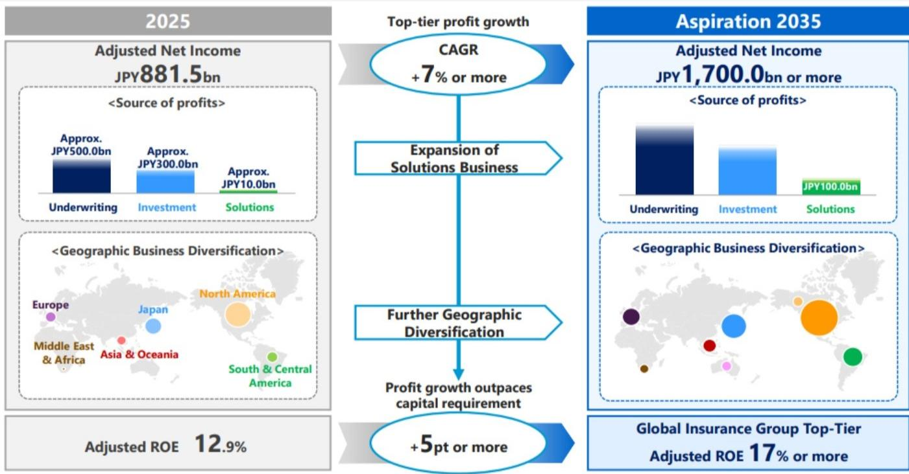

# The Softening Rate Cycle Is Reshaping Insurance Strategy: Reinsurance Optimisation and M&A Are Now the Primary Levers for ROE Expansion

The hard premium rate cycle that has sustained insurer margins for the past several years is entering a clear softening phase. Across multiple classes, rate increases are decelerating, and in key reinsurance markets, risk-adjusted pricing is falling back toward early-2020s levels. For general insurers, this is not a crisis—but it is a strategic inflection point. The question is no longer whether margins will compress, but how management teams will redeploy capital and restructure their risk portfolios to maintain returns. The answer emerging from the data is twofold: aggressive use of reinsurance to optimise capital efficiency, and a broad-based acceleration in M&A activity, particularly as valuations on rate-exposed businesses become more attractive. The current environment rewards those who treat their balance sheet as an active tool, not a static constraint.

The timing matters because the conditions are unusually aligned. Global reinsurer capital has risen to approximately USD 785 billion, a roughly 10% increase, while third-party capital from insurance-linked securities and catastrophe bonds has surged 18%. Reinsurer returns on equity remain strong at around 17%, meaning the sector is generating capital well in excess of what organic growth can absorb. This overhang of capacity is driving favourable pricing for buyers—primary insurers—who can now negotiate meaningful reductions in their reinsurance costs while simultaneously accessing profit commission structures that smooth earnings across underwriting cycles. Meanwhile, major Japanese non-life insurers are sitting on substantial excess capital from the divestment of cross-shareholdings and have publicly signalled their intent to pursue international M&A, with Australia identified as a priority market. The combination of cheap reinsurance, abundant third-party capital, and motivated acquirers creates a window for strategic repositioning that will not remain open indefinitely.

The argument of this article is straightforward: the softening rate cycle is not a passive headwind to be endured but an active catalyst for structural change. Insurers that move early to optimise their reinsurance programmes and evaluate divestiture or partnership opportunities will emerge with stronger, more diversified earnings profiles. Those that wait risk being left with underperforming lines, trapped capital, and no strategic optionality.

## Reinsurance Pricing Is Falling Faster Than Rate Adequacy Justifies, Creating an Arbitrage for Primary Insurers

The most immediate implication of the current cycle is the disconnect between reinsurance rate reductions and the underlying adequacy of pricing in individual markets. The upcoming 1 July 2026 Australian renewal is expected to see risk-adjusted rates decline by 10% to 15%, with the market leaning closer to the higher end of that range. Critically, this reduction is not a function of local market conditions. The same magnitude of decline is being observed globally—across Australia, Africa, and China—regardless of each geography's starting point for rate adequacy. The result is a patchwork: some markets that were already barely adequate are now entering territory where underwriting margins could become thin, while others that were generously priced remain comfortably profitable even after the reduction.

For primary insurers, this creates a clear arbitrage. Reinsurers, flush with capital and competing aggressively for market share, are offering terms that do not fully reflect the risk profile of the underlying books. The report notes that second- and third-tier reinsurers are becoming more competitive, further compressing pricing. This is not a sustainable equilibrium. Reinsurer ROEs are still well above long-term averages, and unless catastrophe losses become significantly more severe, there is little incentive for the market to harden. The implication for primary insurers is that now is the time to lock in multi-year reinsurance protections, ideally with profit commission features that allow them to defer some of their current high margins into future periods when rates may be lower.

This is precisely what IAG and Suncorp have been doing. Both companies have purchased additional reinsurance cover with profit commission terms, effectively smoothing their earnings profiles by shifting profits from the current hard market into outer years. This is not merely a defensive tactic. It is a form of capital management that allows these insurers to maintain reported ROEs above target even as the underlying rate environment softens. The strategic insight is that reinsurance is no longer just a risk transfer tool; it is a balance sheet optimisation instrument that can be calibrated to meet specific return targets.

## IAG's Restructuring of Its Intermediated Business Reveals a Broader Industry Tension Between Underperformance and Strategic Optionality

A deeper look at IAG's commercial lines strategy illustrates the structural challenges that many insurers face as the cycle turns. IAG has restructured its intermediated insurance business—covering the CGU and WFI brands—into a standalone subsidiary with its own general insurance licence. The motivation is clear: this business has consistently earned returns well below the group average. The intermediated segment's ROE stands at approximately 11.7%, compared with the group's target of 15% or more. Even after implementing material expense savings, IAG expects the margin to reach only about 13%, still below the group benchmark.

The problem is not unique to IAG. Many composite insurers have legacy business units that were written during softer underwriting conditions and have not fully repriced. As the overall rate environment softens, these underperforming units become a drag on group returns and a drain on capital that could be deployed elsewhere. The question is what to do with them. IAG's approach has been to create structural separation, which opens up a range of options: a reinsurance transaction to release capital, a partial sale, or even a full divestiture. The report suggests that a reinsurance structure is the most likely catalyst for improving returns, with M&A not explicitly flagged as a strategy. But the very act of ring-fencing the business signals that management is preparing for a transaction.

This matters because the same logic applies across the sector. Any insurer with a business line earning below its cost of capital is carrying a hidden liability. In a softening market, that liability grows as top-line pricing weakens. The strategic imperative is to either fix the unit through expense reduction and capital optimisation, or to exit. The current abundance of reinsurance capacity and the presence of well-capitalised acquirers—particularly from Japan—means that exit options are more viable today than they have been in years. The report does not answer whether IAG will ultimately pursue a transaction for its intermediated business, but the restructuring makes it a question worth watching closely.

## Japanese Non-Life Insurers Are the Most Important New Variable in Australian Insurance M&A, and Their Appetite Is Underestimated

The most consequential development for Australian insurance M&A is the emergence of Japanese non-life insurers as aggressive, well-capitalised buyers. Tokio Marine, Sompo, and MS&AD are each pursuing distinct but overlapping strategies, and their combined firepower is substantial. Tokio Marine alone has indicated M&A capacity of up to USD 20 billion, driven by the redeployment of proceeds from equity stake sales and balance sheet optimisation through subordinated debt. Its recently announced strategic partnership with Berkshire Hathaway further amplifies this capacity, providing access to Berkshire's capital and underwriting expertise in exchange for a 2.5% equity stake and a whole-of-account quota share reinsurance arrangement.

The partnership is particularly significant because it broadens the scope of M&A that Tokio Marine can pursue. Historically, Tokio Marine focused on smaller, unlisted targets where it could negotiate favourable multiples. The Berkshire partnership opens the door to large-scale acquisitions, including publicly listed companies, without requiring Tokio Marine to commit its entire balance sheet. The report notes that Tokio Marine's pipeline now extends well beyond the USD 1 billion bolt-on range. For Australian insurers, this means that potential acquirers are not just looking at niche portfolios but could be interested in entire business units or even controlling stakes in listed entities.

Sompo's strategy is similarly aggressive. Following its USD 3.5 billion acquisition of Aspen in February 2026, Sompo retains approximately JPY 1 trillion (roughly AUD 8.9 billion) in excess capital for growth, with 60% to 70% earmarked for overseas M&A. Its recent recruitment of nine specialist underwriters in Australia, covering property, casualty, financial lines, energy, and construction, signals a clear intent to build a meaningful presence in the Australian commercial market. MS&AD is more cautious, having completed a 15% acquisition of W.R. Berkley and indicating a preference for smaller bolt-on investments in Asia and international life insurance. But even its more tentative stance leaves room for opportunistic deals.

The common thread is that Japanese insurers are targeting lines of business that are showing the most material rate softening, such as financial lines, because those lines offer better valuations. This is a contrarian approach: they are willing to buy into a deteriorating pricing environment because they believe their cost of capital and underwriting discipline will allow them to outperform over the cycle. For Australian insurers considering divestitures, this creates a natural bid for exactly the businesses that are becoming most difficult to manage internally.

## The Report Leaves an Unanswered Question: How Will Commercial Lines Insurers Respond When Rate Softening Outpaces Cost Inflation?

For all the detail on reinsurance and M&A, the report raises a critical question that it does not fully resolve: what happens if the softening of commercial lines rates accelerates beyond the ability of insurers to cut costs or restructure? The data on commercial lines ROE and gross written premium growth shows that the sector has been enjoying a prolonged period of above-trend profitability. But the rate cycle is now turning, and the report's own exhibits suggest that commercial lines GWP growth is already decelerating. If loss cost inflation remains elevated—driven by social inflation, litigation trends, and climate-related exposures—the margin squeeze could be more severe than the current consensus expects.

The report's framework implicitly assumes that insurers will be able to offset rate softening through reinsurance optimisation and expense reduction. But this assumes a degree of management skill and execution that is not uniformly distributed across the industry. Smaller or less sophisticated insurers may find themselves unable to access the favourable reinsurance terms that larger players like IAG and Suncorp are securing. They may also lack the scale to achieve meaningful expense savings. For these companies, the softening cycle could become a survival test.

The report does not explore this tail risk in depth, and that is a deliberate analytical gap. It leaves the reader with a clear decision framework for the winners—optimise reinsurance, evaluate M&A, restructure underperforming units—but it does not fully map the downside for the losers. That is the open question that makes the full report worth reading.

## A Decision Framework for Insurers Navigating the Softening Cycle

Based on the analysis, management teams should evaluate their strategic options through a three-step framework. First, assess the rate adequacy of each major business line relative to the market. The global uniformity of reinsurance rate reductions means that some lines are now priced below their true risk cost, while others remain adequately capitalised. The key is to identify which lines are at risk of margin compression and quantify the gap between current pricing and sustainable returns.

Second, evaluate the reinsurance structure as a strategic lever, not just a cost centre. The current market offers an opportunity to lock in multi-year protections with profit commission features that smooth earnings and release capital. This is particularly valuable for lines where the insurer has a competitive advantage in underwriting but faces cyclical pricing headwinds. The decision is not just about how much reinsurance to buy, but what form it should take—quota share, excess of loss, or a hybrid structure—and whether it should be structured to facilitate a future divestiture.

Third, assess M&A optionality from both sides of the table. For underperforming business units, the presence of well-capitalised Japanese buyers with a stated appetite for Australian assets creates a credible exit path. For well-performing units with strong market positions, the question is whether to acquire complementary books of business to build scale and diversification. The report's data on the correlation between rate softening and M&A activity is clear: transaction volumes increase as pricing weakens. The strategic question is whether to be a buyer, a seller, or both.

## The Full Report Contains the Charts and Data That Make These Decisions Actionable

The analysis presented here is a synthesis of a detailed research report that includes proprietary exhibits on reinsurance pricing cycles, sector ROE trends, capital accumulation, and the specific M&A frameworks of Tokio Marine, Sompo, and MS&AD. The charts on catastrophe reinsurance pricing, reinsurer ROEs, and commercial versus personal lines ROE trajectories are essential for any management team or investor trying to calibrate their own assumptions against the market. The report also includes price targets and risk assessments for IAG and Suncorp that provide a concrete reference point for valuation.

The open questions—how far rates will fall, which insurers are most exposed, and whether the Japanese M&A wave will extend to larger targets—are precisely the issues that the full report helps to resolve. The data is there, but the interpretation requires context. Join the community to read the full report and review the original charts.

*This article is for learning and discussion only and does not constitute investment advice.*

Personal reading notes and learning share only. Not investment advice.

