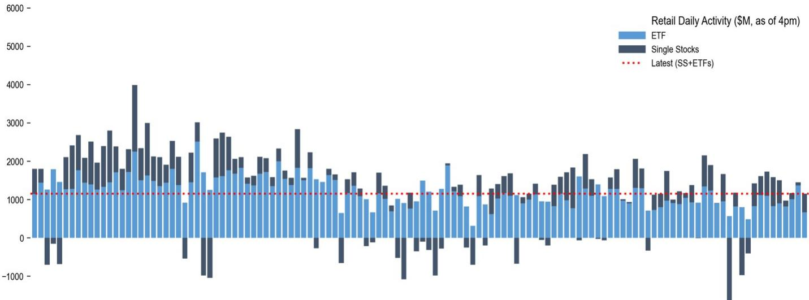

# JPM：散户正在用行动重写“逢低买入”的定义

本周全球科技股遭遇剧烈抛售，韩国与半导体板块领跌。但JPM最新一期《Retail Radar》报告揭示了一个反直觉的现象：散户不仅没有撤退，反而在主动承接抛压。这份覆盖6月18日至24日交易数据的周报，核心判断值得每一个关注市场结构的投资者认真对待——**散户参与度依然坚挺，但结构正在发生深刻的内部迁移，ETF与个股之间的资金流向分化，正在暴露新的定价机制。**

这不是一份简单的资金流量统计。JPM团队在报告中系统性地追踪了散户在单只股票、ETF、期权及主题篮子中的活动。其核心发现是：尽管整体零售资金流从上周高位回落，但个股交易活跃度仍处于65%分位数，而ETF活动已降至25%分位数。这意味着，散户正在从被动配置转向主动选股，而且他们选择的标的和时机，正在与机构形成越来越明显的对赌。

为什么现在重要？因为当散户开始集中力量承接半导体和AI硬件股、同时对黄金ETF和通信服务板块果断离场时，这不再是“噪音交易”，而是具备价格发现功能的资金行为。JPM的数据显示，本周零售总资金流为63亿美元，略低于12周均值67亿美元，但结构上的分化远比总量有意义。

---

## 1. 半导体暴跌中的逆势买入：散户正在成为“记忆体”的边际定价者

报告中最引人注目的数据来自存储芯片板块。在半导体股票本周普遍下跌6%至14%的背景下，散户对美光（MU）和闪迪（SNDK）的买入强度达到了极端水平。MU在6月18日单日零售资金流入高达8.3个标准差，这在其财报发布前就已经出现。而SNDK整周净买入3.54亿美元，达到2.4个标准差。

JPM团队专门绘制了MU的零售资金流图（Figure 2），清晰地显示散户在股价下跌过程中持续加仓。这种行为模式并非首次出现——在报告列出的历史回顾中，“Memory and AI, the Catch-Up Trade”已是5月6日的主题。但这一次的不同之处在于，散户的买入发生在韩国科技股ETF（EWY）出现大规模流出的背景之下。

> **KC评论：** 散户在MU上的行为，本质上是一种“已知风险的逆向押注”。他们知道半导体周期仍在消化库存压力，但他们赌的是AI需求驱动的结构性增长。完整报告中的Figure 1和Figure 2展示了零售资金流与股价走势的时序关系，值得仔细推敲——散户到底是在“抄底”还是在“接盘”？这个问题的答案，取决于你对存储芯片周期拐点的判断。

---

## 2. ETF资金流向揭示的“隐性恐慌”：通信服务遭遇15个月来最大抛售

与个股的积极买入形成鲜明对比，ETF市场正在经历一轮显著的资金撤离。报告特别指出，通信服务ETF的零售资金流达到了15个月以来的最低点。具体来看，XLC（通信服务精选行业ETF）本周净流出达到4.2个标准差，成为拖累整体ETF活动的主要力量。

与此同时，黄金ETF（GLD）也未能幸免。尽管金价在周三跌破4000美元关口，但这反而触发了更强烈的零售资金流出，单日达到1.9个标准差。JPM团队在报告中写道：“GLD在最近几个月几乎被零售投资者完全忽视。”

这些数据合在一起意味着什么？散户正在从“防御性资产”和“过气成长板块”中撤离，将资金集中到少数几个他们认为有叙事支撑的领域——AI硬件、半导体、以及部分MEME股。这种资金集中化的趋势，正在放大这些板块的波动性。

> **KC评论：** 散户卖出通信服务和黄金ETF，买入MU和NVDA，这不是简单的“风险偏好上升”。更准确的解读是，散户正在用行动表达对“AI替代传统服务”和“黄金作为通胀对冲工具失效”的判断。完整报告中的Figure 9和Figure 10详细展示了XLC的流出轨迹，这些图表对于理解散户对通信板块的定价权转移至关重要。

---

## 3. 期权市场的“散户化”正在重塑波动率曲线

报告中最具结构意义的发现，来自期权市场。JPM指出，散户在期权交易中的份额已达到历史高位（Figure 46），这一现象主要由通信板块期权交易量激增驱动（Figure 3），而代价是科技板块期权活动的相对下降（Figure 4）。

从具体合约来看，本周散户交易量最大的期权标的依次是：特斯拉、美光、英伟达、亚马逊、Meta、闪迪、AMD、英特尔和谷歌。这份名单与过去几周高度一致，说明散户的期权交易正在形成一种“惯性偏好”。

更值得关注的是，JPM衍生品分析师在报告中提出了一个具体的交易建议：鉴于谷歌和微软在过去一个月均下跌约11%，而纳斯达克指数仍在创新高且基本面保持建设性，他们建议卖出这两个标的2个月期价外看跌期权，作为一种“目标买入”策略。

> **KC评论：** 期权市场的散户化，意味着波动率的定价权正在从做市商向零售资金倾斜。散户的集中买入往往会压低隐含波动率，但当他们集体平仓时，波动率会急速飙升。完整报告中的Figure 46和Figure 49展示了过去几个月散户期权份额的变化趋势，这对于任何使用期权进行对冲或投机的投资者来说，都是必须理解的变化。

---

## 4. MEME股的“挤仓风险”正在降温，但新的战场已经出现

报告专门开辟了一个章节讨论MEME股的对峙格局。JPM使用“零售买入 vs 对冲基金做空”的框架，筛选出社交媒体热度高、零售买入强、同时空头比例高的股票。

本周的名单包括：AECOM、Snap、Accenture、Super Micro、Palantir、NuScale Power、美光、京东、IREN、Nebius Group、AMD、Reddit、AST SpaceMobile、Marvell、PDD、微软、Smith & Wesson、Rocket Lab、英伟达和博通。

但报告的关键判断是：MEME股的挤仓风险正在下降。Figure 17显示，随着散户开始卖出部分高做空比例股票，零售与对冲基金之间的“对峙斜率”正在趋平。这意味着，过去那种因空头被迫回补而引发的剧烈上涨，短期内可能难以重现。

然而，新的战场已经出现。报告特别提到了三只股票：BIRD（从鞋类零售商转型为AI基础设施公司）、CPB（被移出标普500指数后零售买入加速）、以及ODD（通过回购压低可转债成本）。这些公司的共同特点是：基本面出现重大变化，但空头仓位依然很高。

---

## 5. 报告尚未完全回答的关键问题：散户的“记忆体信仰”能否持续？

这份JPM报告提供了极其丰富的数据，但它也留下了几个关键未解问题。

第一，散户对MU和SNDK的集中买入，是基于对存储芯片周期拐点的独立判断，还是仅仅因为“AI叙事”的惯性？如果存储芯片价格在下一季度继续疲软，散户会继续加仓，还是会迅速撤离？

第二，期权市场散户份额的持续上升，是否意味着波动率定价机制正在发生不可逆的结构性变化？报告提供了数据，但没有深入讨论做市商如何调整对冲策略来适应这一变化。

第三，散户卖出黄金ETF的行为，是否反映了更深层次的资产配置偏好转移？如果散户真的放弃了黄金作为“避险资产”的信仰，那么在下一个风险事件来临时，他们会转向什么？

这些问题，报告没有完全展开。但正是这些未解之处，提供了继续深入阅读和讨论的价值。

---

这份JPM《Retail Radar》报告覆盖了6月18日至24日的完整交易数据，包含超过50张图表和详细的主题篮子分析。我们每天会由AI agent结合人工review，生成国际投行中文摘要与KC评论，daily更新约10-40页，并整理当天最新数据图表合集，方便喂给AI，也方便人工快速把握market dynamics。欢迎来星球微信群里继续讨论。

Personal reading notes and learning share only. Not investment advice.

