June 24, 2026 11:55 AM GMT

US Rates Strategy | North America

# How Much Will Vol Go Up Under Warsh?

The first FOMC under Warsh suggests less forward guidance. Markets would likely place greater weight on economic data and react more strongly to surprises. Looking back to the Greenspan era, we quantify how changes in market sensitivity to economic data could translate into higher rates volatility.

## Key Takeaways

\- Warsh's first press conference suggests less forward guidance. Economic data should play a larger role in market pricing.

The Greenspan era provides the closest comparison for a less guided Fed and offers clues on how much market sensitivity to economic data could increase.

We measure market sensitivity using the relationship between economic surprises and Treasury yield moves, with both variables normalized.

■ Market reaction to data surprises declined steadily from the Greenspan era through the pre-COVID period. Warsh could reverse part of that decline.

\- Higher market sensitivity to economic data argues for higher short-dated volatility. Intermediate expiries should follow. Stay long 2y10y straddles.

MS & CO. LLC

Shaun.Zhou@morganstanley.com +1 212 761-3348

Strategist
Matthew.Hornbach@morganstanley.com +1 212 761-1837

Strategist
Martin.Tobias@morganstanley.com +1 212 761-6076

Aryaman Singh
Strategist
Aryaman@morganstanley.com +1 212 761-1993

# Interest Rate Derivative Strategy

## United States | How much will vol go up under Warsh?

MS & CO. LLC
Shaun Zhou
Shaun.Zhou@morganstanley.com
+1 212 761-3348

Matthew.Hornbach@morganstanley.com +1 212 761-1863

Martin.Tobias@morganstanley.com +1 212 761-6076

Aryaman@morganstanley.com +1 212 761-1993

Eli.Carter@morganstanley.com +1 212 761-4703

## Fed communication policy revamped

The first FOMC press conference under Chair Warsh suggests a meaningful shift in the Fed's communication strategy. By scaling back forward guidance, the Fed is providing markets with less information about its expected policy path.

A market that receives less guidance from policymakers must extract more information from economic releases. That argues for greater sensitivity to macro data and higher rates volatility.

To gauge the potential increase in market sensitivity, we look to the Greenspan era, when forward guidance played a much smaller role in monetary policy. If Warsh continues down this path, that period offers the closest historical comparison.

## Measure market sensitivity to economic releases

We quantify market sensitivity by examining the relationship between economic surprises and Treasury yield moves on release dates.

To ensure comparability across different Fed regimes, both variables are normalized. Economic surprises are scaled by their rolling two-year standard deviation, while yield moves are scaled by three-month realized volatility.

The resulting measure captures how strongly rates respond to a given economic surprise over time.

## Market sensitivity to NFP

Exhibit 1 plots normalized NFP surprises against normalized changes in the 2-year Treasury yield on payroll release dates. Each point represents a monthly observation, with colors denoting different Fed chairs. We also overlay a separate regression line for each Fed regime, splitting Powell's tenure into pre- and post-COVID periods to account for the different macro environments.

The positive relationship between payroll surprises and front-end rates is consistent across all regimes: stronger payrolls tend to push 2-year yields higher. The more

important question is whether market sensitivity to payroll surprises has changed over time.

Exhibit 2 cuts through the noise by reporting the estimated sensitivity of 2-year yields to NFP surprises, along with 90% confidence intervals. While the estimates are subject to uncertainty given the limited number of observations within each Fed regime, the trend is clear: market sensitivity to payroll surprises declined steadily from the Greenspan era through the pre-COVID period.

During the pre-COVID period of Powell's first term, the response of the 2-year Treasury yield to a given payroll surprise was roughly half of its Greenspan-era level. While multiple factors likely contributed to this decline, the increase in policy transparency and forward guidance was clearly part of the shift.

The pandemic reversed this trend. Elevated inflation, higher policy rates, and a series of large macro shocks increased the market's response to economic data, bringing sensitivity to NFP back to levels comparable to the Greenspan era.

As Warsh reduces the role of forward guidance, we expect some further increase in sensitivity. While the exact magnitude is uncertain, a full reversal of the decline since the Greenspan era would imply an increase of up to 0.5x daily volatility per unit of data surprise.

Exhibit 1: Normalized market response to NFP surprises since 1997  
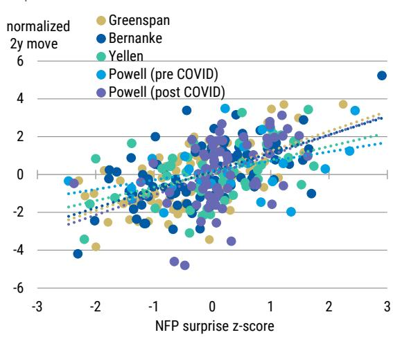  
Source: Bloomberg. MS.

Exhibit 2: Market sensitivity to NFP surprises declined since Greenspan  
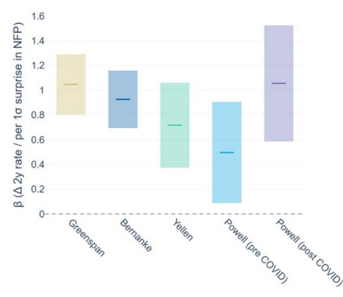  
Source: Bloomberg. MS.

## Different pattern for inflation data

Exhibit 3 plots normalized surprises in monthly CPI against normalized changes in the 2-year Treasury yield.

Unlike payrolls, inflation surprises had little consistent impact on front-end rates prior to COVID. While CPI releases occasionally generated large market moves, the relationship between inflation surprises and Treasury yields was weak and statistically unstable across earlier Fed regimes.

The pandemic changed this. As inflation became a key driver of monetary policy, markets began responding more consistently to CPI surprises. Exhibit 4 shows that the market sensitivity increased sharply in the post-COVID period. Our FX strategies team documented a similar shift in currency markets.

Markets are already highly sensitive to inflation data, and recent FOMC communications suggest that inflation remains the primary policy concern under Warsh. As a result, inflation releases could have a larger impact on front-end rates than employment data in the near term.

Exhibit 3: Normalized market response to CPI surprises since 1998  
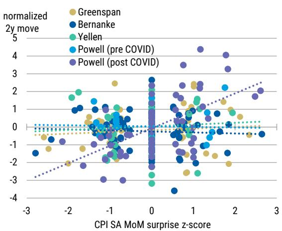  
Source: Bloomberg. MS.

Exhibit 4: Market sensitivity to CPI increased post-pandemic  
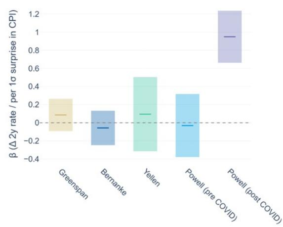  
Source: Bloomberg. MS.

## Trend confirmed by intraday moves

Daily yield changes capture more than the market response to economic releases. To isolate the direct impact of NFP and CPI, we expand the analysis to yield changes over the 60 minutes following the 8:30 a.m. release.

Data availability limits the intraday analysis to the period since 2013, preventing a direct comparison with the Greenspan era. Nevertheless, the results closely mirror the patterns observed in the daily data, confirming that market sensitivity tends to be higher under a less guided Fed:

\- Market sensitivity to payroll surprises declined from the Bernanke era through the pre-COVID period.

• Markets did not respond consistently to CPI surprises prior to the pandemic.

\- Market sensitivity to both employment and inflation surprises increased after the pandemic.

Exhibit 5: Market sensitivity to NFP surprises: 60-minute response

<table><tr><td>Chair</td><td>market sensitivity (beta)</td><td>R^2</td><td>t-stat</td></tr><tr><td>Bernanke</td><td>1.11</td><td>0.60</td><td>3.23</td></tr><tr><td>Yellen</td><td>0.68</td><td>0.22</td><td>3.55</td></tr><tr><td>Powell (pre COVID)</td><td>0.38</td><td>0.24</td><td>2.67</td></tr><tr><td>Powell (post COVID)</td><td>0.81</td><td>0.22</td><td>4.50</td></tr></table>

Source: Bloomberg. MS.

Exhibit 6: Market sensitivity to CPI surprises: 60-minute response

<table><tr><td>Chair</td><td>market sensitivity (beta)</td><td>R^2</td><td>t-stat</td></tr><tr><td>Bernanke</td><td>0.11</td><td>0.08</td><td>0.73</td></tr><tr><td>Yellen</td><td>0.33</td><td>0.10</td><td>2.18</td></tr><tr><td>Powell (pre COVID)</td><td>0.24</td><td>0.16</td><td>2.03</td></tr><tr><td>Powell (post COVID)</td><td>0.79</td><td>0.35</td><td>6.09</td></tr></table>

Source: Bloomberg. MS.

## Conclusion

Our analysis suggests that market sensitivity to economic data declined steadily from the Greenspan era through the pre-COVID period. This likely reflects a combination of factors, including Fed forward guidance, the expanded policy toolkit, and changes in the macro environment. Regardless of the cause, the historical evidence shows a clear relationship between more forward guidance and lower market sensitivity to economic data.

Historical experience suggests that some of the decline in market sensitivity since the Greenspan era could reverse under Warsh. With markets already responding more strongly to employment and inflation data than they did before the pandemic, we think further increases would translate into larger moves around key economic releases.

Ultimately, long-term volatility will likely depend on the size of future economic surprises. However, a market that relies more heavily on incoming data should see larger rate moves in response to a given surprise. This argues for higher short-dated volatility. As markets digest changes in Fed communication, intermediate expiries should follow. We therefore maintain our recommendation to own 2y10y volatility through long straddles.

## SDR Monitor

Following the FOMC, dealer gamma positioning has normalized in the front end, with desks now broadly flat gamma across tails of 2 years and shorter. In contrast, dealers remain short gamma in the long end, particularly in tails of 9 years and longer.

Investor flows remained balanced over the past two weeks, with modest gamma selling in 3m10y and 3m15y. Elsewhere, investors rotated into longer-dated expiries, buying 10y+ expiries against selling 5y expiries.

Exhibit 7: Dealer net gamma exposure  
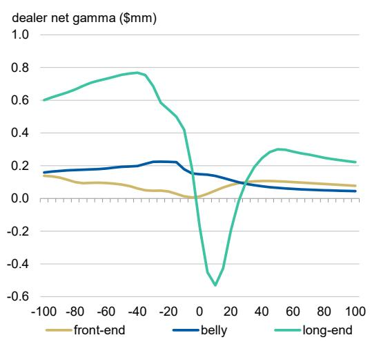  
Source: DTCC, MS

Exhibit 8: Historical spot dealer net gamma exposure  
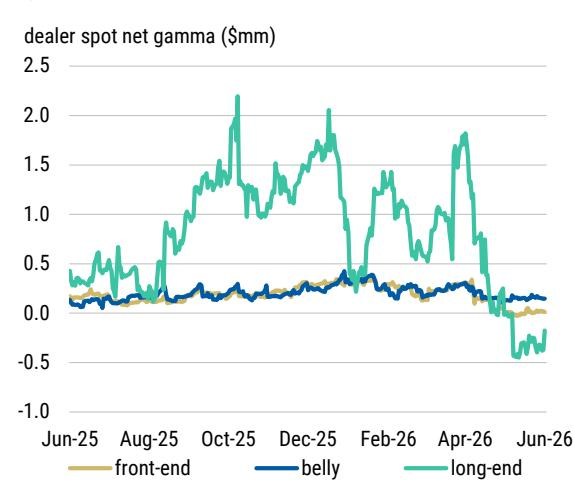  
Source: DTCC, MS

Exhibit 9: Net customer flow in gamma (\$k)

<table><tr><td>exp\tail</td><td>1Y</td><td>2Y</td><td>3Y</td><td>5Y</td><td>10Y</td><td>15Y</td><td>20Y</td><td>30Y</td></tr><tr><td>1M</td><td>(1)</td><td>3</td><td>0</td><td>(27)</td><td>(29)</td><td>(4)</td><td>(5)</td><td>(8)</td></tr><tr><td>2M</td><td>0</td><td>1</td><td>0</td><td>(1)</td><td>6</td><td>0</td><td>0</td><td>22</td></tr><tr><td>3M</td><td>(6)</td><td>(4)</td><td>2</td><td>6</td><td>(42)</td><td>(89)</td><td>(0)</td><td>(23)</td></tr><tr><td>6M</td><td>1</td><td>(3)</td><td>0</td><td>8</td><td>0</td><td>0</td><td>0</td><td>(10)</td></tr><tr><td>9M</td><td>(3)</td><td>2</td><td>0</td><td>2</td><td>1</td><td>0</td><td>1</td><td>(3)</td></tr><tr><td>1Y</td><td>(2)</td><td>(12)</td><td>1</td><td>3</td><td>14</td><td>0</td><td>0</td><td>16</td></tr><tr><td>18M</td><td>(0)</td><td>(0)</td><td>(4)</td><td>0</td><td>2</td><td>0</td><td>0</td><td>3</td></tr><tr><td>2Y</td><td>(3)</td><td>(2)</td><td>0</td><td>2</td><td>(4)</td><td>0</td><td>(0)</td><td>1</td></tr><tr><td>3Y</td><td>0</td><td>0</td><td>0</td><td>(1)</td><td>(2)</td><td>0</td><td>1</td><td>(0)</td></tr><tr><td>5Y</td><td>(0)</td><td>1</td><td>0</td><td>0</td><td>(3)</td><td>0</td><td>(1)</td><td>(7)</td></tr><tr><td>10Y</td><td>0</td><td>(0)</td><td>0</td><td>0</td><td>(0)</td><td>0</td><td>2</td><td>(0)</td></tr><tr><td>15Y</td><td>0</td><td>0</td><td>0</td><td>0</td><td>0</td><td>0</td><td>0</td><td>0</td></tr><tr><td>20Y</td><td>0</td><td>0</td><td>0</td><td>0</td><td>0</td><td>0</td><td>0</td><td>0</td></tr></table>

Source: DTCC, MS

Exhibit 10: Net customer flow in vega (\$k)

<table><tr><td>exp\tail</td><td>1Y</td><td>2Y</td><td>3Y</td><td>5Y</td><td>10Y</td><td>15Y</td><td>20Y</td><td>30Y</td></tr><tr><td>1M</td><td>(5)</td><td>18</td><td>0</td><td>(184)</td><td>(158)</td><td>(20)</td><td>(28)</td><td>(42)</td></tr><tr><td>2M</td><td>4</td><td>22</td><td>0</td><td>(9)</td><td>77</td><td>0</td><td>0</td><td>235</td></tr><tr><td>3M</td><td>(114)</td><td>(84)</td><td>44</td><td>118</td><td>(799)</td><td>(1,611)</td><td>(3)</td><td>(336)</td></tr><tr><td>6M</td><td>53</td><td>(166)</td><td>0</td><td>302</td><td>32</td><td>0</td><td>0</td><td>(361)</td></tr><tr><td>9M</td><td>(199)</td><td>175</td><td>0</td><td>157</td><td>101</td><td>0</td><td>65</td><td>(136)</td></tr><tr><td>1Y</td><td>(206)</td><td>(1,122)</td><td>134</td><td>223</td><td>1,043</td><td>0</td><td>0</td><td>1,246</td></tr><tr><td>18M</td><td>(8)</td><td>(30)</td><td>(480)</td><td>0</td><td>184</td><td>0</td><td>0</td><td>325</td></tr><tr><td>2Y</td><td>(545)</td><td>(276)</td><td>0</td><td>267</td><td>(633)</td><td>22</td><td>(0)</td><td>131</td></tr><tr><td>3Y</td><td>0</td><td>36</td><td>0</td><td>(289)</td><td>21</td><td>0</td><td>297</td><td>(100)</td></tr><tr><td>5Y</td><td>(201)</td><td>555</td><td>0</td><td>141</td><td>(1,332)</td><td>0</td><td>(302)</td><td>(2,554)</td></tr><tr><td>10Y</td><td>0</td><td>(26)</td><td>0</td><td>248</td><td>(11)</td><td>0</td><td>1,047</td><td>(70)</td></tr><tr><td>15Y</td><td>0</td><td>0</td><td>0</td><td>0</td><td>396</td><td>0</td><td>0</td><td>0</td></tr><tr><td>20Y</td><td>0</td><td>0</td><td>0</td><td>0</td><td>62</td><td>0</td><td>0</td><td>0</td></tr></table>

Source: DTCC, MS

## Callable Issuance Monitor

June issuance slowed along expected seasonal lines. Coupons on 6–10y supranational bonds have risen toward 5%, providing a healthier spread pickup over comparable-duration Treasuries.

Exhibit 11: Notional of callable issuance  
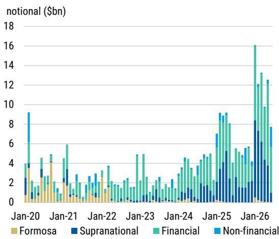  
Source: Bloomberg, MS

Exhibit 12: Vega supply from callable issuance  
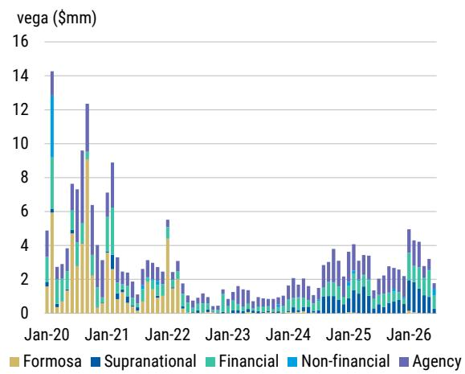  
Source: Bloomberg, MS

Exhibit 13: Recent vega supply by pricing date  
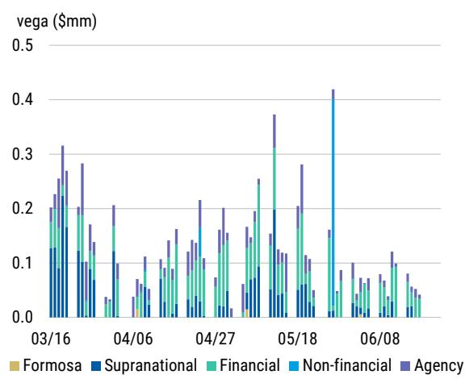  
Source: Bloomberg, MS

Exhibit 14: Coupon of supranational issuance (6-10y maturity) vs. 10y Treasury yields  
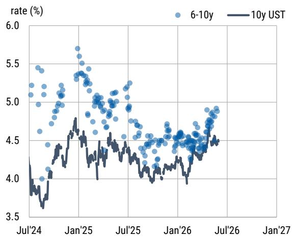  
Source: Bloomberg, MS

## Skew Signal Monitor

The recent rally in long-end rates has been accompanied by a normalization in skew. The 21-day change in 3m10y skew has reverted to near zero. Skew signal suggests approximately 30% of max short duration exposure.

Exhibit 15: Skew change and duration position  
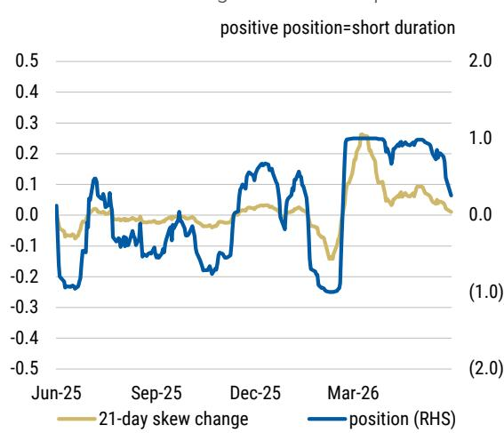  
Source: Bloomberg, S&P, MS.  
Exhibit 16: Duration position and signal performance

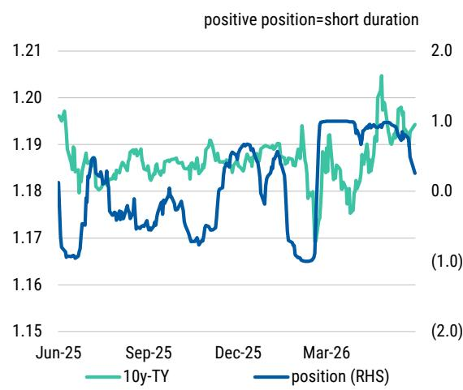  
Source: Bloomberg, S&P, MS.

• Trade idea: Maintain long 2y10y straddle outright

• Trade idea: Maintain long 1y1y F/F+25/F+50 payer ladder

## Valuation Methodology and Risks

Below you will find a list of our current trade ideas, entry levels, entry dates, rationales, and risks.

<table><tr><td colspan="5">Interest Rate Derivatives</td></tr><tr><td>TRADE</td><td>ENTRY LEVEL</td><td>ENTRY DATE</td><td>RATIONALE</td><td>RISKS</td></tr><tr><td>Buy 2y10y straddle</td><td>670c</td><td>6/10/2026</td><td>2y10y expected to be supported by structural flow from mortgage hedgers demand and reduced supply from callable issuance.</td><td>The risk is if vol drops significantly while rates remain anchored near strike level.</td></tr><tr><td>Buy 1y1y F/F+25/F+50 payer ladder</td><td>0c</td><td>3/10/2026</td><td>Recent selloff in rates and pick up in vol created an attractive window for 1y1y payer ladders. Breakeven level sits at levels that imply Fed hike over the next 2 years.</td><td>The risk is if energy-driven inflation becomes sustainable and forces the Fed to hike rates as a response.</td></tr></table>

## Global Macro Strategy Team

<table><tr><td>MS &amp; CO. LLC</td><td>Matthew Hornbach, CMTMatthew.Hornbach@morganstanley.com</td><td>Global Head of Macro Strategy</td><td>+1 212 761-1837</td></tr><tr><td></td><td>Martin Tobias, CFA, CMT</td><td>US Rates Strategist</td><td>+1 212 761-6076</td></tr><tr><td></td><td>Shaun Zhou</td><td>US Rates Strategist</td><td>+1 212 761-3348</td></tr><tr><td></td><td>Aryaman Singh</td><td>US Rates Strategist</td><td>+1 212 761-1993</td></tr><tr><td></td><td>Eli Carter</td><td>US Rates Strategist</td><td>+1 212 761-4703</td></tr><tr><td>MS &amp; CO. LLC</td><td>Andrew Watrous</td><td>G10 FX Strategist</td><td>+1 212 761-5287</td></tr><tr><td></td><td>Molly Nickolin</td><td>G10 FX Strategist</td><td>+1 212 761-3592</td></tr><tr><td></td><td>Simon WaeverSimon.Waever@morganstanley.com</td><td>Head of EM Sovereign Credit and Latin America Fixed Income Strategy</td><td>+1 212 296-8101</td></tr><tr><td></td><td>Ioana Zamfir</td><td>Head of Latin America Macro Strategy</td><td>+1 212 761-4012</td></tr><tr><td></td><td>Emma Cerda</td><td>Latin America Sovereign Credit</td><td>+1 212 761-2344</td></tr><tr><td></td><td>Sofia Palacios</td><td>Latin America Macro Strategist</td><td>+1 212 761-0428</td></tr><tr><td>MS &amp; CO.INTERNATIONAL PLC</td><td>James K. LordJames.Lord@morganstanley.com</td><td>Global Head of FXEM Strategy</td><td>+44 20 7677-3254</td></tr><tr><td></td><td>Gianluca SalfordLuca.Salford@morganstanley.com</td><td>Head of European Rates Strategy</td><td>+44 20 7677-1337</td></tr><tr><td></td><td>Maria Chiara Russo</td><td>Euro Area Rates Strategist</td><td>+44 20 7425-3499</td></tr><tr><td></td><td>Fabio Bassanin, CFA</td><td>UK Rates Strategist</td><td>+44 20 7425-1869</td></tr><tr><td></td><td>David S. Adams, CFADavid.S.Adams@morganstanley.com</td><td>Head of G10 FX Strategy</td><td>+44 20 7425-3518</td></tr><tr><td></td><td>Neville Mandimika</td><td>CEEMEA Sovereign Credit Strategist</td><td>+44 20 7425-2509</td></tr><tr><td></td><td>Arnav Gupta</td><td>CEEMEA Rates Strategist</td><td>+44 20 7677-0382</td></tr><tr><td>MS ASIALIMITED+</td><td>Gek Teng Khoo</td><td>AXJ Macro Strategist</td><td>+852 3963-0303</td></tr><tr><td>MS INDIACOMPANY PRIVATE LIMITED</td><td>Nimish Prabhune</td><td>AXJ Macro Strategist</td><td>+91 22 6996-1862</td></tr><tr><td>MS MUFGSECURITIES CO., LTD.</td><td>Koichi SugisakiKoichi.Sugisaki@morganstanleymufg.com</td><td>Head of Japan Macro Strategy</td><td>+81 3 6836-8428</td></tr><tr><td></td><td>Hiromu Uezato</td><td>Japan Macro Strategist</td><td>+81 3 6836-8431</td></tr></table>

## Disclosure Section

The information and opinions in MS were prepared by MS & Co. LLC, and/or MS C.T.V.M. S.A., and/or MS Mexico, Casa de Bolsa, S.A. de C.V., and/or MS Canada Limited. As used in this disclosure section, "MS" includes MS & Co. LLC, MS C.T.V.M. S.A., MS Mexico, Casa de Bolsa, S.A. de C.V., MS Canada Limited and their affiliates as necessary.

For important disclosures, stock price charts and equity rating histories regarding companies that are the subject of this report, please see the MS Disclosure Website at www.morganstanley.com/eqr/disclosures/webapp/generalresearch, or contact your investment representative or MS at 1585 Broadway, (Attention: Research Management), New York, NY, 10036 USA.

For valuation methodology and risks associated with any recommendation, rating or price target referenced in this research report, please contact the Client Support Team as follows: US/Canada +1 800 303-2495; Hong Kong +852 2848-5999; Latin America +1 718 754-5444 (U.S.); London +44 (0)20-7425-8169; Singapore +65 6834-6860; Sydney +61 (0)2-9770-1505; Tokyo +81 (0)3-6836-9000. Alternatively you may contact your investment representative or MS at 1585 Broadway, (Attention: Research Management), New York, NY 10036 USA.

## Analyst Certification

The following analysts hereby certify that their views about the companies and their securities discussed in this report are accurately expressed and that they have not received and will not receive direct or indirect compensation in exchange for expressing specific recommendations or views in this report: Eli P Carter, Matthew Hornbach; Aryaman Singh; Martin W Tobias, CFA; Shaun Zhou.

## Global Research Conflict Management Policy

MS has been published in accordance with our conflict management policy, which is available at www.morganstanley.com/institutional/research/conflictpolicies. A Portuguese version of the policy can be found at www.morganstanley.com.br

## Important Regulatory Disclosures on Subject Companies

In the next 3 months, MS expects to receive or intends to seek compensation for investment banking services from United States of America.

Within the last 12 months, MS has provided or is providing investment banking services to, or has an investment banking client relationship with, the following company: United States of America.

The equity research analysts or strategists principally responsible for the preparation of MS have received compensation based upon various factors, including quality of research, investor client feedback, stock picking, competitive factors, firm revenues and overall investment banking revenues. Equity Research analysts' or strategists' compensation is not linked to investment banking or capital markets transactions performed by MS or the profitability or revenues of particular trading desks.

MS and its affiliates do business that relates to companies/instruments covered in MS, including market making, providing liquidity, fund management, commercial banking, extension of credit, investment services and investment banking. MS sells to and buys from customers the securities/instruments of companies covered in MS on a principal basis. MS may have a position in the debt of the Company or instruments discussed in this report. MS trades or may trade as principal in the debt securities (or in related derivatives) that are the subject of the debt research report.

Certain disclosures listed above are also for compliance with applicable regulations in non-US jurisdictions.

## STOCK RATINGS

MS uses a relative rating system using terms such as Overweight, Equal-weight, Not-Rated or Underweight (see definitions below). MS does not assign ratings of Buy, Hold or Sell to the stocks we cover. Overweight, Equal-weight, Not-Rated and Underweight are not the equivalent of buy, hold and sell. Investors should carefully read the definitions of all ratings used in MS. In addition, since MS contains more complete information concerning the analyst's views, investors should carefully read MS, in its entirety, and not infer the contents from the rating alone. In any case, ratings (or research) should not be used or relied upon as investment advice. An investor's decision to buy or sell a stock should depend on individual circumstances (such as the investor's existing holdings) and other considerations.

## Global Stock Ratings Distribution

## (as of May 31, 2026)

The Stock Ratings described below apply to MS's Fundamental Equity Research and do not apply to Debt Research produced by the Firm.

For disclosure purposes only (in accordance with FINRA requirements), we include the category headings of Buy, Hold, and Sell alongside our ratings of Overweight, Equal-weight, Not-Rated and Underweight. MS does not assign ratings of Buy, Hold or Sell to the stocks we cover. Overweight, Equal-weight, Not-Rated and Underweight are not the equivalent of buy, hold, and sell but represent recommended relative weightings (see definitions below). To satisfy regulatory requirements, we correspond Overweight, our most positive stock rating, with a buy recommendation; we correspond Equal-weight and Not-Rated to hold and Underweight to sell recommendations, respectively.

<table><tr><td></td><td colspan="2">Coverage Universe</td><td colspan="3">Investment Banking Clients (IBC)</td><td colspan="2">Other Material Investment ServicesClients (MISC)</td></tr><tr><td>Stock RatingCategory</td><td>Count</td><td>% of Total</td><td>Count</td><td>% of Total IBC</td><td>% of RatingCategory</td><td>Count</td><td>% of Total OtherMISC</td></tr><tr><td>Overweight/Buy</td><td>1542</td><td>42%</td><td>465</td><td>51%</td><td>30%</td><td>707</td><td>43%</td></tr><tr><td>Equal-weight/Hold</td><td>1571</td><td>43%</td><td>369</td><td>40%</td><td>23%</td><td>723</td><td>44%</td></tr><tr><td>Not-Rated/Hold</td><td>3</td><td>0%</td><td>0</td><td>0%</td><td>0%</td><td>1</td><td>0%</td></tr><tr><td>Underweight/Sell</td><td>551</td><td>15%</td><td>86</td><td>9%</td><td>16%</td><td>201</td><td>12%</td></tr><tr><td>Total</td><td>3,667</td><td></td><td>920</td><td></td><td></td><td>1632</td><td></td></tr></table>

Data include common stock and ADRs currently assigned ratings. Investment Banking Clients are companies from whom MS received investment banking compensation in the last 12 months. Due to rounding off of decimals, the percentages provided in the "% of total" column may not add up to exactly 100 percent.

## Analyst Stock Ratings

Overweight (O). The stock's total return is expected to exceed the average total return of the analyst's industry (or industry team's) coverage universe, on a risk-adjusted basis, over the next 12-18 months.

Equal-weight (E). The stock's total return is expected to be in line with the average total return of the analyst's industry (or industry team's) coverage universe, on a risk-adjusted basis, over the next 12-18 months.

Not-Rated (NR). Currently the analyst does not have adequate conviction about the stock's total return relative to the average total return of the analyst's industry (or industry team's) coverage universe, on a risk-adjusted basis, over the next 12-18 months.

Underweight (U). The stock's total return is expected to be below the average total return of the analyst's industry (or industry team's) coverage universe, on a risk-adjusted basis, over the next 12-18 months.

Unless otherwise specified, the time frame for price targets included in MS is 12 to 18 months.

## Analyst Industry Views

Attractive (A): The analyst expects the performance of his or her industry coverage universe over the next 12-18 months to be attractive vs. the relevant broad market benchmark, as indicated below.

In-Line (I): The analyst expects the performance of his or her industry coverage universe over the next 12-18 months to be in line with the relevant broad market benchmark, as indicated below. Cautious (C): The analyst views the performance of his or her industry coverage universe over the next 12-18 months with caution vs. the relevant broad market benchmark, as indicated below. Benchmarks for each region are as follows: North America - S&P 500; Latin America - relevant MSCI country index or MSCI Latin America Index; Europe - MSCI Europe; Japan - TOPIX; Asia - relevant MSCI country index or MSCI sub-regional index or MSCI AC Asia Pacific ex Japan Index.

## Important Disclosures for MS Smith Barney LLC Customers

Important disclosures regarding any material conflict of interest that can reasonably be expected to have influenced MS Smith Barney LLC's choice of a third-party research provider or the subject company of a third-party research report, are available on the MS Wealth Management disclosure website at www.morganstanley.com/online/researchdisclosures. For MS specific disclosures, you may refer to https://www.morganstanley.com/eqr/disclosures/webapp/generalresearch.

Each MS report is reviewed and approved on behalf of MS Smith Barney LLC. This review and approval is conducted by the same person who reviews the research report on behalf of MS. This could create a conflict of interest.

## Other Important Disclosures

MS policy is to update research reports as and when the Research Analyst and Research Management deem appropriate, based on developments with the issuer, the sector, or the market that may have a material impact on the research views or opinions stated therein. In addition, certain Research publications are intended to be updated on a regular periodic basis (weekly/monthly/quarterly/annual) and will ordinarily be updated with that frequency, unless the Research Analyst and Research Management determine that a different publication schedule is appropriate based on current conditions.

MS is not acting as a municipal advisor and the opinions or views contained herein are not intended to be, and do not constitute, advice within the meaning of Section 975 of the Dodd-Frank Wall Street Reform and Consumer Protection Act.

MS produces an equity research product called a "Tactical Idea." Views contained in a "Tactical Idea" on a particular stock may be contrary to the recommendations or views expressed in research on the same stock. This may be the result of differing time horizons, methodologies, market events, or other factors. For all research available on a particular stock, please contact your sales representative or go to Matrix at http://www.morganstanley.com/matrix.

MS is provided to our clients through our proprietary research portal on Matrix and also distributed electronically by MS to clients. Certain, but not all, MS products are also made available to clients through third-party vendors or redistributed to clients through alternate electronic means as a convenience. For access to all available MS, please contact your sales representative or go to Matrix at http://www.morganstanley.com/matrix.

Any access and/or use of MS is subject to MS's Terms of Use (http://www.morganstanley.com/terms.html). By accessing and/or using MS, you are indicating that you have read and agree to be bound by our Terms of Use (http://www.morganstanley.com/terms.html). In addition you consent to MS processing your personal data and using cookies in accordance with our Privacy Policy and our Global Cookies Policy (http://www.morganstanley.com/privacy\_pledge.html), including for the purposes of setting your preferences and to collect readership data so that we can deliver better and more personalized service and products to you. To find out more information about how MS processes personal data, how we use cookies and how to reject cookies see our Privacy Policy and our Global Cookies Policy (http://www.morganstanley.com/privacy\_pledge.html). Please use the provided link to review the Terms and Conditions and Most Important Terms and Conditions for MS India Company Private Limited (https://www.morganstanley.com/assets/pdfs/about-us-global-offices/india/Terms\_and\_conditions.pdf) and the following link to review the audit report (https://ny.matrix.ms.com/eqr/research/webapp/researchdocs/MSICPL\_Morgan\_Stanley\_Research\_Audit\_Report.pdf).

If you do not agree to our Terms of Use and/or if you do not wish to provide your consent to MS processing your personal data or using cookies please do not access our research. MS does not provide individually tailored investment advice. MS has been prepared without regard to the circumstances and objectives of those who receive it. MS recommends that investors independently evaluate particular investments and strategies, and encourages investors to seek the advice of a financial adviser. The appropriateness of an investment or strategy will depend on an investor's circumstances and objectives. The securities, instruments, or strategies discussed in MS may not be suitable for all investors, and certain investors may not be eligible to purchase or participate in some or all of them. MS is not an offer to buy or sell or the solicitation of an offer to buy or sell any security/instrument or to participate in any particular trading strategy. The value of and income from your investments may vary because of changes in interest rates, foreign exchange rates, default rates, prepayment rates, securities/instruments prices, market indexes, operational or financial conditions of companies or other factors. There may be time limitations on the exercise of options or other rights in securities/instruments transactions. Past performance is not necessarily a guide to future performance. Estimates of future performance are based on assumptions that may not be realized. If provided, and unless otherwise stated, the closing price on the cover page is that of the primary exchange for the subject company's securities/instruments.

The fixed income research analysts, strategists or economists principally responsible for the preparation of MS have received compensation based upon various factors, including quality, accuracy and value of research, firm profitability or revenues (which include fixed income trading and capital markets profitability or revenues), client feedback and competitive factors. Fixed Income Research analysts', strategists' or economists' compensation is not linked to investment banking or capital markets transactions performed by MS or the profitability or revenues of particular trading desks.

The "Important Regulatory Disclosures on Subject Companies" section in MS lists all companies mentioned where MS owns 1% or more of a class of common equity securities of the companies. For all other companies mentioned in MS, MS may have an investment of less than 1% in securities/instruments or derivatives of securities/instruments of companies and may trade them in ways different from those discussed in MS. Employees of MS not involved in the preparation of MS may have investments in securities/instruments or derivatives of securities/instruments of companies mentioned and may trade them in ways different from those discussed in MS. Derivatives may be issued by MS or associated persons.

With the exception of information regarding MS, MS is based on public information. MS makes every effort to use reliable, comprehensive information, but we make no representation that it is accurate or complete. We have no obligation to tell you when opinions or information in MS change apart from when we intend to discontinue equity research coverage of a subject company. Facts and views presented in MS have not been reviewed by, and may not reflect information known to, professionals in other MS business areas, including investment banking personnel.

MS personnel may participate in company events such as site visits and are generally prohibited from accepting payment by the company of associated expenses unless pre-approved by authorized members of Research management.

MS may make investment decisions that are inconsistent with the recommendations or views in this report.

To our readers based in Taiwan or trading in Taiwan securities/instruments: Information on securities/instruments that trade in Taiwan is distributed by MS Taiwan Limited ("MSTL"). Such information is for your reference only. The reader should independently evaluate the investment risks and is solely responsible for their investment decisions. MS may not be distributed to the public media or quoted or used by the public media without the express written consent of MS. Any non-customer reader within the scope of Article 7-1 of the Taiwan Stock Exchange Recommendation Regulations accessing and/or receiving MS is not permitted to provide MS to any third party (including but not limited to related parties, affiliated companies and any other third parties) or engage in any activities regarding MS which may create or give the appearance of creating a conflict of interest. Information on securities/instruments that do not trade in Taiwan is for informational purposes only and is not to be construed as a recommendation or a solicitation to trade in such securities/instruments. MSTL may not execute transactions for clients in these securities/instruments.

MS is not incorporated under PRC law and the research in relation to this report is conducted outside the PRC. MS does not constitute an offer to sell or the solicitation of an offer to buy any securities in the PRC. PRC investors shall have the relevant qualifications to invest in such securities and shall be responsible for obtaining all relevant approvals, licenses, verifications and/or registrations from the relevant governmental authorities themselves. Neither this report nor any part of it is intended as, or shall constitute, provision of any consultancy or advisory service of securities investment as defined under PRC law. Such information is provided for your reference only.

MS is disseminated in Brazil by MS C.T.V.M. S.A. located at Av. Brigadeiro Faria Lima, 3600, 6th floor, São Paulo - SP, Brazil; and is regulated by the Comissão de Valores Mobiliários; in Mexico by MS México, Casa de Bolsa, S.A. de C.V which is regulated by Comision Nacional Bancaria y de Valores. Paseo de los Tamarindos 90, Torre 1, Col. Bosques de las Lomas Floor 29, 05120 Mexico City; in Japan by MS MUFG Securities Co., Ltd. and, for Commodities related research reports only, MS Capital Group Japan Co., Ltd; in Hong Kong by MS Asia Limited (which accepts responsibility for its contents) and by MS Bank Asia Limited; in Singapore by MS Asia (Singapore) Pte. (Registration number 199206298Z) and/or MS Asia (Singapore) Securities Pte Ltd (Registration number 200008434H), regulated by the Monetary Authority of Singapore (which accepts legal responsibility for its contents and should be contacted with respect to any matters arising from, or in connection with, MS) and by MS Bank Asia Limited, Singapore Branch (Registration number T14FC0118); in Australia to "wholesale clients" within the meaning of the Australian Corporations Act by MS Australia Limited A.B.N. 67 003 734 576, holder of Australian financial services license No. 233742, which accepts responsibility for its contents; in Australia to "wholesale clients" and "retail clients" within the meaning of the Australian Corporations Act by MS Wealth Management Australia Pty Ltd (A.B.N. 19 009 145 555, holder of Australian financial services license No. 240813, which accepts responsibility for its contents; in Korea by MS & Co International plc, Seoul Branch; in India by MS India Company Private Limited having Corporate Identification No (CIN) U22990MH1998PTC115305, regulated by the Securities and Exchange Board of India ("SEBI") and holder of licenses as a Research Analyst (SEBI Registration No. INH000001105); Stock Broker (SEBI Stock Broker Registration No. INZ000244438), Merchant Banker (SEBI Registration No. INM000011203), and depository participant with National Securities Depository Limited (SEBI Registration No. IN-DP-NSDL-567-2021) having registered office at Altimus, Level 39 & 40, Pandurang Budhkar Marg, Worli, Mumbai 400018, India; Telephone no. +91-22-61181000; Compliance Officer Details: Mr. Tejarshi Hardas, Tel. No.: +91-22-61181000 or Email: tejarshi.hardas@morganstanley.com; Grievance officer details: Mr. Tejarshi Hardas, Tel. No.: +91-22-61181000 or Email: msic-compliance@morganstanley.com. MS India Company Private Limited (MSICPL) may use AI tools in providing research services. All recommendations contained herein are made by the duly qualified research analysts; in Canada by MS Canada Limited; in Germany and the European Economic Area where required by MS Europe S.E., authorised and regulated by Bundesanstalt fuer Finanzdienstleistungsaufsicht (BaFin) under the reference number 149169; in the US by MS & Co. LLC, which accepts responsibility for its contents. MS & Co. International plc, authorized by the Prudential Regulation Authority and regulated by the Financial Conduct Authority and the Prudential Regulation Authority, disseminates in the UK research that it has prepared, and research which has been prepared by any of its affiliates, only to persons who (i) are investment professionals falling within Article 19(5) of the Financial Services and Markets Act 2000 (Financial Promotion) Order 2005 (as amended, the "Order"); (ii) are persons who are high net worth entities falling within Article 49(2)(a) to (d) of the Order; or (iii) are persons to whom an invitation or inducement to engage in investment activity (within the meaning of section 21 of the Financial Services and Markets Act 2000, as amended) may otherwise lawfully be communicated or caused to be communicated. RMB MS Proprietary Limited is a member of the JSE Limited and A2X (Pty) Ltd. RMB MS Proprietary Limited is a joint venture owned equally by MS International Holdings Inc. and RMB Investment Advisory (Proprietary) Limited, which is wholly owned by FirstRand Limited. The information in MS is being disseminated by MS Saudi Arabia, regulated by the Capital Market Authority in the Kingdom of Saudi Arabia, and is directed at Sophisticated investors only.

The information in MS is being communicated by MS & Co. International plc (DIFC Branch), regulated by the Dubai Financial Services Authority (the DFSA) or by MS & Co. International plc (ADGM Branch), regulated by the Financial Services Regulatory Authority Abu Dhabi (the FSRA), and is directed at Professional Clients only, as defined by the DFSA or the FSRA, respectively. The financial products or financial services to which this research relates will only be made available to a customer who we are satisfied meets the regulatory criteria of a Professional Client. A distribution of the different MS Research ratings or recommendations, in percentage terms for Investments in each sector covered, is available upon request from your sales representative.

The information in MS is being communicated by MS & Co. International plc (QFC Branch), regulated by the Qatar Financial Centre Regulatory Authority (the QFCRA), and is directed at business customers and market counterparties only and is not intended for Retail Customers as defined by the QFCRA.

As required by the Capital Markets Board of Turkey, investment information, comments and recommendations stated here, are not within the scope of investment advisory activity. Investment advisory service is provided exclusively to persons based on their risk and income preferences by the authorized firms. Comments and recommendations stated here are general in nature. These opinions may not fit to your financial status, risk and return preferences. For this reason, to make an investment decision by relying solely to this information stated here may not bring about outcomes that fit your expectations.

The trademarks and service marks contained in MS are the property of their respective owners. Third-party data providers make no warranties or representations relating to the accuracy, completeness, or timeliness of the data they provide and shall not have liability for any damages relating to such data. The Global Industry Classification Standard (GICS) was developed by and is the exclusive property of MSCI and S&P.

MS, or any portion thereof may not be reprinted, sold or redistributed without the written consent of MS.

Indicators and trackers referenced in MS may not be used as, or treated as, a benchmark under Regulation EU 2016/1011, or any other similar framework.

The issuers and/or fixed income products recommended or discussed in certain fixed income research reports may not be continuously followed. Accordingly, investors should regard those fixed income research reports as providing stand-alone analysis and should not expect continuing analysis or additional reports relating to such issuers and/or individual fixed income products. MS may hold, from time to time, material financial and commercial interests regarding the company subject to the Research report.

Registration granted by SEBI and certification from the National Institute of Securities Markets (NISM) in no way guarantee performance of the intermediary or provide any assurance of returns to investors. Investment in securities market are subject to market risks. Read all the related documents carefully before investing.

The following authors are Fixed Income Research Analysts/Strategists and are not opining on or expressing recommendations on equity securities: Aryaman Singh; Shaun Zhou; Eli P Carter; Matthew Hornbach; Martin W Tobias, CFA.

© 2026 MS