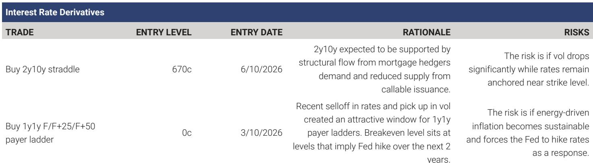
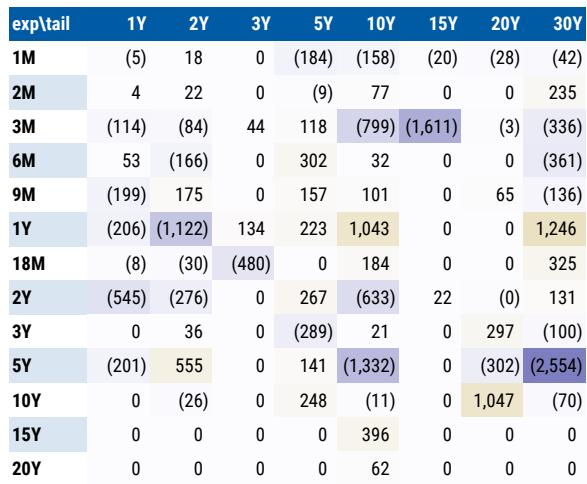

# Less Forward Guidance Means Higher Volatility: Why the Warsh Fed Could Rewrite the Rules for Rates Markets

The first Federal Open Market Committee press conference under Chair Warsh signals a regime change that many market participants have not fully priced. By deliberately scaling back forward guidance, the Fed is telling markets that they must now extract their own signals from economic data rather than receiving them from policymakers. This is not a minor tactical adjustment. It is a structural shift in how monetary policy communicates with financial markets, and its implications for rates volatility are profound.

The historical evidence is clear: when the Fed provides less guidance, markets react more sharply to economic surprises. A global investment bank report examining the Greenspan era—the last extended period during which the Fed offered minimal forward guidance—finds that market sensitivity to payroll data was roughly twice as high as it was during the pre-COVID Powell years. If the Warsh Fed continues down this path, a partial reversal of that decline would imply a meaningful increase in daily yield volatility per unit of data surprise.

This matters now because the transition is already underway. The first FOMC statement and press conference under Warsh contained notably less language about the expected path of policy. Markets are being forced to recalibrate. The question is not whether volatility will rise, but how much and in which maturities. The answer has direct implications for portfolio construction, hedging strategies, and risk management.

## Market Sensitivity to Economic Data Has Declined Steadily Since the Greenspan Era, and the Warsh Fed Could Reverse That Trend

The relationship between economic surprises and Treasury yield movements is the most direct measure of how much markets rely on data versus guidance. A global investment bank research team normalized both variables to ensure comparability across different Fed regimes: economic surprises were scaled by their rolling two-year standard deviation, and yield moves were scaled by three-month realized volatility. This allows a clean comparison of how strongly rates respond to a given surprise across different chairs.

The pattern is unmistakable. During the Greenspan era, a one-standard-deviation surprise in nonfarm payrolls moved the two-year Treasury yield by approximately 1.0 times its daily volatility. By the pre-COVID period of Powell's first term, that sensitivity had fallen to roughly 0.5 times daily volatility—a decline of about 50 percent. The pandemic reversed this trend, with sensitivity rising back toward Greenspan-era levels as inflation surged and the Fed tightened policy aggressively.

The decline in sensitivity from Greenspan through pre-COVID likely reflects multiple factors: increased policy transparency, the introduction of forward guidance as a regular tool, and a generally more stable macro environment. But the correlation with forward guidance is too strong to ignore. As the Fed provided more information about its expected policy path, markets had less need to react to individual data points. The Warsh Fed's decision to reduce guidance reverses this logic. Markets will now have to infer the policy path from economic releases, which means larger yield moves for any given surprise.

## The Pattern Differs Sharply Between Employment and Inflation Data, and That Divergence Has Strategic Implications

Not all economic data generate the same market response, and the historical record reveals a striking asymmetry. Prior to the pandemic, inflation surprises had little consistent impact on front-end rates. The relationship between CPI surprises and two-year yield changes was weak and statistically unstable across multiple Fed regimes. Markets simply did not treat inflation data as a primary driver of monetary policy expectations.

The pandemic changed this fundamentally. As inflation became the dominant policy concern, markets began responding to CPI surprises with a consistency that had never been seen before. The post-COVID period shows a statistically significant and economically meaningful relationship between inflation surprises and front-end rates. Market sensitivity to CPI data is now comparable to, and in some cases exceeds, sensitivity to employment data.

This divergence matters for the Warsh transition. Employment data sensitivity may rise as forward guidance recedes, but inflation data sensitivity is already elevated. The report notes that recent FOMC communications suggest inflation remains the primary policy concern under Warsh. This implies that inflation releases could have a larger impact on front-end rates than employment data in the near term, even if employment sensitivity also increases. For portfolio managers, this means that CPI release days may become the most important events on the calendar, with potential for outsized moves that catch unprepared investors off guard.

## Intraday Data Confirms the Pattern and Rules Out Alternative Explanations

One potential critique of the daily yield analysis is that it captures more than just the market response to economic releases. Daily yield changes reflect a host of factors including global macro developments, geopolitical events, and shifts in risk appetite. To isolate the direct impact of NFP and CPI, the research team examined yield changes over the 60 minutes immediately following the 8:30 a.m. release time.

Data availability limits the intraday analysis to the period since 2013, preventing a direct comparison with the Greenspan era. But the results closely mirror the patterns observed in daily data. Market sensitivity to payroll surprises declined from the Bernanke era through the pre-COVID period, then increased sharply after the pandemic. CPI sensitivity was negligible prior to the pandemic and became highly significant afterward.

The intraday analysis provides two important confirmations. First, it rules out the possibility that the daily results are driven by non-data factors that happen to correlate with release dates. Second, it shows that the market response to data is immediate and concentrated, which is consistent with a market that is actively incorporating new information rather than reacting to other developments.

## The Report Leaves an Important Question Unanswered: How Much of the Greenspan-Era Decline Will Reverse?

The report quantifies the potential increase in market sensitivity by comparing current levels to the Greenspan era. A full reversal of the decline since Greenspan would imply an increase of up to 0.5 times daily volatility per unit of data surprise. But this is an upper bound, not a central forecast.

Several factors complicate the comparison. The Greenspan era was characterized not only by less forward guidance but also by a different macro environment, different market structure, and different regulatory framework. The Fed's balance sheet was smaller, the Treasury market was less intermediated, and the role of algorithmic trading was far less developed. It is entirely possible that market sensitivity will not return to Greenspan-era levels even if forward guidance is fully eliminated.

Furthermore, the Warsh Fed may not eliminate forward guidance entirely. The report describes a scaling back of guidance, not its complete removal. The Fed may still provide some information about its reaction function or its assessment of risks, even if it stops providing explicit rate path projections. The extent of the reduction in guidance is itself a policy choice that will evolve over time.

These uncertainties mean that the report's quantitative estimate should be treated as a directional guide rather than a precise forecast. The key insight is directional: less guidance means higher sensitivity, which means higher volatility. The magnitude remains an open question that will only be answered as the Warsh regime matures.

## A Decision Framework for Positioning in a Higher-Volatility Regime

For investors trying to translate this analysis into portfolio decisions, three questions provide a useful framework:

First, which maturities are most exposed to the shift? The report's analysis focuses on the two-year Treasury yield, which is the most direct proxy for monetary policy expectations. Short-dated volatility should rise first and most sharply as markets become more data-dependent. Intermediate expiries should follow as the market reprices the entire forward curve. The report recommends maintaining long positions in 2y10y straddles, which benefit from rising volatility across both the front end and the belly of the curve.

Second, which data releases matter most? The historical evidence suggests that employment and inflation data will be the primary drivers of volatility, but the relative importance may shift. If the Fed signals that inflation remains the primary concern, CPI releases could generate larger moves than NFP releases. Investors should consider adjusting their event-risk calendars accordingly.

Third, what is the right hedging structure? The report's recommendation of long straddles reflects a view that volatility will rise but the direction of the move is uncertain. A straddle provides protection against large moves in either direction, which is appropriate when the primary risk is increased sensitivity to data rather than a specific directional view. For investors with strong views on the direction of rates, structured options such as payer ladders may offer a more efficient expression.

## The Full Report Contains the Charts and Data That Make This Analysis Actionable

The analysis summarized here draws on a detailed research report that includes exhibits showing the normalized relationship between economic surprises and Treasury yields across multiple Fed regimes, intraday confirmation of the pattern, and current positioning data on dealer gamma and investor flows. These charts are essential for understanding the magnitude of the potential shift and for calibrating portfolio responses.

The full report also includes the SDR Monitor, which shows that dealer gamma positioning has normalized in the front end but remains short in the long end, and the Callable Issuance Monitor, which tracks the supply dynamics that affect volatility. These elements are critical for constructing a complete picture of the rates market.

Join the community to read the full report and review the original charts.

*This article is for learning and discussion only and does not constitute investment advice.*

Personal reading notes and learning share only. Not investment advice.

