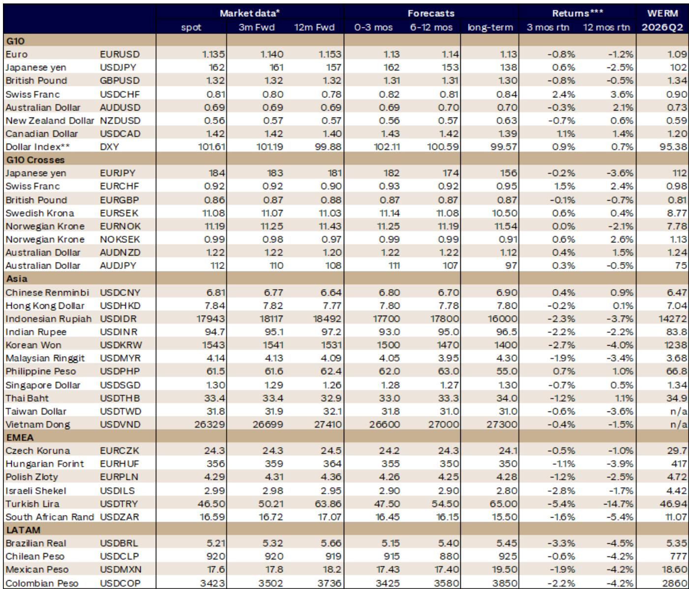
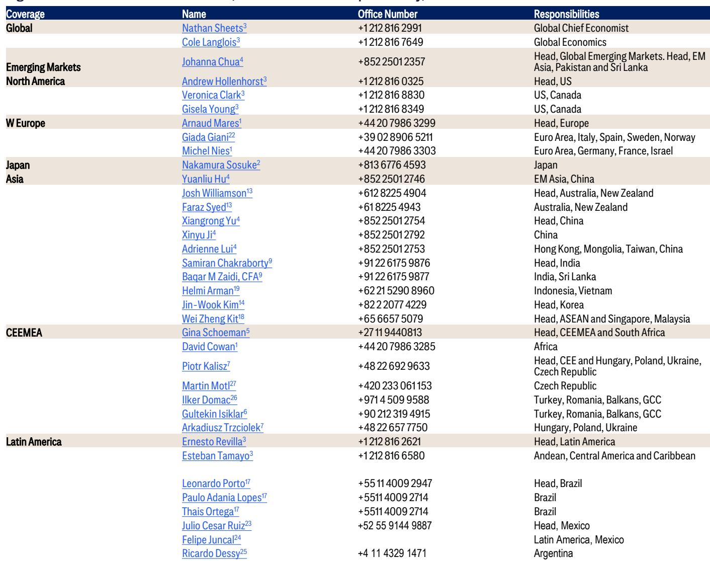
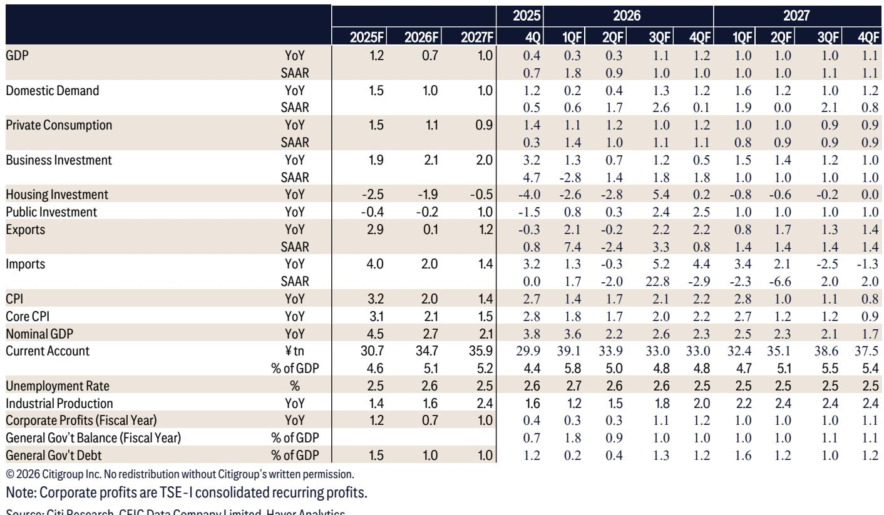

# The Global Economy Is Replacing One Supply Shock With Another—And the Next One Could Be Worse

The global economy has demonstrated remarkable resilience through a period of sustained oil prices above $100 per barrel, a Middle Eastern conflict that closed the Strait of Hormuz, and cascading supply shocks from protectionist trade policies to demographic stagnation. But this resilience is not a permanent state. It is a temporary equilibrium that is about to be tested by a force that no central bank can cut rates to solve.

The interim agreement between the United States and Iran has opened a path toward reopening the Strait of Hormuz, and Brent oil prices have already begun to decline toward $75 per barrel. This is genuinely good news. But the relief is partial and conditional. The 60-day memorandum of understanding leaves unresolved the most difficult issues—Iran's nuclear program, regional security arrangements, and the future of Strait toll rights. Mines must be cleared, insurance markets must normalize, and the logistical bottleneck of 500 stranded commercial vessels must be resolved before traffic can return to pre-conflict levels. These are solvable problems, but they will take months, not weeks.

The more consequential story, however, is what comes next. While one supply shock recedes, another is gathering force in the Pacific Ocean. The National Oceanic and Atmospheric Administration now assigns a greater than 95 percent probability to an El Niño event that will last through March 2027. More striking, there is a 63 percent chance that this El Niño reaches "very strong" or "super" status by the end of the year. Historical episodes of this severity have generated substantial and long-lasting economic costs—disrupting agricultural output, impairing energy generation, straining supply chain logistics, and reducing labor productivity across entire regions.

The global economy has absorbed an oil shock. It is far from clear that it can absorb a climate shock of this magnitude without a significant growth penalty.

## The Resilience of the Global Economy Has Been Real But It Is Not Structural

Global growth is currently tracking at 2.5 percent, down from 2.9 percent before the conflict in the Middle East erupted. This is a modest deceleration for an economy that absorbed oil prices above $100 per barrel for an extended period. The performance of purchasing managers' indices, equity markets, and economic surprise indices all point to an economy that is growing moderately but not far below its trend rate.

Three factors explain this resilience. First, the artificial intelligence investment cycle has provided a powerful boost to capital spending, particularly in the United States. AI-related investment surged to an annualized rate well above $400 billion in the first quarter, up from roughly $300 billion last year. This has rippled through Asian economies as well—Korea, Taiwan, and Singapore have all seen upward revisions to their growth forecasts on the back of surging tech exports.

Second, fiscal policy has remained supportive across most major economies, even as the post-pandemic fiscal expansion has faded. Third, a net balance of the central banks that Citi covers are now beginning to normalize monetary policy, which provides some accommodation relative to the tightening cycles of recent years.

But none of these factors is structural. AI investment is concentrated in a narrow set of economies and sectors. Fiscal support is facing increased scrutiny as public debt levels rise across developed and emerging markets. And the normalization of monetary policy is itself a sign that central banks see the need to adjust to a changing economic environment. The resilience of the past two years has been a testament to the adaptability of the global economy, but it should not be mistaken for immunity.

The sectoral impact of the Middle East conflict illustrates this point clearly. The largest growth markdowns have been concentrated among highly exposed oil importers—the Philippines, Vietnam, and Sweden have all seen reductions of three-quarters of a percentage point or more. The euro area has been marked down by a full percentage point since February, though a large share of this reflects volatility in Irish trade data. Inflation markups have been even more broad-based, with several Asian economies seeing upward revisions of 1.5 percentage points or more.

The global economy has absorbed the oil shock, but it has not absorbed it evenly. And the unevenness of the impact matters for how the next shock will propagate.

## A Super El Niño Represents a Different Kind of Supply Shock Entirely

The El Niño that is now developing is not a normal weather event. The Australian Bureau of Meteorology's seasonal model is forecasting a record peak warming greater than 3 degrees Celsius, which would exceed the previous post-1900 record of 2.65 degrees Celsius recorded in 1902. The rate of warming this year is already the fastest since 1943.

The economic channels through which a super El Niño operates are multiple and mutually reinforcing. Agricultural output is the most direct channel. El Niño alters rainfall patterns in ways that are systematically disruptive: droughts in Southeast Asia, India, and Australia; excessive rainfall and flooding in the southern United States and parts of South America. These are not random weather events but predictable shifts in the global climate system that affect the supply of staple crops, driving up food prices and consumer inflation across multiple regions simultaneously.

Energy generation is the second channel, and it is particularly concerning because it compounds the agricultural shock. Countries that depend on hydroelectric power—Brazil, Colombia, Venezuela, Zambia, and Zimbabwe—face reduced water levels and increased risk of power shortages. This forces a shift toward more expensive fossil fuel generation, which raises energy costs precisely when food costs are also rising. The combination of food and energy price shocks is the classic recipe for stagflationary dynamics.

The third channel is supply chain logistics. Reduced water levels in the Panama Canal have already forced ships to carry lighter loads, restricting shipping capacity. Extreme weather events can damage roads, warehouses, and ports, creating logistical bottlenecks that persist long after the weather event itself has passed. During the previous severe El Niño in 2015-2016, these disruptions were estimated to have cost the global economy tens of billions of dollars.

The fourth channel is labor productivity. Extreme heatwaves reduce outdoor labor productivity, particularly in tropical and developing nations where a larger share of the workforce is employed in agriculture, construction, and other outdoor occupations. This is not a marginal effect. Studies of historical El Niño events have found that labor productivity losses can persist for years after the weather anomaly has ended, as heat-related illnesses and reduced working capacity compound over time.

## The Policy Response to a Climate Supply Shock Is Fundamentally Different From the Response to an Oil Shock

The Middle East conflict was, in economic terms, a conventional supply shock. It raised the price of a critical input—oil—and the policy response was relatively straightforward: central banks could look through the temporary price spike, fiscal authorities could provide targeted support to affected sectors, and diplomatic efforts could work toward resolving the underlying conflict. The tools existed, and they were broadly appropriate.

An El Niño supply shock is different in ways that matter for policy. First, it is not a single-commodity shock but a multi-sector shock that affects agriculture, energy, logistics, and labor markets simultaneously. This makes it harder for central banks to "look through" the inflation effects, because the price increases are broad-based and persistent rather than concentrated in a single category.

Second, the shock is not temporary in the conventional sense. A super El Niño that lasts through March 2027 would affect multiple growing seasons, multiple energy cycles, and multiple fiscal years. The cumulative economic damage compounds over time, and the recovery period extends well beyond the end of the weather event itself.

Third, the fiscal implications are substantial and asymmetric. Strong El Niño events represent a contingent liability for public finances. The immediate effects include additional social transfers for affected households, subsidies for affected businesses, and disaster relief payments. The medium- and long-term liabilities include recovery and reconstruction costs for damaged infrastructure, alongside tax and loan concessions for businesses. Countries that face recurring strong El Niño events are more likely to need countercyclical fiscal buffers to absorb this spending, but contingency reserves are not budget-neutral and come with opportunity costs to other policy areas.

For central banks, the challenge is even more acute. An El Niño-driven increase in food and energy prices is not a demand-side phenomenon that can be addressed by raising interest rates. It is a relative price shock that monetary policy is poorly equipped to manage. If central banks tighten in response to El Niño-driven inflation, they risk suppressing demand and output without addressing the underlying supply constraint. If they hold steady, they risk allowing inflation expectations to become unanchored.

This is the policy dilemma that the global economy has not yet had to confront. The oil shock of the past year was manageable because it was a single-commodity shock with a clear resolution path. A multi-sector climate shock with no clear resolution path is a fundamentally different challenge.

## What the Report Does Not Fully Answer: The Interaction Between Climate Shocks and Financial Stability

The report provides a thorough analysis of the real economic channels through which a super El Niño would affect output, inflation, and fiscal positions. But it leaves several important questions unanswered, and these questions are where the most serious risks may lie.

The first is the interaction between climate shocks and financial stability. A super El Niño that simultaneously disrupts agricultural output in multiple regions, reduces hydroelectric generation capacity, and damages physical infrastructure would create a wave of corporate defaults in exposed sectors. Agricultural companies, energy utilities, logistics providers, and insurers would all face significant stress. The question is whether the financial system is resilient enough to absorb these losses, particularly if they are concentrated in countries with limited fiscal capacity and weak banking systems.

The second is the feedback loop between climate shocks and sovereign creditworthiness. Countries that are most exposed to El Niño—typically emerging and developing economies in tropical and subtropical regions—are also countries with higher public debt levels and narrower fiscal space. A large fiscal shock from disaster relief and reconstruction could push some of these countries toward debt distress, which would in turn constrain their ability to respond to future shocks.

The third is the geopolitical dimension. The report notes that the US-Iran agreement has eased one set of geopolitical tensions, but it does not explore how climate-induced resource scarcity could generate new tensions. Food price spikes have historically been associated with social unrest and political instability. Water scarcity in regions that depend on hydroelectric power could create cross-border tensions over shared water resources. The geopolitical implications of a super El Niño are not fully captured by the economic analysis.

These are not gaps in the report's analysis. They are questions that the report's framework naturally raises but cannot fully resolve, because the data and historical precedents are limited. The global economy has not experienced a super El Niño of the magnitude now forecast while also facing the current configuration of high debt, elevated inflation, and geopolitical fragmentation.

## A Decision Framework for Investors: Three Scenarios, Three Portfolio Implications

The report's analysis can be translated into a decision framework that helps investors prepare for the range of possible outcomes. Three scenarios capture the most important dimensions of uncertainty.

Scenario One: The Moderate El Niño. In this scenario, the El Niño event reaches strong status but not super status. Agricultural disruptions are significant but localized, energy generation is affected but not crippled, and supply chain disruptions are manageable. Global growth slows by an additional 0.3 to 0.5 percentage points, and headline inflation rises by 0.5 to 1.0 percentage points for two to three quarters before receding. The portfolio implication is a modest shift toward defensive sectors and away from commodities that are directly exposed to weather risk, but no fundamental repositioning is required.

Scenario Two: The Super El Niño. In this scenario, the El Niño event reaches super status with peak warming above 2.5 degrees Celsius. Agricultural output falls sharply across multiple regions, hydroelectric generation is severely constrained, and supply chain disruptions become widespread. Global growth slows by 1.0 to 1.5 percentage points, and headline inflation rises by 1.5 to 2.5 percentage points for four to six quarters. Central banks face a genuine policy dilemma, and fiscal authorities in exposed countries face significant pressure. The portfolio implication is a significant shift toward inflation-hedged assets, commodities with supply constraints, and currencies of countries with diversified economies and strong fiscal positions. Exposure to emerging markets with high agricultural dependence and limited fiscal space should be reduced.

Scenario Three: The Super El Niño with Financial Contagion. This scenario incorporates the financial stability and sovereign credit risks that the report does not fully explore. A super El Niño triggers corporate defaults in exposed sectors, which in turn stresses banking systems in vulnerable countries. Sovereign credit ratings are downgraded, and capital flows reverse. This is a tail risk scenario, but the report's analysis suggests it cannot be dismissed. The portfolio implication is a defensive posture across the board, with a focus on liquidity, high-quality sovereign bonds, and currencies of reserve-issuing countries.

The key insight from this framework is that the difference between Scenario One and Scenario Two is not a matter of degree but of kind. A moderate El Niño is a manageable supply shock. A super El Niño is a structural break that requires a fundamental reassessment of portfolio construction.

## The Most Important Question About the Next Shock Is Not Whether It Will Happen but Whether the Global Economy Has the Institutional Capacity to Respond

The global economy has proven remarkably resilient to the shocks of the past two years. But resilience is not the same as robustness. Resilience is the ability to absorb a shock and return to the previous equilibrium. Robustness is the ability to adapt to a new equilibrium when the old one is no longer attainable.

The oil shock of the past year tested the global economy's resilience, and it passed. The El Niño shock that is now developing will test its robustness, and the outcome is far from certain. The reason is not economic but institutional. The policy tools that worked for the oil shock—monetary accommodation, fiscal transfers, diplomatic negotiation—are less well-suited to a climate shock that is multi-sector, persistent, and global in scope.

Central banks cannot lower interest rates to increase rainfall. Fiscal authorities cannot spend their way out of a multi-year reduction in agricultural productivity. And no diplomatic agreement can negotiate with the Pacific Ocean's sea surface temperatures.

The institutional capacity to respond to a climate supply shock of this magnitude has not been built, because the need for it has not been fully recognized. The report's analysis makes clear that the need is imminent. The question is whether policymakers and investors will use the window of opportunity that the US-Iran agreement has opened to prepare for the shock that is already developing.

Join the community to read the full report and review the original charts.

*This article is for learning and discussion only and does not constitute investment advice.*

Personal reading notes and learning share only. Not investment advice.

