GLOBAL RATES TRADER

Oil Relief Gets Real

The hawkish US front-end repricing has proven resilient despite the ongoing decline in energy prices. But the reduction in inflation risk has helped to restore nominal duration's role as a risk asset hedge. We think there is more favorable asymmetry to longs anchored slightly out from the very front-end of the US (e.g. 1y1y or 2y1y) curve given the likely front-loading of hike risk in response to hotter data. That said, we think milder job growth and inflation data over the coming months can see end-26 pricing consolidate towards an on-hold baseline. European rates should remain in a relatively tight range as September ECB pricing remains between 0-1 hike. Lower rates vol and growth risks should favour front-end EGB spreads, with the upcoming Solvency II review a tailwind for long-end sovereign credit. We think the hurdle for further Gilt term premium compression is high, but expect UK front-end rates to continue to outperform. The continued underperformance of Japan duration versus global peers reflects unresolved domestic risks that we think will likely maintain pressure on the belly of the curve despite cheap valuations.

## United States and Canada

On slightly firmer ground. Oil relief has curtailed inflation upside and left US rates better positioned as a risk asset hedge with inflation and growth risks co-moving rather than at odds with each other. Nearer-term real rates have started to participate in rallies again, front-end skew has rotated back towards receivers, and Fed pricing has moderated from the hawkish extremes (Exhibit 1). Given the information in hand and a Fed signal that, while mindful of inflation risk, did not as a whole imply a sense of urgency to hike, we think July pricing should decay absent clearly strong data. Further, while the focus coming out of the June FOMC was on price stability, we think it would be wrong to downgrade the significance of labor market data, particularly given the progress lower in oil prices. Acknowledging two-way risks to front-end pricing and the likelihood that near-term hike risk remains somewhat sticky given last week's signal and reaction function uncertainty, we think there's a more favorable near-term asymmetry to being long further out (e.g. 1y1y or 2y1y) as firmer data likely front-load hike risks alongside stickier forwards. Under our economists' baseline for near-term data, we think the probability mass for Z6 should build around an on-hold outcome, with our bias still to anchor longs further out on the forward curve or around the 5y point of the spot curve.

George Cole  
+44(20)7552-1214 |  
george.cole@gs.com  
GS International

William Marshall +1(212)357-0413 | william.c.marshall@gs.com GS & Co. LLC

Simon Freycenet  
+44(20)7774-5017 | simon.freycenet@gs.com GS Bank Europe SE - Paris Branch

Isabella Rosenberg +1(212)357-7628 | isabella.rosenberg@gs.com GS & Co. LLC

Friedrich Schaper +1(917)343-3214 | friedrich.schaper@gs.com GS & Co. LLC

Loic Mathys  
+44(20)7051-1664 |  
loic.mathys@gs.com  
GS International

Exhibit 1: Front-end skew has rotated back towards receivers as Fed pricing has moderated from the hawkish extremes

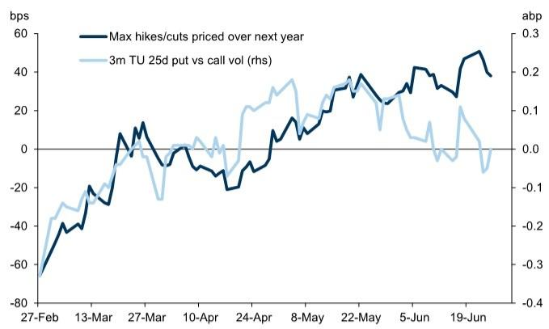  
Source: GS FICC and Equities, GS Global Investment Research

Exhibit 2: Current front-end steepness tends to see vol undershoot what is implied by macro fundamentals 2y1y/1y steepness vs residual vs macro fair value model  
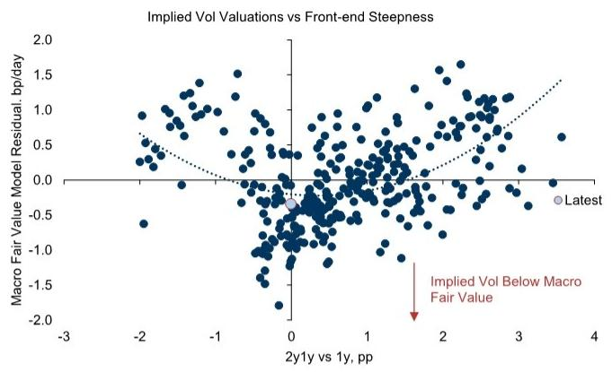  
Source: GS Global Investment Research, GS FICC and Equities

\- Higher vol floor, flatter curve. While off the highs and towards the lower end of our fair value range, implied vol has settled at a higher level than before the conflict, with risk premium emerging at shorter tails. However, current levels of front-end steepness can see implied vol underperform macro fundamentals to an even greater degree (Exhibit 2), suggesting some scope for vol to moderate further. We think this setup can support returns to vol selling, especially if moderating hiring and inflation data lead the hawkish policy momentum to decay gradually (as has been the case in recent past). Overall, the reduction in supply-side risks and macro uncertainty should eventually reduce macro volatility and reduce the vol premium further. That said, we see some differentiation along the surface. We continue to think that the ongoing shift from macro to policy uncertainty should sustain a flatter tail curve, as uncertainty shifts to Fed's reaction function. At this point valuations along the surface suggest this is already somewhat reflected, with vol on 1y tails rich to both the macro and in the context of our vol surface PCA, while through the same lens implied vol on belly tenors are low in comparison to the wings.

## - Easier funding conditions point to supportive supply/demand dynamics.

Treasury funding conditions remain broadly accommodative, driven by a favorable balance between cash lending, primarily from money funds, paired with more subdued demand for funding from levered investors. On the supply side, money fund AUM has continued to grow, supported by a flatter Treasury curve and softer risk asset performance in June. Money funds' weighted-average maturity has shortened as well, with tightening in 1m Bills-OIS reflecting greater money fund demand for shorter-term assets. Meanwhile, appetite for funding has declined amid compressed Treasury futures basis opportunities, which has shown up in dwindling levered fund shorts (Exhibit 3). The benign backdrop for funding suggests the market has a comfortable buffer to absorb a shift back to more elevated cash demand without incurring meaningful upward pressure on funding costs. Quarter-end dynamics are a likely near-term source of temporary upward pressure on repo rates. While the medium-term prospects for balance sheet policy are a spot of uncertainty, we think the easier backdrop will lead to a slower pace of RMPs over the coming months.

Exhibit 3: Appetite for funding has declined amid compressed Treasury futures bases, evidenced by dwindling levered fund shorts  
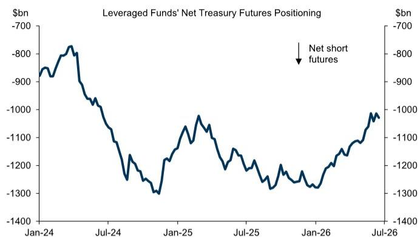  
Source: CFTC, Haver Analytics, GS Global Investment Research

Exhibit 4: With limited pass-through from higher oil prices, CAD rates have more room to fall  
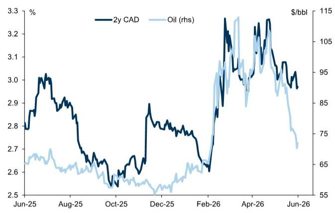  
Source: GS Global Investment Research, GS FICC and Equities

Wider spreads have staying power. We think swap spreads can continue to trade wide to the broader UST supply backdrop in the near term, supported by a decline in macro (if not reaction function) uncertainty and constructive demand picture. While bank buying has been somewhat uneven recently, we expect demand dynamics to remain generally supportive; meanwhile, the foreign official sector has scaled back its net selling of USTs with the stabilization in the Dollar. Alongside those benign spot considerations, uncertainty over the Fed's balance sheet policy is a potential medium-term risk. If the Fed begins to have a more serious debate about alternatives to ample reserves framework, we expect it would correspond to increased risk premium in belly and long-end swap spreads compared to the front-end (in part reflecting the likelihood that any concrete shift would take time and therefore more relevant over time). We still think shorter-term swap spreads offer value from a carry perspective, with valuations about fair. We have preferred to express this in 3y swap spreads, which we think should be more insulated from balance sheet risk while offering appealing carry-to-vol versus the rest of the curve.

Still room for CAD front end compression. The decline in oil prices has compressed hike premium for the BoC for this year to about 12bp alongside a generalized reset across the forward curve. Given still limited spillover risks from energy prices to other inflation categories, and underlying softness in activity, we think that the remaining hike premium through year-end should decay. Lower energy prices can allow focus to turn towards potential dovish risks to the outlook (Exhibit 4). The apparent likelihood that the July 1 USMCA deadline will pass without agreement should keep trade uncertainty elevated and lead to ongoing headline risks around the annual reviews. We see some potential for that to reintroduce weight on the risk of further easing (even if our economists expect BoC to remain on hold), given BoC's characterization of trade risks, and we can also see front-end yields decline towards pre-conflict levels.

## Europe

\- European rates settle in as tails decline further. Energy price relief has extended further this week as shipping flows through the Strait of Hormuz increase. We continue to expect this to reduce European rates volatility rather than yield levels, extending the decoupling that followed the April ceasefire. Because the ECB path and European rates volatility are more narrowly driven by energy uncertainty compared with a broader range of macro factors in the US, we also expect European rates vol to underperform the US. ECB commentary emphasises the fragility of the peace agreement and points to ongoing concern around inflation persistence, and our economists continue to forecast another hike in September. We don't expect a meaningful rally from here, with the market now trading below our 3% end-2026 Bund yield forecast, but, given the hawkish bias of the ECB, we think 5y rates are likely to outperform on the curve, especially should hikes coincide with further inflationary relief.

Solvency II review a tailwind to sovereign credit. The upcoming implementation of the Solvency II review – by 31 January 2027 – aims to steer insurance companies’ portfolios towards the real economy, which implies a rising marginal allocation to equities over time. But we think other elements of the review will be a net positive for sovereign credit. In particular, a revised methodology for risk-free rates will make long-dated discount rates more sensitive to shifts in market rates and is likely to increase interest rate hedging past the 20y point of the curve. Revisions to the Volatility Adjustment (VA) mechanism and more favourable correlation parameters between interest rates and credit spreads should also support insurers’ ability to bear credit risk. We expect this to support insurer demand for long-dated government bonds, adding to the already-favourable backdrop for sovereign credit as rates vol and growth risks decline.

\- Watching funding spillovers to Europe. The market focus on equity supply through IPOs, primarily in the US but also to a lesser extent in Europe, has seen equity funding spreads increase. This period is analogous to the second half of 2024, where building long positions in equities had generated pressures on funding markets. Back then, we saw evidence that Bund spread cheapening had run ahead of fundamentals, opening a residual of about 15bp against our fair value estimate over a period of 6 months, suggesting the increase in funding costs from equity markets had spilled over to fixed income markets (Exhibit 5). The macro and market context is different now, with ECB QT no longer accelerating, and spreads generally cheaper and global curves steeper. But we think this is a risk worth watching in coming months as QT continues to drain excess liquidity in the Euro area. We expect the liquidity backdrop to remain abundant into 2027, consistent with the still-low levels of bank borrowing at the ECB's facilities (\~EUR15bn under the MRO). But funding pressures are one potential risk to the generally favourable backdrop for carry described above.

Exhibit 5: In the past, sharp moves in equity funding have spilled over to Bund spreads
Euro STOXX funding spread to OIS of 2nd nearest future

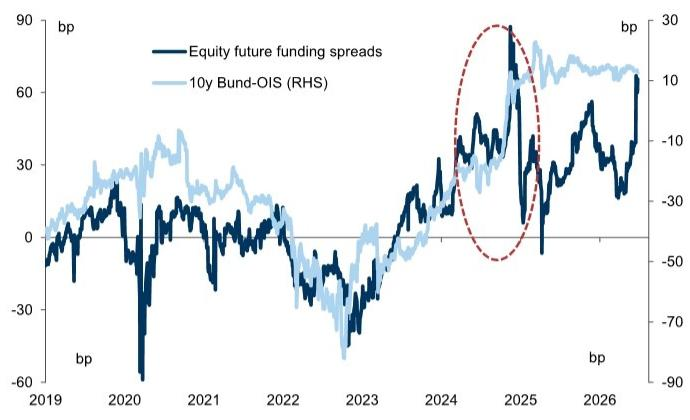  
Source: GS Global Investment Research, GS FICC and Equities

Exhibit 6: The rally in 10y Gilts has been mostly driven by term premium compression

Change in 10y UK term premium and rates expectations (yield curve-only model)

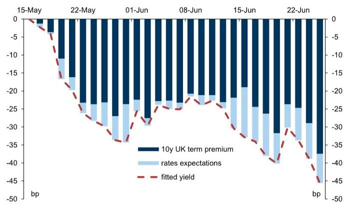  
Source: GS Global Investment Research

Gilt relief likely to slow, prefer GBP steepeners. The ongoing decline in oil prices following the US-Iran deal remains a tailwind for UK rates, reducing headline inflation risk at the same time as underlying price pressures are looking more benign. We expect markets to become increasingly confident about a BoE holding through 2026, and the erosion of the remaining hike premium in the UK front-end may now slow given how far the market has rallied. At the same time, most of the decline in 10y Gilt yields in recent months has been due to term premium compression (Exhibit 6). With Andy Burnham likely to be the next UK Prime Minister, we think the market will retain some premium in coming months as focus turns to the Autumn budget. In the recent rally, front-end nominals have rallied mostly through lower inflation, while the 5y5y move has been largely real-rate-led, with forward inflation only modestly lower. In contrast to the Euro area and the US, where risk-reward is likely better in the belly of the curve, we instead lean towards steepening in the UK, with outperformance of the 1y1y part of the curve as front-end real rates eventually normalise lower.

## Australia and New Zealand

Balanced risks around RBA pricing. Market pricing for the RBA has moderated to pricing less than 50% of a hike through the year-end peak in the curve. While our economists think underlying labor market conditions are softening at an orderly and gradual pace, the latest labor force report left the unemployment rate below both the level where the Governor described the labor market as “a bit tight” as well as the RBA’s estimate for NAIRU. Our economists continue to lean towards the RBA delivering one additional hike this year, but falling oil prices likely make that outcome contingent on a sufficiently firm inflation print outside oil-affected categories. That leaves the risks around near-term meetings more balanced in our view, with risk-reward still better to setting longs further out the curve. Whether or not the RBA delivers an additional hike, we see scope for the market to price greater risk of cuts on a 1-to-2y forward horizon as evidence of weaker growth and softer inflation

accumulate. We recommend to receive 2y1y OIS vs pay August RBA (Entry: -18bp, Target: -35bp, Stop: -10bp).

## Latest Thematic Research:

Global Markets Analyst: Updating Our G10 Term Premium Estimates — Still High — 19 June 2026

Euro Area Sovereign Credit Monitor: EU Bonds — Still Deepening — 12 June 2026

Global Markets Analyst: Revisiting the Outlook for the Fed's Balance Sheet — 21 May 2026

Global Rates Notes: US Treasury Valuations and Requirements for a Yield Reversal — 20 May 2026

Global Markets Analyst: UK T-bills: Not A Magic Bullet For Gilts — 11 May 2026

## Latest Global Markets Dailies:

Solvency II Review to Reinforce Benign Sovereign Credit Risk Backdrop — 23 June 2026

G10 Rates Views—Lower Vol, Not Yields — 22 June 2026

Fed Communication And Rates Volatility — 10 June 2026

The Hedge Value Of Rate Receivers — 28 May 2026

The Energy Shock Impact on Foreign Official Treasury Demand — 27 May 2026

## Forecasts

G10 10y yield forecast

<table><tr><td colspan="14">G10 10-Year Yield Forecasts</td></tr><tr><td></td><td>USD</td><td>DEM</td><td>FRA</td><td>ITA</td><td>ESP</td><td>GBP</td><td>JPY</td><td>CAD</td><td>CHF</td><td>SEK</td><td>NOK</td><td>AUD</td><td>NZD</td></tr><tr><td>Spot</td><td>4.37</td><td>2.85</td><td>3.63</td><td>3.58</td><td>3.34</td><td>4.69</td><td>2.63</td><td>3.36</td><td>0.27</td><td>2.65</td><td>4.22</td><td>4.73</td><td>4.34</td></tr><tr><td>2Q26</td><td>4.50</td><td>2.90</td><td>3.55</td><td>3.60</td><td>3.30</td><td>4.75</td><td>2.50</td><td>3.45</td><td>0.30</td><td>3.15</td><td>4.10</td><td>4.85</td><td>4.50</td></tr><tr><td>3Q26</td><td>4.45</td><td>2.95</td><td>3.60</td><td>3.65</td><td>3.35</td><td>4.60</td><td>2.50</td><td>3.50</td><td>0.40</td><td>3.20</td><td>4.00</td><td>4.75</td><td>4.50</td></tr><tr><td>4Q26</td><td>4.40</td><td>3.00</td><td>3.70</td><td>3.75</td><td>3.45</td><td>4.50</td><td>2.50</td><td>3.50</td><td>0.50</td><td>3.25</td><td>4.00</td><td>4.70</td><td>4.50</td></tr><tr><td>1Q27</td><td>4.35</td><td>3.00</td><td>3.75</td><td>3.80</td><td>3.50</td><td>4.50</td><td>2.45</td><td>3.50</td><td>0.50</td><td>3.25</td><td>4.00</td><td>4.60</td><td>4.50</td></tr><tr><td>2Q27</td><td>4.30</td><td>3.00</td><td>3.75</td><td>3.85</td><td>3.55</td><td>4.40</td><td>2.40</td><td>3.50</td><td>0.50</td><td>3.25</td><td>4.00</td><td>4.50</td><td>4.50</td></tr><tr><td>3Q27</td><td>4.25</td><td>3.00</td><td>3.75</td><td>3.90</td><td>3.60</td><td>4.40</td><td>2.30</td><td>3.50</td><td>0.50</td><td>3.25</td><td>4.00</td><td>4.50</td><td>4.50</td></tr><tr><td>4Q27</td><td>4.25</td><td>3.00</td><td>3.75</td><td>3.90</td><td>3.60</td><td>4.35</td><td>2.25</td><td>3.50</td><td>0.50</td><td>3.25</td><td>4.00</td><td>4.50</td><td>4.50</td></tr></table>

<table><tr><td colspan="14">Deviation from Forwards</td></tr><tr><td></td><td>USD</td><td>DEM</td><td>FRA</td><td>ITA</td><td>ESP</td><td>GBP</td><td>JPY</td><td>CAD</td><td>CHF</td><td>SEK</td><td>NOK</td><td>AUD</td><td>NZD</td></tr><tr><td>2Q26</td><td>0.12</td><td>0.05</td><td>-0.08</td><td>0.01</td><td>-0.04</td><td>0.05</td><td>-0.12</td><td>0.06</td><td>0.06</td><td>0.52</td><td>-0.11</td><td>0.13</td><td>0.14</td></tr><tr><td>3Q26</td><td>0.01</td><td>0.02</td><td>-0.05</td><td>-0.05</td><td>-0.01</td><td>-0.22</td><td>-0.21</td><td>0.07</td><td>0.10</td><td>0.55</td><td>-0.19</td><td>0.00</td><td>0.07</td></tr><tr><td>4Q26</td><td>-0.07</td><td>0.04</td><td>0.00</td><td>-0.02</td><td>0.04</td><td>-0.37</td><td>-0.28</td><td>0.02</td><td>0.18</td><td>0.57</td><td>-0.18</td><td>-0.08</td><td>0.00</td></tr><tr><td>1Q27</td><td>-0.16</td><td>0.01</td><td>-0.01</td><td>-0.02</td><td>0.04</td><td>-0.41</td><td>-0.40</td><td>-0.01</td><td>0.17</td><td>0.54</td><td>-0.16</td><td>-0.20</td><td>-0.07</td></tr></table>

Source: GS Global Investment Research

G4 Curve Forecast  
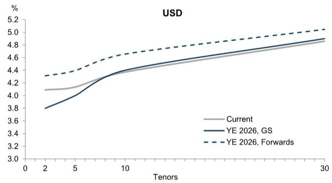

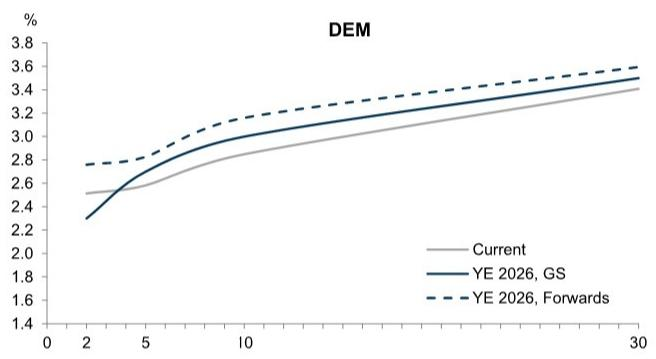

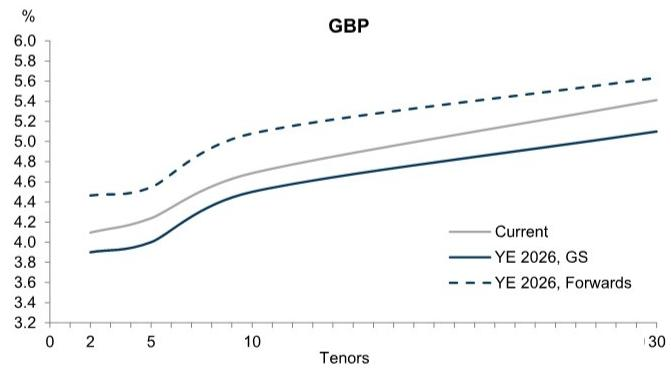  
Source: Bloomberg, GS Global Investment Research

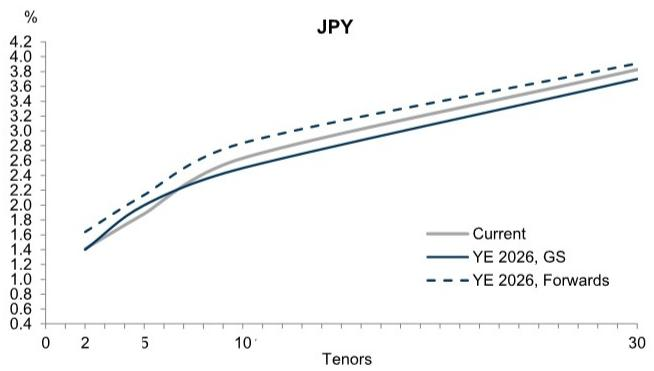

## Central Bank Dashboard

Cumulative amount of hikes/cuts priced from today  
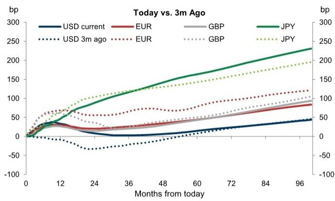  
Source: GS Global Investment Research

## Expected hikes by year, GS vs. Market

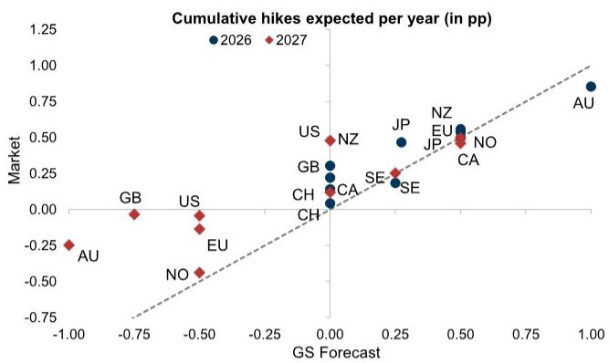  
Source: GS Global Investment Research

Central bank ownership of sovereign bonds, current vs. 1y ago  
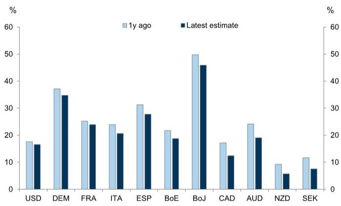  
Source: Haver Analytics

Central bank assets as a share of GDP  
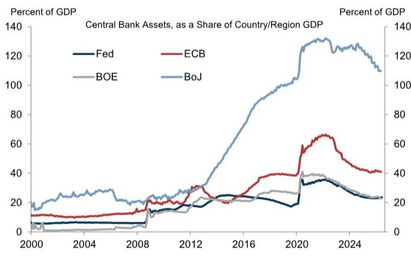  
Source: Haver Analytics

## Positioning and Flows Monitor

Option implied position indicator  
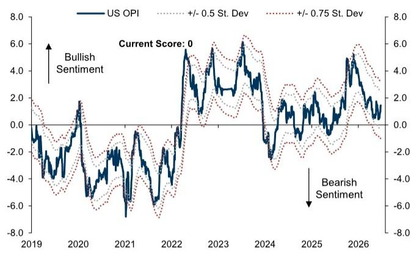  
Source: GS Global Investment Research

## GS Fund Positioning Indicator

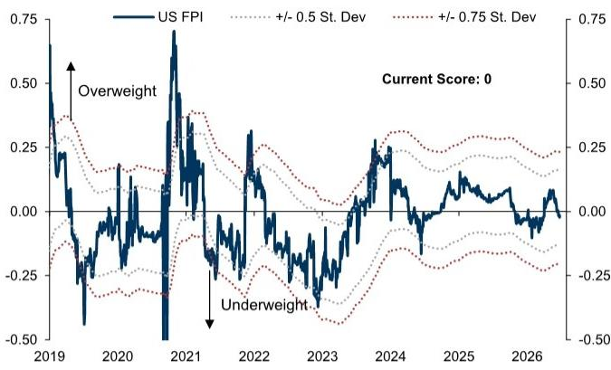  
Source: GS Global Investment Research

US Data Response Indicator (DRI)  
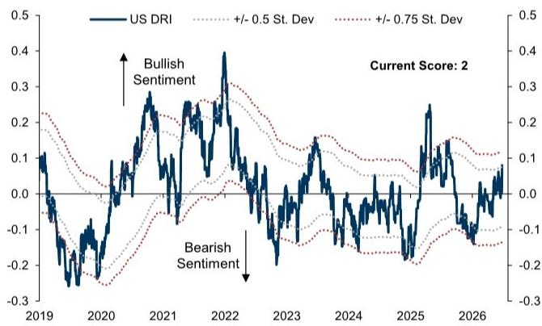

## CFTC Commitment of Traders and Traders in Financial Futures

Duration-weighted net position by investor type

Duration-Weighted Positioning, by Contract

<table><tr><td>$mm/bp</td><td>SFR</td><td>TU</td><td>FV</td><td>TY</td><td>TN</td><td>US</td><td>WN</td></tr><tr><td>Spec Current</td><td>-84.5</td><td>-44.0</td><td>-55.4</td><td>-56.0</td><td>-10.0</td><td>-19.0</td><td>-57.0</td></tr><tr><td>Spec 1w Change</td><td>-10.4</td><td>-2.2</td><td>-1.5</td><td>-3.5</td><td>0.2</td><td>1.9</td><td>-1.5</td></tr><tr><td>LF Current</td><td>-64.8</td><td>-58.9</td><td>-90.9</td><td>-126.3</td><td>-20.2</td><td>-39.9</td><td>-166.5</td></tr><tr><td>LF 1w Change</td><td>0.8</td><td>-1.2</td><td>-0.1</td><td>-6.4</td><td>2.0</td><td>-1.9</td><td>-3.7</td></tr><tr><td>AM + Other Current</td><td>-10.4</td><td>69.2</td><td>117.7</td><td>154.4</td><td>55.6</td><td>72.5</td><td>208.3</td></tr><tr><td>AM + Other 1w Change</td><td>-3.7</td><td>-0.6</td><td>-2.2</td><td>6.7</td><td>3.1</td><td>10.3</td><td>7.9</td></tr><tr><td>Dealer Current</td><td>75.2</td><td>-12.7</td><td>-29.2</td><td>-29.1</td><td>-24.5</td><td>-46.8</td><td>-43.0</td></tr><tr><td>Dealer 1w Change</td><td>2.9</td><td>1.5</td><td>0.2</td><td>-1.2</td><td>-3.8</td><td>-9.2</td><td>-5.8</td></tr></table>

Net positions in Eurodollars  
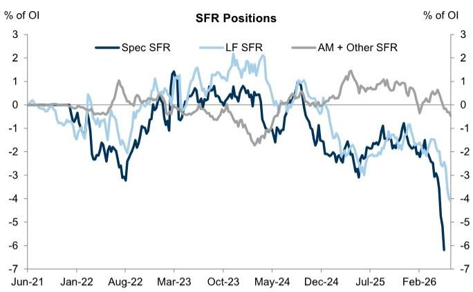  
Note: Duration-weighted net position (long - short) as a % of duration-weighted gross exposure (long + short + spreading)  
Source: CFTC, GS Global Investment Research

Net positions in UST futures  
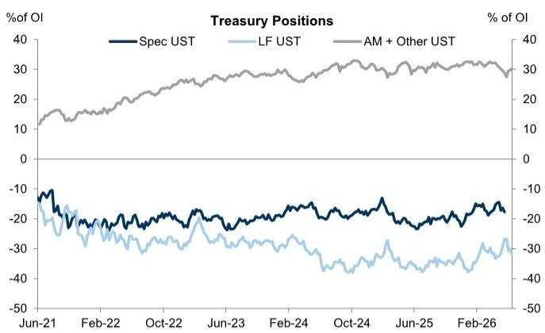  
Note: Duration-weighted net position (long - short) as a % of duration-weighted gross exposure (long + short + spreading)  
Source: CFTC, GS Global Investment Research

Primary dealer transactions Net dealer position in US Treasuries  
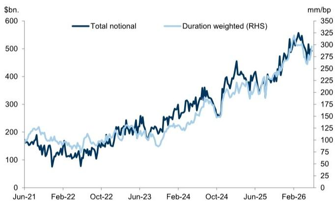  
Source: Federal Reserve Bank of New York, GS Global Investment Research

US Commercial Banks' Holdings of Treasury and Agency Securities  
Total domestic and foreign holdings, all commercial banks  
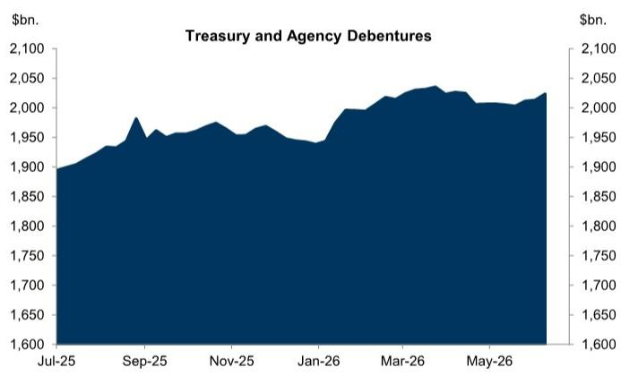  
Source: Federal Reserve Board

NY Fed Custody Holdings Marketable US Treasuries

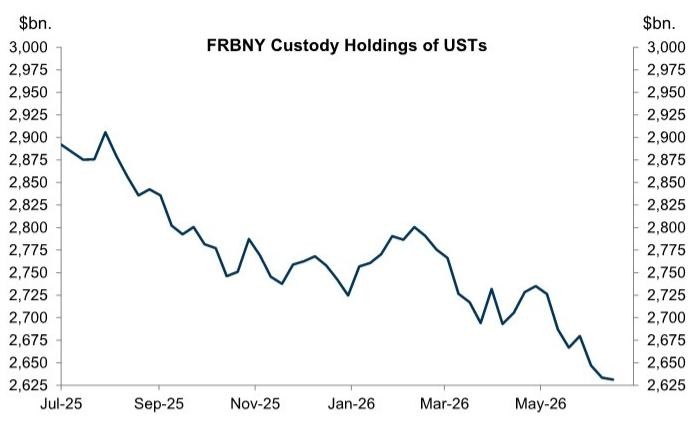  
Source: Federal Reserve Bank of New York

## US TIC Treasury Flows

12m change in valuation-adjusted holdings of USTs, by holder of debt  
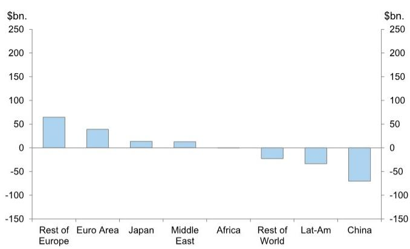  
Source: US Treasury, GS Global Investment Research

Net monthly purchases of short- and long-term US Treasuries by Japanese investors  
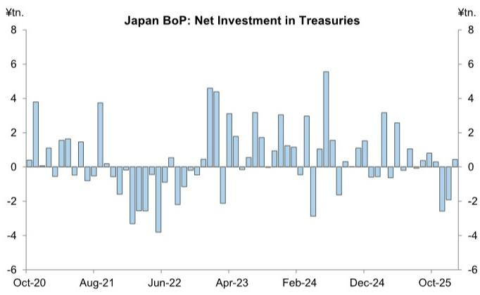  
Source: Bank of Japan, Haver Analytics

Flow of Funds annual net purchases of US Treasuries, by sector  
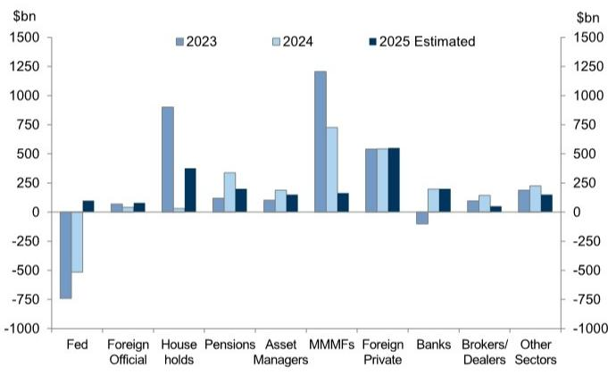  
Source: Federal Reserve Board, GS Global Investment Research

## Carry/Rolldown Monitor

## Outright Carry

Bar chart shows top two carry points by currency, with solid reflecting carry to a long position and striped carry to a short position. Scatter illustrates top 25 carry/vol points by currency, with top point by currency noted

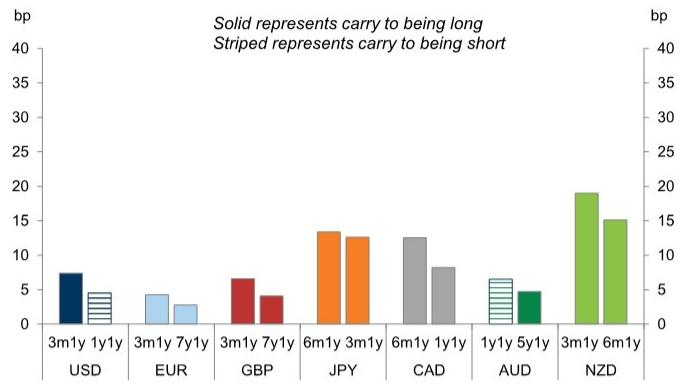  
Source: GS Global Investment Research

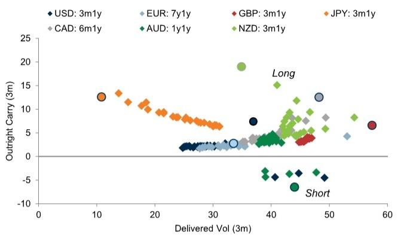

## Curve Carry

Bar chart shows top two carry curves by currency, with solid reflecting carry to a steepening position and striped carry to a flattening position. Scatter illustrates top 5 carry/vol curves by currency, with top curve by currency noted

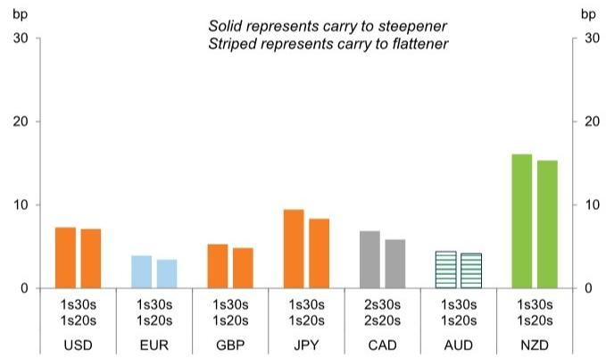

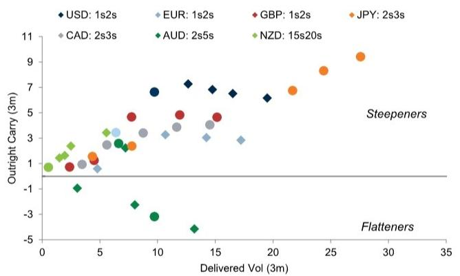  
Source: GS Global Investment Research

## Fly Carry

Bar chart shows top two carry flies by currency, with solid reflecting carry to a belly-richening fly and striped carry to a belly-cheapening fly. Scatter illustrates top 5 carry/vol flies by currency, with top fly by currency noted.  
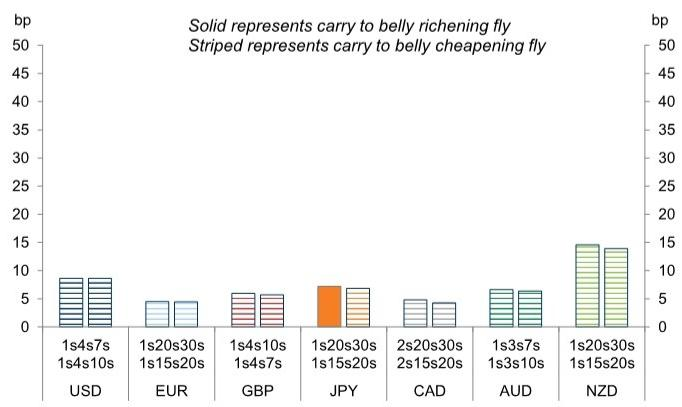  
Source: GS Global Investment Research

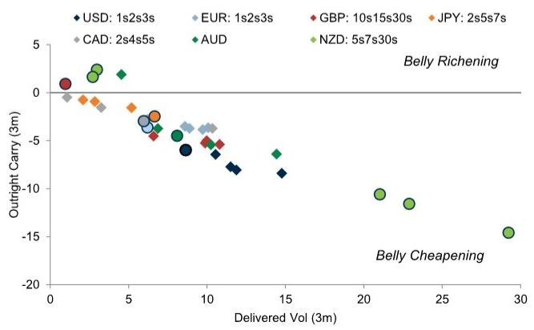

## Treasury Supply Monitor

Gross Treasury auction size estimates by year end, with GS projections

<table><tr><td colspan="12">Monthly Auction Amounts at End of Calendar Year ($ billions)</td></tr><tr><td></td><td>2y FRNs</td><td>2y</td><td>3y</td><td>5y</td><td>7y</td><td>10y</td><td>20y</td><td>30y</td><td>5y TIPS</td><td>10y TIPS</td><td>30y TIPS</td></tr><tr><td>YE-25 (CY)</td><td>30 / 28 (r)</td><td>69</td><td>58</td><td>70</td><td>44</td><td>42 / 39 (r)</td><td>16 / 13 (r)</td><td>25 / 22 (r)</td><td>26 / 24 (r)</td><td>21 / 19 (r)</td><td>9 / 8 (r)</td></tr><tr><td>YE-26 (CY, GS)</td><td>30 / 28 (r)</td><td>69</td><td>58</td><td>70</td><td>44</td><td>42 / 39 (r)</td><td>16 / 13 (r)</td><td>25 / 22 (r)</td><td>26 / 24 (r)</td><td>21 / 19 (r)</td><td>9 / 8 (r)</td></tr><tr><td>YE-27 (CY, GS)</td><td>33 / 30 (r)</td><td>83</td><td>72</td><td>84</td><td>58</td><td>42 / 39 (r)</td><td>16 / 13 (r)</td><td>25 / 22 (r)</td><td>28 / 26 (r)</td><td>21 / 19 (r)</td><td>9 / 8 (r)</td></tr></table>

\* Original Issue / Reopening listed for FRNs, 10s, 20s, 30s, and TIPS.

<table><tr><td colspan="7">US Treasury Net Issuance by Calendar Year ($ billions)</td></tr><tr><td></td><td>Net Coupons</td><td>Fed</td><td>Net of Fed</td><td>Net Bills</td><td>Fed</td><td>Net of Fed</td></tr><tr><td>CY 2024</td><td>1346</td><td>-475</td><td>1821</td><td>511</td><td>-23</td><td>534</td></tr><tr><td>CY 2025</td><td>1566</td><td>-115</td><td>1681</td><td>360</td><td>38</td><td>322</td></tr><tr><td>CY 2026, GS</td><td>1225</td><td>-1</td><td>1226</td><td>811</td><td>422</td><td>389</td></tr><tr><td>CY 2027, GS</td><td>1286</td><td>0</td><td>1286</td><td>927</td><td>449</td><td>478</td></tr></table>

Source: GS Global Investment Research, US Department of the Treasury

<table><tr><td colspan="3">Duration supply ($bn 10y equiv)</td></tr><tr><td>Gross supply</td><td>Fed</td><td>Net of Fed</td></tr><tr><td>2765</td><td>0</td><td>2765</td></tr><tr><td>2797</td><td>0</td><td>2797</td></tr><tr><td>2796</td><td>0</td><td>2796</td></tr><tr><td>2929</td><td>0</td><td>2929</td></tr></table>

Net issuance per quarter  
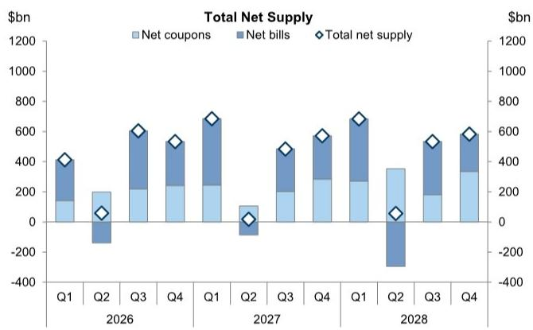  
Source: GS Global Investment Research, US Department of the Treasury

Average monthly UST issuance, gross and net of Fed purchases; \$bn 10y equivalents  
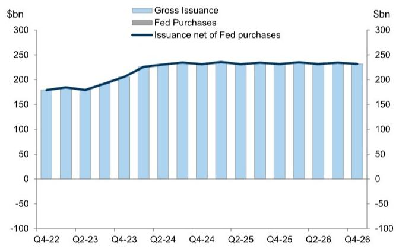  
Source: GS Global Investment Research, US Department of the Treasury

Free float (Treasuries outstanding less Fed and foreign official holdings) as % of GDP  
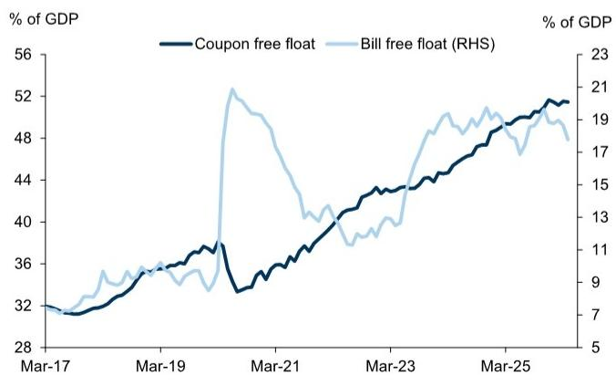  
Source: Haver Analytics, US Treasury, GS Global Investment Research

Bills as a share of Treasuries outstanding and GS forecast Gray shading denotes TBAC recommended 15-20% range  
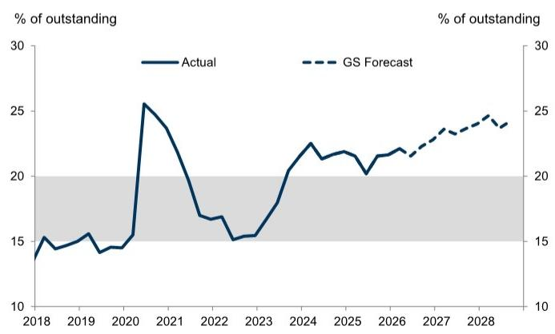  
Source: US Treasury, GS Global Investment Research

## GS Term Premium Decomposition

## 1y Range of G10 10y Yields, by Term Premium and Expectations Components

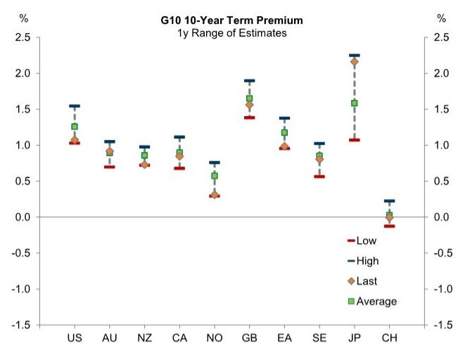

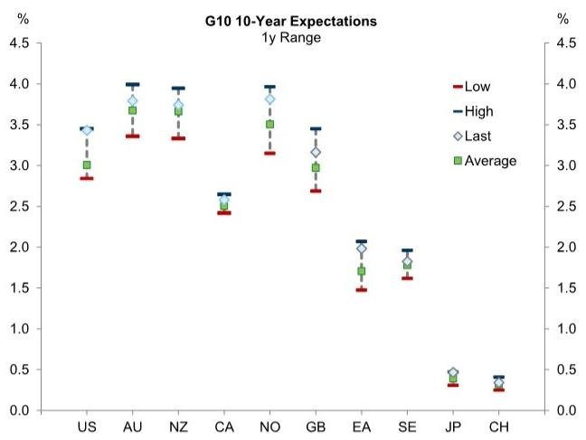

Term Structure of Fitted Yields, by Component  
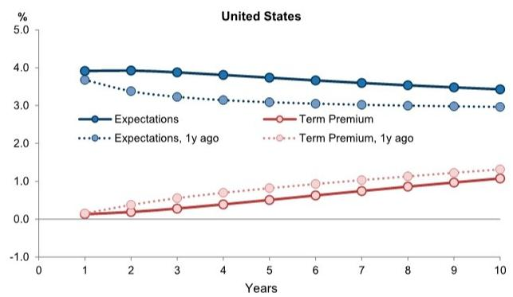

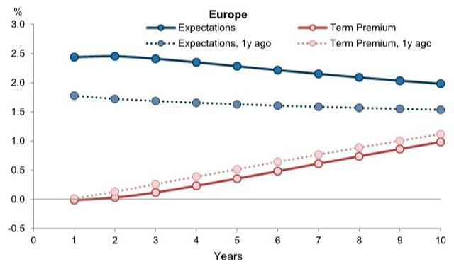

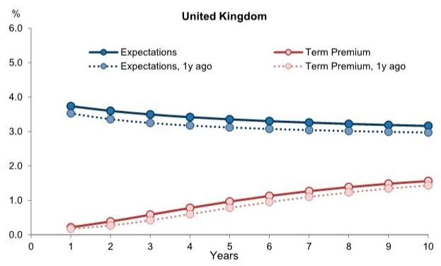  
Source: GS Global Investment Research

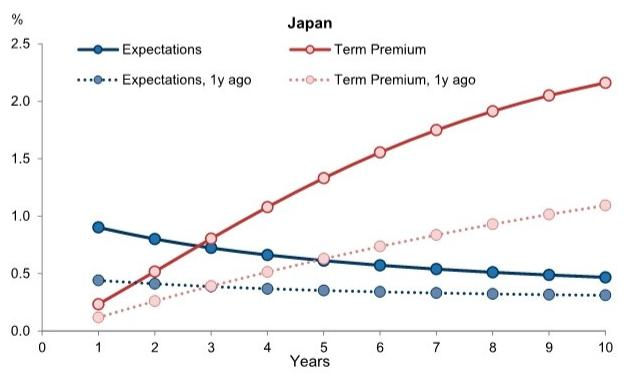

2026 Trade Recommendations

<table><tr><td colspan="7">GS Rates Trades</td></tr><tr><td>Active</td><td>Entry Date</td><td>Opened</td><td>Latest</td><td>Stop</td><td>Target</td><td>Performance</td></tr><tr><td>1. Long 3y France, Spain, Italy vs OIS (equally weighted)</td><td>10-Apr-26</td><td>0.33</td><td>0.30</td><td>0.32</td><td>0.23</td><td>+3 bps</td></tr><tr><td>2. Long 3y SOFR swap spread</td><td>17-Apr-26</td><td>-0.226</td><td>-0.207</td><td>-0.230</td><td>-0.180</td><td>+2 bps</td></tr><tr><td>3. 2s5s CAD steepeners</td><td>24-Apr-26</td><td>0.20</td><td>0.23</td><td>0.20</td><td>0.35</td><td>+3 bps</td></tr><tr><td>4. Long 5y Receivers on 3m 2s5s10s Receiver Fly (bp running)</td><td>08-May-26</td><td>0.01</td><td>-0.02</td><td>-0.05</td><td>0.10</td><td>-3 bps</td></tr><tr><td>5. 1y forward 2s10s GBP OIS steepeners</td><td>29-May-26</td><td>0.38</td><td>0.39</td><td>0.25</td><td>0.55</td><td>+1 bps</td></tr><tr><td>6. Long 2y1y OIS vs pay August RBA</td><td>26-Jun-26</td><td>-0.18</td><td></td><td>-0.10</td><td>-0.35</td><td></td></tr><tr><td>Closed</td><td>Entry Date</td><td>Closed</td><td>Performance</td><td></td><td></td><td></td></tr><tr><td>1. SFRZ6/Z7 steepeners</td><td>21-Nov-25</td><td>14-Jan-26</td><td>+6bps</td><td></td><td></td><td></td></tr><tr><td>2. Long 10y Gilts on ASW</td><td>21-Nov-25</td><td>30-Jan-26</td><td>+12 bps</td><td></td><td></td><td></td></tr><tr><td>3. Long USD 3m2y A-25 receiver vs short 3m10y A-25 receiver (return in bp running)</td><td>07-Nov-25</td><td>09-Feb-26</td><td>-2 bps</td><td></td><td></td><td></td></tr><tr><td>4. 2s5s CORRA steepener</td><td>16-Jan-26</td><td>13-Feb-26</td><td>+0 bps</td><td></td><td></td><td></td></tr><tr><td>5. Receive AUD 5y5y IRS vs pay NZD 5y5y</td><td>28-Nov-25</td><td>18-Feb-26</td><td>+0 bps</td><td></td><td></td><td></td></tr><tr><td>6. Long 20s on 10s20s30s weighted SOFR fly (weights 0.6x : 2x : 1.4x)</td><td>01-Aug-25</td><td>02-Mar-26</td><td>+6 bps</td><td></td><td></td><td></td></tr><tr><td>7. Long SFIU6</td><td>30-Jan-26</td><td>03-Mar-26</td><td>+7 bps</td><td></td><td></td><td></td></tr><tr><td>8. Long 10y Gilts vs Bunds</td><td>07-Nov-25</td><td>09-Mar-26</td><td>+4 bps</td><td></td><td></td><td></td></tr><tr><td>9. 3m10y A+5/A+20/A+27.5 payer ladders (bp running)</td><td>20-Feb-26</td><td>23-Mar-26</td><td>-5 bps</td><td></td><td></td><td></td></tr><tr><td>10. Long 10y NOK vs SEK</td><td>13-Feb-26</td><td>25-Mar-26</td><td>+20 bps</td><td></td><td></td><td></td></tr><tr><td>11. Long EU 30y on the fly against 30y Austria and Spain</td><td>27-Feb-26</td><td>10-Apr-26</td><td>-5 bps</td><td></td><td></td><td></td></tr><tr><td>12. Long USD 3m 2s10s A+10/A+25 curve cap spread (bp of notional)</td><td>23-Jan-26</td><td>15-Apr-26</td><td>-2 bps</td><td></td><td></td><td></td></tr><tr><td>13. USD 3m3y A-5/A-40 receiver spreads</td><td>13-Mar-26</td><td>30-Apr-26</td><td>-7 bps</td><td></td><td></td><td></td></tr><tr><td>14. Long 10y Inflation Swap vs 0.25x Receive 10y SOFR</td><td>27-Mar-26</td><td>07-May-26</td><td>+15 bps</td><td></td><td></td><td></td></tr><tr><td>15. Pay 10s on 5s10s30s SOFR fly</td><td>09-Jan-26</td><td>08-May-26</td><td>-1 bps</td><td></td><td></td><td></td></tr><tr><td>16. Long 10y Inflation Swap vs 0.25x Receive 10y SOFR</td><td>12-Jun-26</td><td>18-Jun-26</td><td>-1 bps</td><td></td><td></td><td></td></tr><tr><td>17. Long 5y5y EUR OIS - HICP</td><td>01-May-26</td><td>19-Jun-26</td><td>+11 bps</td><td></td><td></td><td></td></tr></table>

Source: GS Global Investment Research

## Global Interest Rates Strategy

George Cole  
+44(20)7552-1214  
george.cole@gs.com  
GS International

## Isabella Rosenberg

+1(212)357-7628

GS & Co. LLC

William Marshall +1(212)357-0413 william.c.marshall@gs.com GS & Co. LLC

## Friedrich Schaper

+1(917)343-3214
friedrich.schaper@gs.com
GS & Co. LLC

Simon Freycenet +44(20)7774-5017 simon.freycenet@gs.com GS Bank Europe SE - Paris Branch

Loic Mathys  
+44(20)7051-1664  
loic.mathys@gs.com  
GS International

## Disclosure Appendix

## Reg AC

We, George Cole, William Marshall, Simon Freycenet, Isabella Rosenberg, Friedrich Schaper and Loic Mathys, hereby certify that all of the views expressed in this report accurately reflect our personal views, which have not been influenced by considerations of the firm's business or client relationships.

Unless otherwise stated, the individuals listed on the cover page of this report are analysts in GS' Global Investment Research division.

Contributing Authors: George Cole GS International, William Marshall GS & Co. LLC, Simon Freycenet GS Bank Europe SE - Paris Branch, Isabella Rosenberg GS & Co. LLC, Friedrich Schaper GS & Co. LLC, Loic Mathys GS International.

Unless otherwise stated, the individuals listed in the Contributing Authors disclosure of this report are analysts in GS' Global Investment Research division.

## Disclosures

## Option Specific Disclosures

Price target methodology: Please refer to the analyst's previously published research for methodology and risks associated with equity price targets.

Pricing Disclosure: Option prices and volatility levels in this note are indicative only, and are based on our estimates of recent mid-market levels (unless otherwise noted). All prices and levels exclude transaction costs unless otherwise stated.

General Options Risks – The risks below and any other options risks mentioned in this research report pertain both to specific derivative trade recommendations mentioned and to discussion of general opportunities and advantages of derivative strategies. Unless otherwise noted, options strategies mentioned in this report may be a combination of the strategies below and therefore carry with them the risks of those strategies.

Buying Options – Investors who buy call (put) options risk loss of the entire premium paid if the underlying security finishes below (above) the strike price at expiration. Investors who buy call or put spreads also risk a maximum loss of the premium paid. The maximum gain on a long call or put spread is the difference between the strike prices, less the premium paid.

Selling Options – Investors who sell calls on securities they do not own risk unlimited loss of the security price less the strike price. Investors who sell covered calls (sell calls while owning the underlying security) risk having to deliver the underlying security or pay the difference between the security price and the strike price, depending on whether the option is settled by physical delivery or cash-settled. Investors who sell puts risk loss of the strike price less the premium received for selling the put. Investors who sell put or call spreads risk a maximum loss of the difference between the strikes less the premium received, while their maximum gain is the premium received.

For options settled by physical delivery, the above risks assume the options buyer or seller, buys or sells the resulting securities at the settlement price on expiry.

## Regulatory disclosures

## Disclosures required by United States laws and regulations

See company-specific regulatory disclosures above for any of the following disclosures required as to companies referred to in this report: manager or co-manager in a pending transaction; $1\%$ or other ownership; compensation for certain services; types of client relationships; managed/co-managed public offerings in prior periods; directorships; for equity securities, market making and/or specialist role. GS trades or may trade as a principal in debt securities (or in related derivatives) of issuers discussed in this report.

The following are additional required disclosures: Ownership and material conflicts of interest: GS policy prohibits its analysts, professionals reporting to analysts and members of their households from owning securities of any company in the analyst's area of coverage. Analyst compensation: Analysts are paid in part based on the profitability of GS, which includes investment banking revenues. Analyst as officer or director: GS policy generally prohibits its analysts, persons reporting to analysts or members of their households from serving as an officer, director or advisor of any company in the analyst's area of coverage. Non-U.S. Analysts: Non-U.S. analysts may not be associated persons of GS & Co. LLC and therefore may not be subject to FINRA Rule 2241 or FINRA Rule 2242 restrictions on communications with a subject company, public appearances and trading in securities covered by the analysts.

## Additional disclosures required under the laws and regulations of jurisdictions other than the United States

The following disclosures are those required by the jurisdiction indicated, except to the extent already made above pursuant to United States laws and regulations. Australia: GS Australia Pty Ltd and its affiliates are not authorised deposit-taking institutions (as that term is defined in the Banking Act 1959 (Cth)) in Australia and do not provide banking services, nor carry on a banking business, in Australia. This research, and any access to it, is intended only for “wholesale clients” within the meaning of the Australian Corporations Act, unless otherwise agreed by GS. In producing research reports, members of Global Investment Research of GS Australia may attend site visits and other meetings hosted by the companies and other entities which are the subject of its research reports. In some instances the costs of such site visits or meetings may be met in part or in whole by the issuers concerned if GS Australia considers it is appropriate and reasonable in the specific circumstances relating to the site visit or meeting. To the extent that the contents of this document contains any financial product advice, it is general advice only and has been prepared by GS without taking into account a client’s objectives, financial situation or needs. A client should, before acting on any such advice, consider the appropriateness of the advice having regard to the client’s own objectives, financial situation and needs. A copy of certain GS Australia and New Zealand disclosure of interests and a copy of GS’ Australian Sell-Side Research Independence Policy Statement are available at: https://www.goldmansachs.com/disclosures/australia-new-zealand/index.html. Brazil: Disclosure information in relation to CVM Resolution n. 20 is available at https://www.gs.com/worldwide/brazil/area/gir/index.html. Where applicable, the Brazil-registered analyst primarily responsible for the content of this research report, as defined in Article 20 of CVM Resolution n. 20, is the first author named at the beginning of this report, unless indicated otherwise at the end of the text. Canada: This information is being provided to you for information purposes only and is not, and under no circumstances should be construed as, an advertisement, offering or solicitation by GS & Co. LLC for purchasers of securities in Canada to trade in any Canadian security. GS & Co. LLC is not registered as a dealer in any jurisdiction in Canada under applicable Canadian securities laws and generally is not permitted to trade in Canadian securities and may be prohibited from selling certain securities and products in certain jurisdictions in Canada. If you wish to trade in any Canadian securities or other products in Canada please contact GS Canada Inc., an affiliate of The GS Group Inc., or another registered Canadian dealer. Hong Kong: Further information on the securities of covered companies referred to in this research may be obtained on request from GS (Asia) L.L.C. India: Further information

on the subject company or companies referred to in this research may be obtained from GS (India) Securities Private Limited, Research Analyst - SEBI Registration Number INH000001493, 10th Floor, Ascent-Worli, Sudam Kalu Ahire Marg, Worli, Mumbai-400 025, India, Corporate Identity Number U74140MH2006FTC160634, Phone +91 22 6616 9000, Fax +91 22 6616 9001. GS may beneficially own 1% or more of the securities (as such term is defined in clause 2 (h) the Indian Securities Contracts (Regulation) Act, 1956) of the subject company or companies referred to in this research report. Registration granted by SEBI and certification from NISM in no way guarantee performance of the intermediary or provide any assurance of returns to investors. GS (India) Securities Private Limited compliance officer and investor grievance contact details, a copy of the annual compliance audit report and other relevant information and disclosures can be found at this link:

https://www.goldmansachs.com/worldwide/india/research-analyst. Japan: See below. Korea: This research, and any access to it, is intended only for “professional investors” within the meaning of the Financial Services and Capital Markets Act, unless otherwise agreed by GS. Further information on the subject company or companies referred to in this research may be obtained from GS (Asia) L.L.C., Seoul Branch. New Zealand: GS New Zealand Limited and its affiliates are neither “registered banks” nor “deposit takers” (as defined in the Reserve Bank of New Zealand Act 1989) in New Zealand. This research, and any access to it, is intended for “wholesale clients” (as defined in the Financial Advisers Act 2008) unless otherwise agreed by GS. A copy of certain GS Australia and New Zealand disclosure of interests is available at: https://www.goldmansachs.com/disclosures/australia-new-zealand/index.html. Russia: Research reports distributed in the Russian Federation are not advertising as defined in the Russian legislation, but are information and analysis not having product promotion as their main purpose and do not provide appraisal within the meaning of the Russian legislation on appraisal activity. Research reports do not constitute a personalized investment recommendation as defined in Russian laws and regulations, are not addressed to a specific client, and are prepared without analyzing the financial circumstances, investment profiles or risk profiles of clients. GS assumes no responsibility for any investment decisions that may be taken by a client or any other person based on this research report. Singapore: GS (Singapore) Pte. (Company Number: 198602165W), which is regulated by the Monetary Authority of Singapore, accepts legal responsibility for this research, and should be contacted with respect to any matters arising from, or in connection with, this research. Taiwan: This material is for reference only and must not be reprinted without permission. Investors should carefully consider their own investment risk. Investment results are the responsibility of the individual investor. United Kingdom: Persons who would be categorized as retail clients in the United Kingdom, as such term is defined in the rules of the Financial Conduct Authority, should read this research in conjunction with prior GS on the covered companies referred to herein and should refer to the risk warnings that have been sent to them by GS International. A copy of these risks warnings, and a glossary of certain financial terms used in this report, are available from GS International on request.

European Union and United Kingdom: Disclosure information in relation to Article 6 (2) of the European Commission Delegated Regulation (EU) (2016/958) supplementing Regulation (EU) No 596/2014 of the European Parliament and of the Council (including as that Delegated Regulation is implemented into United Kingdom domestic law and regulation following the United Kingdom's departure from the European Union and the European Economic Area) with regard to regulatory technical standards for the technical arrangements for objective presentation of investment recommendations or other information recommending or suggesting an investment strategy and for disclosure of particular interests or indications of conflicts of interest is available at https://www.gs.com/disclosures/europeanpolicy.html which states the European Policy for Managing Conflicts of Interest in Connection with Investment Research.

Japan: GS Japan Co., Ltd. is a Financial Instrument Dealer registered with the Kanto Financial Bureau under registration number Kinsho 69, and a member of Japan Securities Dealers Association, Financial Futures Association of Japan Type II Financial Instruments Firms Association, and Investment Management Association of Japan. Sales and purchase of equities are subject to commission pre-determined with clients plus consumption tax. See company-specific disclosures as to any applicable disclosures required by Japanese stock exchanges, the Japanese Securities Dealers Association or the Japanese Securities Finance Company.

## Global product; distributing entities

GS Global Investment Research produces and distributes research products for clients of GS on a global basis. Analysts based in GS offices around the world produce research on industries and companies, and research on macroeconomics, currencies, commodities and portfolio strategy. This research is disseminated in Australia by GS Australia Pty Ltd (ABN 21 006 797 897); in Brazil by GS do Brasil Corretora de Títulos e Valores Mobiliários S.A.; Public Communication Channel GS Brazil: 0800 727 5764 and / or contatogoldmanbrasil@gs.com. Available Weekdays (except holidays), from 9am to 6pm. Canal de Comunicação com o Público GS Brasil: 0800 727 5764 e/ou contatogoldmanbrasil@gs.com. Horário de funcionamento: segunda-feira à sexta-feira (exceto feriados), das 9h às 18h; in Canada by GS & Co. LLC; in Hong Kong by GS (Asia) L.L.C.; in India by GS (India) Securities Private Ltd.; in Japan by GS Japan Co., Ltd.; in the Republic of Korea by GS (Asia) L.L.C., Seoul Branch; in New Zealand by GS New Zealand Limited; in Russia by OOO GS; in Singapore by GS (Singapore) Pte. (Company Number: 198602165W); and in the United States of America by GS & Co. LLC. GS International has approved this research in connection with its distribution in the United Kingdom.

GS International (“GSI”), authorised by the Prudential Regulation Authority (“PRA”) and regulated by the Financial Conduct Authority (“FCA”) and the PRA, has approved this research in connection with its distribution in the United Kingdom.

European Economic Area: GS Bank Europe SE (“GSBE”) is a credit institution incorporated in Germany and, within the Single Supervisory Mechanism, subject to direct prudential supervision by the European Central Bank and in other respects supervised by German Federal Financial Supervisory Authority (Bundesanstalt für Finanzdienstleistungsaufsicht, BaFin) and Deutsche Bundesbank and disseminates research within the European Economic Area.

## General disclosures

This research is for our clients only. Other than disclosures relating to GS, this research is based on current public information that we consider reliable, but we do not represent it is accurate or complete, and it should not be relied on as such. The information, opinions, estimates and forecasts contained herein are as of the date hereof and are subject to change without prior notification. We seek to update our research as appropriate, but various regulations may prevent us from doing so. Other than certain industry reports published on a periodic basis, the large majority of reports are published at irregular intervals as appropriate in the analyst's judgment.

GS conducts a global full-service, integrated investment banking, investment management, and brokerage business. We have investment banking and other business relationships with a substantial percentage of the companies covered by Global Investment Research. GS & Co. LLC, the United States broker dealer, is a member of SIPC (https://www.sipc.org).

Our salespeople, traders, and other professionals may provide oral or written market commentary or trading strategies to our clients and principal trading desks that reflect opinions that are contrary to the opinions expressed in this research. Our asset management area, principal trading desks and investing businesses may make investment decisions that are inconsistent with the recommendations or views expressed in this research.

We and our affiliates, officers, directors, and employees will from time to time have long or short positions in, act as principal in, and buy or sell, the securities or derivatives, if any, referred to in this research, unless otherwise prohibited by regulation or GS policy.

The views attributed to third party presenters at GS arranged conferences, including individuals from other parts of GS, do not necessarily reflect those of Global Investment Research and are not an official view of GS.

Any third party referenced herein, including any salespeople, traders and other professionals or members of their household, may have positions in the products mentioned that are inconsistent with the views expressed by analysts named in this report.

This research is focused on investment themes across markets, industries and sectors. It does not attempt to distinguish between the prospects or performance of, or provide analysis of, individual companies within any industry or sector we describe.

Any trading recommendation in this research relating to an equity or credit security or securities within an industry or sector is reflective of the investment theme being discussed and is not a recommendation of any such security in isolation.

This research is not an offer to sell or the solicitation of an offer to buy any security in any jurisdiction where such an offer or solicitation would be illegal. It does not constitute a personal recommendation or take into account the particular investment objectives, financial situations, or needs of individual clients. Clients should consider whether any advice or recommendation in this research is suitable for their particular circumstances and, if appropriate, seek professional advice, including tax advice. The price and value of investments referred to in this research and the income from them may fluctuate. Past performance is not a guide to future performance, future returns are not guaranteed, and a loss of original capital may occur. Fluctuations in exchange rates could have adverse effects on the value or price of, or income derived from, certain investments.

Certain transactions, including those involving futures, options, and other derivatives, give rise to substantial risk and are not suitable for all investors. Investors should review current options and futures disclosure documents which are available from GS sales representatives or at https://www.theocc.com/about/publications/character-risks.jsp and https://www.goldmansachs.com/disclosures/cftc\_fcm\_disclosures. Transaction costs may be significant in option strategies calling for multiple purchase and sales of options such as spreads. Supporting documentation will be supplied upon request.

Differing Levels of Service provided by Global Investment Research: The level and types of services provided to you by GS Global Investment Research may vary as compared to that provided to internal and other external clients of GS, depending on various factors including your individual preferences as to the frequency and manner of receiving communication, your risk profile and investment focus and perspective (e.g., marketwide, sector specific, long term, short term), the size and scope of your overall client relationship with GS, and legal and regulatory constraints. As an example, certain clients may request to receive notifications when research on specific securities is published, and certain clients may request that specific data underlying analysts' fundamental analysis available on our internal client websites be delivered to them electronically through data feeds or otherwise. No change to an analyst's fundamental research views (e.g., ratings, price targets, or material changes to earnings estimates for equity securities), will be communicated to any client prior to inclusion of such information in a research report broadly disseminated through electronic publication to our internal client websites or through other means, as necessary, to all clients who are entitled to receive such reports.

All research reports are disseminated and available to all clients simultaneously through electronic publication to our internal client websites. Not all research content is redistributed to our clients or available to third-party aggregators, nor is GS responsible for the redistribution of our research by third party aggregators. For research, models or other data related to one or more securities, markets or asset classes (including related services) that may be available to you, please contact your GS representative or go to https://research.gs.com.

Disclosure information is also available at https://www.gs.com/research/hedge.html or from Research Compliance, 200 West Street, New York, NY 10282.

## © 2026 GS.

You are permitted to store, display, analyze, modify, reformat, and print the information made available to you via this service only for your own use. You may not resell or reverse engineer this information to calculate or develop any index for disclosure and/or marketing or create any other derivative works or commercial product(s), data or offering(s) without the express written consent of GS. You are not permitted to publish, transmit, or otherwise reproduce this information, in whole or in part, in any format to any third party without the express written consent of GS. This foregoing restriction includes, without limitation, using, extracting, downloading or retrieving this information, in whole or in part, to train or finetune a machine learning or artificial intelligence system, or to provide or reproduce this information, in whole or in part, as a prompt or input to any such system.