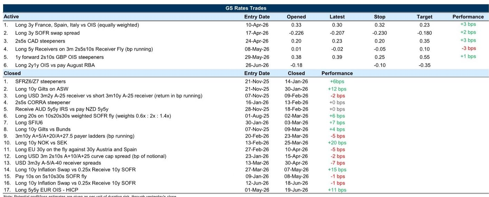
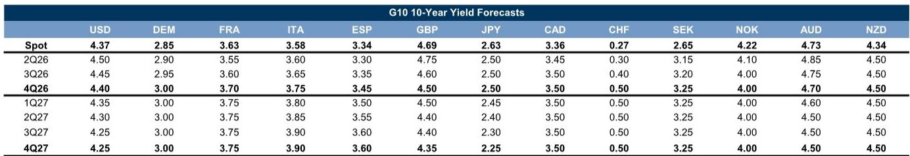

# The Oil-Driven Repricing of Global Rates Has Further to Run, But the Opportunity Set Is Shifting From Yields to Volatility

The sharp decline in oil prices following the US-Iran agreement has fundamentally altered the macro backdrop for global fixed income markets. The hawkish front-end repricing in the US that dominated the first half of the year has proven surprisingly resilient even as energy costs have fallen, yet the market has missed the more important structural shift: inflation and growth risks are now co-moving again, restoring nominal duration's traditional role as a risk asset hedge. This is not merely a tactical relief rally. It represents a re-anchoring of the macro regime that will reshape positioning across the US, Europe, the UK, and Asia-Pacific in the months ahead. The key insight for investors is that the most attractive risk-reward has moved away from the very front-end of curves and toward the belly, while the real opportunity lies not in directional yield bets but in the normalization of rate volatility.

The market is currently pricing a residual hawkish bias that looks increasingly inconsistent with the incoming data. The Federal Reserve's June communication, while appropriately mindful of inflation risks, did not convey a sense of urgency to hike. Combined with the ongoing decline in energy prices, this creates a favorable asymmetry for receiving rates further out on the curve. The probability mass for end-2026 pricing should consolidate around an on-hold outcome as milder job growth and inflation data accumulate. But this is not a simple directional call. The structure of the opportunity matters immensely, and the differentiation across markets and maturities will determine which trades deliver alpha.

---

## The Decline in Oil Prices Has Curtailed Inflation Upside and Restored Duration's Hedge Value, But the Hawkish Front-End Pricing Will Decay Only Gradually

The most important macro development is the re-coupling of inflation and growth risks. During the energy shock, these forces were at odds: rising oil prices pushed inflation higher while threatening to slow economic activity, creating a toxic environment for both bonds and equities. Now that oil has retreated, inflation risk is declining in tandem with growth concerns, meaning that nominal duration can once again serve as a hedge against risk asset drawdowns. This is a regime shift of first-order importance for portfolio construction.

The evidence is visible in the rotation of front-end skew back toward receivers and the moderation of Fed pricing from its hawkish extremes. Near-term real rates have started to participate in rallies, a sign that the market is beginning to price a less restrictive policy path. Yet the pace of this adjustment should not be overestimated. The residual hawkishness in front-end pricing reflects genuine uncertainty about the Fed's reaction function following the June signal. The market is still trying to calibrate how much weight the Committee places on inflation persistence versus labor market softening, and that uncertainty will keep near-term hike risk somewhat sticky.

This creates a clear strategic implication: the most favorable near-term asymmetry is not at the very front-end, where the stickiness of hawkish pricing creates two-way risk, but rather at points slightly further out on the curve such as the 1y1y or 2y1y forward rates. If firmer data emerges, it will likely front-load hike risk into near-term forwards, leaving longer-dated forwards relatively insulated. Conversely, if data softens, those longer-dated forwards have more room to rally as the market prices a lower terminal rate. This asymmetry is the core trade opportunity in US rates.

---

## Implied Volatility Has Settled at a Higher Floor, But Current Front-End Steepness Suggests Scope for Further Moderation That Favors Vol Selling Strategies

The decline in macro uncertainty has not been fully reflected in options markets. While implied volatility has come off its peaks and now sits toward the lower end of its fair value range, it has settled at a level that is structurally higher than before the energy conflict. This elevated vol floor reflects the emergence of risk premium at shorter tails, driven by uncertainty around the Fed's reaction function rather than macro fundamentals.

The critical insight is that current levels of front-end steepness can see implied volatility undershoot what macro fundamentals would suggest. When the curve is steep at the front-end, the market is pricing significant uncertainty about the path of policy over the next few months. If that steepness is excessive relative to the actual macro outlook, implied vol has room to decline further. The historical relationship between front-end steepness and vol residuals suggests that the current setup is fertile ground for vol selling, particularly if incoming data on hiring and inflation continues to moderate and allows hawkish policy momentum to decay gradually.

However, there is important differentiation along the vol surface. The ongoing shift from macro uncertainty to policy uncertainty should sustain a flatter tail curve. Uncertainty about the Fed's reaction function is inherently concentrated at shorter horizons, while the longer end benefits from the reduction in macro tail risks. This is already partially reflected in valuations: vol on 1y tails looks rich relative to both macro fundamentals and the vol surface PCA, while implied vol on belly tenors looks cheap compared to the wings. The strategic implication is to favor vol selling in the belly while being more cautious on short-dated tail risk.

---

## The European Rates Story Is About Volatility Compression, Not Yield Compression, and the Solvency II Review Adds a Powerful Structural Tailwind for Long-End Sovereign Credit

European rates present a different opportunity set than the US. The decline in energy prices has reduced European rates volatility more than it has reduced yield levels, extending the decoupling that followed the April ceasefire. This makes sense given that the ECB path and European rates volatility are more narrowly driven by energy uncertainty compared with the broader range of macro factors influencing the US. As shipping flows through the Strait of Hormuz increase and energy relief extends, European rates vol should continue to underperform the US.

But the yield story is more nuanced. ECB commentary continues to emphasize the fragility of the peace agreement and ongoing concerns about inflation persistence. Our economists still forecast another hike in September, and the market is now trading below our end-2026 Bund yield forecast of 3%. We do not expect a meaningful rally from current yield levels. Instead, the opportunity lies in curve positioning: 5y rates are likely to outperform on the curve, especially if further hikes coincide with additional inflationary relief from energy prices.

The most significant structural development in European rates is the upcoming implementation of the Solvency II review, which must be completed by January 2027. While the review aims to steer insurance company portfolios toward the real economy, implying a rising marginal allocation to equities, other elements of the review are a net positive for sovereign credit. The revised methodology for risk-free rates will make long-dated discount rates more sensitive to shifts in market rates, likely increasing interest rate hedging past the 20-year point of the curve. Revisions to the Volatility Adjustment mechanism and more favorable correlation parameters between interest rates and credit spreads will also support insurers' ability to bear credit risk. This should reinforce insurer demand for long-dated government bonds, adding to the already favorable backdrop for sovereign credit as rates volatility and growth risks decline.

---

## What the Report Does Not Fully Answer: The Risk That Funding Market Spillovers From Equity Supply Disrupt the Benign Carry Backdrop in Europe

The report identifies a critical risk that deserves more analytical attention. The market focus on equity supply through IPOs, primarily in the US but also to a lesser extent in Europe, has seen equity funding spreads increase. This period is analogous to the second half of 2024, when building long positions in equities generated pressures on funding markets that eventually spilled over to fixed income. Back then, Bund spread cheapening ran ahead of fundamentals by about 15 basis points over six months, suggesting that the increase in funding costs from equity markets had contaminated fixed income markets.

The macro and market context is different now. ECB quantitative tightening is no longer accelerating, spreads are generally cheaper, and global curves are steeper. But the risk is worth watching in coming months as QT continues to drain excess liquidity in the Euro area. While the liquidity backdrop should remain abundant into 2027, consistent with still-low levels of bank borrowing at the ECB's facilities, funding pressures are one potential risk to the generally favorable backdrop for carry trades. The question the report leaves open is whether the current equity issuance cycle is large enough and sustained enough to generate meaningful spillover effects, and at what threshold those spillovers would become material for fixed income positioning.

---

## A Decision Framework for Positioning Across Markets: Favor Belly Duration in the US and Europe, Steepeners in the UK, and Receive in Australia

The cross-market opportunity set can be organized around a simple framework that differentiates by country based on the dominant driver of rates and the stage of the policy cycle.

In the United States, the combination of declining oil prices, a Fed that is not signaling urgency to hike, and the restoration of duration's hedge value favors receiving rates in the belly of the curve. The 1y1y and 2y1y forward rates offer the best risk-reward, as they are less exposed to the residual stickiness of near-term hike risk while still benefiting from the gradual decay of hawkish pricing. Within the vol space, selling belly vol looks attractive given the scope for implied vol to moderate further.

In Europe, the opportunity is more about curve positioning than directional yield bets. With the ECB retaining a hawkish bias and the market below our end-2026 yield forecast, 5y rates should outperform on the curve. The Solvency II review provides a structural tailwind for long-end sovereign credit that should be factored into positioning. The risk to watch is funding market spillovers from equity supply, which could disrupt the benign carry backdrop.

The UK presents a different picture. Most of the decline in 10-year Gilt yields in recent months has been due to term premium compression, not a repricing of the policy path. With the market likely to retain some political premium as focus turns to the Autumn budget, the hurdle for further term premium compression is high. The report favors steepeners in the UK, with outperformance of the 1y1y part of the curve as front-end real rates eventually normalize lower.

In Australia and New Zealand, the risks around RBA pricing are more balanced. The market is pricing less than 50% of a hike through year-end, but our economists lean toward one additional hike contingent on a sufficiently firm inflation print. The risk-reward favors setting longs further out the curve, with scope for the market to price greater risk of cuts on a 1-to-2-year forward horizon as evidence of weaker growth and softer inflation accumulates.

---

## The Most Important Unresolved Question: How Will the Fed's Balance Sheet Policy Debate Reshape Swap Spread Dynamics?

The report identifies a medium-term risk that could fundamentally alter the opportunity set in US rates: the uncertainty over the Fed's balance sheet policy. If the Fed begins to have a more serious debate about alternatives to the ample reserves framework, it would correspond to increased risk premium in belly and long-end swap spreads compared to the front-end. This reflects the likelihood that any concrete shift would take time to implement and therefore be more relevant over longer horizons.

The current benign backdrop for Treasury funding conditions, driven by a favorable balance between cash lending from money funds and subdued demand from levered investors, provides a comfortable buffer. But the market is not pricing this risk. The report suggests that shorter-term swap spreads offer value from a carry perspective, with valuations about fair, and expresses a preference for 3-year swap spreads which should be more insulated from balance sheet risk while offering appealing carry-to-vol versus the rest of the curve.

The unresolved question is whether the market is underestimating the probability of a significant balance sheet policy shift, and what the second-order implications would be for the broader rates complex. If the Fed were to signal a move toward a scarce reserves framework, the implications for repo rates, swap spreads, and the shape of the yield curve would be profound. This is a risk that deserves monitoring but is not yet priced into current levels.

---

## Join the community to read the full report and review the original charts.

The analysis presented here is based on a single point in time and reflects the views of a global investment bank's rates strategy team. For the full set of exhibits, including the front-end skew rotation chart, the vol surface analysis, the funding market dynamics, and the detailed country-by-country positioning recommendations, readers are encouraged to access the complete report. The charts provide visual confirmation of the regime shift described here and offer additional granularity on the specific trade recommendations.

*This article is for learning and discussion only and does not constitute investment advice.*

Personal reading notes and learning share only. Not investment advice.

