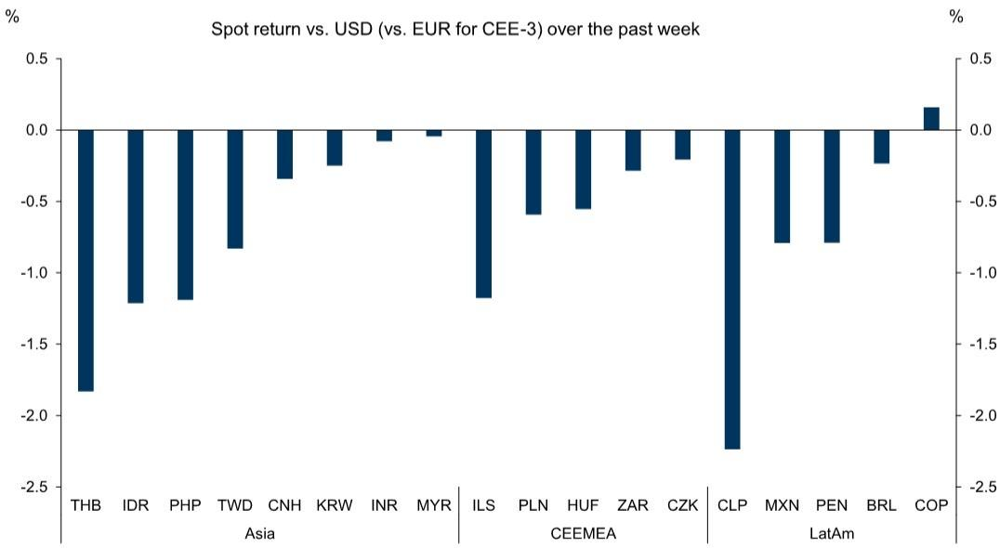
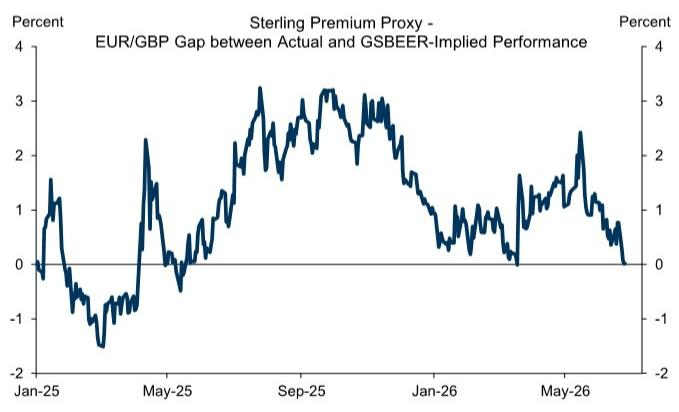
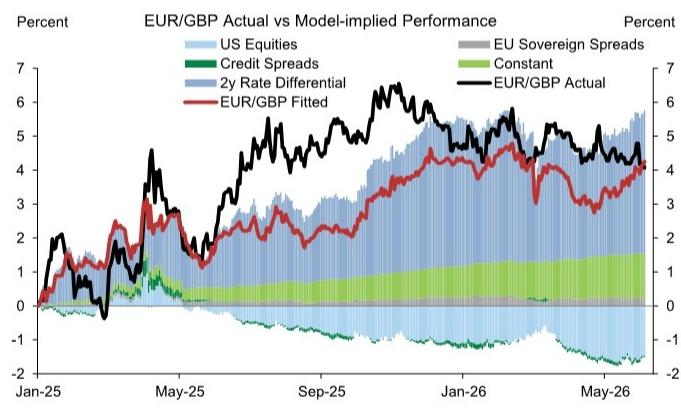
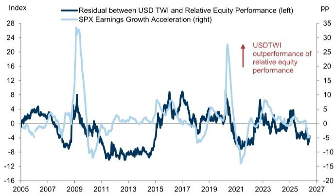
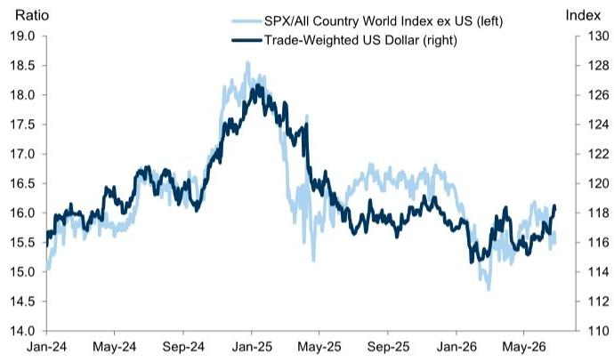

GLOBAL FX TRADER

# Deferential to the Differential

Our thoughts on USD, EM FX, GBP, JPY, MYR, and AI and the Dollar - USD: Back to basics. The Dollar has moved stronger in tandem with rate differentials following the hawkish reaction to last week's FOMC decision. There has been some surprise that the currency has strengthened despite the move lower in oil. But as we discussed last week, rate differentials have a more consistent and significant relationship with exchange rates, which we think accounts for the range break. We see risks for the Dollar as still skewed to the upside in the near term because we think the probability of rate hikes could move up quickly, but come out only slowly. Over the medium term, however risks remain more balanced. We see three primary routes for the Dollar to weaken over time. First, the shift in relative policy pricing has now been sufficiently large that pricing out rate hikes in the future, in line with our economists' view, would weigh on the currency enough to put us back in the previous multi-month range. Second, if institutional credibility concerns were to return—particularly through a perceived overly dovish reaction function—that would again weigh on the Dollar. And finally, our economists expect growth to slow somewhat in the second half of the year as positive economic impulses fade, so we still see a route to a weaker Dollar in response to less exceptional performance than before. But on the other hand, we increasingly see an upside case for the Dollar if Fed officials determine that policy is not sufficiently restrictive, particularly in light of strong AI-related capital expenditures. This would be especially positive for the currency if that level of restriction proves more challenging for countries in Europe and elsewhere that would import tighter financial conditions from the Fed without the commensurate demand for AI-related investment. We believe that economic developments over the last few months, and policymaker communications over the last few weeks, make this outcome increasingly likely, but not our baseline.

■ EM FX: Low-yielder lowdown. The Thai Baht (THB), Israeli Shekel (ILS) and the Chilean Peso (CLP) were the worst performing EM currencies versus the Dollar over the past week across the major regions (Exhibit 1). The common theme here is that these are among the lowest yielding currencies in Asia, EMEA and Latam, and so the underperformance here is consistent with our view that a bear-flattening in US rates, induced by a hawkish Fed meeting in June, should put most pressure on low-yielding currencies across G10 and EM. As we discussed

Kamakshya Trivedi +44(20)7051-4005 | kamakshya.trivedi@gs.com GS International

Michael Cahill  
+44(20)7552-8314 |  
michael.e.cahill@gs.com  
GS International

Danny Suwanapruti  
+65-6889-1987 |  
danny.suwanapruti@gs.com  
GS (Singapore) Pte

Teresa Alves  
+44(20)7051-7566 |  
teresa.alves@gs.com  
GS International

Karen Reichgott Fishman  
+1(212)855-6006 |  
karen.fishman@gs.com  
GS & Co. LLC

Stuart Jenkins  
+44(20)7051-4700 |  
stuart.jenkins@gs.com  
GS International

Victor Engel  
+44(20)7051-3862 | victor.engel@gs.com GS International

Lexi Kanter  
+1(212)855-9701 | alexandra.kanter@gs.com GS & Co. LLC

last week, funding high carry EM FX strategies by such low-yielders in EM or G10 can help neutralise the risk exposure and USD beta of carry currencies, and augment the overall carry proposition. But apart from the common low-yielding feature of these currencies, each of these funders comes with slightly different characteristics. From a valuation perspective, using our 60:40 ratio of GSDEER and GSFEER metrics, the Shekel is about $10\%$ overvalued, the Peso is about $15\%$ undervalued, and the Baht is about fair. The risk exposures that they neutralize are also subtly different. The ILS has one of the highest sensitivities to tech stocks, so is likely to be particularly suitable as a funder given recent volatility in tech sector equities. CLP is by far the most exposed currency to copper prices, and the broader cyclical risk betas that those mirror, so is a better hedge when broader growth concerns are more in focus. THB has a lower beta to equity risk than ILS and CLP, but is likely to be a clearer underperformer in the event that gold prices continue to slip further. Domestic considerations also point more clearly to THB and ILS weakness: in the former, structural economic challenges warrant lower rates and policymakers have welcomed currency weakness, and in the latter as well there has been a shift in policy with the Bol's decision to cut rates in May and to intervene in FX markets by buying Dollars for the first time since 2022. Taken together, within EM, THB and ILS screen as more attractive funders for carry baskets, and we continue to recommend short THB/INR as one variation of that theme.

Exhibit 1: THB, ILS, and CLP were the worst performing EM currencies versus the Dollar over the past week across the major regions  
  
Source: Bloomberg, GS Global Investment Research

GBP: Transitions and positions. We see three reasons for Sterling's steady performance following Andy Burnham's Makerfield by-election win. First and foremost, PM Starmer's resignation and Wes Streeting's announced endorsement of Burnham have meaningfully narrowed the perceived range of leadership outcomes, reducing uncertainty around the leadership transition. Second, the relationship between pricing of a Starmer government and premium in Sterling has held less

tightly after Burnham's announced commitment to the fiscal rules in mid-May. And third, a Burnham-led government was already heavily priced in prediction markets ahead of the by-election (at around 80% on Polymarket). We think all three of these factors have helped form the case for Sterling relief on a compression in premium and a reduction in short-GBP positioning. But from a fundamental perspective, we see good reason to expect this relief to be fairly tactical and narrow, with fiscal and political premium in the currency already having been fully removed under our cyclical models—after recently peaking at \~2.5% in May (Exhibit 2). Underpinning that has been a widening in EU-UK rate differentials and a risk-off dynamic so far this month, both of which have pushed in a positive direction for EUR/GBP under the surface, balancing out the compression in premium (Exhibit 3). The risks of a sustained premium-driven Sterling sell-off continue to look low to us after recent events, but there are still important challenges on the fiscal front. Our economists note risks of a slower fiscal consolidation under a Burnham government on further spending pressures and limited available tax room. And even though Burnham has announced his commitment to the fiscal rules, this does not necessarily preclude a front-loaded borrowing approach that tests the limits of the Gilt market's tolerance—which will likely move into focus again ahead of this year's Autumn budget. Meanwhile, a more positive Sterling tail that could come out of recent developments is a potential reset to closer trade ties with the EU that Burnham has advocated, which could partially reverse Brexit's long-term impact on the currency, and help offset the challenging structural valuation picture.

Exhibit 2: Under our GSBEER-based proxy, premium in Sterling has now be reduced to around zero after the recent compression  
  
Source: GS Global Investment Research

Exhibit 3: Steady EUR/GBP performance reflects a balance between premium compression and a Sterling-negative shift in rate differentials  
  
Source: GS Global Investment Research

JPY: An even better funder. This past week saw USD/JPY trade up close to 162, its highest level since July 2024, when the MoF subsequently intervened. Many view the short-lived impact of the last intervention and the lack of official operations since then as lowering the odds of an additional round. We find that argument less compelling, since the likelihood of sustained effectiveness was already low prior to the April decision. But it does seem more likely that any operations would follow any weak US data release (e.g. payrolls, CPI) or another event that weighs notably on USD/JPY to maximize its impact. That said, even with the risk of additional intervention still elevated, the risk that markets continue to press a more hawkish

Fed leaves JPY funding relatively more attractive than before. Because as long as Fed expectations are shifting, JPY should be a lower vol funder than the other low-yielders; it tends to have a more muted response when equities and yields are moving in opposite directions. But we continue to see room for further EUR downside, and we think CAD and CHF remain attractive funders as well. Overall, a backdrop of higher US yields, low recession odds, as well as lingering domestic fiscal risks alongside only gradual BoJ hikes (which reportedly will come with even greater resistance from the administration than before, given its plan to call for the BoJ to help bolster demand) means that the upward pressure on USD/JPY should persist—as long as policymakers allow it.

MYR: Political potholes. MYR underperformed regional NJA FX peers early in June but rebounded over the past week. The initial weakness was, in our view, driven less by macro fundamentals but more by a rise in the domestic political risk premium, following the dissolution of the Johor and Negeri Sembilan state assemblies and prior remarks by Prime Minister Anwar Ibrahim that a snap election this year could be possible if the unity government fractures. Johor will go to polls on 11 July and Negeri Sembilan will vote on 1 August. State elections are distinct from federal elections and do not directly change the federal government but can have political repercussions on coalition unity depending on the results. Although oil prices have declined, unless a snap election is called (which would bring about greater uncertainty), we think MYR will continue its rebound as the underlying macro fundamentals remain positive. We expect real GDP to print a still solid $4.2\%$ yoy in 2026 (from a strong $5.2\%$ in 2025). The current account recorded a surplus of $3.0\%$ of GDP in Q1 (well above the 5-year average of $2.3\%$ ), supported by a firm goods balance and improving services balance. In Q2, high-frequency export data so far looks favorable, and Malaysia is also now benefiting from the rollout of data center-related services. Before 2025, information, communication and technology (ICT) services were a structural drag at around $-0.2\%$ of GDP; since H2 2025, they have turned positive, contributing about $0.2\%$ of GDP. As more data centers come online, services exports should become a growing pillar of current account support. We continue to like being long the Ringgit versus SGD, which is trading $1.4\%$ above the mid-point of the SGD NEER and we expect the MAS to keep policy parameters unchanged in July.

AI and the Dollar: Tech Support. Coming into the year, we argued that less exceptional US performance should lead to a weaker Dollar over time. Not only has the conflict in the Middle East disrupted expectations for more notable relative underperformance, but a surge in AI momentum has also challenged that narrative. The strength of the AI trade has driven another leg of US equity outperformance; if anything, the Dollar has appeared slightly weaker than expected from this perspective alone. We see three reasons that help explain the flatter Dollar relative to clear US equity outperformance. First, US equity outperformance is less pronounced versus EMs than DMs, and flows tend to matter more for EM FX. Second, we find evidence that durability matters: sharp upgrades to near-term US earnings expectations do not generate as much Dollar demand as more sustained earnings power would (Exhibit 4). Third, narrow equity market breadth appears to limit FX

spillovers. Together, these factors reinforce that relative equity returns can proxy broader balance-of-payments pressures that influence exchange rates. While they suggest that this year's tech sector strength may overstate the extent of US outperformance and demand for Dollar assets, the broader equity impulse has clearly shifted from an expected drag to a source of support for the Dollar (Exhibit 5).

Exhibit 4: Recent sharp upgrades to near-term US earnings expectations have not generated as much Dollar demand as more sustained earnings power would  
  
Levels regression of USDTWI on log (S&P 500 / MSCI World ex-US). Sample: weekly since 2000. Expected earnings growth acceleration measures the slope of consensus forward earnings growth expectations, calculated as two-year-ahead minus one-year-ahead earnings growth estimates.  
Source: Bloomberg, FactSet, GS Global Investment Research

Exhibit 5: The broader equity impulse has clearly shifted from an expected drag to a support for the Dollar  
  
Source: Bloomberg, GS Global Investment Research

## Global FX Forecasts

<table><tr><td rowspan="2"></td><td rowspan="2">Current Spot</td><td colspan="2">3-Month Horizon</td><td colspan="2">6-Month Horizon</td><td colspan="2">12-Month Horizon</td></tr><tr><td>Forward</td><td>Forecast</td><td>Forward</td><td>Forecast</td><td>Forward</td><td>Forecast</td></tr><tr><td colspan="8">G10</td></tr><tr><td>EUR/$</td><td>1.14</td><td>1.14</td><td>1.14</td><td>1.15</td><td>1.18</td><td>1.16</td><td>1.20</td></tr><tr><td>£/$</td><td>1.32</td><td>1.32</td><td>1.33</td><td>1.32</td><td>1.34</td><td>1.32</td><td>1.33</td></tr><tr><td>AUD/$</td><td>0.69</td><td>0.69</td><td>0.72</td><td>0.69</td><td>0.73</td><td>0.69</td><td>0.74</td></tr><tr><td>NZD/$</td><td>0.56</td><td>0.57</td><td>0.60</td><td>0.57</td><td>0.61</td><td>0.57</td><td>0.62</td></tr><tr><td>$/CAD</td><td>1.42</td><td>1.41</td><td>1.40</td><td>1.41</td><td>1.38</td><td>1.40</td><td>1.38</td></tr><tr><td>$/CHF</td><td>0.81</td><td>0.80</td><td>0.80</td><td>0.79</td><td>0.76</td><td>0.78</td><td>0.73</td></tr><tr><td>$/NOK</td><td>9.86</td><td>9.88</td><td>9.30</td><td>9.89</td><td>8.98</td><td>9.91</td><td>8.75</td></tr><tr><td>$/SEK</td><td>9.73</td><td>9.68</td><td>9.65</td><td>9.63</td><td>9.15</td><td>9.53</td><td>8.75</td></tr><tr><td>$/JPY</td><td>162</td><td>161</td><td>160</td><td>159</td><td>158</td><td>157</td><td>155</td></tr><tr><td colspan="8">EMEA</td></tr><tr><td>$/CZK</td><td>21.3</td><td>21.3</td><td>21.5</td><td>21.3</td><td>20.7</td><td>21.2</td><td>20.2</td></tr><tr><td>$/HUF</td><td>312</td><td>313</td><td>311</td><td>313</td><td>297</td><td>314</td><td>288</td></tr><tr><td>$/PLN</td><td>3.77</td><td>3.77</td><td>3.77</td><td>3.77</td><td>3.60</td><td>3.76</td><td>3.54</td></tr><tr><td>$/RON</td><td>4.60</td><td>4.63</td><td>4.52</td><td>4.65</td><td>4.39</td><td>4.68</td><td>4.38</td></tr><tr><td>$/RUB</td><td>78.10</td><td>78.10</td><td>80.0</td><td>80.31</td><td>85.0</td><td>84.33</td><td>90.0</td></tr><tr><td>$/UAH</td><td>44.9</td><td>46.2</td><td>44.0</td><td>47.5</td><td>46.0</td><td>50.2</td><td>48.0</td></tr><tr><td>$/TRY</td><td>46.56</td><td>50.21</td><td>48.0</td><td>54.21</td><td>50.0</td><td>63.43</td><td>54.0</td></tr><tr><td>$/ILS</td><td>2.98</td><td>2.98</td><td>3.00</td><td>2.97</td><td>3.05</td><td>2.94</td><td>3.10</td></tr><tr><td>$/EGP</td><td>49.5</td><td>51.4</td><td>49.0</td><td>53.2</td><td>48.0</td><td>56.6</td><td>46.0</td></tr><tr><td>$/ZAR</td><td>16.49</td><td>16.61</td><td>16.50</td><td>16.72</td><td>16.00</td><td>16.95</td><td>15.75</td></tr><tr><td>$/NGN</td><td>1381</td><td>1431</td><td>1325</td><td>1474</td><td>1300</td><td>1555</td><td>1250</td></tr><tr><td colspan="8">Americas</td></tr><tr><td>$/ARS</td><td>1477</td><td>1558</td><td>1500</td><td>1647</td><td>1600</td><td>1847</td><td>1800</td></tr><tr><td>$/BRL</td><td>5.18</td><td>5.29</td><td>4.90</td><td>5.39</td><td>5.00</td><td>5.61</td><td>5.00</td></tr><tr><td>$/MXN</td><td>17.50</td><td>17.64</td><td>17.75</td><td>17.77</td><td>18.00</td><td>18.03</td><td>18.00</td></tr><tr><td>$/CLP</td><td>922</td><td>921</td><td>920</td><td>920</td><td>900</td><td>919</td><td>860</td></tr><tr><td>$/PEN</td><td>3.41</td><td>3.42</td><td>3.40</td><td>3.43</td><td>3.35</td><td>3.46</td><td>3.30</td></tr><tr><td>$/COP</td><td>3435</td><td>3511</td><td>3600</td><td>3589</td><td>3700</td><td>3742</td><td>3750</td></tr><tr><td colspan="8">Asia</td></tr><tr><td>$/CNY</td><td>6.80</td><td>6.76</td><td>6.80</td><td>6.71</td><td>6.70</td><td>6.62</td><td>6.50</td></tr><tr><td>$/HKD</td><td>7.84</td><td>7.82</td><td>7.80</td><td>7.80</td><td>7.80</td><td>7.77</td><td>7.80</td></tr><tr><td>$/INR</td><td>94.40</td><td>95.35</td><td>96.00</td><td>96.04</td><td>96.00</td><td>97.40</td><td>97.00</td></tr><tr><td>$/KRW</td><td>1543</td><td>1540</td><td>1460</td><td>1536</td><td>1440</td><td>1528</td><td>1420</td></tr><tr><td>$/MYR</td><td>4.12</td><td>4.11</td><td>3.90</td><td>4.09</td><td>3.80</td><td>4.07</td><td>3.70</td></tr><tr><td>$/SGD</td><td>1.30</td><td>1.29</td><td>1.28</td><td>1.28</td><td>1.25</td><td>1.26</td><td>1.24</td></tr><tr><td>$/TWD</td><td>31.8</td><td>32.0</td><td>31.5</td><td>32.1</td><td>31.0</td><td>32.2</td><td>30.5</td></tr><tr><td>$/THB</td><td>33.35</td><td>33.24</td><td>34.00</td><td>33.08</td><td>33.50</td><td>32.75</td><td>33.00</td></tr><tr><td>$/IDR</td><td>17925</td><td>18085</td><td>17000</td><td>18204</td><td>17100</td><td>18445</td><td>17200</td></tr><tr><td>$/PHP</td><td>61.31</td><td>61.43</td><td>62.00</td><td>61.60</td><td>61.00</td><td>61.92</td><td>61.00</td></tr><tr><td colspan="8">Euro Crosses</td></tr><tr><td>EUR/GBP</td><td>0.86</td><td>0.87</td><td>0.86</td><td>0.87</td><td>0.88</td><td>0.88</td><td>0.90</td></tr><tr><td>EUR/CHF</td><td>0.92</td><td>0.92</td><td>0.91</td><td>0.91</td><td>0.90</td><td>0.90</td><td>0.88</td></tr><tr><td>EUR/NOK</td><td>11.22</td><td>11.27</td><td>10.60</td><td>11.33</td><td>10.60</td><td>11.45</td><td>10.50</td></tr><tr><td>EUR/SEK</td><td>11.06</td><td>11.05</td><td>11.00</td><td>11.03</td><td>10.80</td><td>11.01</td><td>10.50</td></tr><tr><td>EUR/CZK</td><td>24.26</td><td>24.33</td><td>24.50</td><td>24.41</td><td>24.40</td><td>24.52</td><td>24.20</td></tr><tr><td>EUR/HUF</td><td>355</td><td>357</td><td>355</td><td>359</td><td>350</td><td>362</td><td>345</td></tr><tr><td>EUR/PLN</td><td>4.28</td><td>4.30</td><td>4.30</td><td>4.32</td><td>4.25</td><td>4.35</td><td>4.25</td></tr><tr><td>EUR/RON</td><td>5.23</td><td>5.28</td><td>5.15</td><td>5.32</td><td>5.18</td><td>5.41</td><td>5.25</td></tr><tr><td>EUR/RUB</td><td>88.8</td><td>89.1</td><td>91.2</td><td>92.0</td><td>100.3</td><td>97.4</td><td>108.0</td></tr></table>

Note: Spot values are as of Thursday's close.  
See dynamic table here (or click image above): https://publishing.gs.com/content/themes/fx-forecasts.html  
Source: GS Global Investment Research

Return Forecasts & Valuations

<table><tr><td rowspan="3"></td><td rowspan="3">Current Spot</td><td rowspan="2" colspan="4">Forecast: 12-Month Return (%)</td><td colspan="3">GSDEER</td><td colspan="3">GSFEER</td><td rowspan="3">Average Estimate</td><td rowspan="3">PPP*</td></tr><tr><td rowspan="2">Estimate</td><td colspan="2">Misalignment</td><td rowspan="2">Estimate</td><td colspan="2">Misalignment</td></tr><tr><td>Spot</td><td>Carry</td><td>Total</td><td>NEER</td><td>Bilateral</td><td>Trade-Weighted</td><td>Bilateral</td><td>Trade-Weighted</td></tr><tr><td colspan="14">G10</td></tr><tr><td>EUR/$</td><td>1.14</td><td>5.5</td><td>-1.6</td><td>3.9</td><td>2.7</td><td>1.20</td><td>-5%</td><td>8%</td><td>1.15</td><td>-1%</td><td>1%</td><td>1.18</td><td>1.52</td></tr><tr><td>GBP/$</td><td>1.32</td><td>1.1</td><td>0.0</td><td>1.0</td><td>-2.6</td><td>1.22</td><td>8%</td><td>23%</td><td>1.27</td><td>4%</td><td>7%</td><td>1.24</td><td>1.50</td></tr><tr><td>AUD/$</td><td>0.69</td><td>7.1</td><td>0.5</td><td>7.7</td><td>2.7</td><td>0.81</td><td>-15%</td><td>8%</td><td>0.69</td><td>0%</td><td>12%</td><td>0.76</td><td>0.70</td></tr><tr><td>NZD/$</td><td>0.56</td><td>9.8</td><td>-1.1</td><td>8.6</td><td>5.3</td><td>0.67</td><td>-15%</td><td>2%</td><td>0.61</td><td>-7%</td><td>2%</td><td>0.64</td><td>0.67</td></tr><tr><td>$/CAD</td><td>1.42</td><td>2.9</td><td>-1.6</td><td>1.2</td><td>1.7</td><td>1.21</td><td>-15%</td><td>-10%</td><td>1.35</td><td>-5%</td><td>-1%</td><td>1.27</td><td>1.17</td></tr><tr><td>$/CHF</td><td>0.81</td><td>10.5</td><td>-4.1</td><td>6.0</td><td>7.0</td><td>0.84</td><td>4%</td><td>14%</td><td>0.810</td><td>0%</td><td>3%</td><td>0.83</td><td>0.92</td></tr><tr><td>$/NOK</td><td>9.86</td><td>12.7</td><td>0.5</td><td>13.3</td><td>7.9</td><td>6.38</td><td>-35%</td><td>-28%</td><td>8.92</td><td>-10%</td><td>-5%</td><td>7.40</td><td>8.87</td></tr><tr><td>$/SEK</td><td>9.73</td><td>11.2</td><td>-2.1</td><td>8.9</td><td>5.7</td><td>7.41</td><td>-24%</td><td>-14%</td><td>9.23</td><td>-5%</td><td>-2%</td><td>8.14</td><td>8.26</td></tr><tr><td>$/JPY</td><td>161.8</td><td>4.4</td><td>-3.0</td><td>1.3</td><td>0.9</td><td>93</td><td>-42%</td><td>-32%</td><td>132</td><td>-19%</td><td>-13%</td><td>109</td><td>93</td></tr><tr><td colspan="14">EMEA</td></tr><tr><td>$/CZK</td><td>21.34</td><td>5.8</td><td>-0.5</td><td>5.3</td><td>1.0</td><td>25.4</td><td>19%</td><td>29%</td><td>21.9</td><td>2%</td><td>4%</td><td>23.98</td><td>15.82</td></tr><tr><td>$/HUF</td><td>312</td><td>8.5</td><td>0.6</td><td>9.1</td><td>3.8</td><td>318</td><td>2%</td><td>11%</td><td>352</td><td>13%</td><td>13%</td><td>332</td><td>261</td></tr><tr><td>$/PLN</td><td>3.77</td><td>6.4</td><td>-0.1</td><td>6.3</td><td>2.3</td><td>3.92</td><td>4%</td><td>14%</td><td>3.86</td><td>2%</td><td>4%</td><td>3.89</td><td>2.43</td></tr><tr><td>$/RON</td><td>4.60</td><td>5.2</td><td>1.7</td><td>7.0</td><td>--</td><td>--</td><td>--</td><td>--</td><td>5.41</td><td>17%</td><td>16%</td><td>--</td><td>--</td></tr><tr><td>$/RUB</td><td>78.1</td><td>-13.2</td><td>8.0</td><td>-6.3</td><td>-16.3</td><td>76.80</td><td>-2%</td><td>15%</td><td>75.52</td><td>-3%</td><td>5%</td><td>76.29</td><td>40.15</td></tr><tr><td>$/UAH</td><td>44.88</td><td>-6.5</td><td>11.9</td><td>5.4</td><td>--</td><td>--</td><td>--</td><td>--</td><td>--</td><td>--</td><td>--</td><td>--</td><td>--</td></tr><tr><td>$/TRY</td><td>46.56</td><td>-13.8</td><td>36.2</td><td>17.5</td><td>-16.0</td><td>32.15</td><td>-31%</td><td>-27%</td><td>47.07</td><td>1%</td><td>2%</td><td>38.12</td><td>29.15</td></tr><tr><td>$/ILS</td><td>2.98</td><td>-3.8</td><td>-1.4</td><td>-5.1</td><td>-6.2</td><td>3.54</td><td>19%</td><td>34%</td><td>3.06</td><td>3%</td><td>7%</td><td>3.35</td><td>4.70</td></tr><tr><td>$/EGP</td><td>49.52</td><td>7.7</td><td>14.2</td><td>21.8</td><td>--</td><td>--</td><td></td><td>--</td><td>--</td><td>--</td><td>--</td><td>--</td><td>--</td></tr><tr><td>$/ZAR</td><td>16.49</td><td>4.7</td><td>2.8</td><td>7.6</td><td>1.0</td><td>12.97</td><td>-21%</td><td>-12%</td><td>16</td><td>-4%</td><td>0%</td><td>14.12</td><td>18.40</td></tr><tr><td>$/NGN</td><td>1381</td><td>10.4</td><td>12.6</td><td>23.1</td><td>--</td><td>--</td><td>--</td><td>--</td><td>--</td><td>--</td><td>--</td><td>--</td><td>--</td></tr><tr><td colspan="14">Americas</td></tr><tr><td>$/ARS</td><td>1477</td><td>-18.0</td><td>25.1</td><td>7.1</td><td>-20.6</td><td>--</td><td>--</td><td>--</td><td>--</td><td>--</td><td>--</td><td>--</td><td>--</td></tr><tr><td>$/BRL</td><td>5.18</td><td>3.5</td><td>8.4</td><td>12.2</td><td>1.6</td><td>4.22</td><td>-18%</td><td>-5%</td><td>5.31</td><td>3%</td><td>9%</td><td>4.66</td><td>5.28</td></tr><tr><td>$/MXN</td><td>17.50</td><td>-2.8</td><td>3.0</td><td>0.2</td><td>-4.4</td><td>19.33</td><td>10%</td><td>19%</td><td>17.49</td><td>0%</td><td>3%</td><td>18.59</td><td>20.29</td></tr><tr><td>$/CLP</td><td>922</td><td>7.2</td><td>-0.3</td><td>6.9</td><td>4.7</td><td>673</td><td>-27%</td><td>-13%</td><td>847</td><td>-8%</td><td>0%</td><td>743</td><td>787</td></tr><tr><td>$/PEN</td><td>3.41</td><td>3.3</td><td>1.3</td><td>4.7</td><td>1.2</td><td>2.75</td><td>-19%</td><td>-8%</td><td>2.91</td><td>-15%</td><td>-12%</td><td>2.81</td><td>4.24</td></tr><tr><td>$/COP</td><td>3435</td><td>-8.4</td><td>8.9</td><td>-0.2</td><td>-10.0</td><td>3502</td><td>2%</td><td>17%</td><td>3773</td><td>10%</td><td>8%</td><td>3610</td><td>3298</td></tr><tr><td colspan="14">Asia</td></tr><tr><td>$/CNY</td><td>6.80</td><td>4.6</td><td>-2.7</td><td>1.8</td><td>1.1</td><td>5.02</td><td>-26%</td><td>-15%</td><td>5.84</td><td>-14%</td><td>-10%</td><td>5.35</td><td>5.82</td></tr><tr><td>$/HKD</td><td>7.84</td><td>0.5</td><td>-0.9</td><td>-0.4</td><td>-3.6</td><td>6.93</td><td>-12%</td><td>10%</td><td>6.64</td><td>-15%</td><td>-7%</td><td>6.81</td><td>5.85</td></tr><tr><td>$/INR</td><td>94</td><td>-2.7</td><td>3.2</td><td>0.4</td><td>-5.5</td><td>85.85</td><td>-9%</td><td>0%</td><td>89.11</td><td>-6%</td><td>-5%</td><td>87.16</td><td>57.50</td></tr><tr><td>$/KRW</td><td>1543</td><td>8.7</td><td>-1.0</td><td>7.6</td><td>5.5</td><td>1169</td><td>-24%</td><td>-8%</td><td>1159</td><td>-25%</td><td>-23%</td><td>1165</td><td>929</td></tr><tr><td>$/MYR</td><td>4.12</td><td>11.3</td><td>-1.2</td><td>9.9</td><td>7.0</td><td>3.26</td><td>-21%</td><td>-4%</td><td>4.01</td><td>-3%</td><td>6%</td><td>3.56</td><td>1.95</td></tr><tr><td>$/SGD</td><td>1.30</td><td>4.5</td><td>-2.6</td><td>1.8</td><td>0.0</td><td>1.36</td><td>5%</td><td>26%</td><td>1.30</td><td>0%</td><td>7%</td><td>1.34</td><td>0.57</td></tr><tr><td>$/TWD</td><td>31.8</td><td>4.4</td><td>1.1</td><td>5.6</td><td>0.2</td><td>24.87</td><td>-22%</td><td>-2%</td><td>23.81</td><td>-25%</td><td>-20%</td><td>24.45</td><td>13.21</td></tr><tr><td>$/THB</td><td>33.35</td><td>1.1</td><td>-1.8</td><td>-0.8</td><td>-2.9</td><td>30.99</td><td>-7%</td><td>15%</td><td>33.75</td><td>1%</td><td>9%</td><td>32.10</td><td>18.82</td></tr><tr><td>$/IDR</td><td>17925</td><td>4.2</td><td>2.9</td><td>7.2</td><td>0.3</td><td>14113</td><td>-21%</td><td>-4%</td><td>15918</td><td>-11%</td><td>-6%</td><td>14835</td><td>10885</td></tr><tr><td>$/PHP</td><td>61.31</td><td>0.5</td><td>1.0</td><td>1.5</td><td>-3.5</td><td>58.94</td><td>-4%</td><td>19%</td><td>62.52</td><td>2%</td><td>12%</td><td>60.37</td><td>52.56</td></tr><tr><td colspan="14">Euro Crosses</td></tr><tr><td>EUR/GBP</td><td>0.86</td><td>-4.2</td><td>1.5</td><td>-2.7</td><td>-2.6</td><td>0.98</td><td>14%</td><td>23%</td><td>0.91</td><td>5%</td><td>7%</td><td>0.95</td><td>1.01</td></tr><tr><td>EUR/CHF</td><td>0.92</td><td>4.7</td><td>-2.5</td><td>2.2</td><td>7.0</td><td>1.01</td><td>10%</td><td>14%</td><td>0.93</td><td>1%</td><td>3%</td><td>0.98</td><td>1.40</td></tr><tr><td>EUR/NOK</td><td>11.22</td><td>6.8</td><td>2.1</td><td>8.9</td><td>7.9</td><td>7.65</td><td>-32%</td><td>-28%</td><td>10.25</td><td>-9%</td><td>-5%</td><td>8.69</td><td>13.46</td></tr><tr><td>EUR/SEK</td><td>11.06</td><td>5.4</td><td>-0.5</td><td>4.9</td><td>5.7</td><td>8.89</td><td>-20%</td><td>-14%</td><td>10.59</td><td>-4%</td><td>-2%</td><td>9.57</td><td>12.54</td></tr><tr><td>EUR/CZK</td><td>24.26</td><td>0.3</td><td>1.1</td><td>1.3</td><td>1.0</td><td>30.45</td><td>26%</td><td>29%</td><td>25.10</td><td>3%</td><td>4%</td><td>28.31</td><td>24.02</td></tr><tr><td>EUR/HUF</td><td>355</td><td>2.8</td><td>2.1</td><td>4.9</td><td>3.8</td><td>381</td><td>8%</td><td>11%</td><td>405</td><td>14%</td><td>13%</td><td>391</td><td>396</td></tr><tr><td>EUR/PLN</td><td>4.28</td><td>0.8</td><td>1.5</td><td>2.3</td><td>2.3</td><td>4.70</td><td>10%</td><td>14%</td><td>4.43</td><td>3%</td><td>4%</td><td>4.59</td><td>3.68</td></tr><tr><td>EUR/RON</td><td>5.23</td><td>-0.3</td><td>3.3</td><td>3.0</td><td>--</td><td>--</td><td>--</td><td>--</td><td>6.21</td><td>19%</td><td>16%</td><td>--</td><td>--</td></tr><tr><td>EUR/RUB</td><td>88.8</td><td>-17.8</td><td>9.5</td><td>-8.2</td><td>-16.3</td><td>92.10</td><td>4%</td><td>15%</td><td>86.7</td><td>-2%</td><td>5%</td><td>89.9</td><td>--</td></tr><tr><td colspan="14">Addendum</td></tr><tr><td>USD</td><td>--</td><td>-3.3</td><td>-1.7</td><td>-4.7</td><td>-3.4</td><td>--</td><td>--</td><td>17%</td><td>--</td><td>--</td><td>4%</td><td>--</td><td>--</td></tr></table>

See dynamic table here (or click image above): https://publishing.gs.com/content/themes/table.html?criteriaKey=1k2HGqqS2h  
Source: GS Global Investment Research

## Disclosure Appendix

## Reg AC

We, Kamakshya Trivedi, Michael Cahill, Danny Suwanapruti, Teresa Alves, Karen Reichgott Fishman, Stuart Jenkins, Victor Engel and Lexi Kanter, hereby certify that all of the views expressed in this report accurately reflect our personal views, which have not been influenced by considerations of the firm's business or client relationships.

Unless otherwise stated, the individuals listed on the cover page of this report are analysts in GS' Global Investment Research division.

Contributing Authors: Kamakshya Trivedi GS International, Michael Cahill GS International, Danny Suwanapruti GS (Singapore) Pte, Teresa Alves GS International, Karen Reichgott Fishman GS & Co. LLC, Stuart Jenkins GS International, Victor Engel GS International, Lexi Kanter GS & Co. LLC.

Unless otherwise stated, the individuals listed in the Contributing Authors disclosure of this report are analysts in GS' Global Investment Research division.

## Disclosures

## Regulatory disclosures

## Disclosures required by United States laws and regulations

See company-specific regulatory disclosures above for any of the following disclosures required as to companies referred to in this report: manager or co-manager in a pending transaction; 1% or other ownership; compensation for certain services; types of client relationships; managed/co-managed public offerings in prior periods; directorships; for equity securities, market making and/or specialist role. GS trades or may trade as a principal in debt securities (or in related derivatives) of issuers discussed in this report.

The following are additional required disclosures: Ownership and material conflicts of interest: GS policy prohibits its analysts, professionals reporting to analysts and members of their households from owning securities of any company in the analyst's area of coverage. Analyst compensation: Analysts are paid in part based on the profitability of GS, which includes investment banking revenues. Analyst as officer or director: GS policy generally prohibits its analysts, persons reporting to analysts or members of their households from serving as an officer, director or advisor of any company in the analyst's area of coverage. Non-U.S. Analysts: Non-U.S. analysts may not be associated persons of GS & Co. LLC and therefore may not be subject to FINRA Rule 2241 or FINRA Rule 2242 restrictions on communications with a subject company, public appearances and trading in securities covered by the analysts.

Additional disclosures required under the laws and regulations of jurisdictions other than the United States
The following disclosures are those required by the jurisdiction indicated, except to the extent already made above pursuant to United States laws and regulations. Australia: GS Australia Pty Ltd and its affiliates are not authorised deposit-taking institutions (as that term is defined in the Banking Act 1959 (Cth)) in Australia and do not provide banking services, nor carry on a banking business, in Australia. This research, and any access to it, is intended only for “wholesale clients” within the meaning of the Australian Corporations Act, unless otherwise agreed by GS. In producing research reports, members of Global Investment Research of GS Australia may attend site visits and other meetings hosted by the companies and other entities which are the subject of its research reports. In some instances the costs of such site visits or meetings may be met in part or in whole by the issuers concerned if GS Australia considers it is appropriate and reasonable in the specific circumstances relating to the site visit or meeting. To the extent that the contents of this document contains any financial product advice, it is general advice only and has been prepared by GS without taking into account a client’s objectives, financial situation or needs. A client should, before acting on any such advice, consider the appropriateness of the advice having regard to the client’s own objectives, financial situation and needs. A copy of certain GS Australia and New Zealand disclosure of interests and a copy of GS’ Australian Sell-Side Research Independence Policy Statement are available at: https://www.goldmansachs.com/disclosures/australia-new-zealand/index.html. Brazil: Disclosure information in relation to CVM Resolution n. 20 is available at https://www.gs.com/worldwide/brazil/area/gir/index.html. Where applicable, the Brazil-registered analyst primarily responsible for the content of this research report, as defined in Article 20 of CVM Resolution n. 20, is the first author named at the beginning of this report, unless indicated otherwise at the end of the text. Canada: This information is being provided to you for information purposes only and is not, and under no circumstances should be construed as, an advertisement, offering or solicitation by GS & Co. LLC for purchasers of securities in Canada to trade in any Canadian security. GS & Co. LLC is not registered as a dealer in any jurisdiction in Canada under applicable Canadian securities laws and generally is not permitted to trade in Canadian securities and may be prohibited from selling certain securities and products in certain jurisdictions in Canada. If you wish to trade in any Canadian securities or other products in Canada please contact GS Canada Inc., an affiliate of The GS Group Inc., or another registered Canadian dealer. Hong Kong: Further information on the securities of covered companies referred to in this research may be obtained on request from GS (Asia) L.L.C. India: Further information on the subject company or companies referred to in this research may be obtained from GS (India) Securities Private Limited, Research Analyst - SEBI Registration Number INH000001493, 10th Floor, Ascent-Worli, Sudam Kalu Ahire Marg, Worli, Mumbai-400 025, India, Corporate Identity Number U74140MH2006FTC160634, Phone +91 22 6616 9000, Fax +91 22 6616 9001. GS may beneficially own 1% or more of the securities (as such term is defined in clause 2 (h) the Indian Securities Contracts (Regulation) Act, 1956) of the subject company or companies referred to in this research report. Registration granted by SEBI and certification from NISM in no way guarantee performance of the intermediary or provide any assurance of returns to investors. GS (India) Securities Private Limited compliance officer and investor grievance contact details, a copy of the annual compliance audit report and other relevant information and disclosures can be found at this link:

https://www.goldmansachs.com/worldwide/india/research-analyst. Japan: See below. Korea: This research, and any access to it, is intended only for “professional investors” within the meaning of the Financial Services and Capital Markets Act, unless otherwise agreed by GS. Further information on the subject company or companies referred to in this research may be obtained from GS (Asia) L.L.C., Seoul Branch. New Zealand: GS New Zealand Limited and its affiliates are neither “registered banks” nor “deposit takers” (as defined in the Reserve Bank of New Zealand Act 1989) in New Zealand. This research, and any access to it, is intended for “wholesale clients” (as defined in the Financial Advisers Act 2008) unless otherwise agreed by GS. A copy of certain GS Australia and New Zealand disclosure of interests is available at: https://www.goldmansachs.com/disclosures/australia-new-zealand/index.html. Russia: Research reports distributed in the Russian Federation are not advertising as defined in the Russian legislation, but are information and analysis not having product promotion as their main purpose and do not provide appraisal within the meaning of the Russian legislation on appraisal activity. Research reports do not constitute a personalized investment recommendation as defined in Russian laws and regulations, are not addressed to a specific client, and are prepared without analyzing the financial circumstances, investment profiles or risk profiles of clients. GS assumes no responsibility for any investment decisions that may be taken by a client or any other person based on this research report. Singapore: GS (Singapore) Pte. (Company Number: 198602165W), which is regulated by the Monetary Authority of Singapore, accepts legal responsibility for this research, and should be contacted with respect to any matters arising from, or in connection with, this research. Taiwan: This material is for reference only and must not be reprinted without permission. Investors should carefully consider their own investment risk. Investment results are the responsibility of the individual investor. United Kingdom: Persons who

would be categorized as retail clients in the United Kingdom, as such term is defined in the rules of the Financial Conduct Authority, should read this research in conjunction with prior GS on the covered companies referred to herein and should refer to the risk warnings that have been sent to them by GS International. A copy of these risks warnings, and a glossary of certain financial terms used in this report, are available from GS International on request.

European Union and United Kingdom: Disclosure information in relation to Article 6 (2) of the European Commission Delegated Regulation (EU) (2016/958) supplementing Regulation (EU) No 596/2014 of the European Parliament and of the Council (including as that Delegated Regulation is implemented into United Kingdom domestic law and regulation following the United Kingdom's departure from the European Union and the European Economic Area) with regard to regulatory technical standards for the technical arrangements for objective presentation of investment recommendations or other information recommending or suggesting an investment strategy and for disclosure of particular interests or indications of conflicts of interest is available at https://www.gs.com/disclosures/europeanpolicy.html which states the European Policy for Managing Conflicts of Interest in Connection with Investment Research.

Japan: GS Japan Co., Ltd. is a Financial Instrument Dealer registered with the Kanto Financial Bureau under registration number Kinsho 69, and a member of Japan Securities Dealers Association, Financial Futures Association of Japan Type II Financial Instruments Firms Association, and Investment Management Association of Japan. Sales and purchase of equities are subject to commission pre-determined with clients plus consumption tax. See company-specific disclosures as to any applicable disclosures required by Japanese stock exchanges, the Japanese Securities Dealers Association or the Japanese Securities Finance Company.

## Global product; distributing entities

GS Global Investment Research produces and distributes research products for clients of GS on a global basis. Analysts based in GS offices around the world produce research on industries and companies, and research on macroeconomics, currencies, commodities and portfolio strategy. This research is disseminated in Australia by GS Australia Pty Ltd (ABN 21 006 797 897); in Brazil by GS do Brasil Corretora de Títulos e Valores Mobiliários S.A.; Public Communication Channel GS Brazil: 0800 727 5764 and / or contatogoldmanbrasil@gs.com. Available Weekdays (except holidays), from 9am to 6pm. Canal de Comunicação com o Público GS Brasil: 0800 727 5764 e/ou contatogoldmanbrasil@gs.com. Horário de funcionamento: segunda-feira à sexta-feira (exceto feriados), das 9h às 18h; in Canada by GS & Co. LLC; in Hong Kong by GS (Asia) L.L.C.; in India by GS (India) Securities Private Ltd.; in Japan by GS Japan Co., Ltd.; in the Republic of Korea by GS (Asia) L.L.C., Seoul Branch; in New Zealand by GS New Zealand Limited; in Russia by OOO GS; in Singapore by GS (Singapore) Pte. (Company Number: 198602165W); and in the United States of America by GS & Co. LLC. GS International has approved this research in connection with its distribution in the United Kingdom.

GS International (“GSI”), authorised by the Prudential Regulation Authority (“PRA”) and regulated by the Financial Conduct Authority (“FCA”) and the PRA, has approved this research in connection with its distribution in the United Kingdom.

European Economic Area: GS Bank Europe SE (“GSBE”) is a credit institution incorporated in Germany and, within the Single Supervisory Mechanism, subject to direct prudential supervision by the European Central Bank and in other respects supervised by German Federal Financial Supervisory Authority (Bundesanstalt für Finanzdienstleistungsaufsicht, BaFin) and Deutsche Bundesbank and disseminates research within the European Economic Area.

## General disclosures

This research is for our clients only. Other than disclosures relating to GS, this research is based on current public information that we consider reliable, but we do not represent it is accurate or complete, and it should not be relied on as such. The information, opinions, estimates and forecasts contained herein are as of the date hereof and are subject to change without prior notification. We seek to update our research as appropriate, but various regulations may prevent us from doing so. Other than certain industry reports published on a periodic basis, the large majority of reports are published at irregular intervals as appropriate in the analyst's judgment.

GS conducts a global full-service, integrated investment banking, investment management, and brokerage business. We have investment banking and other business relationships with a substantial percentage of the companies covered by Global Investment Research. GS & Co. LLC, the United States broker dealer, is a member of SIPC (https://www.sipc.org).

Our salespeople, traders, and other professionals may provide oral or written market commentary or trading strategies to our clients and principal trading desks that reflect opinions that are contrary to the opinions expressed in this research. Our asset management area, principal trading desks and investing businesses may make investment decisions that are inconsistent with the recommendations or views expressed in this research.

We and our affiliates, officers, directors, and employees will from time to time have long or short positions in, act as principal in, and buy or sell, the securities or derivatives, if any, referred to in this research, unless otherwise prohibited by regulation or GS policy.

The views attributed to third party presenters at GS arranged conferences, including individuals from other parts of GS, do not necessarily reflect those of Global Investment Research and are not an official view of GS.

Any third party referenced herein, including any salespeople, traders and other professionals or members of their household, may have positions in the products mentioned that are inconsistent with the views expressed by analysts named in this report.

This research is focused on investment themes across markets, industries and sectors. It does not attempt to distinguish between the prospects or performance of, or provide analysis of, individual companies within any industry or sector we describe.

Any trading recommendation in this research relating to an equity or credit security or securities within an industry or sector is reflective of the investment theme being discussed and is not a recommendation of any such security in isolation.

This research is not an offer to sell or the solicitation of an offer to buy any security in any jurisdiction where such an offer or solicitation would be illegal. It does not constitute a personal recommendation or take into account the particular investment objectives, financial situations, or needs of individual clients. Clients should consider whether any advice or recommendation in this research is suitable for their particular circumstances and, if appropriate, seek professional advice, including tax advice. The price and value of investments referred to in this research and the income from them may fluctuate. Past performance is not a guide to future performance, future returns are not guaranteed, and a loss of original capital may occur. Fluctuations in exchange rates could have adverse effects on the value or price of, or income derived from, certain investments.

Certain transactions, including those involving futures, options, and other derivatives, give rise to substantial risk and are not suitable for all investors. Investors should review current options and futures disclosure documents which are available from GS sales representatives or at https://www.theocc.com/about/publications/character-risks.jsp and https://www.goldmansachs.com/disclosures/cftc\_fcm\_disclosures. Transaction costs may be significant in option strategies calling for multiple purchase and sales of options such as spreads. Supporting documentation will be supplied upon request.

Differing Levels of Service provided by Global Investment Research: The level and types of services provided to you by GS Global

Investment Research may vary as compared to that provided to internal and other external clients of GS, depending on various factors including your individual preferences as to the frequency and manner of receiving communication, your risk profile and investment focus and perspective (e.g., marketwide, sector specific, long term, short term), the size and scope of your overall client relationship with GS, and legal and regulatory constraints. As an example, certain clients may request to receive notifications when research on specific securities is published, and certain clients may request that specific data underlying analysts' fundamental analysis available on our internal client websites be delivered to them electronically through data feeds or otherwise. No change to an analyst's fundamental research views (e.g., ratings, price targets, or material changes to earnings estimates for equity securities), will be communicated to any client prior to inclusion of such information in a research report broadly disseminated through electronic publication to our internal client websites or through other means, as necessary, to all clients who are entitled to receive such reports.

All research reports are disseminated and available to all clients simultaneously through electronic publication to our internal client websites. Not all research content is redistributed to our clients or available to third-party aggregators, nor is GS responsible for the redistribution of our research by third party aggregators. For research, models or other data related to one or more securities, markets or asset classes (including related services) that may be available to you, please contact your GS representative or go to https://research.gs.com.

Disclosure information is also available at https://www.gs.com/research/hedge.html or from Research Compliance, 200 West Street, New York, NY 10282.

## © 2026 GS.

You are permitted to store, display, analyze, modify, reformat, and print the information made available to you via this service only for your own use. You may not resell or reverse engineer this information to calculate or develop any index for disclosure and/or marketing or create any other derivative works or commercial product(s), data or offering(s) without the express written consent of GS. You are not permitted to publish, transmit, or otherwise reproduce this information, in whole or in part, in any format to any third party without the express written consent of GS. This foregoing restriction includes, without limitation, using, extracting, downloading or retrieving this information, in whole or in part, to train or finetune a machine learning or artificial intelligence system, or to provide or reproduce this information, in whole or in part, as a prompt or input to any such system.