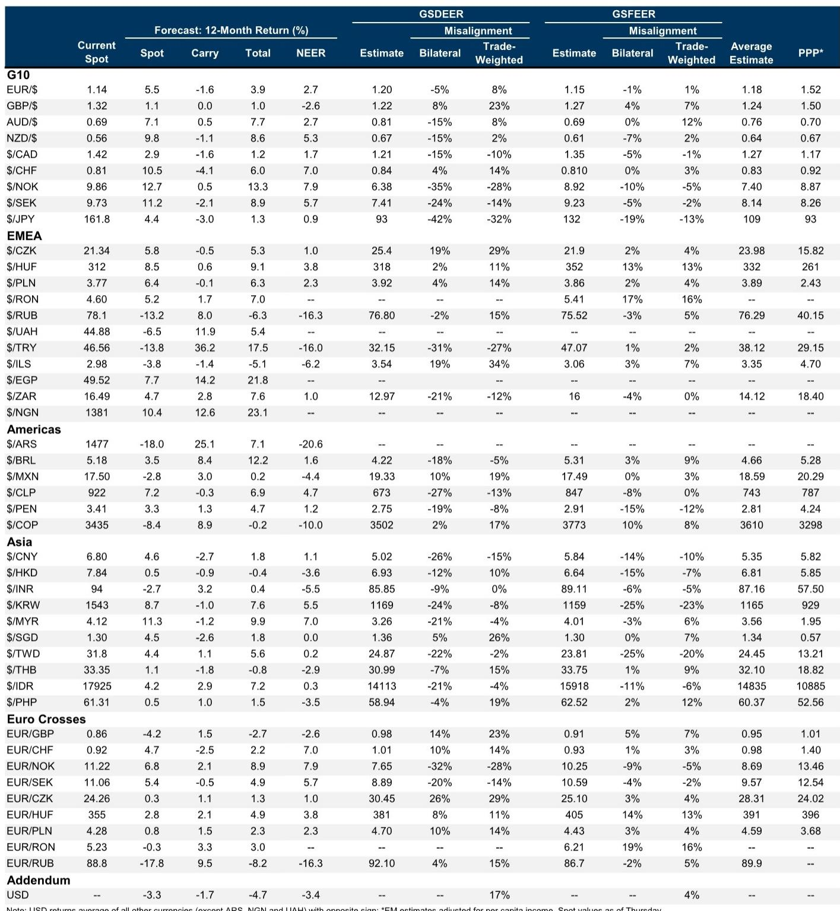
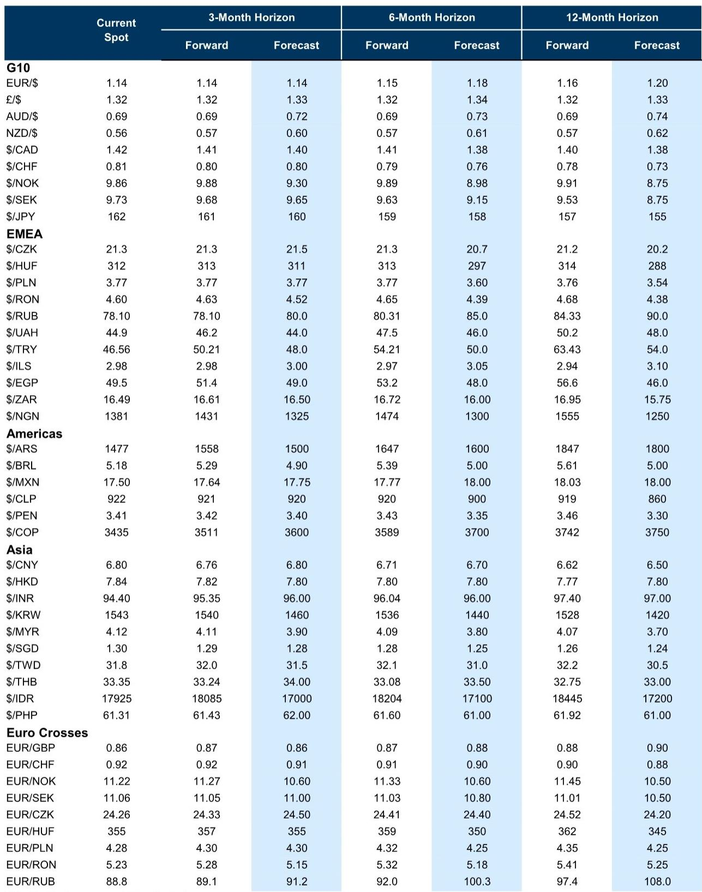

# The Dollar’s Resilience Is Not About Oil: Why Rate Differentials and AI Capex Are Rewriting the FX Playbook

The most important question in currency markets today is not whether the Dollar will weaken, but what it would take for it to do so. After the hawkish shift in the June FOMC decision, the Dollar has broken out of its multi-month range, and many observers have been surprised that the currency strengthened even as oil prices declined. This surprise reflects a misunderstanding of what is actually driving the Dollar. The relationship between rate differentials and exchange rates is far more consistent and significant than the link between commodity prices and currency direction. The Dollar is stronger because the market is repricing the path of US rates, not because of any shift in energy markets. The near-term risks remain skewed to the upside, but the medium-term outlook is more balanced, and the path to Dollar weakness runs through three distinct channels: a reversal of rate hike expectations, a return of institutional credibility concerns, or a slowdown in US exceptionalism.

Yet the most provocative scenario—and the one that could sustain Dollar strength for longer than many anticipate—involves the intersection of AI-driven capital expenditures and Federal Reserve policy. If Fed officials conclude that policy is not sufficiently restrictive in light of strong AI-related investment, the Dollar could strengthen further, particularly against currencies in economies that import tighter financial conditions without the compensating demand for AI-related capital spending. This is not the baseline view, but it is increasingly plausible, and it demands that investors rethink how they position across both developed and emerging market currencies.

## Rate Differentials, Not Oil, Are the Primary Driver of Dollar Direction, and the Fed’s Hawkish Shift Has Changed the Game

The Dollar’s recent strength has confounded those who expected lower oil prices to weigh on the currency. This confusion arises from a misdiagnosis of the causal mechanism. Rate differentials have a more consistent and statistically significant relationship with exchange rates than commodity prices do, and the hawkish reaction to the June FOMC meeting has widened those differentials in the Dollar’s favor.

The key insight is that the probability of rate hikes can move up quickly but come out only slowly. This asymmetry means that the market is likely to price in more tightening than will ultimately materialize, creating a tailwind for the Dollar in the near term. Investors who are positioned for Dollar weakness based on a softening commodity complex are missing the more powerful force at work: the repricing of the entire US rate path. The Dollar is not ignoring oil; it is responding to a more fundamental signal.

## The Three Routes to Dollar Weakness Are All Still Open, But the Fourth Route to Dollar Strength Is Gaining Credibility

Over the medium term, the risks to the Dollar are more balanced, and three distinct pathways to weakness remain plausible. First, the shift in relative policy pricing has now been sufficiently large that if the market begins to price out rate hikes in line with what economists expect, the currency would weaken enough to return to its previous multi-month range. Second, if institutional credibility concerns were to resurface—particularly through a perceived overly dovish reaction function from the Fed—that would again weigh on the Dollar. Third, as the positive economic impulses from earlier this year fade, growth is expected to slow in the second half, reducing the exceptional performance that has supported the Dollar.

But these pathways to weakness must now be weighed against a growing upside case. If Fed officials determine that policy is not sufficiently restrictive, particularly in light of strong AI-related capital expenditures, the Dollar could strengthen further. The mechanism is straightforward: higher US rates attract capital, and the demand for Dollar-denominated assets increases. The more interesting second-order effect is on other economies. Countries in Europe and elsewhere would import tighter financial conditions from the Fed without the commensurate demand for AI-related investment. This asymmetry could create a persistent Dollar bid that is not captured by traditional rate-differential models. Economic developments over the last few months and policymaker communications over the last few weeks make this outcome increasingly likely, even if it is not the baseline.

## The Low-Yielding EM Currencies Are Being Crushed by the Bear-Flattening in US Rates, But Not All Low-Yielders Are Created Equal

The underperformance of the Thai Baht, Israeli Shekel, and Chilean Peso against the Dollar over the past week is not random. These are among the lowest-yielding currencies in their respective regions, and the bear-flattening in US rates induced by the hawkish Fed meeting has put the most pressure on precisely these currencies. This is consistent with a broader pattern: when US rates rise, the currencies that suffer most are those that offer the least carry compensation.

But the common label of "low-yielder" masks important differences. The Shekel is about 10% overvalued on a combined GSDEER and GSFEER basis, making it vulnerable to a correction. It also has one of the highest sensitivities to tech stocks, which means it is particularly exposed to the recent volatility in the tech sector. The Peso is about 15% undervalued, but it is the most exposed currency to copper prices, making it a better hedge when broader growth concerns are in focus. The Baht is roughly fair-valued and has a lower beta to equity risk, but it is likely to underperform if gold prices continue to slip.

These differences matter for constructing carry baskets. Funding high-yielding EM FX strategies with low-yielding currencies can neutralize risk exposure and augment the overall carry proposition, but the choice of funder depends on what risk the investor is trying to hedge. For those concerned about tech sector volatility, the Shekel is the most suitable funder. For those worried about broader growth, the Peso is more appropriate. And for those watching gold, the Baht is the clearest candidate. Domestic considerations also point to further weakness in the Baht and Shekel: structural economic challenges warrant lower rates in Thailand, and Israeli policymakers have shifted toward a more accommodative stance. Within EM, these two currencies screen as the most attractive funders for carry baskets.

## Sterling’s Resilience After the Political Transition Is Tactical, Not Structural, and the Real Test Comes with the Autumn Budget

Sterling has held steady following the by-election victory of Andy Burnham, and three factors explain this resilience. First, the outcome narrowed the perceived range of leadership outcomes, reducing uncertainty around the transition. Second, Burnham’s commitment to fiscal rules in mid-May had already loosened the link between political pricing and currency premium. Third, a Burnham-led government was already heavily priced in prediction markets, so the by-election result was not a surprise.

But this relief is likely to be tactical and narrow. Under the bank’s cyclical models, the fiscal and political premium in Sterling has already been fully removed, after peaking at around 2.5% in May. What has balanced out the compression in premium is a widening in EU-UK rate differentials and a risk-off dynamic that has pushed EUR/GBP higher beneath the surface. The risks of a sustained premium-driven Sterling sell-off remain low, but the fiscal challenges are not resolved. A slower fiscal consolidation under a Burnham government, driven by spending pressures and limited tax room, could test the Gilt market’s tolerance. Even with a commitment to fiscal rules, a front-loaded borrowing approach could move into focus ahead of the Autumn budget. The one positive tail that could emerge is a potential reset to closer trade ties with the EU, which could partially reverse Brexit’s long-term impact on the currency and help offset the challenging structural valuation picture.

## The Ringgit’s Rebound Is Real, But the Political Risk Premium Has Not Fully Disappeared

The Malaysian Ringgit underperformed regional peers early in June before rebounding. The initial weakness was driven less by macro fundamentals than by a rise in domestic political risk premium, following the dissolution of state assemblies and remarks about a possible snap election. The upcoming state elections in Johor and Negeri Sembilan do not directly change the federal government, but they can have political repercussions on coalition unity depending on the results.

Unless a snap election is called, the underlying macro fundamentals support further Ringgit strength. Real GDP is expected to grow at a solid pace in 2026, the current account surplus is well above its five-year average, and high-frequency export data looks favorable. More importantly, Malaysia is now benefiting from the rollout of data center-related services. Before 2025, information, communication, and technology services were a structural drag on the current account; since the second half of 2025, they have turned positive. As more data centers come online, services exports should become a growing pillar of current account support. The case for being long the Ringgit against the Singapore Dollar remains intact, particularly given that the SGD is trading above the midpoint of its NEER band.

## The Report Raises a Critical Question That It Does Not Fully Answer: How Durable Is the AI-Driven Dollar Support?

The analysis of AI and the Dollar is one of the most provocative sections of the report, but it also leaves a critical question unresolved. The report identifies three reasons why the Dollar has appeared slightly weaker than expected given the scale of US equity outperformance: US equity outperformance is less pronounced versus EMs than DMs, durability matters more than sharp near-term upgrades, and narrow equity market breadth limits FX spillovers.

But the report does not fully answer how durable the AI-driven support for the Dollar will be. The data shows that sharp upgrades to near-term US earnings expectations do not generate as much Dollar demand as more sustained earnings power would. This suggests that the current tech sector strength may overstate the extent of US outperformance and demand for Dollar assets. However, if AI-related capital expenditures continue to drive sustained earnings growth, the Dollar support could persist. The question that remains open is whether the AI investment cycle is sufficiently broad and long-lasting to generate the kind of sustained earnings power that would translate into persistent Dollar demand. The report has shifted the equity impulse from an expected drag to a source of support for the Dollar, but it has not yet determined whether this support is structural or cyclical.

## A Decision Framework for Positioning in an AI-Driven Dollar Regime

For investors trying to navigate this environment, a decision framework is essential. The first question to ask is whether you believe the Fed will ultimately need to hike further. If the answer is yes, the Dollar should be bought on dips, and the most attractive funding currencies are the low-yielders in EM and the Japanese Yen. If the answer is no, the medium-term case for Dollar weakness remains intact, and the best opportunities are in high-yielding EM currencies that have been oversold.

The second question is about the durability of AI-driven earnings. If you believe the AI investment cycle is broad and sustained, the Dollar support is structural, and you should favor currencies with high exposure to US demand and tech sector linkages. If you believe the AI cycle is narrower and more cyclical, the Dollar support will fade, and the best trades are in currencies with strong domestic fundamentals, such as the Malaysian Ringgit.

The third question is about political risk. In the UK, the tactical relief in Sterling should be used to reduce exposure ahead of the Autumn budget. In EM, the distinction between low-yielders that are overvalued and those that are undervalued matters for constructing carry baskets. The Shekel and Baht screen as more attractive funders, but for different reasons, and the choice depends on which risk the investor is trying to hedge.

The report’s forecasts provide a useful reference point, but they are conditional on a baseline that is increasingly being challenged by the AI-driven upside case for the Dollar. The most important insight from this analysis is that the Dollar’s resilience is not an anomaly to be explained away by oil prices or temporary factors. It is a reflection of a deeper shift in the relationship between US monetary policy, AI investment, and global capital flows. Understanding that shift is the key to positioning for the next phase of the FX market.

Join the community to read the full report and review the original charts.

*This article is for learning and discussion only and does not constitute investment advice.*

Personal reading notes and learning share only. Not investment advice.

