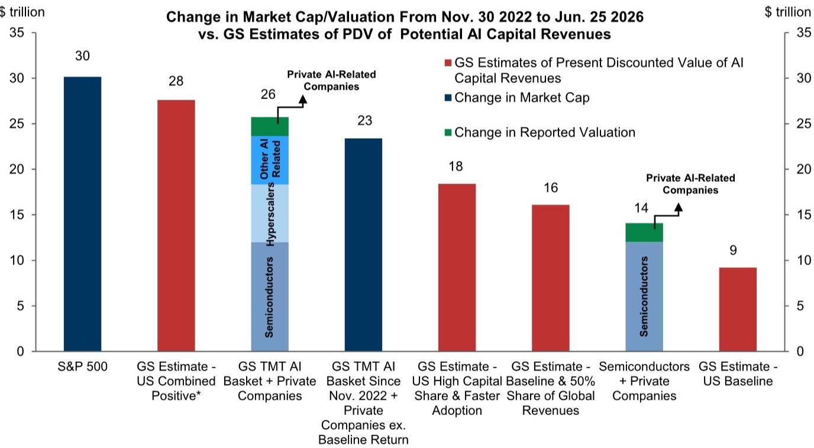
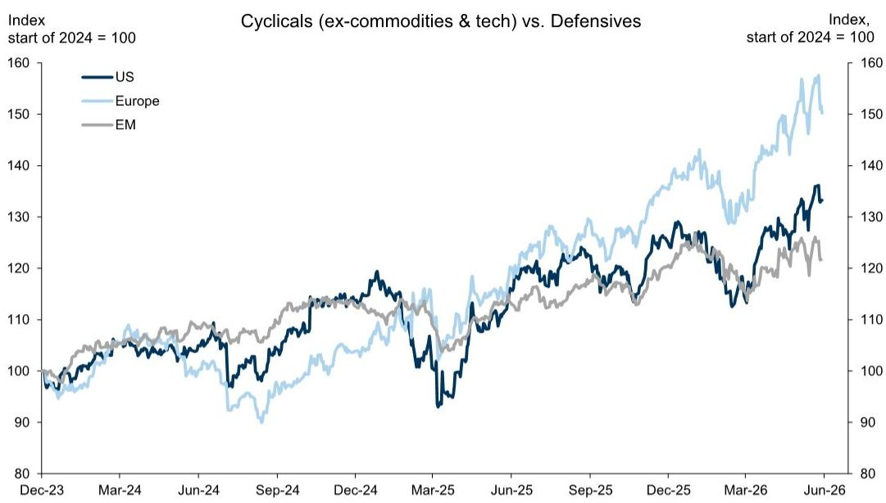
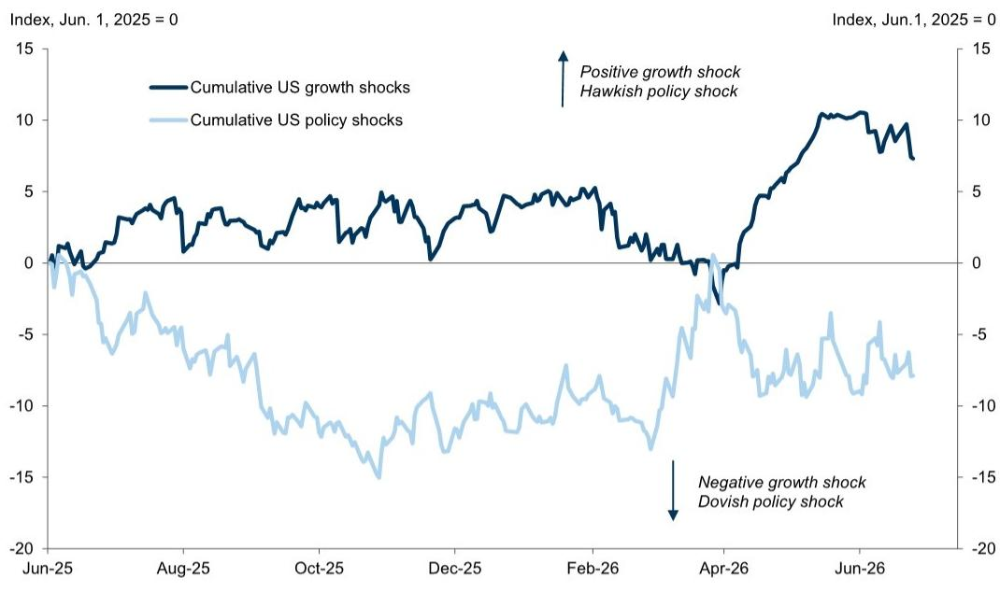

# The Macro Risk Has Collapsed. The Real Battle Is Now Inside the Market.

The most important shift in global markets over the past month is not the Fed's hawkish language, the resilience of US payrolls, or the continued rally in AI stocks. It is the quiet, decisive removal of the single largest source of macro uncertainty that had dominated portfolio construction since early 2026. The US-Iran agreement and the resumption of energy transit through the Strait of Hormuz have effectively capped the adverse tail of oil prices, reducing the probability of a stagflationary scenario that had haunted risk assets for quarters. This is not merely a cyclical improvement. It is a structural change in the macro environment that forces investors to rethink where returns will come from next.

The market's reaction has been telling. Equities have largely held their ground, oil prices have drifted lower, and the implied correlation across stocks has fallen to fresh lows. But beneath this calm surface, something more consequential is happening. The macro volatility that once dominated headlines and drove asset allocation is being replaced by a much more granular, stock-specific, and sector-specific volatility. The debate is no longer about whether the economy will tip into recession or whether inflation will spiral. It is about which companies will win and lose in the AI investment cycle, how persistent earnings will be, and whether the market's current pricing of growth can withstand the scrutiny of actual results.

This shift from macro to micro volatility is the defining feature of the current regime. It demands a fundamentally different approach to portfolio construction. The easy macro trades—long cyclical equities, short defensives, carry in EM FX—have largely played out. The next leg of returns will come from navigating the dispersion within markets, not from betting on the direction of the economy. For investors who continue to rely on macro narratives to drive allocation, the risk is not that they are wrong about the economy. It is that they are looking in the wrong place entirely.

## The Removal of the Oil Tail Has Narrowed the Macro Outcome Space More Than Markets Acknowledge

The Iran War created an extreme tail risk that distorted asset pricing across the board. Oil prices spiked, breakeven inflation rose, and the Fed was forced into a more aggressive posture. But as the report makes clear, markets had already begun to look through this shock well before the deal was formalized. Equities, particularly long-duration assets, had moved past pre-war levels. The agreement simply accelerated a process that was already underway.

The consequence is a dramatic narrowing of the macro distribution. The probability of a deeply adverse outcome involving high inflation and low growth has fallen sharply. Oil prices, while still above pre-war levels, are now exploring the downside tail where production rebounds quickly and a short-term glut emerges before inventory restocking demand recovers. This is a positive development for oil importers, for real incomes, and for central banks. But it also means that the macro catalyst that drove much of the recent rally is fading. The easy gains from a reduction in macro uncertainty have been captured.

The critical question is whether the market has fully priced this new reality. The evidence suggests it has, at least in aggregate. Growth pricing is already robust. Cyclical equities have outperformed defensives by a wide margin. The market is discounting a friendly cyclical backdrop. The risk, therefore, is not that the macro environment deteriorates unexpectedly. It is that the macro environment delivers exactly what is expected, and the market has no room for error. The tension between a positive fundamental backdrop and high valuations is now the central challenge.

## The Fed's Hawkish Shift Is a Distraction. The Real Story Is That Rates Are Trapped.

The June FOMC meeting produced a clear hawkish repricing. Markets have pulled forward rate hike expectations, the yield curve has flattened, and the dollar has strengthened. But this should not be mistaken for a regime change in monetary policy. The Fed's shift is better understood as a tactical move to buttress credibility after a period of high inflation and uncertainty. It is not a signal that the central bank intends to materially slow the economy.

The evidence for this view is compelling. Ten-year breakeven inflation has fallen to levels not seen in over a year. The yield curve is flattening, not steepening. These are not the hallmarks of a market that expects sustained tightening. They are the hallmarks of a market that expects a brief, contained adjustment. The report's observation that the Fed funds rate has been in a 3.5-4.5% range for over 18 months and is expected to stay there for at least another year underscores the point. Rates are trapped in a narrow band.

The implication for investors is straightforward. The Fed's hawkish language will create local volatility, particularly in rate-sensitive assets and currencies. But it is unlikely to derail the broader cyclical picture. If anything, the combination of lower oil prices and a hawkish Fed that does not actually deliver sustained tightening creates the conditions for a "Goldilocks" backdrop later in the year. The risk is that the market overreacts to near-term data, pushing rate hike pricing too far and creating opportunities to receive rates. The report's bias to look through the current noise for opportunities to receive rates if pricing rises further is the correct strategic stance.

## AI Is the Epicenter of Micro Volatility, and the Valuation Debate Is Only Beginning

The AI complex is the clearest example of the shift from macro to micro volatility. The macro backdrop for AI is exceptionally friendly. Profits are robust, investment is booming, and the imbalances that ended the 1990s cycle are not yet visible. But the market's pricing of AI-related equities has become increasingly detached from the underlying economics.

The report highlights a critical tension. To justify the value added in AI-related names since late 2022, one must assume increasingly optimistic outcomes for the macro benefits of AI to corporate earnings. These assumptions are not implausible, but they are aggressive. The growing risk is that the market is overestimating the persistence of above-average earnings, particularly those generated by the investment boom itself. The investment boom creates a self-reinforcing cycle: high capex drives near-term earnings for AI-related companies, which in turn justifies further investment. But this cycle is not infinite. At some point, the returns on that investment must materialize in the form of higher productivity and revenue growth for the broader economy.

The market is currently pricing a scenario where the investment boom continues indefinitely and the returns are realized quickly. Any challenge to that narrative—a disappointing earnings report, a shift in capex plans, a regulatory development—will trigger sharp moves in AI-related stocks. The recent volatility in the semiconductor space is a preview of what is to come. The report's conclusion that equity volatility is likely to rise further is correct, and AI will be the primary source of that volatility.

For investors, the challenge is to remain invested in the AI theme while protecting against downside tail risks. The report's suggestion to use options or outright long volatility positions is sensible. But the deeper question is whether the market is underestimating the scope for much lower interest rates beyond the peak of the capex boom. If the investment cycle peaks and rates fall, the mix of lower rates and lower equity prices could create a regime that is very different from the current one. This is a second-order implication that deserves more attention.

## The Dollar's Strength Is Real but Divided, and That Creates Opportunities in EM

The dollar has strengthened on the back of the Fed's hawkish shift and the continued outperformance of US equity markets. But the strength is less than one might expect given the magnitude of the repricing. The report's characterization of the dollar as "divided" is apt. The dollar is strong against low-yielding currencies like the euro and yen, but its gains are more limited against emerging market currencies.

This division reflects several factors. Currency management considerations in Asia, including intervention in the yen and managed appreciation of the renminbi, limit the size of dollar moves. US equity outperformance is less pronounced against EM than against DM, which limits currency spillovers. And while a hawkish rate repricing can create indigestion for carry trades, EM currencies and carry strategies can continue to deliver positive total returns as long as risk appetite remains supported.

The implication is that the dollar's strength is not a barrier to EM performance. In fact, the combination of lower oil prices, a resilient cyclical backdrop, and a divided dollar creates a favorable environment for EM assets. The report's observation that more oil relief should come with broadening gains in EM equities is important. Oil-importing laggards like India, Turkey, and Egypt have room to recover. But this is a broadening, not a rotation. AI-heavy North Asian markets remain in the lead on the back of exceptional earnings delivery.

The key for EM investors is to be selective. The report's differentiation between EM fixed income markets is instructive. Hungarian forint and Colombian peso rates have room to move lower. Brazilian real and South African rand rates also look attractive after the recent sell-off. But Mexican peso front-end rates are vulnerable given expensive valuations and high sensitivity to US terminal rate pricing. The opportunity in EM is real, but it requires granular analysis, not a blanket allocation.

## The Report Leaves a Critical Question Unanswered: What Happens When the Investment Boom Peaks?

The report provides a comprehensive framework for understanding the current market environment, but it leaves one question conspicuously open. The AI investment boom is the engine driving near-term earnings and market returns. But investment booms are cyclical. They peak. They reverse. The report acknowledges that the market may be underestimating the scope for much lower interest rates beyond the peak of the capex boom, but it does not explore the full implications of a peak in the investment cycle.

A peak in AI-related capex would have profound effects. Near-term earnings for AI-related companies would slow. The valuation premium that the market currently assigns to these companies would come under pressure. The dollar would likely weaken as capital flows to US equity markets moderate. And the Fed would face a very different set of trade-offs, potentially needing to cut rates to support growth in a post-investment-boom environment.

The report's framework suggests that the current regime of low macro volatility and high micro volatility can persist as long as the investment boom looks secure. But the moment the boom shows signs of peaking, the regime shifts. Macro volatility re-emerges, but this time from the demand side rather than the supply side. The risks become deflationary, not inflationary. The assets that benefit are very different from those that have led the market over the past year.

This is the question that the report does not fully answer, and it is the question that should be at the top of every investor's mind. How do you position for a world where the investment boom peaks? The answer is not obvious, and it requires a level of analysis that goes beyond the current report. It is the reason why the full report and its original charts are worth reviewing in detail.

## A Decision Framework for the Macro-to-Micro Regime

For investors navigating this environment, a decision framework is essential. The following steps can help translate the report's insights into actionable portfolio construction.

First, assess your exposure to macro risk. The removal of the oil tail means that macro hedges, particularly long-duration bonds and gold, are less necessary than they were six months ago. The report suggests that duration is becoming a better hedge for equity risk than it has been, but this is a tactical observation, not a strategic call. Investors should reduce explicit macro hedging and shift toward more granular risk management.

Second, evaluate your AI exposure through the lens of valuation and earnings persistence. The market is pricing optimistic assumptions. The question is whether your portfolio can withstand a challenge to those assumptions. The report's suggestion to use options or long volatility positions to protect downside tail is sound. But the more important step is to ensure that your AI exposure is not concentrated in names that are most vulnerable to a reassessment of the investment cycle.

Third, look for broadening opportunities in EM and other oil-sensitive markets. The combination of lower oil prices, a resilient cyclical backdrop, and a divided dollar creates a favorable environment for EM assets. But the opportunity is selective. Focus on markets where rates have room to move lower and where currency management provides a buffer against dollar strength. Avoid markets where valuations are stretched and sensitivity to US rates is high.

Fourth, prepare for the possibility that the investment boom peaks sooner than expected. This is the tail risk that the current market environment does not fully price. If the investment boom peaks, the regime shifts from micro volatility back to macro volatility, but this time the risks are deflationary. The assets that benefit—long-duration bonds, defensive equities, the yen—are very different from the assets that have led the market. A small allocation to these assets as a hedge against a peak in the investment cycle is a prudent addition to any portfolio.

Join the community to read the full report and review the original charts.

*This article is for learning and discussion only and does not constitute investment advice.*

Personal reading notes and learning share only. Not investment advice.

