CENTRAL BANK POLICY TRACKER

June 2026

■ Recent policy changes: Central bank actions have shifted more hawkish due to the war in Iran. In DMs, no central banks lowered and 39% raised rates over the last three months. In EMs, 16% cut rates and 7% raised rates over the same period. But our Global Financial Conditions Index (GS FCI) has eased by 24bp over the last three months, reflecting 34bp of easing in DMs and 10bp of easing in EMs (largely reflecting higher rates). At the country level, financial conditions have eased the most in Türkiye (-117bps), South Korea (-93bps), and Romania (-83bps) and tightened the most in Russia (158bps), Israel (57bps), and Brazil (57bps).

Forecast updates: We have made several policy rate forecast revisions over the last 30 days. In the US, we pushed back the final two rate cuts in our Fed forecast back to June and December of 2027 (vs. December 2026 and March 2027 previously). In Brazil, we raised our end-2026 policy rate forecasts by +75bp to 14.0%, in Hungary we lowered our end-2026 policy rate forecasts by -50bp to 5.25%, and in Taiwan we removed further rate cuts and now forecast a hold at 2% (vs 2.25% previously) through end-2026. In South Korea we raised our end-2027 policy rate forecasts by +25bp to 3.25%.

■ Current forecasts: We forecast that global central banks will lower rates by 0.1pp to $3.1\%$ (on a GDP-weighted basis) over the next four quarters. We expect that DM central banks will increase policy rates by 8bp on average over the next four quarters, reflecting rate hikes in New Zealand (+50bps), Euro Area (+25bps), Sweden (+25bps), Norway (+25bps) and Japan (+25bps) that are partially offset by holds or decreases elsewhere, particularly the US (-25bps through June 2027; -50bp through end-2027) and the UK (-50bps through June 2027; -75bp through end-2027). We expect that EM central banks will cut rates by -33bp on average, reflecting -208bp of cuts in CEEMEA and -35bp in Latin America, with 4bp of hikes in Asia.

■ Forecasts relative to consensus and current pricing: Our end-2026 policy rate forecasts are dovish relative to market pricing (our forecasts are below pricing in 73% of DMs and 57% of EMs; above in 18% of DMs and 43% of EMs). Our forecasts are balanced relative to consensus in both DMs (at least 0.1pp below in 27% vs. at least 0.1pp above in 27%) and EMs (at least 0.1pp below in 32% vs. at least 0.1pp above in 36%).

■ Balance sheet policy: Balance sheets as a share of GDP remain particularly

Jan Hatzius
+1(212)902-0394 | jan.hatzius@gs.com
GS & Co. LLC

Joseph Briggs +1(212)902-2163 | joseph.briggs@gs.com GS & Co. LLC

Sarah Dong
+1(212)357-9741 | sarah.dong@gs.com
GS & Co. LLC

Megan Peters  
+44(20)7051-2058 |  
megan.l.peters@gs.com  
GS International

elevated relative to their 2019 levels in New Zealand (8pp higher) and Australia (4pp). In the US, we see scope for a modest reduction in the Fed's balance sheet size if a reduction in reserve demand warrants an adjustment, but think the bar to a meaningful decline is high.

Exhibit 1: Global Central Banks Have Mostly Either Held or Hiked Over the Last Three Months  
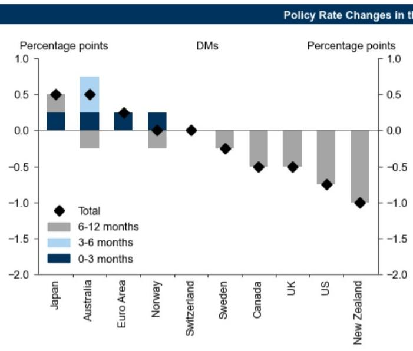  
Source: GS Global Investment Research

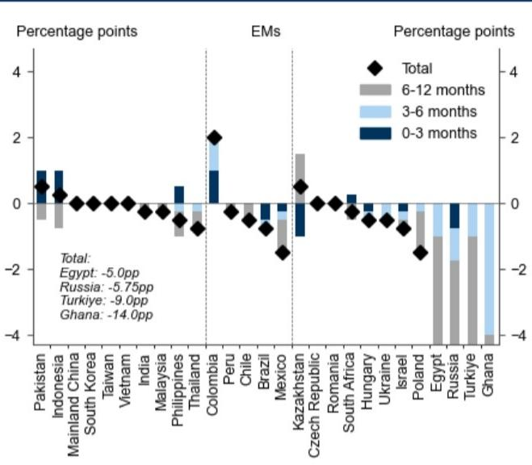

Exhibit 2: We Forecast Further Policy Rate Declines in the UK, US, and Some EMs, but Rate Hikes or Holds in Most DMs Over the Next Four Quarters  
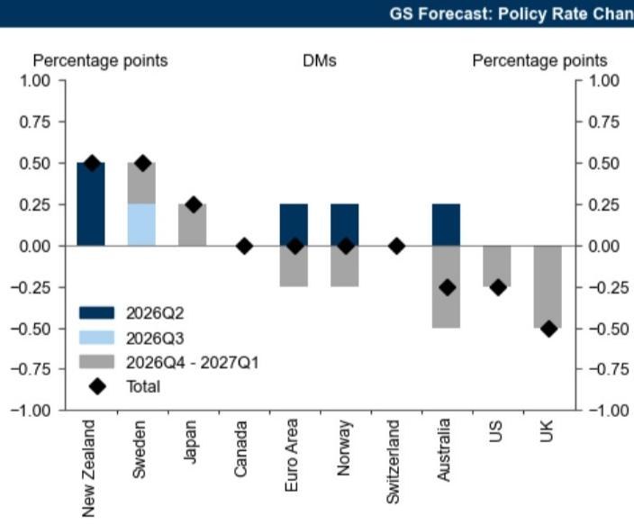  
Source: GS Global Investment Research

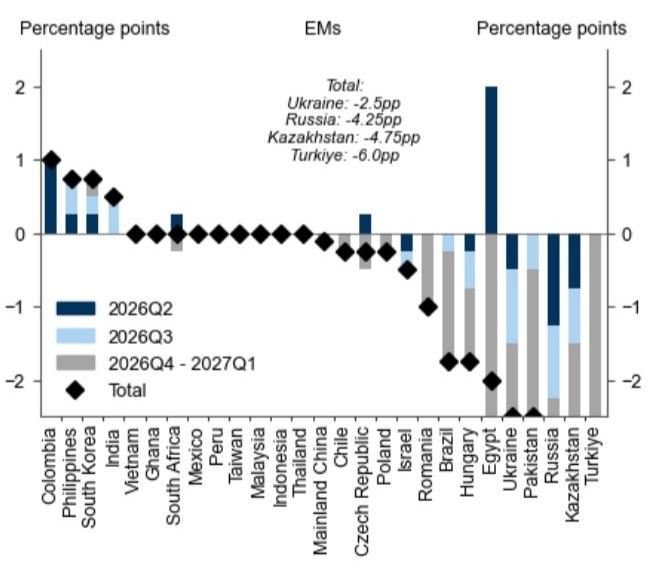

Exhibit 3: Our End-2026 Policy Rate Forecasts Are Dovish Relative to Market Pricing but Skewed Hawkish Relative to Consensus

<table><tr><td rowspan="4"></td><td colspan="6">End-2026 Policy Rate</td></tr><tr><td colspan="4">Policy Rate Forecasts</td><td colspan="2">vs. GS Forecast</td></tr><tr><td>Latest</td><td>GS</td><td>Consensus</td><td>Market Pricing</td><td>GS - Consensus</td><td>GS - Market Pricing</td></tr><tr><td colspan="4">(%)</td><td colspan="2">(pp)</td></tr><tr><td>Global*</td><td>4.6</td><td>4.7</td><td>4.6</td><td>4.5</td><td>0.0</td><td>0.2</td></tr><tr><td colspan="7">Developed Economies</td></tr><tr><td>US</td><td>3.6</td><td>3.6</td><td>3.1</td><td>4.0</td><td>0.5</td><td>-0.3</td></tr><tr><td>Euro Area</td><td>2.3</td><td>2.5</td><td>2.5</td><td>2.5</td><td>0.0</td><td>0.0</td></tr><tr><td>Japan</td><td>1.0</td><td>1.0</td><td>1.3</td><td>1.2</td><td>-0.3</td><td>-0.2</td></tr><tr><td>UK</td><td>3.8</td><td>3.8</td><td>3.9</td><td>4.0</td><td>-0.1</td><td>-0.2</td></tr><tr><td>Canada</td><td>2.3</td><td>2.3</td><td>2.3</td><td>2.4</td><td>0.0</td><td>-0.2</td></tr><tr><td>Australia</td><td>4.4</td><td>4.6</td><td>4.4</td><td>4.5</td><td>0.2</td><td>0.1</td></tr><tr><td>Switzerland</td><td>0.0</td><td>0.0</td><td>0.0</td><td>0.0</td><td>0.0</td><td>0.0</td></tr><tr><td>Sweden</td><td>1.8</td><td>2.0</td><td>1.9</td><td>1.9</td><td>0.1</td><td>0.1</td></tr><tr><td>Hong Kong</td><td>2.8</td><td>2.1</td><td>NA</td><td>NA</td><td>NA</td><td>NA</td></tr><tr><td>New Zealand</td><td>2.3</td><td>2.8</td><td>2.6</td><td>2.8</td><td>0.2</td><td>-0.1</td></tr><tr><td colspan="7">Latam</td></tr><tr><td>Brazil</td><td>14.3</td><td>14.0</td><td>13.4</td><td>13.8</td><td>0.6</td><td>0.2</td></tr><tr><td>Mexico</td><td>6.5</td><td>6.5</td><td>6.5</td><td>6.9</td><td>0.0</td><td>-0.4</td></tr><tr><td>Colombia</td><td>11.3</td><td>12.3</td><td>11.9</td><td>11.7</td><td>0.3</td><td>0.6</td></tr><tr><td>Chile</td><td>4.5</td><td>4.5</td><td>4.7</td><td>4.4</td><td>-0.2</td><td>0.1</td></tr><tr><td>Peru</td><td>4.3</td><td>4.3</td><td>4.3</td><td>NA</td><td>-0.1</td><td>NA</td></tr><tr><td colspan="7">CEEMEA</td></tr><tr><td>Russia</td><td>14.3</td><td>12.0</td><td>13.0</td><td>NA</td><td>-0.9</td><td>NA</td></tr><tr><td>Turkiye</td><td>37.0</td><td>37.0</td><td>35.2</td><td>39.4</td><td>1.8</td><td>-2.4</td></tr><tr><td>Poland</td><td>3.8</td><td>3.8</td><td>3.8</td><td>3.8</td><td>0.0</td><td>-0.1</td></tr><tr><td>Israel</td><td>3.8</td><td>3.3</td><td>3.6</td><td>3.9</td><td>-0.3</td><td>-0.6</td></tr><tr><td>Egypt</td><td>19.0</td><td>21.0</td><td>NA</td><td>NA</td><td>NA</td><td>NA</td></tr><tr><td>South Africa</td><td>7.0</td><td>7.3</td><td>7.0</td><td>7.3</td><td>0.3</td><td>0.0</td></tr><tr><td>Romania</td><td>6.5</td><td>6.5</td><td>6.3</td><td>NA</td><td>0.2</td><td>NA</td></tr><tr><td>Czech Republic</td><td>3.5</td><td>3.8</td><td>3.6</td><td>4.0</td><td>0.1</td><td>-0.3</td></tr><tr><td>Hungary</td><td>6.0</td><td>5.3</td><td>5.9</td><td>5.0</td><td>-0.7</td><td>0.2</td></tr><tr><td>Ukraine</td><td>15.0</td><td>13.5</td><td>14.2</td><td>NA</td><td>-0.7</td><td>NA</td></tr><tr><td>Ghana</td><td>14.0</td><td>14.0</td><td>13.2</td><td>NA</td><td>0.8</td><td>NA</td></tr><tr><td>Kazakhstan</td><td>17.0</td><td>15.5</td><td>16.2</td><td>NA</td><td>-0.7</td><td>NA</td></tr><tr><td colspan="7">Asia</td></tr><tr><td>Mainland China</td><td>1.4</td><td>1.4</td><td>NA</td><td>NA</td><td>NA</td><td>NA</td></tr><tr><td>India</td><td>5.3</td><td>5.8</td><td>5.5</td><td>5.6</td><td>0.2</td><td>0.1</td></tr><tr><td>South Korea</td><td>2.5</td><td>3.0</td><td>3.0</td><td>3.7</td><td>0.0</td><td>-0.7</td></tr><tr><td>Indonesia</td><td>5.8</td><td>5.8</td><td>5.6</td><td>NA</td><td>0.1</td><td>NA</td></tr><tr><td>Taiwan</td><td>2.0</td><td>2.0</td><td>2.1</td><td>1.9</td><td>-0.1</td><td>0.1</td></tr><tr><td>Thailand</td><td>1.0</td><td>1.0</td><td>1.1</td><td>1.0</td><td>-0.1</td><td>0.0</td></tr><tr><td>Philippines</td><td>4.8</td><td>5.5</td><td>5.1</td><td>NA</td><td>0.4</td><td>NA</td></tr><tr><td>Vietnam</td><td>4.5</td><td>4.5</td><td>4.9</td><td>NA</td><td>-0.4</td><td>NA</td></tr><tr><td>Malaysia</td><td>2.8</td><td>2.8</td><td>2.8</td><td>2.8</td><td>-0.1</td><td>0.0</td></tr></table>

Note: Red shading indicates GS forecast above consensus forecast or market pricing, and blue shading indicates GS forecast below consensus forecast or market pricing.  
\* Global policy rate forecasts represent a GDP-weighted average of the economies with both consensus forecasts and market pricing available.

## Changes in Policy Rates and Financial Conditions

Exhibit 4: Recent Policy Rate Changes  
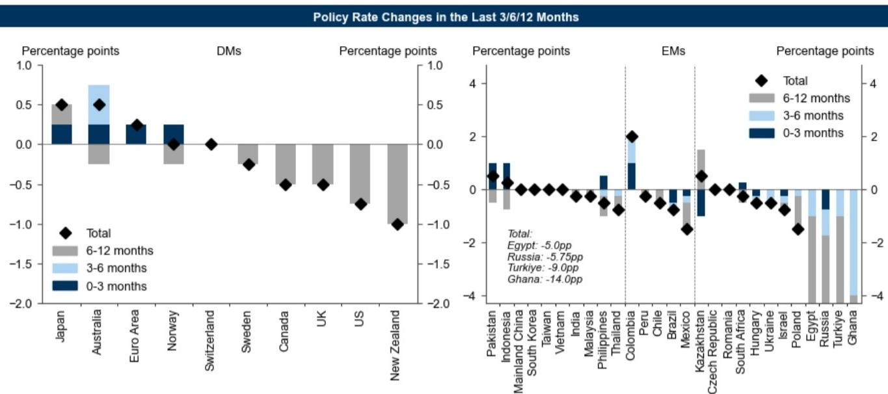  
Source: Haver Analytics, GS Global Investment Research

Exhibit 5: Change in Average Global Policy Rate Over Time  
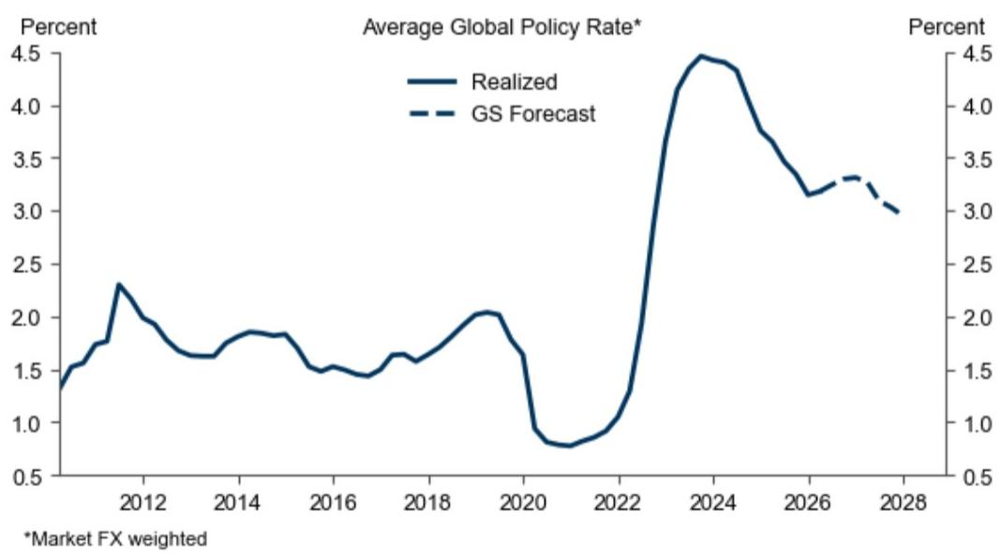  
Source: GS Global Investment Research

Exhibit 6: Changes in Financial Conditions Over the Last 3 Months  
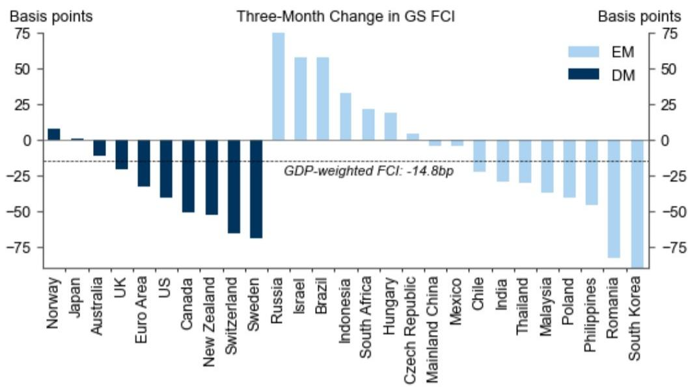  
Source: GS Global Investment Research

Exhibit 7: Changes in Financial Conditions Over the Last 12 Months  
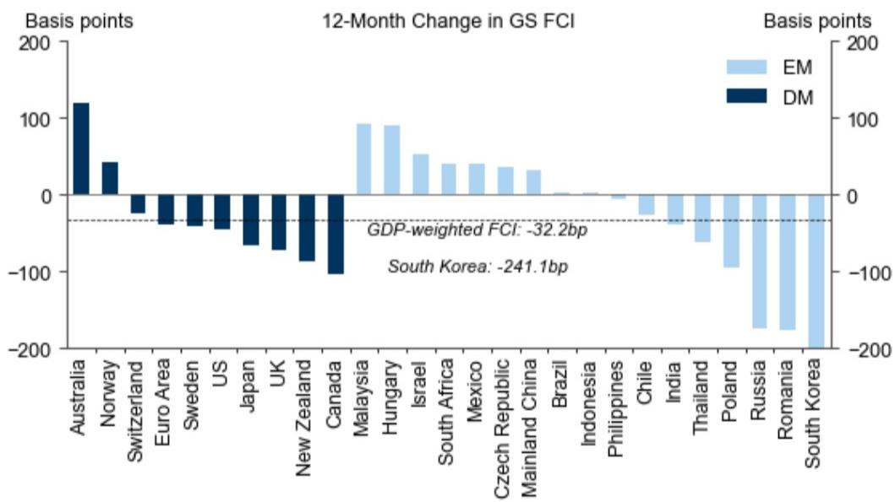  
Source: GS Global Investment Research

## Policy Rate Forecasts

Exhibit 8: Policy Rate Forecast Revisions in Last 30 Days  
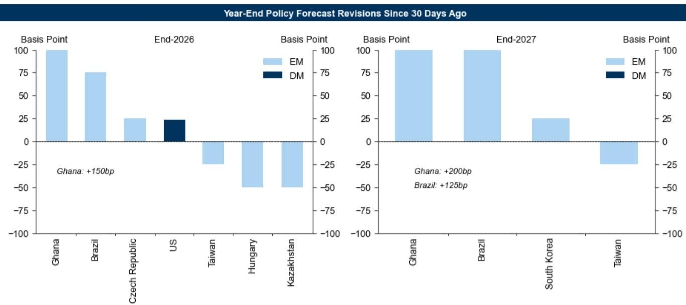  
Source: GS Global Investment Research

Exhibit 9: GS Forecast Policy Rate Changes  
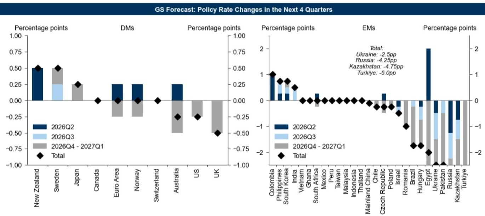  
Source: GS Global Investment Research

## Exhibit 11: GS Policy Rate Forecasts vs. Bloomberg Consensus Forecasts and Market Pricing

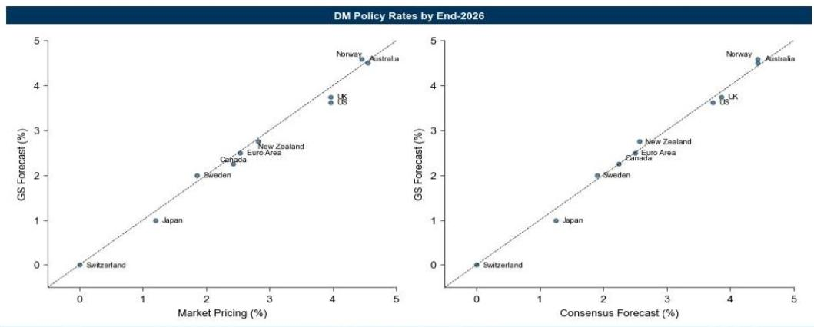

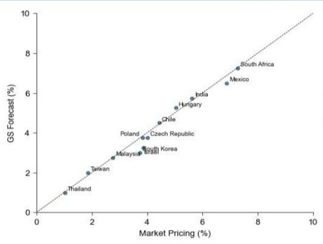

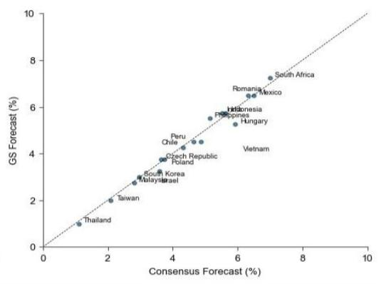

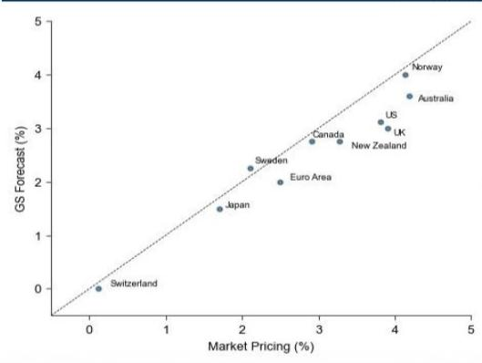

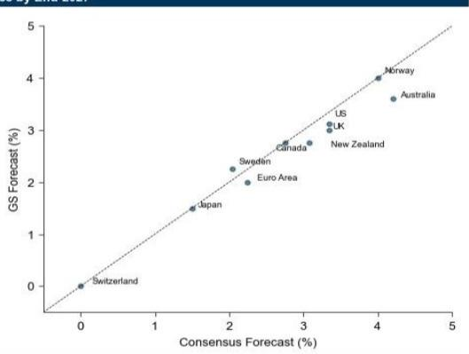

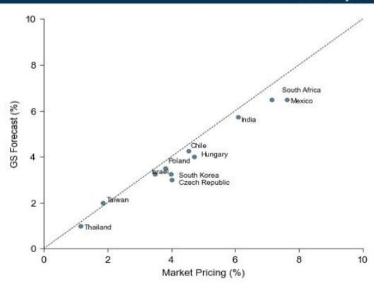

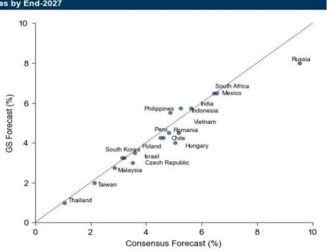  
We exclude economies where GS forecasts differ from market pricing and consensus by more than 3pp due to data quality concerns, as well as economies where policy rate forecasts exceed $10\%$ for easier exposition.  
Source: GS Global Investment Research, Bloomberg

Exhibit 12: GS Policy Rate Forecasts vs. Bloomberg Consensus Forecasts and Market Pricing

<table><tr><td rowspan="4"></td><td colspan="7">Year-End Policy Rate, Percent</td></tr><tr><td rowspan="3">Latest</td><td colspan="3">End-2026</td><td colspan="3">End-2027</td></tr><tr><td colspan="3">Policy Rate Forecasts</td><td colspan="3">Policy Rate Forecasts</td></tr><tr><td>GS</td><td>Consensus</td><td>Market Pricing</td><td>GS</td><td>Consensus</td><td>Market Pricing</td></tr><tr><td>Global*</td><td>4.6</td><td>4.7</td><td>4.6</td><td>4.5</td><td>4.0</td><td>4.1</td><td>4.5</td></tr><tr><td colspan="8">Developed Economies</td></tr><tr><td>US</td><td>3.6</td><td>3.6</td><td>3.7</td><td>4.0</td><td>3.1</td><td>3.4</td><td>3.8</td></tr><tr><td>Euro Area</td><td>2.3</td><td>2.5</td><td>2.5</td><td>2.5</td><td>2.0</td><td>2.3</td><td>2.5</td></tr><tr><td>Japan</td><td>1.0</td><td>1.0</td><td>1.3</td><td>1.2</td><td>1.5</td><td>1.5</td><td>1.7</td></tr><tr><td>UK</td><td>3.8</td><td>3.8</td><td>3.9</td><td>4.0</td><td>3.0</td><td>3.3</td><td>3.9</td></tr><tr><td>Canada</td><td>2.3</td><td>2.3</td><td>2.3</td><td>2.4</td><td>2.8</td><td>2.8</td><td>2.9</td></tr><tr><td>Australia</td><td>4.4</td><td>4.6</td><td>4.4</td><td>4.5</td><td>3.6</td><td>4.2</td><td>4.2</td></tr><tr><td>Switzerland</td><td>0.0</td><td>0.0</td><td>0.0</td><td>0.0</td><td>0.0</td><td>0.0</td><td>0.1</td></tr><tr><td>Sweden</td><td>1.8</td><td>2.0</td><td>1.9</td><td>1.9</td><td>2.3</td><td>2.0</td><td>2.1</td></tr><tr><td>Hong Kong</td><td>2.8</td><td>2.1</td><td>NA</td><td>NA</td><td>1.9</td><td>NA</td><td>NA</td></tr><tr><td>New Zealand</td><td>2.3</td><td>2.8</td><td>2.6</td><td>2.8</td><td>2.8</td><td>3.1</td><td>3.3</td></tr><tr><td colspan="8">Latam</td></tr><tr><td>Brazil</td><td>14.3</td><td>14.0</td><td>13.4</td><td>-0.1</td><td>12.0</td><td>11.5</td><td>0.9</td></tr><tr><td>Mexico</td><td>6.5</td><td>6.5</td><td>6.5</td><td>6.9</td><td>6.5</td><td>6.5</td><td>7.6</td></tr><tr><td>Colombia</td><td>11.3</td><td>12.3</td><td>11.9</td><td>11.7</td><td>11.3</td><td>10.6</td><td>10.1</td></tr><tr><td>Chile</td><td>4.5</td><td>4.5</td><td>4.7</td><td>4.4</td><td>4.3</td><td>4.6</td><td>4.5</td></tr><tr><td>Peru</td><td>4.3</td><td>4.3</td><td>4.3</td><td>NA</td><td>4.3</td><td>4.5</td><td>NA</td></tr><tr><td colspan="8">CEEMEA</td></tr><tr><td>Russia</td><td>14.3</td><td>12.0</td><td>13.0</td><td>NA</td><td>8.0</td><td>9.5</td><td>NA</td></tr><tr><td>Turkiye</td><td>37.0</td><td>37.0</td><td>35.2</td><td>39.4</td><td>29.0</td><td>26.4</td><td>NA</td></tr><tr><td>Poland</td><td>3.8</td><td>3.8</td><td>3.8</td><td>3.8</td><td>3.5</td><td>3.6</td><td>3.8</td></tr><tr><td>Israel</td><td>3.8</td><td>3.3</td><td>3.6</td><td>3.9</td><td>3.3</td><td>3.2</td><td>3.5</td></tr><tr><td>Egypt</td><td>19.0</td><td>21.0</td><td>NA</td><td>NA</td><td>14.0</td><td>NA</td><td>NA</td></tr><tr><td>South Africa</td><td>7.0</td><td>7.3</td><td>7.0</td><td>7.3</td><td>6.5</td><td>6.4</td><td>7.2</td></tr><tr><td>Romania</td><td>6.5</td><td>6.5</td><td>6.3</td><td>NA</td><td>4.5</td><td>5.2</td><td>NA</td></tr><tr><td>Czech Republic</td><td>3.5</td><td>3.8</td><td>3.6</td><td>4.0</td><td>3.0</td><td>3.5</td><td>4.0</td></tr><tr><td>Hungary</td><td>6.0</td><td>5.3</td><td>5.9</td><td>5.0</td><td>4.0</td><td>5.0</td><td>4.7</td></tr><tr><td>Ukraine</td><td>15.0</td><td>13.5</td><td>14.2</td><td>NA</td><td>11.5</td><td>12.3</td><td>NA</td></tr><tr><td>Ghana</td><td>14.0</td><td>14.0</td><td>13.2</td><td>NA</td><td>16.0</td><td>13.3</td><td>NA</td></tr><tr><td>Kazakhstan</td><td>17.0</td><td>15.5</td><td>16.2</td><td>NA</td><td>11.0</td><td>NA</td><td>NA</td></tr><tr><td colspan="8">Asia</td></tr><tr><td>Mainland China</td><td>1.4</td><td>1.4</td><td>NA</td><td>NA</td><td>1.3</td><td>NA</td><td>NA</td></tr><tr><td>India</td><td>5.3</td><td>5.8</td><td>5.5</td><td>5.6</td><td>5.8</td><td>5.6</td><td>6.1</td></tr><tr><td>South Korea</td><td>2.5</td><td>3.0</td><td>3.0</td><td>3.7</td><td>3.3</td><td>3.1</td><td>4.0</td></tr><tr><td>Indonesia</td><td>5.8</td><td>5.8</td><td>5.6</td><td>NA</td><td>5.8</td><td>5.2</td><td>NA</td></tr><tr><td>Taiwan</td><td>2.0</td><td>2.0</td><td>2.1</td><td>1.9</td><td>2.0</td><td>2.1</td><td>1.9</td></tr><tr><td>Thailand</td><td>1.0</td><td>1.0</td><td>1.1</td><td>1.0</td><td>1.0</td><td>1.1</td><td>1.2</td></tr><tr><td>Philippines</td><td>4.8</td><td>5.5</td><td>5.1</td><td>NA</td><td>5.5</td><td>4.9</td><td>NA</td></tr><tr><td>Vietnam</td><td>4.5</td><td>4.5</td><td>4.9</td><td>NA</td><td>4.5</td><td>4.8</td><td>NA</td></tr><tr><td>Malaysia</td><td>2.8</td><td>2.8</td><td>2.8</td><td>2.8</td><td>2.8</td><td>2.9</td><td>NA</td></tr></table>

Note: Red shading indicates consensus forecast or market pricing above GS forecast, and blue shading indicates consensus forecast or market pricing below GS forecast.  
\* Global policy rate forecasts represent a GDP-weighted average of the economies with both consensus forecasts and market pricing available.

## Policy Rate Forecast Drivers

Exhibit 13: GS Growth and Policy Rate Forecasts vs. Bloomberg Consensus Forecasts  
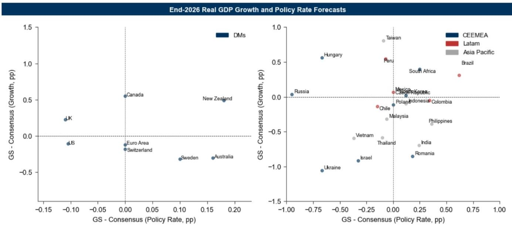  
Source: GS Global Investment Research, Bloomberg

Exhibit 14: GS GDP Growth Forecasts vs. Central Bank and Bloomberg Consensus Forecasts

<table><tr><td rowspan="3"></td><td rowspan="2">End-2025</td><td colspan="6">Real GDP Growth (Annual Average), Percent Change</td></tr><tr><td colspan="3">End-2026</td><td colspan="3">End-2027</td></tr><tr><td>Actual****</td><td>GS</td><td>GS - Central Bank</td><td>GS - Consensus</td><td>GS</td><td>GS - Central Bank</td><td>GS - Consensus</td></tr><tr><td>Global*</td><td>1.8</td><td>1.7</td><td>NA</td><td>0.0</td><td>1.9</td><td>NA</td><td>0.3</td></tr><tr><td colspan="8">Developed Economies</td></tr><tr><td>US**</td><td>2.0</td><td>2.0</td><td>-0.2</td><td>-0.1</td><td>2.2</td><td>-0.1</td><td>0.1</td></tr><tr><td>Euro Area</td><td>1.5</td><td>0.5</td><td>-0.3</td><td>-0.1</td><td>1.2</td><td>0.0</td><td>0.6</td></tr><tr><td>Japan***</td><td>0.8</td><td>0.5</td><td>-0.2</td><td>NA</td><td>1.2</td><td>0.4</td><td>NA</td></tr><tr><td>UK**</td><td>1.0</td><td>1.2</td><td>-0.1</td><td>0.2</td><td>1.6</td><td>0.0</td><td>0.6</td></tr><tr><td>Canada**</td><td>0.7</td><td>1.6</td><td>-0.2</td><td>0.6</td><td>2.0</td><td>0.6</td><td>0.9</td></tr><tr><td>Australia</td><td>2.0</td><td>1.7</td><td>0.4</td><td>-0.3</td><td>2.2</td><td>0.8</td><td>0.2</td></tr><tr><td>Switzerland</td><td>1.5</td><td>0.9</td><td>-0.1</td><td>-0.2</td><td>1.5</td><td>0.0</td><td>0.4</td></tr><tr><td>Sweden</td><td>1.7</td><td>1.7</td><td>1.9</td><td>-0.3</td><td>2.0</td><td>0.7</td><td>0.0</td></tr><tr><td>Hong Kong</td><td>3.6</td><td>4.6</td><td>NA</td><td>1.2</td><td>2.5</td><td>NA</td><td>-1.0</td></tr><tr><td>New Zealand</td><td>0.2</td><td>2.1</td><td>0.4</td><td>0.5</td><td>2.5</td><td>-1.1</td><td>0.9</td></tr><tr><td colspan="8">Latam</td></tr><tr><td>Brazil</td><td>2.3</td><td>2.2</td><td>0.2</td><td>0.3</td><td>1.6</td><td>NA</td><td>-0.3</td></tr><tr><td>Mexico</td><td>0.5</td><td>1.2</td><td>-0.4</td><td>0.1</td><td>1.7</td><td>-0.3</td><td>0.6</td></tr><tr><td>Colombia</td><td>2.6</td><td>2.4</td><td>0.0</td><td>0.0</td><td>2.4</td><td>0.3</td><td>0.0</td></tr><tr><td>Chile</td><td>2.5</td><td>1.6</td><td>NA</td><td>-0.1</td><td>2.6</td><td>NA</td><td>0.9</td></tr><tr><td>Peru</td><td>3.4</td><td>3.4</td><td>0.5</td><td>0.5</td><td>2.5</td><td>NA</td><td>-0.4</td></tr><tr><td colspan="8">CEEMEA</td></tr><tr><td>Russia**</td><td>1.0</td><td>0.9</td><td>NA</td><td>0.0</td><td>1.8</td><td>NA</td><td>1.0</td></tr><tr><td>Turkiye</td><td>3.6</td><td>2.7</td><td>NA</td><td>NA</td><td>3.6</td><td>NA</td><td>NA</td></tr><tr><td>Poland**</td><td>3.8</td><td>3.3</td><td>-0.8</td><td>-0.1</td><td>3.6</td><td>1.5</td><td>0.1</td></tr><tr><td>Israel</td><td>3.2</td><td>2.2</td><td>-2.4</td><td>-0.9</td><td>4.8</td><td>NA</td><td>1.7</td></tr><tr><td>Egypt</td><td>4.4</td><td>4.7</td><td>NA</td><td>0.2</td><td>4.7</td><td>NA</td><td>0.2</td></tr><tr><td>South Africa</td><td>1.1</td><td>1.6</td><td>-0.3</td><td>0.4</td><td>1.7</td><td>NA</td><td>0.5</td></tr><tr><td>Romania</td><td>0.7</td><td>-0.7</td><td>NA</td><td>-0.9</td><td>2.6</td><td>NA</td><td>2.4</td></tr><tr><td>Czech Republic</td><td>2.6</td><td>2.2</td><td>-0.3</td><td>0.0</td><td>2.5</td><td>-0.3</td><td>0.3</td></tr><tr><td>Hungary</td><td>0.4</td><td>2.4</td><td>0.4</td><td>0.6</td><td>2.8</td><td>-0.2</td><td>1.0</td></tr><tr><td>Ukraine</td><td>1.7</td><td>0.5</td><td>-1.3</td><td>-1.1</td><td>1.5</td><td>-1.3</td><td>-0.1</td></tr><tr><td>Ghana</td><td>5.9</td><td>4.8</td><td>NA</td><td>-0.5</td><td>5.1</td><td>NA</td><td>-0.2</td></tr><tr><td>Kazakhstan</td><td>5.9</td><td>4.8</td><td>NA</td><td>NA</td><td>5.1</td><td>NA</td><td>NA</td></tr><tr><td colspan="8">Asia</td></tr><tr><td>Mainland China</td><td>5.0</td><td>4.7</td><td>NA</td><td>0.1</td><td>4.7</td><td>NA</td><td>0.1</td></tr><tr><td>India</td><td>7.5</td><td>6.8</td><td>NA</td><td>-0.7</td><td>7.3</td><td>NA</td><td>-0.2</td></tr><tr><td>South Korea</td><td>1.1</td><td>2.7</td><td>0.1</td><td>0.1</td><td>2.3</td><td>0.2</td><td>-0.3</td></tr><tr><td>Indonesia</td><td>5.1</td><td>4.9</td><td>NA</td><td>-0.1</td><td>4.6</td><td>NA</td><td>-0.4</td></tr><tr><td>Taiwan</td><td>8.8</td><td>10.3</td><td>0.9</td><td>0.8</td><td>2.2</td><td>NA</td><td>-7.3</td></tr><tr><td>Thailand****</td><td>2.4</td><td>1.3</td><td>-0.4</td><td>-0.6</td><td>1.2</td><td>NA</td><td>-0.7</td></tr><tr><td>Philippines</td><td>4.4</td><td>3.5</td><td>NA</td><td>-0.4</td><td>5.8</td><td>NA</td><td>2.0</td></tr><tr><td>Vietnam</td><td>8.1</td><td>6.4</td><td>NA</td><td>-0.6</td><td>6.3</td><td>NA</td><td>-0.7</td></tr><tr><td>Malaysia</td><td>5.2</td><td>4.2</td><td>-0.3</td><td>-0.3</td><td>3.9</td><td>NA</td><td>-0.6</td></tr></table>

Note: Red shading indicates GS forecast above consensus forecast or market pricing, and blue shading indicates GS forecast below consensus forecast or central bank forecast.
\*Global real GDP growth forecasts represent a GDP-weighted average of the economies with consensus forecasts available. \*\* Forecasts are Q4/Q4. \*\*\* Forecasts are Q4/Q4 based on fiscal years (April 1st to March 31st). \*\*\*\* Central bank forecasts assume without digital cash handout scheme. \*\*\*\*\*Actual values are GS tracking estimates when official data haven't released yet.

## Exhibit 15: GS Inflation and Policy Rate Forecasts vs. Bloomberg Consensus Forecasts

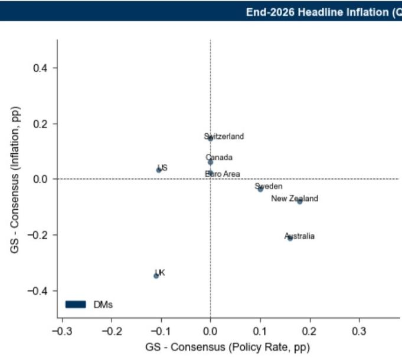  
Source: GS Global Investment Research, Bloomberg

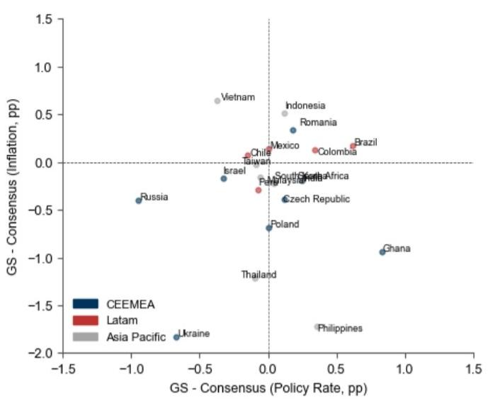

Exhibit 16: GS Inflation Forecasts vs. Central Bank and Bloomberg Consensus Forecasts

<table><tr><td rowspan="3"></td><td colspan="6">Headline Inflation (Q4/Q4), Percent Change</td></tr><tr><td colspan="2">End-2025</td><td colspan="2">End-2026</td><td colspan="2">End-2027</td></tr><tr><td>Actual****</td><td>GS</td><td>GS - Central Bank</td><td>GS - Consensus</td><td>GS</td><td>GS - Central Bank</td></tr><tr><td>Global*</td><td>2.8</td><td>3.5</td><td>NA</td><td>NA</td><td>2.3</td><td>NA</td></tr><tr><td colspan="7">Developed Economies</td></tr><tr><td>US</td><td>2.9</td><td>3.6</td><td>0.0</td><td>0.0</td><td>2.2</td><td>-0.1</td></tr><tr><td>Euro Area</td><td>2.1</td><td>3.2</td><td>-0.2</td><td>0.0</td><td>2.1</td><td>0.2</td></tr><tr><td>Japan***</td><td>1.4</td><td>2.8</td><td>0.5</td><td>NA</td><td>1.9</td><td>-0.1</td></tr><tr><td>UK</td><td>3.4</td><td>3.3</td><td>0.8</td><td>-0.3</td><td>1.8</td><td>-0.2</td></tr><tr><td>Canada</td><td>2.2</td><td>2.6</td><td>0.4</td><td>0.1</td><td>2.0</td><td>0.0</td></tr><tr><td>Australia</td><td>3.6</td><td>4.2</td><td>0.2</td><td>-0.2</td><td>2.0</td><td>-0.4</td></tr><tr><td>Switzerland</td><td>0.1</td><td>1.0</td><td>0.4</td><td>0.1</td><td>0.4</td><td>-0.2</td></tr><tr><td>Sweden</td><td>2.5</td><td>0.8</td><td>-0.1</td><td>0.0</td><td>1.6</td><td>-0.4</td></tr><tr><td>Hong Kong</td><td>1.3</td><td>2.3</td><td>NA</td><td>0.1</td><td>2.0</td><td>NA</td></tr><tr><td>New Zealand</td><td>3.1</td><td>3.4</td><td>-0.7</td><td>-0.1</td><td>1.5</td><td>-0.5</td></tr><tr><td colspan="7">Latam</td></tr><tr><td>Brazil</td><td>4.3</td><td>5.1</td><td>-0.1</td><td>0.2</td><td>4.3</td><td>0.6</td></tr><tr><td>Mexico</td><td>3.7</td><td>4.4</td><td>0.9</td><td>0.1</td><td>3.7</td><td>0.7</td></tr><tr><td>Colombia</td><td>5.1</td><td>6.5</td><td>0.1</td><td>0.1</td><td>4.6</td><td>0.9</td></tr><tr><td>Chile</td><td>3.4</td><td>4.0</td><td>0.3</td><td>0.1</td><td>2.9</td><td>-0.3</td></tr><tr><td>Peru</td><td>1.5</td><td>3.7</td><td>1.7</td><td>-0.3</td><td>2.4</td><td>NA</td></tr><tr><td colspan="7">CEEMEA</td></tr><tr><td>Russia</td><td>6.9</td><td>5.0</td><td>NA</td><td>-0.4</td><td>4.3</td><td>0.3</td></tr><tr><td>Turkiye</td><td>31.4</td><td>29.2</td><td>NA</td><td>NA</td><td>23.9</td><td>NA</td></tr><tr><td>Poland</td><td>2.4</td><td>2.6</td><td>0.3</td><td>-0.7</td><td>2.5</td><td>0.2</td></tr><tr><td>Israel</td><td>2.5</td><td>1.7</td><td>-0.3</td><td>-0.2</td><td>2.0</td><td>NA</td></tr><tr><td>Egypt</td><td>12.3</td><td>17.8</td><td>NA</td><td>1.9</td><td>9.1</td><td>NA</td></tr><tr><td>South Africa</td><td>3.6</td><td>4.4</td><td>0.7</td><td>-0.2</td><td>2.9</td><td>NA</td></tr><tr><td>Romania</td><td>9.7</td><td>6.0</td><td>0.5</td><td>0.3</td><td>2.7</td><td>-0.2</td></tr><tr><td>Czech Republic</td><td>2.1</td><td>2.4</td><td>-0.2</td><td>-0.4</td><td>1.9</td><td>-0.1</td></tr><tr><td>Hungary</td><td>3.9</td><td>1.0</td><td>-0.8</td><td>-3.4</td><td>2.6</td><td>0.3</td></tr><tr><td>Ukraine</td><td>9.3</td><td>7.0</td><td>1.0</td><td>-1.8</td><td>4.9</td><td>NA</td></tr><tr><td>Ghana</td><td>6.6</td><td>9.0</td><td>NA</td><td>-0.9</td><td>8.2</td><td>NA</td></tr><tr><td>Kazakhstan</td><td>12.4</td><td>10.8</td><td>NA</td><td>NA</td><td>7.6</td><td>NA</td></tr><tr><td colspan="7">Asia</td></tr><tr><td>Mainland China</td><td>0.6</td><td>0.9</td><td>NA</td><td>-0.2</td><td>1.1</td><td>NA</td></tr><tr><td>India</td><td>0.6</td><td>5.5</td><td>NA</td><td>-0.2</td><td>4.1</td><td>NA</td></tr><tr><td>South Korea</td><td>2.4</td><td>2.6</td><td>-0.1</td><td>-0.2</td><td>2.2</td><td>-0.1</td></tr><tr><td>Indonesia**</td><td>1.9</td><td>3.8</td><td>NA</td><td>0.5</td><td>2.2</td><td>NA</td></tr><tr><td>Taiwan</td><td>1.3</td><td>2.3</td><td>0.4</td><td>0.0</td><td>1.0</td><td>NA</td></tr><tr><td>Thailand****</td><td>-0.1</td><td>2.6</td><td>1.8</td><td>-1.2</td><td>2.1</td><td>NA</td></tr><tr><td>Philippines**</td><td>1.7</td><td>5.7</td><td>NA</td><td>-1.7</td><td>2.9</td><td>NA</td></tr><tr><td>Vietnam</td><td>3.4</td><td>5.3</td><td>NA</td><td>0.7</td><td>3.4</td><td>NA</td></tr><tr><td>Malaysia**</td><td>1.4</td><td>2.3</td><td>NA</td><td>-0.2</td><td>2.1</td><td>NA</td></tr></table>

Note: Red shading indicates GS forecast above consensus forecast or central bank forecast, and blue shading indicates GS forecast below consensus forecast or central bank forecast. \*Global inflation rate forecasts represent a GDP-weighted average of the economies with both consensus and central bank forecasts available. \*\* Forecasts are annual average of headline inflation. \*\*\* Forecasts are based on fiscal years (April 1st to March 31st). \*\*\*\* Forecasts are annual average of headline inflation without digital cash handout scheme. \*\*\*\*\*2023 actual values are GS tracking estimates when official data haven't released yet.

## DM Balance Sheet Policies

Exhibit 17: DM Central Bank Balance Sheet  
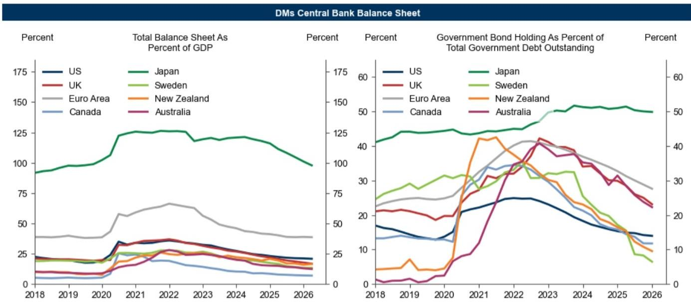  
Source: GS Global Investment Research, Haver Analytics

Exhibit 18: Balance Sheet Forecasts and Key Views

<table><tr><td>Economies</td><td>Current Size of Balance Sheet (as % of GDP)</td><td>Final Size of Balance Sheet (as % of GDP)</td><td>Expected Date to Reach Terminal Balance Sheet</td><td>Summary of Key Views</td></tr><tr><td>US</td><td>21%</td><td>21%</td><td>NA</td><td>Fed Chair Kevin Warsh has argued in favor of reducing the size of the Fed&#x27;s balance sheet. We are skeptical that there is support on the FOMC for large reductions, although more modest reductions due to changes in regulatory requirements that reduce demand for reserves are possible.</td></tr><tr><td>Euro Area</td><td>24%</td><td>NA</td><td>NA</td><td>- Quantitative TighteningWith reinvestments under the PEPP fully discontinued at the end of 2024, ECB balance sheet runoff is now at full speed, reaching about €40bn/month. Though the program is open-ended, the &quot;Governing Council stands ready to adjust all of its instruments [...] to preserve the smooth functioning of monetary policy transmission.&quot;- Minimum Required Reserves (MRR)The ECB decided to keep the MRR unchanged at 1%.- Framework ReviewAs central bank reserves gradually decline, the ECB is set to calibrate both long-term bank lending operations as well as the parameters of a structural bond holding portfolio.</td></tr><tr><td>UK</td><td>18%</td><td>10 - 15%</td><td>NA</td><td>- At its September 2025 meeting, The MPC voted to slow the pace of QT to £70bn in the year from October, down from £100bn in the current review cycle, implying that active sales will rise to £21bn (from £13bn) given lower redemptions. Both the pace of stock reduction and the change in the maturity split were in line with our expectations.</td></tr><tr><td>Canada</td><td>7%</td><td>7%</td><td>NA</td><td>- At its January 2025 meeting, the BoC announced its plan to complete its balance sheet normalization, ending QT. The Bank is gradually resuming asset purchases, starting with the resumption of its term repo program on March 5, so that its balance sheet stabilises and then grows in line with the economy.</td></tr></table>

Source: GS Global Investment Research

Thank you to Jamal Lawal, Intern on the Global Economics team, for his contributions to this report.

## Disclosure Appendix

## Reg AC

We, Jan Hatzius, Joseph Briggs, Sarah Dong and Megan Peters, hereby certify that all of the views expressed in this report accurately reflect our personal views, which have not been influenced by considerations of the firm's business or client relationships.

Unless otherwise stated, the individuals listed on the cover page of this report are analysts in GS' Global Investment Research division.

Contributing Authors: Jan Hatzius GS & Co. LLC, Joseph Briggs GS & Co. LLC, Sarah Dong GS & Co. LLC, Megan Peters GS International.

Unless otherwise stated, the individuals listed in the Contributing Authors disclosure of this report are analysts in GS' Global Investment Research division.

## Disclosures

## Regulatory disclosures

## Disclosures required by United States laws and regulations

See company-specific regulatory disclosures above for any of the following disclosures required as to companies referred to in this report: manager or co-manager in a pending transaction; 1% or other ownership; compensation for certain services; types of client relationships; managed/co-managed public offerings in prior periods; directorships; for equity securities, market making and/or specialist role. GS trades or may trade as a principal in debt securities (or in related derivatives) of issuers discussed in this report.

The following are additional required disclosures: Ownership and material conflicts of interest: GS policy prohibits its analysts, professionals reporting to analysts and members of their households from owning securities of any company in the analyst's area of coverage. Analyst compensation: Analysts are paid in part based on the profitability of GS, which includes investment banking revenues. Analyst as officer or director: GS policy generally prohibits its analysts, persons reporting to analysts or members of their households from serving as an officer, director or advisor of any company in the analyst's area of coverage. Non-U.S. Analysts: Non-U.S. analysts may not be associated persons of GS & Co. LLC and therefore may not be subject to FINRA Rule 2241 or FINRA Rule 2242 restrictions on communications with a subject company, public appearances and trading in securities covered by the analysts.

## Additional disclosures required under the laws and regulations of jurisdictions other than the United States

The following disclosures are those required by the jurisdiction indicated, except to the extent already made above pursuant to United States laws and regulations. Australia: GS Australia Pty Ltd and its affiliates are not authorised deposit-taking institutions (as that term is defined in the Banking Act 1959 (Cth)) in Australia and do not provide banking services, nor carry on a banking business, in Australia. This research, and any access to it, is intended only for “wholesale clients” within the meaning of the Australian Corporations Act, unless otherwise agreed by GS. In producing research reports, members of Global Investment Research of GS Australia may attend site visits and other meetings hosted by the companies and other entities which are the subject of its research reports. In some instances the costs of such site visits or meetings may be met in part or in whole by the issuers concerned if GS Australia considers it is appropriate and reasonable in the specific circumstances relating to the site visit or meeting. To the extent that the contents of this document contains any financial product advice, it is general advice only and has been prepared by GS without taking into account a client’s objectives, financial situation or needs. A client should, before acting on any such advice, consider the appropriateness of the advice having regard to the client’s own objectives, financial situation and needs. A copy of certain GS Australia and New Zealand disclosure of interests and a copy of GS’ Australian Sell-Side Research Independence Policy Statement are available at: https://www.goldmansachs.com/disclosures/australia-new-zealand/index.html. Brazil: Disclosure information in relation to CVM Resolution n. 20 is available at https://www.gs.com/worldwide/brazil/area/gir/index.html. Where applicable, the Brazil-registered analyst primarily responsible for the content of this research report, as defined in Article 20 of CVM Resolution n. 20, is the first author named at the beginning of this report, unless indicated otherwise at the end of the text. Canada: This information is being provided to you for information purposes only and is not, and under no circumstances should be construed as, an advertisement, offering or solicitation by GS & Co. LLC for purchasers of securities in Canada to trade in any Canadian security. GS & Co. LLC is not registered as a dealer in any jurisdiction in Canada under applicable Canadian securities laws and generally is not permitted to trade in Canadian securities and may be prohibited from selling certain securities and products in certain jurisdictions in Canada. If you wish to trade in any Canadian securities or other products in Canada please contact GS Canada Inc., an affiliate of The GS Group Inc., or another registered Canadian dealer. Hong Kong: Further information on the securities of covered companies referred to in this research may be obtained on request from GS (Asia) L.L.C. India: Further information on the subject company or companies referred to in this research may be obtained from GS (India) Securities Private Limited, Research Analyst - SEBI Registration Number INH000001493, 10th Floor, Ascent-Worli, Sudam Kalu Ahire Marg, Worli, Mumbai-400 025, India, Corporate Identity Number U74140MH2006FTC160634, Phone +91 22 6616 9000, Fax +91 22 6616 9001. GS may beneficially own 1% or more of the securities (as such term is defined in clause 2 (h) the Indian Securities Contracts (Regulation) Act, 1956) of the subject company or companies referred to in this research report. Registration granted by SEBI and certification from NISM in no way guarantee performance of the intermediary or provide any assurance of returns to investors. GS (India) Securities Private Limited compliance officer and investor grievance contact details, a copy of the annual compliance audit report and other relevant information and disclosures can be found at this link:

https://www.goldmansachs.com/worldwide/india/research-analyst. Japan: See below. Korea: This research, and any access to it, is intended only for “professional investors” within the meaning of the Financial Services and Capital Markets Act, unless otherwise agreed by GS. Further information on the subject company or companies referred to in this research may be obtained from GS (Asia) L.L.C., Seoul Branch. New Zealand: GS New Zealand Limited and its affiliates are neither “registered banks” nor “deposit takers” (as defined in the Reserve Bank of New Zealand Act 1989) in New Zealand. This research, and any access to it, is intended for “wholesale clients” (as defined in the Financial Advisers Act 2008) unless otherwise agreed by GS. A copy of certain GS Australia and New Zealand disclosure of interests is available at: https://www.goldmansachs.com/disclosures/australia-new-zealand/index.html. Russia: Research reports distributed in the Russian Federation are not advertising as defined in the Russian legislation, but are information and analysis not having product promotion as their main purpose and do not provide appraisal within the meaning of the Russian legislation on appraisal activity. Research reports do not constitute a personalized investment recommendation as defined in Russian laws and regulations, are not addressed to a specific client, and are prepared without analyzing the financial circumstances, investment profiles or risk profiles of clients. GS assumes no responsibility for any investment decisions that may be taken by a client or any other person based on this research report. Singapore: GS (Singapore) Pte. (Company Number: 198602165W), which is regulated by the Monetary Authority of Singapore, accepts legal responsibility for this research, and should be contacted with respect to any matters arising from, or in connection with, this research. Taiwan: This material is for reference only and must not be reprinted without permission. Investors should carefully consider their own investment risk. Investment results are the responsibility of the individual investor. United Kingdom: Persons who would be categorized as retail clients in the United Kingdom, as such term is defined in the rules of the Financial Conduct Authority, should read this research in conjunction with prior GS on the covered companies referred to herein and should refer to the risk warnings that have been sent to them by GS International. A copy of these risks warnings, and a glossary of certain financial terms used in this report, are available from GS International on request.

European Union and United Kingdom: Disclosure information in relation to Article 6 (2) of the European Commission Delegated Regulation (EU) (2016/958) supplementing Regulation (EU) No 596/2014 of the European Parliament and of the Council (including as that Delegated Regulation is implemented into United Kingdom domestic law and regulation following the United Kingdom's departure from the European Union and the European Economic Area) with regard to regulatory technical standards for the technical arrangements for objective presentation of investment recommendations or other information recommending or suggesting an investment strategy and for disclosure of particular interests or indications of conflicts of interest is available at https://www.gs.com/disclosures/europeanpolicy.html which states the European Policy for Managing Conflicts of Interest in Connection with Investment Research.

Japan: GS Japan Co., Ltd. is a Financial Instrument Dealer registered with the Kanto Financial Bureau under registration number Kinsho 69, and a member of Japan Securities Dealers Association, Financial Futures Association of Japan Type II Financial Instruments Firms Association, and Investment Management Association of Japan. Sales and purchase of equities are subject to commission pre-determined with clients plus consumption tax. See company-specific disclosures as to any applicable disclosures required by Japanese stock exchanges, the Japanese Securities Dealers Association or the Japanese Securities Finance Company.

## Global product; distributing entities

GS Global Investment Research produces and distributes research products for clients of GS on a global basis. Analysts based in GS offices around the world produce research on industries and companies, and research on macroeconomics, currencies, commodities and portfolio strategy. This research is disseminated in Australia by GS Australia Pty Ltd (ABN 21 006 797 897); in Brazil by GS do Brasil Corretora de Títulos e Valores Mobiliários S.A.; Public Communication Channel GS Brazil: 0800 727 5764 and / or contatogoldmanbrasil@gs.com. Available Weekdays (except holidays), from 9am to 6pm. Canal de Comunicação com o Público GS Brasil: 0800 727 5764 e/ou contatogoldmanbrasil@gs.com. Horário de funcionamento: segunda-feira à sexta-feira (exceto feriados), das 9h às 18h; in Canada by GS & Co. LLC; in Hong Kong by GS (Asia) L.L.C.; in India by GS (India) Securities Private Ltd.; in Japan by GS Japan Co., Ltd.; in the Republic of Korea by GS (Asia) L.L.C., Seoul Branch; in New Zealand by GS New Zealand Limited; in Russia by OOO GS; in Singapore by GS (Singapore) Pte. (Company Number: 198602165W); and in the United States of America by GS & Co. LLC. GS International has approved this research in connection with its distribution in the United Kingdom.

GS International (“GSI”), authorised by the Prudential Regulation Authority (“PRA”) and regulated by the Financial Conduct Authority (“FCA”) and the PRA, has approved this research in connection with its distribution in the United Kingdom.

European Economic Area: GS Bank Europe SE (“GSBE”) is a credit institution incorporated in Germany and, within the Single Supervisory Mechanism, subject to direct prudential supervision by the European Central Bank and in other respects supervised by German Federal Financial Supervisory Authority (Bundesanstalt für Finanzdienstleistungsaufsicht, BaFin) and Deutsche Bundesbank and disseminates research within the European Economic Area.

## General disclosures

This research is for our clients only. Other than disclosures relating to GS, this research is based on current public information that we consider reliable, but we do not represent it is accurate or complete, and it should not be relied on as such. The information, opinions, estimates and forecasts contained herein are as of the date hereof and are subject to change without prior notification. We seek to update our research as appropriate, but various regulations may prevent us from doing so. Other than certain industry reports published on a periodic basis, the large majority of reports are published at irregular intervals as appropriate in the analyst's judgment.

GS conducts a global full-service, integrated investment banking, investment management, and brokerage business. We have investment banking and other business relationships with a substantial percentage of the companies covered by Global Investment Research. GS & Co. LLC, the United States broker dealer, is a member of SIPC (https://www.sipc.org).

Our salespeople, traders, and other professionals may provide oral or written market commentary or trading strategies to our clients and principal trading desks that reflect opinions that are contrary to the opinions expressed in this research. Our asset management area, principal trading desks and investing businesses may make investment decisions that are inconsistent with the recommendations or views expressed in this research.

We and our affiliates, officers, directors, and employees will from time to time have long or short positions in, act as principal in, and buy or sell, the securities or derivatives, if any, referred to in this research, unless otherwise prohibited by regulation or GS policy.

The views attributed to third party presenters at GS arranged conferences, including individuals from other parts of GS, do not necessarily reflect those of Global Investment Research and are not an official view of GS.

Any third party referenced herein, including any salespeople, traders and other professionals or members of their household, may have positions in the products mentioned that are inconsistent with the views expressed by analysts named in this report.

This research is focused on investment themes across markets, industries and sectors. It does not attempt to distinguish between the prospects or performance of, or provide analysis of, individual companies within any industry or sector we describe.

Any trading recommendation in this research relating to an equity or credit security or securities within an industry or sector is reflective of the investment theme being discussed and is not a recommendation of any such security in isolation.

This research is not an offer to sell or the solicitation of an offer to buy any security in any jurisdiction where such an offer or solicitation would be illegal. It does not constitute a personal recommendation or take into account the particular investment objectives, financial situations, or needs of individual clients. Clients should consider whether any advice or recommendation in this research is suitable for their particular circumstances and, if appropriate, seek professional advice, including tax advice. The price and value of investments referred to in this research and the income from them may fluctuate. Past performance is not a guide to future performance, future returns are not guaranteed, and a loss of original capital may occur. Fluctuations in exchange rates could have adverse effects on the value or price of, or income derived from, certain investments.

Certain transactions, including those involving futures, options, and other derivatives, give rise to substantial risk and are not suitable for all investors. Investors should review current options and futures disclosure documents which are available from GS sales representatives or at https://www.theocc.com/about/publications/character-risks.jsp and https://www.goldmansachs.com/disclosures/cftc\_fcm\_disclosures. Transaction costs may be significant in option strategies calling for multiple purchase and sales of options such as spreads. Supporting documentation will be supplied upon request.

Differing Levels of Service provided by Global Investment Research: The level and types of services provided to you by GS Global Investment Research may vary as compared to that provided to internal and other external clients of GS, depending on various factors including your individual preferences as to the frequency and manner of receiving communication, your risk profile and investment focus and perspective (e.g.,

marketwide, sector specific, long term, short term), the size and scope of your overall client relationship with GS, and legal and regulatory constraints. As an example, certain clients may request to receive notifications when research on specific securities is published, and certain clients may request that specific data underlying analysts' fundamental analysis available on our internal client websites be delivered to them electronically through data feeds or otherwise. No change to an analyst's fundamental research views (e.g., ratings, price targets, or material changes to earnings estimates for equity securities), will be communicated to any client prior to inclusion of such information in a research report broadly disseminated through electronic publication to our internal client websites or through other means, as necessary, to all clients who are entitled to receive such reports.

All research reports are disseminated and available to all clients simultaneously through electronic publication to our internal client websites. Not all research content is redistributed to our clients or available to third-party aggregators, nor is GS responsible for the redistribution of our research by third party aggregators. For research, models or other data related to one or more securities, markets or asset classes (including related services) that may be available to you, please contact your GS representative or go to https://research.gs.com.

Disclosure information is also available at https://www.gs.com/research/hedge.html or from Research Compliance, 200 West Street, New York, NY 10282.

## © 2026 GS.

You are permitted to store, display, analyze, modify, reformat, and print the information made available to you via this service only for your own use. You may not resell or reverse engineer this information to calculate or develop any index for disclosure and/or marketing or create any other derivative works or commercial product(s), data or offering(s) without the express written consent of GS. You are not permitted to publish, transmit, or otherwise reproduce this information, in whole or in part, in any format to any third party without the express written consent of GS. This foregoing restriction includes, without limitation, using, extracting, downloading or retrieving this information, in whole or in part, to train or finetune a machine learning or artificial intelligence system, or to provide or reproduce this information, in whole or in part, as a prompt or input to any such system.